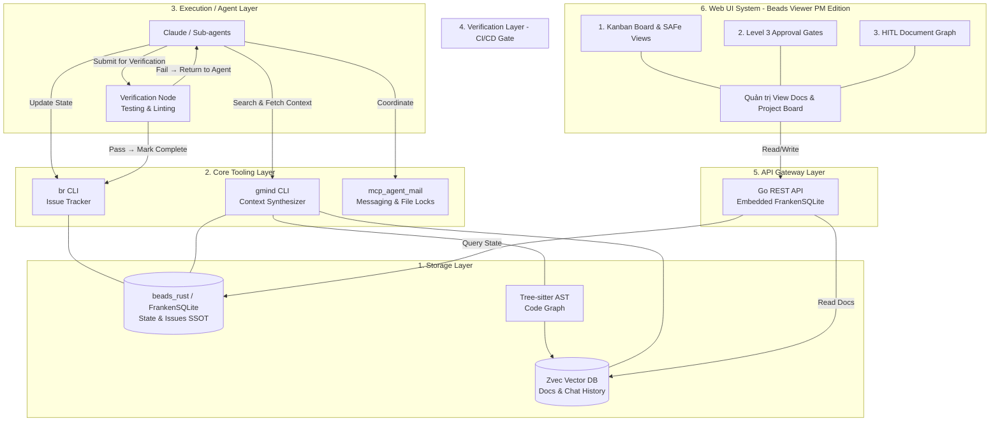

# PRD 01: Giới thiệu & Tổng quan Hệ thống (Executive Summary & Architecture)

## 1. Bối cảnh & Vấn đề (Problem Statement)

Trong quá trình vận hành các đội ngũ AI đa tác nhân (Multi-agent Swarms), các tác nhân thường rơi vào trạng thái "mất trí nhớ cục bộ" hoặc thiếu tầm nhìn toàn cục do:

1. **RAG truyền thống (Semantic) thiếu cấu trúc:** Tìm kiếm vector thuần túy làm vỡ cấu trúc tham chiếu (imports/calls) của mã nguồn.
2. **Trạng thái phân mảnh:** Không có sự liên kết tự động giữa Tài liệu Yêu cầu (PRD), Trạng thái Công việc (Issue/Task), và Dòng mã thực tế (Code/Git).
3. **Lãng phí Token:** Nhồi nhét toàn bộ lịch sử chat hoặc hàng ngàn dòng code vào context window làm chậm tốc độ phản hồi và tăng chi phí.
4. **Xung đột đa tác nhân:** Thiếu cơ chế khóa tệp (file lease) và giao tiếp đồng bộ dẫn đến việc nhiều tác nhân ghi đè code lẫn nhau.

## 2. Tổng quan Hệ thống (System Architecture)

Hệ thống `gmind` phân tách triệt để **5 lớp**: Dữ liệu (Storage — beads_rust/FrankenSQLite + Zvec), Giao thức kết nối (Routing/CLI), Thực thi (Agents), Xác minh (Verification CI/CD), và Trình bày (Presentation qua Go REST API).

## 3. Lớp Xác minh CI/CD (Verification Layer)

> ✅ **Đã áp dụng theo khuyến nghị PO:** AI Agent **không thể** tự ý đánh dấu Task Completion nếu Test chưa chạy pass.

Khi Agent hoàn tất Code, bắt buộc phải đẩy code qua **Verification Node** trước khi được phép gọi `br close`. Verification Node thực hiện:

1.  **Chạy Test tự động:** Unit Test, Integration Test (nếu có).
2.  **Linting & Format Check:** Đảm bảo code đúng chuẩn Go (`golangci-lint`, `gofmt`).
3.  **Kết quả:** Nếu **Pass** → Agent được phép Complete Task. Nếu **Fail** → Trả ngược về Agent để sửa lỗi.

## 4. Kiến trúc Giao diện Người dùng (Presentation Layer)

> ✅ **Đã áp dụng theo khuyến nghị PO:** Web UI giao tiếp với CSDL thông qua **Go REST API** (embedded FrankenSQLite) thay vì đọc trực tiếp, bảo vệ tính toàn vẹn dữ liệu.

Phiên bản **Beads Viewer PM Edition** đóng vai trò là một dự án mở rộng, tập trung vào trải nghiệm Người quản lý (Human-in-the-Loop Supervision) với các thành phần chính:

### 4.1. API Gateway (Lớp Bảo vệ Dữ liệu)

- Mọi request từ Web UI phải đi qua **Go REST API** (embedded FrankenSQLite).
- Gateway xác thực quyền truy cập, kiểm soát rate-limit, và đảm bảo tính toàn vẹn dữ liệu.
- **Không cho phép UI read/write trực tiếp vào FrankenSQLite/Zvec.**

### 4.2. Các Giao diện Quản trị (SAFe & Board Views)

- **Portfolio View:** Dành cho CEO/CTO xem Epic, Budget, Roadmap.
- **ART View:** Kanban tổng cho Orchestrator (RTE) / PMO quản lý.
- **Team View:** Bảng Kanban riêng rẽ cho từng Feature Team (VD: `Platform`, `Connectors`, `Quant`).
- **PI Planning Interactive UI:** Không gian tương tác cho lễ PI Planning. Bao gồm **Strategic Sandbox** (kéo thả rủi ro/bài toán để tính Capacity), **Business Value Scoring**, **ROAM Board** để xử lý rủi ro, và phím bấm **[Confidence Vote]** bắt buộc từ Human trước khi khởi chạy Sprint.

### 4.3. Cổng Phê duyệt Cấp 3 (Level 3 Approval Gates) & Không gian Phê duyệt

Giao diện chặn (Checkpoint) yêu cầu **Bắt buộc Phê duyệt bởi Con người** khi:

1.  **Chuyển Phase (Phase Boundaries):** Từ Planning (Continuous Exploration) sang Execution (Continuous Integration), hoặc qua Release.
2.  **The Ultimate Approval Panel:** Khi Agent đệ trình PR hoặc Task, Web UI gọp chung 4 luồng dữ liệu vào một màn hình duy nhất để Human xem xét: `Test Result (Từ Zvec QA Log)` + `Code Diff (AST/Git)` + `Beads ID (br-xxx)` + `PRD Requirements liên kết`.

### 4.4. Đồ thị Tài liệu & Lịch sử HITL (Human-in-the-Loop Document Graph)

- **Document Tree & Commit Lineage:** Hiển thị trực quan lịch sử thay đổi của một tài liệu dưới dạng cây đồ thị liên kết trực tiếp tới từng `git commit` và thuộc tính `beads ID`.
- **Knowledge Context Linking:** Trỏ ngược từ Yêu cầu (Requirement) sang các Tài liệu tham chiếu (Research references) đã được AI dùng làm Context, giúp con người dễ dàng bổ sung thêm tham chiếu để điều chỉnh Spec.

---

> **✅ GÓC NHÌN TỪ PRODUCT OWNER — ĐÃ ÁP DỤNG:**
>
> 1. ~~**Mảnh ghép CI/CD:**~~ → **Đã thêm Verification Layer (Lớp 4):** Execution Layer bắt buộc đẩy code qua Verification Node trước khi đánh dấu Task Completion. AI không thể tự ý Complete task nếu Test chưa chạy pass.
> 2. ~~**Kiến trúc Presentation Layer:**~~ → **Đã thêm API Gateway Layer (Lớp 5):** Web UI giao tiếp thông qua Go REST API (embedded FrankenSQLite) để bảo vệ tính toàn vẹn dữ liệu. Không cho phép UI read direct DB.
> 3. ~~**DoltDB làm SSOT:**~~ → **Đã chuyển sang beads_rust + FrankenSQLite** (2026-02-28): In-process MVCC, JSONL git-friendly sync, first-class SQL columns thay JSON blob. Xem [iteration-001-research.md](../iteration-reports/iteration-001-research.md).
