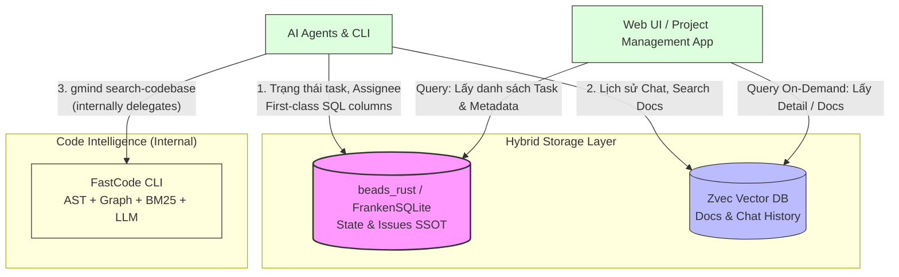
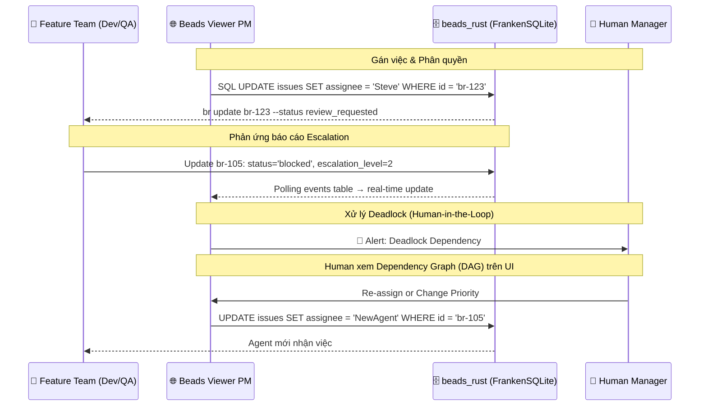
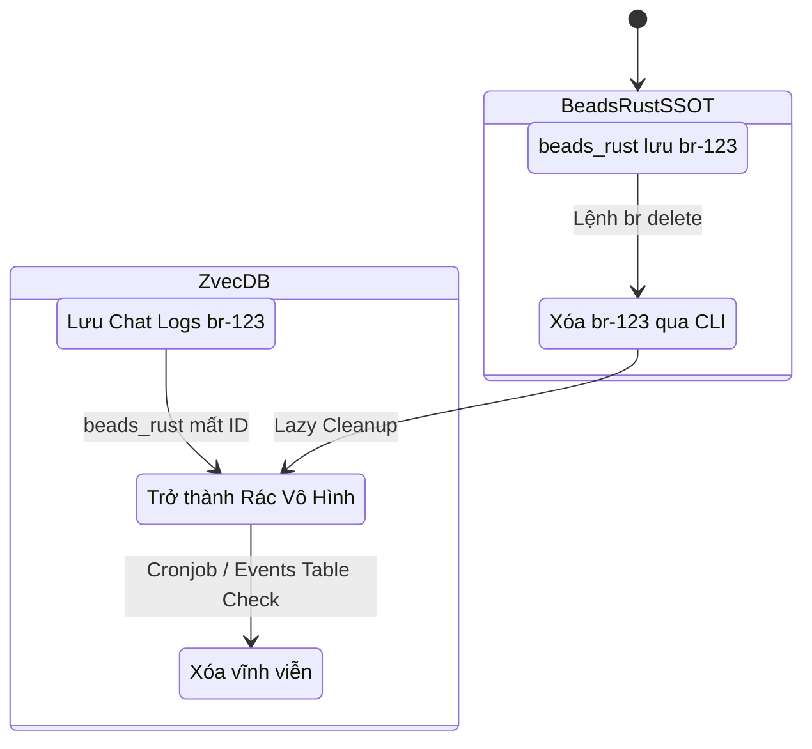

# PRD 02: Lớp Lưu trữ & Chiến lược Định danh (Storage Layer & Universal Tracking)

## 1. Lớp Lưu trữ (Storage Layer): Kiến trúc Hybrid SSOT

Lớp lưu trữ sử dụng cách tiếp cận Hybrid (Kết hợp) để lưu các loại bộ nhớ khác nhau, được tối ưu hóa cho độ trễ cực thấp (In-process / Local). Hệ thống sử dụng **beads_rust (FrankenSQLite)** làm Single Source of Truth (SSOT - Nguồn chân lý duy nhất) cho các tác vụ quản lý dự án, **Zvec DB** xử lý lưu trữ ngữ nghĩa cho docs/chat history, và **FastCode** (internal dependency của `gmind`) xử lý Code Intelligence.

> ✅ **Thay đổi kiến trúc (2026-02-28):** Chuyển từ DoltDB sang **beads_rust + FrankenSQLite**. Lý do: In-process MVCC concurrent writers, JSONL git-friendly sync (1 VCS thay 2), first-class SQL columns thay JSON blob, binary 5-8MB thay 30+MB. Xem [spike-frankensqlite-vs-doltdb.md](../researches/spikes/spike-frankensqlite-vs-doltdb.md).



**1. beads_rust & FrankenSQLite (Bộ nhớ Quy trình & Trạng thái):**

- Đóng vai trò là in-process SQL Database với MVCC concurrent writers. Lưu trữ trạng thái task (status), người được gán (assignee), thứ tự ưu tiên (priority).
- Lợi ích của FrankenSQLite: Hỗ trợ **page-level MVCC** (Nhiều Agent đọc/ghi đồng thời), **JSONL git-friendly sync** (Đồng bộ qua git như code thông thường), và **first-class SQL columns** (PM metadata là cột indexed, type-safe — không dùng JSON blob).
- Sync model: SQLite → JSONL export → git add/push. Clone project thì có luôn dữ liệu.

**2. Zvec (Bộ nhớ Ngữ nghĩa cho Docs & Chat / Semantic Memory):**

- CSDL Vector in-process lõi C++, thao tác trực tiếp trên RAM/Local Disk. Chứa file Markdown, Documentations, và History của các Agent.
- **Không còn** lưu trữ AST nodes hay code graph — chức năng này đã chuyển sang FastCode.

**3. Code Intelligence via FastCode (Bộ nhớ Cấu trúc / Structural Memory):**

- FastCode CLI (internal dependency của `gmind`) tự quản lý toàn bộ pipeline: Tree-sitter AST parsing → graph building → BM25/vector index → LLM iterative retrieval.
- Agent gọi `gmind search-codebase <query>`, gmind tự điều phối `fastcode index` + `fastcode query` bên trong.
- Cache index lưu tại `~/.fastcode/cache/` (local-only, rebuild-able).

---

## 2. Quản lý Project Tasks (PM Custom Fields) qua First-class SQL Columns

Để thiết lập hệ thống gán việc như một "JIRA thu nhỏ", beads_rust sử dụng **first-class SQL columns** thay vì JSON blob. Các trường PM là cột indexed, type-safe, queryable trực tiếp — hiệu năng tốt hơn `JSON_EXTRACT()`.

### Schema beads_rust — PM Fields

```sql
-- Bảng issues đã có sẵn trong beads_rust
CREATE TABLE issues (
    id TEXT PRIMARY KEY,
    title TEXT NOT NULL,
    status TEXT NOT NULL DEFAULT 'open',
    priority INTEGER NOT NULL DEFAULT 2,    -- 0=P0 Critical → 4=P4 Backlog
    assignee TEXT,                           -- Người được gán (first-class!)
    owner TEXT DEFAULT '',                   -- Chủ sở hữu task
    issue_type TEXT NOT NULL DEFAULT 'task', -- task, bug, feature, epic, ...
    -- ... (35+ cột khác)

    -- PM columns mở rộng (cần thêm qua migration)
    qa_status TEXT DEFAULT '',               -- PASSED, FAILED, PENDING
    qa_verified_by TEXT DEFAULT '',           -- CuongPT.QA
    test_logs_ref TEXT DEFAULT '',            -- zvec-doc-99281
    coverage TEXT DEFAULT '',                 -- 85%
    escalation_level INTEGER DEFAULT 0       -- 0: Auto, 1: Team, 2: Human, 3: Approval
);

-- Bảng dependencies riêng (first-class relational!)
CREATE TABLE dependencies (
    issue_id TEXT NOT NULL,
    depends_on_id TEXT NOT NULL,
    type TEXT NOT NULL DEFAULT 'blocks',   -- blocks, parent-child, related, ...
    FOREIGN KEY (issue_id) REFERENCES issues(id)
);
```

### So sánh paradigm: JSON blob (cũ) → SQL columns (mới)

| Thao tác        | ~~DoltDB (cũ)~~                                       | beads_rust (mới)                                      |
| --------------- | ----------------------------------------------------- | ----------------------------------------------------- |
| Gán assignee    | `JSON_SET(metadata, '$.assignee', 'Steve')`           | `UPDATE issues SET assignee = 'Steve'`                |
| Lọc theo role   | `JSON_EXTRACT(metadata, '$.role_required')`           | `SELECT * FROM labels WHERE label = 'role:developer'` |
| Xem blockers    | `JSON_EXTRACT(metadata, '$.dependencies.blocked_by')` | `SELECT * FROM dependencies WHERE type = 'blocks'`    |
| QA verification | `JSON_EXTRACT(metadata, '$.qa_verification.status')`  | `SELECT qa_status FROM issues WHERE id = ?`           |
| Escalation      | `JSON_EXTRACT(metadata, '$.escalation_level')`        | `SELECT escalation_level FROM issues WHERE id = ?`    |

### Luồng Hoạt động (Workflow) và Xử lý Xung đột qua Web UI



**Nguyên tắc thao tác:**

- PM metadata được lưu dưới dạng **first-class SQL columns** (indexed, type-safe) trên beads_rust.
- Web UI dùng `WHERE` clause trực tiếp để lọc, tìm kiếm và hiển thị dữ liệu — nhanh hơn `JSON_EXTRACT`.
- Cập nhật thông qua Go REST API → SQL `UPDATE` trực tiếp.
- Real-time updates qua **polling `events` table** mỗi 3-5 giây.

---

## 3. Universal Tracking Strategy (Chiến lược Định danh Duy nhất)

Trái tim của hệ thống liên kết là **Beads ID** (VD: `br-123`). Đây là Primary Key xuyên suốt mọi layer và 2 Cơ sở Dữ liệu.

- **mcp_agent_mail & File Leasing:** Agent dùng MCP khóa file với tham số `reason="br-123"`. Khởi tạo thảo luận nhóm dùng `thread_id="br-123"`.
- **Git Hook:** Mọi commit từ bot phải gắn label `#br-123`.

---

## 4. Chiến lược Đồng bộ (Sync) & Dọn Rác (Garbage Collection) giữa beads_rust và Zvec

Với việc lưu Data ở tận 2 nơi, rủi ro "Dữ liệu mồ côi (Orphaned Data)" (khi Agent xóa 1 Issue ở beads_rust nhưng Chat logs ở Zvec vẫn còn) có thể xảy ra. Để giải quyết, hãy sử dụng chiến lược **Lazy Cleanup (Dọn rác thủ động)**:



1. **Hiển thị Phụ thuộc (Lazy Lookup):** Web UI chỉ lấy Root ID từ **beads_rust**, sau đó lấy ID này để query Detail ở **Zvec**. Nếu beads_rust báo Node đã xóa, UI sẽ không bao giờ gọi ID rác đó trên Zvec, che đậy hoàn toàn Dữ liệu Mồ Côi khỏi mắt người dùng.
2. **Cronjob Dọn dẹp (Background Cleanup):**
   - Polling `events` table trong beads_rust để detect các issue bị xóa (event_type = 'deleted').
   - Truy xuất danh sách các record bị xóa và đẩy lệnh `delete()` hàng loạt sang Zvec để dọn dẹp RAM/Disk.
3. **Tuần tra Nén Lịch sử (Memory Compaction):** Zvec sẽ tự động thiết lập một tác nhân bảo trì (theo dõi các task lưu quá 30 ngày) để chạy tiến trình Summary Chat, nén dung lượng, và xóa các Logs rườm rà.

---

## 5. GitHub Sync Strategy — Cái gì đẩy lên git, cái gì ở local?

> ✅ **Nguyên tắc (2026-02-28):** Hệ thống chạy **local-first** trên máy Human (ThanhVV, HungBD). Server tập trung chỉ dành cho CI/CD và deploy. Mọi thứ có thể đẩy lên GitHub. Xem [spike-github-integration.md](../researches/spikes/spike-github-integration.md).

| Loại                                  | Sync lên GitHub?           | Lý do                                              |
| ------------------------------------- | -------------------------- | -------------------------------------------------- |
| `docs/` (PRDs, spikes, architecture)  | ✅ git-tracked             | Source of truth cho requirements                   |
| `.beads/issues.jsonl`                 | ✅ git-tracked             | SSOT cho Beads task state — FrankenSQLite là cache |
| `src/` (source code)                  | ✅ git-tracked             | Core codebase                                      |
| `.github/` (Actions workflows)        | ✅ git-tracked             | CI/CD pipeline                                     |
| `.agents/` (skills, workflows, rules) | ✅ git-tracked             | Agent configuration                                |
| `.beads/beads.db` (FrankenSQLite)     | ❌ local-only              | Cache — rebuild từ JSONL khi `git pull`            |
| Zvec DB                               | ❌ local-only              | Temp semantic index — rebuild via `gmind reindex`  |
| FastCode cache (`~/.fastcode/cache/`) | ❌ local-only              | Code index — rebuild via `gmind search-codebase`   |
| `.beads/config.yaml`, daemon files    | ❌ local-only (.gitignore) | Machine-specific config                            |

**Quy tắc commit:** Mọi commit PHẢI có `Beads-ID:` Git Trailer để link commit ↔ Beads task:

```
feat(storage): implement MVCC layer

Beads-ID: br-a1b2
```

Truy vấn ngược: `git log --all --grep='Beads-ID: br-a1b2'`.

---

> **✅ GÓC NHÌN TỪ PRODUCT OWNER — ĐÃ ÁP DỤNG:**
>
> 1. ~~**DoltDB + JSON blob:**~~ → **Đã chuyển sang beads_rust + FrankenSQLite** với first-class SQL columns. PM metadata (assignee, dependencies, qa_verification) là cột indexed thay vì JSON blob — hiệu năng query tốt hơn, type-safe.
> 2. ~~**Dolt Webhook cho real-time:**~~ → **Polling `events` table** mỗi 3-5 giây. Đơn giản, đủ cho MVP.
> 3. ~~**Cell-level merge:**~~ → **Page-level MVCC** đủ dùng cho single-machine multi-agent (mỗi agent được gán task riêng, rất hiếm khi sửa cùng 1 row).
> 4. ~~**`dolt diff` cho sync:**~~ → **`events` audit trail** + JSONL git diff thay thế.
> 5. ~~**Dolt Webhook cho GitHub sync:**~~ → **JSONL + git sync** (2026-02-28): FrankenSQLite + Zvec + FastCode cache local-only (rebuild-able). Commit convention: `Beads-ID:` Git Trailer. Xem [spike-github-integration.md](../researches/spikes/spike-github-integration.md).
> 6. ~~**Tree-sitter+Zvec cho Graph RAG:**~~ → **Đã chuyển sang FastCode CLI** (2026-02-28, internal dependency của gmind): `gmind search-codebase` tự điều phối code intelligence. Zvec thu hẹp scope: chỉ còn Docs & Chat History. Xem [spike-fastcode-cli-integration.md](../researches/spikes/spike-fastcode-cli-integration.md).
