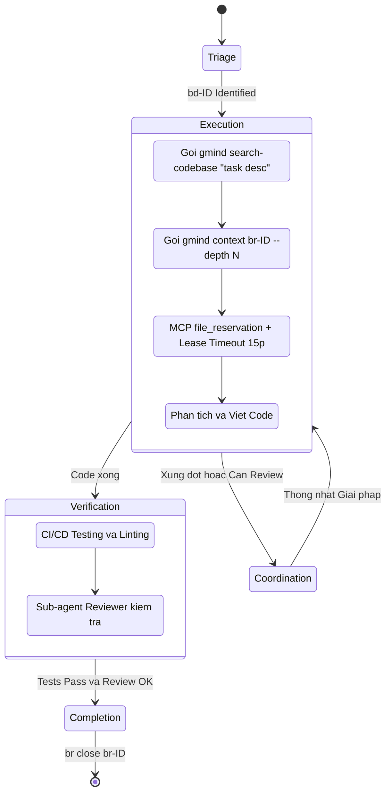

# PRD 03: Công cụ API Gateway & Agent Workflow (`gmind` CLI)

## 1. Công cụ `gmind` CLI (The Context API Gateway)

Viết bằng **Go (Golang)** theo Rule dự án, `gmind` là công cụ duy nhất LLM cần gọi để lấy Context.

- **`gmind search <query>`:**
  - Route query vào Zvec.
  - Trả kết quả Docs (PRDs, spikes, architecture, etc.) và Chat History.
  - **Không còn** trả AST Code snippet — chức năng code search đã chuyển sang `gmind search-codebase`.
- **`gmind search-codebase <query>`:** _(Mới — 2026-02-28)_
  - Orchestrator cho Code Intelligence. Tự điều phối FastCode bên trong:
    1. Kiểm tra `fastcode` binary có tồn tại (`exec.LookPath`)
    2. Kiểm tra và tự động chạy `fastcode index --no-embeddings .` nếu chưa có cache
    3. Gọi `fastcode query --repo . "<query>"` và trả kết quả
  - Flags: `--force-reindex` (bỏ cache), `--json`, `--debug`
  - > ✅ **Thiết kế (2026-02-28):** FastCode là **internal dependency** — Agent chỉ gọi `gmind search-codebase`, không gọi `fastcode` trực tiếp. Xem [spike-fastcode-cli-integration.md](../researches/spikes/spike-fastcode-cli-integration.md).
- **`gmind context <beads-id> [--depth N]`:**
  - Truy vấn hạt nhân. Gom toàn bộ Description (từ beads_rust/FrankenSQLite), Code context (qua `gmind search-codebase` nếu cần), và Discussion History (Từ Zvec) của 1 ID cụ thể.
  - Tự động nén định dạng đầu ra (ví dụ chuẩn TOON) để giảm token context window của Agent.
  - > ✅ **Đã áp dụng theo khuyến nghị PO:** Tham số `--depth N` cho phép Agent tùy chọn mức lấy ngữ cảnh. VD: `gmind context br-123 --depth 1` chỉ lấy code rễ, bỏ qua chat logs. Mặc định `--depth 0` lấy toàn bộ.
- **`gmind github <subcommand> <beads-id>`:** (wrapper `git` + `gh` CLI, chạy local-first)
  - `gmind github info br-xxx` — Tổng hợp: commits + PRs + CI status cho 1 Beads task.
  - `gmind github commits br-xxx` — Exec: `git log --all --grep='Beads-ID: br-xxx'`.
  - `gmind github prs br-xxx` — Exec: `gh pr list --search "br-xxx" --state all --json ...`.
  - `gmind github ci br-xxx` — Exec: `gh run list` + filter theo Beads ID.
  - > ✅ **Thêm mới (2026-02-28):** Không dùng Go API library — chỉ exec shell commands (`git`, `gh`). Zero dependencies. Xem [spike-github-integration.md](../researches/spikes/spike-github-integration.md).

## 2. Agent Workflow / Agent Skills

Các Agent (VD: Claude) sẽ được quy định hành vi nghiêm ngặt thông qua file `.agent/skills/project_memory/SKILL.md`.

- **Planning & Triage:** Agent dùng `bv --robot-triage` để lấy list task ưu tiên. Cấm agent gọi `--robot-*` nhằm tránh treo terminal.
- **Execution:** Bắt buộc gọi `gmind search-codebase "<task description>"` và `gmind context <id> --depth N` trước khi sửa code. Agent tùy chọn mức ngữ cảnh cần thiết.
- **File Locking & Lease Timeout:**
  - > ✅ **Đã áp dụng theo khuyến nghị PO:** Cơ chế **Lease Timeout** (Tự nhả khóa sau 15 phút) được bật mặc định. Web UI có tính năng **Lease Timeout Alert** (nhấp nháy báo động đỏ) để Human can thiệp: Kill session agent hoặc Release Lease thủ công.
  - Tương tác với `mcp_agent_mail file_reservation`, hiển thị trên Web UI (Agent Village).
- **Coordination (Agent Village UI):** Human có thể xem **Swarm Activity Feed** theo dõi dòng thời gian: agent nào khóa file `reason="br-123"`, gửi mail/giải quyết conflict nội bộ với agent nào thông qua `thread_id="br-123"`.
- **Verification:** Code bắt buộc qua CI/CD Testing & Linting trước khi được phép Complete.
- **Completion:** Commit với **`Beads-ID:` Git Trailer** (thay cho `#br-123`) và chạy `br close <id>`. Ví dụ: `git commit -m "feat(module): description" --trailer "Beads-ID: br-123"`. GitHub Autolinks tự động biến `br-123` thành link clickable.

## 3. Phân quyền Agent (Role-Based Authorization)

> ✅ **Đã áp dụng theo khuyến nghị PO:** Phân chia rõ quyền hạn giữa các loại Sub-agent.

| Vai trò Agent          | Quyền hạn                                               |
| ---------------------- | ------------------------------------------------------- |
| **Sub-agent Code**     | Chỉ có quyền thao tác Execution (code, test, file lock) |
| **Sub-agent Reviewer** | Có quyền đánh `br close`, approve merge, escalate       |

- Sub-agent Code **không được phép** tự ý gọi `br close`. Chỉ Sub-agent Reviewer mới có quyền đóng task sau khi kiểm tra.
- Cơ chế này đảm bảo nguyên tắc **Four-Eyes Principle** (Hai người duyệt) — Agent viết code ≠ Agent duyệt code.

---

> **✅ GÓC NHÌN TỪ PRODUCT OWNER — ĐÃ ÁP DỤNG:**
>
> 1. ~~**Quyền hạn của lệnh `gmind context`:**~~ → **Đã thêm tham số `--depth N`:** Agent tùy chọn mức lấy ngữ cảnh. `--depth 1` chỉ lấy code rễ, bỏ qua chat logs. Giải quyết vấn đề Context Window quá tải.
> 2. ~~**Chế độ Time-out cho FileLock & UI Alert:**~~ → **Đã thêm Lease Timeout 15p:** Tự nhả khóa sau 15 phút nếu Agent "chết lâm sàng". Web UI có Lease Timeout Alert (nhấp nháy đỏ) để Human can thiệp.
> 3. ~~**Phân quyền Agent (Authorizations):**~~ → **Đã thêm Section 3:** Sub-agent Code chỉ Execution, Sub-agent Reviewer mới có quyền `br close`. Áp dụng Four-Eyes Principle.
> 4. ~~**DoltDB context query:**~~ → **Đã chuyển sang beads_rust/FrankenSQLite** (2026-02-28): `gmind context` query FrankenSQLite embedded trực tiếp thay vì Dolt.
> 5. ~~**GitHub qua Go API library:**~~ → **Đã chuyển sang `git` + `gh` CLI** (2026-02-28): Thêm `gmind github` subcommands. Commit convention đổi từ `#br-123` → `Beads-ID: br-123` Git Trailer. Xem [spike-github-integration.md](../researches/spikes/spike-github-integration.md).
> 6. ~~**`gmind search` trả AST Code snippet (Zvec+Tree-sitter):**~~ → **Đã tách thành 2 lệnh** (2026-02-28): `gmind search` (docs/Zvec only) + `gmind search-codebase` (orchestrator tự gọi FastCode bên trong). Agent không gọi `fastcode` trực tiếp. Xem [spike-fastcode-cli-integration.md](../researches/spikes/spike-fastcode-cli-integration.md).
