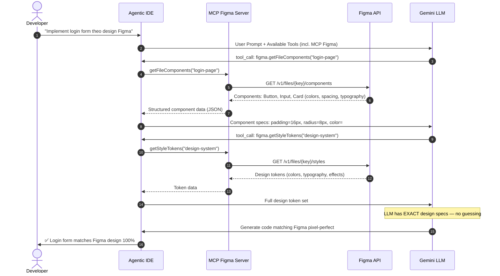
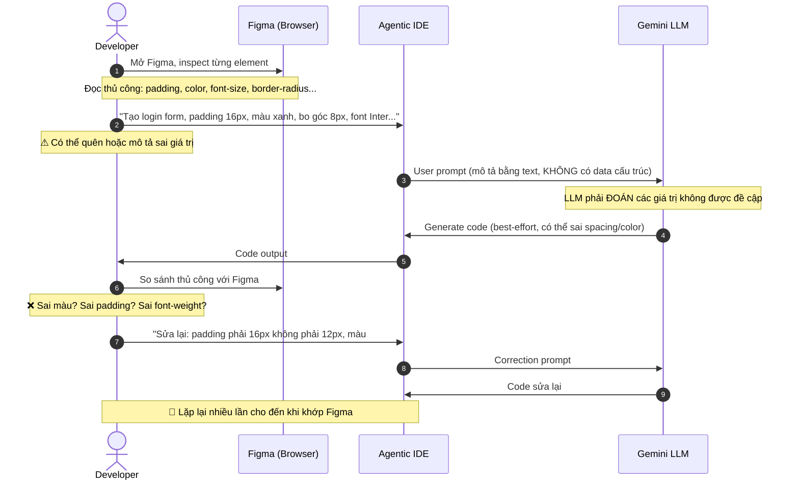
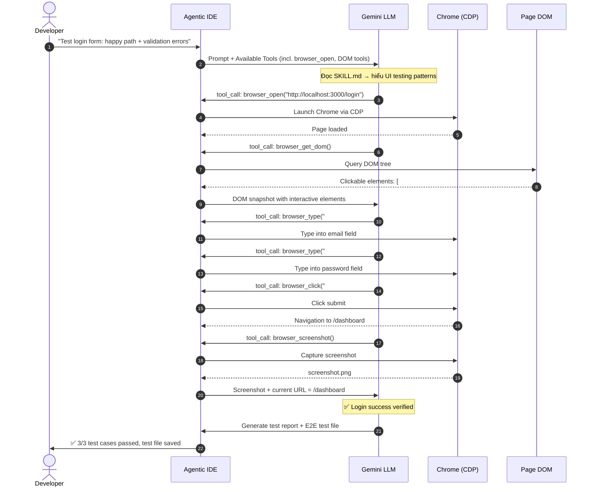
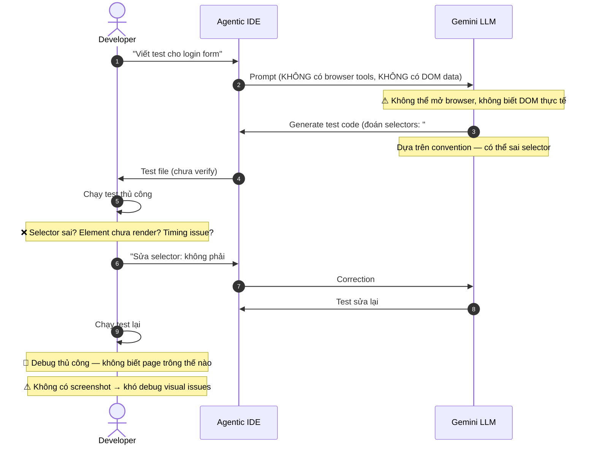

# PRD 00: Website Structure — Gmind Showcase

<!-- beads-id: br-prd-web-structure -->

> **Mục đích:** Tài liệu tham chiếu (Reference Document) mô tả toàn bộ cấu trúc trang, phần (section), và liên kết chéo (cross-links) của website showcase Gmind tại `gmind.gscfin.com`. Đây là "bản đồ" để các PRD khác tham chiếu khi đề cập đến một phần cụ thể trên website.

---

## 1. Cấu trúc Website (Site Map)

<!-- beads-id: br-prd-web-structure-s1 -->

Website Gmind Showcase gồm **5 trang cấp 1** (top-level pages) được liên kết bởi thanh điều hướng chính (Navbar) và 1 liên kết ngoài.

```
┌───────────────────────────────────────────────────────────────────────────┐
│                       NAVBAR (Điều hướng Toàn cục)                        │
│  ┌───────────┐ ┌───────────┐ ┌───────────┐ ┌───────────┐ ┌───────────┐    │
│  │ Trang chủ │ │ Kiến trúc │ │  Prompt   │ │ Nghiên cứu│ │  Design   │    │
│  │     /     │ │/architectu│ │ Palettes  │ │ /research │ │  System   │    │
│  │           │ │  re       │ │ /prompts  │ │           │ │ /design-  │    │
│  │           │ │           │ │           │ │           │ │  system   │    │
│  └───────────┘ └───────────┘ └───────────┘ └───────────┘ └───────────┘    │
│                                                       [GitHub link]  ↗    │
└───────────────────────────────────────────────────────────────────────────┘
```

### Cây Thư mục Routing (Next.js App Router)

```
apps/website/src/app/
├── page.tsx ..................... / (Trang chủ)
├── layout.tsx .................. RootLayout (Navbar + Footer)
├── globals.css
├── architecture/
│   └── page.tsx ................ /architecture
├── prompts/
│   └── page.tsx ................ /prompts (client-side, sidebar + viewer)
├── research/
│   └── page.tsx ................ /research
└── design-system/
    ├── layout.tsx .............. DesignSystemLayout (sidebar 3 cấp)
    ├── page.tsx ................ /design-system (Hub)
    ├── terminal/page.tsx ....... /design-system/terminal
    ├── git-graph/page.tsx ...... /design-system/git-graph
    ├── kanban/page.tsx ......... /design-system/kanban
    ├── knowledge-graph/page.tsx  /design-system/knowledge-graph
    ├── approval/page.tsx ....... /design-system/approval
    ├── timeline/page.tsx ....... /design-system/timeline
    ├── components/page.tsx ..... /design-system/components
    ├── doc-viewer/page.tsx ..... /design-system/doc-viewer
    ├── explorer/page.tsx ....... /design-system/explorer
    ├── beads-traversal/page.tsx  /design-system/beads-traversal
    ├── portfolio/page.tsx ...... /design-system/portfolio
    ├── pi-planning/page.tsx .... /design-system/pi-planning
    └── storyboard/
        ├── page.tsx ............ /design-system/storyboard (Tổng quan)
        └── [uc-xx]/page.tsx .... 10 trang use-case con
```

---

## 2. Trang chủ (`/`)

<!-- beads-id: br-prd-web-structure-s2 -->

```
┌───────────────────────────────────────────────────────────────────┐
│ TRANG CHỦ (/)                                                     │
│                                                                   │
│ ┌───────────────────────────────────────────────────────────────┐ │
│ │ [HERO] Gmind — Context Layer for Agentic Coding               │ │
│ │ Mô tả: gmind là tầng trung gian giữa Agentic IDE và           │ │
│ │ codebase — cung cấp và tối ưu ngữ cảnh cho AI Agent           │ │
│ └───────────────────────────────────────────────────────────────┘ │
│                          │                                        │
│                          ▼                                        │
│ ┌───────────────────────────────────────────────────────────────┐ │
│ │ [4 TRỤ CỘT] gmind.gscfin.com                                │   │
│ │  ┌──────────┐ ┌──────────┐ ┌──────────┐ ┌──────────┐        │   │
│ │  │A: FastCod│ │B: SSOT   │ │C: Xác    │ │D: Hệ sinh│        │   │
│ │  │  AST +   │ │Franken   │ │minh SAFe │ │thái Agent│        │   │
│ │  │ Graph RAG│ │ SQLite   │ │ Gate     │ │ Village  │        │   │
│ │  └──────────┘ └──────────┘ └──────────┘ └──────────┘        │   │
│ └───────────────────────────────────────────────────────────────┘ │
│                          │                                        │
│                   [Phân cách Section]                             │
│                          │                                        │
│                          ▼                                        │
│ ┌───────────────────────────────────────────────────────────────┐ │
│ │ [KIẾN TRÚC 5+1 LỚP] Lớp 1 > 2 > 3 > 4 > 5 > 6                 │ │
│ │ Lưu trữ > Công cụ > Agent > Xác minh > API > Giao diện        │ │
│ └───────────────────────────────────────────────────────────────┘ │
│                          │                                        │
│                   [Phân cách Section]                             │
│                          │                                        │
│                          ▼                                        │
│ ┌───────────────────────────────────────────────────────────────┐ │
│ │ [TẦNG TRUNG GIAN] gmind — Tầng Ngữ cảnh cho Agentic IDE       │ │
│ │ Người dùng+IDE > gmind (search/trace/context) > Agent         │ │
│ │                                                               │ │
│ │ [ĐƠN KHO MÃ] Tổ chức Không gian Làm việc                      │ │
│ │ cli/ > apps/ > packages/ > .agents/ > docs/                   │ │
│ └───────────────────────────────────────────────────────────────┘ │
└───────────────────────────────────────────────────────────────────┘
```

**Các section chính:**
| # | Section ID | Tên | Component |
|---|-----------|-----|-----------|
| 1 | `hero` | Hero Header | `SectionLabel` |
| 2 | `4-pillars` | 4 Trụ cột Cốt lõi | `PillarCard` x4 |
| 3 | `5+1-layers` | Kiến trúc 5+1 Lớp | `.arch-layer` x6 |
| 4 | `middle-layer` | gmind — Middle Layer | Flow diagram |
| 5 | `monorepo` | Monorepo Đa ngôn ngữ | `.path-tree` |

### 2.1. Sơ đồ Luồng Coding Agent ↔ LLM

<!-- beads-id: br-prd-web-structure-s2.1 -->

> Mô tả chi tiết cách Gemini CLI khởi tạo ngữ cảnh, chạy Agent Loop với LLM, và hoàn thành task.

```mermaid
sequenceDiagram
    autonumber
    actor User
    participant CLI as Gemini CLI
    participant FS as Local File System (.agents/)
    participant MCP_Server as MCP Servers
    participant LLM as Gemini LLM

    %% Initialization Phase
    Note over CLI,FS: 1. Initialization & Context Loading
    CLI->>FS: Load Project Codebase
    FS-->>CLI: Return file structure & metadata
    CLI->>FS: Load .agents/rules
    Note right of FS: Defines project guardrails, style, and behavior
    CLI->>FS: Load .agents/skills
    Note right of FS: Custom executable functions/tools
    CLI->>FS: Load .agents/workflows
    Note right of FS: Multi-step predefined processes
    CLI->>FS: Load .agents/MCP
    Note right of FS: Model Context Protocol configurations

    CLI->>MCP_Server: Initialize external tool/data connections via MCP
    Note over CLI: CLI builds system prompt & tool definitions

    %% Waiting Phase
    CLI->>User: Ready. Waiting for input...
    User->>CLI: Enter Prompt (e.g., "Implement a new feature")

    %% Agent Loop Phase
    Note over CLI,LLM: 2. Agent Loop (Process Prompt)
    CLI->>LLM: Send System Context (Rules, Available Tools) + User Prompt

    loop Until Task Complete
        LLM-->>CLI: LLM Response (Thought Process + Tool Call)

        alt Tool Call is a Skill/Workflow/MCP Action
            Note over CLI: Intercept tool call
            CLI->>FS: Read/Write files or Execute Skill
            FS-->>CLI: Local execution result
            CLI->>MCP_Server: Fetch external data / run MCP tool
            MCP_Server-->>CLI: MCP execution result
            CLI->>LLM: Send execution results back to LLM

        else Tool Call is retry_completion
            Note over LLM,CLI: Task finished or needs final verification
            LLM-->>CLI: tool_call: retry_completion
            Note over CLI: Loop terminates
        end
    end

    %% Completion Phase
    Note over CLI,User: 3. Completion
    CLI->>User: Display final response / Code applied successfully
```



### 2.2. Hai Nguyên lý Cốt lõi của Agentic Coding

<!-- beads-id: br-prd-web-structure-s2.2 -->

> Khi hiểu rõ bản chất vòng lặp Agent Loop (Section 2.1), hai nguyên lý sau đây quyết định hiệu quả thực tế của Agentic Coding.

#### Nguyên lý 1: Tái sử dụng Tri thức (Knowledge Reuse)

**Vấn đề:** Cách tiếp cận truyền thống yêu cầu developer **mỗi lần** phải:

- Copy prompt mẫu (prompt engineering) vào chat window
- Tự quản lý thứ tự workflow trong đầu
- Nhớ các ràng buộc, coding standards, naming conventions

**Giải pháp:** Đưa toàn bộ tri thức này vào hệ thống tệp `.agents/` để **tái sử dụng tự động**:

```
.agents/
├── rules/          ← Guardrails, coding style, constraints
│                     (Tự động nạp mỗi phiên — developer không cần nhắc lại)
├── skills/         ← Hàm/công cụ chuyên biệt (prompt + hướng dẫn đóng gói)
│                     (Agent đọc SKILL.md khi cần — on-demand, không chiếm context)
└── workflows/      ← Quy trình đa bước có cấu trúc
                      (Slash command kích hoạt — đảm bảo thứ tự + chất lượng)
```

**Cốt lõi:** Thay vì prompt engineering **mỗi lần**, ta prompt engineering **một lần** rồi đóng gói thành tài sản tái sử dụng. Workflow đảm bảo thứ tự thực thi nhất quán mà không phụ thuộc vào trí nhớ con người.

#### Nguyên lý 2: Mở rộng Năng lực qua Tool Call — và Kỷ luật Ngữ cảnh

**Bản chất:** Agentic IDE cung cấp cho LLM khả năng **hành động** (không chỉ trả lời) thông qua tool calls:

| Loại Tool Call          | Ví dụ                                           | Đặc điểm                                     |
| ----------------------- | ----------------------------------------------- | -------------------------------------------- |
| **Built-in (mặc định)** | `grep`, `edit_file`, `list_folder`, `view_file` | Luôn có sẵn, không cấu hình                  |
| **MCP Servers**         | Database queries, API calls, external services  | Mở rộng qua cấu hình `.agents/MCP`           |
| **Skills / Bash**       | Chạy script, gọi CLI, tạo file phức tạp         | Linh hoạt tối đa — LLM tự sáng tạo cách dùng |

**Sức mạnh:** Kết hợp 3 loại tool call cho phép LLM mở rộng gần như không giới hạn — đọc/ghi code, truy vấn database, gọi API, chạy test, deploy.

**Hạn chế cần hiểu rõ:**

- **Context window có giới hạn** → Skills/Rules phải **ngắn gọn và vừa đủ** (không nhồi nhét)
- **Hallucination tăng khi context loãng** → Mỗi skill nên tập trung 1 nhiệm vụ, tránh đa mục đích
- **Workflow giải quyết bài toán phối hợp** → Thay vì 1 prompt khổng lồ, chia thành nhiều bước nhỏ có kiểm soát

**Công thức tối ưu:**

```
Hiệu quả = (Rules ngắn gọn) + (Skills chuyên biệt) + (Workflows phối hợp)
           ÷ (Context window tiêu thụ)
```

> **Nguyên tắc vàng:** Ngắn gọn + Vừa đủ = Linh hoạt cao. Thừa context = Hallucination. Thiếu context = Agent không hiểu yêu cầu.

### 2.3. Minh hoạ Sức mạnh: MCP Figma & UI Testing Skill

<!-- beads-id: br-prd-web-structure-s2.3 -->

> 4 sơ đồ sequence so sánh trước/sau khi áp dụng MCP và Agent Skill — minh hoạ trực quan cho Nguyên lý 1 và Nguyên lý 2.

#### A. MCP Figma — CÓ MCP

Khi có MCP Figma, LLM **trực tiếp** đọc design tokens, component specs, spacing, colors từ file Figma — không cần developer copy-paste bất kỳ thông tin nào.



#### B. KHÔNG CÓ MCP Figma

Không có MCP, developer phải **tự đọc Figma**, copy-paste từng giá trị, và mô tả bằng lời — dễ sai, tốn thời gian, LLM phải đoán.



#### C. UI Testing — CÓ Agent Skill + Browser Tools

Khi có Skill UI Testing + browser tools (Chrome CDP), LLM **tự mở browser**, đọc DOM, tạo actions (click, type, scroll, assert), chạy test tự động — không cần developer viết test thủ công.



#### D. UI Testing — KHÔNG CÓ Skill + Browser Tools

Không có browser tools, developer viết E2E test thủ công, LLM chỉ có thể "đoán" DOM structure, không thể verify kết quả.



---

## 3. Kiến trúc (`/architecture`)

<!-- beads-id: br-prd-web-structure-s3 -->

```
┌───────────────────────────────────────────────────────────────────┐
│ KIẾN TRÚC (/architecture)                                         │
│                                                                   │
│ ┌───────────────────────────────────────────────────────────────┐ │
│ │ [SƠ ĐỒ LUỒNG] Kiến trúc Agentic SE                         │    │
│ │                                                               │ │
│ │    ┌────────────────┐                                         │ │
│ │    │ Chuyên gia     │ (Lập trình viên)                        │ │
│ │    └───────┬────────┘                                         │ │
│ │            │                                                  │ │
│ │    ┌───────┴────────┐                                         │ │
│ │    │ GSAFe 6.0      │ (Quy trình)                             │ │
│ │    └───────┬────────┘                                         │ │
│ │            │                                                  │ │
│ │    ┌───────┴────────┐                                         │ │
│ │    │ gmind          │ (Tầng Bộ nhớ Agent) [TRUNG TÂM]         │ │
│ │    └───┬────────┬───┘                                         │ │
│ │        │        │                                             │ │
│ │   ┌────┴────┐ ┌─┴──────────┐                                  │ │
│ │   │Mã nguồn│ │ Mô hình LLM│                                  │  │
│ │   └────────┘ └────────────┘                                   │ │
│ └───────────────────────────────────────────────────────────────┘ │
│                          │                                        │
│                   [Phân cách Section]                             │
│                          │                                        │
│                          ▼                                        │
│ ┌───────────────────────────────────────────────────────────────┐ │
│ │ [5+1 LỚP CHI TIẾT] Ma trận toàn bộ 6 lớp kiến trúc            │ │
│ │ Mỗi lớp có: tech stack, danh mục chi tiết, màu nhấn           │ │
│ └───────────────────────────────────────────────────────────────┘ │
└───────────────────────────────────────────────────────────────────┘
```

**Các section chính:**
| # | Section ID | Tên | Data Source |
|---|-----------|-----|-------------|
| 1 | `flow-diagram` | Sơ đồ Luồng: Chuyên gia → GSAFe → gmind → Mã nguồn/LLMs | `flowNodes[]` + `bottomNodes[]` |
| 2 | `5+1-layers-detail` | Kiến trúc 5+1 Lớp Chi tiết | `layers[]` (6 items) |

---

## 4. Prompt Palettes (`/prompts`)

<!-- beads-id: br-prd-web-structure-s4 -->

Trang có layout 2 cột: Sidebar trái (300px) + Content phải. Nội dung chuyển đổi theo 4 `activeSection`:

```
┌─────────────┬────────────────────────────────────────────────────────┐
│ THANH BÊN   │ VÙNG NỘI DUNG                                          │
│ (cố định)   │                                                        │
│             │  ┌──────────────────────────────────────────────────┐  │
│ CÀI ĐẶT     │  │ [Trình xem Cài đặt] hoặc [Trình xem Lý thuyết]   │  │
│ ────────    │  │ hoặc [Trình xem Workflow] hoặc [Nghiên cứu]      │  │
│ > Cài đặt   │  │                                                  │  │
│   toàn diện │  │ Component: PromptViewer                          │  │
│             │  └──────────────────────────────────────────────────┘  │
│ LÝ THUYẾT  │                                                         │
│ KỸ THUẬT PM│                                                         │
│ ────────    │                                                        │
│ > Agile và  │                                                        │
│   Scrum     │                                                        │
│ > XP cho    │                                                        │
│   Agentic   │                                                        │
│ > SAFe 6.0  │                                                        │
│             │                                                        │
│ AI WORKFLOW │                                                        │
│ ────────    │                                                        │
│ A. Khởi tạo │                                                        │
│   > A.1..   │                                                        │
│ B. One-shot │                                                        │
│   > B.1..   │                                                        │
│ C. XP       │                                                        │
│   Agentic   │                                                        │
│   > C.1..   │                                                        │
│ D. SAFe 6.0 │                                                        │
│   > D.1     │                                                        │
│             │                                                        │
└─────────────┴────────────────────────────────────────────────────────┘
```

### 4.1. Sidebar Structure (PromptsSidebar)

| Category         | Menu Items                   | Hash Route           |
| ---------------- | ---------------------------- | -------------------- |
| **CÀI ĐẶT**      | Installation (8 bước)        | `#setup-full-stack`  |
| **LÝ THUYẾT SE** | Vì sao chọn Agile & Scrum?   | `#theory-agile`      |
|                  | XP cho Agentic Coding        | `#theory-xp-agentic` |
|                  | Vận hành SAFe 6.0 với GSAFe? | `#theory-safe`       |
| **AI WORKFLOWS** | A. Khởi tạo Projects (4 wf)  | `#wf-*`              |
|                  | B. One-shot AI Coding (2 wf) | `#wf-*`              |
|                  | C. XP Agentic Coding (13 wf) | `#wf-*`              |
|                  | D. SAFe 6.0 AgenticSE (1 wf) | `#wf-*`              |

### 4.2. Theory Sub-sections (Agile)

| Sub-item ID              | Title                          |
| ------------------------ | ------------------------------ |
| `#agile-intro`           | 3.1 Giới thiệu chung           |
| `#agile-vs-waterfall`    | 3.2 So sánh Agile và Waterfall |
| `#agile-principles`      | 3.3 Bốn Nguyên tắc cốt lõi     |
| `#agile-method-scrum`    | 3.4 Phương pháp Scrum          |
| `#agile-method-kanban`   | 3.5 Kanban / Lean              |
| `#agile-method-xp`       | 3.6 XP - Tổng quan             |
| `#agile-method-aup-dad`  | 3.7 AUP & DAD                  |
| `#agile-method-dsdm-fdd` | 3.8 DSDM & FDD                 |
| `#agile-method-tdd-rad`  | 3.9 TDD & RAD                  |

---

## 5. Nghiên cứu (`/research`)

<!-- beads-id: br-prd-web-structure-s5 -->

```
┌───────────────────────────────────────────────────────────────────┐
│ NGHIÊN CỨU (/research)                                            │
│                                                                   │
│ ┌───────────────────────────────────────────────────────────────┐ │
│ │ [TIÊU ĐỀ] Nghiên cứu và Spike                                 │ │
│ │ "16 Spike + 6 PRD trước khi viết dòng code đầu tiên"          │ │
│ └───────────────────────────────────────────────────────────────┘ │
│                          │                                        │
│                          ▼                                        │
│ ┌───────────────────────────────────────────────────────────────┐ │
│ │ [TẤT CẢ MỤC] researchItems[]                                │   │
│ │  ┌──────┐ ┌──────┐ ┌──────┐ ┌──────┐                        │   │
│ │  │ PRD  │ │Spike │ │Spike │ │ ...  │                        │   │
│ │  │Loại  │ │Loại  │ │Loại  │ │      │                        │   │
│ │  │Tr.thá│ │Tr.thá│ │Tr.thá│ │      │                        │   │
│ │  └──────┘ └──────┘ └──────┘ └──────┘                        │   │
│ │  [StatusBadge] [TypeBadge] cho mỗi mục                      │   │
│ └───────────────────────────────────────────────────────────────┘ │
└───────────────────────────────────────────────────────────────────┘
```

**Nguồn dữ liệu:** `src/data/research-data.ts` → `researchItems[]`

---

## 6. Design System (`/design-system`)

<!-- beads-id: br-prd-web-structure-s6 -->

Trang Design System có layout riêng (`DesignSystemLayout`) với sidebar 3 cấp (Danh mục → Mục chính → Mục con) và 13+ trang con.

```
┌──────────────┬───────────────────────────────────────────────────────┐
│ THANH BÊN DS │ VÙNG NỘI DUNG                                         │
│  (3 cấp)     │                                                       │
│              │  [Hub] hoặc [Trang con tương ứng]                     │
│              │                                                       │
│ > HỆ THỐNG  │  ┌─────────────────────────────────────────────────┐   │
│   THIẾT KẾ  │  │ Trang Hub (/design-system)                      │   │
│   > Hub     │  │  [Tokens]  [Thành phần]  [Trạng thái]  [Luồng]  │   │
│     #màu    │  │  [11 Thẻ màn hình --> trang con]                │   │
│     #kc     │  └─────────────────────────────────────────────────┘   │
│     #font   │                                                        │
│     ...     │                                                        │
│              │                                                       │
│ > MÀN HÌNH  │                                                        │
│   > Terminal│                                                        │
│   > Danh mục│                                                        │
│   > PI Plan │                                                        │
│   > Đồ thị │                                                         │
│   > Kanban  │                                                        │
│   > Tri thức│                                                        │
│   > Phê duyệ│                                                        │
│   > Dòng th.│                                                        │
│   > Thành ph│                                                        │
│              │                                                       │
│ > KHÁM PHÁ  │                                                        │
│   > Trình xe│                                                        │
│   > Gmind Ex│                                                        │
│   > Beads   │                                                        │
│              │                                                       │
│ > KỊCH BẢN  │                                                        │
│   > Tổng qua│                                                        │
│     UC-01   │                                                        │
│     ...10   │                                                        │
└──────────────┴───────────────────────────────────────────────────────┘
```

### 6.1. Design System Sidebar (4 Danh mục)

| Danh mục        | Mục chính           | Mục con                                                                                                                                                                                   |
| --------------- | ------------------- | ----------------------------------------------------------------------------------------------------------------------------------------------------------------------------------------- |
| **Hệ thống TK** | Hub                 | #colors, #spacing, #typography, #animations, #cards, #buttons, #badges, #grid-layout, #states, #flows                                                                                     |
| **Màn hình**    | Terminal            | #default, #mosaic                                                                                                                                                                         |
|                 | Portfolio View      | —                                                                                                                                                                                         |
|                 | PI Planning Sandbox | —                                                                                                                                                                                         |
|                 | Git Graph           | #gitflow, #multi-agent, #hotfix, #release-train, #monorepo, #beads-prd-trace, #beads-deadlock, #beads-ds-comp, #beads-traversal, #beads-sprint-review                                     |
|                 | Kanban              | #sprint, #release, #bug-triage                                                                                                                                                            |
|                 | Knowledge Graph     | #simple, #ecosystem, #sprint                                                                                                                                                              |
|                 | Phê duyệt & RTM     | #panels, #rtm, #heatmap                                                                                                                                                                   |
|                 | Timeline            | #file-lease, #activity-feed, #sprint-day                                                                                                                                                  |
|                 | Components          | #buttons, #badges, #progress, #avatar, #modal, #dropdown, #accordion, #tabs, #table, #tooltip, #codeblock, #cards, #promptcard, #labels, #statusdot, #skeleton, #emptystate, #errorbanner |
| **Khám phá**    | Doc Viewer          | —                                                                                                                                                                                         |
|                 | Gmind Explorer      | #doc, #commit, #task, #adr, #chat, #spike                                                                                                                                                 |
|                 | Beads Traversal     | #prd-section, #plan, #task, #commit                                                                                                                                                       |
| **Kịch bản**    | Tổng quan           | UC-01 → UC-10 (10 kịch bản sử dụng)                                                                                                                                                       |

---

## 7. Liên kết giữa các Trang & Sections

<!-- beads-id: br-prd-web-structure-s7 -->

### 7.1. Biểu đồ Liên kết Toàn cục (Cross-Page Link Map)

```
                      ┌───────────────┐
                      │   TRANG CHỦ   │
                      │      /        │
                      └───┬───────┬───┘
                          │       │
          ┌───────────────┘       └───────────────┐
          │                                       │
          ▼                                       ▼
┌──────────────────┐                   ┌──────────────────┐
│    KIẾN TRÚC     │                   │  PROMPT PALETTES│
│  /architecture   │                   │    /prompts│
└────────┬─────────┘                   └──┬───────────┬───┘
         │                             │              │
         │    ┌──────────────────┐        │           │
         │    │   NGHIÊN CỨU     │◄────────┘          │
         │    │   /research      │                    │
         │    └────────┬────────┘                     │
         │             │                              │
         ▼             ▼                              ▼
┌──────────────────────────────────────────────────────────┐
│                     DESIGN SYSTEM                        │
│                    /design-system                        │
│  ┌───────┐ ┌───────┐ ┌───────┐ ┌───────┐ ┌───────┐       │
│  │Termina│ │Đồ thị │ │Kanban │ │Tri thứ│ │Phê duy│ ...   │
│  │   l   │ │  Git  │ │       │ │  c    │ │  ệt   │       │
│  └───────┘ └───────┘ └───────┘ └───────┘ └───────┘       │
│  ┌───────┐ ┌───────┐ ┌───────┐ ┌──────────────┐          │
│  │Dòng   │ │Thành  │ │Khám   │ │  Kịch bản    │          │
│  │thời gi│ │ phần  │ │ phá   │ │  (10 UCs)    │          │
│  └───────┘ └───────┘ └───────┘ └──────────────┘          │
└──────────────────────────────────────────────────────────┘
```

### 7.2. Mối liên kết Logic giữa các Nội dung

```
┌──────────────────────────────────────────────────────────────────┐
│ MỐI LIÊN KẾT LOGIC GIỮA CÁC NỘI DUNG                             │
│                                                                  │
│  /prompts#theory-agile ──────────────────────┐                   │
│  (Lý thuyết Agile)                           │                   │
│       │                                      │                   │
│       │ tham chiếu                           │ nền tảng          │
│       ▼                                      ▼                   │
│  /prompts#theory-xp-agentic            /prompts#theory-safe      │
│  (XP cho Agentic Coding)               (SAFe 6.0 với GSAFe)      │
│       │                                      │                   │
│       │ thực hành                            │ quy trình         │
│       ▼                                      ▼                   │
│  /prompts (AI Workflows)              /research                  │
│  Nhóm C: XP Agentic (13 wf)          (Báo cáo Spike + PRDs)      │
│       │                                      │                   │
│       │ trình diễn                           │ xác nhận          │
│       ▼                                      ▼                   │
│  /architecture                         /design-system            │
│  (Luồng Agentic SE)                   (Bản mẫu UI)               │
│       │                                      │                   │
│       └───────────── ánh xạ ─────────────────┘                   │
│  /design-system/storyboard (UC-01..UC-10)                        │
│  /design-system/beads-traversal (PRD-->Kế hoạch-->Task-->Commit) │
│  /design-system/approval (RTM + Bản đồ nhiệt)                    │
└──────────────────────────────────────────────────────────────────┘
```

### 7.3. Bảng Chi tiết Liên kết Chéo (Cross-Reference Table)

| Trang Nguồn                      | Section/Anchor  | Liên kết đến                         | Mục đích                    |
| -------------------------------- | --------------- | ------------------------------------ | --------------------------- |
| `/` (Hero)                       | 4 Trụ cột       | `/architecture`                      | Chi tiết từng lớp kiến trúc |
| `/` (Hero)                       | Middle Layer    | `/prompts#setup-full-stack`          | Hướng dẫn cài đặt           |
| `/architecture`                  | Sơ đồ Luồng     | `/design-system/terminal`            | Demo CLI output             |
| `/architecture`                  | 5+1 Lớp         | `/design-system/kanban`              | UI Quản trị                 |
| `/prompts`                       | Lý thuyết Agile | `/prompts#theory-xp-agentic`         | Đào sâu XP                  |
| `/prompts`                       | Lý thuyết SAFe  | `/research`                          | Báo cáo Spike bổ trợ        |
| `/prompts`                       | AI Workflows    | `/design-system/storyboard`          | Demo kịch bản tương tác     |
| `/research`                      | Thẻ Spike       | `/design-system/doc-viewer`          | Duyệt nội dung file gốc     |
| `/design-system`                 | Thẻ Hub         | `/design-system/*`                   | Các trang con chi tiết      |
| `/design-system/storyboard`      | UC-01..UC-10    | `/design-system/kanban`, `/approval` | Trình diễn luồng đầu-cuối   |
| `/design-system/beads-traversal` | Truy vết        | `/design-system/approval#heatmap`    | Tổng quan độ phủ            |

---

> Document maintained by AI Agent (`arch-review-prd-after-design-system` workflow).
> _Generated with /ascii_
