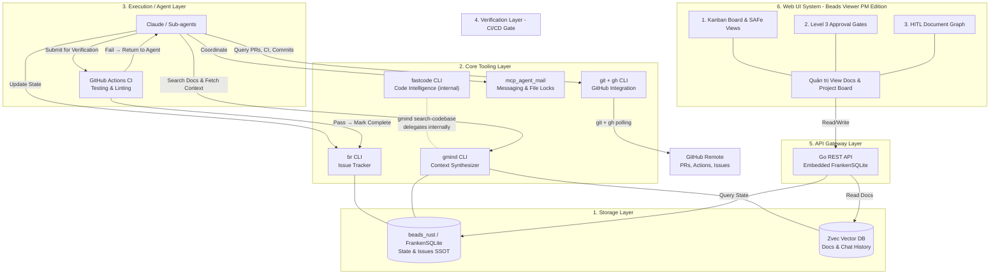

# PRD 00: Tầm nhìn & Kiến trúc Tổng thể (Vision & Architecture)

<!-- beads-id: br-prd00 -->

## 0. PRD Ecosystem Navigation (3-Layer Agent Comprehension Pyramid)

<!-- beads-id: br-prd00-s0 -->

> ✅ **Thêm mới (2026-03-13):** Áp dụng phương pháp 3-Layer Agent Comprehension Pyramid (từ [spike-design-system-ralph-loop-agent.md](../../researches/spikes/spike-design-system-ralph-loop-agent.md)) cho toàn bộ PRD ecosystem. Giảm thiểu token consumption và ngăn hallucination bằng cách hướng dẫn Agent đọc đúng tài liệu, đúng thời điểm.

```text
====================================================================
           THE 3-LAYER PRD COMPREHENSION PYRAMID
====================================================================

          /\               [ LAYER 1: THE SKELETON ]
         /  \              PRD-00 (THIS FILE): Vision & Architecture
        /    \             Function: The Map. Global context only.
       /      \            Agent reads this FIRST.
      /────────\

     /          \          [ LAYER 2: THE BRANCHES ]
    /            \         PRD-02 (Tracking/RTM), PRD-03 (CLI/Agent),
   /              \        PRD-05 (GSAFe Workflow)
  /                \       Function: Orchestration & Logic.
 /──────────────────\      Agent picks the branch for its role.

/                    \     [ LAYER 3: THE DETAILS ]
/                      \   PRD-01 (Storage Engine), PRD-04 (Web UI)
/────────────────────────\  Function: Implementation specs.
                            Read ONLY when executing.
====================================================================
```

### Agent Navigation Map

```text
====================================================================
                 CORE-GMIND PRD ECOSYSTEM
====================================================================

  [ LAYER 1: ROOT — "Why & What" ]
  PRD-00: docs/PRDs/core-gmind/PRD-00-Vision-and-Architecture.md
  - System architecture, role mapping, escalation ladder
  - READ FIRST to understand the full landscape
                               │
          ┌────────────────────┼────────────────────┐
          ▼                    ▼                    ▼
  [ LAYER 2: BRANCHES — "When & Who" ]
  PRD-02:                PRD-03:                PRD-05:
  Tracking & RTM         CLI & Agent Execution  GSAFe Workflow
  - Beads ID strategy    - gmind CLI commands   - Step-by-step process
  - RTM 3-tier model     - Agent workflow       - Agent handoff rules
  - Dependency links     - CI/CD verification   - CE→CI→Release flow
          │                    │                    │
          ▼                    ▼                    ▼
  [ LAYER 3: DETAILS — "How" ]
  PRD-01:                               PRD-04:
  Storage & Graph Engine                Web UI & PM Workspace
  - FrankenSQLite schema                - PM Custom Fields UI
  - Zvec indexing pipeline              - SAFe Board Views
  - Knowledge Graph query               - RTM Dashboard 4-panel
  - Sync & GC strategies                - Approval Gates UI
====================================================================
```

### Agent Directives — Role-Based Context Branching

> **>> AGENT DIRECTIVE:** Đọc bảng dưới đây để xác định tài liệu cần đọc tiếp theo dựa trên vai trò hiện tại của bạn. **KHÔNG đọc tất cả PRDs** — chỉ đọc Layer phù hợp.

| Vai trò hiện tại của Agent | Layer | PRD cần đọc | Mục đích |
|---|---|---|---|
| **Implementing Storage/Data** | 3 | [PRD-01](./PRD-01-Storage-and-Graph-Engine.md) | Schema, indexing, graph query |
| **Implementing Web UI** | 3 | [PRD-04](./PRD-04-WebUI-and-PM-Workspace.md) | UI specs, state matrix, acceptance criteria |
| **Orchestrating Agent Workflow** | 2 | [PRD-03](./PRD-03-CLI-and-Agent-Execution.md) + [PRD-05](./PRD-05-GSafe-Workflow-and-Implementation.md) | CLI commands, agent skills, GSAFe process |
| **Designing Tracking/Traceability** | 2 | [PRD-02](./PRD-02-Universal-Tracking-and-RTM.md) | Beads IDs, RTM, dependency links |
| **UI/UX Design System (Ralph Loop)** | 2→3 | [PRD-04](./PRD-04-WebUI-and-PM-Workspace.md) + [Spike Ralph Loop](../../researches/spikes/spike-design-system-ralph-loop-agent.md) | Contract-driven UI pipeline |
| **Architecture Review / Planning** | 1 | THIS FILE (PRD-00) | Global context, role mapping |

### Generative Flow — Tạo mới PRD sections

Khi tạo hoặc mở rộng PRD, tuân thủ flow:

1. **PRD-00 (Layer 1)** xác nhận section mới thuộc subsystem nào
2. **Layer 2 PRD** (02/03/05) định nghĩa orchestration logic và traceability
3. **Layer 3 PRD** (01/04) chứa implementation spec chi tiết
4. Mọi section mới **PHẢI** có `<!-- beads-id -->` theo [workflow /arch-review-docs-add-beads](../../../.agents/workflows/arch-review-docs-add-beads.md)

### QA Flow — Xác minh Implementation khớp PRD

Khi verify implementation, kiểm tra ngược:

1. **Layer 3 → Layer 2:** Implementation (code) có match orchestration spec không?
2. **Layer 2 → Layer 1:** Orchestration logic có align với architecture vision không?
3. **RTM Coverage:** Chạy `gmind coverage full` để check PRD → Plan → Task coverage

## 1. Bối cảnh & Vấn đề (Problem Statement)

<!-- beads-id: br-prd00-s1 -->

Trong quá trình vận hành các đội ngũ AI đa tác nhân (Multi-agent Swarms), các tác nhân thường rơi vào trạng thái "mất trí nhớ cục bộ" hoặc thiếu tầm nhìn toàn cục do:

1. **RAG truyền thống (Semantic) thiếu cấu trúc:** Tìm kiếm vector thuần túy làm vỡ cấu trúc tham chiếu (imports/calls) của mã nguồn.
2. **Trạng thái phân mảnh:** Không có sự liên kết tự động giữa Tài liệu Yêu cầu (PRD), Trạng thái Công việc (Issue/Task), và Dòng mã thực tế (Code/Git).
3. **Lãng phí Token:** Nhồi nhét toàn bộ lịch sử chat hoặc hàng ngàn dòng code vào context window làm chậm tốc độ phản hồi và tăng chi phí.
4. **Xung đột đa tác nhân:** Thiếu cơ chế khóa tệp (file lease) và giao tiếp đồng bộ dẫn đến việc nhiều tác nhân ghi đè code lẫn nhau.

> ✅ **Nghiên cứu nền tảng (2026-02-28):** Đã phân tích **500+ vấn đề** ảnh hưởng hiệu suất phát triển phần mềm (10 categories: Knowledge Management, PM, AI in SE, Technical Debt...). gmind được thiết kế để giải quyết các vấn đề này thông qua Satisfaction Matrix. Xem [spike-500-performance-issues.md](../researches/spikes/spike-500-performance-issues.md), [spike-issue-satisfaction-matrix.md](../researches/spikes/spike-issue-satisfaction-matrix.md).

## 2. Tổng quan Hệ thống (System Architecture)

<!-- beads-id: br-prd00-s2 -->

Hệ thống `gmind` phân tách triệt để **5 lớp**: Dữ liệu (Storage — beads_rust/FrankenSQLite + Zvec), Giao thức kết nối (Routing/CLI), Thực thi (Agents), Xác minh (Verification CI/CD), và Trình bày (Presentation qua Go REST API). Code Intelligence được xử lý bởi **FastCode** (internal dependency của `gmind`, gọi qua `gmind search-codebase`).

> ✅ **Polyglot Monorepo (2026-03-02):** Gmind là dự án **Polyglot Monorepo** (Go + Rust + TypeScript). Root orchestrator: **Turborepo + pnpm**. Design System chia sẻ tại `packages/design-system/`. PRDs tập trung tại `docs/PRDs/` với namespacing theo subsystem (`core-gmind/`, `apps-website/`, `apps-webui/`). Xem [spike-polyglot-monorepo-design.md](../researches/spikes/spike-polyglot-monorepo-design.md).



## 3. Phân quyền Agent (Role-Based Authorization)

<!-- beads-id: br-prd00-s3 -->

> ✅ **Đã áp dụng theo khuyến nghị PO:** Phân chia rõ quyền hạn giữa các loại Sub-agent.

| Vai trò Agent          | Quyền hạn                                               |
| ---------------------- | ------------------------------------------------------- |
| **Sub-agent Code**     | Chỉ có quyền thao tác Execution (code, test, file lock) |
| **Sub-agent Reviewer** | Có quyền đánh `br close`, approve merge, escalate       |

- Sub-agent Code **không được phép** tự ý gọi `br close`. Chỉ Sub-agent Reviewer mới có quyền đóng task sau khi kiểm tra.
- Cơ chế này đảm bảo nguyên tắc **Four-Eyes Principle** (Hai người duyệt) — Agent viết code ≠ Agent duyệt code.

### 3.1. SAFe Role Mapping — Agentic Software House

<!-- beads-id: br-prd00-s3.1 -->

> ✅ **Thêm mới (2026-03-02):** Ánh xạ SAFe 6.0 roles sang Agentic config (2H + 18A). Xem [spike-roles-in-SAFe.md](../researches/spikes/spike-roles-in-SAFe.md).

| SAFe Role                        | Assigned To          | Quyền hạn trong gmind                               |
| -------------------------------- | -------------------- | --------------------------------------------------- |
| Epic Owner + LPM                 | Human (CEO)          | Investment decisions, L3 approvals                  |
| Business Owner + Enterprise Arch | Human (CTO)          | Business outcomes, architecture approvals           |
| RTE                              | Agent (Orchestrator) | Coordination, PI Planning, `gmind escalate/approve` |
| Product Manager (PMO)            | Agent (PMO)          | PRD, roadmap, WSJF priority, `gmind plan sync`      |
| System Architect                 | Agent (Architect)    | Architecture Runway, ADRs, NFR standards            |
| Scrum Master (×3)                | Agent (SM)           | Ceremonies, sprint tracking, L1 escalation          |
| Product Owner (×3)               | Agent (PO)           | Team backlog, user stories, accept/reject           |
| Developer (×6)                   | Agent (Dev)          | Code, test, file lock, `gmind search-codebase`      |
| QA (×3)                          | Agent (QA)           | Testing, audit, verification gate                   |

**Nguyên tắc cốt lõi:** Agents đề xuất, Humans phê duyệt. Phase transition = Level 3 Human Decision Required.

## 4. Escalation Ladder — 5 Cấp độ Xử lý Sự cố

<!-- beads-id: br-prd00-s4 -->

> ✅ **Thêm mới (2026-03-02):** Hệ thống phân 5 cấp escalation để xác định "ai xử lý cái gì". Xem [spike-roles-in-SAFe.md](../researches/spikes/spike-roles-in-SAFe.md), [spike-rte-approval-workflow.md](../researches/spikes/spike-rte-approval-workflow.md).

| Level | Tên                     | Ai xử lý            | Ví dụ                                                              |
| ----- | ----------------------- | ------------------- | ------------------------------------------------------------------ |
| L0    | Self-resolve            | Agent tự xử         | Compiler warnings, formatting, simple imports                      |
| L1    | Team Escalation         | SM/RTE Agent        | File conflicts cùng team, task dependency ordering                 |
| L2    | Human Intervention      | Human (CEO/CTO)     | Build errors agent sửa 3+ lần không được, architecture conflicts   |
| L3    | Human Decision Required | Human (phê duyệt)   | Phase transitions, budget/scope changes, plan approval gates       |
| L4    | Post-session Triage     | Human (sau session) | `bd list --status=in_progress`, `cargo test`, file unrecorded bugs |

**Agentic Config (Essential SAFe):** 2 Human (CEO + CTO kiêm Portfolio roles) + 18 AI Agents: 3 ART Leadership (RTE, PMO, Architect) + 15 Team Agents (3 teams × 5: SM + PO + Dev×2 + QA). Nguyên tắc: **Agents đề xuất, Humans phê duyệt.**
