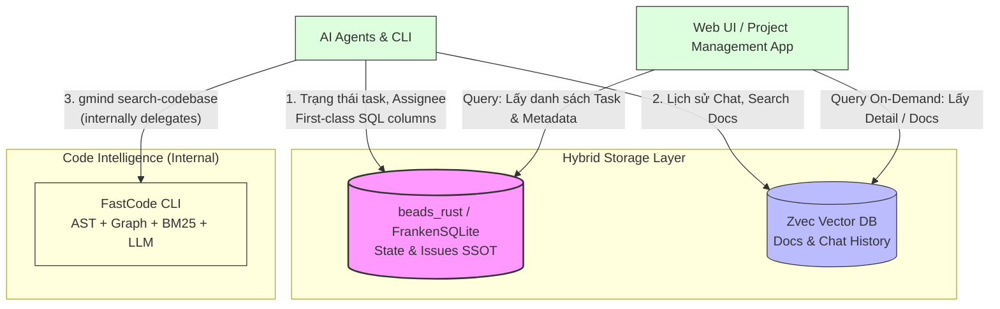
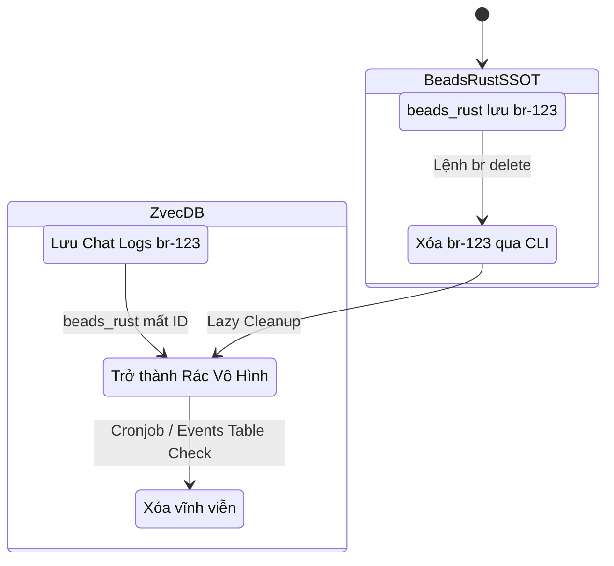

# PRD 01: Lớp Lưu trữ & Knowledge Graph Engine (Storage & Graph Engine)

<!-- beads-id: br-prd01 -->

> **3-LAYER PYRAMID CONTEXT — Layer 3 (Detail / Implementation)**
> - **Vị trí:** Layer 3 — Implementation spec cho Storage & Data subsystem
> - **Layer 1 (Map):** [PRD-00: Vision & Architecture](./PRD-00-Vision-and-Architecture.md) — Đọc trước để hiểu kiến trúc tổng thể
> - **Layer 2 (Orchestration):** [PRD-02: Tracking & RTM](./PRD-02-Universal-Tracking-and-RTM.md) — Beads ID strategy & traceability | [PRD-03: CLI](./PRD-03-CLI-and-Agent-Execution.md) — CLI commands gọi vào storage
> - **Downstream:** [PRD-04: Web UI](./PRD-04-WebUI-and-PM-Workspace.md) consumes data từ storage layer qua Go REST API
>
> **>> AGENT DIRECTIVE:** Bạn đang ở Layer 3 (Detail). Nếu cần orchestration context → đọc PRD-02/PRD-03. Nếu cần architecture overview → đọc PRD-00. **KHÔNG** đọc PRD-04 trừ khi bạn cần hiểu UI consumer.

## 1. Lớp Lưu trữ (Storage Layer): Kiến trúc Hybrid SSOT

<!-- beads-id: br-prd01-s1 -->

Lớp lưu trữ sử dụng cách tiếp cận Hybrid (Kết hợp) để lưu các loại bộ nhớ khác nhau, được tối ưu hóa cho độ trễ cực thấp (In-process / Local). Hệ thống sử dụng **beads_rust (FrankenSQLite)** làm Single Source of Truth (SSOT - Nguồn chân lý duy nhất) cho các tác vụ quản lý dự án, **Zvec DB** xử lý lưu trữ ngữ nghĩa cho docs/chat history, và **FastCode** (internal dependency của `gmind`) xử lý Code Intelligence.

> ✅ **Thay đổi kiến trúc (2026-02-28):** Chuyển từ DoltDB sang **beads_rust + FrankenSQLite**. Lý do: In-process MVCC concurrent writers, JSONL git-friendly sync (1 VCS thay 2), first-class SQL columns thay JSON blob, binary 5-8MB thay 30+MB. Xem [spike-frankensqlite-vs-doltdb.md](../researches/spikes/spike-frankensqlite-vs-doltdb.md).



**1. beads_rust & FrankenSQLite (Bộ nhớ Quy trình & Trạng thái):**

- Đóng vai trò là in-process SQL Database với MVCC concurrent writers. Lưu trữ trạng thái task (status), người được gán (assignee), thứ tự ưu tiên (priority).
- Lợi ích của FrankenSQLite: Hỗ trợ **page-level MVCC** (Nhiều Agent đọc/ghi đồng thời), **JSONL git-friendly sync** (Đồng bộ qua git như code thông thường), và **first-class SQL columns** (PM metadata là cột indexed, type-safe — không dùng JSON blob).
- Sync model: SQLite → JSONL export → git add/push. Clone project thì có luôn dữ liệu.

**2. Zvec (Universal Unstructured Data Indexer / Bộ Index Dữ liệu Phi cấu trúc):**

> ✅ **Mở rộng vai trò (2026-03-02):** Zvec không chỉ lưu Docs & Chat mà trở thành **Universal Unstructured Data Indexer** — index bất kỳ text nào có chứa Beads ID. Xem [spike-beads-knowledge-graph.md](../researches/spikes/spike-beads-knowledge-graph.md).

- CSDL Vector in-process lõi C++, thao tác trực tiếp trên RAM/Local Disk.
- **9 loại data source** được index: Docs (\*.md), Chat sessions, Meeting notes, Git commits, Git diff summaries, PR descriptions/comments, CI/CD logs, RTE approvals, Agent decision logs.
- **Không còn** lưu trữ AST nodes hay code graph — chức năng này đã chuyển sang FastCode.
- Đóng vai trò **search layer** cho Graph Query Engine — khi `gmind trace` chạy, Zvec trả về các chunks liên kết qua `beads_ids` metadata.

> ✅ **Chi tiết pipeline (2026-03-02):** Xem [spike-zvec-indexer-pipeline.md](../researches/spikes/spike-zvec-indexer-pipeline.md).

**Adaptive Chunking Strategy — ưu tiên semantic boundaries:**

| Data Type                   | Chunk Size         | Overlap   | Lý do                                            |
| --------------------------- | ------------------ | --------- | ------------------------------------------------ |
| Markdown docs               | 512 tokens         | 64 tokens | Standard RAG chunking, context preservation      |
| Git commit messages         | 1 commit = 1 chunk | 0         | Mỗi commit là 1 đơn vị logic                     |
| PR comments / Chat messages | 1 item = 1 chunk   | 0         | Mỗi message là 1 đơn vị context                  |
| CI/CD logs                  | 256 tokens         | 0         | Logs dài nhưng dense, chunk nhỏ để target search |
| Agent traces                | 1 step = 1 chunk   | 0         | Mỗi reasoning step là 1 đơn vị                   |

**Metadata Schema — 4 trường bắt buộc mỗi chunk:**

```json
{
  "source_type": "git-commit | pr-description | chat-message | markdown-doc | ci-log | rte-approval | agent-trace",
  "source_ref": "commit:a1b2c3d | pr:42 | file:docs/PRD-01.md:L45-L80",
  "beads_ids": ["bd-x1y2", "br-plan-42"],
  "timestamp": "2026-03-01T19:00:00Z"
}
```

**Auto-detect Beads IDs Pipeline** (4-step, regex-based, không cần LLM):

1. Regex scan: `br-[a-zA-Z0-9-]+` và `bd-[a-zA-Z0-9]+`
2. Git trailer parse: `Beads-ID: <id>`
3. Tag reference parse: `--tag="satisfies:<id>"`
4. Deduplicate `beads_ids[]`

**Incremental Indexing** — chỉ index data mới via `index_watermarks` table:

```sql
CREATE TABLE index_watermarks (
    source_type TEXT PRIMARY KEY,
    last_indexed TEXT,  -- timestamp hoặc commit hash
    chunk_count INTEGER
);
```

**3. Code Intelligence via FastCode (Bộ nhớ Cấu trúc / Structural Memory):**

- FastCode CLI (internal dependency của `gmind`) tự quản lý toàn bộ pipeline: Tree-sitter AST parsing → graph building → BM25/vector index → LLM iterative retrieval.
- Agent gọi `gmind search-codebase <query>`, gmind tự điều phối `fastcode index` + `fastcode query` bên trong.
- Cache index lưu tại `~/.fastcode/cache/` (local-only, rebuild-able).

## 2. Knowledge Graph — Graph Query Engine

<!-- beads-id: br-prd01-s2 -->

> ✅ **Thêm mới (2026-03-02):** `gmind` hoạt động như một **Graph Query Engine** — xây dựng Knowledge Graph tại thời điểm truy vấn (query-time), không cần cơ sở dữ liệu đồ thị riêng biệt. Xem [spike-beads-knowledge-graph.md](../researches/spikes/spike-beads-knowledge-graph.md).

**Beads ID = Universal Graph Node.** Mọi artifact trong hệ thống (PRD sections, Plan elements, Tasks, Commits, PRs, Chat sessions, CI runs) đều được kết nối thông qua Beads ID. Khi agent hoặc Web UI gọi `gmind trace <id>`, hệ thống truy vấn **5 data sources song song**:

| Data Source   | Thông tin lấy được                          | Latency   |
| ------------- | ------------------------------------------- | --------- |
| FrankenSQLite | Task state, dependencies, RTE approvals     | <5ms      |
| Git local     | Commits, branches (via `Beads-ID:` trailer) | <10ms     |
| Zvec          | Docs, chat history, agent traces            | <20ms     |
| FastCode      | Code references, function signatures        | <15ms     |
| `gh` CLI      | PRs, CI status (optional, ETag cached)      | 200-500ms |

**Kết quả:** Graph được lắp ráp (assembled) từ kết quả trả về, không lưu trữ riêng. Điều này đảm bảo dữ liệu luôn fresh và loại bỏ nhu cầu đồng bộ graph database.

**Hiệu năng (Benchmark):** Xem [spike-graph-assembler-performance.md](../researches/spikes/spike-graph-assembler-performance.md).

| Chế độ                            | Latency    | Ghi chú                               |
| --------------------------------- | ---------- | ------------------------------------- |
| Local only (mặc định)             | **50ms**   | FrankenSQLite + Git + Zvec + FastCode |
| Với GitHub (`--include-github`)   | **~750ms** | Thêm gh CLI call (ETag cached)        |
| Batch queries (`coverage`/`gaps`) | **<100ms** | 1 batch SQL thay 100 queries riêng lẻ |

**Chiến lược caching 2 tầng:**

- **Tier 1 — In-memory LRU** (CLI): TTL 30 giây, tự động invalidate. Phù hợp cho agent gọi liên tục.
- **Tier 2 — Materialized cache** (Web UI): TTL 5 phút, lưu graph result vào temp file. `gmind serve` dùng tier này để dashboard không re-query mỗi lần render.

## 3. Chiến lược Đồng bộ (Sync) & Dọn Rác (Garbage Collection) giữa beads_rust và Zvec

<!-- beads-id: br-prd01-s3 -->

Với việc lưu Data ở tận 2 nơi, rủi ro "Dữ liệu mồ côi (Orphaned Data)" (khi Agent xóa 1 Issue ở beads_rust nhưng Chat logs ở Zvec vẫn còn) có thể xảy ra. Để giải quyết, hãy sử dụng chiến lược **Lazy Cleanup (Dọn rác thủ động)**:



1. **Hiển thị Phụ thuộc (Lazy Lookup):** Web UI chỉ lấy Root ID từ **beads_rust**, sau đó lấy ID này để query Detail ở **Zvec**. Nếu beads_rust báo Node đã xóa, UI sẽ không bao giờ gọi ID rác đó trên Zvec, che đậy hoàn toàn Dữ liệu Mồ Côi khỏi mắt người dùng.
2. **Cronjob Dọn dẹp (Background Cleanup):**
   - Polling `events` table trong beads_rust để detect các issue bị xóa (event_type = 'deleted').
   - Truy xuất danh sách các record bị xóa và đẩy lệnh `delete()` hàng loạt sang Zvec để dọn dẹp RAM/Disk.
3. **Tuần tra Nén Lịch sử (Memory Compaction):** Zvec sẽ tự động thiết lập một tác nhân bảo trì (theo dõi các task lưu quá 30 ngày) để chạy tiến trình Summary Chat, nén dung lượng, và xóa các Logs rườm rà.
