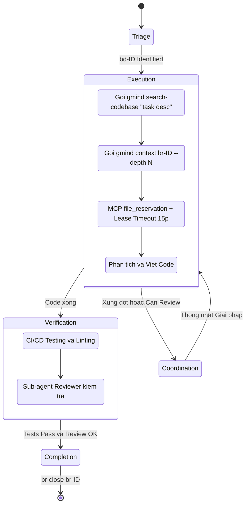

# PRD 03: Giao diện Dòng lệnh & Luồng Thực thi Agent (CLI & Agent Execution)

## 1. Công cụ gmind CLI (The Context API Gateway)

Viết bằng **Go (Golang)** theo Rule dự án, `gmind` là công cụ duy nhất LLM cần gọi để lấy Context.

- **`gmind search <query>`:**
  - Route query vào Zvec.
  - Trả kết quả Docs (PRDs, spikes, architecture, etc.) và Chat History.
  - **Không còn** trả AST Code snippet — chức năng code search đã chuyển sang `gmind search-codebase`.
- **`gmind search-codebase <query>`:** _(Mới — 2026-02-28)_
  - Orchestrator cho Code Intelligence. Tự điều phối FastCode bên trong:
    1. Kiểm tra `fastcode` binary có tồn tại (`exec.LookPath`)
    2. Kiểm tra và tự động chạy `fastcode index --no-embeddings .` nếu chưa có cache
    3. Gọi `fastcode query --repo . "<query>"` và trả kết quả
  - Flags: `--force-reindex` (bỏ cache), `--json`, `--debug`
  - > ✅ **Thiết kế (2026-02-28):** FastCode là **internal dependency** — Agent chỉ gọi `gmind search-codebase`, không gọi `fastcode` trực tiếp. Xem [spike-fastcode-cli-integration.md](../researches/spikes/spike-fastcode-cli-integration.md).
- **`gmind context <beads-id> [--depth N]`:**
  - Truy vấn hạt nhân. Gom toàn bộ Description (từ beads_rust/FrankenSQLite), Code context (qua `gmind search-codebase` nếu cần), và Discussion History (Từ Zvec) của 1 ID cụ thể.
  - Tự động nén định dạng đầu ra (ví dụ chuẩn TOON) để giảm token context window của Agent.
  - > ✅ **Đã áp dụng theo khuyến nghị PO:** Tham số `--depth N` cho phép Agent tùy chọn mức lấy ngữ cảnh. VD: `gmind context br-123 --depth 1` chỉ lấy code rễ, bỏ qua chat logs. Mặc định `--depth 0` lấy toàn bộ.
- **`gmind github <subcommand> <beads-id>`:** (wrapper `git` + `gh` CLI, chạy local-first)
  - `gmind github info br-xxx` — Tổng hợp: commits + PRs + CI status cho 1 Beads task.
  - `gmind github commits br-xxx` — Exec: `git log --all --grep='Beads-ID: br-xxx'`.
  - `gmind github prs br-xxx` — Exec: `gh pr list --search "br-xxx" --state all --json ...`.
  - `gmind github ci br-xxx` — Exec: `gh run list` + filter theo Beads ID.
  - > ✅ **Thêm mới (2026-02-28):** Không dùng Go API library — chỉ exec shell commands (`git`, `gh`). Zero dependencies. Xem [spike-github-integration.md](../researches/spikes/spike-github-integration.md).
- **`gmind trace <beads-id> [--reverse]`:** _(Đề xuất — 2026-03-01)_
  - Truy vết chuỗi liên kết 3 tầng: PRD Section ↔ Plan Element ↔ Task ↔ Commit.
  - `--reverse`: Từ Task truy ngược lên Plan và PRD section.
  - Output: Tree hiển thị full chain + related items cùng parent.
  - Flags: `--include-github` (mặc định chỉ local — thêm flag để query PRs/CI qua `gh` CLI), `--no-cache` (bỏ LRU cache), `--json`.
  - > ✅ **Thêm mới (2026-03-01):** Xem [spike-beads-id-in-docs.md](../researches/spikes/spike-beads-id-in-docs.md). **Hiệu năng (2026-03-02):** 50ms local, ~750ms với GitHub. Xem [spike-graph-assembler-performance.md](../researches/spikes/spike-graph-assembler-performance.md).
- **`gmind coverage prd|plan|full`:** _(Đề xuất — 2026-03-01)_
  - `prd`: Report PRD sections nào chưa có Plan element cover.
  - `plan`: Report Plan elements nào chưa decompose thành Tasks.
  - `full`: Tổng hợp cả 2 + Task completion progress.
  - Output: Table với cột Status (Covered / NOT COVERED / In Progress) và % coverage.
  - > ✅ **Batch optimization (2026-03-02):** 1 batch SQL query <100ms thay vì 100 individual queries. Xem [spike-graph-assembler-performance.md](../researches/spikes/spike-graph-assembler-performance.md).
- **`gmind impact <prd-section-id>`:** _(Đề xuất — 2026-03-01)_
  - Phân tích cascading impact khi sửa PRD section: Plan elements bị ảnh hưởng → Tasks cần review → Commits liên quan.
  - Output: Danh sách affected items với action đề xuất (REVIEW NEEDED / PAUSE / HOLD).
- **`gmind gaps prd-to-plan|plan-to-tasks`:** _(Đề xuất — 2026-03-01)_
  - Phát hiện gap: PRD sections hoặc Plan elements chưa có downstream coverage.
  - Output: Danh sách uncovered items với đề xuất hành động.
- **`gmind plan sync <file> | --all`:** _(Thêm mới — 2026-03-02)_
  - Bidirectional sync giữa Plan.md và Beads Issues: parse YAML markers → tạo/cập nhật Beads Issues; reverse-sync status từ FrankenSQLite về Plan.md.
  - `--all`: Sync tất cả `docs/plans/*.md`.
  - > ✅ **Thêm mới (2026-03-02):** Xem [spike-plan-document-format.md](../researches/spikes/spike-plan-document-format.md). Hybrid approach: Plan.md = SSOT, Beads Issues = derived.
- **`gmind plan status <plan-id>`:** _(Thêm mới — 2026-03-02)_
  - Hiển thị progress summary cho 1 plan: elements done/in-progress/not-started, overall %.
- **`gmind plan create --from-prd=<section-id>`:** _(Thêm mới — 2026-03-02)_
  - Bootstrap plan document từ PRD section, tạo file `docs/plans/plan-{N}-{slug}.md` với YAML front matter liên kết `satisfies`.
- **`gmind escalate <id> --risk="<description>"`:** _(Thêm mới — 2026-03-02)_
  - Kích hoạt RTE discussion khi Agent phát hiện rủi ro. Nội bộ: update FrankenSQLite (`rte_status=escalated`), thu thập evidence (`gmind trace`), gửi notification qua MCP Agent Mail.
  - > ✅ **Thêm mới (2026-03-02):** Xem [spike-rte-approval-workflow.md](../researches/spikes/spike-rte-approval-workflow.md). Workflow: Escalate → Discuss → Approve → Resume.
- **`gmind approve <id> --resolution="<text>"`:** _(Thêm mới — 2026-03-02)_
  - Ghi nhận phê duyệt từ RTE. Resolution text = **Execution Context** — agent đọc qua `gmind trace <id>` để biết constraints và phương án implement.
- **`gmind reject <id> --reason="<text>"`:** _(Thêm mới — 2026-03-02)_
  - Từ chối phương án, yêu cầu Agent đề xuất approach mới.
- **`gmind serve [--port 8080]`:** _(Thêm mới — 2026-03-02)_
  - Khởi động Go HTTP server phục vụ RTM Dashboard web UI.
  - REST API: `/api/coverage`, `/api/gaps`, `/api/trace/:id`, `/api/impact/:section`, `/api/tasks` — mỗi endpoint gọi `gmind` CLI internal với `--json`.
  - Frontend: Vanilla JS + D3.js (dark theme), embedded qua Go `embed.FS` → single binary.
  - > ✅ **Thêm mới (2026-03-02):** Xem [spike-webui-rtm-dashboard.md](../researches/spikes/spike-webui-rtm-dashboard.md). 4-panel dashboard: Coverage Heatmap, Task Progress, Interactive Graph, Gap Analysis.
- **`gmind reindex [--source=<type>] [--force]`:** _(Thêm mới — 2026-03-02)_
  - Orchestrator cho Zvec incremental indexing. Scan docs, git commits, GitHub PRs, agent traces. Sử dụng `index_watermarks` table để chỉ index data mới.
  - `--source=git-commit|markdown-doc|pr-description|...`: Chỉ re-index 1 source type.
  - `--force`: Full re-index toàn bộ (bỏ qua watermarks).
  - Triggers: manual, git post-commit hook, `gmind github sync`, agent session end.
  - > ✅ **Thêm mới (2026-03-02):** Xem [spike-zvec-indexer-pipeline.md](../researches/spikes/spike-zvec-indexer-pipeline.md). Adaptive chunking, auto-detect Beads IDs, 4-step regex pipeline.

## 2. Agent Workflow / Agent Skills

Các Agent (VD: Claude) sẽ được quy định hành vi nghiêm ngặt thông qua file `.agent/skills/project_memory/SKILL.md`.



- **Planning & Triage:** Agent dùng `bv --robot-triage` để lấy list task ưu tiên. Cấm agent gọi `--robot-*` nhằm tránh treo terminal.
- **Execution:** Bắt buộc gọi `gmind search-codebase "<task description>"` và `gmind context <id> --depth N` trước khi sửa code. Agent tùy chọn mức ngữ cảnh cần thiết.
- **File Locking & Lease Timeout:**
  - > ✅ **Đã áp dụng theo khuyến nghị PO:** Cơ chế **Lease Timeout** (Tự nhả khóa sau 15 phút) được bật mặc định. Web UI có tính năng **Lease Timeout Alert** (nhấp nháy báo động đỏ) để Human can thiệp: Kill session agent hoặc Release Lease thủ công.
  - Tương tác với `mcp_agent_mail file_reservation`, hiển thị trên Web UI (Agent Village).
- **Coordination (Agent Village UI):** Human có thể xem **Swarm Activity Feed** theo dõi dòng thời gian: agent nào khóa file `reason="br-123"`, gửi mail/giải quyết conflict nội bộ với agent nào thông qua `thread_id="br-123"`.
- **Verification:** Code bắt buộc qua CI/CD Testing & Linting trước khi được phép Complete.
- **Traceability Tagging (bắt buộc):** Khi tạo task mới (`bd create`), Agent **PHẢI** gắn traceability tags để liên kết với Plan và PRD:
  ```bash
  bd create "<task title>" \
    --tag="implements:<plan-element-id>" \
    --tag="satisfies:<prd-section-id>"
  ```
  Nếu không gắn tag, `gmind coverage` sẽ báo gap. Xem PRD-02 §3.
- **Completion:** Commit với **`Beads-ID:` Git Trailer** (thay cho `#br-123`) và chạy `br close <id>`. Ví dụ: `git commit -m "feat(module): description" --trailer "Beads-ID: br-123"`. GitHub Autolinks tự động biến `br-123` thành link clickable.

## 3. Lớp Xác minh CI/CD (Verification Layer)

> ✅ **Đã áp dụng theo khuyến nghị PO:** AI Agent **không thể** tự ý đánh dấu Task Completion nếu Test chưa chạy pass.

Khi Agent hoàn tất Code, bắt buộc phải đẩy code qua **Verification Node** trước khi được phép gọi `br close`. Verification Node thực hiện:

1.  **Chạy Test tự động:** Unit Test, Integration Test (nếu có).
2.  **Linting & Format Check:** Đảm bảo code đúng chuẩn Go (`golangci-lint`, `gofmt`).
3.  **Kết quả:** Nếu **Pass** → Agent được phép Complete Task. Nếu **Fail** → Trả ngược về Agent để sửa lỗi.

## 4. RTE Approval Workflow — Khi Agent phát hiện rủi ro

Khi Dev Agent phát hiện rủi ro trong quá trình implementation → kích hoạt workflow 4 bước:

1. **Escalate**: `gmind escalate <id> --risk="<description>"` → tạo discussion thread, notify RTE Team qua MCP Agent Mail.
2. **Discuss**: RTE Team review evidence, thảo luận phương án. Messages lưu trong Zvec.
3. **Approve/Reject**: `gmind approve <id> --resolution="<decision>"` → ghi nhận phê duyệt. Resolution = **Execution Context** cho agent.
4. **Resume**: Agent đọc approval context từ `gmind trace <id>`, implement theo phương án đã phê duyệt.
