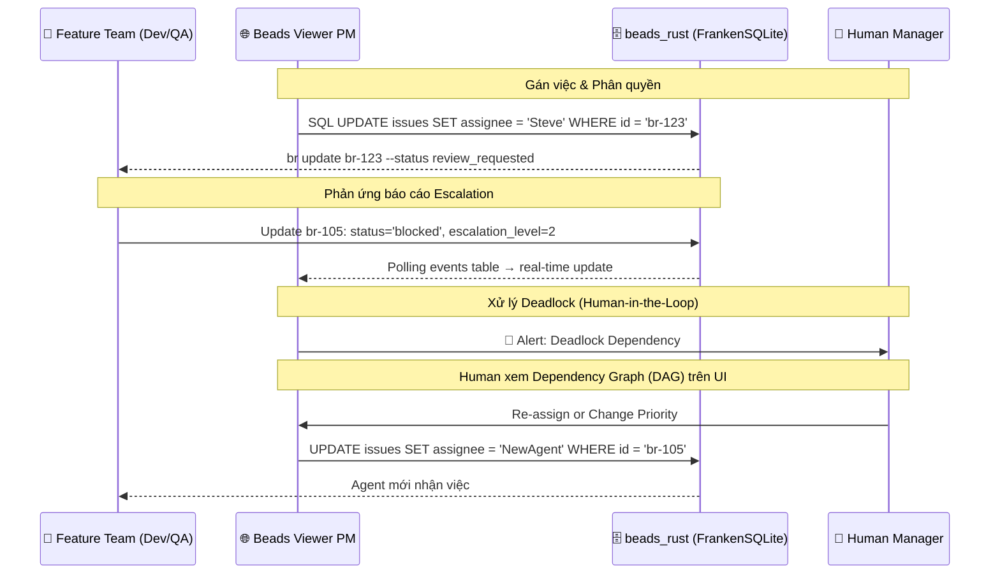

# PRD 04: Giao diện PM & Quản lý Không gian làm việc (Web UI & PM Workspace)

<!-- beads-id: br-prd04 -->

> **3-LAYER PYRAMID CONTEXT — Layer 3 (Detail / Implementation)**
>
> - **Vị trí:** Layer 3 — UI Implementation spec cho Web UI & PM Workspace
> - **Layer 1 (Map):** [PRD-00: Vision & Architecture](./PRD-00-Vision-and-Architecture.md) — Kiến trúc tổng thể
> - **Layer 2 (Orchestration):** [PRD-02: Tracking & RTM](./PRD-02-Universal-Tracking-and-RTM.md) — Beads ID & coverage logic | [PRD-03: CLI](./PRD-03-CLI-and-Agent-Execution.md) — `gmind serve` REST API mà UI consume
> - **Layer 3 (Peer):** [PRD-01: Storage](./PRD-01-Storage-and-Graph-Engine.md) — Data model (FrankenSQLite schema, Zvec)
> - **UI/UX Methodology:** [Spike Ralph Loop](../../researches/spikes/spike-design-system-ralph-loop-agent.md) — Contract-driven UI pipeline (Stage 1: Low-Fi, Stage 2: Hi-Fi)
>
> **>> AGENT DIRECTIVE:** Bạn đang ở Layer 3 (UI Detail). Data contract đến từ PRD-03 (CLI/API). Data model từ PRD-01 (Storage). Nếu implementing UI, sử dụng Ralph Loop workflow: `/gsafe-uiux-ralph-loop-antigravity`.

## 1. Quản lý Project Tasks (PM Custom Fields) qua First-class SQL Columns

<!-- beads-id: br-prd04-s1 -->

Để thiết lập hệ thống gán việc như một "JIRA thu nhỏ", beads_rust sử dụng **first-class SQL columns** thay vì JSON blob. Các trường PM là cột indexed, type-safe, queryable trực tiếp — hiệu năng tốt hơn `JSON_EXTRACT()`.

### Schema beads_rust — PM Fields

```sql
-- Bảng issues đã có sẵn trong beads_rust
CREATE TABLE issues (
    id TEXT PRIMARY KEY,
    title TEXT NOT NULL,
    status TEXT NOT NULL DEFAULT 'open',
    priority INTEGER NOT NULL DEFAULT 2,    -- 0=P0 Critical → 4=P4 Backlog
    assignee TEXT,                           -- Người được gán (first-class!)
    owner TEXT DEFAULT '',                   -- Chủ sở hữu task
    issue_type TEXT NOT NULL DEFAULT 'task', -- task, bug, feature, epic, ...
    -- ... (35+ cột khác)

    -- PM columns mở rộng (cần thêm qua migration)
    qa_status TEXT DEFAULT '',               -- PASSED, FAILED, PENDING
    qa_verified_by TEXT DEFAULT '',           -- CuongPT.QA
    test_logs_ref TEXT DEFAULT '',            -- zvec-doc-99281
    coverage TEXT DEFAULT '',                 -- 85%
    escalation_level INTEGER DEFAULT 0,      -- 0: Auto, 1: Team, 2: Human, 3: Approval

    -- RTE Approval columns (spike-rte-approval-workflow)
    rte_status TEXT DEFAULT '',               -- escalated, discussing, approved, rejected
    rte_resolution TEXT DEFAULT '',           -- free-text: phương án đã phê duyệt (= Execution Context)
    rte_approved_at TEXT DEFAULT '',          -- timestamp phê duyệt
    rte_approved_by TEXT DEFAULT ''           -- ai phê duyệt (RTE agent/Human)
);

-- Bảng dependencies riêng (first-class relational!)
CREATE TABLE dependencies (
    issue_id TEXT NOT NULL,
    depends_on_id TEXT NOT NULL,
    type TEXT NOT NULL DEFAULT 'blocks',   -- blocks, parent-child, related, ...
    FOREIGN KEY (issue_id) REFERENCES issues(id)
);
```

### So sánh paradigm: JSON blob (cũ) → SQL columns (mới)

| Thao tác        | ~~DoltDB (cũ)~~                                       | beads_rust (mới)                                      |
| --------------- | ----------------------------------------------------- | ----------------------------------------------------- |
| Gán assignee    | `JSON_SET(metadata, '$.assignee', 'Steve')`           | `UPDATE issues SET assignee = 'Steve'`                |
| Lọc theo role   | `JSON_EXTRACT(metadata, '$.role_required')`           | `SELECT * FROM labels WHERE label = 'role:developer'` |
| Xem blockers    | `JSON_EXTRACT(metadata, '$.dependencies.blocked_by')` | `SELECT * FROM dependencies WHERE type = 'blocks'`    |
| QA verification | `JSON_EXTRACT(metadata, '$.qa_verification.status')`  | `SELECT qa_status FROM issues WHERE id = ?`           |
| Escalation      | `JSON_EXTRACT(metadata, '$.escalation_level')`        | `SELECT escalation_level FROM issues WHERE id = ?`    |

### Luồng Hoạt động (Workflow) và Xử lý Xung đột qua Web UI



**Nguyên tắc thao tác:**

- PM metadata được lưu dưới dạng **first-class SQL columns** (indexed, type-safe) trên beads_rust.
- Web UI dùng `WHERE` clause trực tiếp để lọc, tìm kiếm và hiển thị dữ liệu — nhanh hơn `JSON_EXTRACT`.
- Cập nhật thông qua Go REST API → SQL `UPDATE` trực tiếp.
- Real-time updates qua **polling `events` table** mỗi 3-5 giây.

## 2. Kiến trúc Giao diện Người dùng (Presentation Layer)

<!-- beads-id: br-prd04-s2 -->

Phiên bản **Beads Viewer PM Edition** đóng vai trò là một dự án mở rộng, tập trung vào trải nghiệm Người quản lý (Human-in-the-Loop Supervision) với các thành phần chính:

### 2.1. API Gateway (Lớp Bảo vệ Dữ liệu)

- Mọi request từ Web UI phải đi qua **Go REST API** (embedded FrankenSQLite).
- Gateway xác thực quyền truy cập, kiểm soát rate-limit, và đảm bảo tính toàn vẹn dữ liệu.
- **Không cho phép UI read/write trực tiếp vào FrankenSQLite/Zvec.**

### 2.2. Offline & Rehydration State (Interactions & Transitions)

- **Offline State:**
  - **Transition:** Khi hệ thống phát hiện mất kết nối (thông qua ping hoặc failed request), UI ngay lập tức chuyển hiệu ứng fade-in một banner màu vàng "Offline Mode" ở trên cùng màn hình.
  - **Interaction:** Chuyển sang chế độ read-only cho hầu hết các biểu đồ (dựa trên IndexedDB/cached data). Các thao tác ghi quan trọng (VD: Update status, Assign) không bị block hoàn toàn mà thay vào đó hiển thị biểu tượng "Pending/Clock" bên cạnh, và được lưu vào hàng đợi local (Local Queue). Nút Submit đổi thành "Save Offline".
- **Rehydration State:**
  - **Transition:** Khi có kết nối mạng trở lại (WebSocket reconnected hoặc successful health check), banner "Offline Mode" chuyển màu xanh và đổi text thành "Syncing...".
  - **Interaction:** Hệ thống xử lý ngầm (background sync) để đẩy hàng đợi local lên Go REST API. Các icon "Pending/Clock" tại các thẻ task chuyển thành "spinner" và sau đó biến mất khi xác nhận server thành công.
  - **Conflict Resolution:** Nếu có xung đột dữ liệu (VD: người khác đã sửa task trong lúc offline), UI hiển thị Modal "Sync Conflict" yêu cầu User chọn "Keep Mine" hoặc "Use Server Version".

## 3. Các Giao diện Quản trị (SAFe & Board Views)

<!-- beads-id: br-prd04-s3 -->

- **Portfolio View:** Dành cho CEO/CTO xem Epic, Budget, Roadmap.
- **ART View:** Kanban tổng cho Orchestrator (RTE) / PMO quản lý.
- **Team View:** Bảng Kanban riêng rẽ cho từng Feature Team (VD: `Platform`, `Connectors`, `Quant`).
- **PI Planning Interactive UI:** Không gian tương tác cho lễ PI Planning. Bao gồm **Strategic Sandbox** (kéo thả rủi ro/bài toán để tính Capacity), **Business Value Scoring**, **ROAM Board** để xử lý rủi ro, và phím bấm **[Confidence Vote]** bắt buộc từ Human trước khi khởi chạy Sprint.

### 3.1. State Matrix & Breakpoints

| State | Mô tả |
| --- | --- |
| **Default** | Hiển thị các bảng Kanban/Portfolio với dữ liệu đầy đủ. |
| **Loading** | Hiển thị skeleton loaders cho các thẻ công việc và bảng điều khiển. |
| **Empty** | Hiển thị "Chưa có dự án/task" kèm nút CTA để tạo mới. |
| **Error** | Hiển thị thông báo "Không thể tải dữ liệu Board" kèm nút "Thử lại". |

**Breakpoints (Responsive):**
- **Desktop (≥ 1024px):** Hiển thị đầy đủ các cột Kanban ngang (Kanban Board) và PI Planning Sandbox.
- **Tablet (768px - 1023px):** Thu hẹp các cột Kanban, cho phép trượt ngang (horizontal scroll).
- **Mobile (< 768px):** Hiển thị dạng List view dọc thay vì Kanban ngang, các thẻ công việc xếp chồng lên nhau.

### 3.2. User Journeys

- **Journey 1 (Board Navigation):** User truy cập `/board` -> Chọn ART View -> Kéo thả (Drag & Drop) một task card từ 'Todo' sang 'In Progress' -> Cập nhật trạng thái thành công.
- **Journey 2 (PI Planning Vote):** User mở thẻ PI Planning -> Xem danh sách rủi ro (ROAM) -> Click nút [Confidence Vote] -> Xác nhận lựa chọn -> Ghi nhận kết quả vote.

## 4. Cổng Phê duyệt Cấp 3 (Level 3 Approval Gates) & Không gian Phê duyệt

<!-- beads-id: br-prd04-s4 -->

Giao diện chặn (Checkpoint) yêu cầu **Bắt buộc Phê duyệt bởi Con người** khi:

1.  **Chuyển Phase (Phase Boundaries):** Từ Planning (Continuous Exploration) sang Execution (Continuous Integration), hoặc qua Release.
2.  **The Ultimate Approval Panel:** Khi Agent đệ trình PR hoặc Task, Web UI gọp chung 5 luồng dữ liệu vào một màn hình duy nhất để Human xem xét: `Test Result (Từ Zvec QA Log)` + `Code Diff (FastCode/Git)` + `Beads ID (br-xxx)` + `PRD Requirements liên kết` + `GitHub PR & CI Status (từ gh CLI)`.

### 4.1. State Matrix & Breakpoints

| State | Mô tả |
| --- | --- |
| **Default** | Hiển thị Panel phê duyệt với 5 luồng dữ liệu (Test, Code Diff, Beads ID, PRD, GitHub PR). |
| **Loading** | Skeleton loaders trong quá trình aggregate dữ liệu từ nhiều nguồn. |
| **Empty** | "Không có yêu cầu phê duyệt nào đang chờ". |
| **Error** | "Lỗi kết nối đến dịch vụ CI/CD hoặc GitHub" với tùy chọn "Bỏ qua & Phê duyệt thủ công" (nếu có quyền Admin). |

**Breakpoints (Responsive):**
- **Desktop (≥ 1024px):** Split-view: Bên trái là luồng dữ liệu (Diff, Test logs), bên phải là PRD context và nút Phê duyệt.
- **Tablet (768px - 1023px) & Mobile (< 768px):** Stack dọc: PRD context ở trên, tiếp đến là luồng dữ liệu, và nút Phê duyệt cố định ở bottom-bar.

### 4.2. User Journeys

- **Journey 1 (Review & Approve):** User mở The Ultimate Approval Panel -> Cuộn qua Code Diff và Test Results -> Kiểm tra PRD Coverage -> Click [Approve] -> Điền comment xác nhận -> Hệ thống tự động merge nhánh và close task.
- **Journey 2 (Review & Reject):** User mở Panel -> Phát hiện Test Failed (màu đỏ) -> Click [Reject] -> Hệ thống yêu cầu điền lý do -> Push feedback về Task/PR tương ứng.

## 5. Đồ thị Tài liệu & Lịch sử HITL (Human-in-the-Loop Document Graph)

<!-- beads-id: br-prd04-s5 -->

- **Document Tree & Commit Lineage:** Hiển thị trực quan lịch sử thay đổi của một tài liệu dưới dạng cây đồ thị liên kết trực tiếp tới từng `git commit` (qua `Beads-ID:` Git Trailer) và thuộc tính `beads ID`. Truy vấn local: `git log --grep='Beads-ID: br-xxx'`.
- **Knowledge Context Linking:** Trỏ ngược từ Yêu cầu (Requirement) sang các Tài liệu tham chiếu (Research references) đã được AI dùng làm Context, giúp con người dễ dàng bổ sung thêm tham chiếu để điều chỉnh Spec.
- **GitHub Enrichment:** Mỗi Beads task hiển thị linked PRs (`gh pr list --search "br-xxx"`), CI status (`gh run list`), và commit history (`git log --grep`). Tất cả query trực tiếp từ local git + `gh` CLI.
- **Requirements Traceability Matrix (RTM):** Hiển thị trực quan liên kết 3 tầng **PRD Section ↔ Plan Element ↔ Task**. Mỗi PRD section có Beads ID riêng (VD: `br-prd01-s1`), Plan elements link ngược qua `satisfies:`, Tasks link ngược qua `implements:`. Cho phép truy vết xuôi (PRD → Code) và ngược (Task → PRD). Xem chi tiết: PRD-02 §3.
- **Coverage Heatmap:** Dashboard hiển thị mức độ cover của từng PRD section: bao nhiêu PRD sections có Plan elements? Bao nhiêu Plan elements đã decompose thành Tasks? Highlight các gaps (sections chưa covered) bằng màu đỏ. Dữ liệu từ `gmind coverage full`.
- **Impact Analysis View:** Khi Human sửa/cập nhật một PRD section, hiển thị cascading impact: Plan elements nào bị ảnh hưởng → Tasks nào cần review/pause/rework → Commits nào liên quan. Dữ liệu từ `gmind impact <prd-section-id>`.

### 5.1. State Matrix & Breakpoints

| State | Mô tả |
| --- | --- |
| **Default** | Cây đồ thị render toàn bộ node và edge (PRD, Plan, Task, Commit) rõ ràng và tương tác được. |
| **Loading** | Hiển thị skeleton và vòng xoay (spinner) ở trung tâm biểu đồ trong khi truy vấn dữ liệu từ git/CLI. |
| **Empty** | "Chưa có liên kết tài liệu hoặc biểu đồ trống" kèm theo lời khuyên "Bắt đầu link PRD với Tasks". |
| **Error** | "Lỗi truy xuất đồ thị từ gmind" với nút "Tải lại đồ thị". |

**Breakpoints (Responsive):**
- **Desktop (≥ 1024px):** Hiển thị Đồ thị ở vùng trung tâm lớn, Side Panel chứa chi tiết node ở bên phải, Panel điều hướng/tùy chọn (Zoom/Filter) ở góc màn hình.
- **Tablet (768px - 1023px):** Side Panel hiển thị dưới dạng bottom sheet hoặc overlay nhẹ để tiết kiệm diện tích biểu đồ.
- **Mobile (< 768px):** Không khuyến khích dùng đồ thị phức tạp. Thay thế bằng danh sách Tree-view thu gọn (collapsible list) hoặc đồ thị đơn giản hỗ trợ pinch-to-zoom và pan (vuốt, thu phóng).

## 6. RTM Dashboard — 4-Panel Requirements Visibility

<!-- beads-id: br-prd04-s6 -->

> ✅ **Nghiên cứu đã được chấp nhận (2026-03-02 → 2026-03-13):** Nội dung từ [spike-webui-rtm-dashboard.md](../../researches/spikes/spike-webui-rtm-dashboard.md) đã được merge vào PRD làm yêu cầu chính thức.

### 6.1. Dashboard Layout — 4 Panels

**Route:** `/` (Dashboard chính)

**Global Components:**
- **Top Navigation:** Chứa Logo, các links điều hướng (Dashboard, Tasks, Reports), và User Avatar.
- **KPI Cards Row:** Hiển thị list 3 thẻ chỉ số tổng quan đặt phía trên các panels (Coverage %, Tasks Done, Gaps Found).

```text
┌──────────────────────────────────────────────────────────────┐
│  gmind Web UI — RTM Dashboard                                │
├──────────────────────────────────────────────────────────────┤
│                                                              │
│  ┌─────────────────────────┐ ┌────────────────────────────┐  │
│  │  Panel 1:               │ │  Panel 2:                  │  │
│  │  Coverage Heatmap       │ │  Task Progress             │  │
│  │                         │ │                            │  │
│  │  PRD-01 [====90%====]   │ │  Total: 142 tasks          │  │
│  │  PRD-02 [===75%===..]   │ │  Done: 98 (69%)            │  │
│  │  PRD-03 [==60%==....]   │ │  In Progress: 24 (17%)     │  │
│  │                         │ │  Blocked: 8 (6%)           │  │
│  │  Section drill-down:    │ │  Not Started: 12 (8%)      │  │
│  │  s1.1 [====100%====]    │ │                            │  │
│  │  s1.2 [===80%===...]    │ │  [Gantt-like timeline]     │  │
│  │  s1.3 [=40%=........]   │ │                            │  │
│  │                         │ │                            │  │
│  └─────────────────────────┘ └────────────────────────────┘  │
│                                                              │
│  ┌─────────────────────────┐ ┌────────────────────────────┐  │
│  │  Panel 3:               │ │  Panel 4:                  │  │
│  │  Knowledge Graph        │ │  Gap Analysis              │  │
│  │                         │ │                            │  │
│  │  [Interactive graph]    │ │  Gaps Found: 5             │  │
│  │                         │ │                            │  │
│  │  PRD -> Plan -> Task    │ │  ! PRD-02 s3.4: no plan    │  │
│  │   |      |       |      │ │  ! PRD-03 s2.1: no tasks   │  │
│  │   +Docs  +Code   +CI    │ │  ! Plan-15: no PRD link    │  │
│  │                         │ │  ! bd-a1: blocked 5 days   │  │
│  │  Click node -> details  │ │  ! bd-c3: no unit tests    │  │
│  │                         │ │                            │  │
│  └─────────────────────────┘ └────────────────────────────┘  │
│                                                              │
└──────────────────────────────────────────────────────────────┘
```

### 6.2. Panel Details (Đặc tả chi tiết từng Panel)

**Panel 1: Coverage Heatmap**

| Feature       | Description                                                        |
| ------------- | ------------------------------------------------------------------ |
| Data source   | `gmind coverage --json`                                            |
| Visualization | Horizontal bars, color-coded (green=90%+, yellow=60-89%, red=<60%) |
| Interaction   | Click PRD → expand sections (click lại để collapse), click section → show linked tasks ở side panel (side panel đóng bằng nút X hoặc click outside) |
| Refresh       | Auto-refresh every 60s hoặc manual                                 |

**Panel 2: Task Progress**

| Feature       | Description                             |
| ------------- | --------------------------------------- |
| Data source   | `br list --json` (FrankenSQLite issues) |
| Visualization | Pie chart + progress bars + timeline    |
| Grouping      | By PRD, by Plan, by status, by assignee |
| Interaction   | Click status → filter tasks list        |

**Panel 3: Knowledge Graph (Interactive)**

| Feature       | Description                                             |
| ------------- | ------------------------------------------------------- |
| Data source   | `gmind trace <id> --json --depth=full`                  |
| Visualization | Force-directed graph (D3.js)                            |
| Node types    | PRD (blue), Plan (green), Task (yellow), Commit (gray)  |
| Edge types    | satisfies (solid), implements (dashed), committed-for   |
| Interaction   | Click node → side panel with details, drag to rearrange |

**Panel 4: Gap Analysis**

| Feature       | Description                                            |
| ------------- | ------------------------------------------------------ |
| Data source   | `gmind gaps --json`                                    |
| Visualization | List view with severity icons                          |
| Gap types     | Missing plan, missing tasks, blocked tasks, no tests   |
| Interaction   | Click gap → navigate to source, action button "Create" (Mở modal "Create Plan") |

### 6.3. API Layer — REST Endpoints (`gmind serve`)

| Endpoint                   | gmind Command              | Response Format |
| -------------------------- | -------------------------- | --------------- |
| `GET /api/coverage`        | `gmind coverage --json`    | JSON            |
| `GET /api/gaps`            | `gmind gaps --json`        | JSON            |
| `GET /api/trace/:id`       | `gmind trace <id> --json`  | JSON            |
| `GET /api/impact/:section` | `gmind impact <id> --json` | JSON            |
| `GET /api/tasks`           | `br list --json`           | JSON            |
| `GET /api/tasks/:id`       | `br show <id> --json`      | JSON            |

**Implementation Architecture:**

```text
┌──────────────────────────────────────────────────────────────┐
│  gmind serve --port 8080                                     │
├──────────────────────────────────────────────────────────────┤
│                                                              │
│  Go HTTP Server (net/http hoặc chi)                          │
│  ├── /api/coverage  → exec gmind coverage --json             │
│  ├── /api/gaps      → exec gmind gaps --json                 │
│  ├── /api/trace/:id → exec gmind trace <id> --json           │
│  ├── /api/impact/:s → exec gmind impact <s> --json           │
│  └── /static/       → serve Web UI (embedded assets)         │
│                                                              │
│  Frontend: Single-page app                                   │
│  ├── Framework: Vanilla JS + D3.js (graph visualization)     │
│  ├── Style: Dark theme, premium design                       │
│  ├── Layout: 4-panel dashboard (responsive grid)             │
│  └── Build: Embedded in Go binary via embed.FS               │
│                                                              │
└──────────────────────────────────────────────────────────────┘
```

### 6.4. Technology Stack

| Layer     | Tech                    | Lý do                               |
| --------- | ----------------------- | ----------------------------------- |
| Backend   | Go (gmind serve)        | Reuse gmind CLI, single binary      |
| API       | REST JSON               | Simple, curl-friendly               |
| Frontend  | Vanilla JS              | No build step, embed in Go binary   |
| Graph Viz | D3.js force-directed    | Industry standard, flexible         |
| Charts    | Chart.js hoặc D3.js     | Lightweight, responsive             |
| Styling   | CSS custom (dark theme) | Premium feel, consistent with gmind |
| Embedding | Go embed.FS             | Single binary distribution          |

### 6.5. Graph Node & Edge Design

```text
┌──────────────────────────────────────────────────────────────┐
│  Graph Node Types                                            │
├──────────────────────────────────────────────────────────────┤
│                                                              │
│  PRD Section     →  Blue circle, size=large                  │
│  Plan Element    →  Green diamond, size=medium               │
│  Task/Issue      →  Yellow square, size based on status      │
│  Commit          →  Gray dot, size=small                     │
│  Chat/Meeting    →  Purple triangle, size=small              │
│  PR              →  Cyan hexagon, size=medium                │
│  CI Run          →  Orange star, size=small                  │
│                                                              │
│  Edge rendering:                                             │
│  satisfies       →  Solid line, arrow up                     │
│  implements      →  Dashed line, arrow up                    │
│  committed-for   →  Dotted line, arrow right                 │
│  discussed-in    →  Wavy line, bidirectional                 │
│  blocks          →  Red solid, arrow                         │
│                                                              │
│  Status colors:                                              │
│  Done            →  Green fill                               │
│  In Progress     →  Yellow fill                              │
│  Blocked         →  Red fill + pulse animation               │
│  Not Started     →  Gray outline only                        │
│                                                              │
└──────────────────────────────────────────────────────────────┘
```

### 6.6. State Matrix & Breakpoints

| State | Mô tả |
| --- | --- |
| **Default** | Hiển thị đầy đủ 4 panels với data thực tế. |
| **Loading** | Hiển thị skeleton loaders cho các panels. Graph hiển thị spinner. |
| **Empty** | Khi không có dữ liệu, hiển thị illustration "Chưa có dữ liệu theo dõi" kèm nút "Hướng dẫn". |
| **Error** | Hiển thị banner lỗi "Không thể kết nối đến gmind serve" kèm nút "Thử lại". |

**Breakpoints (Responsive):**
- **Desktop (≥ 1024px):** Layout hiển thị 2x2 grid (4 panels).
- **Tablet (768px - 1023px):** Stack 2 grid dọc (2x1 hoăc 1x1 tuỳ kích thước).
- **Mobile (< 768px):** Từng panel xếp dọc (1 cột), graph cho phép pan/zoom bằng touch.

### 6.7. Khả năng Tiếp cận (Accessibility)
- **Tiêu chuẩn:** Tuân thủ WCAG AA.
- **Bắt buộc:** Hỗ trợ điều hướng bằng bàn phím (keyboard navigation) cho toàn bộ 4 panels.
- **Focus:** Cần hiển thị rõ focus outline cho các yếu tố tương tác.

### 6.8. User Journeys

- **Journey 1 (Coverage Drilling):** Người dùng mở RTM Dashboard -> Xem Panel 1 (Coverage Heatmap) -> Nhấp vào PRD có coverage thấp (ví dụ: đỏ) -> Mở rộng để xem các section bên trong -> Nhấp vào một section -> Side panel hiện ra danh sách các task liên kết chưa hoàn thành.
- **Journey 2 (Gap Resolution):** Người dùng xem Panel 4 (Gap Analysis) -> Phát hiện cảnh báo "Missing plan" -> Nhấp vào nút "Create" -> Modal "Create Plan" bật lên -> Điền thông tin plan và lưu -> Dashboard tự động tải lại và gap biến mất.
- **Journey 3 (Impact Traceability):** Người dùng tương tác với Panel 3 (Knowledge Graph) -> Chọn một node PRD -> Xem chi tiết ở side panel -> Kéo thả các node liên kết để phân tích luồng ảnh hưởng (Impact) từ PRD sang Code và Test.

## 7. RTE Approval — UI Integration

<!-- beads-id: br-prd04-s7 -->

> ✅ **Nghiên cứu đã được chấp nhận (2026-03-02 → 2026-03-13):** Nội dung từ [spike-rte-approval-workflow.md](../../researches/spikes/spike-rte-approval-workflow.md) đã được merge. Phần CLI commands nằm tại PRD-03 §4. Phần UI integration đặc tả dưới đây.

Khi Agent escalate rủi ro, Web UI cần hiển thị **RTE Approval Panel** trong Document Graph (§5) và Board Views (§3):

- **Escalation Badge:** Task card hiển thị badge 🔴 `RTE:ESCALATED` khi `rte_status = 'escalated'`
- **Discussion Thread View:** Click task → expand panel hiển thị conversation thread từ Zvec (lọc theo `source_type: rte-discussion`, `beads_ids: [<task-id>]`)
- **Approval Context Display:** Khi `rte_status = 'approved'`, hiển thị **Execution Context block** với:
  - Risk description gốc
  - Decision text (from `rte_resolution`)
  - Constraints list
  - Approved by + timestamp (`rte_approved_by`, `rte_approved_at`)
- **Impact Indicator:** Nếu RTE decision ảnh hưởng PRD scope → highlight PRD section liên quan trên Coverage Heatmap

### 7.1. State Matrix & Breakpoints

| State | Mô tả |
| --- | --- |
| **Default** | Hiển thị Conversation thread và Execution Context block rõ ràng. |
| **Loading** | Skeleton UI cho các tin nhắn trong thread. |
| **Empty** | "Chưa có thảo luận RTE nào cho Task này." |
| **Error** | "Không thể tải lịch sử thảo luận RTE." |

**Breakpoints:**
- **Desktop/Tablet:** Discussion Thread hiển thị dưới dạng Side Panel mở rộng từ bên phải (Right Drawer) khi click vào Task.
- **Mobile:** Side Panel sẽ phủ toàn màn hình (Full-screen overlay) có nút "Close" ở góc trên.

### 7.2. User Journeys

- **Journey 1 (Review Escalated Risk):** PM/RTE nhận thông báo rủi ro qua hệ thống -> Truy cập Task board -> Thấy badge `RTE:ESCALATED` màu đỏ trên một thẻ -> Nhấp vào thẻ -> Right Drawer mở ra hiển thị "Discussion Thread View" giữa Agent và hệ thống -> RTE đọc bối cảnh.
- **Journey 2 (Approve Escalation):** Sau khi đọc "Discussion Thread View" -> RTE nhập phương án giải quyết vào ô thảo luận -> Nhấn nút [Approve Resolution] -> Cột `rte_status` chuyển thành 'approved' -> "Execution Context block" xuất hiện với Decision text và thông tin người phê duyệt -> Heatmap coverage được highlight (nếu có ảnh hưởng).
- **Journey 3 (Reject Escalation):** RTE đọc luồng thảo luận và thấy rủi ro không hợp lệ -> RTE nhập lý do từ chối -> Nhấn nút [Reject] -> Task được đẩy lại cho Agent kèm theo hướng dẫn xử lý tiếp theo.

## 8. Acceptance Criteria (Tiêu chí Nghiệm thu)

<!-- beads-id: br-prd04-s8 -->

- **AC1 (Data Source):** Web UI tuyệt đối không gọi Read/Write trực tiếp vào DB, chỉ thông qua Go REST API.
- **AC2 (Real-time):** Thao tác assignee/status cập nhật lên UI trong vòng dưới 5 giây (qua polling events table).
- **AC3 (Level 3 Gate):** Phải có nút chặn (disable) nếu chưa đủ test logs hoặc 5 luồng dữ liệu lỗi.
- **AC4 (RTM Traceability):** Tỷ lệ coverage và biểu đồ Heatmap phải khớp dữ liệu từ `gmind coverage --json`.
- **AC5 (Dashboard Panels):** Cả 4 panels (Coverage, Task Progress, Knowledge Graph, Gap Analysis) phải render đúng data source tương ứng.
- **AC6 (Graph Interaction):** Click node trên Knowledge Graph phải mở side panel chi tiết; drag-to-rearrange hoạt động mượt.
- **AC7 (RTE Approval):** Escalation badge, discussion thread view, và approval context display phải hoạt động đúng theo `rte_status` trong FrankenSQLite.
- **AC8 (Single Binary):** Toàn bộ frontend phải embed được qua `embed.FS` — distribution là single Go binary.
