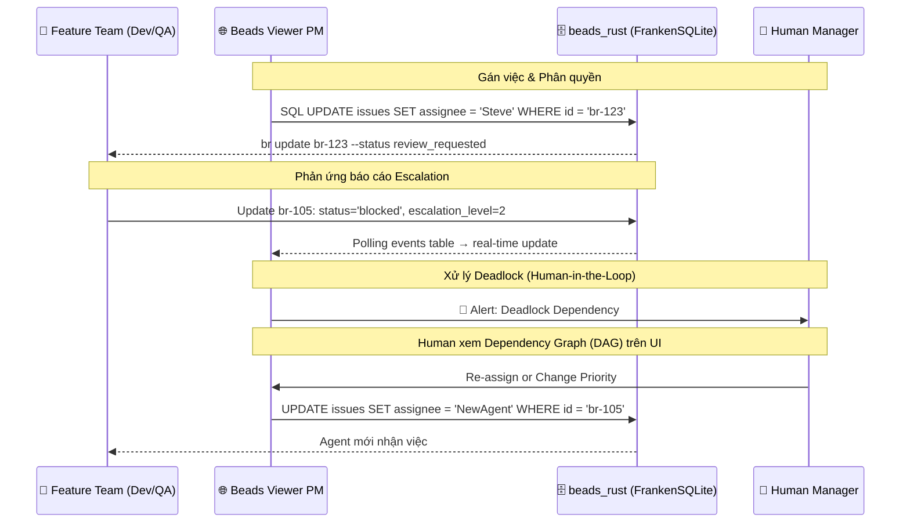

# PRD 04: Giao diện PM & Quản lý Không gian làm việc (Web UI & PM Workspace)

## 1. Quản lý Project Tasks (PM Custom Fields) qua First-class SQL Columns

Để thiết lập hệ thống gán việc như một "JIRA thu nhỏ", beads_rust sử dụng **first-class SQL columns** thay vì JSON blob. Các trường PM là cột indexed, type-safe, queryable trực tiếp — hiệu năng tốt hơn `JSON_EXTRACT()`.

### Schema beads_rust — PM Fields

```sql
-- Bảng issues đã có sẵn trong beads_rust
CREATE TABLE issues (
    id TEXT PRIMARY KEY,
    title TEXT NOT NULL,
    status TEXT NOT NULL DEFAULT 'open',
    priority INTEGER NOT NULL DEFAULT 2,    -- 0=P0 Critical → 4=P4 Backlog
    assignee TEXT,                           -- Người được gán (first-class!)
    owner TEXT DEFAULT '',                   -- Chủ sở hữu task
    issue_type TEXT NOT NULL DEFAULT 'task', -- task, bug, feature, epic, ...
    -- ... (35+ cột khác)

    -- PM columns mở rộng (cần thêm qua migration)
    qa_status TEXT DEFAULT '',               -- PASSED, FAILED, PENDING
    qa_verified_by TEXT DEFAULT '',           -- CuongPT.QA
    test_logs_ref TEXT DEFAULT '',            -- zvec-doc-99281
    coverage TEXT DEFAULT '',                 -- 85%
    escalation_level INTEGER DEFAULT 0,      -- 0: Auto, 1: Team, 2: Human, 3: Approval

    -- RTE Approval columns (spike-rte-approval-workflow)
    rte_status TEXT DEFAULT '',               -- escalated, discussing, approved, rejected
    rte_resolution TEXT DEFAULT '',           -- free-text: phương án đã phê duyệt (= Execution Context)
    rte_approved_at TEXT DEFAULT '',          -- timestamp phê duyệt
    rte_approved_by TEXT DEFAULT ''           -- ai phê duyệt (RTE agent/Human)
);

-- Bảng dependencies riêng (first-class relational!)
CREATE TABLE dependencies (
    issue_id TEXT NOT NULL,
    depends_on_id TEXT NOT NULL,
    type TEXT NOT NULL DEFAULT 'blocks',   -- blocks, parent-child, related, ...
    FOREIGN KEY (issue_id) REFERENCES issues(id)
);
```

### So sánh paradigm: JSON blob (cũ) → SQL columns (mới)

| Thao tác        | ~~DoltDB (cũ)~~                                       | beads_rust (mới)                                      |
| --------------- | ----------------------------------------------------- | ----------------------------------------------------- |
| Gán assignee    | `JSON_SET(metadata, '$.assignee', 'Steve')`           | `UPDATE issues SET assignee = 'Steve'`                |
| Lọc theo role   | `JSON_EXTRACT(metadata, '$.role_required')`           | `SELECT * FROM labels WHERE label = 'role:developer'` |
| Xem blockers    | `JSON_EXTRACT(metadata, '$.dependencies.blocked_by')` | `SELECT * FROM dependencies WHERE type = 'blocks'`    |
| QA verification | `JSON_EXTRACT(metadata, '$.qa_verification.status')`  | `SELECT qa_status FROM issues WHERE id = ?`           |
| Escalation      | `JSON_EXTRACT(metadata, '$.escalation_level')`        | `SELECT escalation_level FROM issues WHERE id = ?`    |

### Luồng Hoạt động (Workflow) và Xử lý Xung đột qua Web UI



**Nguyên tắc thao tác:**

- PM metadata được lưu dưới dạng **first-class SQL columns** (indexed, type-safe) trên beads_rust.
- Web UI dùng `WHERE` clause trực tiếp để lọc, tìm kiếm và hiển thị dữ liệu — nhanh hơn `JSON_EXTRACT`.
- Cập nhật thông qua Go REST API → SQL `UPDATE` trực tiếp.
- Real-time updates qua **polling `events` table** mỗi 3-5 giây.

## 2. Kiến trúc Giao diện Người dùng (Presentation Layer)

Phiên bản **Beads Viewer PM Edition** đóng vai trò là một dự án mở rộng, tập trung vào trải nghiệm Người quản lý (Human-in-the-Loop Supervision) với các thành phần chính:

### 2.1. API Gateway (Lớp Bảo vệ Dữ liệu)

- Mọi request từ Web UI phải đi qua **Go REST API** (embedded FrankenSQLite).
- Gateway xác thực quyền truy cập, kiểm soát rate-limit, và đảm bảo tính toàn vẹn dữ liệu.
- **Không cho phép UI read/write trực tiếp vào FrankenSQLite/Zvec.**

## 3. Các Giao diện Quản trị (SAFe & Board Views)

- **Portfolio View:** Dành cho CEO/CTO xem Epic, Budget, Roadmap.
- **ART View:** Kanban tổng cho Orchestrator (RTE) / PMO quản lý.
- **Team View:** Bảng Kanban riêng rẽ cho từng Feature Team (VD: `Platform`, `Connectors`, `Quant`).
- **PI Planning Interactive UI:** Không gian tương tác cho lễ PI Planning. Bao gồm **Strategic Sandbox** (kéo thả rủi ro/bài toán để tính Capacity), **Business Value Scoring**, **ROAM Board** để xử lý rủi ro, và phím bấm **[Confidence Vote]** bắt buộc từ Human trước khi khởi chạy Sprint.

## 4. Cổng Phê duyệt Cấp 3 (Level 3 Approval Gates) & Không gian Phê duyệt

Giao diện chặn (Checkpoint) yêu cầu **Bắt buộc Phê duyệt bởi Con người** khi:

1.  **Chuyển Phase (Phase Boundaries):** Từ Planning (Continuous Exploration) sang Execution (Continuous Integration), hoặc qua Release.
2.  **The Ultimate Approval Panel:** Khi Agent đệ trình PR hoặc Task, Web UI gọp chung 5 luồng dữ liệu vào một màn hình duy nhất để Human xem xét: `Test Result (Từ Zvec QA Log)` + `Code Diff (FastCode/Git)` + `Beads ID (br-xxx)` + `PRD Requirements liên kết` + `GitHub PR & CI Status (từ gh CLI)`.

## 5. Đồ thị Tài liệu & Lịch sử HITL (Human-in-the-Loop Document Graph)

- **Document Tree & Commit Lineage:** Hiển thị trực quan lịch sử thay đổi của một tài liệu dưới dạng cây đồ thị liên kết trực tiếp tới từng `git commit` (qua `Beads-ID:` Git Trailer) và thuộc tính `beads ID`. Truy vấn local: `git log --grep='Beads-ID: br-xxx'`.
- **Knowledge Context Linking:** Trỏ ngược từ Yêu cầu (Requirement) sang các Tài liệu tham chiếu (Research references) đã được AI dùng làm Context, giúp con người dễ dàng bổ sung thêm tham chiếu để điều chỉnh Spec.
- **GitHub Enrichment:** Mỗi Beads task hiển thị linked PRs (`gh pr list --search "br-xxx"`), CI status (`gh run list`), và commit history (`git log --grep`). Tất cả query trực tiếp từ local git + `gh` CLI.
- **Requirements Traceability Matrix (RTM):** Hiển thị trực quan liên kết 3 tầng **PRD Section ↔ Plan Element ↔ Task**. Mỗi PRD section có Beads ID riêng (VD: `br-prd01-s1`), Plan elements link ngược qua `satisfies:`, Tasks link ngược qua `implements:`. Cho phép truy vết xuôi (PRD → Code) và ngược (Task → PRD). Xem chi tiết: PRD-02 §3.
- **Coverage Heatmap:** Dashboard hiển thị mức độ cover của từng PRD section: bao nhiêu PRD sections có Plan elements? Bao nhiêu Plan elements đã decompose thành Tasks? Highlight các gaps (sections chưa covered) bằng màu đỏ. Dữ liệu từ `gmind coverage full`.
- **Impact Analysis View:** Khi Human sửa/cập nhật một PRD section, hiển thị cascading impact: Plan elements nào bị ảnh hưởng → Tasks nào cần review/pause/rework → Commits nào liên quan. Dữ liệu từ `gmind impact <prd-section-id>`.

## 6. RTM Dashboard — 4-Panel Requirements Visibility

> ✅ **Thêm mới (2026-03-02):** Dashboard tổng hợp hiển thị Requirements Traceability từ Knowledge Graph, phục vụ qua `gmind serve`. Xem [spike-webui-rtm-dashboard.md](../researches/spikes/spike-webui-rtm-dashboard.md).

| Panel                 | Nội dung                                                                | Data Source                       |
| --------------------- | ----------------------------------------------------------------------- | --------------------------------- |
| **Coverage Heatmap**  | PRD sections coverage % (bar charts, color-coded)                       | `gmind coverage --json`           |
| **Task Progress**     | Pie chart + timeline: Done/In Progress/Blocked/Not Started              | `br list --json`                  |
| **Interactive Graph** | Force-directed graph (D3.js): PRD→Plan→Task→Commit, click-to-drill-down | `gmind trace --json --depth=full` |
| **Gap Analysis**      | List các gaps: missing plan, missing tasks, blocked items               | `gmind gaps --json`               |

**Serving:** `gmind serve [--port 8080]` — Go HTTP server, REST JSON API. Frontend (Vanilla JS + D3.js, dark theme) embedded qua `embed.FS` → single Go binary distribution.
