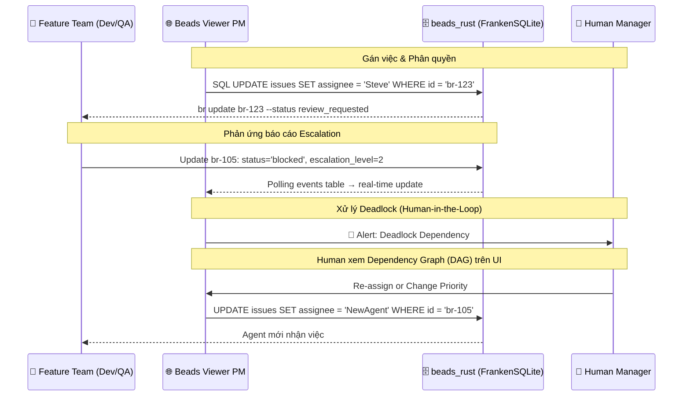

# PRD 04: Giao diện PM & Quản lý Không gian làm việc (Web UI & PM Workspace)

<!-- beads-id: br-prd04 -->

> **3-LAYER PYRAMID CONTEXT — Layer 3 (Detail / Implementation)**
>
> - **Vị trí:** Layer 3 — UI Implementation spec cho Web UI & PM Workspace
> - **Layer 1 (Map):** [PRD-00: Vision & Architecture](./PRD-00-Vision-and-Architecture.md) — Kiến trúc tổng thể
> - **Layer 2 (Orchestration):** [PRD-02: Tracking & RTM](./PRD-02-Universal-Tracking-and-RTM.md) — Beads ID & coverage logic | [PRD-03: CLI](./PRD-03-CLI-and-Agent-Execution.md) — `gmind serve` REST API mà UI consume
> - **Layer 3 (Peer):** [PRD-01: Storage](./PRD-01-Storage-and-Graph-Engine.md) — Data model (FrankenSQLite schema, Zvec)
> - **UI/UX Methodology:** [Spike Ralph Loop](../../researches/spikes/spike-design-system-ralph-loop-agent.md) — Contract-driven UI pipeline (Stage 1: Low-Fi, Stage 2: Hi-Fi)
>
> **>> AGENT DIRECTIVE:** Bạn đang ở Layer 3 (UI Detail). Data contract đến từ PRD-03 (CLI/API). Data model từ PRD-01 (Storage). Nếu implementing UI, sử dụng Ralph Loop workflow: `/gsafe-uiux-ralph-loop-antigravity`.

## 1. Quản lý Project Tasks (PM Custom Fields) qua First-class SQL Columns

<!-- beads-id: br-prd04-s1 -->

Để thiết lập hệ thống gán việc như một "JIRA thu nhỏ", beads_rust sử dụng **first-class SQL columns** thay vì JSON blob. Các trường PM là cột indexed, type-safe, queryable trực tiếp — hiệu năng tốt hơn `JSON_EXTRACT()`.

### Schema beads_rust — PM Fields

```sql
-- Bảng issues đã có sẵn trong beads_rust
CREATE TABLE issues (
    id TEXT PRIMARY KEY,
    title TEXT NOT NULL,
    status TEXT NOT NULL DEFAULT 'open',
    priority INTEGER NOT NULL DEFAULT 2,    -- 0=P0 Critical → 4=P4 Backlog
    assignee TEXT,                           -- Người được gán (first-class!)
    owner TEXT DEFAULT '',                   -- Chủ sở hữu task
    issue_type TEXT NOT NULL DEFAULT 'task', -- task, bug, feature, epic, ...
    -- ... (35+ cột khác)

    -- PM columns mở rộng (cần thêm qua migration)
    qa_status TEXT DEFAULT '',               -- PASSED, FAILED, PENDING
    qa_verified_by TEXT DEFAULT '',           -- CuongPT.QA
    test_logs_ref TEXT DEFAULT '',            -- zvec-doc-99281
    coverage TEXT DEFAULT '',                 -- 85%
    escalation_level INTEGER DEFAULT 0,      -- 0: Auto, 1: Team, 2: Human, 3: Approval

    -- RTE Approval columns (spike-rte-approval-workflow)
    rte_status TEXT DEFAULT '',               -- escalated, discussing, approved, rejected
    rte_resolution TEXT DEFAULT '',           -- free-text: phương án đã phê duyệt (= Execution Context)
    rte_approved_at TEXT DEFAULT '',          -- timestamp phê duyệt
    rte_approved_by TEXT DEFAULT ''           -- ai phê duyệt (RTE agent/Human)
);

-- Bảng dependencies riêng (first-class relational!)
CREATE TABLE dependencies (
    issue_id TEXT NOT NULL,
    depends_on_id TEXT NOT NULL,
    type TEXT NOT NULL DEFAULT 'blocks',   -- blocks, parent-child, related, ...
    FOREIGN KEY (issue_id) REFERENCES issues(id)
);
```

### So sánh paradigm: JSON blob (cũ) → SQL columns (mới)

| Thao tác        | ~~DoltDB (cũ)~~                                       | beads_rust (mới)                                      |
| --------------- | ----------------------------------------------------- | ----------------------------------------------------- |
| Gán assignee    | `JSON_SET(metadata, '$.assignee', 'Steve')`           | `UPDATE issues SET assignee = 'Steve'`                |
| Lọc theo role   | `JSON_EXTRACT(metadata, '$.role_required')`           | `SELECT * FROM labels WHERE label = 'role:developer'` |
| Xem blockers    | `JSON_EXTRACT(metadata, '$.dependencies.blocked_by')` | `SELECT * FROM dependencies WHERE type = 'blocks'`    |
| QA verification | `JSON_EXTRACT(metadata, '$.qa_verification.status')`  | `SELECT qa_status FROM issues WHERE id = ?`           |
| Escalation      | `JSON_EXTRACT(metadata, '$.escalation_level')`        | `SELECT escalation_level FROM issues WHERE id = ?`    |

### Luồng Hoạt động (Workflow) và Xử lý Xung đột qua Web UI



**Nguyên tắc thao tác:**

- PM metadata được lưu dưới dạng **first-class SQL columns** (indexed, type-safe) trên beads_rust.
- Web UI dùng `WHERE` clause trực tiếp để lọc, tìm kiếm và hiển thị dữ liệu — nhanh hơn `JSON_EXTRACT`.
- Cập nhật thông qua Go REST API → SQL `UPDATE` trực tiếp.
- Real-time updates qua **polling `events` table** mỗi 3-5 giây.

## 2. Kiến trúc Giao diện Người dùng (Presentation Layer)

<!-- beads-id: br-prd04-s2 -->

Phiên bản **Beads Viewer PM Edition** đóng vai trò là một dự án mở rộng, tập trung vào trải nghiệm Người quản lý (Human-in-the-Loop Supervision) với các thành phần chính:

### 2.1. API Gateway (Lớp Bảo vệ Dữ liệu)

- Mọi request từ Web UI phải đi qua **Go REST API** (embedded FrankenSQLite).
- Gateway xác thực quyền truy cập, kiểm soát rate-limit, và đảm bảo tính toàn vẹn dữ liệu.
- **Không cho phép UI read/write trực tiếp vào FrankenSQLite/Zvec.**

### 2.2. Offline & Rehydration State (Interactions & Transitions)

- **Offline State:**
  - **Transition:** Khi hệ thống phát hiện mất kết nối (thông qua ping hoặc failed request), UI ngay lập tức chuyển hiệu ứng fade-in một banner màu vàng "Offline Mode" ở trên cùng màn hình.
  - **Interaction:** Chuyển sang chế độ read-only cho hầu hết các biểu đồ (dựa trên IndexedDB/cached data). Các thao tác ghi quan trọng (VD: Update status, Assign) không bị block hoàn toàn mà thay vào đó hiển thị biểu tượng "Pending/Clock" bên cạnh, và được lưu vào hàng đợi local (Local Queue). Nút Submit đổi thành "Save Offline".
- **Rehydration State:**
  - **Transition:** Khi có kết nối mạng trở lại (WebSocket reconnected hoặc successful health check), banner "Offline Mode" chuyển màu xanh và đổi text thành "Syncing...".
  - **Interaction:** Hệ thống xử lý ngầm (background sync) để đẩy hàng đợi local lên Go REST API. Các icon "Pending/Clock" tại các thẻ task chuyển thành "spinner" và sau đó biến mất khi xác nhận server thành công.
  - **Conflict Resolution:** Nếu có xung đột dữ liệu (VD: người khác đã sửa task trong lúc offline), UI hiển thị Modal "Sync Conflict" yêu cầu User chọn "Keep Mine" hoặc "Use Server Version".

## 3. Các Giao diện Quản trị (SAFe & Board Views)

<!-- beads-id: br-prd04-s3 -->

- **Portfolio View:** Dành cho CEO/CTO xem Epic, Budget, Roadmap.
- **ART View:** Kanban tổng cho Orchestrator (RTE) / PMO quản lý.
- **Team View:** Bảng Kanban riêng rẽ cho từng Feature Team (VD: `Platform`, `Connectors`, `Quant`).
- **PI Planning Interactive UI:** Không gian tương tác cho lễ PI Planning. Bao gồm **Strategic Sandbox** (kéo thả rủi ro/bài toán để tính Capacity), **Business Value Scoring**, **ROAM Board** để xử lý rủi ro, và phím bấm **[Confidence Vote]** bắt buộc từ Human trước khi khởi chạy Sprint.

### 3.1. State Matrix & Breakpoints

| State | Mô tả |
| --- | --- |
| **Default** | Hiển thị các bảng Kanban/Portfolio với dữ liệu đầy đủ. |
| **Loading** | Hiển thị skeleton loaders cho các thẻ công việc và bảng điều khiển. |
| **Empty** | Hiển thị "Chưa có dự án/task" kèm nút CTA để tạo mới. |
| **Error** | Hiển thị thông báo "Không thể tải dữ liệu Board" kèm nút "Thử lại". |

**Breakpoints (Responsive):**
- **Desktop (≥ 1024px):** Hiển thị đầy đủ các cột Kanban ngang (Kanban Board) và PI Planning Sandbox.
- **Tablet (768px - 1023px):** Thu hẹp các cột Kanban, cho phép trượt ngang (horizontal scroll).
- **Mobile (< 768px):** Hiển thị dạng List view dọc thay vì Kanban ngang, các thẻ công việc xếp chồng lên nhau.

### 3.2. User Journeys

- **Journey 1 (Board Navigation):** User truy cập `/board` -> Chọn ART View -> Kéo thả (Drag & Drop) một task card từ 'Todo' sang 'In Progress' -> Cập nhật trạng thái thành công.
- **Journey 2 (PI Planning Vote):** User mở thẻ PI Planning -> Xem danh sách rủi ro (ROAM) -> Click nút [Confidence Vote] -> Xác nhận lựa chọn -> Ghi nhận kết quả vote.

## 4. Cổng Phê duyệt Cấp 3 (Level 3 Approval Gates) & Không gian Phê duyệt

<!-- beads-id: br-prd04-s4 -->

Giao diện chặn (Checkpoint) yêu cầu **Bắt buộc Phê duyệt bởi Con người** khi:

1.  **Chuyển Phase (Phase Boundaries):** Từ Planning (Continuous Exploration) sang Execution (Continuous Integration), hoặc qua Release.
2.  **The Ultimate Approval Panel:** Khi Agent đệ trình PR hoặc Task, Web UI gọp chung 5 luồng dữ liệu vào một màn hình duy nhất để Human xem xét: `Test Result (Từ Zvec QA Log)` + `Code Diff (FastCode/Git)` + `Beads ID (br-xxx)` + `PRD Requirements liên kết` + `GitHub PR & CI Status (từ gh CLI)`.

### 4.1. State Matrix & Breakpoints

| State | Mô tả |
| --- | --- |
| **Default** | Hiển thị Panel phê duyệt với 5 luồng dữ liệu (Test, Code Diff, Beads ID, PRD, GitHub PR). |
| **Loading** | Skeleton loaders trong quá trình aggregate dữ liệu từ nhiều nguồn. |
| **Empty** | "Không có yêu cầu phê duyệt nào đang chờ". |
| **Error** | "Lỗi kết nối đến dịch vụ CI/CD hoặc GitHub" với tùy chọn "Bỏ qua & Phê duyệt thủ công" (nếu có quyền Admin). |

**Breakpoints (Responsive):**
- **Desktop (≥ 1024px):** Split-view: Bên trái là luồng dữ liệu (Diff, Test logs), bên phải là PRD context và nút Phê duyệt.
- **Tablet (768px - 1023px) & Mobile (< 768px):** Stack dọc: PRD context ở trên, tiếp đến là luồng dữ liệu, và nút Phê duyệt cố định ở bottom-bar.

### 4.2. User Journeys

- **Journey 1 (Review & Approve):** User mở The Ultimate Approval Panel -> Cuộn qua Code Diff và Test Results -> Kiểm tra PRD Coverage -> Click [Approve] -> Điền comment xác nhận -> Hệ thống tự động merge nhánh và close task.
- **Journey 2 (Review & Reject):** User mở Panel -> Phát hiện Test Failed (màu đỏ) -> Click [Reject] -> Hệ thống yêu cầu điền lý do -> Push feedback về Task/PR tương ứng.

## 5. Đồ thị Tài liệu & Lịch sử HITL (Human-in-the-Loop Document Graph)

<!-- beads-id: br-prd04-s5 -->

> Phần này mô tả **panel nhúng** (embedded widget) trong các trang khác (Dashboard §6 Panel 3, Task Detail §11 tab Graph). Để xem đặc tả **trang đồ thị toàn trang** (full-page explorer), xem §10 Beads Trace Explorer.

### 5.0. Layout Tổng quan — Document Graph Widget

```text
┌──────────────────────────────────────────────────────────────┐
│  Document Graph Widget (Nhúng trong RTM Dashboard Panel 3   │
│  hoặc Task Detail → Tab Graph)                               │
├──────────────────────────────────────────────────────────────┤
│                                                              │
│  ┌──────────────────────┐  ┌──────────────────────────────┐  │
│  │  Graph Canvas         │  │  Side Panel (Chi tiết Node)  │  │
│  │                       │  │                              │  │
│  │  [D3.js force-        │  │  Tiêu đề: <Node Title>       │  │
│  │   directed graph]     │  │  Loại: PRD / Plan / Task /   │  │
│  │                       │  │    Commit / PR / Chat        │  │
│  │   ● PRD section       │  │  Status: ● Done / In Prog    │  │
│  │   ◆ Plan element     │  │  ─────────────────────        │  │
│  │   ■ Task/Issue       │  │  [Chi tiết theo loại node:]   │  │
│  │   ○ Commit            │  │                              │  │
│  │   ▲ Chat/Meeting      │  │  • PRD: section text excerpt │  │
│  │   ⬡ PR/CI            │  │  • Task: assignee, priority  │  │
│  │                       │  │  • Commit: message, author   │  │
│  │  Zoom/Pan controls    │  │  • PR: CI status, reviewers  │  │
│  │  Filter: [Type ▼]     │  │  • Chat: last message preview│  │
│  │                       │  │                              │  │
│  │  [Open Full Page ↗]   │  │  [Mở chi tiết ↗] (link to   │  │
│  │                       │  │   §10 Trace Explorer)        │  │
│  └──────────────────────┘  └──────────────────────────────┘  │
│                                                              │
└──────────────────────────────────────────────────────────────┘
```

### 5.1. Các tính năng chính

- **Document Tree & Commit Lineage:** Hiển thị trực quan lịch sử thay đổi của một tài liệu dưới dạng cây đồ thị liên kết trực tiếp tới từng `git commit` (qua `Beads-ID:` Git Trailer) và thuộc tính `beads ID`. Truy vấn local: `git log --grep='Beads-ID: br-xxx'`.
- **Knowledge Context Linking:** Trỏ ngược từ Yêu cầu (Requirement) sang các Tài liệu tham chiếu (Research references) đã được AI dùng làm Context, giúp con người dễ dàng bổ sung thêm tham chiếu để điều chỉnh Spec.
- **GitHub Enrichment:** Mỗi Beads task hiển thị linked PRs (`gh pr list --search "br-xxx"`), CI status (`gh run list`), và commit history (`git log --grep`). Tất cả query trực tiếp từ local git + `gh` CLI.
- **Requirements Traceability Matrix (RTM):** Hiển thị trực quan liên kết 3 tầng **PRD Section ↔ Plan Element ↔ Task**. Mỗi PRD section có Beads ID riêng (VD: `br-prd01-s1`), Plan elements link ngược qua `satisfies:`, Tasks link ngược qua `implements:`. Cho phép truy vết xuôi (PRD → Code) và ngược (Task → PRD). Xem chi tiết: PRD-02 §3.
- **Coverage Heatmap:** Dashboard hiển thị mức độ cover của từng PRD section: bao nhiêu PRD sections có Plan elements? Bao nhiêu Plan elements đã decompose thành Tasks? Highlight các gaps (sections chưa covered) bằng màu đỏ. Dữ liệu từ `gmind coverage full`.
- **Impact Analysis View:** Khi Human sửa/cập nhật một PRD section, hiển thị cascading impact: Plan elements nào bị ảnh hưởng → Tasks nào cần review/pause/rework → Commits nào liên quan. Dữ liệu từ `gmind impact <prd-section-id>`.

### 5.2. Side Panel — Nội dung theo Loại Node

| Loại Node | Trường hiển thị trong Side Panel |
| --- | --- |
| **PRD Section** | Tiêu đề section, Beads ID, nội dung excerpt (200 chars), coverage %, danh sách Plan elements liên kết |
| **Plan Element** | Tiêu đề, Beads ID, `satisfies:` PRD links, status, danh sách Tasks liên kết |
| **Task/Issue** | Title, status badge, priority, assignee, QA status, `implements:` Plan link |
| **Commit** | Message, author, date, files changed count, link to PR (nếu có) |
| **PR** | Title, status (open/merged/closed), CI status (✅/❌), reviewer list |
| **Chat/Meeting** | Last message preview (100 chars), participant count, timestamp |
| **RTE Approval** | Risk description, decision text, approved by, constraints list |

### 5.3. State Matrix & Breakpoints

| State | Mô tả |
| --- | --- |
| **Default** | Cây đồ thị render toàn bộ node và edge (PRD, Plan, Task, Commit) rõ ràng và tương tác được. |
| **Loading** | Hiển thị skeleton và vòng xoay (spinner) ở trung tâm biểu đồ trong khi truy vấn dữ liệu từ git/CLI. |
| **Empty** | "Chưa có liên kết tài liệu hoặc biểu đồ trống" kèm theo lời khuyên "Bắt đầu link PRD với Tasks". |
| **Error** | "Lỗi truy xuất đồ thị từ gmind" với nút "Tải lại đồ thị". |

**Breakpoints (Responsive):**
- **Desktop (≥ 1024px):** Hiển thị Đồ thị ở vùng trung tâm lớn, Side Panel chứa chi tiết node ở bên phải, Panel điều hướng/tùy chọn (Zoom/Filter) ở góc màn hình.
- **Tablet (768px - 1023px):** Side Panel hiển thị dưới dạng bottom sheet hoặc overlay nhẹ để tiết kiệm diện tích biểu đồ.
- **Mobile (< 768px):** Không khuyến khích dùng đồ thị phức tạp. Thay thế bằng danh sách Tree-view thu gọn (collapsible list) hoặc đồ thị đơn giản hỗ trợ pinch-to-zoom và pan (vuốt, thu phóng).

## 6. RTM Dashboard — 4-Panel Requirements Visibility

<!-- beads-id: br-prd04-s6 -->

> ✅ **Nghiên cứu đã được chấp nhận (2026-03-02 → 2026-03-13):** Nội dung từ [spike-webui-rtm-dashboard.md](../../researches/spikes/spike-webui-rtm-dashboard.md) đã được merge vào PRD làm yêu cầu chính thức.

### 6.1. Dashboard Layout — 4 Panels

**Route:** `/` (Dashboard chính)

**Global Components:**
- **Top Navigation:** Chứa Logo, các links điều hướng (Dashboard, Tasks, Reports), và User Avatar.
- **KPI Cards Row:** Hiển thị list 3 thẻ chỉ số tổng quan đặt phía trên các panels (Coverage %, Tasks Done, Gaps Found).

```text
┌──────────────────────────────────────────────────────────────┐
│  gmind Web UI — RTM Dashboard                                │
├──────────────────────────────────────────────────────────────┤
│                                                              │
│  ┌─────────────────────────┐ ┌────────────────────────────┐  │
│  │  Panel 1:               │ │  Panel 2:                  │  │
│  │  Coverage Heatmap       │ │  Task Progress             │  │
│  │                         │ │                            │  │
│  │  PRD-01 [====90%====]   │ │  Total: 142 tasks          │  │
│  │  PRD-02 [===75%===..]   │ │  Done: 98 (69%)            │  │
│  │  PRD-03 [==60%==....]   │ │  In Progress: 24 (17%)     │  │
│  │                         │ │  Blocked: 8 (6%)           │  │
│  │  Section drill-down:    │ │  Not Started: 12 (8%)      │  │
│  │  s1.1 [====100%====]    │ │                            │  │
│  │  s1.2 [===80%===...]    │ │  [Gantt-like timeline]     │  │
│  │  s1.3 [=40%=........]   │ │                            │  │
│  │                         │ │                            │  │
│  └─────────────────────────┘ └────────────────────────────┘  │
│                                                              │
│  ┌─────────────────────────┐ ┌────────────────────────────┐  │
│  │  Panel 3:               │ │  Panel 4:                  │  │
│  │  Knowledge Graph        │ │  Gap Analysis              │  │
│  │                         │ │                            │  │
│  │  [Interactive graph]    │ │  Gaps Found: 5             │  │
│  │                         │ │                            │  │
│  │  PRD -> Plan -> Task    │ │  ! PRD-02 s3.4: no plan    │  │
│  │   |      |       |      │ │  ! PRD-03 s2.1: no tasks   │  │
│  │   +Docs  +Code   +CI    │ │  ! Plan-15: no PRD link    │  │
│  │                         │ │  ! bd-a1: blocked 5 days   │  │
│  │  Click node -> details  │ │  ! bd-c3: no unit tests    │  │
│  │                         │ │                            │  │
│  └─────────────────────────┘ └────────────────────────────┘  │
│                                                              │
└──────────────────────────────────────────────────────────────┘
```

### 6.2. Panel Details (Đặc tả chi tiết từng Panel)

**Panel 1: Coverage Heatmap**

| Feature       | Description                                                        |
| ------------- | ------------------------------------------------------------------ |
| Data source   | `gmind coverage --json`                                            |
| Visualization | Horizontal bars, color-coded (green=90%+, yellow=60-89%, red=<60%) |
| Interaction   | Click PRD → expand sections (click lại để collapse), click section → show linked tasks ở side panel (side panel đóng bằng nút X hoặc click outside) |
| Refresh       | Auto-refresh every 60s hoặc manual                                 |

**Panel 2: Task Progress**

| Feature       | Description                             |
| ------------- | --------------------------------------- |
| Data source   | `br list --json` (FrankenSQLite issues) |
| Visualization | Pie chart + progress bars + timeline    |
| Grouping      | By PRD, by Plan, by status, by assignee |
| Interaction   | Click status → filter tasks list        |

**Panel 3: Knowledge Graph (Interactive)**

| Feature       | Description                                             |
| ------------- | ------------------------------------------------------- |
| Data source   | `gmind trace <id> --json --depth=full`                  |
| Visualization | Force-directed graph (D3.js)                            |
| Node types    | PRD (blue), Plan (green), Task (yellow), Commit (gray)  |
| Edge types    | satisfies (solid), implements (dashed), committed-for   |
| Interaction   | Click node → side panel with details, drag to rearrange |

**Panel 4: Gap Analysis**

| Feature       | Description                                            |
| ------------- | ------------------------------------------------------ |
| Data source   | `gmind gaps --json`                                    |
| Visualization | List view with severity icons                          |
| Gap types     | Missing plan, missing tasks, blocked tasks, no tests   |
| Interaction   | Click gap → navigate to source, action button "Create" (Mở modal "Create Plan") |

### 6.3. API Layer — REST Endpoints (`gmind serve`)

| Endpoint                   | gmind Command              | Response Format |
| -------------------------- | -------------------------- | --------------- |
| `GET /api/coverage`        | `gmind coverage --json`    | JSON            |
| `GET /api/gaps`            | `gmind gaps --json`        | JSON            |
| `GET /api/trace/:id`       | `gmind trace <id> --json`  | JSON            |
| `GET /api/impact/:section` | `gmind impact <id> --json` | JSON            |
| `GET /api/tasks`           | `br list --json`           | JSON            |
| `GET /api/tasks/:id`       | `br show <id> --json`      | JSON            |

**Implementation Architecture:**

```text
┌──────────────────────────────────────────────────────────────┐
│  gmind serve --port 8080                                     │
├──────────────────────────────────────────────────────────────┤
│                                                              │
│  Go HTTP Server (net/http hoặc chi)                          │
│  ├── /api/coverage  → exec gmind coverage --json             │
│  ├── /api/gaps      → exec gmind gaps --json                 │
│  ├── /api/trace/:id → exec gmind trace <id> --json           │
│  ├── /api/impact/:s → exec gmind impact <s> --json           │
│  └── /static/       → serve Web UI (embedded assets)         │
│                                                              │
│  Frontend: Single-page app                                   │
│  ├── Framework: Vanilla JS + D3.js (graph visualization)     │
│  ├── Style: Dark theme, premium design                       │
│  ├── Layout: 4-panel dashboard (responsive grid)             │
│  └── Build: Embedded in Go binary via embed.FS               │
│                                                              │
└──────────────────────────────────────────────────────────────┘
```

### 6.4. Technology Stack

| Layer     | Tech                    | Lý do                               |
| --------- | ----------------------- | ----------------------------------- |
| Backend   | Go (gmind serve)        | Reuse gmind CLI, single binary      |
| API       | REST JSON               | Simple, curl-friendly               |
| Frontend  | Vanilla JS              | No build step, embed in Go binary   |
| Graph Viz | D3.js force-directed    | Industry standard, flexible         |
| Charts    | Chart.js hoặc D3.js     | Lightweight, responsive             |
| Styling   | CSS custom (dark theme) | Premium feel, consistent with gmind |
| Embedding | Go embed.FS             | Single binary distribution          |

### 6.5. Graph Node & Edge Design

```text
┌──────────────────────────────────────────────────────────────┐
│  Graph Node Types                                            │
├──────────────────────────────────────────────────────────────┤
│                                                              │
│  PRD Section     →  Blue circle, size=large                  │
│  Plan Element    →  Green diamond, size=medium               │
│  Task/Issue      →  Yellow square, size based on status      │
│  Commit          →  Gray dot, size=small                     │
│  Chat/Meeting    →  Purple triangle, size=small              │
│  PR              →  Cyan hexagon, size=medium                │
│  CI Run          →  Orange star, size=small                  │
│                                                              │
│  Edge rendering:                                             │
│  satisfies       →  Solid line, arrow up                     │
│  implements      →  Dashed line, arrow up                    │
│  committed-for   →  Dotted line, arrow right                 │
│  discussed-in    →  Wavy line, bidirectional                 │
│  blocks          →  Red solid, arrow                         │
│                                                              │
│  Status colors:                                              │
│  Done            →  Green fill                               │
│  In Progress     →  Yellow fill                              │
│  Blocked         →  Red fill + pulse animation               │
│  Not Started     →  Gray outline only                        │
│                                                              │
└──────────────────────────────────────────────────────────────┘
```

### 6.6. State Matrix & Breakpoints

| State | Mô tả |
| --- | --- |
| **Default** | Hiển thị đầy đủ 4 panels với data thực tế. |
| **Loading** | Hiển thị skeleton loaders cho các panels. Graph hiển thị spinner. |
| **Empty** | Khi không có dữ liệu, hiển thị illustration "Chưa có dữ liệu theo dõi" kèm nút "Hướng dẫn". |
| **Error** | Hiển thị banner lỗi "Không thể kết nối đến gmind serve" kèm nút "Thử lại". |

**Breakpoints (Responsive):**
- **Desktop (≥ 1024px):** Layout hiển thị 2x2 grid (4 panels).
- **Tablet (768px - 1023px):** Stack 2 grid dọc (2x1 hoăc 1x1 tuỳ kích thước).
- **Mobile (< 768px):** Từng panel xếp dọc (1 cột), graph cho phép pan/zoom bằng touch.

### 6.7. Khả năng Tiếp cận (Accessibility)
- **Tiêu chuẩn:** Tuân thủ WCAG AA.
- **Bắt buộc:** Hỗ trợ điều hướng bằng bàn phím (keyboard navigation) cho toàn bộ 4 panels.
- **Focus:** Cần hiển thị rõ focus outline cho các yếu tố tương tác.

### 6.8. User Journeys

- **Journey 1 (Coverage Drilling):** Người dùng mở RTM Dashboard -> Xem Panel 1 (Coverage Heatmap) -> Nhấp vào PRD có coverage thấp (ví dụ: đỏ) -> Mở rộng để xem các section bên trong -> Nhấp vào một section -> Side panel hiện ra danh sách các task liên kết chưa hoàn thành.
- **Journey 2 (Gap Resolution):** Người dùng xem Panel 4 (Gap Analysis) -> Phát hiện cảnh báo "Missing plan" -> Nhấp vào nút "Create" -> Modal "Create Plan" bật lên -> Điền thông tin plan và lưu -> Dashboard tự động tải lại và gap biến mất.
- **Journey 3 (Impact Traceability):** Người dùng tương tác với Panel 3 (Knowledge Graph) -> Chọn một node PRD -> Xem chi tiết ở side panel -> Kéo thả các node liên kết để phân tích luồng ảnh hưởng (Impact) từ PRD sang Code và Test.

## 7. RTE Approval — UI Integration

<!-- beads-id: br-prd04-s7 -->

> ✅ **Nghiên cứu đã được chấp nhận (2026-03-02 → 2026-03-13):** Nội dung từ [spike-rte-approval-workflow.md](../../researches/spikes/spike-rte-approval-workflow.md) đã được merge. Phần CLI commands nằm tại PRD-03 §4. Phần UI integration đặc tả dưới đây.

Khi Agent escalate rủi ro, Web UI cần hiển thị **RTE Approval Panel** trong Document Graph (§5) và Board Views (§3):

- **Escalation Badge:** Task card hiển thị badge 🔴 `RTE:ESCALATED` khi `rte_status = 'escalated'`
- **Discussion Thread View:** Click task → expand panel hiển thị conversation thread từ Zvec (lọc theo `source_type: rte-discussion`, `beads_ids: [<task-id>]`)
- **Approval Context Display:** Khi `rte_status = 'approved'`, hiển thị **Execution Context block** với:
  - Risk description gốc
  - Decision text (from `rte_resolution`)
  - Constraints list
  - Approved by + timestamp (`rte_approved_by`, `rte_approved_at`)
- **Impact Indicator:** Nếu RTE decision ảnh hưởng PRD scope → highlight PRD section liên quan trên Coverage Heatmap

### 7.1. State Matrix & Breakpoints

| State | Mô tả |
| --- | --- |
| **Default** | Hiển thị Conversation thread và Execution Context block rõ ràng. |
| **Loading** | Skeleton UI cho các tin nhắn trong thread. |
| **Empty** | "Chưa có thảo luận RTE nào cho Task này." |
| **Error** | "Không thể tải lịch sử thảo luận RTE." |

**Breakpoints:**
- **Desktop/Tablet:** Discussion Thread hiển thị dưới dạng Side Panel mở rộng từ bên phải (Right Drawer) khi click vào Task.
- **Mobile:** Side Panel sẽ phủ toàn màn hình (Full-screen overlay) có nút "Close" ở góc trên.

### 7.2. User Journeys

- **Journey 1 (Review Escalated Risk):** PM/RTE nhận thông báo rủi ro qua hệ thống -> Truy cập Task board -> Thấy badge `RTE:ESCALATED` màu đỏ trên một thẻ -> Nhấp vào thẻ -> Right Drawer mở ra hiển thị "Discussion Thread View" giữa Agent và hệ thống -> RTE đọc bối cảnh.
- **Journey 2 (Approve Escalation):** Sau khi đọc "Discussion Thread View" -> RTE nhập phương án giải quyết vào ô thảo luận -> Nhấn nút [Approve Resolution] -> Cột `rte_status` chuyển thành 'approved' -> "Execution Context block" xuất hiện với Decision text và thông tin người phê duyệt -> Heatmap coverage được highlight (nếu có ảnh hưởng).
- **Journey 3 (Reject Escalation):** RTE đọc luồng thảo luận và thấy rủi ro không hợp lệ -> RTE nhập lý do từ chối -> Nhấn nút [Reject] -> Task được đẩy lại cho Agent kèm theo hướng dẫn xử lý tiếp theo.

## 8. Điều hướng & Bản đồ Route (Navigation & Route Map)

<!-- beads-id: br-prd04-s8 -->

> **Data source:** Tất cả routes phục vụ bởi `gmind serve` (PRD-03). Frontend là SPA (Single Page Application) với client-side routing, embed qua `embed.FS`.

### 8.1. Bảng Route Map

| Route | Trang | Mô tả | Data Source API |
| --- | --- | --- | --- |
| `/` | Dashboard (RTM) | 4-panel RTM Dashboard (§6) | `GET /api/coverage`, `/api/tasks`, `/api/trace`, `/api/gaps` |
| `/board` | SAFe Board | Kanban views: Portfolio / ART / Team (§3) | `GET /api/tasks?view=board&level=<level>` |
| `/tasks` | Task List | Bảng danh sách task, filter, sort (§13) | `GET /api/tasks?format=list` |
| `/tasks/:id` | Task Detail | Chi tiết 1 task: tabs Detail/Activity/Graph/Code (§11) | `GET /api/tasks/:id`, `GET /api/trace/:id` |
| `/trace/:id` | Beads Trace Explorer | Đồ thị toàn trang Beads ID → linked entities (§10) | `GET /api/trace/:id?depth=full` |
| `/docs` | Document Viewer | Duyệt & đọc tài liệu từ Zvec (§9) | `GET /api/docs`, `GET /api/docs/:source_type` |
| `/approval` | Approval Gates | Level 3 Approval + RTE Approval (§4, §7) | `GET /api/tasks?status=pending-approval` |
| `/search` | Search Results | Kết quả tìm kiếm toàn hệ thống (§12) | `GET /api/search?q=<query>` |

### 8.2. Layout Tổng quan — Global Shell

```text
┌──────────────────────────────────────────────────────────────────┐
│  Header Bar                                                      │
│  ┌────────┐  ┌───────────────────────────────────────┐  ┌─────┐ │
│  │ ☰ Logo │  │ 🔍 Global Search Bar...               │  │ 🔔  │ │
│  └────────┘  └───────────────────────────────────────┘  └─────┘ │
├──────────┬───────────────────────────────────────────────────────┤
│ Sidebar  │  Main Content Area                                    │
│          │                                                       │
│ 📊 Dash  │  (Nội dung thay đổi theo route hiện tại)              │
│ 📋 Board │                                                       │
│ 📝 Tasks │   Ví dụ: RTM Dashboard / Kanban / Task Detail /       │
│ 🔗 Trace │          Document Viewer / Search Results              │
│ 📄 Docs  │                                                       │
│ ✅ Appvl │                                                       │
│          │                                                       │
│──────────│                                                       │
│ ⬤ Online │                                                       │
│ (Status) │                                                       │
├──────────┴───────────────────────────────────────────────────────┤
│  Footer: gmind v<version> | FrankenSQLite sync status | Uptime  │
└──────────────────────────────────────────────────────────────────┘
```

### 8.3. State Matrix & Breakpoints

| State | Mô tả |
| --- | --- |
| **Default** | Sidebar mở rộng với icon + labels, main content render theo route. |
| **Offline** | Header hiển thị banner vàng "Đang offline — chế độ chỉ đọc". Sidebar vẫn hoạt động. Write operations bị disable (xám). |
| **Loading** | Skeleton UI cho main content. Sidebar vẫn interactive. |

**Breakpoints:**
- **Desktop (≥ 1280px):** Sidebar mở rộng (240px) với icon + text labels.
- **Tablet (768px - 1279px):** Sidebar thu gọn chỉ icon (60px). Hover để xem tooltip.
- **Mobile (< 768px):** Sidebar ẩn hoàn toàn. Hamburger menu (☰) ở header để mở overlay sidebar.

### 8.4. User Journeys

- **Journey 1 (Navigate to Task):** User mở `gmind serve` → Thấy Dashboard 4-panel → Click "Tasks" trên sidebar → Thấy Task List (§13) → Click vào 1 task → Thấy Task Detail (§11).
- **Journey 2 (Explore Trace):** User ở Task Detail → Click tab "Graph" → Thấy mini graph widget (§5) → Click "Open Full Page ↗" → Redirect sang `/trace/:id` Beads Trace Explorer (§10).
- **Journey 3 (Quick Search):** User nhập query vào Global Search Bar → Redirect sang `/search?q=<query>` → Xem kết quả grouped by type (§12).

## 9. Trình xem Tài liệu (Document Viewer)

<!-- beads-id: br-prd04-s9 -->

> **Data source:** Zvec Universal Unstructured Data Indexer (PRD-01 §1) index 9 loại dữ liệu: Docs (*.md), Chat sessions, Meeting notes, Git commits, Git diff summaries, PR descriptions, CI/CD logs, RTE approvals, Agent decision logs.
>
> **Lưu ý:** Đây là Document Viewer cho **Core WebUI** (`gmind serve`) — khác với Doc Viewer trên Showcase Website (`apps/website`). Core WebUI Viewer hiển thị dữ liệu dự án thực từ Zvec, Showcase Website chỉ là bản trình diễn tĩnh.

### 9.1. Layout — Document Viewer

```text
┌──────────────────────────────────────────────────────────────────┐
│  Route: /docs                                                    │
├──────────┬───────────────────────────────────────────────────────┤
│ Doc Tree │  Document Content                                     │
│ (Sidebar)│                                                       │
│          │  ┌─────────────────────────────────────────────────┐  │
│ Filter:  │  │  Breadcrumb: Docs > PRDs > PRD-04              │  │
│ [Type ▼] │  ├─────────────────────────────────────────────────┤  │
│          │  │                                                 │  │
│ ▼ Docs   │  │  # PRD 04: WebUI & PM Workspace                │  │
│   PRD-00 │  │                                                 │  │
│   PRD-01 │  │  Rendered Markdown Content...                   │  │
│   PRD-04 │  │                                                 │  │
│   spike-…│  │  Inline Beads IDs auto-detected:                │  │
│ ▼ Chats  │  │  br-prd04-s1 ← clickable → /trace/br-prd04-s1 │  │
│   sess-1 │  │                                                 │  │
│   sess-2 │  │  Coverage indicator: 78% ██████░░ (from RTM)    │  │
│ ▼ Commits│  │                                                 │  │
│   a1b2c3 │  │                                                 │  │
│ ▼ RTE    │  │  [Open in Trace Explorer ↗] [Copy Beads ID]     │  │
│          │  └─────────────────────────────────────────────────┘  │
└──────────┴───────────────────────────────────────────────────────┘
```

### 9.2. Chức năng chính

| Chức năng | Mô tả | API |
| --- | --- | --- |
| **Browse by Type** | Sidebar hiển thị tree view nhóm theo `source_type` (Docs, Chats, Commits, PRs, CI, RTE, Agent traces) | `GET /api/docs?group=source_type` |
| **Rendered Content** | Markdown files render thành HTML. Non-markdown (commits, logs) hiển thị format monospace | Client-side rendering |
| **Beads ID Auto-link** | Tự động scan nội dung tìm pattern `br-xxx`, `bd-xxx` → render thành clickable links sang `/trace/:id` | Client-side regex |
| **Coverage Indicator** | Nếu document là PRD, hiển thị coverage % từ RTM data | `GET /api/coverage?prd=<beads-id>` |
| **Date Filter** | Filter documents theo time range (last 7 days, 30 days, all) | Query params `?since=<date>` |
| **Search within Doc** | Ctrl+F style search highlight trong document content | Client-side |

### 9.3. State Matrix & Breakpoints

| State | Mô tả |
| --- | --- |
| **Default** | Doc tree loaded, first doc auto-selected and rendered. |
| **Loading** | Skeleton cho doc tree + spinner cho content panel. |
| **Empty** | "Chưa có tài liệu nào được index. Chạy `gmind reindex` để bắt đầu." |
| **Error** | "Không thể tải tài liệu từ Zvec" với nút "Thử lại". |

**Breakpoints:**
- **Desktop (≥ 1024px):** 2-column layout (doc tree 280px + content area).
- **Tablet (768px - 1023px):** Doc tree thu gọn thành dropdown selector ở top.
- **Mobile (< 768px):** Full-width content chỉ. "Back to list" button để quay lại danh sách.

### 9.4. User Journeys

- **Journey 1 (Browse PRDs):** User click "Docs" trên sidebar → Thấy doc tree grouped by type → Expand "Docs" → Click "PRD-04" → Content panel render PRD markdown → User thấy `br-prd04-s5` auto-highlighted → Click `br-prd04-s5` → Redirect sang `/trace/br-prd04-s5`.
- **Journey 2 (Review Chat Session):** User expand "Chats" trong doc tree → Click session → Thấy chat thread rendered trong content panel → Beads IDs trong chat messages auto-linked → Click một beads ID → Mở Trace Explorer (§10).

## 10. Beads Trace Explorer — Khám phá Đồ thị Toàn trang

<!-- beads-id: br-prd04-s10 -->

> **Data source:** `gmind trace <id> --depth=full --json` — Graph Assembler query-time build từ 5 data sources song song (PRD-01 §2 Knowledge Graph, spike-beads-knowledge-graph). Graph KHÔNG lưu riêng — build tại thời điểm truy vấn, luôn fresh. Latency: ~50ms local-only, ~750ms với GitHub.

### 10.1. Layout — Beads Trace Explorer Full Page

```text
┌──────────────────────────────────────────────────────────────────┐
│  Route: /trace/:id                                               │
├──────────────────────────────────────────────────────────────────┤
│  Toolbar                                                         │
│  ┌────────────────────────────────────────────────┐  ┌────────┐ │
│  │ Root: br-prd04-s5 "Đồ thị Tài liệu & HITL"   │  │ Depth: │ │
│  │ [Change Root ▼]                                │  │ [2 ▼]  │ │
│  └────────────────────────────────────────────────┘  └────────┘ │
│  Filter: [PRD ☑] [Plan ☑] [Task ☑] [Commit ☐] [Chat ☐] [PR ☑] │
├──────────────────────────────────────────┬───────────────────────┤
│  Graph Canvas (D3.js Force-Directed)     │  Detail Panel          │
│                                          │                       │
│         ●───satisfies──→◆              │  ▎ br-prd04-s5         │
│         PRD-04-s5        Plan-01        │  ▎ Loại: PRD Section   │
│              │                ↓         │  ▎ Status: Active      │
│         context-from   implements       │  ▎─────────────────── │
│              ↓               ↓          │  ▎ Coverage: 78%       │
│         ▲ Chat-23      ■ Task bd-x1y2  │  ▎ Plans: 3 linked     │
│                              │          │  ▎ Tasks: 12 total     │
│                       committed-for     │  ▎ Gaps: 2 uncovered   │
│                              ↓          │  ▎─────────────────── │
│                         ○ Commit a1b2   │  ▎ Content Excerpt:    │
│                              │          │  ▎ "Hiển thị trực     │
│                           pr-for        │  ▎  quan lịch sử..."  │
│                              ↓          │  ▎                     │
│                         ⬡ PR #42 ✅     │  ▎ [Open Doc ↗]        │
│                                          │  ▎ [View Impact ↗]    │
│  ┌────────┐ ┌────────┐ ┌──────────────┐ │                       │
│  │ Zoom + │ │ Zoom - │ │ Fit to View  │ │  ─── Connected Nodes ─│
│  └────────┘ └────────┘ └──────────────┘ │  br-plan-01 ◆ Active  │
│                                          │  bd-x1y2 ■ Done       │
│  Legend:                                 │  chat-23 ▲ 2026-03-01 │
│  ● PRD  ◆ Plan  ■ Task  ○ Commit        │  PR #42 ⬡ Merged ✅   │
│  ▲ Chat  ⬡ PR/CI  ★ RTE Approval       │                       │
├──────────────────────────────────────────┴───────────────────────┤
│  Footer: 12 nodes | 15 edges | Query time: 48ms | Last refresh  │
└──────────────────────────────────────────────────────────────────┘
```

### 10.2. 10 Node Types & 12 Edge Types

**Node Types** (từ spike-beads-knowledge-graph §B):

| Icon | Loại | Source | Màu |
| --- | --- | --- | --- |
| ● | PRD Section | YAML front matter | 🔴 Đỏ |
| ◆ | Plan Element | Plan document | 🔵 Xanh dương |
| ■ | Task/Issue | FrankenSQLite | 🟢 Xanh lá |
| ○ | Commit | Git local | ⚪ Xám |
| ▲ | Chat/Meeting | Zvec | 🟡 Vàng |
| ⬡ | PR | GitHub `gh` CLI | 🟣 Tím |
| ★ | RTE Approval | Zvec + FrankenSQLite | 🟠 Cam |
| ◇ | CI Run | GitHub `gh` CLI | ⚪ Xám nhạt |
| ▢ | Code File | FastCode | 🔵 Xanh nhạt |
| ◎ | Agent Trace | Zvec | 🟤 Nâu |

**Edge Types** (từ spike-beads-knowledge-graph §C):

| Edge | Chiều | Ví dụ |
| --- | --- | --- |
| `satisfies` | Plan → PRD | Plan-01 satisfies PRD-04-s5 |
| `implements` | Task → Plan | Task bd-x1y2 implements Plan-01 |
| `committed-for` | Commit → Task | Commit a1b2 committed-for bd-x1y2 |
| `discussed-in` | Chat → Task | Chat-23 discussed-in bd-x1y2 |
| `approved-by` | RTE → Task | RTE approval approved-by bd-x1y2 |
| `code-touches` | Code → Task | button.go code-touches bd-x1y2 |
| `pr-for` | PR → Task | PR #42 pr-for bd-x1y2 |
| `blocks` | Task → Task | Task A blocks Task B |
| `parent-child` | Epic → Task | Epic parent-child Feature |
| `discovered-in` | Risk → Task | Risk discovered-in bd-x1y2 |
| `context-from` | Ref → PRD | Research context-from PRD section |
| `tested-by` | CI → PR | CI run tested-by PR #42 |

### 10.3. Tương tác

| Hành động | Kết quả |
| --- | --- |
| **Click node** | Side panel hiển thị chi tiết node (theo bảng §5.2) |
| **Double-click node** | Navigate sang trang tương ứng: Task → `/tasks/:id`, PRD/Doc → `/docs`, PR → external GitHub link |
| **Drag node** | Di chuyển node trong graph canvas. Các edge tự cập nhật. |
| **Zoom/Pan** | Mouse wheel zoom, click-drag pan trên canvas. Touch: pinch-to-zoom. |
| **Filter toolbar** | Toggle node types on/off. Graph re-render chỉ hiển thị types đã chọn. |
| **Depth selector** | Thay đổi depth (1-5). Depth=1 chỉ hiện direct connections. Depth=full hiện toàn bộ. |
| **Right-click node** | Context menu: Copy Beads ID, Open in new tab, Show Impact Analysis |

### 10.4. State Matrix & Breakpoints

| State | Mô tả |
| --- | --- |
| **Default** | Graph render với root node highlighted, edges animated trên hover. |
| **Loading** | Skeleton graph layout + spinner "Đang truy vấn 5 data sources..." |
| **Empty** | "Không tìm thấy liên kết nào cho Beads ID này." + gợi ý kiểm tra ID. |
| **Error** | "Lỗi truy vấn graph từ gmind trace" + nút "Thử lại". |
| **Partial** | Nếu GitHub query timeout (>2s): hiển thị local data trước, badge "⏳ Đang tải GitHub data..." |

**Breakpoints:**
- **Desktop (≥ 1280px):** Graph canvas 70% + Detail Panel 30%.
- **Tablet (768px - 1279px):** Detail Panel chuyển thành bottom sheet (slide-up 50% height).
- **Mobile (< 768px):** Graph full-width với simplified layout (tree view thay force-directed). Detail Panel là full-screen overlay khi click node.

### 10.5. User Journeys

- **Journey 1 (Trace from Task):** User ở Task Detail → Click tab Graph → Thấy mini graph → Click "Open Full Page ↗" → Trang `/trace/bd-x1y2` load → Graph hiển thị: Task → Plan → PRD (upstream) + Task → Commits → PRs → CI (downstream) → User click PRD node → Side panel hiển thị PRD section excerpt + coverage % → User double-click → Redirect sang `/docs` với PRD đó.
- **Journey 2 (Impact Analysis):** User nhập PRD section ID vào thanh "Change Root" → Graph hiển thị tất cả Plan elements, Tasks, Commits bị ảnh hưởng → User thấy 2 tasks đang "in-progress" sẽ bị impact → User click task → Side panel hiển thị assignee → User quyết định pause task.

## 11. Chi tiết Task (Task Detail View)

<!-- beads-id: br-prd04-s11 -->

> **Data source:** `GET /api/tasks/:id` (FrankenSQLite first-class SQL columns — §1) + `GET /api/trace/:id` (Graph Assembler — PRD-01 §2). Edits ghi qua `PUT /api/tasks/:id`.

### 11.1. Layout — Task Detail Page

```text
┌──────────────────────────────────────────────────────────────────┐
│  Route: /tasks/:id                                               │
│  ┌───────────────────────────────────────────────────────────┐   │
│  │ ← Back to Tasks   |  bd-x1y2  |  Status: [In Progress ▼] │   │
│  │ Title: "Change button icon"                    Priority: P1│   │
│  │ Assignee: [Dev Agent 01 ▼]    QA: [pending ▼]             │   │
│  └───────────────────────────────────────────────────────────┘   │
│  ┌── Tabs ──────────────────────────────────────────────────┐   │
│  │ [Detail] │ [Activity] │ [Graph] │ [Code]                  │   │
│  ├───────────────────────────────────────────────────────────┤   │
│  │                                                           │   │
│  │  (Nội dung tab thay đổi theo tab đang chọn)               │   │
│  │                                                           │   │
│  │  Tab Detail:                                               │   │
│  │  ┌──────────────────────────────────────────────────────┐ │   │
│  │  │ Description (Markdown editable):                     │ │   │
│  │  │ "Thay đổi icon nút bấm admin panel theo Material..."│ │   │
│  │  │                                                      │ │   │
│  │  │ Dependencies:                                        │ │   │
│  │  │ ├── implements: br-plan-42 "Redesign admin icons"    │ │   │
│  │  │ └── satisfies:  br-prd01-s4.2 "Giao diện Quản trị"  │ │   │
│  │  │                                                      │ │   │
│  │  │ Labels: [ui] [admin] [icon]    Escalation: None      │ │   │
│  │  └──────────────────────────────────────────────────────┘ │   │
│  └───────────────────────────────────────────────────────────┘   │
└──────────────────────────────────────────────────────────────────┘
```

### 11.2. Nội dung 4 Tabs

| Tab | Nội dung | Data Source |
| --- | --- | --- |
| **Detail** | Markdown description (editable), dependency links (implements/satisfies — clickable sang §10), labels, escalation level, created/updated timestamps | `GET /api/tasks/:id` |
| **Activity** | Timeline dọc: status changes → commits → PR updates → RTE discussions → comments. Mỗi entry có icon + timestamp + actor name | `GET /api/tasks/:id/activity` (new) |
| **Graph** | Mini Document Graph widget (§5) scoped cho task này. Hiển thị upstream (Plan → PRD) + downstream (Commits → PRs → CI) | `GET /api/trace/:id?depth=2` |
| **Code** | Danh sách code files touched: filename, last commit, lines changed. Grouped by directory | `GET /api/trace/:id` → filter `code-touches` edges |

### 11.3. Editable Fields & Validation

| Field | Type | Validation |
| --- | --- | --- |
| `status` | Dropdown | `open`, `in-progress`, `blocked`, `done`, `closed` |
| `assignee` | Dropdown | Danh sách từ `GET /api/agents` |
| `priority` | Dropdown | `P0`, `P1`, `P2`, `P3` |
| `qa_status` | Dropdown | `pending`, `testing`, `passed`, `failed` |
| `description` | Textarea (Markdown) | Max 10,000 chars |
| `labels` | Tag input | Free-text, comma-separated |

> **Write API:** Mỗi field edit gọi `PUT /api/tasks/:id` với payload `{ "field": "value" }`. Optimistic UI update + rollback nếu API lỗi.

### 11.4. State Matrix

| State | Mô tả |
| --- | --- |
| **Default** | Task data loaded, all fields editable, tabs interactive. |
| **Loading** | Skeleton cho header fields + tabs content. |
| **Not Found** | "Task không tồn tại hoặc đã bị xóa. Beads ID: `<id>`" + link về Tasks list. |
| **Offline** | Tất cả fields read-only. Banner "Đang offline — không thể chỉnh sửa." Edits queued locally. |
| **Saving** | Field đang save hiển thị spinner nhỏ bên cạnh. Disable field cho tới khi API respond. |

**Breakpoints:**
- **Desktop:** Full layout như wireframe.
- **Tablet:** Tabs chuyển thành scrollable horizontal tabs.
- **Mobile:** Header fields stack vertically. Tabs thành accordion (expand/collapse).

### 11.5. User Journeys

- **Journey 1 (Edit Task):** User click task từ Task List → Trang load → User click dropdown "Status" → Chọn "Done" → Spinner hiện → API call → Status badge update → Activity tab tự thêm entry mới "Status changed to Done".
- **Journey 2 (Trace Dependencies):** User ở tab Detail → Thấy "implements: br-plan-42" → Click link → Redirect sang `/trace/br-plan-42` Trace Explorer → Thấy full graph context.

## 12. Tìm kiếm & Lọc (Search & Filter)

<!-- beads-id: br-prd04-s12 -->

> **Data source:** 3 search backends: Zvec (semantic/full-text cho docs), FrankenSQLite (structured cho tasks), FastCode (code intelligence). Tất cả qua `GET /api/search?q=<query>&type=<type>` (new endpoint) → backend gọi `gmind search <query> --json`.

### 12.1. Global Search Bar (trong Header — §8.2)

- Luôn hiển thị trên mọi trang (phần của Global Shell).
- Placeholder text: "Tìm tasks, tài liệu, commits, code... (Ctrl+K)"
- Keyboard shortcut: `Ctrl+K` hoặc `/` để focus.
- **Instant suggestions** (debounce 300ms): Top 5 kết quả preview dưới search bar (dropdown).

### 12.2. Trang Search Results (`/search`)

```text
┌──────────────────────────────────────────────────────────────────┐
│  Route: /search?q=<query>                                        │
├──────────────────────────────────────────────────────────────────┤
│  Search: [icon change                                 ] [🔍]    │
│  Results: 23 found (12 Tasks, 5 Docs, 3 Commits, 2 PRs, 1 Chat)│
│  ┌── Filter Sidebar ──┐  ┌── Results ────────────────────────┐  │
│  │                     │  │                                   │  │
│  │ Type:               │  │ ▼ Tasks (12)                      │  │
│  │ ☑ Tasks (12)       │  │ ┌─────────────────────────────┐   │  │
│  │ ☑ Docs (5)         │  │ │ ■ bd-x1y2 "Change button    │   │  │
│  │ ☑ Commits (3)      │  │ │   icon" — Status: In Prog   │   │  │
│  │ ☑ PRs (2)          │  │ │   ...matched: "icon change" │   │  │
│  │ ☐ CI Logs (0)      │  │ └─────────────────────────────┘   │  │
│  │                     │  │ ┌─────────────────────────────┐   │  │
│  │ Date:               │  │ │ ■ bd-c3d4 "Migrate legacy  │   │  │
│  │ ○ All time          │  │ │   icons" — Status: Open     │   │  │
│  │ ● Last 30 days      │  │ └─────────────────────────────┘   │  │
│  │ ○ Last 7 days       │  │                                   │  │
│  │                     │  │ ▼ Docs (5)                        │  │
│  │ Status (Tasks):     │  │ ┌─────────────────────────────┐   │  │
│  │ ☑ Open             │  │ │ 📄 PRD-04 §1 "PM Custom     │   │  │
│  │ ☑ In Progress      │  │ │   Fields" — ...icon asset... │   │  │
│  │ ☐ Done             │  │ └─────────────────────────────┘   │  │
│  │ ☐ Closed           │  │                                   │  │
│  └─────────────────────┘  └───────────────────────────────────┘  │
└──────────────────────────────────────────────────────────────────┘
```

### 12.3. Kết quả theo Type

| Type | Hiển thị | Click Action |
| --- | --- | --- |
| **Task** | Icon ■ + Beads ID + Title + Status badge + snippet | → `/tasks/:id` |
| **Doc** | Icon 📄 + File name + Section title + snippet | → `/docs` với doc đó |
| **Commit** | Icon ○ + Hash (7 chars) + Message + Author + Date | → `/trace/:beads-id` |
| **PR** | Icon ⬡ + PR number + Title + Status (open/merged) | → External GitHub link |
| **Chat/Meeting** | Icon ▲ + Session ID + Last message preview | → `/docs` với chat đó |
| **RTE Approval** | Icon ★ + Task ID + Decision text excerpt | → `/tasks/:id` tab Activity |

### 12.4. State Matrix

| State | Mô tả |
| --- | --- |
| **Default** | Results grouped, filter sidebar interactive, snippet highlights. |
| **Loading** | Skeleton cards + "Đang tìm kiếm trong 3 backends..." |
| **Empty** | "Không tìm thấy kết quả cho `<query>`." + gợi ý: "Thử từ khóa khác hoặc bỏ bớt filter." |
| **Error** | "Lỗi kết nối Zvec/FrankenSQLite" + nút "Thử lại". |

**Breakpoints:**
- **Desktop:** 2-column (filter 240px + results).
- **Tablet:** Filter thu gọn thành expandable panel ở top.
- **Mobile:** Filter ẩn, nút "Filter ▼" toggle dropdown. Results full-width.

## 13. Danh sách Task (Task List View)

<!-- beads-id: br-prd04-s13 -->

> **Data source:** `GET /api/tasks?format=list` (FrankenSQLite — PRD-01 §1). Bổ sung cho SAFe Board Views (§3) — Board = Kanban (visual), List = Table (data-dense, bulk ops).

### 13.1. Layout — Task List Table

```text
┌──────────────────────────────────────────────────────────────────┐
│  Route: /tasks                                                   │
├──────────────────────────────────────────────────────────────────┤
│  ┌── Toggle ────┐  ┌── Filters ──────────────────────┐  ┌─────┐│
│  │ [Board] [List]│  │ Status: [All ▼] Assignee: [▼]  │  │ CSV ││
│  └───────────────┘  │ Priority: [▼]  PRD: [▼]        │  │ ↓   ││
│                     └────────────────────────────────┘  └─────┘│
├──────────────────────────────────────────────────────────────────┤
│ ☐ │ ID       │ Title              │ Status │ Pri │ Assignee │ QA│
│───┼──────────┼────────────────────┼────────┼─────┼──────────┼───│
│ ☐ │ bd-x1y2  │ Change button icon │ ● Prog │ P1  │ DevBot01 │ ⏳│
│ ☐ │ bd-c3d4  │ Migrate legacy ... │ ○ Open │ P2  │ —        │ — │
│ ☑ │ bd-e5f6  │ Add test coverage  │ ✅ Done │ P1  │ QABot    │ ✅│
│ ☐ │ bd-g7h8  │ Update docs        │ ○ Open │ P3  │ —        │ — │
│   │          │                    │        │     │          │   │
│───┼──────────┼────────────────────┼────────┼─────┼──────────┼───│
│   │          │ 1-50 of 147 tasks  │        │ [< Prev] [Next >] │
└──────────────────────────────────────────────────────────────────┘
│  Bulk Actions (khi ≥1 task selected):                            │
│  [Assign To ▼] [Change Status ▼] [Change Priority ▼] [Delete]  │
└──────────────────────────────────────────────────────────────────┘
```

### 13.2. Chức năng

| Chức năng | Mô tả |
| --- | --- |
| **Sort** | Click header column → sort ascending/descending (toggle). Default: updated_at DESC. |
| **Filter** | Dropdowns cho Status, Priority, Assignee, PRD link, QA status. Combine = AND logic. |
| **Pagination** | 50 tasks/page. Prev/Next buttons. |
| **Bulk Select** | Checkbox column. Header checkbox = select all visible. |
| **Bulk Assign** | Chọn ≥1 task → dropdown "Assign To" → select agent → `PUT /api/tasks/bulk` |
| **Bulk Status** | Chọn ≥1 task → dropdown "Change Status" → select status → bulk update |
| **CSV Export** | Download CSV hiện tại (filtered/sorted) |
| **Board/List Toggle** | Switch giữa Kanban view (§3) và Table view. Cùng data, khác presentation. |
| **Row Click** | Click row → navigate sang `/tasks/:id` (§11) |

### 13.3. State Matrix

| State | Mô tả |
| --- | --- |
| **Default** | Table loaded, sortable, filterable, pagination active. |
| **Loading** | Skeleton rows (10 rows placeholder). |
| **Empty** | "Không có task nào." (nếu no filter) hoặc "Không tìm thấy task phù hợp filter." (nếu có filter). |
| **Error** | "Không thể tải danh sách task từ FrankenSQLite." + nút "Thử lại". |
| **Bulk Action Processing** | Disabled controls + spinner trên bulk action bar. Optimistic update cho các rows selected. |

**Breakpoints:**
- **Desktop:** Full table với tất cả columns.
- **Tablet:** Ẩn columns ít quan trọng (QA status, PRD link). Hiển thị trong expandable row detail.
- **Mobile:** Chuyển từ table sang card list (mỗi task = 1 card: Title + Status + Assignee). Tap card → expand chi tiết.

### 13.4. User Journeys

- **Journey 1 (Bulk Assign):** User mở `/tasks` → Filter "Status: Open" → Select 5 tasks → Dropdown "Assign To" → Chọn "DevBot01" → Confirm → API bulk update → 5 rows update assignee column.
- **Journey 2 (Export Report):** User filter "Priority: P0" + "Status: not Done" → Click CSV button → Download file `tasks-p0-open-2026-03-17.csv` → Chia sẻ với PMO.

## 14. Acceptance Criteria (Tiêu chí Nghiệm thu)

## 14A. Contract Defaults & Clarifications for Ralph Loop Stage 1

<!-- beads-id: br-prd04-s14a -->

> Phần này bổ sung các giả định thiết kế mức hợp đồng để phục vụ Ralph Loop Stage 1. Đây là các mặc định hợp lý khi PRD chưa mô tả đủ chi tiết cho wireframe/test contract.

- **Canonical viewports:** Desktop `1440px`, Tablet `1024px`, Mobile `390px`.
- **Canonical interaction states dùng để dựng contract:** `default`, `loading`, `empty`, `error`, `offline`, `partial`, `saving`, `not-found`. Mỗi màn hình chỉ bắt buộc áp dụng các state phù hợp với ngữ cảnh đã mô tả ở các mục trước.
- **Design-system selector convention:** Mọi khối UI có thể kiểm thử phải ánh xạ sang `data-ds-id` ổn định theo mẫu `feature.region.element`.
- **Shell consistency rule:** Tất cả routes kế thừa Global Shell (§8.2) gồm header, điều hướng chính, vùng trạng thái kết nối, và footer; các trang toàn màn hình vẫn giữ khả năng quay lại shell.
- **Modal/drawer defaults:** Trên mobile, drawer/phần phụ chuyển thành full-screen overlay; trên tablet là bottom sheet hoặc condensed drawer; trên desktop là side panel cố định nếu PRD không nêu khác.
- **Empty-state CTA rule:** Mọi state `empty` phải có ít nhất 1 CTA khả thi (`create`, `retry`, `clear filters`, hoặc `reindex`).
- **Error-state recovery rule:** Mọi state `error` phải có thông điệp nguyên nhân ngắn + hành động phục hồi trực tiếp.
- **Accessibility defaults:** Focus order theo thứ tự đọc, mọi vùng tương tác chính đều có tên truy cập được, và màu sắc trạng thái phải có nhãn văn bản đi kèm.
- **Annotation rule cho wireframe:** Mỗi wireframe contract phải ghi rõ data source, hành vi responsive, và điều kiện state transition ở phần annotations.


<!-- beads-id: br-prd04-s14 -->

- **AC1 (Data Source):** Web UI tuyệt đối không gọi Read/Write trực tiếp vào DB, chỉ thông qua Go REST API.
- **AC2 (Real-time):** Thao tác assignee/status cập nhật lên UI trong vòng dưới 5 giây (qua polling events table).
- **AC3 (Level 3 Gate):** Phải có nút chặn (disable) nếu chưa đủ test logs hoặc 5 luồng dữ liệu lỗi.
- **AC4 (RTM Traceability):** Tỷ lệ coverage và biểu đồ Heatmap phải khớp dữ liệu từ `gmind coverage --json`.
- **AC5 (Dashboard Panels):** Cả 4 panels (Coverage, Task Progress, Knowledge Graph, Gap Analysis) phải render đúng data source tương ứng.
- **AC6 (Graph Interaction):** Click node trên Knowledge Graph phải mở side panel chi tiết; drag-to-rearrange hoạt động mượt.
- **AC7 (RTE Approval):** Escalation badge, discussion thread view, và approval context display phải hoạt động đúng theo `rte_status` trong FrankenSQLite.
- **AC8 (Single Binary):** Toàn bộ frontend phải embed được qua `embed.FS` — distribution là single Go binary.
- **AC9 (Navigation):** Tất cả routes trong Route Map (§8) phải navigate được; sidebar highlight active route; breadcrumb cập nhật chính xác.
- **AC10 (Document Viewer):** Document Viewer phải render markdown từ Zvec; auto-detect và link Beads IDs; filter theo source_type hoạt động.
- **AC11 (Trace Explorer):** Beads Trace Explorer phải hiển thị ≥ 6 node types; click node mở side panel; double-click navigate đúng; filter toolbar hoạt động; graph render < 2 giây cho ≤ 50 nodes.
- **AC12 (Task Detail):** Task Detail phải hiển thị 4 tabs; editable fields phải save qua API; Activity timeline phải cập nhật real-time; dependency links clickable sang Trace Explorer.
- **AC13 (Search):** Global search bar phải có instant suggestions (< 500ms); search results phải grouped by type; filter sidebar phải hoạt động; Ctrl+K shortcut focus vào search bar.
- **AC14 (Task List):** Task List phải support sort/filter/pagination; bulk select + bulk actions (assign, status change) phải hoạt động; CSV export phải tải file; Board/List toggle phải seamless.
