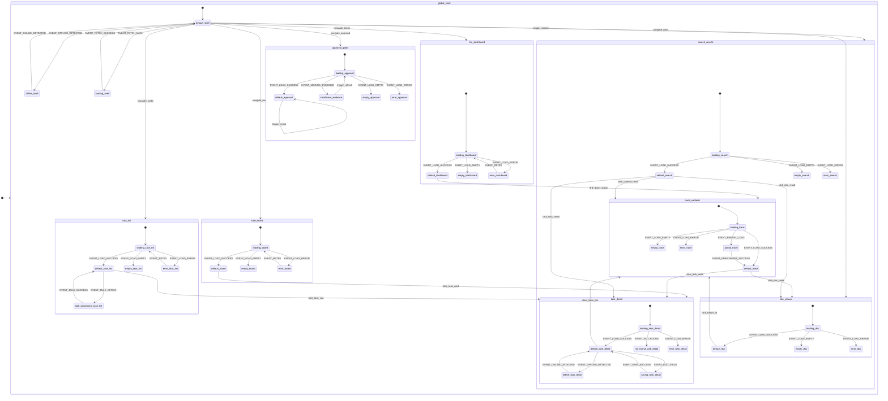

# Flow: PRD-04-WebUI-and-PM-Workspace

```mermaid
stateDiagram-v2
    direction LR

    %% Initial Setup
    [*] --> global_shell

    %% Global Shell State
    state global_shell {
        [*] --> default_shell
        default_shell --> offline_shell: EVENT_OFFLINE_DETECTED
        offline_shell --> default_shell: EVENT_ONLINE_DETECTED
        default_shell --> loading_shell: EVENT_FETCH_DATA
        loading_shell --> default_shell: EVENT_FETCH_SUCCESS
        
        %% Shell Navigation Actions
        default_shell --> rtm_dashboard: navigate_home
        default_shell --> search_results: trigger_search
        default_shell --> safe_board: navigate_board
        default_shell --> task_list: navigate_tasks
        default_shell --> doc_viewer: navigate_docs
        default_shell --> approval_gates: navigate_approval
    }

    %% RTM Dashboard Screen
    state rtm_dashboard {
        [*] --> loading_dashboard
        loading_dashboard --> default_dashboard: EVENT_LOAD_SUCCESS
        loading_dashboard --> empty_dashboard: EVENT_LOAD_EMPTY
        loading_dashboard --> error_dashboard: EVENT_LOAD_ERROR
        error_dashboard --> loading_dashboard: EVENT_RETRY
        
        %% Drill down / Interaction
        default_dashboard --> trace_explorer: drill_down_graph
    }

    %% SAFe Board Screen
    state safe_board {
        [*] --> loading_board
        loading_board --> default_board: EVENT_LOAD_SUCCESS
        loading_board --> empty_board: EVENT_LOAD_EMPTY
        loading_board --> error_board: EVENT_LOAD_ERROR
        error_board --> loading_board: EVENT_RETRY
        
        default_board --> task_detail: click_task_card
    }

    %% Task List Screen
    state task_list {
        [*] --> loading_task_list
        loading_task_list --> default_task_list: EVENT_LOAD_SUCCESS
        loading_task_list --> empty_task_list: EVENT_LOAD_EMPTY
        loading_task_list --> error_task_list: EVENT_LOAD_ERROR
        error_task_list --> loading_task_list: EVENT_RETRY
        
        default_task_list --> bulk_processing_task_list: EVENT_BULK_ACTION
        bulk_processing_task_list --> default_task_list: EVENT_BULK_SUCCESS
        default_task_list --> task_detail: click_task_row
    }

    %% Task Detail Screen
    state task_detail {
        [*] --> loading_task_detail
        loading_task_detail --> default_task_detail: EVENT_LOAD_SUCCESS
        loading_task_detail --> not_found_task_detail: EVENT_NOT_FOUND
        loading_task_detail --> error_task_detail: EVENT_LOAD_ERROR
        default_task_detail --> offline_task_detail: EVENT_OFFLINE_DETECTED
        offline_task_detail --> default_task_detail: EVENT_ONLINE_DETECTED
        default_task_detail --> saving_task_detail: EVENT_EDIT_FIELD
        saving_task_detail --> default_task_detail: EVENT_SAVE_SUCCESS
        
        default_task_detail --> trace_explorer: click_trace_link
    }

    %% Trace Explorer Screen
    state trace_explorer {
        [*] --> loading_trace
        loading_trace --> default_trace: EVENT_LOAD_SUCCESS
        loading_trace --> partial_trace: EVENT_PARTIAL_LOAD
        loading_trace --> empty_trace: EVENT_LOAD_EMPTY
        loading_trace --> error_trace: EVENT_LOAD_ERROR
        partial_trace --> default_trace: EVENT_ENRICHMENT_SUCCESS
        
        default_trace --> task_detail: click_task_node
        default_trace --> doc_viewer: click_doc_node
    }

    %% Doc Viewer Screen
    state doc_viewer {
        [*] --> loading_doc
        loading_doc --> default_doc: EVENT_LOAD_SUCCESS
        loading_doc --> empty_doc: EVENT_LOAD_EMPTY
        loading_doc --> error_doc: EVENT_LOAD_ERROR
        
        default_doc --> trace_explorer: click_beads_id
    }

    %% Approval Gates Screen
    state approval_gates {
        [*] --> loading_approval
        loading_approval --> default_approval: EVENT_LOAD_SUCCESS
        loading_approval --> insufficient_evidence: EVENT_MISSING_EVIDENCE
        loading_approval --> empty_approval: EVENT_LOAD_EMPTY
        loading_approval --> error_approval: EVENT_LOAD_ERROR
        
        default_approval --> default_approval: trigger_approve
        default_approval --> default_approval: trigger_reject
        insufficient_evidence --> loading_approval: trigger_refresh
    }

    %% Search Results Screen
    state search_results {
        [*] --> loading_search
        loading_search --> default_search: EVENT_LOAD_SUCCESS
        loading_search --> empty_search: EVENT_LOAD_EMPTY
        loading_search --> error_search: EVENT_LOAD_ERROR
        
        default_search --> task_detail: click_task_result
        default_search --> doc_viewer: click_doc_result
        default_search --> trace_explorer: click_commit_result
    }
```
