# Review Diagrams: PRD-04-WebUI-and-PM-Workspace

## Screen Inventory and Routes

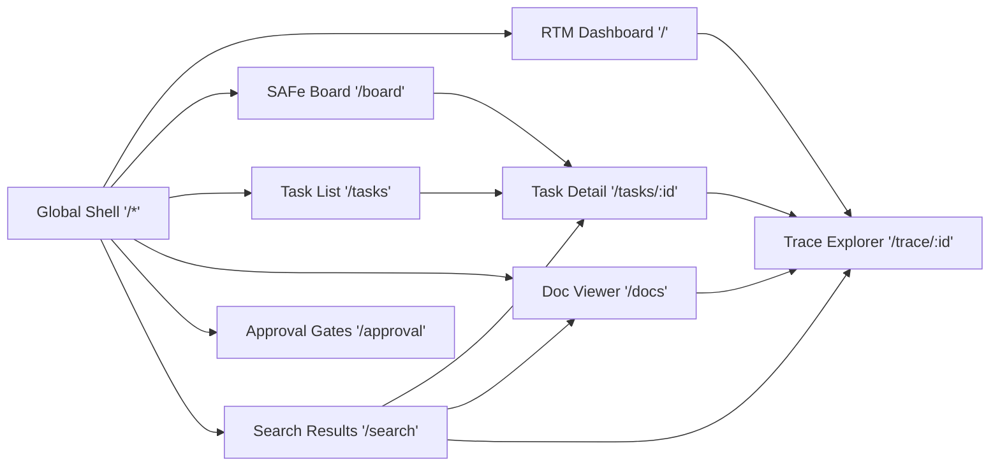

## Responsive Layout Intent by Viewport

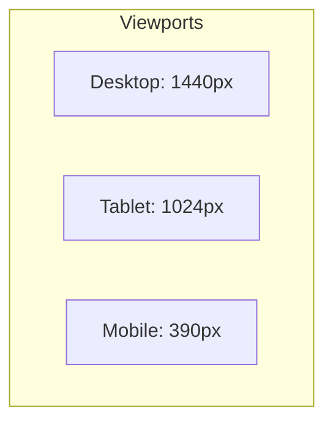

## Per-screen Component Hierarchy

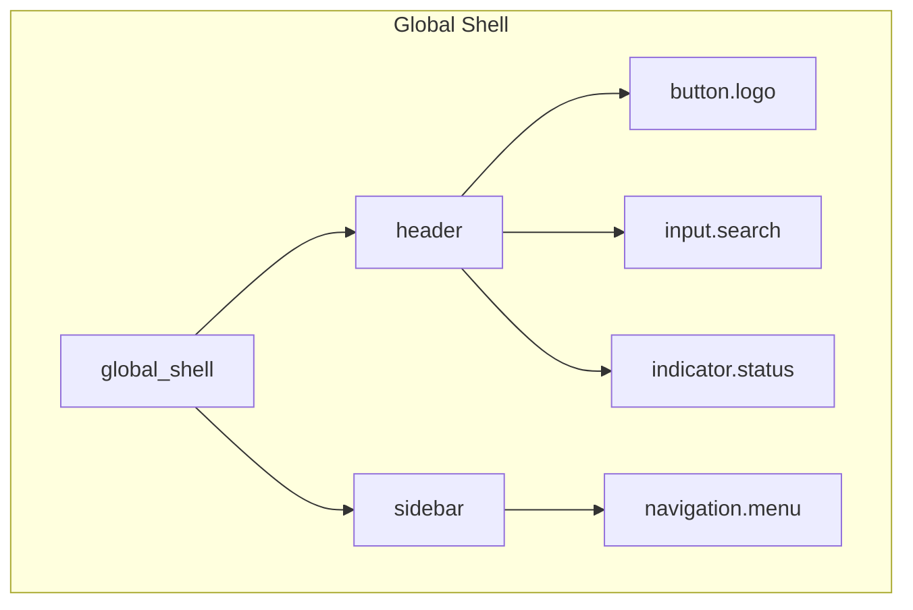

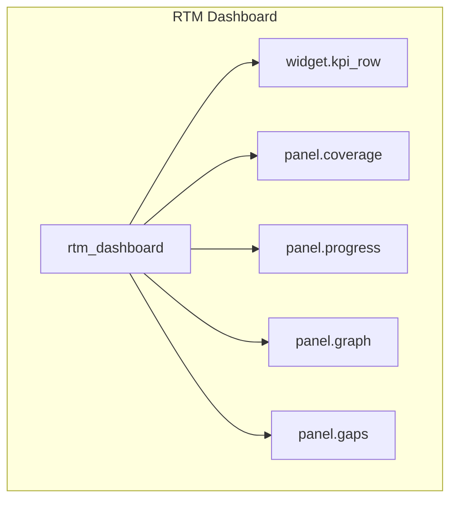

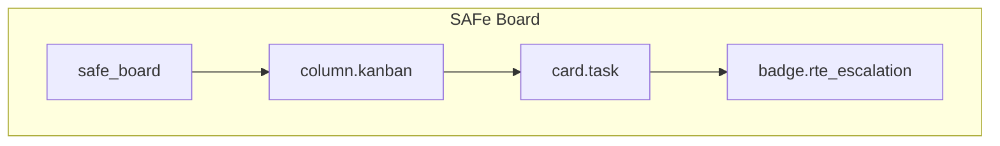

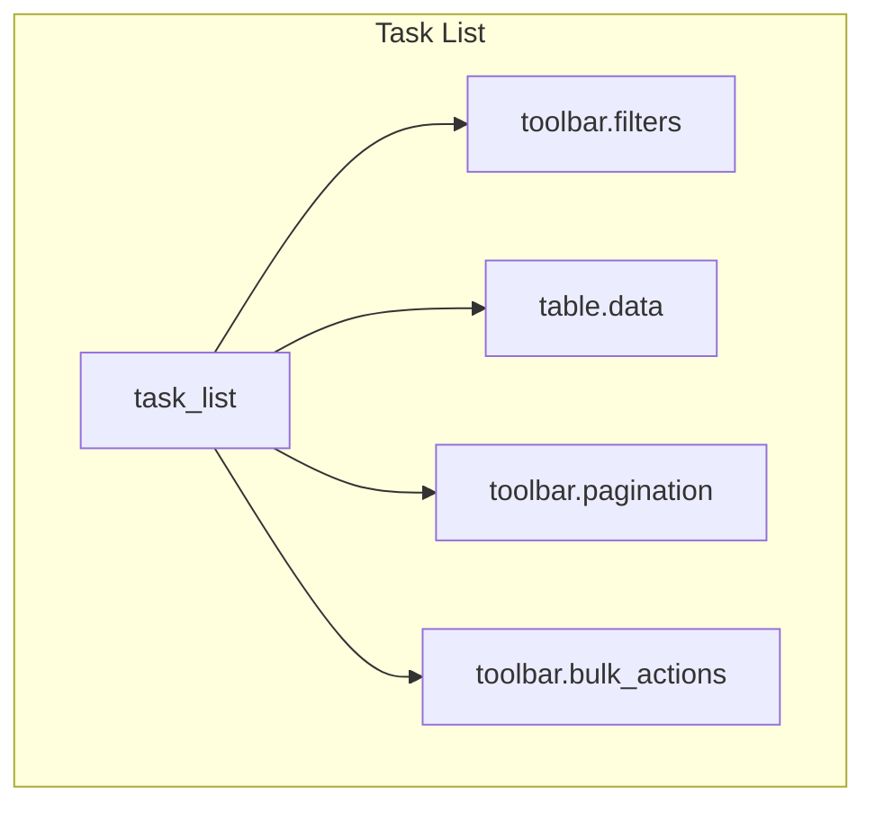

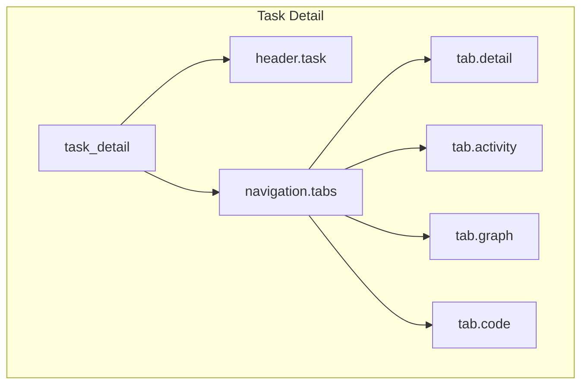

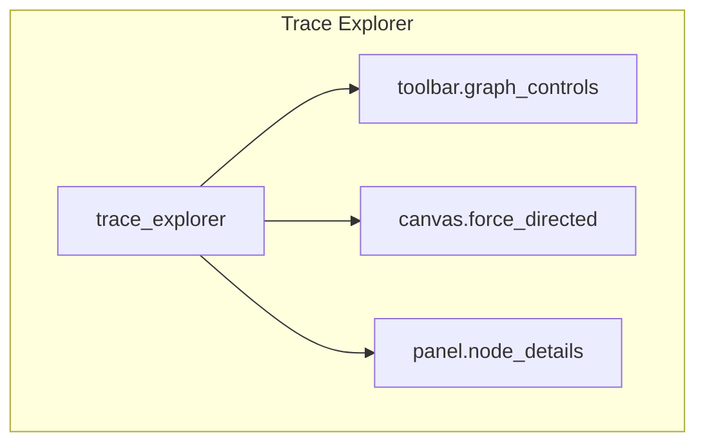

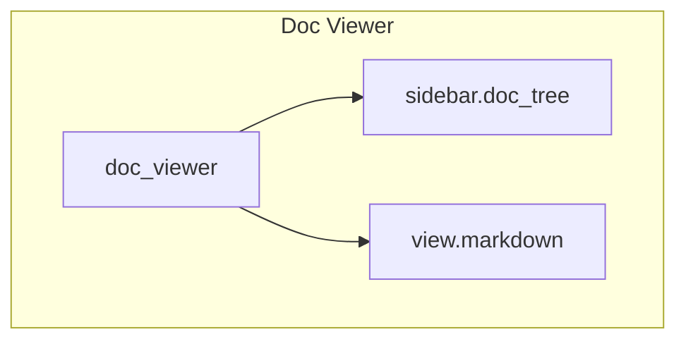

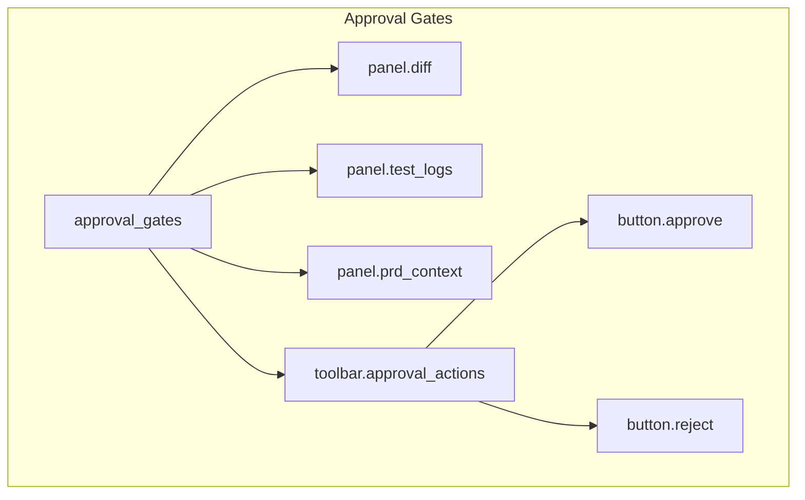

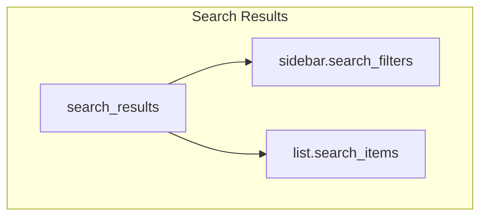

## State Coverage per Screen

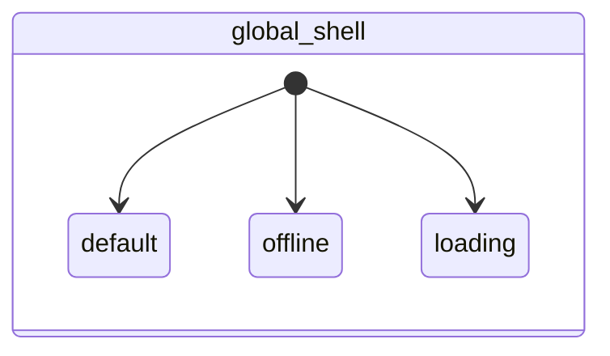

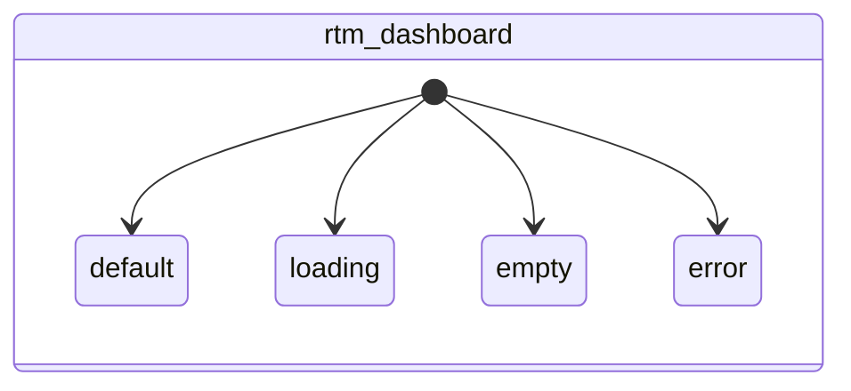


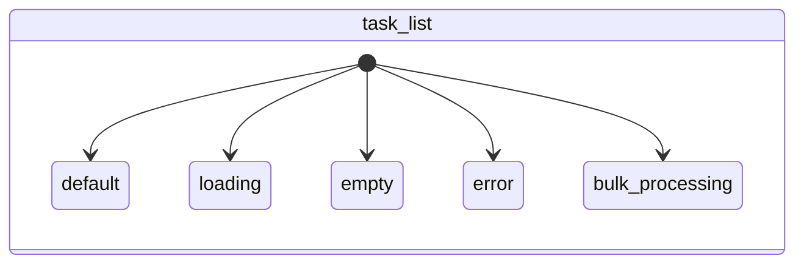

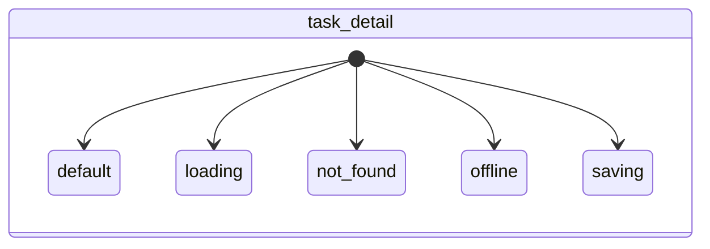

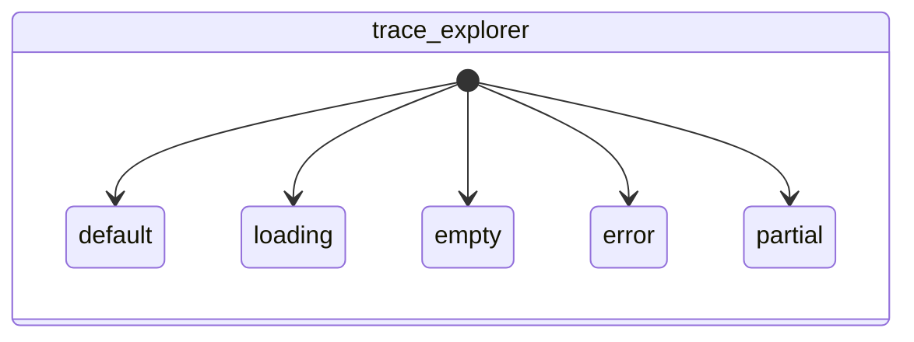

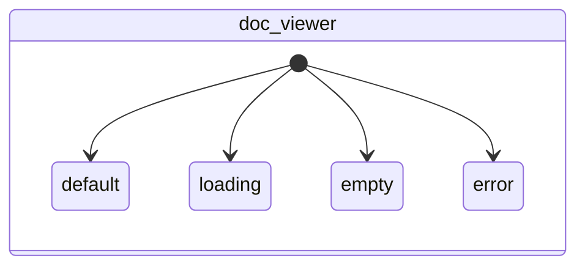

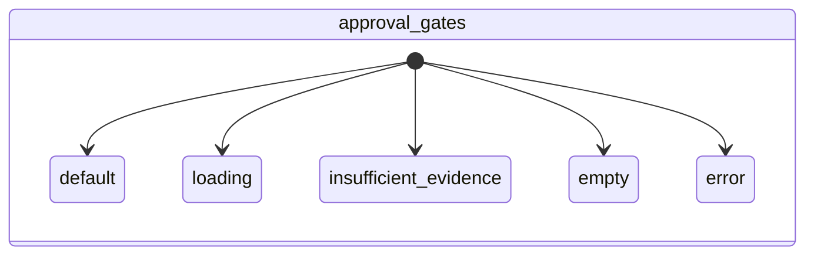

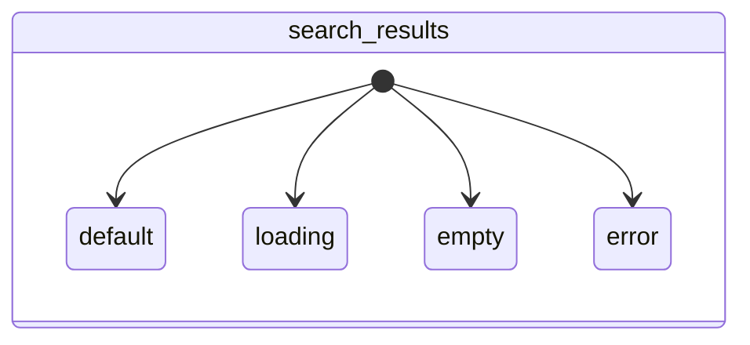

## Action-to-Event Links

```mermaid
flowchart LR
    subgraph Action Links
        navigate_home --> EVENT_LOAD_SUCCESS
        trigger_search --> EVENT_LOAD_SUCCESS
        navigate_board --> EVENT_LOAD_SUCCESS
        navigate_tasks --> EVENT_LOAD_SUCCESS
        navigate_docs --> EVENT_LOAD_SUCCESS
        navigate_approval --> EVENT_LOAD_SUCCESS
        EVENT_OFFLINE_DETECTED --> offline
        EVENT_ONLINE_DETECTED --> default
        EVENT_FETCH_DATA --> loading
        EVENT_FETCH_SUCCESS --> default
        EVENT_LOAD_SUCCESS --> default
        EVENT_LOAD_EMPTY --> empty
        EVENT_LOAD_ERROR --> error
        EVENT_RETRY --> loading
        drill_down_graph --> EVENT_LOAD_SUCCESS
        click_task_card --> EVENT_LOAD_SUCCESS
        EVENT_BULK_ACTION --> bulk_processing
        EVENT_BULK_SUCCESS --> default
        click_task_row --> EVENT_LOAD_SUCCESS
        EVENT_NOT_FOUND --> not_found
        EVENT_EDIT_FIELD --> saving
        EVENT_SAVE_SUCCESS --> default
        click_trace_link --> EVENT_LOAD_SUCCESS
        EVENT_PARTIAL_LOAD --> partial
        EVENT_ENRICHMENT_SUCCESS --> default
        click_task_node --> EVENT_LOAD_SUCCESS
        click_doc_node --> EVENT_LOAD_SUCCESS
        click_beads_id --> EVENT_LOAD_SUCCESS
        EVENT_MISSING_EVIDENCE --> insufficient_evidence
        trigger_approve --> default
        trigger_reject --> default
        trigger_refresh --> loading
        click_task_result --> EVENT_LOAD_SUCCESS
        click_doc_result --> EVENT_LOAD_SUCCESS
        click_commit_result --> EVENT_LOAD_SUCCESS
    end
```
