# UI Contract: Giao diện PM & Quản lý Không gian làm việc (Web UI & PM Workspace)

<!-- beads-id: br-ui-contract-prd04 -->

## 1. Feature Summary
This feature introduces the Web UI and PM Workspace for the gmind system, fulfilling PRD-04. It acts as a miniature JIRA built on first-class SQL columns (FrankenSQLite) and provides advanced SAFe 6.0 management tools, Level 3 Approval gates, RTM (Requirements Traceability Matrix) tracking, and a comprehensive Knowledge Graph (Trace Explorer) across documents, code, and chat sessions. 

The architecture leverages a Go REST API (`gmind serve`) acting as a gateway to the local Git, Zvec, and FrankenSQLite instances, providing a resilient Offline/Rehydration state for uninterrupted PM work.

## 2. YAML View Blueprint

```yaml
metadata:
  feature: PRD-04-WebUI-and-PM-Workspace
  satisfies:
    - br-prd04
    - br-prd04-s1
    - br-prd04-s2
    - br-prd04-s3
    - br-prd04-s4
    - br-prd04-s5
    - br-prd04-s6
    - br-prd04-s7
    - br-prd04-s8
    - br-prd04-s9
    - br-prd04-s10
    - br-prd04-s11
    - br-prd04-s12
    - br-prd04-s13
    - br-prd04-s14
viewports:
  - id: desktop
    width: 1440
  - id: tablet
    width: 1024
  - id: mobile
    width: 390
screens:
  - id: global_shell
    route: "/*"
    states:
      - default
      - offline
      - loading
    layout:
      type: layout.shell
      ds_id: ds:global_shell
      actions:
        - EVENT_OFFLINE_DETECTED
        - EVENT_ONLINE_DETECTED
        - EVENT_FETCH_DATA
        - EVENT_FETCH_SUCCESS
      components:
        - type: header
          ds_id: ds:shell_header
          components:
            - type: button.logo
              ds_id: ds:logo_btn
              actions:
                - navigate_home
            - type: input.search
              ds_id: ds:global_search
              actions:
                - trigger_search
            - type: indicator.status
              ds_id: ds:offline_status_indicator
              visible_in_states:
                - offline
        - type: sidebar
          ds_id: ds:shell_sidebar
          components:
            - type: navigation.menu
              ds_id: ds:nav_menu
              actions:
                - navigate_board
                - navigate_tasks
                - navigate_docs
                - navigate_approval
  - id: rtm_dashboard
    route: "/"
    states:
      - default
      - loading
      - empty
      - error
    layout:
      type: layout.grid
      ds_id: ds:dashboard_grid
      actions:
        - EVENT_LOAD_SUCCESS
        - EVENT_LOAD_EMPTY
        - EVENT_LOAD_ERROR
        - EVENT_RETRY
      components:
        - type: widget.kpi_row
          ds_id: ds:kpi_metrics
        - type: panel.coverage
          ds_id: ds:heatmap_panel
        - type: panel.progress
          ds_id: ds:task_progress_panel
        - type: panel.graph
          ds_id: ds:mini_graph_panel
          actions:
            - drill_down_graph
        - type: panel.gaps
          ds_id: ds:gap_analysis_panel
  - id: safe_board
    route: "/board"
    states:
      - default
      - loading
      - empty
      - error
    layout:
      type: layout.kanban
      ds_id: ds:kanban_layout
      actions:
        - EVENT_LOAD_SUCCESS
        - EVENT_LOAD_EMPTY
        - EVENT_LOAD_ERROR
        - EVENT_RETRY
      components:
        - type: column.kanban
          ds_id: ds:kanban_column
          components:
            - type: card.task
              ds_id: ds:task_card
              actions:
                - click_task_card
              components:
                - type: badge.rte_escalation
                  ds_id: ds:rte_badge
  - id: task_list
    route: "/tasks"
    states:
      - default
      - loading
      - empty
      - error
      - bulk_processing
    layout:
      type: layout.table_view
      ds_id: ds:task_list_layout
      actions:
        - EVENT_LOAD_SUCCESS
        - EVENT_LOAD_EMPTY
        - EVENT_LOAD_ERROR
        - EVENT_RETRY
      components:
        - type: toolbar.filters
          ds_id: ds:task_filters
        - type: table.data
          ds_id: ds:task_table
          actions:
            - click_task_row
        - type: toolbar.pagination
          ds_id: ds:task_pagination
        - type: toolbar.bulk_actions
          ds_id: ds:task_bulk_actions
          actions:
            - EVENT_BULK_ACTION
            - EVENT_BULK_SUCCESS
  - id: task_detail
    route: "/tasks/:id"
    states:
      - default
      - loading
      - not_found
      - offline
      - saving
    layout:
      type: layout.details
      ds_id: ds:task_detail_layout
      actions:
        - EVENT_LOAD_SUCCESS
        - EVENT_NOT_FOUND
        - EVENT_LOAD_ERROR
        - EVENT_OFFLINE_DETECTED
        - EVENT_ONLINE_DETECTED
      components:
        - type: header.task
          ds_id: ds:task_detail_header
        - type: navigation.tabs
          ds_id: ds:task_detail_tabs
          components:
            - type: tab.detail
              ds_id: ds:tab_detail
              actions:
                - EVENT_EDIT_FIELD
                - EVENT_SAVE_SUCCESS
                - click_trace_link
            - type: tab.activity
              ds_id: ds:tab_activity
            - type: tab.graph
              ds_id: ds:tab_graph
            - type: tab.code
              ds_id: ds:tab_code
  - id: trace_explorer
    route: "/trace/:id"
    states:
      - default
      - loading
      - empty
      - error
      - partial
    layout:
      type: layout.split_view
      ds_id: ds:trace_explorer_layout
      actions:
        - EVENT_LOAD_SUCCESS
        - EVENT_PARTIAL_LOAD
        - EVENT_LOAD_EMPTY
        - EVENT_LOAD_ERROR
        - EVENT_ENRICHMENT_SUCCESS
      components:
        - type: toolbar.graph_controls
          ds_id: ds:graph_controls
        - type: canvas.force_directed
          ds_id: ds:d3_canvas
          actions:
            - click_task_node
            - click_doc_node
        - type: panel.node_details
          ds_id: ds:node_detail_drawer
  - id: doc_viewer
    route: "/docs"
    states:
      - default
      - loading
      - empty
      - error
    layout:
      type: layout.split_view
      ds_id: ds:doc_viewer_layout
      actions:
        - EVENT_LOAD_SUCCESS
        - EVENT_LOAD_EMPTY
        - EVENT_LOAD_ERROR
      components:
        - type: sidebar.doc_tree
          ds_id: ds:doc_tree_sidebar
        - type: view.markdown
          ds_id: ds:markdown_viewer
          actions:
            - click_beads_id
  - id: approval_gates
    route: "/approval"
    states:
      - default
      - loading
      - insufficient_evidence
      - empty
      - error
    layout:
      type: layout.stack
      ds_id: ds:approval_layout
      actions:
        - EVENT_LOAD_SUCCESS
        - EVENT_MISSING_EVIDENCE
        - EVENT_LOAD_EMPTY
        - EVENT_LOAD_ERROR
        - trigger_refresh
      components:
        - type: panel.diff
          ds_id: ds:code_diff_panel
        - type: panel.test_logs
          ds_id: ds:test_logs_panel
        - type: panel.prd_context
          ds_id: ds:prd_context_panel
        - type: toolbar.approval_actions
          ds_id: ds:approval_action_bar
          components:
            - type: button.approve
              ds_id: ds:approve_btn
              actions:
                - trigger_approve
            - type: button.reject
              ds_id: ds:reject_btn
              actions:
                - trigger_reject
  - id: search_results
    route: "/search"
    states:
      - default
      - loading
      - empty
      - error
    layout:
      type: layout.split_view
      ds_id: ds:search_results_layout
      actions:
        - EVENT_LOAD_SUCCESS
        - EVENT_LOAD_EMPTY
        - EVENT_LOAD_ERROR
      components:
        - type: sidebar.search_filters
          ds_id: ds:search_filter_sidebar
        - type: list.search_items
          ds_id: ds:search_results_list
          actions:
            - click_task_result
            - click_doc_result
            - click_commit_result
```

## 3. Mermaid State Machine

```mermaid
stateDiagram-v2
    direction LR

    %% Initial Setup
    [*] --> global_shell

    %% Global Shell State
    state global_shell {
        [*] --> default_shell
        default_shell --> offline_shell: EVENT_OFFLINE_DETECTED
        offline_shell --> default_shell: EVENT_ONLINE_DETECTED
        default_shell --> loading_shell: EVENT_FETCH_DATA
        loading_shell --> default_shell: EVENT_FETCH_SUCCESS
        
        %% Shell Navigation Actions
        default_shell --> rtm_dashboard: navigate_home
        default_shell --> search_results: trigger_search
        default_shell --> safe_board: navigate_board
        default_shell --> task_list: navigate_tasks
        default_shell --> doc_viewer: navigate_docs
        default_shell --> approval_gates: navigate_approval
    }

    %% RTM Dashboard Screen
    state rtm_dashboard {
        [*] --> loading_dashboard
        loading_dashboard --> default_dashboard: EVENT_LOAD_SUCCESS
        loading_dashboard --> empty_dashboard: EVENT_LOAD_EMPTY
        loading_dashboard --> error_dashboard: EVENT_LOAD_ERROR
        error_dashboard --> loading_dashboard: EVENT_RETRY
        
        %% Drill down / Interaction
        default_dashboard --> trace_explorer: drill_down_graph
    }

    %% SAFe Board Screen
    state safe_board {
        [*] --> loading_board
        loading_board --> default_board: EVENT_LOAD_SUCCESS
        loading_board --> empty_board: EVENT_LOAD_EMPTY
        loading_board --> error_board: EVENT_LOAD_ERROR
        error_board --> loading_board: EVENT_RETRY
        
        default_board --> task_detail: click_task_card
    }

    %% Task List Screen
    state task_list {
        [*] --> loading_task_list
        loading_task_list --> default_task_list: EVENT_LOAD_SUCCESS
        loading_task_list --> empty_task_list: EVENT_LOAD_EMPTY
        loading_task_list --> error_task_list: EVENT_LOAD_ERROR
        error_task_list --> loading_task_list: EVENT_RETRY
        
        default_task_list --> bulk_processing_task_list: EVENT_BULK_ACTION
        bulk_processing_task_list --> default_task_list: EVENT_BULK_SUCCESS
        default_task_list --> task_detail: click_task_row
    }

    %% Task Detail Screen
    state task_detail {
        [*] --> loading_task_detail
        loading_task_detail --> default_task_detail: EVENT_LOAD_SUCCESS
        loading_task_detail --> not_found_task_detail: EVENT_NOT_FOUND
        loading_task_detail --> error_task_detail: EVENT_LOAD_ERROR
        default_task_detail --> offline_task_detail: EVENT_OFFLINE_DETECTED
        offline_task_detail --> default_task_detail: EVENT_ONLINE_DETECTED
        default_task_detail --> saving_task_detail: EVENT_EDIT_FIELD
        saving_task_detail --> default_task_detail: EVENT_SAVE_SUCCESS
        
        default_task_detail --> trace_explorer: click_trace_link
    }

    %% Trace Explorer Screen
    state trace_explorer {
        [*] --> loading_trace
        loading_trace --> default_trace: EVENT_LOAD_SUCCESS
        loading_trace --> partial_trace: EVENT_PARTIAL_LOAD
        loading_trace --> empty_trace: EVENT_LOAD_EMPTY
        loading_trace --> error_trace: EVENT_LOAD_ERROR
        partial_trace --> default_trace: EVENT_ENRICHMENT_SUCCESS
        
        default_trace --> task_detail: click_task_node
        default_trace --> doc_viewer: click_doc_node
    }

    %% Doc Viewer Screen
    state doc_viewer {
        [*] --> loading_doc
        loading_doc --> default_doc: EVENT_LOAD_SUCCESS
        loading_doc --> empty_doc: EVENT_LOAD_EMPTY
        loading_doc --> error_doc: EVENT_LOAD_ERROR
        
        default_doc --> trace_explorer: click_beads_id
    }

    %% Approval Gates Screen
    state approval_gates {
        [*] --> loading_approval
        loading_approval --> default_approval: EVENT_LOAD_SUCCESS
        loading_approval --> insufficient_evidence: EVENT_MISSING_EVIDENCE
        loading_approval --> empty_approval: EVENT_LOAD_EMPTY
        loading_approval --> error_approval: EVENT_LOAD_ERROR
        
        default_approval --> default_approval: trigger_approve
        default_approval --> default_approval: trigger_reject
        insufficient_evidence --> loading_approval: trigger_refresh
    }

    %% Search Results Screen
    state search_results {
        [*] --> loading_search
        loading_search --> default_search: EVENT_LOAD_SUCCESS
        loading_search --> empty_search: EVENT_LOAD_EMPTY
        loading_search --> error_search: EVENT_LOAD_ERROR
        
        default_search --> task_detail: click_task_result
        default_search --> doc_viewer: click_doc_result
        default_search --> trace_explorer: click_commit_result
    }
```

