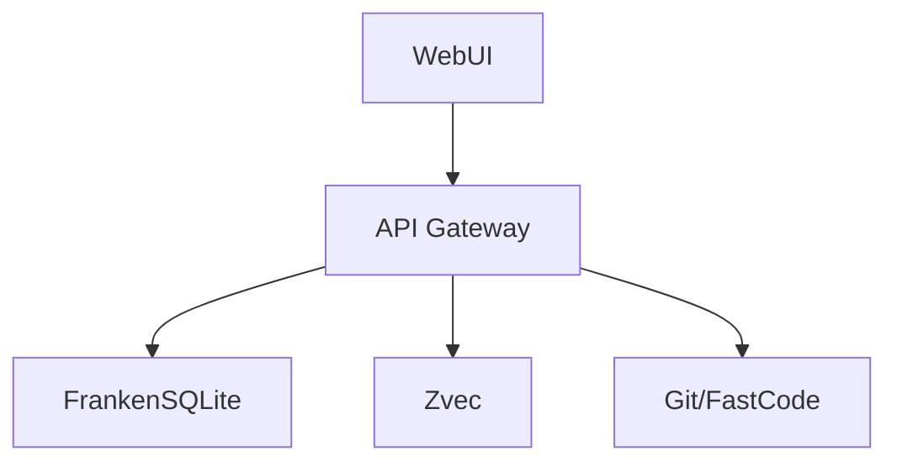

# API Contract: WebUI and PM Workspace

<!-- beads-id: br-plan-api-webui-and-pm-workspace | satisfies: br-prd04 -->

## Flow

## Database Additions (First-class columns)
<!-- beads-id: br-plan-api-webui-columns | satisfies: br-prd04-s1 -->
Required in `issues` table:
- `qa_status TEXT DEFAULT ''`
- `qa_verified_by TEXT DEFAULT ''`
- `test_logs_ref TEXT DEFAULT ''`
- `coverage TEXT DEFAULT ''`
- `escalation_level INTEGER DEFAULT 0`
- `rte_status TEXT DEFAULT ''`
- `rte_resolution TEXT DEFAULT ''`
- `rte_approved_at TEXT DEFAULT ''`
- `rte_approved_by TEXT DEFAULT ''`

Required in `dependencies` table:
- `issue_id TEXT NOT NULL`
- `depends_on_id TEXT NOT NULL`
- `type TEXT NOT NULL DEFAULT 'blocks'`

## Endpoints

### 1. Portfolio & PI Planning
<!-- beads-id: br-plan-api-portfolio | satisfies: br-prd04-s3.1 -->
- `GET /api/portfolio/epics`: Returns epic level portfolio data.
- `GET /api/tasks?issue_type=epic`: Returns list of epic tasks.
- `GET /api/pi/features`: Returns features for PI planning.
- `PUT /api/pi/plan`: Updates the capacity plan.
- `GET /api/risks?view=roam`: Returns risks according to ROAM.
- `POST /api/pi/confidence-vote`: Submits a confidence vote.

### 2. Task Management & Kanban
<!-- beads-id: br-plan-api-tasks | satisfies: br-prd04-s3.3 -->
- `GET /api/tasks`: Returns list of tasks. Supports `?view=board&board=<id>` and filters.
- `GET /api/tasks/:id`: Returns task details.
- `PUT /api/tasks/:id`: Updates task fields (e.g. status, assignee).
- `PUT /api/tasks/:id/status`: Updates task status (specifically for Kanban drops).
- `PUT /api/tasks/bulk`: Bulk updates tasks (assignee, status).

### 3. Approvals
<!-- beads-id: br-plan-api-approval | satisfies: br-prd04-s4.0 -->
- `GET /api/tasks?status=pending-approval`: Returns queue of pending approvals.
- `GET /api/approval/:id/evidence`: Returns evidence for an approval request (Test Logs, Diff, etc).
- `POST /api/approval/:id/decision`: Submits approval decision (Approve/Reject/Request Changes).

### 4. Graph & Traceability (RTM)
<!-- beads-id: br-plan-api-trace | satisfies: br-prd04-s5 -->
- `GET /api/coverage`: Returns coverage heatmap data.
- `GET /api/gaps`: Returns gap analysis data.
- `GET /api/trace/:id`: Returns graph trace for a specific ID. Supports `?depth=full`.
- `GET /api/impact/:section`: Returns cascading impact analysis for a PRD section.
- `GET /api/graph/presets`: Returns preset graph configurations.
- `GET /api/git/graph?scenario=<id>`: Returns synthesized git graph visualization.

### 5. Document Viewer & Search
<!-- beads-id: br-plan-api-docs | satisfies: br-prd04-s9 -->
- `GET /api/docs`: Returns list of documents. Supports `?group=source_type` or `?source_type=rte-discussion&beads_id=<task-id>`.
- `GET /api/docs/:id`: Returns rendered document content.
- `GET /api/search?q=<query>&type=<type>`: Global multi-backend search.

### 6. Activity & CI Terminal
<!-- beads-id: br-plan-api-terminal | satisfies: br-prd04-s14 -->
- `GET /api/tasks/:id/activity`: Returns task activity history.
- `GET /api/agents/sessions`: Returns agent terminal sessions.
- `GET /api/ci/runs`: Returns CI/CD run status.
- `GET /api/activity`: Returns global activity feed.
- `GET /api/file-leases`: Returns current file lock/lease status.

### 7. Storyboards
<!-- beads-id: br-plan-api-storyboards | satisfies: br-prd04-s17 -->
- `GET /api/storyboards`: Returns journey filters and use-case flows.
- `GET /api/storyboards/:id`: Returns storyboard details.
