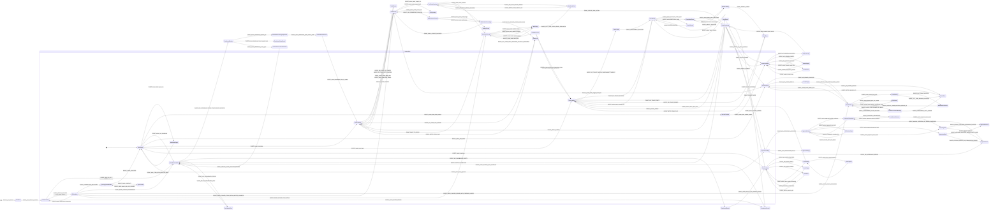

# Flow: WebUI and PM Workspace

<!-- beads-id: br-design-webui-pm-flow -->

```mermaid
stateDiagram-v2
    direction LR
    [*] --> ShellBoot: EVENT_APP_START
    ShellBoot --> HealthLoading: EVENT_API_HEALTH_CHECK
    HealthLoading --> DashboardLoading: EVENT_HEALTH_OK / route=/
    HealthLoading --> OfflineMode: EVENT_HEALTH_OFFLINE / show offline banner
    HealthLoading --> PermissionDenied: EVENT_AUTH_SCOPE_DENIED

    state "Global Shell" as GlobalShell {
        [*] --> ShellReady
        ShellReady --> MobileNavOpen: EVENT_action_shell_open_nav
        MobileNavOpen --> ShellReady: EVENT_NAV_ITEM_SELECTED_OR_BACK
        ShellReady --> SearchFocused: EVENT_action_shell_focus_search
        SearchFocused --> SearchLoading: EVENT_action_shell_submit_search
        ShellReady --> DashboardLoading: EVENT_action_nav_dashboard
        ShellReady --> BoardLoading: EVENT_action_nav_board
        ShellReady --> TasksLoading: EVENT_action_nav_tasks
        ShellReady --> TraceLoading: EVENT_action_nav_trace
        ShellReady --> DocsLoading: EVENT_action_nav_docs
        ShellReady --> ApprovalLoading: EVENT_action_nav_approval
        OfflineMode --> HealthLoading: EVENT_action_shell_retry_connection
        OfflineMode --> SyncingQueuedWrites: EVENT_CONNECTION_RESTORED
        SyncingQueuedWrites --> ShellReady: EVENT_SYNC_SUCCESS
        SyncingQueuedWrites --> SyncConflict: EVENT_SYNC_CONFLICT
        SyncConflict --> SyncingQueuedWrites: EVENT_KEEP_MINE_OR_USE_SERVER
    }

    DashboardLoading --> DashboardReady: EVENT_API_COVERAGE_TASKS_TRACE_GAPS_SUCCESS
    DashboardLoading --> DashboardEmpty: EVENT_API_DASHBOARD_EMPTY
    DashboardLoading --> DashboardError: EVENT_API_DASHBOARD_ERROR
    DashboardReady --> DashboardCoverageExpanded: EVENT_action_dashboard_expand_prd
    DashboardCoverageExpanded --> DashboardSidePanel: EVENT_action_dashboard_open_section_tasks
    DashboardSidePanel --> TasksLoading: EVENT_action_dashboard_filter_by_status
    DashboardReady --> DashboardGraphDetail: EVENT_action_dashboard_select_graph_node
    DashboardReady --> DashboardCreatePlanDrawer: EVENT_action_dashboard_create_plan
    DashboardCreatePlanDrawer --> DashboardLoading: EVENT_CREATE_PLAN_SUCCESS_RELOAD
    DashboardError --> DashboardLoading: EVENT_RETRY_DASHBOARD_APIS
    DashboardEmpty --> DocsLoading: EVENT_OPEN_SETUP_OR_REINDEX_GUIDE

    BoardLoading --> BoardReady: EVENT_API_BOARD_SUCCESS
    BoardLoading --> BoardEmpty: EVENT_API_BOARD_EMPTY
    BoardLoading --> BoardError: EVENT_API_BOARD_ERROR
    BoardReady --> BoardLoading: EVENT_action_board_switch_level
    BoardReady --> BoardSaving: EVENT_action_board_drag_task
    BoardSaving --> BoardMoveSuccess: EVENT_PUT_TASK_SUCCESS
    BoardSaving --> BoardError: EVENT_PUT_TASK_ERROR_ROLLBACK
    BoardMoveSuccess --> BoardReady: EVENT_EVENTS_TABLE_REFRESH_UNDER_5S
    BoardReady --> RteDrawer: EVENT_action_board_open_rte_drawer
    RteDrawer --> BoardReady: EVENT_CLOSE_RTE_DRAWER_OR_BACK
    BoardReady --> ConfidenceVoteSubmitting: EVENT_action_board_submit_confidence_vote
    ConfidenceVoteSubmitting --> BoardReady: EVENT_CONFIDENCE_VOTE_SUCCESS
    ConfidenceVoteSubmitting --> BoardError: EVENT_CONFIDENCE_VOTE_ERROR
    BoardError --> BoardLoading: EVENT_RETRY_BOARD_API
    BoardEmpty --> BoardReady: EVENT_IMPORT_OR_CREATE_WORK_ITEMS

    ApprovalLoading --> ApprovalReady: EVENT_API_APPROVALS_SUCCESS
    ApprovalLoading --> ApprovalEmpty: EVENT_API_APPROVALS_EMPTY
    ApprovalLoading --> ApprovalError: EVENT_API_APPROVALS_ERROR
    ApprovalReady --> EvidenceRefreshing: EVENT_action_approval_refresh_evidence
    EvidenceRefreshing --> ApprovalReady: EVENT_EVIDENCE_COMPLETE
    EvidenceRefreshing --> InsufficientEvidence: EVENT_EVIDENCE_INCOMPLETE
    ApprovalReady --> DiffSectionOpen: EVENT_action_approval_open_diff
    DiffSectionOpen --> ApprovalReady: EVENT_CLOSE_DIFF_OR_BACK
    ApprovalReady --> ApprovingTask: EVENT_action_approval_approve_task
    ApprovingTask --> ApprovalSuccess: EVENT_APPROVE_SUCCESS_MERGE_AND_CLOSE
    ApprovingTask --> ApprovalError: EVENT_APPROVE_ERROR_OR_PERMISSION_DENIED
    ApprovalReady --> RejectingTask: EVENT_action_approval_reject_task
    RejectingTask --> ApprovalSuccess: EVENT_REJECT_SUCCESS_FEEDBACK_POSTED
    RejectingTask --> ApprovalError: EVENT_REJECT_ERROR
    InsufficientEvidence --> EvidenceRefreshing: EVENT_action_approval_refresh_evidence
    InsufficientEvidence --> RejectingTask: EVENT_action_approval_reject_task
    ApprovalError --> EvidenceRefreshing: EVENT_MANUAL_REFRESH_OR_ADMIN_OVERRIDE

    DocsLoading --> DocsReady: EVENT_API_DOCS_SUCCESS
    DocsLoading --> DocsEmpty: EVENT_API_DOCS_EMPTY
    DocsLoading --> DocsError: EVENT_API_DOCS_ERROR
    DocsReady --> DocsLoading: EVENT_action_docs_select_document
    DocsReady --> TraceLoading: EVENT_action_docs_open_trace
    DocsReady --> DocsCopied: EVENT_action_docs_copy_beads_id
    DocsCopied --> DocsReady: EVENT_COPY_TOAST_DISMISSED
    DocsError --> DocsLoading: EVENT_RETRY_DOCS_API
    DocsEmpty --> DocsLoading: EVENT_REINDEX_COMPLETE

    TraceLoading --> TraceReady: EVENT_API_TRACE_SUCCESS
    TraceLoading --> TracePartial: EVENT_API_TRACE_PARTIAL_ENRICHMENT_TIMEOUT
    TraceLoading --> TraceEmpty: EVENT_API_TRACE_EMPTY
    TraceLoading --> TraceError: EVENT_API_TRACE_ERROR
    TraceReady --> TraceLoading: EVENT_action_trace_change_root
    TraceReady --> TraceFiltered: EVENT_action_trace_filter_node_types
    TraceFiltered --> TraceReady: EVENT_FILTER_UPDATED
    TraceReady --> TraceDetailPanel: EVENT_action_trace_select_node
    TraceDetailPanel --> RouteResolving: EVENT_action_trace_open_node_route
    TraceReady --> TraceReady: EVENT_action_trace_fit_view
    TraceDetailPanel --> ImpactLoading: EVENT_action_trace_view_impact
    ImpactLoading --> TraceDetailPanel: EVENT_IMPACT_SUCCESS
    ImpactLoading --> TraceError: EVENT_IMPACT_ERROR
    TracePartial --> TraceReady: EVENT_ENRICHMENT_SUCCESS
    TraceError --> TraceLoading: EVENT_RETRY_TRACE_API
    TraceEmpty --> SearchLoading: EVENT_CHECK_ID_WITH_SEARCH

    TasksLoading --> TasksReady: EVENT_API_TASK_LIST_SUCCESS
    TasksLoading --> TasksEmpty: EVENT_API_TASK_LIST_EMPTY
    TasksLoading --> TasksError: EVENT_API_TASK_LIST_ERROR
    TasksReady --> TasksLoading: EVENT_action_tasks_apply_filter
    TasksReady --> CsvExporting: EVENT_action_tasks_export_csv
    CsvExporting --> TasksReady: EVENT_CSV_DOWNLOAD_STARTED
    TasksReady --> BoardLoading: EVENT_action_tasks_toggle_board_list
    TasksReady --> TasksLoading: EVENT_action_tasks_sort_column
    TasksReady --> TaskDetailLoading: EVENT_action_tasks_open_detail
    TasksReady --> BulkSelectionReady: EVENT_action_tasks_select_row
    BulkSelectionReady --> BulkActionProcessing: EVENT_action_tasks_bulk_assign
    BulkSelectionReady --> BulkActionProcessing: EVENT_action_tasks_bulk_status
    BulkActionProcessing --> TasksReady: EVENT_BULK_UPDATE_SUCCESS
    BulkActionProcessing --> TasksError: EVENT_BULK_UPDATE_ERROR_ROLLBACK
    TasksError --> TasksLoading: EVENT_RETRY_TASKS_API
    TasksEmpty --> TasksLoading: EVENT_CLEAR_FILTERS

    TaskDetailLoading --> TaskDetailReady: EVENT_API_TASK_DETAIL_SUCCESS
    TaskDetailLoading --> TaskNotFound: EVENT_TASK_NOT_FOUND
    TaskDetailLoading --> TaskDetailError: EVENT_API_TASK_DETAIL_ERROR
    TaskDetailReady --> TaskSaving: EVENT_action_task_update_status
    TaskDetailReady --> TaskSaving: EVENT_action_task_update_assignee
    TaskDetailReady --> TaskSaving: EVENT_action_task_update_priority
    TaskSaving --> TaskDetailReady: EVENT_PUT_TASK_FIELD_SUCCESS_ACTIVITY_APPENDED
    TaskSaving --> TaskDetailError: EVENT_PUT_TASK_FIELD_ERROR_ROLLBACK
    TaskDetailReady --> TaskTabContent: EVENT_action_task_switch_tab
    TaskTabContent --> TraceLoading: EVENT_action_task_open_dependency_trace
    TaskTabContent --> TraceLoading: EVENT_action_task_open_full_trace
    TaskDetailError --> TaskDetailLoading: EVENT_RETRY_TASK_DETAIL_API
    TaskNotFound --> TasksLoading: EVENT_BACK_TO_TASKS

    SearchLoading --> SearchReady: EVENT_API_SEARCH_SUCCESS
    SearchLoading --> SearchEmpty: EVENT_API_SEARCH_EMPTY
    SearchLoading --> SearchError: EVENT_API_SEARCH_ERROR
    SearchReady --> SearchLoading: EVENT_action_search_apply_filter
    SearchReady --> RouteResolving: EVENT_action_search_open_result
    SearchError --> SearchLoading: EVENT_action_search_retry
    SearchEmpty --> SearchLoading: EVENT_CLEAR_OR_EDIT_QUERY

    RouteResolving --> DashboardLoading: EVENT_ROUTE_DASHBOARD
    RouteResolving --> BoardLoading: EVENT_ROUTE_BOARD
    RouteResolving --> TasksLoading: EVENT_ROUTE_TASKS
    RouteResolving --> TaskDetailLoading: EVENT_ROUTE_TASK_DETAIL
    RouteResolving --> DocsLoading: EVENT_ROUTE_DOCS
    RouteResolving --> TraceLoading: EVENT_ROUTE_TRACE
    RouteResolving --> ApprovalLoading: EVENT_ROUTE_APPROVAL
    RouteResolving --> SearchLoading: EVENT_ROUTE_SEARCH
    RouteResolving --> PermissionDenied: EVENT_AUTH_SCOPE_DENIED
    PermissionDenied --> DashboardLoading: EVENT_action_boundary_back_dashboard

    OfflineMode --> DashboardLoading: EVENT_READ_CACHED_DASHBOARD
    OfflineMode --> BoardReady: EVENT_READ_CACHED_BOARD_WITH_PENDING_LABELS
    OfflineMode --> TasksReady: EVENT_READ_CACHED_TASKS_WITH_WRITES_DISABLED
    OfflineMode --> TaskDetailReady: EVENT_READ_CACHED_TASK_DETAIL
```
