# Mermaid Flow: WebUI and PM Workspace

<!-- beads-id: br-design-flow-webui-pm-workspace | satisfies: br-prd04-s14a -->

Extracted from the single Mermaid Logic Machine in `ui-contract.md` for quick rendering and diffing.

```mermaid
stateDiagram-v2
    direction LR
    [*] --> Shell_Loading
    Shell_Loading --> Shell_Default: EVENT_API_BOOT_SUCCESS
    Shell_Loading --> Shell_Error: EVENT_API_BOOT_ERROR
    Shell_Error --> Shell_Loading: EVENT_shell_retry_connection
    Shell_Default --> Shell_Offline: EVENT_HEALTHCHECK_FAILED
    Shell_Offline --> Shell_Rehydrating: EVENT_shell_retry_connection
    Shell_Rehydrating --> Shell_Default: EVENT_SYNC_SUCCESS
    Shell_Rehydrating --> Sync_Conflict: EVENT_SYNC_CONFLICT
    Sync_Conflict --> Shell_Rehydrating: EVENT_KEEP_MINE
    Sync_Conflict --> Shell_Rehydrating: EVENT_USE_SERVER_VERSION
    Shell_Default --> Navigation_Overlay: EVENT_shell_open_mobile_navigation
    Navigation_Overlay --> Shell_Default: EVENT_CLOSE_NAVIGATION
    Shell_Default --> SearchResults_Loading: EVENT_shell_submit_global_search
    Shell_Default --> Search_Suggestions: EVENT_shell_focus_global_search
    Search_Suggestions --> SearchResults_Loading: EVENT_shell_submit_global_search
    Shell_Default --> RtmDashboard_Loading: EVENT_NAV_RTM_DASHBOARD
    RtmDashboard_Loading --> RtmDashboard_Default: EVENT_API_RTM_DASHBOARD_SUCCESS
    RtmDashboard_Loading --> RtmDashboard_Empty: EVENT_API_RTM_DASHBOARD_EMPTY
    RtmDashboard_Empty --> RtmDashboard_Loading: EVENT_RECOVERY_CTA
    RtmDashboard_Loading --> RtmDashboard_Error: EVENT_API_RTM_DASHBOARD_ERROR
    RtmDashboard_Error --> RtmDashboard_Loading: EVENT_RETRY
    RtmDashboard_Default --> RtmDashboard_Offline: EVENT_HEALTHCHECK_FAILED
    RtmDashboard_Offline --> Shell_Rehydrating: EVENT_RECONNECT
    Shell_Default --> SafeBoard_Loading: EVENT_NAV_SAFE_BOARD
    SafeBoard_Loading --> SafeBoard_Default: EVENT_API_SAFE_BOARD_SUCCESS
    SafeBoard_Loading --> SafeBoard_Empty: EVENT_API_SAFE_BOARD_EMPTY
    SafeBoard_Empty --> SafeBoard_Loading: EVENT_RECOVERY_CTA
    SafeBoard_Loading --> SafeBoard_Error: EVENT_API_SAFE_BOARD_ERROR
    SafeBoard_Error --> SafeBoard_Loading: EVENT_RETRY
    SafeBoard_Default --> SafeBoard_Offline: EVENT_HEALTHCHECK_FAILED
    SafeBoard_Offline --> Shell_Rehydrating: EVENT_RECONNECT
    Shell_Default --> TaskList_Loading: EVENT_NAV_TASK_LIST
    TaskList_Loading --> TaskList_Default: EVENT_API_TASK_LIST_SUCCESS
    TaskList_Loading --> TaskList_Empty: EVENT_API_TASK_LIST_EMPTY
    TaskList_Empty --> TaskList_Loading: EVENT_RECOVERY_CTA
    TaskList_Loading --> TaskList_Error: EVENT_API_TASK_LIST_ERROR
    TaskList_Error --> TaskList_Loading: EVENT_RETRY
    Shell_Default --> TaskDetail_Loading: EVENT_NAV_TASK_DETAIL
    TaskDetail_Loading --> TaskDetail_Default: EVENT_API_TASK_DETAIL_SUCCESS
    TaskDetail_Default --> TaskDetail_Offline: EVENT_HEALTHCHECK_FAILED
    TaskDetail_Offline --> Shell_Rehydrating: EVENT_RECONNECT
    TaskDetail_Loading --> TaskDetail_NotFound: EVENT_API_TASK_NOT_FOUND
    TaskDetail_NotFound --> TaskList_Loading: EVENT_task_detail_back_to_tasks
    Shell_Default --> ApprovalGates_Loading: EVENT_NAV_APPROVAL_GATES
    ApprovalGates_Loading --> ApprovalGates_Default: EVENT_API_APPROVAL_GATES_SUCCESS
    ApprovalGates_Loading --> ApprovalGates_Empty: EVENT_API_APPROVAL_GATES_EMPTY
    ApprovalGates_Loading --> ApprovalGates_InsufficientEvidence: EVENT_API_APPROVAL_EVIDENCE_INSUFFICIENT
    ApprovalGates_Empty --> ApprovalGates_Loading: EVENT_RECOVERY_CTA
    ApprovalGates_InsufficientEvidence --> ApprovalGates_Loading: EVENT_approval_refresh_evidence
    ApprovalGates_InsufficientEvidence --> ApprovalGates_Writing: EVENT_approval_reject_request
    ApprovalGates_InsufficientEvidence --> ApprovalGates_PermissionDenied: EVENT_approval_approve_request_DENIED
    ApprovalGates_Loading --> ApprovalGates_Error: EVENT_API_APPROVAL_GATES_ERROR
    ApprovalGates_Error --> ApprovalGates_Loading: EVENT_RETRY
    ApprovalGates_Loading --> ApprovalGates_PermissionDenied: EVENT_PERMISSION_DENIED
    ApprovalGates_PermissionDenied --> ApprovalGates_Default: EVENT_REQUEST_ACCESS
    Shell_Default --> DocumentViewer_Loading: EVENT_NAV_DOCUMENT_VIEWER
    DocumentViewer_Loading --> DocumentViewer_Default: EVENT_API_DOCUMENT_VIEWER_SUCCESS
    DocumentViewer_Loading --> DocumentViewer_Empty: EVENT_API_DOCUMENT_VIEWER_EMPTY
    DocumentViewer_Empty --> DocumentViewer_Loading: EVENT_RECOVERY_CTA
    DocumentViewer_Loading --> DocumentViewer_Error: EVENT_API_DOCUMENT_VIEWER_ERROR
    DocumentViewer_Error --> DocumentViewer_Loading: EVENT_RETRY
    Shell_Default --> TraceExplorer_Loading: EVENT_NAV_TRACE_EXPLORER
    TraceExplorer_Loading --> TraceExplorer_Default: EVENT_API_TRACE_EXPLORER_SUCCESS
    TraceExplorer_Loading --> TraceExplorer_Empty: EVENT_API_TRACE_EXPLORER_EMPTY
    TraceExplorer_Empty --> TraceExplorer_Loading: EVENT_RECOVERY_CTA
    TraceExplorer_Loading --> TraceExplorer_Error: EVENT_API_TRACE_EXPLORER_ERROR
    TraceExplorer_Error --> TraceExplorer_Loading: EVENT_RETRY
    TraceExplorer_Loading --> TraceExplorer_Partial: EVENT_GITHUB_TIMEOUT_SHOW_LOCAL_DATA
    TraceExplorer_Partial --> TraceExplorer_Default: EVENT_GITHUB_DATA_SUCCESS
    Shell_Default --> SearchResults_Loading: EVENT_NAV_SEARCH_RESULTS
    SearchResults_Loading --> SearchResults_Default: EVENT_API_SEARCH_RESULTS_SUCCESS
    SearchResults_Loading --> SearchResults_Empty: EVENT_API_SEARCH_RESULTS_EMPTY
    SearchResults_Empty --> SearchResults_Loading: EVENT_RECOVERY_CTA
    SearchResults_Loading --> SearchResults_Error: EVENT_API_SEARCH_RESULTS_ERROR
    SearchResults_Error --> SearchResults_Loading: EVENT_RETRY
    RtmDashboard_Default --> RtmDashboard_Default: EVENT_dashboard_expand_prd_coverage
    RtmDashboard_Default --> DashboardSectionTasksDrawer: EVENT_dashboard_open_section_tasks
    DashboardSectionTasksDrawer --> RtmDashboard_Default: EVENT_CLOSE_PANEL
    RtmDashboard_Default --> TaskList_Loading: EVENT_dashboard_filter_tasks_by_status
    RtmDashboard_Default --> DashboardGraphDetailPanel: EVENT_dashboard_select_graph_node
    DashboardGraphDetailPanel --> RtmDashboard_Default: EVENT_CLOSE_PANEL
    RtmDashboard_Default --> TraceExplorer_Loading: EVENT_dashboard_open_trace_explorer
    RtmDashboard_Default --> RtmDashboard_Default: EVENT_dashboard_open_gap_source
    RtmDashboard_Default --> CreatePlanDialog: EVENT_dashboard_create_plan_from_gap
    CreatePlanDialog --> RtmDashboard_Default: EVENT_CLOSE_PANEL
    SafeBoard_Default --> SafeBoard_Default: EVENT_board_change_level
    SafeBoard_Default --> SafeBoard_Writing: EVENT_board_move_task_card
    SafeBoard_Writing --> SafeBoard_Default: EVENT_API_WRITE_SUCCESS
    SafeBoard_Writing --> SafeBoard_Error: EVENT_API_WRITE_ERROR
    SafeBoard_Writing --> SafeBoard_Offline: EVENT_WRITE_OFFLINE_QUEUED
    SafeBoard_Default --> TaskDetail_Loading: EVENT_board_open_task_detail
    SafeBoard_Default --> RteDiscussionDrawer: EVENT_board_open_rte_thread
    RteDiscussionDrawer --> SafeBoard_Default: EVENT_CLOSE_PANEL
    SafeBoard_Default --> SafeBoard_Default: EVENT_board_adjust_capacity_sandbox
    SafeBoard_Default --> SafeBoard_Writing: EVENT_board_submit_confidence_vote
    SafeBoard_Writing --> SafeBoard_Default: EVENT_API_WRITE_SUCCESS
    SafeBoard_Writing --> SafeBoard_Error: EVENT_API_WRITE_ERROR
    SafeBoard_Writing --> SafeBoard_Offline: EVENT_WRITE_OFFLINE_QUEUED
    SafeBoard_Default --> SafeBoard_Writing: EVENT_board_approve_rte_resolution
    SafeBoard_Writing --> SafeBoard_Default: EVENT_API_WRITE_SUCCESS
    SafeBoard_Writing --> SafeBoard_Error: EVENT_API_WRITE_ERROR
    SafeBoard_Writing --> SafeBoard_Offline: EVENT_WRITE_OFFLINE_QUEUED
    SafeBoard_Default --> SafeBoard_Writing: EVENT_board_reject_rte_resolution
    SafeBoard_Writing --> SafeBoard_Default: EVENT_API_WRITE_SUCCESS
    SafeBoard_Writing --> SafeBoard_Error: EVENT_API_WRITE_ERROR
    SafeBoard_Writing --> SafeBoard_Offline: EVENT_WRITE_OFFLINE_QUEUED
    TaskList_Default --> SafeBoard_Loading: EVENT_tasks_list_switch_to_board
    TaskList_Default --> TaskList_Default: EVENT_tasks_list_apply_filters
    TaskList_Default --> TaskList_Default: EVENT_tasks_list_clear_filters
    TaskList_Default --> TaskList_Default: EVENT_tasks_list_sort_column
    TaskList_Default --> TaskList_Default: EVENT_tasks_list_select_row
    TaskList_Default --> TaskDetail_Loading: EVENT_tasks_list_open_task
    TaskList_Default --> TaskDetail_Loading: EVENT_tasks_list_open_rte_thread
    TaskList_Default --> TaskList_Writing: EVENT_tasks_list_bulk_assign
    TaskList_Writing --> TaskList_Default: EVENT_API_WRITE_SUCCESS
    TaskList_Writing --> TaskList_Error: EVENT_API_WRITE_ERROR
    TaskList_Writing --> Shell_Offline: EVENT_WRITE_OFFLINE_QUEUED
    TaskList_Default --> TaskList_Writing: EVENT_tasks_list_bulk_change_status
    TaskList_Writing --> TaskList_Default: EVENT_API_WRITE_SUCCESS
    TaskList_Writing --> TaskList_Error: EVENT_API_WRITE_ERROR
    TaskList_Writing --> Shell_Offline: EVENT_WRITE_OFFLINE_QUEUED
    TaskList_Default --> TaskList_Writing: EVENT_tasks_list_bulk_change_priority
    TaskList_Writing --> TaskList_Default: EVENT_API_WRITE_SUCCESS
    TaskList_Writing --> TaskList_Error: EVENT_API_WRITE_ERROR
    TaskList_Writing --> Shell_Offline: EVENT_WRITE_OFFLINE_QUEUED
    TaskList_Default --> TaskList_Default: EVENT_tasks_list_export_csv
    TaskDetail_Default --> TaskList_Loading: EVENT_task_detail_back_to_tasks
    TaskDetail_Default --> TaskDetail_Saving: EVENT_task_detail_update_status
    TaskDetail_Saving --> TaskDetail_Default: EVENT_API_WRITE_SUCCESS
    TaskDetail_Saving --> TaskDetail_Default: EVENT_API_WRITE_ERROR
    TaskDetail_Saving --> TaskDetail_Offline: EVENT_WRITE_OFFLINE_QUEUED
    TaskDetail_Default --> TaskDetail_Saving: EVENT_task_detail_update_assignee
    TaskDetail_Saving --> TaskDetail_Default: EVENT_API_WRITE_SUCCESS
    TaskDetail_Saving --> TaskDetail_Default: EVENT_API_WRITE_ERROR
    TaskDetail_Saving --> TaskDetail_Offline: EVENT_WRITE_OFFLINE_QUEUED
    TaskDetail_Default --> TaskDetail_Saving: EVENT_task_detail_update_priority
    TaskDetail_Saving --> TaskDetail_Default: EVENT_API_WRITE_SUCCESS
    TaskDetail_Saving --> TaskDetail_Default: EVENT_API_WRITE_ERROR
    TaskDetail_Saving --> TaskDetail_Offline: EVENT_WRITE_OFFLINE_QUEUED
    TaskDetail_Default --> TaskDetail_Saving: EVENT_task_detail_update_qa_status
    TaskDetail_Saving --> TaskDetail_Default: EVENT_API_WRITE_SUCCESS
    TaskDetail_Saving --> TaskDetail_Default: EVENT_API_WRITE_ERROR
    TaskDetail_Saving --> TaskDetail_Offline: EVENT_WRITE_OFFLINE_QUEUED
    TaskDetail_Default --> TaskDetail_Saving: EVENT_task_detail_save_description
    TaskDetail_Saving --> TaskDetail_Default: EVENT_API_WRITE_SUCCESS
    TaskDetail_Saving --> TaskDetail_Default: EVENT_API_WRITE_ERROR
    TaskDetail_Saving --> TaskDetail_Offline: EVENT_WRITE_OFFLINE_QUEUED
    TaskDetail_Default --> TraceExplorer_Loading: EVENT_task_detail_open_dependency_trace
    TaskDetail_Default --> TraceExplorer_Loading: EVENT_task_detail_open_full_trace
    ApprovalGates_Default --> ApprovalGates_Default: EVENT_approval_select_request
    ApprovalGates_Default --> ApprovalGates_Loading: EVENT_approval_refresh_evidence
    ApprovalGates_Default --> ApprovalGates_InsufficientEvidence: EVENT_EVIDENCE_BECOMES_INVALID
    ApprovalGates_Default --> ApprovalGates_Writing: EVENT_approval_approve_request
    ApprovalGates_Writing --> ApprovalGates_Default: EVENT_API_WRITE_SUCCESS
    ApprovalGates_Writing --> ApprovalGates_Error: EVENT_API_WRITE_ERROR
    ApprovalGates_Writing --> Shell_Offline: EVENT_WRITE_OFFLINE_QUEUED
    ApprovalGates_Default --> ApprovalGates_Writing: EVENT_approval_reject_request
    ApprovalGates_Writing --> ApprovalGates_Default: EVENT_API_WRITE_SUCCESS
    ApprovalGates_Writing --> ApprovalGates_Error: EVENT_API_WRITE_ERROR
    ApprovalGates_Writing --> Shell_Offline: EVENT_WRITE_OFFLINE_QUEUED
    ApprovalGates_Default --> ApprovalGates_PermissionDenied: EVENT_approval_manual_override_DENIED
    ApprovalGates_Default --> ApprovalGates_Writing: EVENT_approval_manual_override
    ApprovalGates_Writing --> ApprovalGates_Default: EVENT_API_WRITE_SUCCESS
    ApprovalGates_Writing --> ApprovalGates_Error: EVENT_API_WRITE_ERROR
    ApprovalGates_Writing --> Shell_Offline: EVENT_WRITE_OFFLINE_QUEUED
    DocumentViewer_Default --> DocumentViewer_Default: EVENT_docs_filter_source_type
    DocumentViewer_Default --> DocumentViewer_Default: EVENT_docs_select_document
    DocumentViewer_Default --> TraceExplorer_Loading: EVENT_docs_open_beads_trace
    DocumentViewer_Default --> DocumentViewer_Default: EVENT_docs_copy_beads_id
    DocumentViewer_Default --> DocumentViewer_Default: EVENT_docs_highlight_in_document
    TraceExplorer_Default --> TraceExplorer_Default: EVENT_trace_change_root
    TraceExplorer_Default --> TraceExplorer_Default: EVENT_trace_change_depth
    TraceExplorer_Default --> TraceExplorer_Default: EVENT_trace_toggle_node_type
    TraceExplorer_Default --> TraceExplorer_Default: EVENT_trace_select_node
    TraceExplorer_Default --> TraceExplorer_Default: EVENT_trace_drag_node
    TraceExplorer_Default --> TraceExplorer_Default: EVENT_trace_zoom_graph
    TraceExplorer_Default --> TraceExplorer_Default: EVENT_trace_open_node_target
    TraceExplorer_Default --> TraceExplorer_Default: EVENT_trace_copy_beads_id
    TraceExplorer_Default --> DocumentViewer_Loading: EVENT_trace_open_doc
    TraceExplorer_Default --> TraceExplorer_Loading: EVENT_trace_view_impact
    SearchResults_Default --> SearchResults_Default: EVENT_search_submit_query
    SearchResults_Default --> SearchResults_Default: EVENT_search_apply_filters
    SearchResults_Default --> SearchResults_Default: EVENT_search_clear_filters
    SearchResults_Default --> TaskDetail_Loading: EVENT_search_open_task_result
    SearchResults_Default --> DocumentViewer_Loading: EVENT_search_open_doc_result
    SearchResults_Default --> TraceExplorer_Loading: EVENT_search_open_trace_result
    SearchResults_Default --> SearchResults_Default: EVENT_search_open_external_pr_result
```

