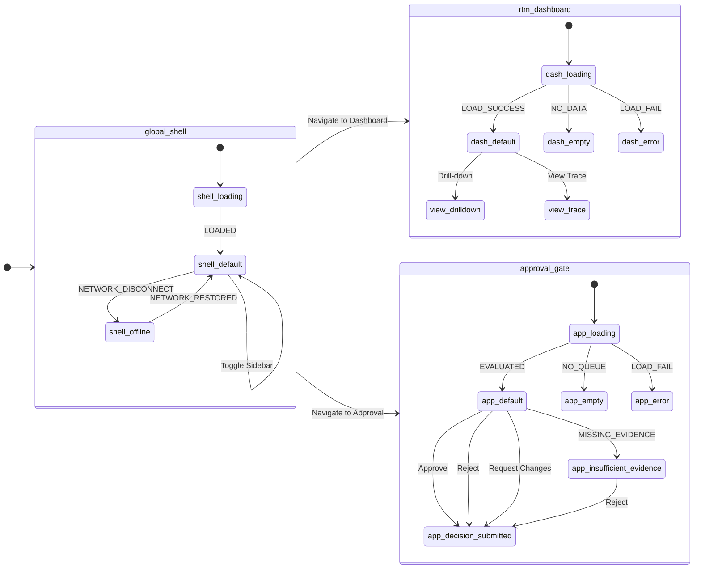

# Flow Definition: webui-and-pm-workspace

```mermaid
stateDiagram-v2
    direction LR

    [*] --> global_shell
    
    state global_shell {
        [*] --> shell_loading
        shell_loading --> shell_default : LOADED
        shell_default --> shell_offline : NETWORK_DISCONNECT
        shell_offline --> shell_default : NETWORK_RESTORED
        shell_default --> shell_default : Toggle Sidebar
    }
    
    global_shell --> rtm_dashboard : Navigate to Dashboard
    global_shell --> approval_gate : Navigate to Approval
    
    state rtm_dashboard {
        [*] --> dash_loading
        dash_loading --> dash_default : LOAD_SUCCESS
        dash_loading --> dash_empty : NO_DATA
        dash_loading --> dash_error : LOAD_FAIL
        dash_default --> view_drilldown : Drill-down
        dash_default --> view_trace : View Trace
    }
    
    state approval_gate {
        [*] --> app_loading
        app_loading --> app_default : EVALUATED
        app_loading --> app_empty : NO_QUEUE
        app_loading --> app_error : LOAD_FAIL
        app_default --> app_insufficient_evidence : MISSING_EVIDENCE
        app_default --> app_decision_submitted : Approve
        app_default --> app_decision_submitted : Reject
        app_default --> app_decision_submitted : Request Changes
        app_insufficient_evidence --> app_decision_submitted : Reject
    }
```