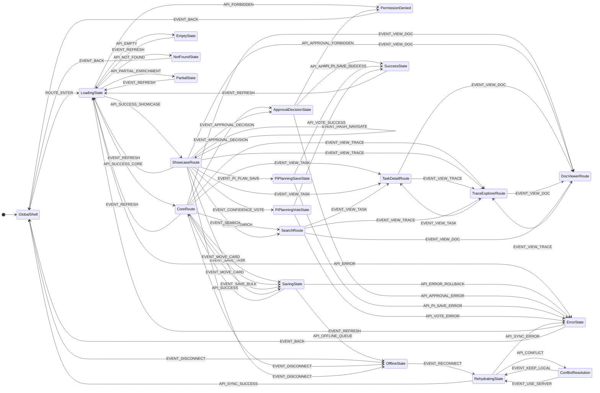

<!-- beads-id: br-design-flow-webui-pm-workspace -->
# Flow: WebUI PM Workspace

```mermaid
stateDiagram-v2
    direction LR
    [*] --> GlobalShell
    GlobalShell --> LoadingState : ROUTE_ENTER
    LoadingState --> CoreRoute : API_SUCCESS_CORE
    LoadingState --> ShowcaseRoute : API_SUCCESS_SHOWCASE
    LoadingState --> EmptyState : API_EMPTY
    LoadingState --> PermissionDenied : API_FORBIDDEN
    LoadingState --> ErrorState : API_ERROR
    LoadingState --> NotFoundState : API_NOT_FOUND
    LoadingState --> PartialState : API_PARTIAL_ENRICHMENT

    CoreRoute --> TaskDetailRoute : EVENT_VIEW_TASK
    CoreRoute --> TraceExplorerRoute : EVENT_VIEW_TRACE
    CoreRoute --> DocViewerRoute : EVENT_VIEW_DOC
    CoreRoute --> SearchRoute : EVENT_SEARCH
    CoreRoute --> LoadingState : EVENT_REFRESH
    CoreRoute --> SavingState : EVENT_SAVE_TASK
    CoreRoute --> SavingState : EVENT_SAVE_BULK
    CoreRoute --> SavingState : EVENT_MOVE_CARD
    CoreRoute --> ApprovalDecisionState : EVENT_APPROVAL_DECISION

    ShowcaseRoute --> ShowcaseRoute : EVENT_HASH_NAVIGATE
    ShowcaseRoute --> TaskDetailRoute : EVENT_VIEW_TASK
    ShowcaseRoute --> TraceExplorerRoute : EVENT_VIEW_TRACE
    ShowcaseRoute --> DocViewerRoute : EVENT_VIEW_DOC
    ShowcaseRoute --> SearchRoute : EVENT_SEARCH
    ShowcaseRoute --> LoadingState : EVENT_REFRESH
    ShowcaseRoute --> SavingState : EVENT_MOVE_CARD
    ShowcaseRoute --> PiPlanningSaveState : EVENT_PI_PLAN_SAVE
    ShowcaseRoute --> PiPlanningVoteState : EVENT_CONFIDENCE_VOTE
    ShowcaseRoute --> ApprovalDecisionState : EVENT_APPROVAL_DECISION

    TaskDetailRoute --> TraceExplorerRoute : EVENT_VIEW_TRACE
    TaskDetailRoute --> DocViewerRoute : EVENT_VIEW_DOC
    TraceExplorerRoute --> TaskDetailRoute : EVENT_VIEW_TASK
    TraceExplorerRoute --> DocViewerRoute : EVENT_VIEW_DOC
    DocViewerRoute --> TraceExplorerRoute : EVENT_VIEW_TRACE
    SearchRoute --> TaskDetailRoute : EVENT_VIEW_TASK
    SearchRoute --> DocViewerRoute : EVENT_VIEW_DOC
    SearchRoute --> TraceExplorerRoute : EVENT_VIEW_TRACE

    SavingState --> CoreRoute : API_SUCCESS
    SavingState --> ErrorState : API_ERROR_ROLLBACK
    SavingState --> OfflineState : API_OFFLINE_QUEUE
    ApprovalDecisionState --> SuccessState : API_APPROVAL_SUCCESS
    ApprovalDecisionState --> ErrorState : API_APPROVAL_ERROR
    ApprovalDecisionState --> PermissionDenied : API_APPROVAL_FORBIDDEN
    PiPlanningSaveState --> SuccessState : API_PI_SAVE_SUCCESS
    PiPlanningSaveState --> ErrorState : API_PI_SAVE_ERROR
    PiPlanningVoteState --> SuccessState : API_VOTE_SUCCESS
    PiPlanningVoteState --> ErrorState : API_VOTE_ERROR

    GlobalShell --> OfflineState : EVENT_DISCONNECT
    CoreRoute --> OfflineState : EVENT_DISCONNECT
    ShowcaseRoute --> OfflineState : EVENT_DISCONNECT
    OfflineState --> RehydratingState : EVENT_RECONNECT
    RehydratingState --> ConflictResolution : API_CONFLICT
    ConflictResolution --> RehydratingState : EVENT_KEEP_LOCAL
    ConflictResolution --> RehydratingState : EVENT_USE_SERVER
    RehydratingState --> GlobalShell : API_SYNC_SUCCESS
    RehydratingState --> ErrorState : API_SYNC_ERROR

    EmptyState --> LoadingState : EVENT_REFRESH
    ErrorState --> LoadingState : EVENT_REFRESH
    PartialState --> LoadingState : EVENT_REFRESH
    SuccessState --> LoadingState : EVENT_REFRESH
    PermissionDenied --> GlobalShell : EVENT_BACK
    NotFoundState --> GlobalShell : EVENT_BACK
    ErrorState --> GlobalShell : EVENT_BACK
```
