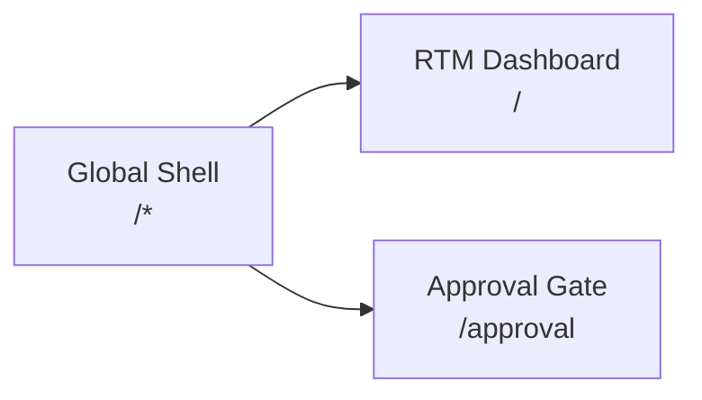
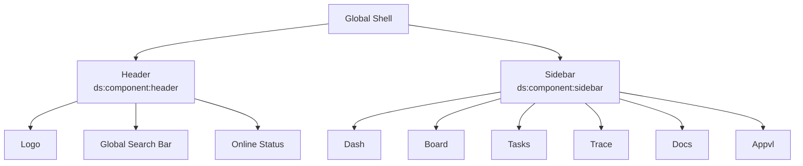
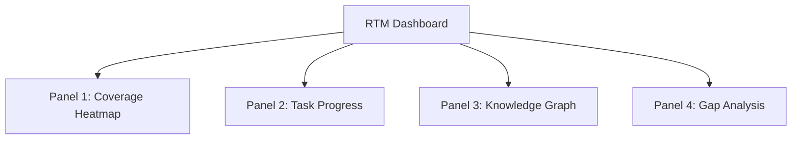
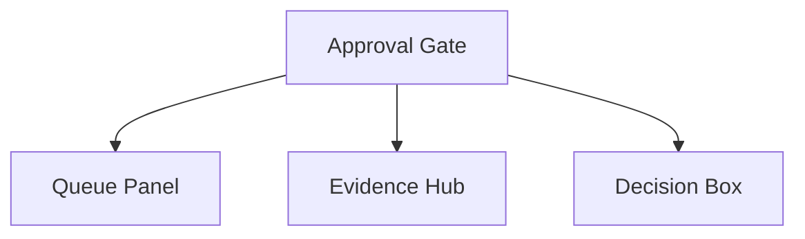
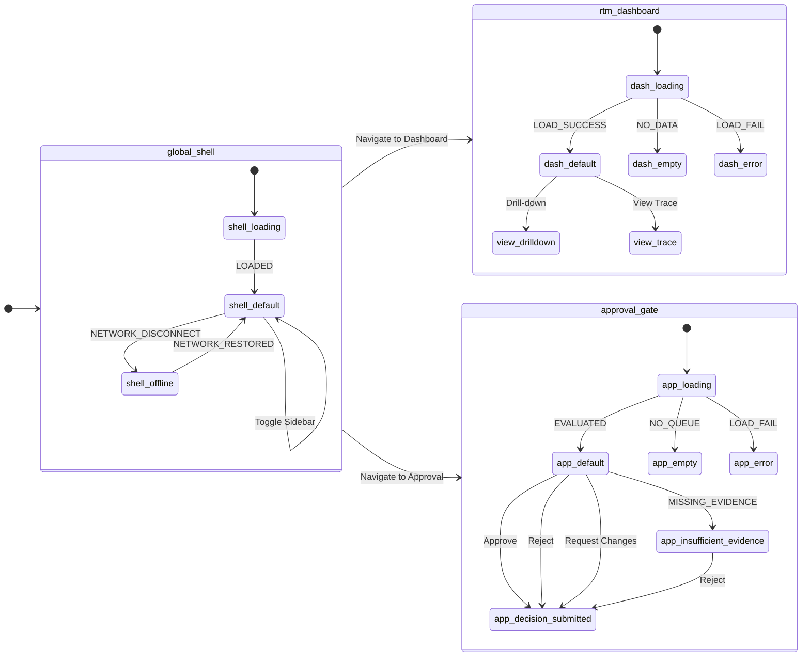
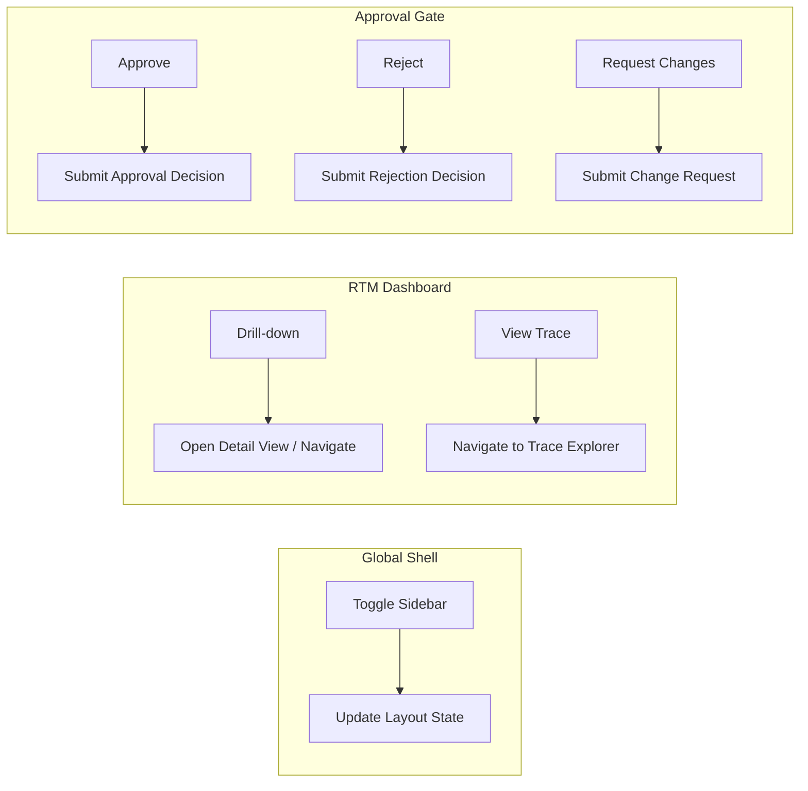
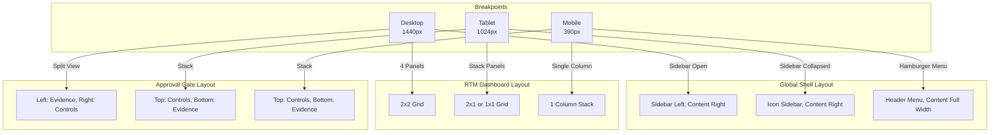

# Stage 1 Review Diagrams: Web UI & PM Workspace

This document contains Mermaid diagrams visualizing the UI contract for the `webui-and-pm-workspace` feature.

## 1. Screen Inventory & Routes

## 2. Component Hierarchy

### Global Shell

### RTM Dashboard

### Approval Gate

## 3. State Coverage & Transitions

## 4. Action-to-Event Links

## 5. Responsive Layout Intent

