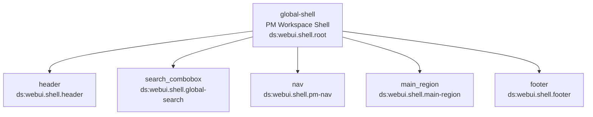

# Stage 1 Review Diagrams: Web UI & PM Workspace
<!-- beads-id: br-ds-webui-pm-review-diagrams -->

Mermaid review bundle derived from `ui-contract.md` YAML View Blueprint and embedded Logic Machine. Low-fi layout is represented as route, hierarchy, state, action-event, and responsive intent diagrams only.

## 1. Screen Inventory and Routes

```mermaid
flowchart TB
    Header["Website header: PM Space<br>/webui-pm-workspace<br>ds:webui.header.top-level"]
    Shell["global-shell<br>/webui-pm-workspace<br>ds:webui.shell.root"]
    Header --> Shell
    subgraph Core_Routes["Core WebUI routes"]
        core_rtm_dashboard["rtm-dashboard<br>/<br>ds:webui.rtm.root"]
        core_safe_board["safe-board<br>/board<br>ds:webui.board.root"]
        core_task_list["task-list<br>/tasks<br>ds:webui.tasks.root"]
        core_task_detail["task-detail<br>/tasks/:id<br>ds:webui.task-detail.root"]
        core_trace_explorer["trace-explorer<br>/trace/:id<br>ds:webui.trace.root"]
        core_document_viewer["document-viewer<br>/docs<br>ds:webui.docs.root"]
        core_document_viewer_detail["document-viewer<br>/docs/:id<br>ds:webui.docs.root"]
        core_approval_gates["approval-gates<br>/approval<br>ds:webui.approval.root"]
        core_search_results["search-results<br>/search<br>ds:webui.search.root"]
    end
    subgraph Evidence_Planning_Shared["Evidence, planning, storyboard, and shared routes"]
        eps_terminal_console["terminal-console<br>/terminal<br>ds:webui.terminal.root"]
        eps_timeline_file_leases["timeline-file-leases<br>/timeline<br>ds:webui.timeline.root"]
        eps_git_graph_explorer["git-graph-explorer<br>/git-graph<br>ds:webui.git-graph.root"]
        eps_knowledge_graph["knowledge-graph<br>/knowledge-graph<br>ds:webui.knowledge-graph.root"]
        eps_portfolio_view["portfolio-view<br>/portfolio<br>ds:webui.portfolio.root"]
        eps_pi_planning["pi-planning<br>/pi-planning<br>ds:webui.pi-planning.root"]
        eps_storyboards_overview["storyboards-overview<br>/storyboards<br>ds:webui.storyboards.root"]
        eps_storyboard_detail["storyboard-detail<br>/storyboards/:id<br>ds:webui.storyboard-detail.root"]
        eps_components_catalog["components-catalog<br>/components<br>ds:webui.components.root"]
    end
    Shell --> core_rtm_dashboard
    Shell --> core_safe_board
    Shell --> core_task_list
    Shell --> core_task_detail
    Shell --> core_trace_explorer
    Shell --> core_document_viewer
    Shell --> core_document_viewer_detail
    Shell --> core_approval_gates
    Shell --> core_search_results
    Shell --> eps_terminal_console
    Shell --> eps_timeline_file_leases
    Shell --> eps_git_graph_explorer
    Shell --> eps_knowledge_graph
    Shell --> eps_portfolio_view
    Shell --> eps_pi_planning
    Shell --> eps_storyboards_overview
    Shell --> eps_storyboard_detail
    Shell --> eps_components_catalog
```

## 2. Per-Screen Component Hierarchy

### 2.1 Global Shell

### 2.2 Core Route Screens

```mermaid
flowchart TD
    root_rtm_dashboard["rtm-dashboard<br>/<br>ds:webui.rtm.root"]
    root_rtm_dashboard --> rtm_dashboard_ds_webui_rtm_kpi_row["kpi_row<br>ds:webui.rtm.kpi-row"]
    root_rtm_dashboard --> rtm_dashboard_ds_webui_rtm_coverage_heatmap["heatmap_panel<br>ds:webui.rtm.coverage-heatmap"]
    root_rtm_dashboard --> rtm_dashboard_ds_webui_rtm_task_progress["progress_panel<br>ds:webui.rtm.task-progress"]
    root_rtm_dashboard --> rtm_dashboard_ds_webui_rtm_knowledge_graph_widget["graph_widget<br>ds:webui.rtm.knowledge-graph-widget"]
    root_rtm_dashboard --> rtm_dashboard_ds_webui_rtm_gap_analysis["gap_panel<br>ds:webui.rtm.gap-analysis"]
    root_safe_board["safe-board<br>/board<br>ds:webui.board.root"]
    root_safe_board --> safe_board_ds_webui_board_selector["segmented_control<br>ds:webui.board.selector"]
    root_safe_board --> safe_board_ds_webui_board_stats_strip["stats_strip<br>ds:webui.board.stats-strip"]
    root_safe_board --> safe_board_ds_webui_board_columns["kanban_columns<br>ds:webui.board.columns"]
    root_task_list["task-list<br>/tasks<br>ds:webui.tasks.root"]
    root_task_list --> task_list_ds_webui_tasks_view_toggle["view_toggle<br>ds:webui.tasks.view-toggle"]
    root_task_list --> task_list_ds_webui_tasks_filter_bar["filter_bar<br>ds:webui.tasks.filter-bar"]
    root_task_list --> task_list_ds_webui_tasks_table["table<br>ds:webui.tasks.table"]
    root_task_list --> task_list_ds_webui_tasks_bulk_actions["bulk_action_bar<br>ds:webui.tasks.bulk-actions"]
    root_task_detail["task-detail<br>/tasks/:id<br>ds:webui.task-detail.root"]
    root_task_detail --> task_detail_ds_webui_task_detail_summary_header["summary_header<br>ds:webui.task-detail.summary-header"]
    root_task_detail --> task_detail_ds_webui_task_detail_tabs["tab_list<br>ds:webui.task-detail.tabs"]
    root_task_detail --> task_detail_ds_webui_task_detail_activity["activity_timeline<br>ds:webui.task-detail.activity"]
    root_task_detail --> task_detail_ds_webui_task_detail_graph_widget["graph_widget<br>ds:webui.task-detail.graph-widget"]
    root_task_detail --> task_detail_ds_webui_task_detail_approval_embed["approval_embed<br>ds:webui.task-detail.approval-embed"]
    root_trace_explorer["trace-explorer<br>/trace/:id<br>ds:webui.trace.root"]
    root_trace_explorer --> trace_explorer_ds_webui_trace_toolbar["trace_toolbar<br>ds:webui.trace.toolbar"]
    root_trace_explorer --> trace_explorer_ds_webui_trace_canvas["graph_canvas<br>ds:webui.trace.canvas"]
    root_trace_explorer --> trace_explorer_ds_webui_trace_detail_panel["node_detail_panel<br>ds:webui.trace.detail-panel"]
    root_trace_explorer --> trace_explorer_ds_webui_trace_legend_stats["legend_stats<br>ds:webui.trace.legend-stats"]
    root_document_viewer["document-viewer<br>/docs<br>ds:webui.docs.root"]
    root_document_viewer --> document_viewer_ds_webui_docs_tree["doc_tree<br>ds:webui.docs.tree"]
    root_document_viewer --> document_viewer_ds_webui_docs_content["rendered_document<br>ds:webui.docs.content"]
    root_document_viewer --> document_viewer_ds_webui_docs_section_badges["section_badges<br>ds:webui.docs.section-badges"]
    root_approval_gates["approval-gates<br>/approval<br>ds:webui.approval.root"]
    root_approval_gates --> approval_gates_ds_webui_approval_queue["queue_panel<br>ds:webui.approval.queue"]
    root_approval_gates --> approval_gates_ds_webui_approval_evidence_hub["evidence_hub<br>ds:webui.approval.evidence-hub"]
    root_approval_gates --> approval_gates_ds_webui_approval_rtm_matrix["rtm_matrix<br>ds:webui.approval.rtm-matrix"]
    root_approval_gates --> approval_gates_ds_webui_approval_coverage_heatmap["heatmap_panel<br>ds:webui.approval.coverage-heatmap"]
    root_approval_gates --> approval_gates_ds_webui_approval_decision_box["decision_box<br>ds:webui.approval.decision-box"]
    root_search_results["search-results<br>/search<br>ds:webui.search.root"]
    root_search_results --> search_results_ds_webui_search_query_input["query_input<br>ds:webui.search.query-input"]
    root_search_results --> search_results_ds_webui_search_type_filters["type_filters<br>ds:webui.search.type-filters"]
    root_search_results --> search_results_ds_webui_search_results_list["grouped_results<br>ds:webui.search.results-list"]
    root_search_results --> search_results_ds_webui_search_detail_sidebar["result_detail<br>ds:webui.search.detail-sidebar"]
```

### 2.3 Evidence, Planning, Storyboard, and Shared Screens

```mermaid
flowchart TD
    root_terminal_console["terminal-console<br>/terminal<br>ds:webui.terminal.root"]
    root_terminal_console --> terminal_console_ds_webui_terminal_tabs["scenario_tabs<br>ds:webui.terminal.tabs"]
    root_terminal_console --> terminal_console_ds_webui_terminal_mosaic["terminal_pane_grid<br>ds:webui.terminal.mosaic"]
    root_timeline_file_leases["timeline-file-leases<br>/timeline<br>ds:webui.timeline.root"]
    root_timeline_file_leases --> timeline_file_leases_ds_webui_timeline_file_leases["file_lease_list<br>ds:webui.timeline.file-leases"]
    root_timeline_file_leases --> timeline_file_leases_ds_webui_timeline_activity_feed["activity_feed<br>ds:webui.timeline.activity-feed"]
    root_timeline_file_leases --> timeline_file_leases_ds_webui_timeline_sprint_day["sprint_day_timeline<br>ds:webui.timeline.sprint-day"]
    root_git_graph_explorer["git-graph-explorer<br>/git-graph<br>ds:webui.git-graph.root"]
    root_git_graph_explorer --> git_graph_explorer_ds_webui_git_graph_scenario_list["scenario_list<br>ds:webui.git-graph.scenario-list"]
    root_git_graph_explorer --> git_graph_explorer_ds_webui_git_graph_canvas["git_graph_canvas<br>ds:webui.git-graph.canvas"]
    root_git_graph_explorer --> git_graph_explorer_ds_webui_git_graph_commit_detail["commit_detail<br>ds:webui.git-graph.commit-detail"]
    root_knowledge_graph["knowledge-graph<br>/knowledge-graph<br>ds:webui.knowledge-graph.root"]
    root_knowledge_graph --> knowledge_graph_ds_webui_knowledge_graph_preset_list["preset_list<br>ds:webui.knowledge-graph.preset-list"]
    root_knowledge_graph --> knowledge_graph_ds_webui_knowledge_graph_canvas["sigma_graph_canvas<br>ds:webui.knowledge-graph.canvas"]
    root_knowledge_graph --> knowledge_graph_ds_webui_knowledge_graph_node_banner["selected_node_banner<br>ds:webui.knowledge-graph.node-banner"]
    root_portfolio_view["portfolio-view<br>/portfolio<br>ds:webui.portfolio.root"]
    root_portfolio_view --> portfolio_view_ds_webui_portfolio_table["portfolio_table<br>ds:webui.portfolio.table"]
    root_portfolio_view --> portfolio_view_ds_webui_portfolio_roadmap["roadmap<br>ds:webui.portfolio.roadmap"]
    root_pi_planning["pi-planning<br>/pi-planning<br>ds:webui.pi-planning.root"]
    root_pi_planning --> pi_planning_ds_webui_pi_planning_strategic_sandbox["dnd_strategic_sandbox<br>ds:webui.pi-planning.strategic-sandbox"]
    root_pi_planning --> pi_planning_ds_webui_pi_planning_capacity_plan["capacity_plan<br>ds:webui.pi-planning.capacity-plan"]
    root_pi_planning --> pi_planning_ds_webui_pi_planning_value_scoring["business_value_scoring<br>ds:webui.pi-planning.value-scoring"]
    root_pi_planning --> pi_planning_ds_webui_pi_planning_confidence_vote["confidence_vote<br>ds:webui.pi-planning.confidence-vote"]
    root_pi_planning --> pi_planning_ds_webui_pi_planning_roam_board["roam_board<br>ds:webui.pi-planning.roam-board"]
    root_storyboards_overview["storyboards-overview<br>/storyboards<br>ds:webui.storyboards.root"]
    root_storyboards_overview --> storyboards_overview_ds_webui_storyboards_filter["journey_filter<br>ds:webui.storyboards.filter"]
    root_storyboards_overview --> storyboards_overview_ds_webui_storyboards_flow["usecase_flow<br>ds:webui.storyboards.flow"]
    root_storyboards_overview --> storyboards_overview_ds_webui_storyboards_guidance_panel["guidance_panel<br>ds:webui.storyboards.guidance-panel"]
    root_storyboard_detail["storyboard-detail<br>/storyboards/:id<br>ds:webui.storyboard-detail.root"]
    root_storyboard_detail --> storyboard_detail_ds_webui_storyboard_detail_summary["journey_summary<br>ds:webui.storyboard-detail.summary"]
    root_storyboard_detail --> storyboard_detail_ds_webui_storyboard_detail_timeline["step_timeline<br>ds:webui.storyboard-detail.timeline"]
    root_storyboard_detail --> storyboard_detail_ds_webui_storyboard_detail_related_usecases["related_usecases<br>ds:webui.storyboard-detail.related-usecases"]
    root_components_catalog["components-catalog<br>/components<br>ds:webui.components.root"]
    root_components_catalog --> components_catalog_ds_webui_components_section_nav["section_nav<br>ds:webui.components.section-nav"]
    root_components_catalog --> components_catalog_ds_webui_components_examples["examples_region<br>ds:webui.components.examples"]
    root_components_catalog --> components_catalog_ds_webui_components_tokens["token_reference<br>ds:webui.components.tokens"]
```

## 3. State Coverage Per Screen

### 3.1 Core route state coverage

```mermaid
flowchart LR
    state_global_shell["global-shell"]
    state_global_shell --> global_shell_default["default"]
    state_global_shell --> global_shell_loading["loading"]
    state_global_shell --> global_shell_offline["offline"]
    state_global_shell --> global_shell_forbidden["forbidden"]
    state_rtm_dashboard["rtm-dashboard"]
    state_rtm_dashboard --> rtm_dashboard_default["default"]
    state_rtm_dashboard --> rtm_dashboard_loading["loading"]
    state_rtm_dashboard --> rtm_dashboard_empty["empty"]
    state_rtm_dashboard --> rtm_dashboard_error["error"]
    state_rtm_dashboard --> rtm_dashboard_offline["offline"]
    state_safe_board["safe-board"]
    state_safe_board --> safe_board_default["default"]
    state_safe_board --> safe_board_loading["loading"]
    state_safe_board --> safe_board_empty["empty"]
    state_safe_board --> safe_board_error["error"]
    state_safe_board --> safe_board_offline["offline"]
    state_safe_board --> safe_board_forbidden["forbidden"]
    state_task_list["task-list"]
    state_task_list --> task_list_default["default"]
    state_task_list --> task_list_loading["loading"]
    state_task_list --> task_list_empty["empty"]
    state_task_list --> task_list_error["error"]
    state_task_list --> task_list_offline["offline"]
    state_task_list --> task_list_saving["saving"]
    state_task_detail["task-detail"]
    state_task_detail --> task_detail_default["default"]
    state_task_detail --> task_detail_loading["loading"]
    state_task_detail --> task_detail_error["error"]
    state_task_detail --> task_detail_offline["offline"]
    state_task_detail --> task_detail_saving["saving"]
    state_task_detail --> task_detail_not_found["not_found"]
    state_trace_explorer["trace-explorer"]
    state_trace_explorer --> trace_explorer_default["default"]
    state_trace_explorer --> trace_explorer_loading["loading"]
    state_trace_explorer --> trace_explorer_empty["empty"]
    state_trace_explorer --> trace_explorer_error["error"]
    state_trace_explorer --> trace_explorer_offline["offline"]
    state_trace_explorer --> trace_explorer_partial["partial"]
    state_trace_explorer --> trace_explorer_forbidden["forbidden"]
    state_document_viewer["document-viewer"]
    state_document_viewer --> document_viewer_default["default"]
    state_document_viewer --> document_viewer_loading["loading"]
    state_document_viewer --> document_viewer_empty["empty"]
    state_document_viewer --> document_viewer_error["error"]
    state_document_viewer --> document_viewer_offline["offline"]
    state_document_viewer --> document_viewer_forbidden["forbidden"]
    state_approval_gates["approval-gates"]
    state_approval_gates --> approval_gates_default["default"]
    state_approval_gates --> approval_gates_loading["loading"]
    state_approval_gates --> approval_gates_empty["empty"]
    state_approval_gates --> approval_gates_error["error"]
    state_approval_gates --> approval_gates_offline["offline"]
    state_approval_gates --> approval_gates_forbidden["forbidden"]
    state_approval_gates --> approval_gates_insufficient_evidence["insufficient_evidence"]
    state_approval_gates --> approval_gates_decision_submitted["decision_submitted"]
    state_search_results["search-results"]
    state_search_results --> search_results_default["default"]
    state_search_results --> search_results_loading["loading"]
    state_search_results --> search_results_empty["empty"]
    state_search_results --> search_results_error["error"]
    state_search_results --> search_results_offline["offline"]
    state_search_results --> search_results_forbidden["forbidden"]
```

### 3.2 Evidence, planning, storyboard, and shared state coverage

```mermaid
flowchart LR
    state_terminal_console["terminal-console"]
    state_terminal_console --> terminal_console_default["default"]
    state_terminal_console --> terminal_console_loading["loading"]
    state_terminal_console --> terminal_console_empty["empty"]
    state_terminal_console --> terminal_console_error["error"]
    state_terminal_console --> terminal_console_offline["offline"]
    state_terminal_console --> terminal_console_forbidden["forbidden"]
    state_timeline_file_leases["timeline-file-leases"]
    state_timeline_file_leases --> timeline_file_leases_default["default"]
    state_timeline_file_leases --> timeline_file_leases_loading["loading"]
    state_timeline_file_leases --> timeline_file_leases_empty["empty"]
    state_timeline_file_leases --> timeline_file_leases_error["error"]
    state_timeline_file_leases --> timeline_file_leases_offline["offline"]
    state_timeline_file_leases --> timeline_file_leases_forbidden["forbidden"]
    state_git_graph_explorer["git-graph-explorer"]
    state_git_graph_explorer --> git_graph_explorer_default["default"]
    state_git_graph_explorer --> git_graph_explorer_loading["loading"]
    state_git_graph_explorer --> git_graph_explorer_empty["empty"]
    state_git_graph_explorer --> git_graph_explorer_error["error"]
    state_git_graph_explorer --> git_graph_explorer_offline["offline"]
    state_git_graph_explorer --> git_graph_explorer_forbidden["forbidden"]
    state_knowledge_graph["knowledge-graph"]
    state_knowledge_graph --> knowledge_graph_default["default"]
    state_knowledge_graph --> knowledge_graph_loading["loading"]
    state_knowledge_graph --> knowledge_graph_empty["empty"]
    state_knowledge_graph --> knowledge_graph_error["error"]
    state_knowledge_graph --> knowledge_graph_offline["offline"]
    state_knowledge_graph --> knowledge_graph_forbidden["forbidden"]
    state_portfolio_view["portfolio-view"]
    state_portfolio_view --> portfolio_view_default["default"]
    state_portfolio_view --> portfolio_view_loading["loading"]
    state_portfolio_view --> portfolio_view_empty["empty"]
    state_portfolio_view --> portfolio_view_error["error"]
    state_portfolio_view --> portfolio_view_offline["offline"]
    state_portfolio_view --> portfolio_view_forbidden["forbidden"]
    state_pi_planning["pi-planning"]
    state_pi_planning --> pi_planning_default["default"]
    state_pi_planning --> pi_planning_loading["loading"]
    state_pi_planning --> pi_planning_empty["empty"]
    state_pi_planning --> pi_planning_error["error"]
    state_pi_planning --> pi_planning_offline["offline"]
    state_pi_planning --> pi_planning_forbidden["forbidden"]
    state_pi_planning --> pi_planning_saving["saving"]
    state_storyboards_overview["storyboards-overview"]
    state_storyboards_overview --> storyboards_overview_default["default"]
    state_storyboards_overview --> storyboards_overview_loading["loading"]
    state_storyboards_overview --> storyboards_overview_empty["empty"]
    state_storyboards_overview --> storyboards_overview_error["error"]
    state_storyboards_overview --> storyboards_overview_offline["offline"]
    state_storyboard_detail["storyboard-detail"]
    state_storyboard_detail --> storyboard_detail_default["default"]
    state_storyboard_detail --> storyboard_detail_loading["loading"]
    state_storyboard_detail --> storyboard_detail_empty["empty"]
    state_storyboard_detail --> storyboard_detail_error["error"]
    state_storyboard_detail --> storyboard_detail_offline["offline"]
    state_storyboard_detail --> storyboard_detail_not_found["not_found"]
    state_components_catalog["components-catalog"]
    state_components_catalog --> components_catalog_default["default"]
    state_components_catalog --> components_catalog_loading["loading"]
    state_components_catalog --> components_catalog_empty["empty"]
    state_components_catalog --> components_catalog_error["error"]
```

## 4. Action-to-Event Links

### 4.1 Shell and core route actions

```mermaid
flowchart LR
    actsrc_global_shell["global-shell"]
    actsrc_global_shell --> action_action_shell_open_search["action-shell-open-search<br>Focus global search"]
    action_action_shell_open_search --> event_action_shell_open_search["EVENT_SHELL_OPEN_SEARCH"]
    event_action_shell_open_search --> target_action_shell_open_search["search-results<br>/search"]
    actsrc_global_shell --> action_action_shell_toggle_nav["action-shell-toggle-nav<br>Toggle PM navigation"]
    action_action_shell_toggle_nav --> event_action_shell_toggle_nav["EVENT_SHELL_TOGGLE_NAV"]
    event_action_shell_toggle_nav --> target_action_shell_toggle_nav["same screen or UI state<br>same screen or UI state"]
    actsrc_global_shell --> action_action_shell_retry_sync["action-shell-retry-sync<br>Retry sync"]
    action_action_shell_retry_sync --> event_action_shell_retry_sync["EVENT_SHELL_RETRY_SYNC"]
    event_action_shell_retry_sync --> target_action_shell_retry_sync["same screen or UI state<br>same screen or UI state"]
    actsrc_rtm_dashboard["rtm-dashboard"]
    actsrc_rtm_dashboard --> action_action_rtm_open_trace["action-rtm-open-trace<br>Open section trace"]
    action_action_rtm_open_trace --> event_action_rtm_open_trace["EVENT_RTM_OPEN_TRACE"]
    event_action_rtm_open_trace --> target_action_rtm_open_trace["trace-explorer<br>/trace/:id"]
    actsrc_rtm_dashboard --> action_action_rtm_filter_tasks["action-rtm-filter-tasks<br>Filter tasks by status"]
    action_action_rtm_filter_tasks --> event_action_rtm_filter_tasks["EVENT_RTM_FILTER_TASKS"]
    event_action_rtm_filter_tasks --> target_action_rtm_filter_tasks["/tasks?status=<status><br>/tasks?status=<status>"]
    actsrc_rtm_dashboard --> action_action_rtm_open_doc["action-rtm-open-doc<br>Open linked document"]
    action_action_rtm_open_doc --> event_action_rtm_open_doc["EVENT_RTM_OPEN_DOC"]
    event_action_rtm_open_doc --> target_action_rtm_open_doc["document-viewer<br>/docs/:id"]
    actsrc_rtm_dashboard --> action_action_rtm_create_gap_plan["action-rtm-create-gap-plan<br>Create plan for gap"]
    action_action_rtm_create_gap_plan --> event_action_rtm_create_gap_plan["EVENT_RTM_CREATE_GAP_PLAN"]
    event_action_rtm_create_gap_plan --> target_action_rtm_create_gap_plan["same screen or UI state<br>same screen or UI state"]
    actsrc_safe_board["safe-board"]
    actsrc_safe_board --> action_action_board_select_board["action-board-select-board<br>Select board hash route"]
    action_action_board_select_board --> event_action_board_select_board["EVENT_BOARD_SELECT_BOARD"]
    event_action_board_select_board --> target_action_board_select_board["same screen or UI state<br>same screen or UI state"]
    actsrc_safe_board --> action_action_board_drag_card["action-board-drag-card<br>Move task card across status columns"]
    action_action_board_drag_card --> event_action_board_drag_card["EVENT_BOARD_DRAG_CARD"]
    event_action_board_drag_card --> target_action_board_drag_card["same screen or UI state<br>same screen or UI state"]
    actsrc_safe_board --> action_action_board_open_task["action-board-open-task<br>Open task detail"]
    action_action_board_open_task --> event_action_board_open_task["EVENT_BOARD_OPEN_TASK"]
    event_action_board_open_task --> target_action_board_open_task["task-detail<br>/tasks/:id"]
    actsrc_task_list["task-list"]
    actsrc_task_list --> action_action_tasks_toggle_board["action-tasks-toggle-board<br>Switch to board view"]
    action_action_tasks_toggle_board --> event_action_tasks_toggle_board["EVENT_TASKS_TOGGLE_BOARD"]
    event_action_tasks_toggle_board --> target_action_tasks_toggle_board["safe-board<br>/board"]
    actsrc_task_list --> action_action_tasks_filter["action-tasks-filter<br>Apply status assignee priority PRD QA filters"]
    action_action_tasks_filter --> event_action_tasks_filter["EVENT_TASKS_FILTER"]
    event_action_tasks_filter --> target_action_tasks_filter["same screen or UI state<br>same screen or UI state"]
    actsrc_task_list --> action_action_tasks_sort["action-tasks-sort<br>Sort table column"]
    action_action_tasks_sort --> event_action_tasks_sort["EVENT_TASKS_SORT"]
    event_action_tasks_sort --> target_action_tasks_sort["same screen or UI state<br>same screen or UI state"]
    actsrc_task_list --> action_action_tasks_open_detail["action-tasks-open-detail<br>Open row detail"]
    action_action_tasks_open_detail --> event_action_tasks_open_detail["EVENT_TASKS_OPEN_DETAIL"]
    event_action_tasks_open_detail --> target_action_tasks_open_detail["task-detail<br>/tasks/:id"]
    actsrc_task_list --> action_action_tasks_open_trace["action-tasks-open-trace<br>Open beads trace"]
    action_action_tasks_open_trace --> event_action_tasks_open_trace["EVENT_TASKS_OPEN_TRACE"]
    event_action_tasks_open_trace --> target_action_tasks_open_trace["trace-explorer<br>/trace/:id"]
    actsrc_task_list --> action_action_tasks_bulk_assign["action-tasks-bulk-assign<br>Bulk assign selected tasks"]
    action_action_tasks_bulk_assign --> event_action_tasks_bulk_assign["EVENT_TASKS_BULK_ASSIGN"]
    event_action_tasks_bulk_assign --> target_action_tasks_bulk_assign["same screen or UI state<br>same screen or UI state"]
    actsrc_task_list --> action_action_tasks_bulk_status["action-tasks-bulk-status<br>Bulk change selected task status"]
    action_action_tasks_bulk_status --> event_action_tasks_bulk_status["EVENT_TASKS_BULK_STATUS"]
    event_action_tasks_bulk_status --> target_action_tasks_bulk_status["same screen or UI state<br>same screen or UI state"]
    actsrc_task_list --> action_action_tasks_export_csv["action-tasks-export-csv<br>Export current filtered CSV"]
    action_action_tasks_export_csv --> event_action_tasks_export_csv["EVENT_TASKS_EXPORT_CSV"]
    event_action_tasks_export_csv --> target_action_tasks_export_csv["same screen or UI state<br>same screen or UI state"]
    actsrc_task_detail["task-detail"]
    actsrc_task_detail --> action_action_task_back_to_list["action-task-back-to-list<br>Back to task list"]
    action_action_task_back_to_list --> event_action_task_back_to_list["EVENT_BACK_TO_TASK_LIST"]
    event_action_task_back_to_list --> target_action_task_back_to_list["task-list<br>/tasks"]
    actsrc_task_detail --> action_action_task_save_status["action-task-save-status<br>Save status field"]
    action_action_task_save_status --> event_action_task_save_status["EVENT_TASK_SAVE_STATUS"]
    event_action_task_save_status --> target_action_task_save_status["same screen or UI state<br>same screen or UI state"]
    actsrc_task_detail --> action_action_task_save_assignee["action-task-save-assignee<br>Save assignee field"]
    action_action_task_save_assignee --> event_action_task_save_assignee["EVENT_TASK_SAVE_ASSIGNEE"]
    event_action_task_save_assignee --> target_action_task_save_assignee["same screen or UI state<br>same screen or UI state"]
    actsrc_task_detail --> action_action_task_open_approval["action-task-open-approval<br>Open approval tab"]
    action_action_task_open_approval --> event_action_task_open_approval["EVENT_TASK_OPEN_APPROVAL"]
    event_action_task_open_approval --> target_action_task_open_approval["approval-gates<br>/tasks/:id#approval"]
    actsrc_task_detail --> action_action_task_open_trace["action-task-open-trace<br>Open full trace"]
    action_action_task_open_trace --> event_action_task_open_trace["EVENT_TASK_OPEN_TRACE"]
    event_action_task_open_trace --> target_action_task_open_trace["trace-explorer<br>/trace/:id"]
    actsrc_trace_explorer["trace-explorer"]
    actsrc_trace_explorer --> action_action_trace_change_root["action-trace-change-root<br>Change root Beads ID"]
    action_action_trace_change_root --> event_action_trace_change_root["EVENT_TRACE_CHANGE_ROOT"]
    event_action_trace_change_root --> target_action_trace_change_root["same screen or UI state<br>same screen or UI state"]
    actsrc_trace_explorer --> action_action_trace_toggle_direction["action-trace-toggle-direction<br>Toggle forward reverse direction"]
    action_action_trace_toggle_direction --> event_action_trace_toggle_direction["EVENT_TRACE_TOGGLE_DIRECTION"]
    event_action_trace_toggle_direction --> target_action_trace_toggle_direction["same screen or UI state<br>same screen or UI state"]
    actsrc_trace_explorer --> action_action_trace_select_node["action-trace-select-node<br>Select graph node"]
    action_action_trace_select_node --> event_action_trace_select_node["EVENT_TRACE_SELECT_NODE"]
    event_action_trace_select_node --> target_action_trace_select_node["same screen or UI state<br>same screen or UI state"]
    actsrc_trace_explorer --> action_action_trace_open_doc["action-trace-open-doc<br>Open document"]
    action_action_trace_open_doc --> event_action_trace_open_doc["EVENT_TRACE_OPEN_DOC"]
    event_action_trace_open_doc --> target_action_trace_open_doc["document-viewer<br>/docs/:id"]
    actsrc_trace_explorer --> action_action_trace_open_task["action-trace-open-task<br>Open task"]
    action_action_trace_open_task --> event_action_trace_open_task["EVENT_TRACE_OPEN_TASK"]
    event_action_trace_open_task --> target_action_trace_open_task["task-detail<br>/tasks/:id"]
    actsrc_trace_explorer --> action_action_trace_open_git_graph["action-trace-open-git-graph<br>Open Git graph scenario"]
    action_action_trace_open_git_graph --> event_action_trace_open_git_graph["EVENT_TRACE_OPEN_GIT_GRAPH"]
    event_action_trace_open_git_graph --> target_action_trace_open_git_graph["git-graph-explorer<br>/git-graph"]
    actsrc_document_viewer["document-viewer"]
    actsrc_document_viewer --> action_action_docs_select_document["action-docs-select-document<br>Select document from tree"]
    action_action_docs_select_document --> event_action_docs_select_document["EVENT_DOCS_SELECT_DOCUMENT"]
    event_action_docs_select_document --> target_action_docs_select_document["same screen or UI state<br>same screen or UI state"]
    actsrc_document_viewer --> action_action_docs_open_trace["action-docs-open-trace<br>Open Beads trace"]
    action_action_docs_open_trace --> event_action_docs_open_trace["EVENT_DOCS_OPEN_TRACE"]
    event_action_docs_open_trace --> target_action_docs_open_trace["trace-explorer<br>/trace/:id"]
    actsrc_document_viewer --> action_action_docs_open_search["action-docs-open-search<br>Search in Explorer"]
    action_action_docs_open_search --> event_action_docs_open_search["EVENT_DOCS_OPEN_SEARCH"]
    event_action_docs_open_search --> target_action_docs_open_search["/search#doc<br>/search#doc"]
    actsrc_document_viewer --> action_action_docs_open_knowledge_graph["action-docs-open-knowledge-graph<br>Open Knowledge Graph"]
    action_action_docs_open_knowledge_graph --> event_action_docs_open_knowledge_graph["EVENT_DOCS_OPEN_KNOWLEDGE_GRAPH"]
    event_action_docs_open_knowledge_graph --> target_action_docs_open_knowledge_graph["knowledge-graph<br>/knowledge-graph"]
    actsrc_approval_gates["approval-gates"]
    actsrc_approval_gates --> action_action_approval_select_task["action-approval-select-task<br>Select approval task"]
    action_action_approval_select_task --> event_action_approval_select_task["EVENT_APPROVAL_SELECT_TASK"]
    event_action_approval_select_task --> target_action_approval_select_task["same screen or UI state<br>same screen or UI state"]
    actsrc_approval_gates --> action_action_approval_refresh_evidence["action-approval-refresh-evidence<br>Refresh evidence"]
    action_action_approval_refresh_evidence --> event_action_approval_refresh_evidence["EVENT_APPROVAL_REFRESH_EVIDENCE"]
    event_action_approval_refresh_evidence --> target_action_approval_refresh_evidence["same screen or UI state<br>same screen or UI state"]
    actsrc_approval_gates --> action_action_approval_approve["action-approval-approve<br>Approve with valid evidence"]
    action_action_approval_approve --> event_action_approval_approve["EVENT_APPROVAL_APPROVE"]
    event_action_approval_approve --> target_action_approval_approve["same screen or UI state<br>same screen or UI state"]
    actsrc_approval_gates --> action_action_approval_reject["action-approval-reject<br>Reject with reason"]
    action_action_approval_reject --> event_action_approval_reject["EVENT_REJECT_WITH_REASON"]
    event_action_approval_reject --> target_action_approval_reject["same screen or UI state<br>same screen or UI state"]
    actsrc_approval_gates --> action_action_approval_request_changes["action-approval-request-changes<br>Request changes"]
    action_action_approval_request_changes --> event_action_approval_request_changes["EVENT_APPROVAL_REQUEST_CHANGES"]
    event_action_approval_request_changes --> target_action_approval_request_changes["same screen or UI state<br>same screen or UI state"]
    actsrc_approval_gates --> action_action_approval_open_trace["action-approval-open-trace<br>Open RTM lineage"]
    action_action_approval_open_trace --> event_action_approval_open_trace["EVENT_APPROVAL_OPEN_TRACE"]
    event_action_approval_open_trace --> target_action_approval_open_trace["trace-explorer<br>/trace/:id"]
    actsrc_search_results["search-results"]
    actsrc_search_results --> action_action_search_submit_query["action-search-submit-query<br>Submit query"]
    action_action_search_submit_query --> event_action_search_submit_query["EVENT_SEARCH_SUBMIT_QUERY"]
    event_action_search_submit_query --> target_action_search_submit_query["same screen or UI state<br>same screen or UI state"]
    actsrc_search_results --> action_action_search_select_filter["action-search-select-filter<br>Select type filter hash"]
    action_action_search_select_filter --> event_action_search_select_filter["EVENT_SEARCH_SELECT_FILTER"]
    event_action_search_select_filter --> target_action_search_select_filter["same screen or UI state<br>same screen or UI state"]
    actsrc_search_results --> action_action_search_open_result_task["action-search-open-result-task<br>Open task result"]
    action_action_search_open_result_task --> event_action_search_open_result_task["EVENT_SEARCH_OPEN_RESULT_TASK"]
    event_action_search_open_result_task --> target_action_search_open_result_task["task-detail<br>/tasks/:id"]
    actsrc_search_results --> action_action_search_open_result_doc["action-search-open-result-doc<br>Open document result"]
    action_action_search_open_result_doc --> event_action_search_open_result_doc["EVENT_SEARCH_OPEN_RESULT_DOC"]
    event_action_search_open_result_doc --> target_action_search_open_result_doc["document-viewer<br>/docs/:id"]
    actsrc_search_results --> action_action_search_open_result_trace["action-search-open-result-trace<br>Open trace result"]
    action_action_search_open_result_trace --> event_action_search_open_result_trace["EVENT_SEARCH_OPEN_RESULT_TRACE"]
    event_action_search_open_result_trace --> target_action_search_open_result_trace["trace-explorer<br>/trace/:id"]
```

### 4.2 Evidence, planning, storyboard, and shared actions

```mermaid
flowchart LR
    actsrc_terminal_console["terminal-console"]
    actsrc_terminal_console --> action_action_terminal_select_tab["action-terminal-select-tab<br>Select terminal scenario tab"]
    action_action_terminal_select_tab --> event_action_terminal_select_tab["EVENT_TERMINAL_SELECT_TAB"]
    event_action_terminal_select_tab --> target_action_terminal_select_tab["same screen or UI state<br>same screen or UI state"]
    actsrc_terminal_console --> action_action_terminal_refresh_stream["action-terminal-refresh-stream<br>Refresh log stream"]
    action_action_terminal_refresh_stream --> event_action_terminal_refresh_stream["EVENT_TERMINAL_REFRESH_STREAM"]
    event_action_terminal_refresh_stream --> target_action_terminal_refresh_stream["same screen or UI state<br>same screen or UI state"]
    actsrc_timeline_file_leases["timeline-file-leases"]
    actsrc_timeline_file_leases --> action_action_timeline_select_anchor["action-timeline-select-anchor<br>Select timeline anchor"]
    action_action_timeline_select_anchor --> event_action_timeline_select_anchor["EVENT_TIMELINE_SELECT_ANCHOR"]
    event_action_timeline_select_anchor --> target_action_timeline_select_anchor["same screen or UI state<br>same screen or UI state"]
    actsrc_timeline_file_leases --> action_action_timeline_refresh["action-timeline-refresh<br>Refresh activity and file leases"]
    action_action_timeline_refresh --> event_action_timeline_refresh["EVENT_TIMELINE_REFRESH"]
    event_action_timeline_refresh --> target_action_timeline_refresh["same screen or UI state<br>same screen or UI state"]
    actsrc_git_graph_explorer["git-graph-explorer"]
    actsrc_git_graph_explorer --> action_action_git_graph_select_scenario["action-git-graph-select-scenario<br>Select scenario hash"]
    action_action_git_graph_select_scenario --> event_action_git_graph_select_scenario["EVENT_GIT_GRAPH_SELECT_SCENARIO"]
    event_action_git_graph_select_scenario --> target_action_git_graph_select_scenario["same screen or UI state<br>same screen or UI state"]
    actsrc_git_graph_explorer --> action_action_git_graph_select_commit["action-git-graph-select-commit<br>Select commit detail"]
    action_action_git_graph_select_commit --> event_action_git_graph_select_commit["EVENT_GIT_GRAPH_SELECT_COMMIT"]
    event_action_git_graph_select_commit --> target_action_git_graph_select_commit["same screen or UI state<br>same screen or UI state"]
    actsrc_git_graph_explorer --> action_action_git_graph_open_trace["action-git-graph-open-trace<br>Open Beads trace"]
    action_action_git_graph_open_trace --> event_action_git_graph_open_trace["EVENT_GIT_GRAPH_OPEN_TRACE"]
    event_action_git_graph_open_trace --> target_action_git_graph_open_trace["trace-explorer<br>/trace/:id"]
    actsrc_knowledge_graph["knowledge-graph"]
    actsrc_knowledge_graph --> action_action_knowledge_select_preset["action-knowledge-select-preset<br>Select graph preset hash"]
    action_action_knowledge_select_preset --> event_action_knowledge_select_preset["EVENT_KNOWLEDGE_SELECT_PRESET"]
    event_action_knowledge_select_preset --> target_action_knowledge_select_preset["same screen or UI state<br>same screen or UI state"]
    actsrc_knowledge_graph --> action_action_knowledge_select_node["action-knowledge-select-node<br>Select node for banner"]
    action_action_knowledge_select_node --> event_action_knowledge_select_node["EVENT_KNOWLEDGE_SELECT_NODE"]
    event_action_knowledge_select_node --> target_action_knowledge_select_node["same screen or UI state<br>same screen or UI state"]
    actsrc_knowledge_graph --> action_action_knowledge_open_trace["action-knowledge-open-trace<br>Open full trace"]
    action_action_knowledge_open_trace --> event_action_knowledge_open_trace["EVENT_KNOWLEDGE_OPEN_TRACE"]
    event_action_knowledge_open_trace --> target_action_knowledge_open_trace["trace-explorer<br>/trace/:id"]
    actsrc_portfolio_view["portfolio-view"]
    actsrc_portfolio_view --> action_action_portfolio_open_epic_tasks["action-portfolio-open-epic-tasks<br>Open blocked epic tasks"]
    action_action_portfolio_open_epic_tasks --> event_action_portfolio_open_epic_tasks["EVENT_PORTFOLIO_OPEN_EPIC_TASKS"]
    event_action_portfolio_open_epic_tasks --> target_action_portfolio_open_epic_tasks["/tasks?epic=:id<br>/tasks?epic=:id"]
    actsrc_portfolio_view --> action_action_portfolio_open_budget_trace["action-portfolio-open-budget-trace<br>Open budget lineage"]
    action_action_portfolio_open_budget_trace --> event_action_portfolio_open_budget_trace["EVENT_PORTFOLIO_OPEN_BUDGET_TRACE"]
    event_action_portfolio_open_budget_trace --> target_action_portfolio_open_budget_trace["/trace/:epic-id<br>/trace/:epic-id"]
    actsrc_pi_planning["pi-planning"]
    actsrc_pi_planning --> action_action_pi_drag_feature["action-pi-drag-feature<br>Drag feature from strategic pool to capacity plan"]
    action_action_pi_drag_feature --> event_action_pi_drag_feature["EVENT_PI_DRAG_FEATURE"]
    event_action_pi_drag_feature --> target_action_pi_drag_feature["same screen or UI state<br>same screen or UI state"]
    actsrc_pi_planning --> action_action_pi_score_business_value["action-pi-score-business-value<br>Score business value"]
    action_action_pi_score_business_value --> event_action_pi_score_business_value["EVENT_PI_SCORE_BUSINESS_VALUE"]
    event_action_pi_score_business_value --> target_action_pi_score_business_value["same screen or UI state<br>same screen or UI state"]
    actsrc_pi_planning --> action_action_pi_submit_confidence_vote["action-pi-submit-confidence-vote<br>Submit confidence vote"]
    action_action_pi_submit_confidence_vote --> event_action_pi_submit_confidence_vote["EVENT_PI_SUBMIT_CONFIDENCE_VOTE"]
    event_action_pi_submit_confidence_vote --> target_action_pi_submit_confidence_vote["same screen or UI state<br>same screen or UI state"]
    actsrc_pi_planning --> action_action_pi_open_roam["action-pi-open-roam<br>Open ROAM board anchor"]
    action_action_pi_open_roam --> event_action_pi_open_roam["EVENT_PI_OPEN_ROAM"]
    event_action_pi_open_roam --> target_action_pi_open_roam["same screen or UI state<br>same screen or UI state"]
    actsrc_storyboards_overview["storyboards-overview"]
    actsrc_storyboards_overview --> action_action_storyboards_filter_journey["action-storyboards-filter-journey<br>Filter by role module outcome"]
    action_action_storyboards_filter_journey --> event_action_storyboards_filter_journey["EVENT_STORYBOARDS_FILTER_JOURNEY"]
    event_action_storyboards_filter_journey --> target_action_storyboards_filter_journey["same screen or UI state<br>same screen or UI state"]
    actsrc_storyboards_overview --> action_action_storyboards_open_detail["action-storyboards-open-detail<br>Open storyboard detail"]
    action_action_storyboards_open_detail --> event_action_storyboards_open_detail["EVENT_STORYBOARDS_OPEN_DETAIL"]
    event_action_storyboards_open_detail --> target_action_storyboards_open_detail["storyboard-detail<br>/storyboards/:id"]
    actsrc_storyboards_overview --> action_action_storyboards_open_screen["action-storyboards-open-screen<br>Open CTA screen path"]
    action_action_storyboards_open_screen --> event_action_storyboards_open_screen["EVENT_STORYBOARDS_OPEN_SCREEN"]
    event_action_storyboards_open_screen --> target_action_storyboards_open_screen["same screen or UI state<br>same screen or UI state"]
    actsrc_storyboard_detail["storyboard-detail"]
    actsrc_storyboard_detail --> action_action_storyboard_detail_open_screen["action-storyboard-detail-open-screen<br>Open aligned screen path"]
    action_action_storyboard_detail_open_screen --> event_action_storyboard_detail_open_screen["EVENT_STORYBOARD_DETAIL_OPEN_SCREEN"]
    event_action_storyboard_detail_open_screen --> target_action_storyboard_detail_open_screen["same screen or UI state<br>same screen or UI state"]
    actsrc_storyboard_detail --> action_action_storyboard_detail_back["action-storyboard-detail-back<br>Back to storyboards"]
    action_action_storyboard_detail_back --> event_action_storyboard_detail_back["EVENT_BACK_TO_STORYBOARDS"]
    event_action_storyboard_detail_back --> target_action_storyboard_detail_back["storyboards-overview<br>/storyboards"]
    actsrc_components_catalog["components-catalog"]
    actsrc_components_catalog --> action_action_components_scroll_section["action-components-scroll-section<br>Scroll to component section hash"]
    action_action_components_scroll_section --> event_action_components_scroll_section["EVENT_COMPONENTS_SCROLL_SECTION"]
    event_action_components_scroll_section --> target_action_components_scroll_section["same screen or UI state<br>same screen or UI state"]
    actsrc_components_catalog --> action_action_components_toggle_example["action-components-toggle-example<br>Interact with component example"]
    action_action_components_toggle_example --> event_action_components_toggle_example["EVENT_COMPONENTS_TOGGLE_EXAMPLE"]
    event_action_components_toggle_example --> target_action_components_toggle_example["same screen or UI state<br>same screen or UI state"]
```

## 5. Responsive Layout Intent by Viewport

### 5.1 Core route responsive intent

```mermaid
flowchart LR
    vp_Desktop["Desktop<br>1440px"]
    vp_Tablet["Tablet<br>1024px"]
    vp_Mobile["Mobile<br>390px"]
    resp_global_shell["global-shell"]
    resp_global_shell --> global_shell_Desktop_resp["Desktop: expanded 240px PM nav"]
    resp_global_shell --> global_shell_Tablet_resp["Tablet: compact icon nav"]
    resp_global_shell --> global_shell_Mobile_resp["Mobile: header menu opens full-screen PM nav"]
    resp_rtm_dashboard["rtm-dashboard"]
    resp_rtm_dashboard --> rtm_dashboard_Desktop_resp["Desktop: 2 by 2 panel grid below KPI cards"]
    resp_rtm_dashboard --> rtm_dashboard_Tablet_resp["Tablet: two stacked rows or one panel per row as space requires"]
    resp_rtm_dashboard --> rtm_dashboard_Mobile_resp["Mobile: single-column panels with graph touch pan and zoom"]
    resp_safe_board["safe-board"]
    resp_safe_board --> safe_board_Desktop_resp["Desktop: horizontal columns with WIP badges and stats strip"]
    resp_safe_board --> safe_board_Tablet_resp["Tablet: horizontal scroll columns"]
    resp_safe_board --> safe_board_Mobile_resp["Mobile: vertical task card list instead of full kanban"]
    resp_task_list["task-list"]
    resp_task_list --> task_list_Desktop_resp["Desktop: full table with bulk action bar"]
    resp_task_list --> task_list_Tablet_resp["Tablet: hide QA and PRD columns into expandable row detail"]
    resp_task_list --> task_list_Mobile_resp["Mobile: task cards with tap-to-expand details"]
    resp_task_detail["task-detail"]
    resp_task_detail --> task_detail_Desktop_resp["Desktop: task summary header above tab panel"]
    resp_task_detail --> task_detail_Tablet_resp["Tablet: horizontally scrollable tabs"]
    resp_task_detail --> task_detail_Mobile_resp["Mobile: field groups stack and tabs become accordion sections"]
    resp_trace_explorer["trace-explorer"]
    resp_trace_explorer --> trace_explorer_Desktop_resp["Desktop: graph canvas 70 percent and detail panel 30 percent"]
    resp_trace_explorer --> trace_explorer_Tablet_resp["Tablet: detail panel as bottom sheet"]
    resp_trace_explorer --> trace_explorer_Mobile_resp["Mobile: simplified tree view with full-screen node detail overlay"]
    resp_document_viewer["document-viewer"]
    resp_document_viewer --> document_viewer_Desktop_resp["Desktop: document tree 280px and content panel"]
    resp_document_viewer --> document_viewer_Tablet_resp["Tablet: document tree becomes top selector"]
    resp_document_viewer --> document_viewer_Mobile_resp["Mobile: content-first with back-to-list control"]
    resp_approval_gates["approval-gates"]
    resp_approval_gates --> approval_gates_Desktop_resp["Desktop: queue, evidence, and decision columns"]
    resp_approval_gates --> approval_gates_Tablet_resp["Tablet: stacked evidence and decision with sticky decision bar"]
    resp_approval_gates --> approval_gates_Mobile_resp["Mobile: single-column review with bottom decision controls"]
    resp_search_results["search-results"]
    resp_search_results --> search_results_Desktop_resp["Desktop: filter column, results list, detail sidebar"]
    resp_search_results --> search_results_Tablet_resp["Tablet: filters collapse above results"]
    resp_search_results --> search_results_Mobile_resp["Mobile: filters hidden behind dropdown and results full width"]
```

### 5.2 Evidence, planning, storyboard, and shared responsive intent

```mermaid
flowchart LR
    vp_Desktop["Desktop<br>1440px"]
    vp_Tablet["Tablet<br>1024px"]
    vp_Mobile["Mobile<br>390px"]
    resp_terminal_console["terminal-console"]
    resp_terminal_console --> terminal_console_Desktop_resp["Desktop: 2 by 2 mosaic panes"]
    resp_terminal_console --> terminal_console_Tablet_resp["Tablet: two-pane stack"]
    resp_terminal_console --> terminal_console_Mobile_resp["Mobile: one pane at a time with scenario tabs"]
    resp_timeline_file_leases["timeline-file-leases"]
    resp_timeline_file_leases --> timeline_file_leases_Desktop_resp["Desktop: three-column file leases, activity feed, sprint day"]
    resp_timeline_file_leases --> timeline_file_leases_Tablet_resp["Tablet: two-column with sprint day below"]
    resp_timeline_file_leases --> timeline_file_leases_Mobile_resp["Mobile: stacked accordion sections"]
    resp_git_graph_explorer["git-graph-explorer"]
    resp_git_graph_explorer --> git_graph_explorer_Desktop_resp["Desktop: scenario list beside graph canvas and commit detail"]
    resp_git_graph_explorer --> git_graph_explorer_Tablet_resp["Tablet: scenario list collapses above graph"]
    resp_git_graph_explorer --> git_graph_explorer_Mobile_resp["Mobile: scenario selector and simplified vertical commit list"]
    resp_knowledge_graph["knowledge-graph"]
    resp_knowledge_graph --> knowledge_graph_Desktop_resp["Desktop: preset list, graph canvas, selected-node banner"]
    resp_knowledge_graph --> knowledge_graph_Tablet_resp["Tablet: banner becomes bottom sheet"]
    resp_knowledge_graph --> knowledge_graph_Mobile_resp["Mobile: preset picker above touch graph and full-screen selected-node detail"]
    resp_portfolio_view["portfolio-view"]
    resp_portfolio_view --> portfolio_view_Desktop_resp["Desktop: portfolio table beside roadmap"]
    resp_portfolio_view --> portfolio_view_Tablet_resp["Tablet: roadmap stacks below table"]
    resp_portfolio_view --> portfolio_view_Mobile_resp["Mobile: epic summary cards with roadmap accordion"]
    resp_pi_planning["pi-planning"]
    resp_pi_planning --> pi_planning_Desktop_resp["Desktop: strategic pool and capacity plan side by side with scoring and ROAM below"]
    resp_pi_planning --> pi_planning_Tablet_resp["Tablet: pool and plan stack with drag handles preserved"]
    resp_pi_planning --> pi_planning_Mobile_resp["Mobile: PI sections become accordions with controlled drag alternative"]
    resp_storyboards_overview["storyboards-overview"]
    resp_storyboards_overview --> storyboards_overview_Desktop_resp["Desktop: journey filter beside horizontal use-case flow and guidance panel"]
    resp_storyboards_overview --> storyboards_overview_Tablet_resp["Tablet: filters collapse above flow"]
    resp_storyboards_overview --> storyboards_overview_Mobile_resp["Mobile: flow nodes become vertical stepper"]
    resp_storyboard_detail["storyboard-detail"]
    resp_storyboard_detail --> storyboard_detail_Desktop_resp["Desktop: role and journey summary beside step timeline"]
    resp_storyboard_detail --> storyboard_detail_Tablet_resp["Tablet: summary above timeline"]
    resp_storyboard_detail --> storyboard_detail_Mobile_resp["Mobile: vertical timeline cards"]
    resp_components_catalog["components-catalog"]
    resp_components_catalog --> components_catalog_Desktop_resp["Desktop: section navigation beside examples grid"]
    resp_components_catalog --> components_catalog_Tablet_resp["Tablet: section navigation becomes sticky top list"]
    resp_components_catalog --> components_catalog_Mobile_resp["Mobile: single-column anchored examples"]
```

