# Review Diagrams: WebUI & PM Workspace (Iteration 3)
<!-- beads-id: br-design-review-diagrams-webui-pm-workspace -->

Derived from `ui-contract.md` YAML View Blueprint and Mermaid Logic Machine. Covers Core WebUI surfaces plus required `/design-system/*` showcase routes.

## 1. Screen Inventory and Routes

```mermaid
flowchart LR
    Core["Core WebUI via gmind serve"]
    Showcase["Showcase routes in apps/website"]
    Core --> core_global_shell["core-global-shell<br/>route: gmind-serve-shell<br/>ds_id: ds:global_shell"]
    Core --> core_rtm_dashboard["core-rtm-dashboard<br/>route: /<br/>ds_id: ds:screen:core-rtm-dashboard-001"]
    Core --> core_safe_board["core-safe-board<br/>route: /board<br/>ds_id: ds:screen:core-safe-board-001"]
    Core --> core_task_list["core-task-list<br/>route: /tasks<br/>ds_id: ds:screen:core-task-list-001"]
    Core --> core_task_detail["core-task-detail<br/>route: /tasks/:id<br/>ds_id: ds:screen:core-task-detail-001"]
    Core --> core_trace_explorer["core-trace-explorer<br/>route: /trace/:id<br/>ds_id: ds:screen:core-trace-explorer-001"]
    Core --> core_doc_viewer["core-doc-viewer<br/>route: /docs<br/>ds_id: ds:screen:core-doc-viewer-001"]
    Core --> core_approval_gates["core-approval-gates<br/>route: /approval<br/>ds_id: ds:screen:core-approval-gates-001"]
    Core --> core_search_results["core-search-results<br/>route: /search<br/>ds_id: ds:screen:core-search-results-001"]
    Showcase --> ds_terminal["ds-terminal<br/>route: /design-system/terminal<br/>ds_id: ds:screen:terminal-001"]
    Showcase --> ds_portfolio["ds-portfolio<br/>route: /design-system/portfolio<br/>ds_id: br-ds-portfolio-view"]
    Showcase --> ds_pi_planning["ds-pi-planning<br/>route: /design-system/pi-planning<br/>ds_id: br-ds-pi-planning"]
    Showcase --> ds_git_graph["ds-git-graph<br/>route: /design-system/git-graph<br/>ds_id: ds:screen:git-graph-001"]
    Showcase --> ds_kanban["ds-kanban<br/>route: /design-system/kanban<br/>ds_id: ds:screen:kanban-001"]
    Showcase --> ds_knowledge_graph["ds-knowledge-graph<br/>route: /design-system/knowledge-graph<br/>ds_id: ds:screen:knowledge-graph-001"]
    Showcase --> ds_approval["ds-approval<br/>route: /design-system/approval<br/>ds_id: ds:screen:approval-001"]
    Showcase --> ds_timeline["ds-timeline<br/>route: /design-system/timeline<br/>ds_id: ds:screen:timeline-001"]
    Showcase --> ds_components["ds-components<br/>route: /design-system/components<br/>ds_id: ds:screen:components-001"]
    Showcase --> ds_doc_viewer["ds-doc-viewer<br/>route: /design-system/doc-viewer<br/>ds_id: ds:screen:doc-viewer-001"]
    Showcase --> ds_explorer["ds-explorer<br/>route: /design-system/explorer<br/>ds_id: ds:screen:explorer-001"]
    Showcase --> ds_beads_traversal["ds-beads-traversal<br/>route: /design-system/beads-traversal<br/>ds_id: ds:screen:beads-traversal-001"]
    Showcase --> ds_storyboard["ds-storyboard<br/>route: /design-system/storyboard<br/>ds_id: ds:screen:storyboard-001"]
    Showcase --> ds_storyboard_detail["ds-storyboard-detail<br/>route: /design-system/storyboard/:id<br/>ds_id: ds:screen:storyboard-detail-001"]
    Showcase --> ds_webui_pm_workspace["ds-webui-pm-workspace<br/>route: /design-system/webui-pm-workspace<br/>ds_id: ds:global_shell"]
```

## 2. Per-Screen Component Hierarchy from YAML View Blueprint

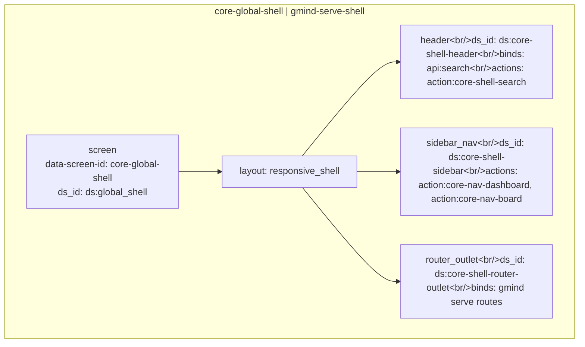

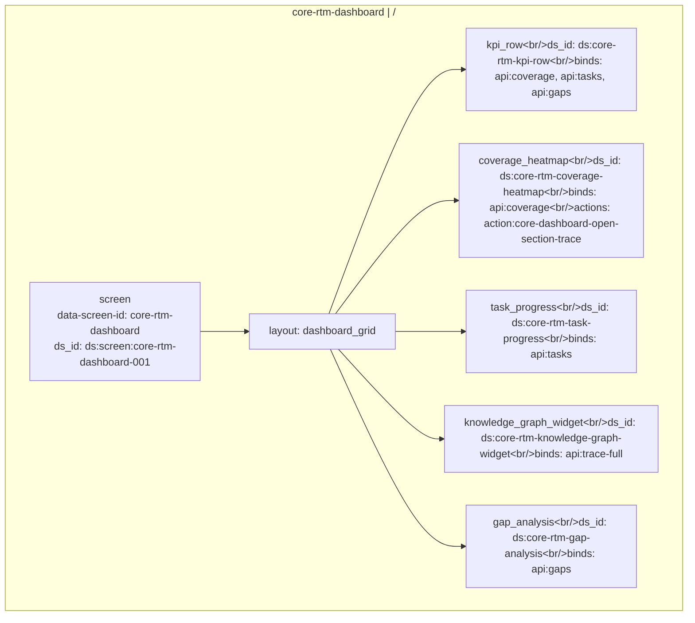

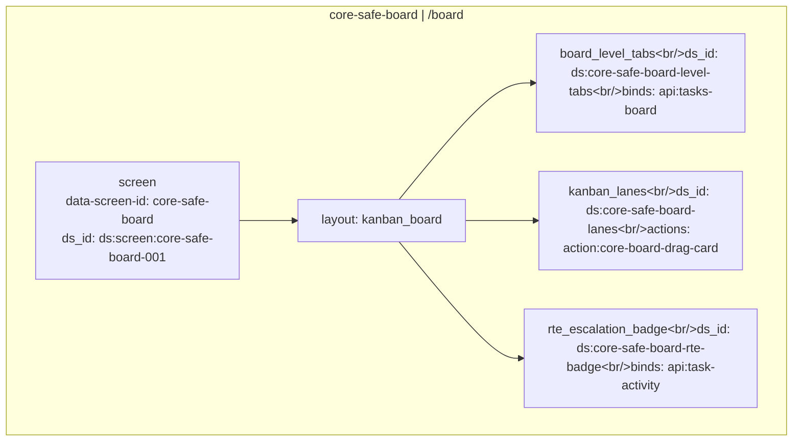

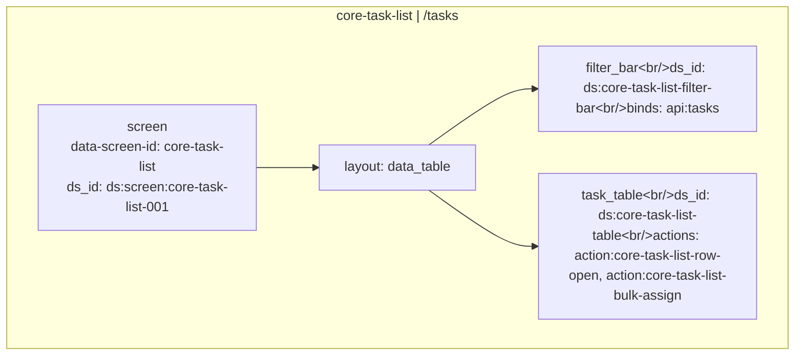

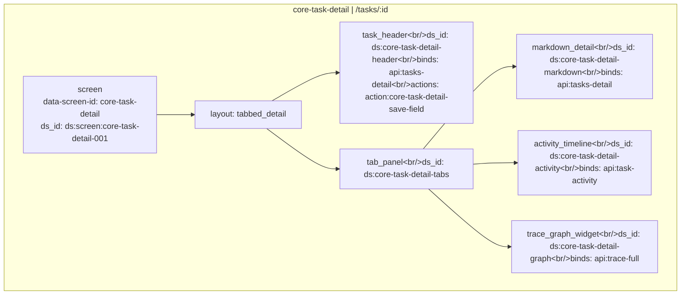

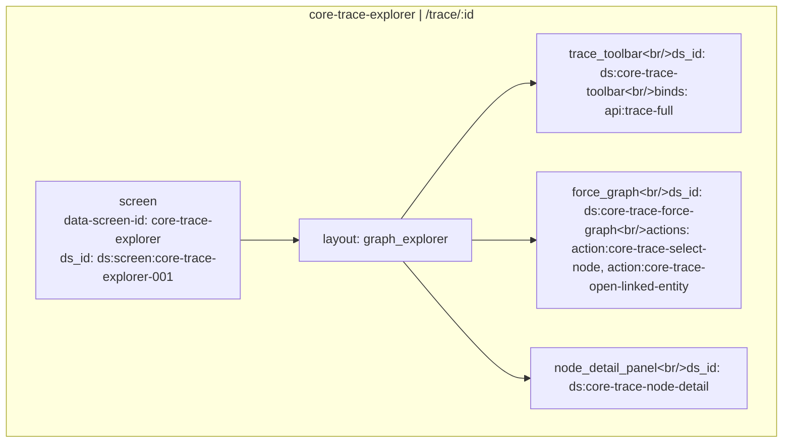

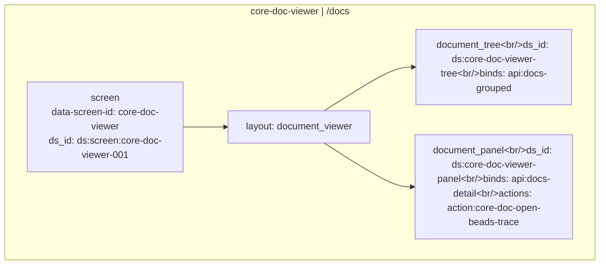

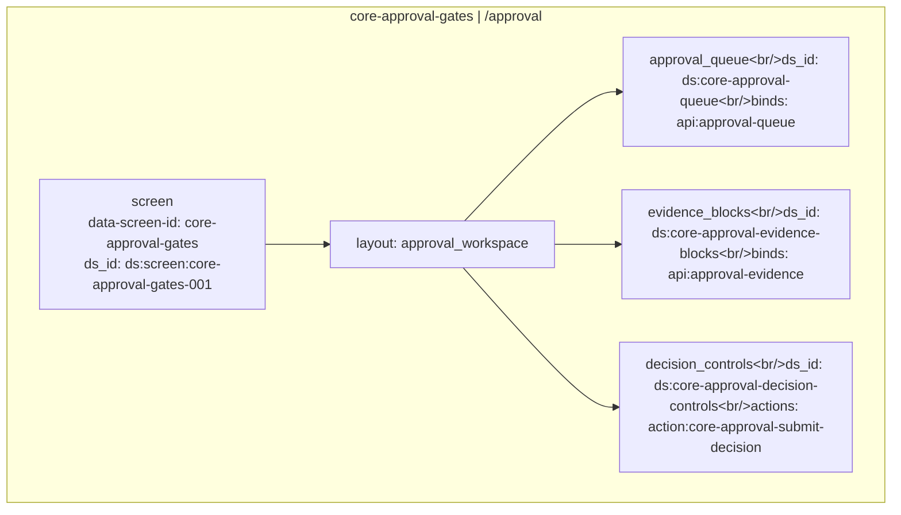

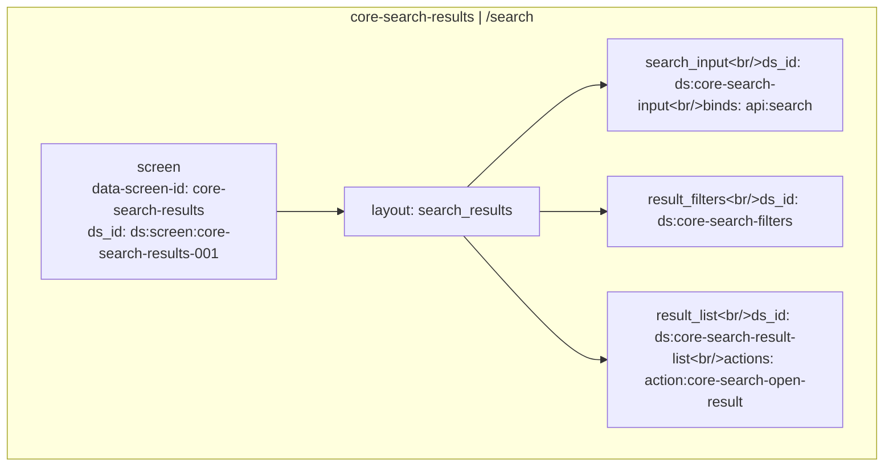

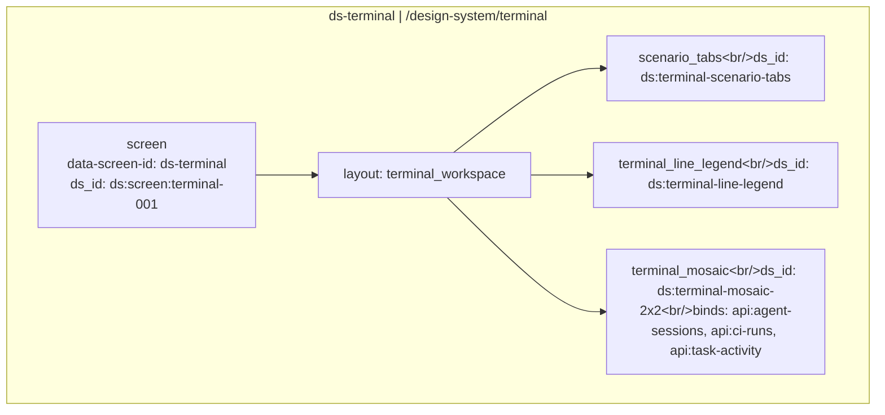

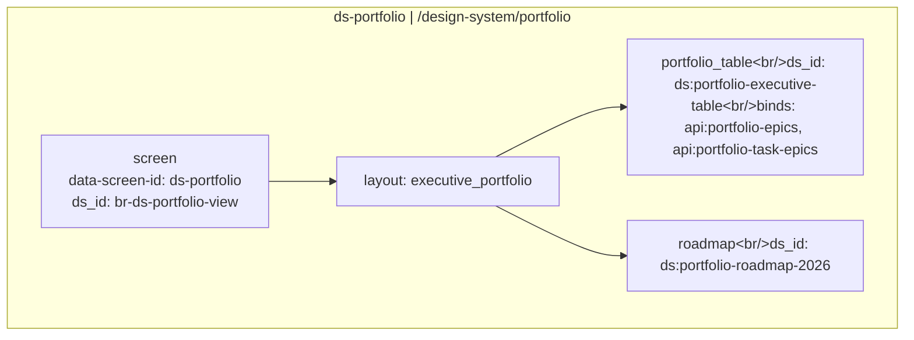

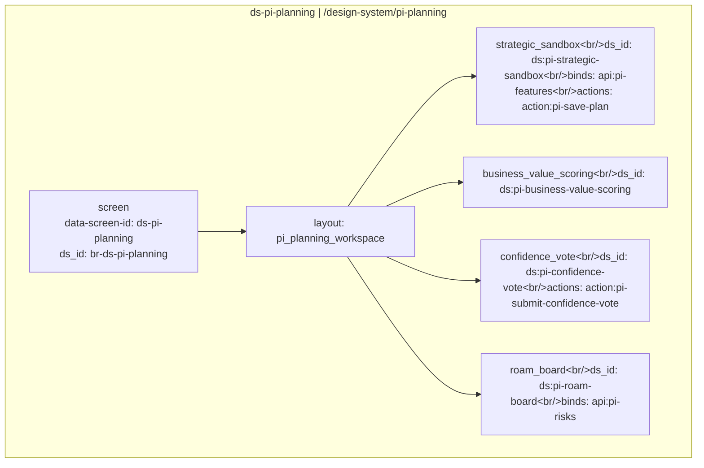

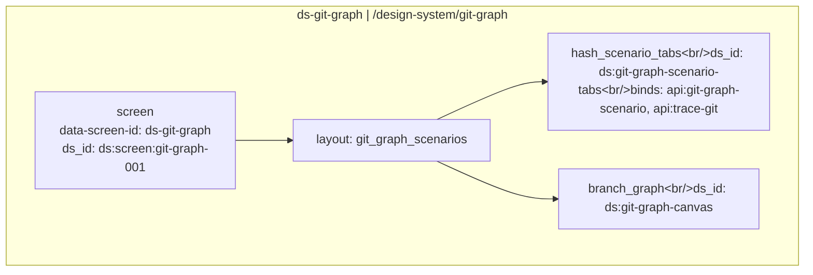

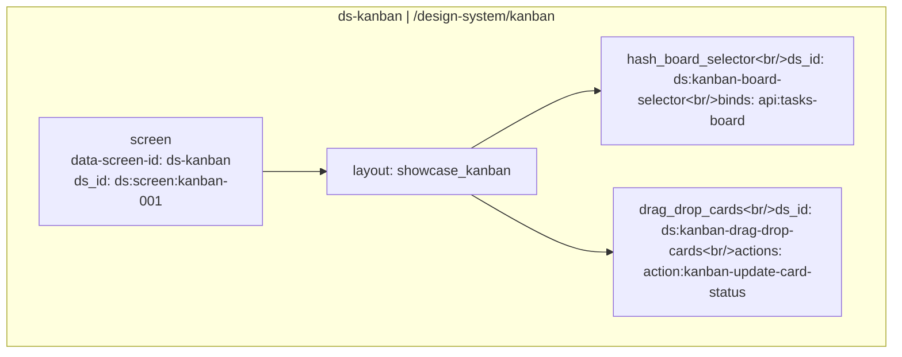

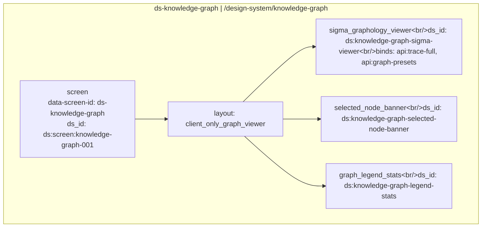

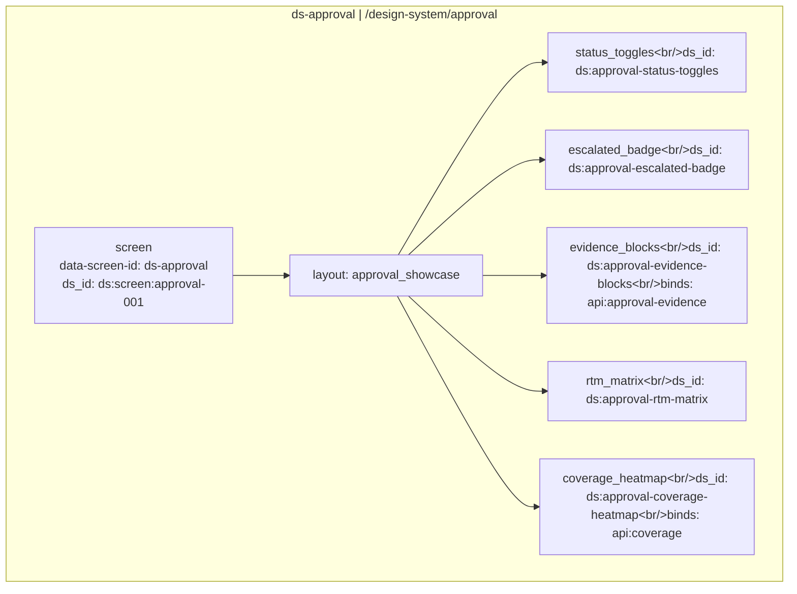

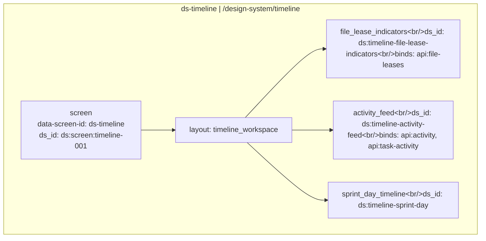

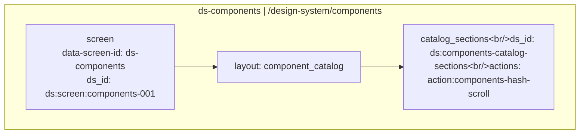

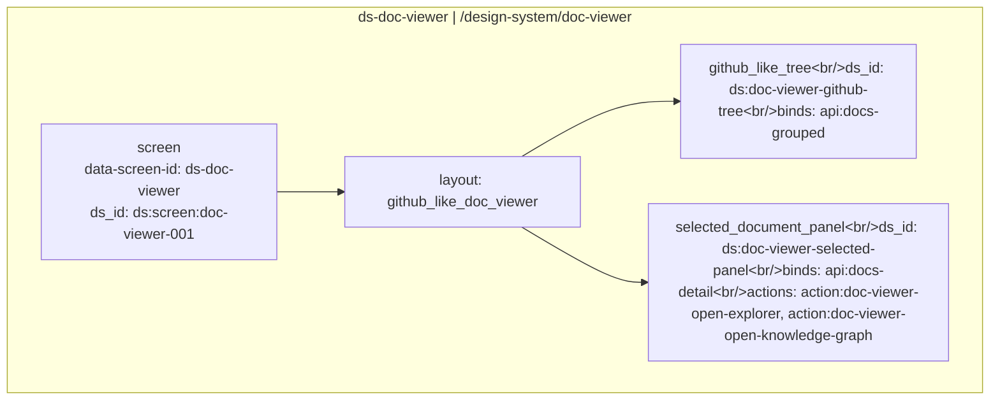

```mermaid
flowchart TB
    subgraph sg_ds_explorer["ds-explorer | /design-system/explorer"]
        screen_ds_explorer["screen<br/>data-screen-id: ds-explorer<br/>ds_id: ds:screen:explorer-001"]
        screen_ds_explorer --> layout_ds_explorer["layout: unified_explorer"]
        layout_ds_explorer --> ds_explorer_1_unified_search["unified_search&lt;br/&gt;ds_id: ds:explorer-unified-search&lt;br/&gt;binds: api:search"]
        layout_ds_explorer --> ds_explorer_2_hash_filter_select["hash_filter_select&lt;br/&gt;ds_id: ds:explorer-filter-select"]
        layout_ds_explorer --> ds_explorer_3_result_list["result_list&lt;br/&gt;ds_id: ds:explorer-result-list"]
        layout_ds_explorer --> ds_explorer_4_detail_sidebar["detail_sidebar&lt;br/&gt;ds_id: ds:explorer-detail-sidebar"]
    end
```

```mermaid
flowchart TB
    subgraph sg_ds_beads_traversal["ds-beads-traversal | /design-system/beads-traversal"]
        screen_ds_beads_traversal["screen<br/>data-screen-id: ds-beads-traversal<br/>ds_id: ds:screen:beads-traversal-001"]
        screen_ds_beads_traversal --> layout_ds_beads_traversal["layout: layered_dag"]
        layout_ds_beads_traversal --> ds_beads_traversal_1_layer_columns["layer_columns&lt;br/&gt;ds_id: ds:beads-traversal-layers&lt;br/&gt;binds: api:trace-full"]
        layout_ds_beads_traversal --> ds_beads_traversal_2_direction_toggle["direction_toggle&lt;br/&gt;ds_id: ds:beads-traversal-direction-toggle"]
        layout_ds_beads_traversal --> ds_beads_traversal_3_selected_linked_highlighting["selected_linked_highlighting&lt;br/&gt;ds_id: ds:beads-traversal-linked-highlighting"]
        layout_ds_beads_traversal --> ds_beads_traversal_4_traversal_detail_sidebar["traversal_detail_sidebar&lt;br/&gt;ds_id: ds:beads-traversal-detail-sidebar"]
        layout_ds_beads_traversal --> ds_beads_traversal_5_legend_stats["legend_stats&lt;br/&gt;ds_id: ds:beads-traversal-legend-stats"]
    end
```

```mermaid
flowchart TB
    subgraph sg_ds_storyboard["ds-storyboard | /design-system/storyboard"]
        screen_ds_storyboard["screen<br/>data-screen-id: ds-storyboard<br/>ds_id: ds:screen:storyboard-001"]
        screen_ds_storyboard --> layout_ds_storyboard["layout: storyboard_overview"]
        layout_ds_storyboard --> ds_storyboard_1_journey_filter["journey_filter&lt;br/&gt;ds_id: ds:storyboard-journey-filter&lt;br/&gt;binds: api:storyboards"]
        layout_ds_storyboard --> ds_storyboard_2_horizontal_usecase_flow["horizontal_usecase_flow&lt;br/&gt;ds_id: ds:storyboard-usecase-flow"]
        layout_ds_storyboard --> ds_storyboard_3_guidance_panel["guidance_panel&lt;br/&gt;ds_id: ds:storyboard-guidance-panel&lt;br/&gt;actions: action:storyboard-open-real-screen"]
    end
```

```mermaid
flowchart TB
    subgraph sg_ds_storyboard_detail["ds-storyboard-detail | /design-system/storyboard/:id"]
        screen_ds_storyboard_detail["screen<br/>data-screen-id: ds-storyboard-detail<br/>ds_id: ds:screen:storyboard-detail-001"]
        screen_ds_storyboard_detail --> layout_ds_storyboard_detail["layout: storyboard_detail"]
        layout_ds_storyboard_detail --> ds_storyboard_detail_1_storyboard_role_summary["storyboard_role_summary&lt;br/&gt;ds_id: ds:storyboard-detail-role-summary&lt;br/&gt;binds: api:storyboard-detail"]
        layout_ds_storyboard_detail --> ds_storyboard_detail_2_storyboard_step_timeline["storyboard_step_timeline&lt;br/&gt;ds_id: ds:storyboard-detail-step-timeline"]
        layout_ds_storyboard_detail --> ds_storyboard_detail_3_related_usecases["related_usecases&lt;br/&gt;ds_id: ds:storyboard-detail-related-usecases"]
    end
```

```mermaid
flowchart TB
    subgraph sg_ds_webui_pm_workspace["ds-webui-pm-workspace | /design-system/webui-pm-workspace"]
        screen_ds_webui_pm_workspace["screen<br/>data-screen-id: ds-webui-pm-workspace<br/>ds_id: ds:global_shell"]
        screen_ds_webui_pm_workspace --> layout_ds_webui_pm_workspace["layout: integrated_pm_workspace_shell"]
        layout_ds_webui_pm_workspace --> ds_webui_pm_workspace_1_workspace_header["workspace_header&lt;br/&gt;ds_id: ds:webui-pm-workspace-header"]
        layout_ds_webui_pm_workspace --> ds_webui_pm_workspace_2_workspace_sidebar["workspace_sidebar&lt;br/&gt;ds_id: ds:webui-pm-workspace-sidebar"]
        layout_ds_webui_pm_workspace --> ds_webui_pm_workspace_3_active_surface_router["active_surface_router&lt;br/&gt;ds_id: ds:webui-pm-workspace-active-surface-router&lt;br/&gt;binds: gmind serve route mapping"]
    end
```

## 3. State Coverage Per Screen

### Core WebUI state coverage

```mermaid
flowchart LR
    subgraph state_sg_core_global_shell["core-global-shell"]
        states_core_global_shell["default, loading, offline, forbidden"]
    end
```

```mermaid
flowchart LR
    subgraph state_sg_core_rtm_dashboard["core-rtm-dashboard"]
        states_core_rtm_dashboard["default, loading, empty, error, offline, forbidden"]
    end
```

```mermaid
flowchart LR
    subgraph state_sg_core_safe_board["core-safe-board"]
        states_core_safe_board["default, loading, empty, error, offline, forbidden"]
    end
```

```mermaid
flowchart LR
    subgraph state_sg_core_task_list["core-task-list"]
        states_core_task_list["default, loading, empty, error, offline, forbidden, processing"]
    end
```

```mermaid
flowchart LR
    subgraph state_sg_core_task_detail["core-task-detail"]
        states_core_task_detail["default, loading, not-found, error, offline, forbidden, saving"]
    end
```

```mermaid
flowchart LR
    subgraph state_sg_core_trace_explorer["core-trace-explorer"]
        states_core_trace_explorer["default, loading, empty, error, offline, forbidden, partial"]
    end
```

```mermaid
flowchart LR
    subgraph state_sg_core_doc_viewer["core-doc-viewer"]
        states_core_doc_viewer["default, loading, empty, error, offline, forbidden"]
    end
```

```mermaid
flowchart LR
    subgraph state_sg_core_approval_gates["core-approval-gates"]
        states_core_approval_gates["default, loading, empty, error, offline, forbidden, insufficient-evidence"]
    end
```

```mermaid
flowchart LR
    subgraph state_sg_core_search_results["core-search-results"]
        states_core_search_results["default, loading, empty, error, offline, forbidden"]
    end
```

### Showcase route state coverage

```mermaid
flowchart LR
    subgraph state_sg_ds_terminal["ds-terminal"]
        states_ds_terminal["default, loading, empty, error, offline, forbidden"]
    end
```

```mermaid
flowchart LR
    subgraph state_sg_ds_portfolio["ds-portfolio"]
        states_ds_portfolio["default, loading, empty, error, offline, forbidden"]
    end
```

```mermaid
flowchart LR
    subgraph state_sg_ds_pi_planning["ds-pi-planning"]
        states_ds_pi_planning["default, loading, empty, error, offline, forbidden"]
    end
```

```mermaid
flowchart LR
    subgraph state_sg_ds_git_graph["ds-git-graph"]
        states_ds_git_graph["default, loading, empty, error, offline, forbidden"]
    end
```

```mermaid
flowchart LR
    subgraph state_sg_ds_kanban["ds-kanban"]
        states_ds_kanban["default, loading, empty, error, offline, forbidden"]
    end
```

```mermaid
flowchart LR
    subgraph state_sg_ds_knowledge_graph["ds-knowledge-graph"]
        states_ds_knowledge_graph["default, loading, empty, error, offline, forbidden"]
    end
```

```mermaid
flowchart LR
    subgraph state_sg_ds_approval["ds-approval"]
        states_ds_approval["default, loading, empty, error, offline, forbidden, insufficient-evidence"]
    end
```

```mermaid
flowchart LR
    subgraph state_sg_ds_timeline["ds-timeline"]
        states_ds_timeline["default, loading, empty, error, offline, forbidden"]
    end
```

```mermaid
flowchart LR
    subgraph state_sg_ds_components["ds-components"]
        states_ds_components["default, loading, empty, error"]
    end
```

```mermaid
flowchart LR
    subgraph state_sg_ds_doc_viewer["ds-doc-viewer"]
        states_ds_doc_viewer["default, loading, empty, error, offline, forbidden"]
    end
```

```mermaid
flowchart LR
    subgraph state_sg_ds_explorer["ds-explorer"]
        states_ds_explorer["default, loading, empty, error, offline, forbidden"]
    end
```

```mermaid
flowchart LR
    subgraph state_sg_ds_beads_traversal["ds-beads-traversal"]
        states_ds_beads_traversal["default, loading, empty, error, offline, forbidden"]
    end
```

```mermaid
flowchart LR
    subgraph state_sg_ds_storyboard["ds-storyboard"]
        states_ds_storyboard["default, loading, empty, error, offline, forbidden"]
    end
```

```mermaid
flowchart LR
    subgraph state_sg_ds_storyboard_detail["ds-storyboard-detail"]
        states_ds_storyboard_detail["default, loading, empty, error, offline, forbidden"]
    end
```

```mermaid
flowchart LR
    subgraph state_sg_ds_webui_pm_workspace["ds-webui-pm-workspace"]
        states_ds_webui_pm_workspace["default, loading, empty, error, offline, forbidden"]
    end
```

## 4. Action-to-Event Links

### Core WebUI actions

```mermaid
flowchart LR
    subgraph actions_core_global_shell["core-global-shell actions"]
        action_core_shell_search["action:core-shell-search<br/>Search workspace"] --> EVENT_CORE_SHELL_SEARCH["EVENT_CORE_SHELL_SEARCH<br/>matched"]
        EVENT_CORE_SHELL_SEARCH --> action_core_shell_search_target["target: /search"]
        action_core_nav_dashboard["action:core-nav-dashboard<br/>Open dashboard"] --> EVENT_CORE_NAV_DASHBOARD["EVENT_CORE_NAV_DASHBOARD<br/>matched"]
        EVENT_CORE_NAV_DASHBOARD --> action_core_nav_dashboard_target["target: /"]
        action_core_nav_board["action:core-nav-board<br/>Open SAFe board"] --> EVENT_CORE_NAV_BOARD["EVENT_CORE_NAV_BOARD<br/>matched"]
        EVENT_CORE_NAV_BOARD --> action_core_nav_board_target["target: /board"]
        action_core_nav_tasks["action:core-nav-tasks<br/>Open task list"] --> EVENT_CORE_NAV_TASKS["EVENT_CORE_NAV_TASKS<br/>matched"]
        EVENT_CORE_NAV_TASKS --> action_core_nav_tasks_target["target: /tasks"]
        action_core_nav_trace["action:core-nav-trace<br/>Open trace explorer"] --> EVENT_CORE_NAV_TRACE["EVENT_CORE_NAV_TRACE<br/>matched"]
        EVENT_CORE_NAV_TRACE --> action_core_nav_trace_target["target: /trace/:id"]
        action_core_nav_docs["action:core-nav-docs<br/>Open docs"] --> EVENT_CORE_NAV_DOCS["EVENT_CORE_NAV_DOCS<br/>matched"]
        EVENT_CORE_NAV_DOCS --> action_core_nav_docs_target["target: /docs"]
        action_core_nav_approval["action:core-nav-approval<br/>Open approvals"] --> EVENT_CORE_NAV_APPROVAL["EVENT_CORE_NAV_APPROVAL<br/>matched"]
        EVENT_CORE_NAV_APPROVAL --> action_core_nav_approval_target["target: /approval"]
    end
```

```mermaid
flowchart LR
    subgraph actions_core_rtm_dashboard["core-rtm-dashboard actions"]
        action_core_dashboard_open_section_trace["action:core-dashboard-open-section-trace<br/>Open section trace"] --> EVENT_CORE_DASHBOARD_OPEN_SECTION_TRACE["EVENT_CORE_DASHBOARD_OPEN_SECTION_TRACE<br/>matched"]
        EVENT_CORE_DASHBOARD_OPEN_SECTION_TRACE --> action_core_dashboard_open_section_trace_target["target: /trace/:id"]
    end
```

```mermaid
flowchart LR
    subgraph actions_core_safe_board["core-safe-board actions"]
        action_core_board_drag_card["action:core-board-drag-card<br/>Move task status"] --> EVENT_CORE_BOARD_DRAG_CARD["EVENT_CORE_BOARD_DRAG_CARD<br/>matched"]
        EVENT_CORE_BOARD_DRAG_CARD --> action_core_board_drag_card_target["target: api:task-status"]
    end
```

```mermaid
flowchart LR
    subgraph actions_core_task_list["core-task-list actions"]
        action_core_task_list_row_open["action:core-task-list-row-open<br/>Open task detail"] --> EVENT_CORE_TASK_LIST_ROW_OPEN["EVENT_CORE_TASK_LIST_ROW_OPEN<br/>matched"]
        EVENT_CORE_TASK_LIST_ROW_OPEN --> action_core_task_list_row_open_target["target: /tasks/:id"]
        action_core_task_list_bulk_assign["action:core-task-list-bulk-assign<br/>Bulk assign tasks"] --> EVENT_CORE_TASK_LIST_BULK_ASSIGN["EVENT_CORE_TASK_LIST_BULK_ASSIGN<br/>matched"]
        EVENT_CORE_TASK_LIST_BULK_ASSIGN --> action_core_task_list_bulk_assign_target["target: api:tasks-update"]
    end
```

```mermaid
flowchart LR
    subgraph actions_core_task_detail["core-task-detail actions"]
        action_core_task_detail_save_field["action:core-task-detail-save-field<br/>Save edited field"] --> EVENT_CORE_TASK_DETAIL_SAVE_FIELD["EVENT_CORE_TASK_DETAIL_SAVE_FIELD<br/>matched"]
        EVENT_CORE_TASK_DETAIL_SAVE_FIELD --> action_core_task_detail_save_field_target["target: api:tasks-update"]
    end
```

```mermaid
flowchart LR
    subgraph actions_core_trace_explorer["core-trace-explorer actions"]
        action_core_trace_select_node["action:core-trace-select-node<br/>Select graph node"] --> EVENT_CORE_TRACE_SELECT_NODE["EVENT_CORE_TRACE_SELECT_NODE<br/>matched"]
        EVENT_CORE_TRACE_SELECT_NODE --> action_core_trace_select_node_target["target: detail panel"]
        action_core_trace_open_linked_entity["action:core-trace-open-linked-entity<br/>Open linked entity"] --> EVENT_CORE_TRACE_OPEN_LINKED_ENTITY["EVENT_CORE_TRACE_OPEN_LINKED_ENTITY<br/>matched"]
        EVENT_CORE_TRACE_OPEN_LINKED_ENTITY --> action_core_trace_open_linked_entity_target["target: route by node type"]
    end
```

```mermaid
flowchart LR
    subgraph actions_core_doc_viewer["core-doc-viewer actions"]
        action_core_doc_open_beads_trace["action:core-doc-open-beads-trace<br/>Open beads trace"] --> EVENT_CORE_DOC_OPEN_BEADS_TRACE["EVENT_CORE_DOC_OPEN_BEADS_TRACE<br/>matched"]
        EVENT_CORE_DOC_OPEN_BEADS_TRACE --> action_core_doc_open_beads_trace_target["target: /trace/:id"]
    end
```

```mermaid
flowchart LR
    subgraph actions_core_approval_gates["core-approval-gates actions"]
        action_core_approval_submit_decision["action:core-approval-submit-decision<br/>Submit approval decision"] --> EVENT_CORE_APPROVAL_SUBMIT_DECISION["EVENT_CORE_APPROVAL_SUBMIT_DECISION<br/>matched"]
        EVENT_CORE_APPROVAL_SUBMIT_DECISION --> action_core_approval_submit_decision_target["target: api:approval-decision"]
    end
```

```mermaid
flowchart LR
    subgraph actions_core_search_results["core-search-results actions"]
        action_core_search_open_result["action:core-search-open-result<br/>Open selected result"] --> EVENT_CORE_SEARCH_OPEN_RESULT["EVENT_CORE_SEARCH_OPEN_RESULT<br/>matched"]
        EVENT_CORE_SEARCH_OPEN_RESULT --> action_core_search_open_result_target["target: route by result type"]
    end
```

### Showcase route actions

```mermaid
flowchart LR
    subgraph actions_ds_pi_planning["ds-pi-planning actions"]
        action_pi_save_plan["action:pi-save-plan<br/>Save PI plan"] --> EVENT_PI_SAVE_PLAN["EVENT_PI_SAVE_PLAN<br/>matched"]
        EVENT_PI_SAVE_PLAN --> action_pi_save_plan_target["target: api:pi-plan"]
        action_pi_submit_confidence_vote["action:pi-submit-confidence-vote<br/>Submit confidence vote"] --> EVENT_PI_SUBMIT_CONFIDENCE_VOTE["EVENT_PI_SUBMIT_CONFIDENCE_VOTE<br/>matched"]
        EVENT_PI_SUBMIT_CONFIDENCE_VOTE --> action_pi_submit_confidence_vote_target["target: api:pi-confidence-vote"]
    end
```

```mermaid
flowchart LR
    subgraph actions_ds_kanban["ds-kanban actions"]
        action_kanban_update_card_status["action:kanban-update-card-status<br/>Update card status"] --> EVENT_KANBAN_UPDATE_CARD_STATUS["EVENT_KANBAN_UPDATE_CARD_STATUS<br/>matched"]
        EVENT_KANBAN_UPDATE_CARD_STATUS --> action_kanban_update_card_status_target["target: api:task-status"]
    end
```

```mermaid
flowchart LR
    subgraph actions_ds_components["ds-components actions"]
        action_components_hash_scroll["action:components-hash-scroll<br/>Scroll to component section"] --> EVENT_COMPONENTS_HASH_SCROLL["EVENT_COMPONENTS_HASH_SCROLL<br/>matched"]
        EVENT_COMPONENTS_HASH_SCROLL --> action_components_hash_scroll_target["target: hash anchor"]
    end
```

```mermaid
flowchart LR
    subgraph actions_ds_doc_viewer["ds-doc-viewer actions"]
        action_doc_viewer_open_explorer["action:doc-viewer-open-explorer<br/>Open Explorer"] --> EVENT_DOC_VIEWER_OPEN_EXPLORER["EVENT_DOC_VIEWER_OPEN_EXPLORER<br/>matched"]
        EVENT_DOC_VIEWER_OPEN_EXPLORER --> action_doc_viewer_open_explorer_target["target: /design-system/explorer"]
        action_doc_viewer_open_knowledge_graph["action:doc-viewer-open-knowledge-graph<br/>Open Knowledge Graph"] --> EVENT_DOC_VIEWER_OPEN_KNOWLEDGE_GRAPH["EVENT_DOC_VIEWER_OPEN_KNOWLEDGE_GRAPH<br/>matched"]
        EVENT_DOC_VIEWER_OPEN_KNOWLEDGE_GRAPH --> action_doc_viewer_open_knowledge_graph_target["target: /design-system/knowledge-graph"]
        action_doc_viewer_open_core_trace["action:doc-viewer-open-core-trace<br/>Open Beads trace"] --> EVENT_DOC_VIEWER_OPEN_CORE_TRACE["EVENT_DOC_VIEWER_OPEN_CORE_TRACE<br/>matched"]
        EVENT_DOC_VIEWER_OPEN_CORE_TRACE --> action_doc_viewer_open_core_trace_target["target: /trace/:id"]
    end
```

```mermaid
flowchart LR
    subgraph actions_ds_storyboard["ds-storyboard actions"]
        action_storyboard_open_real_screen["action:storyboard-open-real-screen<br/>Open real screen"] --> EVENT_STORYBOARD_OPEN_REAL_SCREEN["EVENT_STORYBOARD_OPEN_REAL_SCREEN<br/>matched"]
        EVENT_STORYBOARD_OPEN_REAL_SCREEN --> action_storyboard_open_real_screen_target["target: route by use case"]
    end
```

## 5. Responsive Layout Intent by Viewport

```mermaid
flowchart TD
    VP["Canonical viewports"]
    VP --> vp_desktop["desktop 1440px&lt;br/&gt;min 1280px&lt;br/&gt;persistent shell, expanded sidebar, multi-column content"]
    VP --> vp_tablet["tablet 1024px&lt;br/&gt;min 768px&lt;br/&gt;condensed sidebar, horizontal scroll for dense boards, drawers become bottom sheets"]
    VP --> vp_mobile["mobile 390px&lt;br/&gt;max 767px&lt;br/&gt;hamburger shell, single-column content, tables become cards, drawers become full-screen overlays"]
    vp_desktop --> resp_core_global_shell["core-global-shell&lt;br/&gt;desktop: 240px sidebar with header search and footer sync status&lt;br/&gt;tablet: 60px icon sidebar with tooltips&lt;br/&gt;mobile: hamburger overlay sidebar"]
    vp_desktop --> resp_core_rtm_dashboard["core-rtm-dashboard&lt;br/&gt;desktop: 2x2 panels below KPI row&lt;br/&gt;tablet: two stacked rows&lt;br/&gt;mobile: one panel per row"]
    vp_desktop --> resp_core_safe_board["core-safe-board&lt;br/&gt;desktop: horizontal Portfolio, ART, and Team lanes&lt;br/&gt;tablet: horizontal scroll lanes&lt;br/&gt;mobile: stacked task cards"]
    vp_desktop --> resp_core_task_list["core-task-list&lt;br/&gt;desktop: full sortable table&lt;br/&gt;tablet: hide lower-priority columns in expandable rows&lt;br/&gt;mobile: card list with filter drawer"]
    vp_desktop --> resp_core_task_detail["core-task-detail&lt;br/&gt;desktop: header fields plus tabs&lt;br/&gt;tablet: scrollable tabs&lt;br/&gt;mobile: accordion tabs"]
    vp_desktop --> resp_core_trace_explorer["core-trace-explorer&lt;br/&gt;desktop: 70 percent graph canvas and 30 percent detail panel&lt;br/&gt;tablet: graph with bottom sheet detail&lt;br/&gt;mobile: simplified tree view with full-screen detail overlay"]
    vp_desktop --> resp_core_doc_viewer["core-doc-viewer&lt;br/&gt;desktop: tree and document split view&lt;br/&gt;tablet: top document selector with content panel&lt;br/&gt;mobile: document list then selected document"]
    vp_desktop --> resp_core_approval_gates["core-approval-gates&lt;br/&gt;desktop: evidence split view with sticky decision panel&lt;br/&gt;tablet: stacked evidence and decision sections&lt;br/&gt;mobile: evidence cards with bottom decision bar"]
    vp_desktop --> resp_core_search_results["core-search-results&lt;br/&gt;desktop: filter sidebar and grouped results&lt;br/&gt;tablet: expandable filters above results&lt;br/&gt;mobile: filter dropdown and full-width results"]
    vp_mobile --> resp_ds_terminal["ds-terminal&lt;br/&gt;desktop: scenario tabs above 2x2 mosaic terminal layout&lt;br/&gt;tablet: two columns then stacked terminals&lt;br/&gt;mobile: one terminal per row"]
    vp_mobile --> resp_ds_portfolio["ds-portfolio&lt;br/&gt;desktop: table and roadmap side by side&lt;br/&gt;tablet: table above roadmap&lt;br/&gt;mobile: epic cards and scrollable roadmap"]
    vp_mobile --> resp_ds_pi_planning["ds-pi-planning&lt;br/&gt;desktop: sandbox, scoring, vote, and ROAM board&lt;br/&gt;tablet: two stacked planning columns&lt;br/&gt;mobile: single-column planning cards"]
    vp_mobile --> resp_ds_git_graph["ds-git-graph&lt;br/&gt;desktop: scenario rail, graph canvas, stats panel&lt;br/&gt;tablet: scenario select above canvas&lt;br/&gt;mobile: stacked scenario list and graph summary"]
    vp_mobile --> resp_ds_kanban["ds-kanban&lt;br/&gt;desktop: board selector and lanes&lt;br/&gt;tablet: scrollable lanes&lt;br/&gt;mobile: card list grouped by status"]
    vp_mobile --> resp_ds_knowledge_graph["ds-knowledge-graph&lt;br/&gt;desktop: Sigma.js canvas with legends and detail banner&lt;br/&gt;tablet: canvas with collapsible legends&lt;br/&gt;mobile: simplified graph with selected-node drawer"]
    vp_mobile --> resp_ds_approval["ds-approval&lt;br/&gt;desktop: approval panels, RTM, and heatmap sections&lt;br/&gt;tablet: stacked panels with sticky toggles&lt;br/&gt;mobile: accordion evidence panels"]
    vp_mobile --> resp_ds_timeline["ds-timeline&lt;br/&gt;desktop: three timeline sections&lt;br/&gt;tablet: stacked timeline sections&lt;br/&gt;mobile: compact event list"]
    vp_mobile --> resp_ds_components["ds-components&lt;br/&gt;desktop: section sidebar and examples grid&lt;br/&gt;tablet: section tabs and examples&lt;br/&gt;mobile: hash-scroll sections"]
    vp_mobile --> resp_ds_doc_viewer["ds-doc-viewer&lt;br/&gt;desktop: file tree with selected document panel&lt;br/&gt;tablet: collapsible tree above panel&lt;br/&gt;mobile: folder list then document detail"]
    vp_mobile --> resp_ds_explorer["ds-explorer&lt;br/&gt;desktop: search, filters, results, and detail sidebar&lt;br/&gt;tablet: detail sidebar becomes bottom panel&lt;br/&gt;mobile: results list with detail overlay"]
    vp_mobile --> resp_ds_beads_traversal["ds-beads-traversal&lt;br/&gt;desktop: four-layer DAG with detail sidebar&lt;br/&gt;tablet: layered DAG with bottom detail&lt;br/&gt;mobile: layer cards with linked highlighting"]
    vp_mobile --> resp_ds_storyboard["ds-storyboard&lt;br/&gt;desktop: journey filter, horizontal flow, guidance panel&lt;br/&gt;tablet: flow above guidance panel&lt;br/&gt;mobile: step list with guidance cards"]
    vp_mobile --> resp_ds_storyboard_detail["ds-storyboard-detail&lt;br/&gt;desktop: role, journey, timeline, and related use cases&lt;br/&gt;tablet: stacked detail sections&lt;br/&gt;mobile: single-column timeline"]
    vp_mobile --> resp_ds_webui_pm_workspace["ds-webui-pm-workspace&lt;br/&gt;desktop: header, sidebar nav, and active surface canvas&lt;br/&gt;tablet: compact sidebar and stacked dashboard modules&lt;br/&gt;mobile: hamburger nav and one active surface at a time"]
```

## 6. Route Coverage Check

```mermaid
flowchart TB
    Required["Required showcase route coverage"] --> Covered["15 of 15 required showcase routes diagrammed"]
    Covered --> cov_ds_terminal["/design-system/terminal<br/>ds-terminal"]
    Covered --> cov_ds_portfolio["/design-system/portfolio<br/>ds-portfolio"]
    Covered --> cov_ds_pi_planning["/design-system/pi-planning<br/>ds-pi-planning"]
    Covered --> cov_ds_git_graph["/design-system/git-graph<br/>ds-git-graph"]
    Covered --> cov_ds_kanban["/design-system/kanban<br/>ds-kanban"]
    Covered --> cov_ds_knowledge_graph["/design-system/knowledge-graph<br/>ds-knowledge-graph"]
    Covered --> cov_ds_approval["/design-system/approval<br/>ds-approval"]
    Covered --> cov_ds_timeline["/design-system/timeline<br/>ds-timeline"]
    Covered --> cov_ds_components["/design-system/components<br/>ds-components"]
    Covered --> cov_ds_doc_viewer["/design-system/doc-viewer<br/>ds-doc-viewer"]
    Covered --> cov_ds_explorer["/design-system/explorer<br/>ds-explorer"]
    Covered --> cov_ds_beads_traversal["/design-system/beads-traversal<br/>ds-beads-traversal"]
    Covered --> cov_ds_storyboard["/design-system/storyboard<br/>ds-storyboard"]
    Covered --> cov_ds_storyboard_detail["/design-system/storyboard/:id<br/>ds-storyboard-detail"]
    Covered --> cov_ds_webui_pm_workspace["/design-system/webui-pm-workspace<br/>ds-webui-pm-workspace"]
```

