# Review Diagrams: WebUI and PM Workspace

<!-- beads-id: br-design-webui-pm-review-diagrams -->

## Screen inventory and routes

<!-- beads-id: br-design-webui-pm-review-diagrams-s1 -->

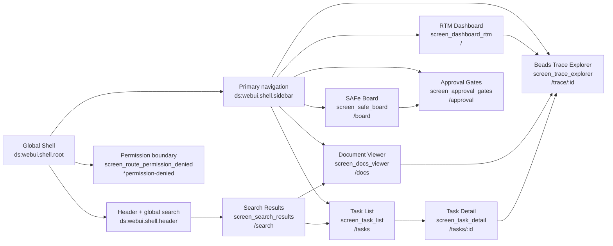

## Per-screen component hierarchy from YAML View Blueprint

<!-- beads-id: br-design-webui-pm-review-diagrams-s2 -->

```mermaid
flowchart TB
    ShellRoot["AppShell\nds:webui.shell.root"] --> ShellHeader["Navbar\nds:webui.shell.header"]
    ShellHeader --> GlobalSearch["SearchInput\nds:webui.shell.global_search"]
    ShellHeader --> ConnectionBadge["Badge\nds:webui.shell.connection_badge"]
    ShellRoot --> ShellSidebar["Sidebar\nds:webui.shell.sidebar"]
    ShellSidebar --> NavDashboard["NavItem Dashboard\nds:webui.shell.nav_dashboard"]
    ShellSidebar --> NavBoard["NavItem Board\nds:webui.shell.nav_board"]
    ShellSidebar --> NavTasks["NavItem Tasks\nds:webui.shell.nav_tasks"]
    ShellSidebar --> NavTrace["NavItem Trace\nds:webui.shell.nav_trace"]
    ShellSidebar --> NavDocs["NavItem Docs\nds:webui.shell.nav_docs"]
    ShellSidebar --> NavApproval["NavItem Approval\nds:webui.shell.nav_approval"]
    ShellRoot --> OfflineBanner["OfflineBanner\nds:webui.shell.offline_banner"]
    ShellRoot --> ShellFooter["Footer\nds:webui.shell.footer"]

    subgraph Dashboard["screen_dashboard_rtm"]
        DashboardRoot["DashboardPage\nds:webui.dashboard.root"] --> KpiRow["KpiRow\nds:webui.dashboard.kpi_row"]
        KpiRow --> KpiCoverage["Coverage card\nds:webui.dashboard.kpi_coverage"]
        KpiRow --> KpiDone["Done card\nds:webui.dashboard.kpi_done"]
        KpiRow --> KpiGaps["Gaps card\nds:webui.dashboard.kpi_gaps"]
        DashboardRoot --> CoveragePanel["HeatmapPanel\nds:webui.dashboard.coverage_panel"]
        DashboardRoot --> ProgressPanel["TaskProgressPanel\nds:webui.dashboard.progress_panel"]
        DashboardRoot --> GraphPanel["KnowledgeGraphWidget\nds:webui.dashboard.graph_panel"]
        DashboardRoot --> GapPanel["GapListPanel\nds:webui.dashboard.gap_panel"]
    end

    subgraph Board["screen_safe_board"]
        BoardRoot["BoardPage\nds:webui.board.root"] --> LevelTabs["SegmentControl\nds:webui.board.level_tabs"]
        BoardRoot --> TodoColumn["KanbanColumn Todo\nds:webui.board.todo_column"]
        BoardRoot --> ProgressColumn["KanbanColumn In Progress\nds:webui.board.progress_column"]
        BoardRoot --> BlockedColumn["KanbanColumn Blocked\nds:webui.board.blocked_column"]
        BoardRoot --> DoneColumn["KanbanColumn Done\nds:webui.board.done_column"]
        BoardRoot --> RteCard["RTE task card\nds:webui.board.rte_task_card"]
        RteCard --> RteBadge["RTE escalation badge\nds:webui.board.rte_escalation_badge"]
        BoardRoot --> VoteButton["Confidence Vote\nds:webui.board.confidence_vote_button"]
    end

    subgraph Approval["screen_approval_gates"]
        ApprovalRoot["ApprovalPage\nds:webui.approval.root"] --> EvidencePanel["ApprovalPanel\nds:webui.approval.evidence_panel"]
        ApprovalRoot --> PrdContext["PRD context\nds:webui.approval.prd_context"]
        ApprovalRoot --> ApproveButton["Approve button\nds:webui.approval.approve_button"]
        ApprovalRoot --> RejectButton["Reject button\nds:webui.approval.reject_button"]
    end

    subgraph Docs["screen_docs_viewer"]
        DocsRoot["DocsPage\nds:webui.docs.root"] --> DocTree["DocTree\nds:webui.docs.tree"]
        DocsRoot --> DocContent["MarkdownContent\nds:webui.docs.content"]
        DocsRoot --> CoverageBadge["Coverage badge\nds:webui.docs.coverage_badge"]
    end

    subgraph Trace["screen_trace_explorer"]
        TraceRoot["TracePage\nds:webui.trace.root"] --> TraceToolbar["Toolbar\nds:webui.trace.toolbar"]
        TraceRoot --> GraphCanvas["GraphCanvas\nds:webui.trace.graph_canvas"]
        TraceRoot --> DetailPanel["DetailPanel\nds:webui.trace.detail_panel"]
    end

    subgraph TaskDetail["screen_task_detail"]
        TaskRoot["TaskDetailPage\nds:webui.task_detail.root"] --> TaskHeader["Header card\nds:webui.task_detail.header_card"]
        TaskRoot --> TaskTabs["TabPanel\nds:webui.task_detail.tabs"]
        TaskTabs --> TaskTabList["TabList\nds:webui.task_detail.tab_list"]
        TaskTabList --> TaskTabDetail["Tab Detail\nds:webui.task_detail.tab_detail"]
        TaskTabList --> TaskTabActivity["Tab Activity\nds:webui.task_detail.tab_activity"]
        TaskTabList --> TaskTabGraph["Tab Graph\nds:webui.task_detail.tab_graph"]
        TaskTabList --> TaskTabCode["Tab Code\nds:webui.task_detail.tab_code"]
        TaskTabs --> TaskDetailPanel["DetailTabPanel\nds:webui.task_detail.detail_panel"]
        TaskTabs --> ActivityTimeline["ActivityTimeline\nds:webui.task_detail.activity_timeline"]
        TaskTabs --> TaskGraph["KnowledgeGraphWidget\nds:webui.task_detail.graph_widget"]
        TaskTabs --> CodePanel["CodeTabPanel\nds:webui.task_detail.code_panel"]
        CodePanel --> CodeFileList["CodeFileList\nds:webui.task_detail.code_file_list"]
        TaskRoot --> RteContext["Execution Context\nds:webui.task_detail.rte_context"]
    end

    subgraph TaskList["screen_task_list"]
        TasksRoot["TaskListPage\nds:webui.tasks.root"] --> FilterBar["FilterBar\nds:webui.tasks.filter_bar"]
        TasksRoot --> DataTable["DataTable\nds:webui.tasks.table"]
        TasksRoot --> BulkBar["BulkActionBar\nds:webui.tasks.bulk_bar"]
    end

    subgraph Search["screen_search_results"]
        SearchRoot["SearchPage\nds:webui.search.root"] --> SearchFilters["FilterSidebar\nds:webui.search.filters"]
        SearchRoot --> SearchResults["ResultGroupList\nds:webui.search.results"]
    end

    subgraph Boundary["screen_route_permission_denied"]
        BoundaryRoot["BoundaryPage\nds:webui.boundary.permission_root"] --> BackButton["Back button\nds:webui.boundary.permission_back_button"]
    end

    ShellRoot --> DashboardRoot
    ShellRoot --> BoardRoot
    ShellRoot --> ApprovalRoot
    ShellRoot --> DocsRoot
    ShellRoot --> TraceRoot
    ShellRoot --> TaskRoot
    ShellRoot --> TasksRoot
    ShellRoot --> SearchRoot
    ShellRoot --> BoundaryRoot
```

## State coverage per screen

<!-- beads-id: br-design-webui-pm-review-diagrams-s3 -->

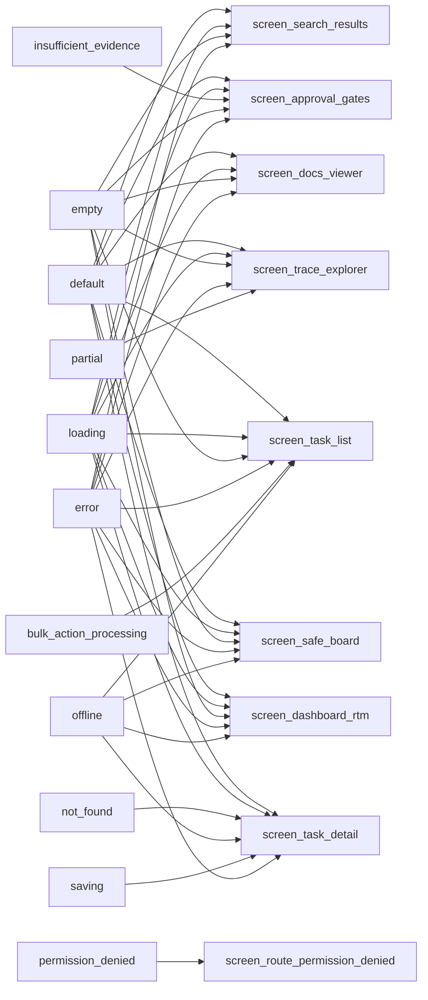

## Action-to-event links between YAML actions and Mermaid events

<!-- beads-id: br-design-webui-pm-review-diagrams-s4 -->

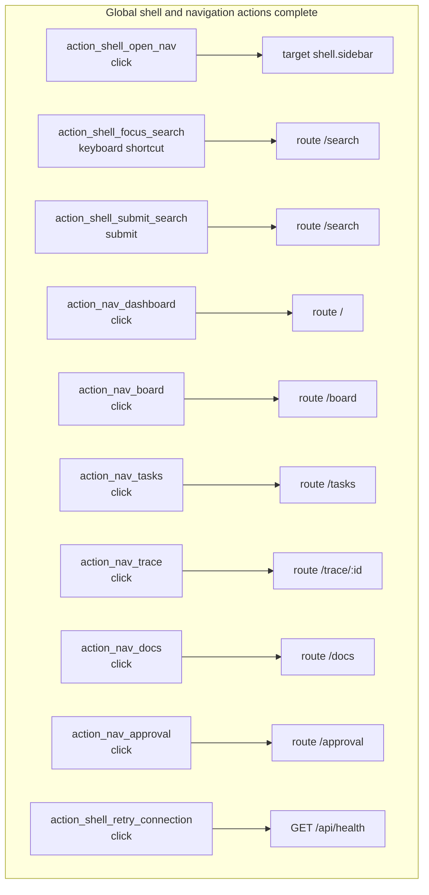

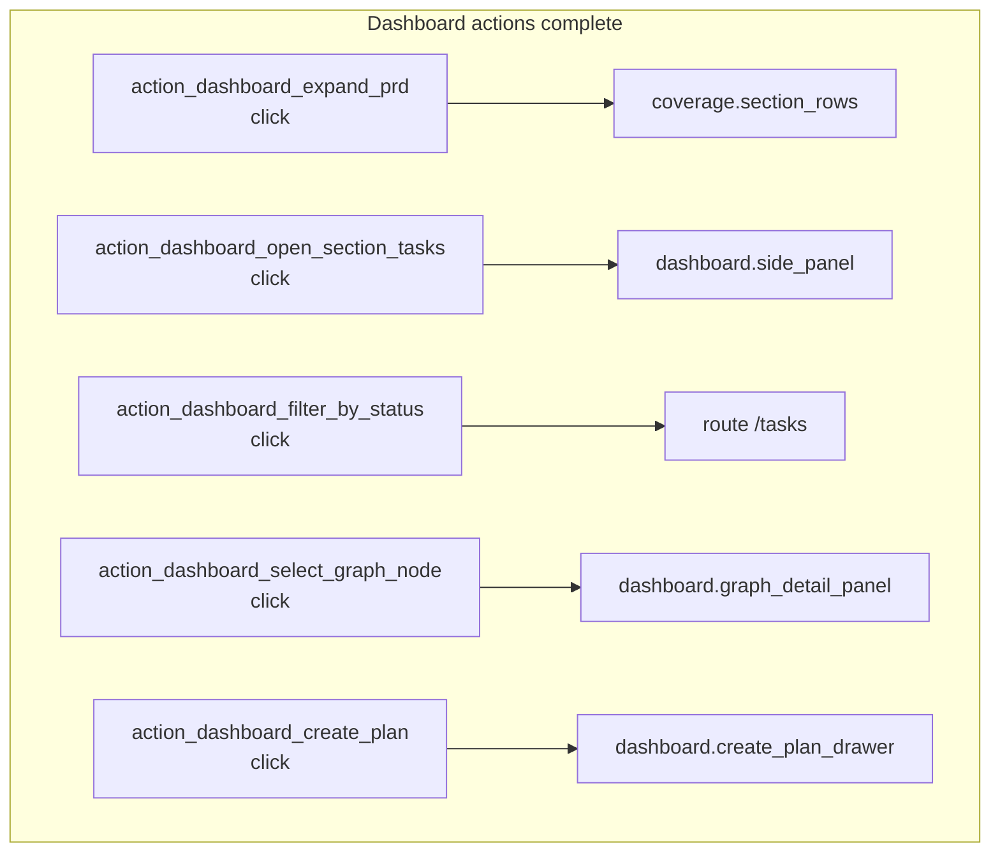

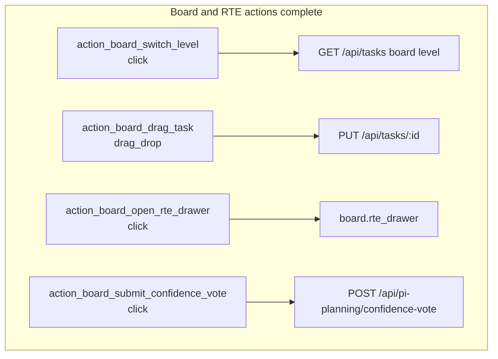

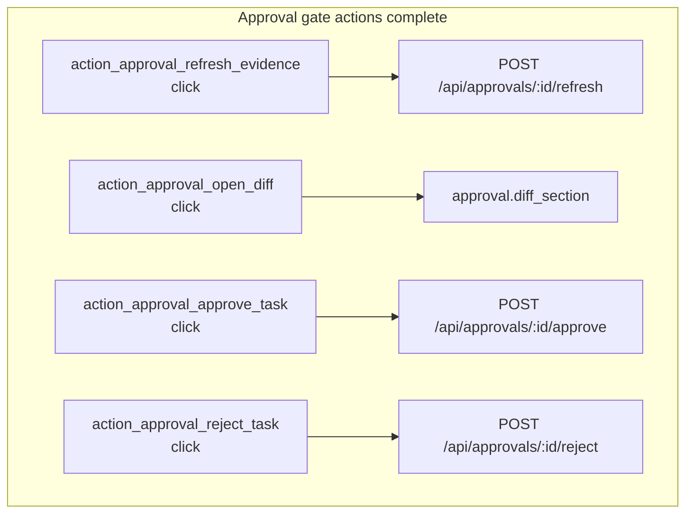

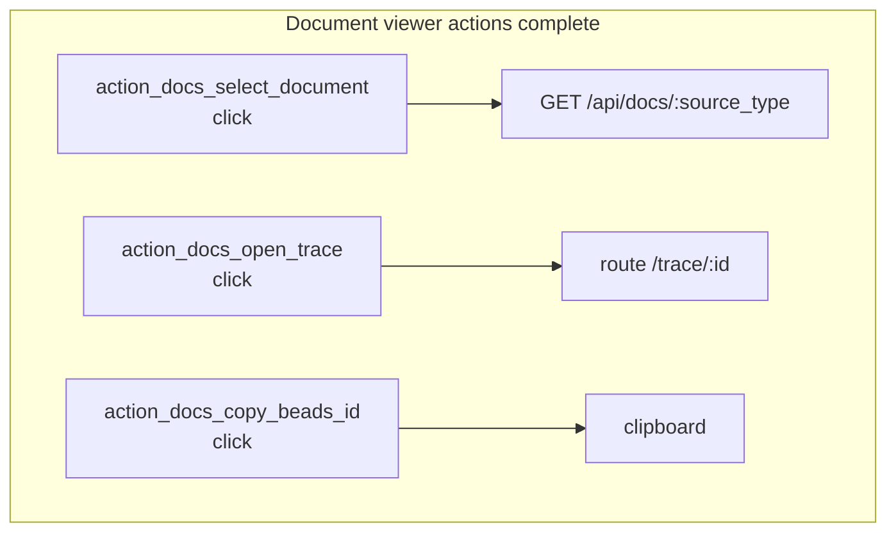

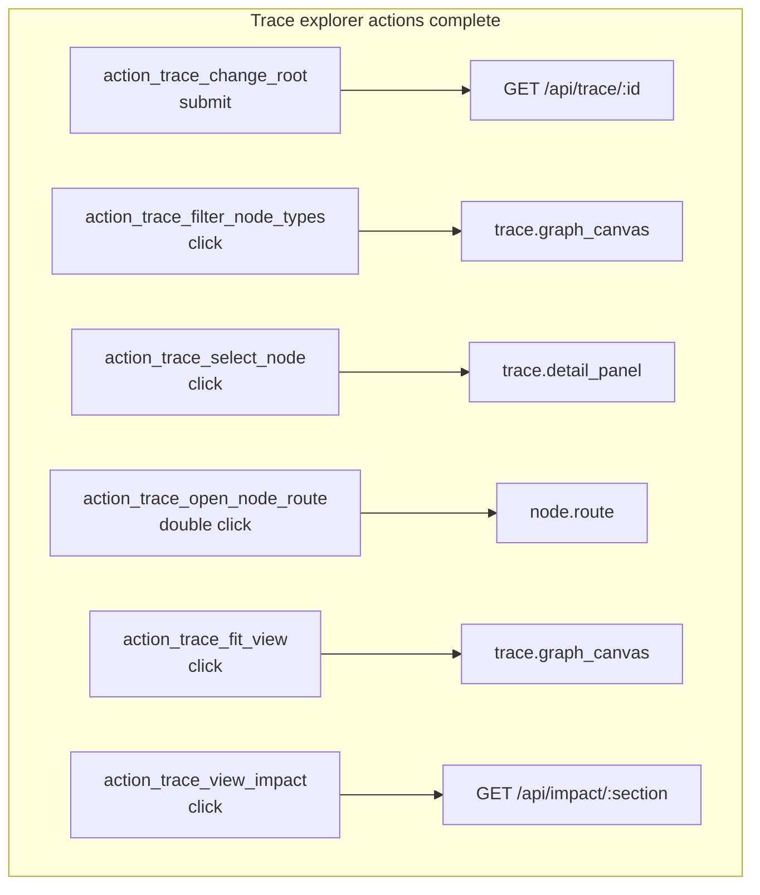

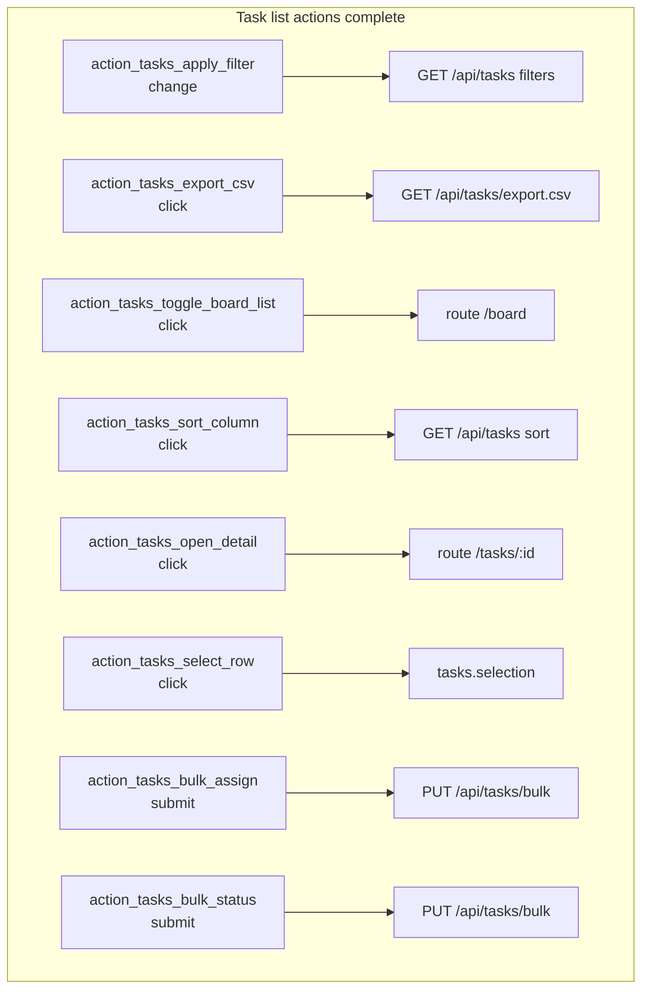

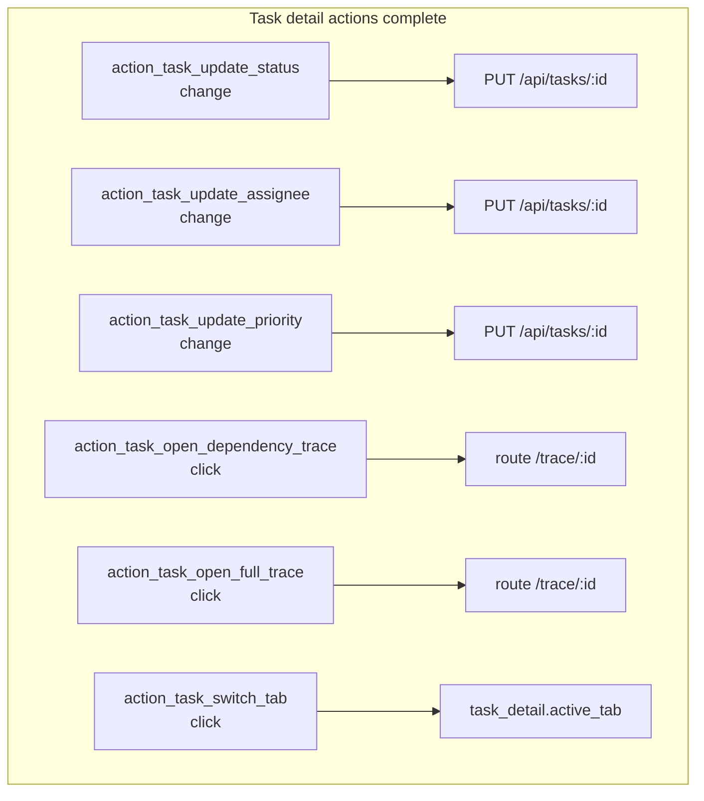

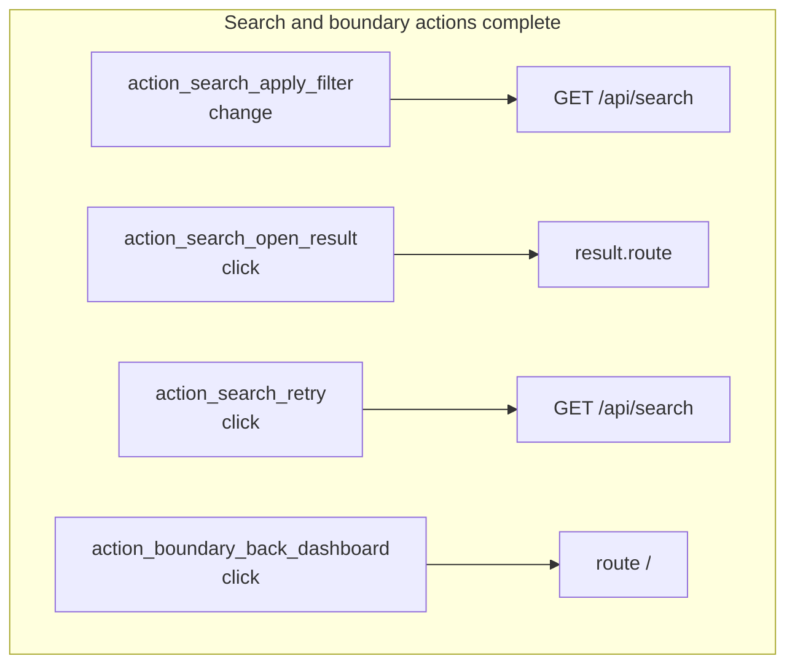

## Responsive layout intent by viewport

<!-- beads-id: br-design-webui-pm-review-diagrams-s5 -->

```mermaid
flowchart LR
    Desktop["Desktop 1440px\nexpanded sidebar\nmulti-column panels"]
    Tablet["Tablet 1024px\ncompact sidebar\ntwo-column or bottom sheet"]
    Mobile["Mobile 390px\nhamburger overlay\none-column and full-screen overlays"]

    Shell["Global shell\nds:webui.shell.sidebar"]
    Dashboard["Dashboard panels\nds:webui.dashboard.root"]
    Board["Board layout\nds:webui.board.root"]
    Graph["Graph detail panels\nds:webui.trace.detail_panel"]
    Approval["Approval actions\nds:webui.approval.approve_button"]
    Tasks["Task table\nds:webui.tasks.table"]
    Docs["Docs layout\nds:webui.docs.root"]
    Search["Search filters\nds:webui.search.filters"]

    Desktop --> ShellExpanded["240px sidebar with labels"]
    Tablet --> ShellCompact["60px icon rail with tooltips"]
    Mobile --> ShellOverlay["hidden sidebar plus overlay nav"]
    Shell --> ShellExpanded
    Shell --> ShellCompact
    Shell --> ShellOverlay

    Desktop --> DashDesktop["KPI row plus 2x2 grid"]
    Tablet --> DashTablet["KPI wrap plus two-row panels"]
    Mobile --> DashMobile["single-column cards and panels"]
    Dashboard --> DashDesktop
    Dashboard --> DashTablet
    Dashboard --> DashMobile

    Desktop --> BoardDesktop["horizontal Kanban plus PI sandbox"]
    Tablet --> BoardTablet["horizontal scroll condensed cards"]
    Mobile --> BoardMobile["vertical card list"]
    Board --> BoardDesktop
    Board --> BoardTablet
    Board --> BoardMobile

    Desktop --> GraphDesktop["70 percent canvas and 30 percent detail"]
    Tablet --> GraphTablet["bottom-sheet detail panel"]
    Mobile --> GraphMobile["tree view plus full-screen detail"]
    Graph --> GraphDesktop
    Graph --> GraphTablet
    Graph --> GraphMobile

    Desktop --> ApprovalDesktop["right-side evidence actions"]
    Tablet --> ApprovalTablet["stacked evidence plus sticky bar"]
    Mobile --> ApprovalMobile["single-column cards plus sticky bar"]
    Approval --> ApprovalDesktop
    Approval --> ApprovalTablet
    Approval --> ApprovalMobile

    Desktop --> TasksDesktop["full table and sticky bulk bar"]
    Tablet --> TasksTablet["condensed expandable rows"]
    Mobile --> TasksMobile["task cards replace table"]
    Tasks --> TasksDesktop
    Tasks --> TasksTablet
    Tasks --> TasksMobile

    Desktop --> DocsDesktop["280px doc tree plus content"]
    Tablet --> DocsTablet["document selector above content"]
    Mobile --> DocsMobile["content first plus back to list"]
    Docs --> DocsDesktop
    Docs --> DocsTablet
    Docs --> DocsMobile

    Desktop --> SearchDesktop["240px filter sidebar plus grouped results"]
    Tablet --> SearchTablet["expandable top filter panel"]
    Mobile --> SearchMobile["filter dropdown and full-width results"]
    Search --> SearchDesktop
    Search --> SearchTablet
    Search --> SearchMobile
```
