<!-- beads-id: br-design-review-diagrams-webui-pm-workspace -->
# Stage 1 Review Diagrams: WebUI PM Workspace

Derived from `ui-contract.md` for Gate A review. Mermaid is embedded only in Markdown fences; no standalone `.mmd` or ASCII artifacts are used.

Coverage notes: all Core WebUI routes and PRD-04 §8.1A showcase routes are diagrammed, including terminal, portfolio, pi-planning, git-graph, kanban, knowledge-graph, approval, timeline, components, doc-viewer, explorer, beads-traversal, storyboard, and webui-pm-workspace.

## 1. Screen Inventory and Routes

```mermaid
flowchart LR
    Shell["Global Shell<br/>header search offline indicator sidebar footer<br/>ds:global_shell"]
    CoreGroup["Core WebUI routes<br/>gmind serve Go REST API"]
    ShowcaseGroup["Showcase routes<br/>apps website design-system"]
    Shell --> CoreGroup
    Shell --> ShowcaseGroup
    R0["screen:rtm-dashboard<br/>/<br/>ds:screen:rtm-dashboard-001"]
    CoreGroup --> R0
    R1["screen:safe-board<br/>/board<br/>ds:screen:safe-board-001"]
    CoreGroup --> R1
    R2["screen:task-list<br/>/tasks<br/>ds:screen:task-list-001"]
    CoreGroup --> R2
    R3["screen:task-detail<br/>/tasks/:id<br/>ds:screen:task-detail-001"]
    CoreGroup --> R3
    R4["screen:trace-explorer<br/>/trace/:id<br/>ds:screen:trace-explorer-001"]
    CoreGroup --> R4
    R5["screen:doc-viewer<br/>/docs<br/>ds:screen:core-doc-viewer-001"]
    CoreGroup --> R5
    R6["screen:approval-gates<br/>/approval<br/>ds:screen:approval-gates-001"]
    CoreGroup --> R6
    R7["screen:search-results<br/>/search<br/>ds:screen:search-results-001"]
    CoreGroup --> R7
    R8["screen:ds-terminal<br/>/design-system/terminal<br/>ds:screen:terminal-showcase-001<br/>PRD DS ds:screen:terminal-001"]
    ShowcaseGroup --> R8
    R9["screen:ds-portfolio<br/>/design-system/portfolio<br/>ds:screen:portfolio-showcase-001<br/>PRD DS br-ds-portfolio-view"]
    ShowcaseGroup --> R9
    R10["screen:ds-pi-planning<br/>/design-system/pi-planning<br/>ds:screen:pi-planning-showcase-001<br/>PRD DS br-ds-pi-planning"]
    ShowcaseGroup --> R10
    R11["screen:ds-git-graph<br/>/design-system/git-graph<br/>ds:screen:git-graph-showcase-001<br/>PRD DS ds:screen:git-graph-001"]
    ShowcaseGroup --> R11
    R12["screen:ds-kanban<br/>/design-system/kanban<br/>ds:screen:kanban-showcase-001<br/>PRD DS ds:screen:kanban-001"]
    ShowcaseGroup --> R12
    R13["screen:ds-knowledge-graph<br/>/design-system/knowledge-graph<br/>ds:screen:knowledge-graph-showcase-001<br/>PRD DS ds:screen:knowledge-graph-001"]
    ShowcaseGroup --> R13
    R14["screen:ds-approval<br/>/design-system/approval<br/>ds:screen:approval-showcase-001<br/>PRD DS ds:screen:approval-001"]
    ShowcaseGroup --> R14
    R15["screen:ds-timeline<br/>/design-system/timeline<br/>ds:screen:timeline-showcase-001<br/>PRD DS ds:screen:timeline-001"]
    ShowcaseGroup --> R15
    R16["screen:ds-components<br/>/design-system/components<br/>ds:screen:components-showcase-001<br/>PRD DS ds:screen:components-001"]
    ShowcaseGroup --> R16
    R17["screen:ds-doc-viewer<br/>/design-system/doc-viewer<br/>ds:screen:doc-viewer-showcase-001<br/>PRD DS ds:screen:doc-viewer-001"]
    ShowcaseGroup --> R17
    R18["screen:ds-explorer<br/>/design-system/explorer<br/>ds:screen:explorer-showcase-001<br/>PRD DS ds:screen:explorer-001"]
    ShowcaseGroup --> R18
    R19["screen:ds-beads-traversal<br/>/design-system/beads-traversal<br/>ds:screen:beads-traversal-showcase-001<br/>PRD DS ds:screen:beads-traversal-001"]
    ShowcaseGroup --> R19
    R20["screen:ds-storyboard<br/>/design-system/storyboard<br/>ds:screen:storyboard-showcase-001<br/>PRD DS ds:screen:storyboard-001"]
    ShowcaseGroup --> R20
    R21["screen:ds-storyboard-detail<br/>/design-system/storyboard/:id<br/>ds:screen:storyboard-detail-showcase-001<br/>PRD DS ds:screen:storyboard-001"]
    ShowcaseGroup --> R21
    R22["screen:ds-webui-pm-workspace<br/>/design-system/webui-pm-workspace<br/>ds:screen:webui-pm-workspace-showcase-001<br/>PRD DS ds:global_shell"]
    ShowcaseGroup --> R22
```

## 2. Per-Screen Component Hierarchy from YAML View Blueprint

### screen:rtm-dashboard — ds:screen:rtm-dashboard-001

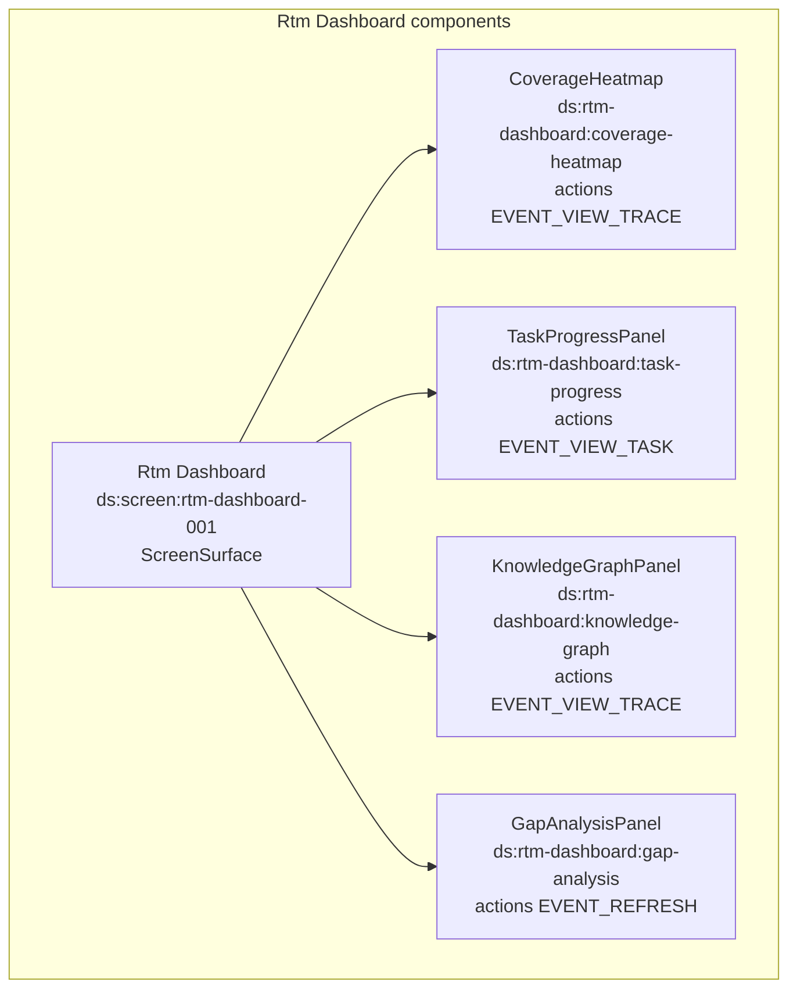
```mermaid
flowchart TD
    subgraph sg_screen_rtm_dashboard ["Rtm Dashboard components"]
        ds_screen_rtm_dashboard_001["Rtm Dashboard<br/>ds:screen:rtm-dashboard-001<br/>ScreenSurface"]
        ds_rtm_dashboard_coverage_heatmap["CoverageHeatmap<br/>ds:rtm-dashboard:coverage-heatmap<br/>actions EVENT_VIEW_TRACE"]
        ds_screen_rtm_dashboard_001 --> ds_rtm_dashboard_coverage_heatmap
        ds_rtm_dashboard_task_progress["TaskProgressPanel<br/>ds:rtm-dashboard:task-progress<br/>actions EVENT_VIEW_TASK"]
        ds_screen_rtm_dashboard_001 --> ds_rtm_dashboard_task_progress
        ds_rtm_dashboard_knowledge_graph["KnowledgeGraphPanel<br/>ds:rtm-dashboard:knowledge-graph<br/>actions EVENT_VIEW_TRACE"]
        ds_screen_rtm_dashboard_001 --> ds_rtm_dashboard_knowledge_graph
        ds_rtm_dashboard_gap_analysis["GapAnalysisPanel<br/>ds:rtm-dashboard:gap-analysis<br/>actions EVENT_REFRESH"]
        ds_screen_rtm_dashboard_001 --> ds_rtm_dashboard_gap_analysis
    end
```

### screen:safe-board — ds:screen:safe-board-001

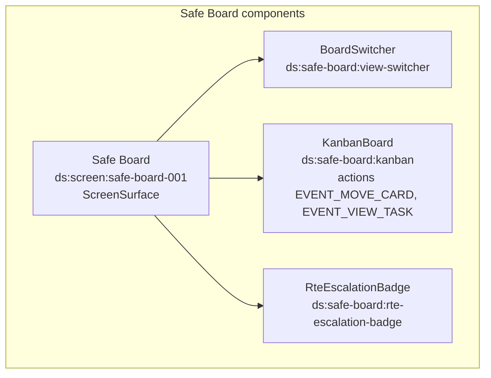
```mermaid
flowchart TD
    subgraph sg_screen_safe_board ["Safe Board components"]
        ds_screen_safe_board_001["Safe Board<br/>ds:screen:safe-board-001<br/>ScreenSurface"]
        ds_safe_board_view_switcher["BoardSwitcher<br/>ds:safe-board:view-switcher"]
        ds_screen_safe_board_001 --> ds_safe_board_view_switcher
        ds_safe_board_kanban["KanbanBoard<br/>ds:safe-board:kanban<br/>actions EVENT_MOVE_CARD, EVENT_VIEW_TASK"]
        ds_screen_safe_board_001 --> ds_safe_board_kanban
        ds_safe_board_rte_escalation_badge["RteEscalationBadge<br/>ds:safe-board:rte-escalation-badge"]
        ds_screen_safe_board_001 --> ds_safe_board_rte_escalation_badge
    end
```

### screen:task-list — ds:screen:task-list-001

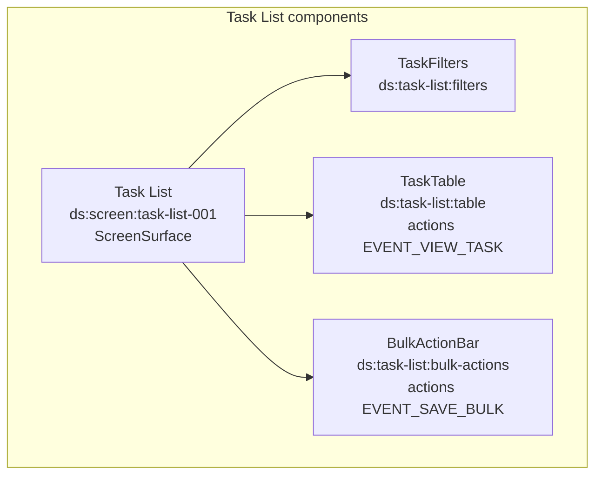
```mermaid
flowchart TD
    subgraph sg_screen_task_list ["Task List components"]
        ds_screen_task_list_001["Task List<br/>ds:screen:task-list-001<br/>ScreenSurface"]
        ds_task_list_filters["TaskFilters<br/>ds:task-list:filters"]
        ds_screen_task_list_001 --> ds_task_list_filters
        ds_task_list_table["TaskTable<br/>ds:task-list:table<br/>actions EVENT_VIEW_TASK"]
        ds_screen_task_list_001 --> ds_task_list_table
        ds_task_list_bulk_actions["BulkActionBar<br/>ds:task-list:bulk-actions<br/>actions EVENT_SAVE_BULK"]
        ds_screen_task_list_001 --> ds_task_list_bulk_actions
    end
```

### screen:task-detail — ds:screen:task-detail-001

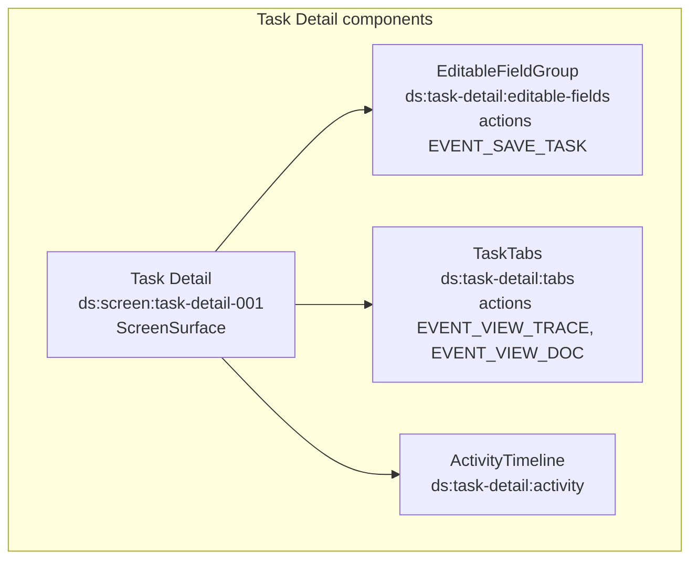
```mermaid
flowchart TD
    subgraph sg_screen_task_detail ["Task Detail components"]
        ds_screen_task_detail_001["Task Detail<br/>ds:screen:task-detail-001<br/>ScreenSurface"]
        ds_task_detail_editable_fields["EditableFieldGroup<br/>ds:task-detail:editable-fields<br/>actions EVENT_SAVE_TASK"]
        ds_screen_task_detail_001 --> ds_task_detail_editable_fields
        ds_task_detail_tabs["TaskTabs<br/>ds:task-detail:tabs<br/>actions EVENT_VIEW_TRACE, EVENT_VIEW_DOC"]
        ds_screen_task_detail_001 --> ds_task_detail_tabs
        ds_task_detail_activity["ActivityTimeline<br/>ds:task-detail:activity"]
        ds_screen_task_detail_001 --> ds_task_detail_activity
    end
```

### screen:trace-explorer — ds:screen:trace-explorer-001

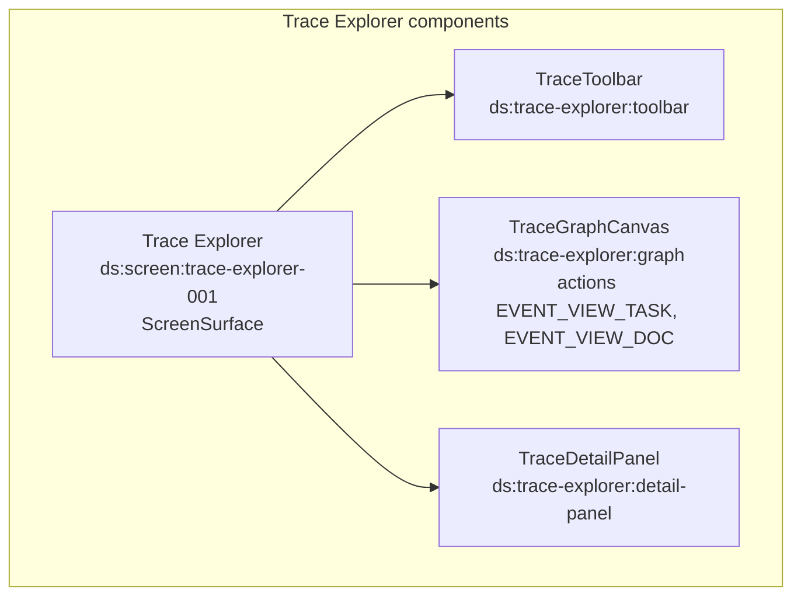
```mermaid
flowchart TD
    subgraph sg_screen_trace_explorer ["Trace Explorer components"]
        ds_screen_trace_explorer_001["Trace Explorer<br/>ds:screen:trace-explorer-001<br/>ScreenSurface"]
        ds_trace_explorer_toolbar["TraceToolbar<br/>ds:trace-explorer:toolbar"]
        ds_screen_trace_explorer_001 --> ds_trace_explorer_toolbar
        ds_trace_explorer_graph["TraceGraphCanvas<br/>ds:trace-explorer:graph<br/>actions EVENT_VIEW_TASK, EVENT_VIEW_DOC"]
        ds_screen_trace_explorer_001 --> ds_trace_explorer_graph
        ds_trace_explorer_detail_panel["TraceDetailPanel<br/>ds:trace-explorer:detail-panel"]
        ds_screen_trace_explorer_001 --> ds_trace_explorer_detail_panel
    end
```

### screen:doc-viewer — ds:screen:core-doc-viewer-001

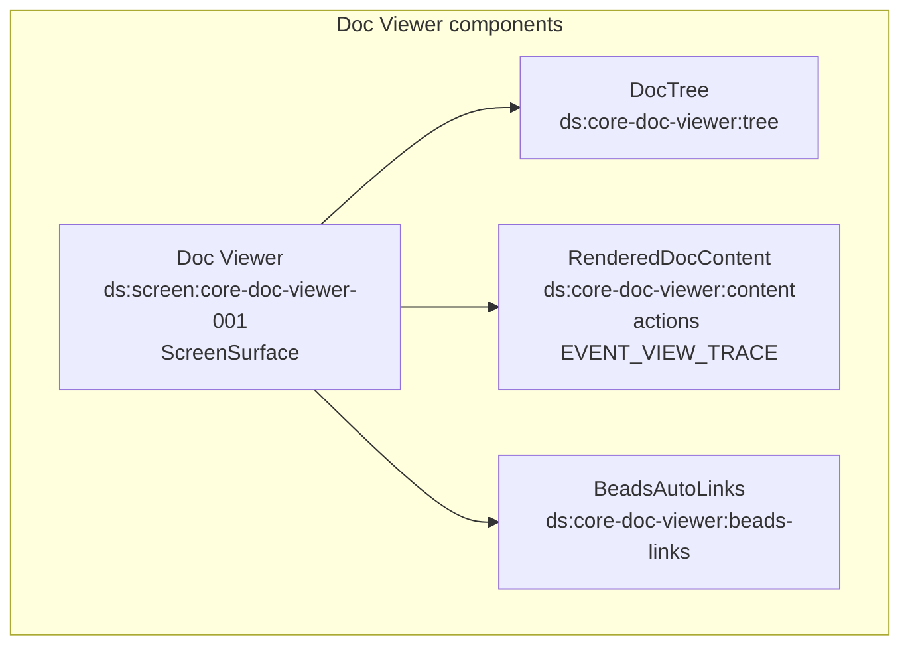
```mermaid
flowchart TD
    subgraph sg_screen_doc_viewer ["Doc Viewer components"]
        ds_screen_core_doc_viewer_001["Doc Viewer<br/>ds:screen:core-doc-viewer-001<br/>ScreenSurface"]
        ds_core_doc_viewer_tree["DocTree<br/>ds:core-doc-viewer:tree"]
        ds_screen_core_doc_viewer_001 --> ds_core_doc_viewer_tree
        ds_core_doc_viewer_content["RenderedDocContent<br/>ds:core-doc-viewer:content<br/>actions EVENT_VIEW_TRACE"]
        ds_screen_core_doc_viewer_001 --> ds_core_doc_viewer_content
        ds_core_doc_viewer_beads_links["BeadsAutoLinks<br/>ds:core-doc-viewer:beads-links"]
        ds_screen_core_doc_viewer_001 --> ds_core_doc_viewer_beads_links
    end
```

### screen:approval-gates — ds:screen:approval-gates-001

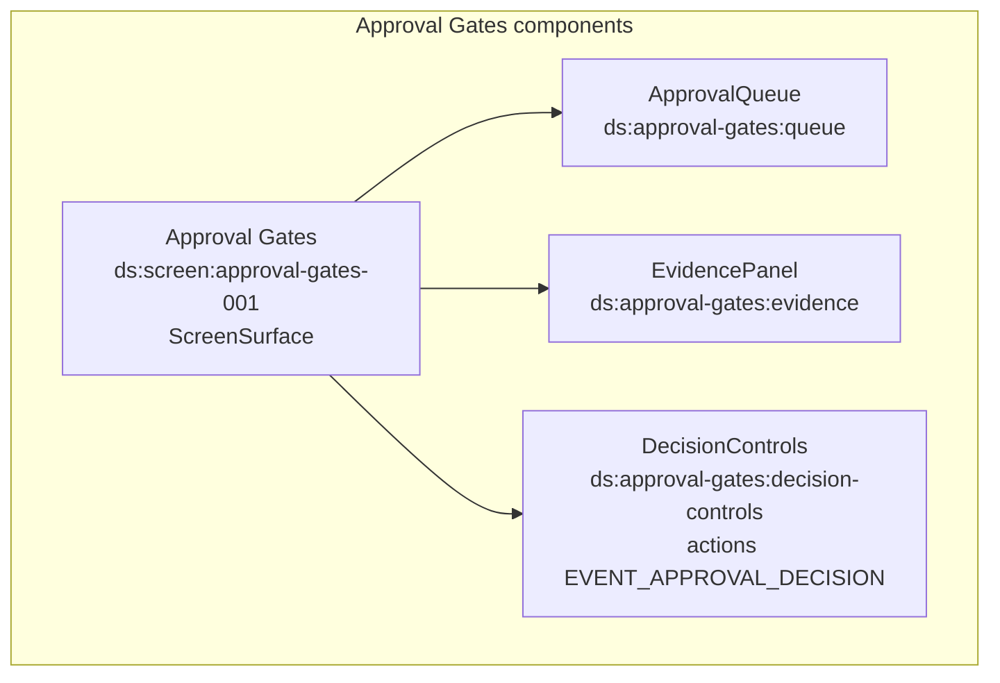
```mermaid
flowchart TD
    subgraph sg_screen_approval_gates ["Approval Gates components"]
        ds_screen_approval_gates_001["Approval Gates<br/>ds:screen:approval-gates-001<br/>ScreenSurface"]
        ds_approval_gates_queue["ApprovalQueue<br/>ds:approval-gates:queue"]
        ds_screen_approval_gates_001 --> ds_approval_gates_queue
        ds_approval_gates_evidence["EvidencePanel<br/>ds:approval-gates:evidence"]
        ds_screen_approval_gates_001 --> ds_approval_gates_evidence
        ds_approval_gates_decision_controls["DecisionControls<br/>ds:approval-gates:decision-controls<br/>actions EVENT_APPROVAL_DECISION"]
        ds_screen_approval_gates_001 --> ds_approval_gates_decision_controls
    end
```

### screen:search-results — ds:screen:search-results-001

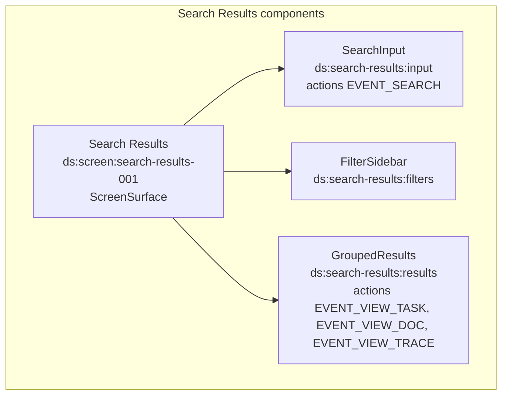
```mermaid
flowchart TD
    subgraph sg_screen_search_results ["Search Results components"]
        ds_screen_search_results_001["Search Results<br/>ds:screen:search-results-001<br/>ScreenSurface"]
        ds_search_results_input["SearchInput<br/>ds:search-results:input<br/>actions EVENT_SEARCH"]
        ds_screen_search_results_001 --> ds_search_results_input
        ds_search_results_filters["FilterSidebar<br/>ds:search-results:filters"]
        ds_screen_search_results_001 --> ds_search_results_filters
        ds_search_results_results["GroupedResults<br/>ds:search-results:results<br/>actions EVENT_VIEW_TASK, EVENT_VIEW_DOC, EVENT_VIEW_TRACE"]
        ds_screen_search_results_001 --> ds_search_results_results
    end
```

### screen:ds-terminal — ds:screen:terminal-showcase-001

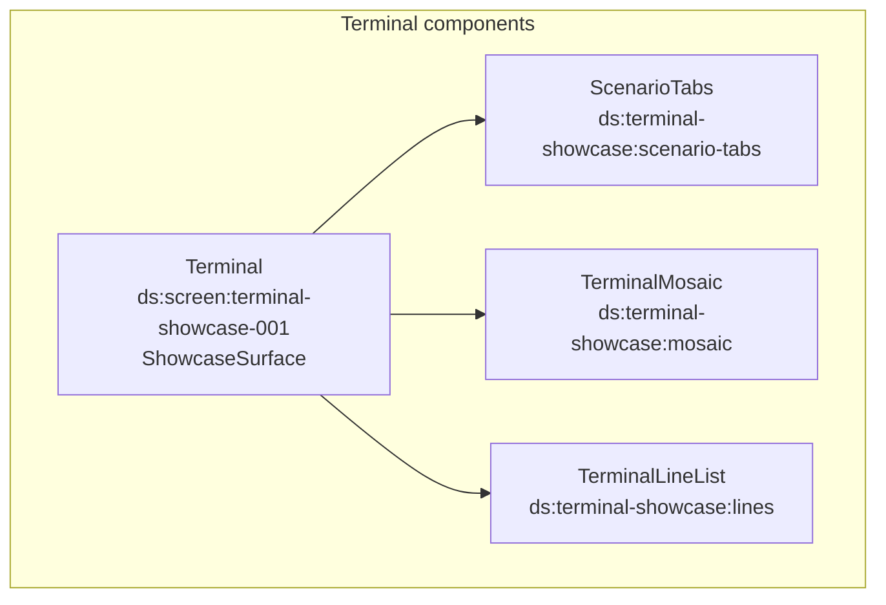
```mermaid
flowchart TD
    subgraph sg_screen_ds_terminal ["Terminal components"]
        ds_screen_terminal_showcase_001["Terminal<br/>ds:screen:terminal-showcase-001<br/>ShowcaseSurface"]
        ds_terminal_showcase_scenario_tabs["ScenarioTabs<br/>ds:terminal-showcase:scenario-tabs"]
        ds_screen_terminal_showcase_001 --> ds_terminal_showcase_scenario_tabs
        ds_terminal_showcase_mosaic["TerminalMosaic<br/>ds:terminal-showcase:mosaic"]
        ds_screen_terminal_showcase_001 --> ds_terminal_showcase_mosaic
        ds_terminal_showcase_lines["TerminalLineList<br/>ds:terminal-showcase:lines"]
        ds_screen_terminal_showcase_001 --> ds_terminal_showcase_lines
    end
```

### screen:ds-portfolio — ds:screen:portfolio-showcase-001

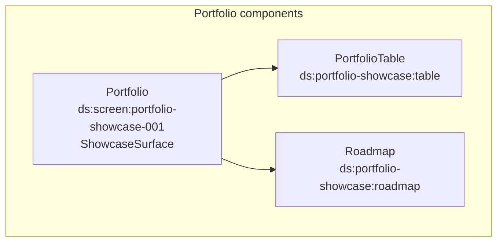
```mermaid
flowchart TD
    subgraph sg_screen_ds_portfolio ["Portfolio components"]
        ds_screen_portfolio_showcase_001["Portfolio<br/>ds:screen:portfolio-showcase-001<br/>ShowcaseSurface"]
        ds_portfolio_showcase_table["PortfolioTable<br/>ds:portfolio-showcase:table"]
        ds_screen_portfolio_showcase_001 --> ds_portfolio_showcase_table
        ds_portfolio_showcase_roadmap["Roadmap<br/>ds:portfolio-showcase:roadmap"]
        ds_screen_portfolio_showcase_001 --> ds_portfolio_showcase_roadmap
    end
```

### screen:ds-pi-planning — ds:screen:pi-planning-showcase-001

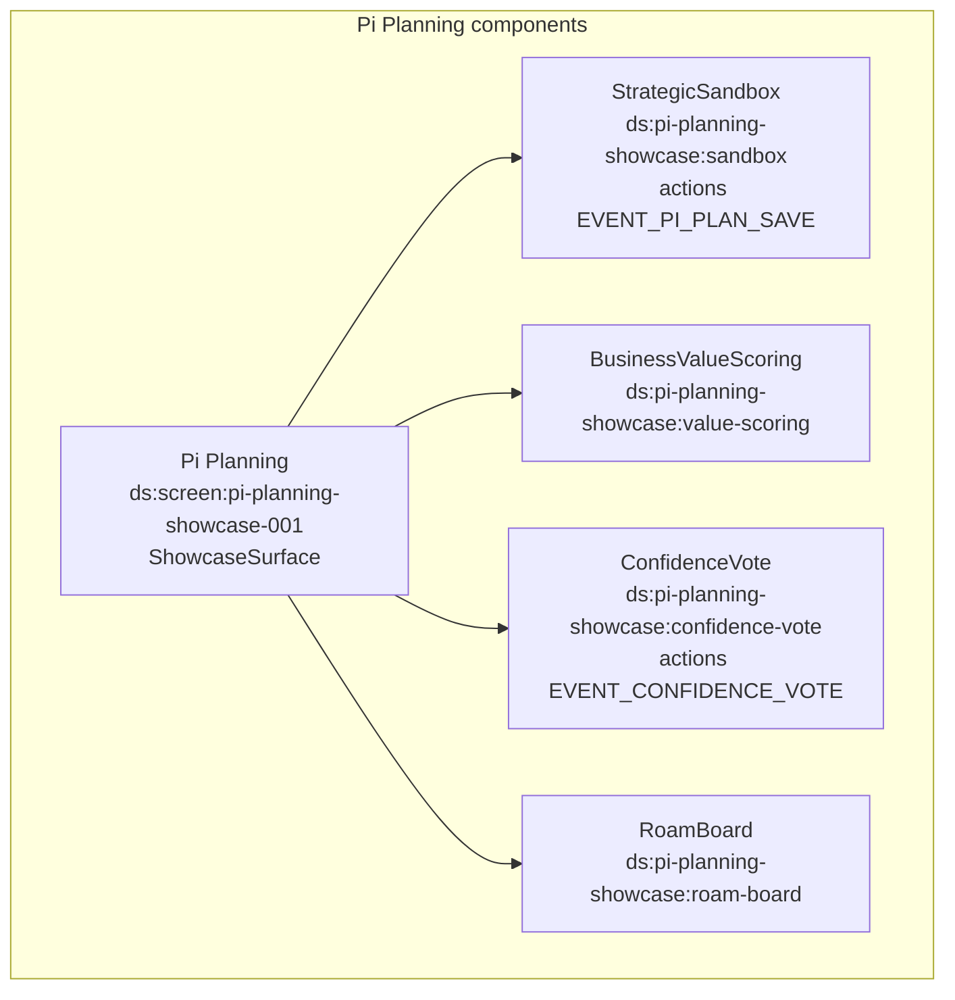
```mermaid
flowchart TD
    subgraph sg_screen_ds_pi_planning ["Pi Planning components"]
        ds_screen_pi_planning_showcase_001["Pi Planning<br/>ds:screen:pi-planning-showcase-001<br/>ShowcaseSurface"]
        ds_pi_planning_showcase_sandbox["StrategicSandbox<br/>ds:pi-planning-showcase:sandbox<br/>actions EVENT_PI_PLAN_SAVE"]
        ds_screen_pi_planning_showcase_001 --> ds_pi_planning_showcase_sandbox
        ds_pi_planning_showcase_value_scoring["BusinessValueScoring<br/>ds:pi-planning-showcase:value-scoring"]
        ds_screen_pi_planning_showcase_001 --> ds_pi_planning_showcase_value_scoring
        ds_pi_planning_showcase_confidence_vote["ConfidenceVote<br/>ds:pi-planning-showcase:confidence-vote<br/>actions EVENT_CONFIDENCE_VOTE"]
        ds_screen_pi_planning_showcase_001 --> ds_pi_planning_showcase_confidence_vote
        ds_pi_planning_showcase_roam_board["RoamBoard<br/>ds:pi-planning-showcase:roam-board"]
        ds_screen_pi_planning_showcase_001 --> ds_pi_planning_showcase_roam_board
    end
```

### screen:ds-git-graph — ds:screen:git-graph-showcase-001

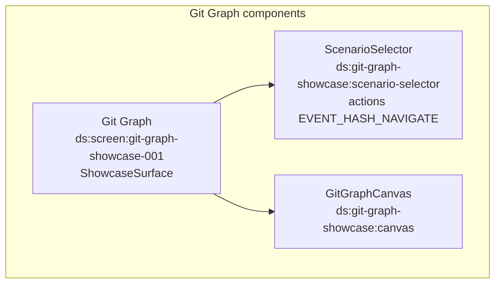
```mermaid
flowchart TD
    subgraph sg_screen_ds_git_graph ["Git Graph components"]
        ds_screen_git_graph_showcase_001["Git Graph<br/>ds:screen:git-graph-showcase-001<br/>ShowcaseSurface"]
        ds_git_graph_showcase_scenario_selector["ScenarioSelector<br/>ds:git-graph-showcase:scenario-selector<br/>actions EVENT_HASH_NAVIGATE"]
        ds_screen_git_graph_showcase_001 --> ds_git_graph_showcase_scenario_selector
        ds_git_graph_showcase_canvas["GitGraphCanvas<br/>ds:git-graph-showcase:canvas"]
        ds_screen_git_graph_showcase_001 --> ds_git_graph_showcase_canvas
    end
```

### screen:ds-kanban — ds:screen:kanban-showcase-001

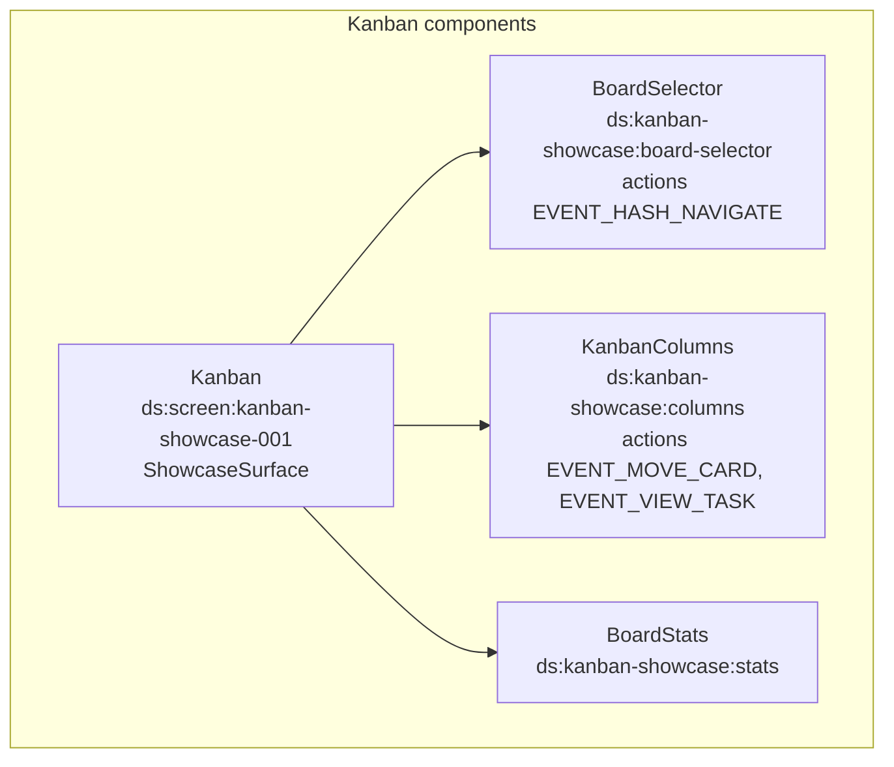
```mermaid
flowchart TD
    subgraph sg_screen_ds_kanban ["Kanban components"]
        ds_screen_kanban_showcase_001["Kanban<br/>ds:screen:kanban-showcase-001<br/>ShowcaseSurface"]
        ds_kanban_showcase_board_selector["BoardSelector<br/>ds:kanban-showcase:board-selector<br/>actions EVENT_HASH_NAVIGATE"]
        ds_screen_kanban_showcase_001 --> ds_kanban_showcase_board_selector
        ds_kanban_showcase_columns["KanbanColumns<br/>ds:kanban-showcase:columns<br/>actions EVENT_MOVE_CARD, EVENT_VIEW_TASK"]
        ds_screen_kanban_showcase_001 --> ds_kanban_showcase_columns
        ds_kanban_showcase_stats["BoardStats<br/>ds:kanban-showcase:stats"]
        ds_screen_kanban_showcase_001 --> ds_kanban_showcase_stats
    end
```

### screen:ds-knowledge-graph — ds:screen:knowledge-graph-showcase-001

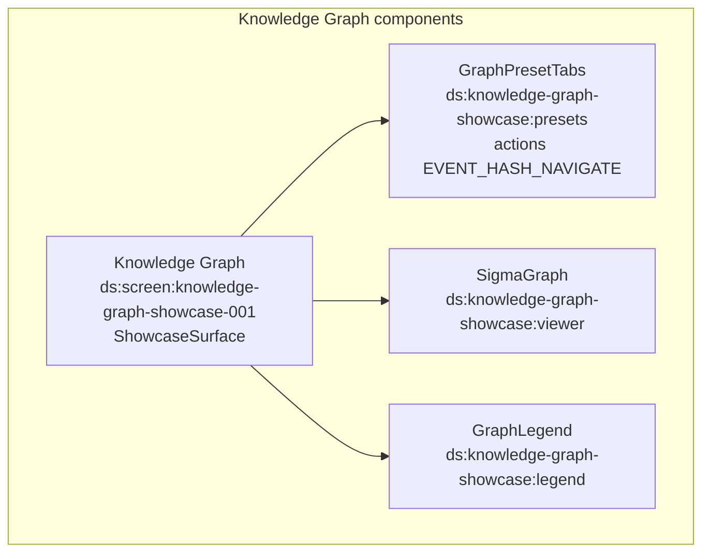
```mermaid
flowchart TD
    subgraph sg_screen_ds_knowledge_graph ["Knowledge Graph components"]
        ds_screen_knowledge_graph_showcase_001["Knowledge Graph<br/>ds:screen:knowledge-graph-showcase-001<br/>ShowcaseSurface"]
        ds_knowledge_graph_showcase_presets["GraphPresetTabs<br/>ds:knowledge-graph-showcase:presets<br/>actions EVENT_HASH_NAVIGATE"]
        ds_screen_knowledge_graph_showcase_001 --> ds_knowledge_graph_showcase_presets
        ds_knowledge_graph_showcase_viewer["SigmaGraph<br/>ds:knowledge-graph-showcase:viewer"]
        ds_screen_knowledge_graph_showcase_001 --> ds_knowledge_graph_showcase_viewer
        ds_knowledge_graph_showcase_legend["GraphLegend<br/>ds:knowledge-graph-showcase:legend"]
        ds_screen_knowledge_graph_showcase_001 --> ds_knowledge_graph_showcase_legend
    end
```

### screen:ds-approval — ds:screen:approval-showcase-001

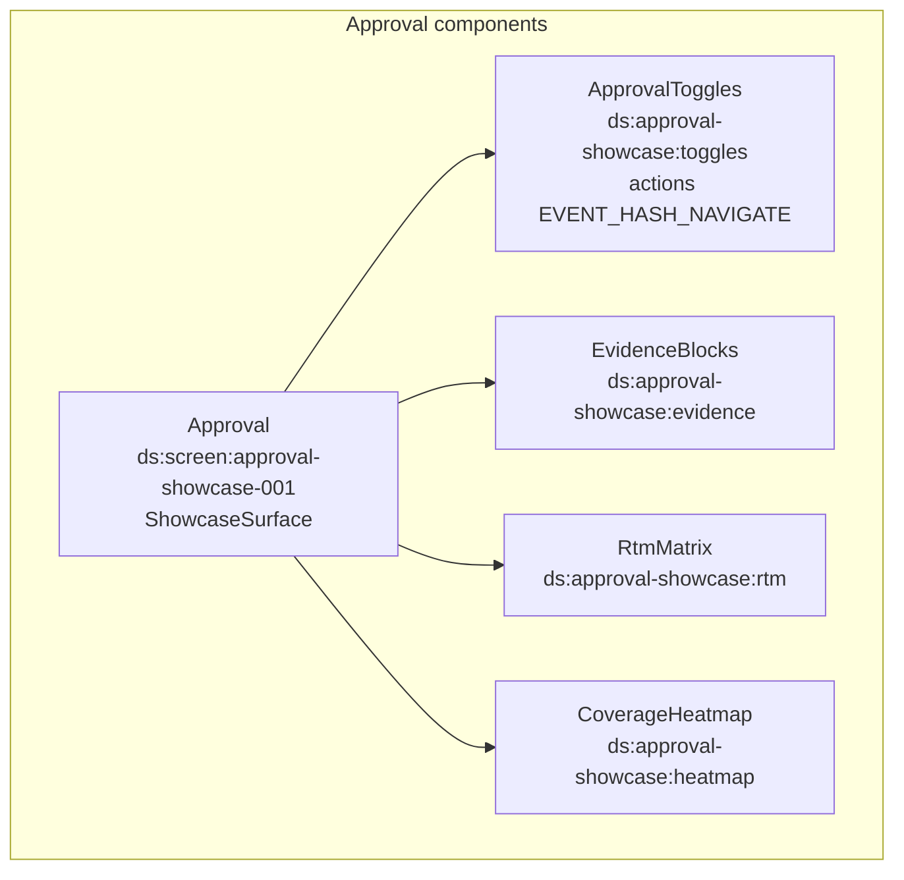
```mermaid
flowchart TD
    subgraph sg_screen_ds_approval ["Approval components"]
        ds_screen_approval_showcase_001["Approval<br/>ds:screen:approval-showcase-001<br/>ShowcaseSurface"]
        ds_approval_showcase_toggles["ApprovalToggles<br/>ds:approval-showcase:toggles<br/>actions EVENT_HASH_NAVIGATE"]
        ds_screen_approval_showcase_001 --> ds_approval_showcase_toggles
        ds_approval_showcase_evidence["EvidenceBlocks<br/>ds:approval-showcase:evidence"]
        ds_screen_approval_showcase_001 --> ds_approval_showcase_evidence
        ds_approval_showcase_rtm["RtmMatrix<br/>ds:approval-showcase:rtm"]
        ds_screen_approval_showcase_001 --> ds_approval_showcase_rtm
        ds_approval_showcase_heatmap["CoverageHeatmap<br/>ds:approval-showcase:heatmap"]
        ds_screen_approval_showcase_001 --> ds_approval_showcase_heatmap
    end
```

### screen:ds-timeline — ds:screen:timeline-showcase-001

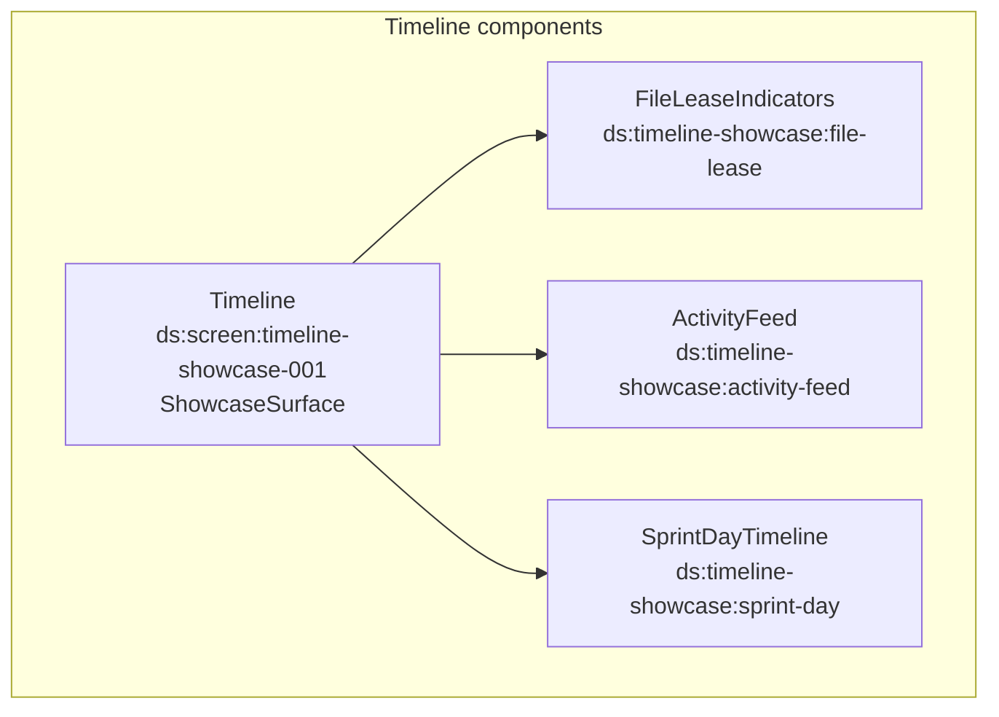
```mermaid
flowchart TD
    subgraph sg_screen_ds_timeline ["Timeline components"]
        ds_screen_timeline_showcase_001["Timeline<br/>ds:screen:timeline-showcase-001<br/>ShowcaseSurface"]
        ds_timeline_showcase_file_lease["FileLeaseIndicators<br/>ds:timeline-showcase:file-lease"]
        ds_screen_timeline_showcase_001 --> ds_timeline_showcase_file_lease
        ds_timeline_showcase_activity_feed["ActivityFeed<br/>ds:timeline-showcase:activity-feed"]
        ds_screen_timeline_showcase_001 --> ds_timeline_showcase_activity_feed
        ds_timeline_showcase_sprint_day["SprintDayTimeline<br/>ds:timeline-showcase:sprint-day"]
        ds_screen_timeline_showcase_001 --> ds_timeline_showcase_sprint_day
    end
```

### screen:ds-components — ds:screen:components-showcase-001

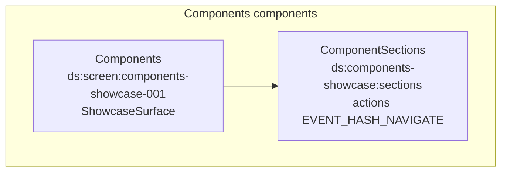
```mermaid
flowchart TD
    subgraph sg_screen_ds_components ["Components components"]
        ds_screen_components_showcase_001["Components<br/>ds:screen:components-showcase-001<br/>ShowcaseSurface"]
        ds_components_showcase_sections["ComponentSections<br/>ds:components-showcase:sections<br/>actions EVENT_HASH_NAVIGATE"]
        ds_screen_components_showcase_001 --> ds_components_showcase_sections
    end
```

### screen:ds-doc-viewer — ds:screen:doc-viewer-showcase-001

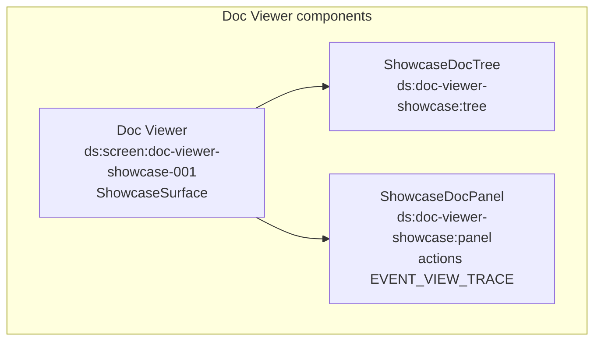
```mermaid
flowchart TD
    subgraph sg_screen_ds_doc_viewer ["Doc Viewer components"]
        ds_screen_doc_viewer_showcase_001["Doc Viewer<br/>ds:screen:doc-viewer-showcase-001<br/>ShowcaseSurface"]
        ds_doc_viewer_showcase_tree["ShowcaseDocTree<br/>ds:doc-viewer-showcase:tree"]
        ds_screen_doc_viewer_showcase_001 --> ds_doc_viewer_showcase_tree
        ds_doc_viewer_showcase_panel["ShowcaseDocPanel<br/>ds:doc-viewer-showcase:panel<br/>actions EVENT_VIEW_TRACE"]
        ds_screen_doc_viewer_showcase_001 --> ds_doc_viewer_showcase_panel
    end
```

### screen:ds-explorer — ds:screen:explorer-showcase-001

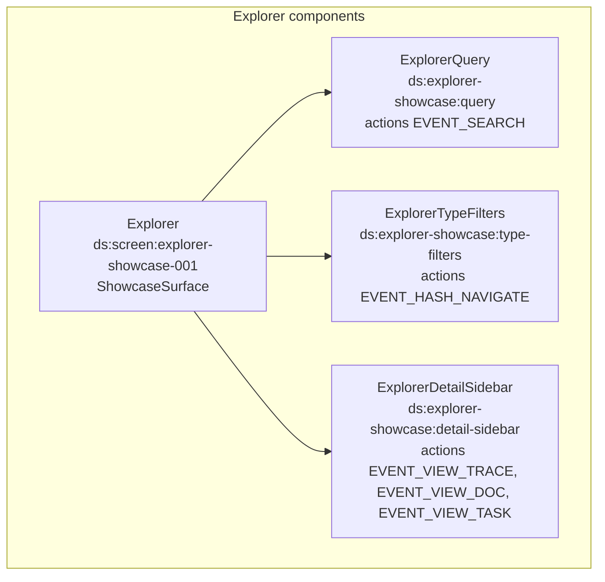
```mermaid
flowchart TD
    subgraph sg_screen_ds_explorer ["Explorer components"]
        ds_screen_explorer_showcase_001["Explorer<br/>ds:screen:explorer-showcase-001<br/>ShowcaseSurface"]
        ds_explorer_showcase_query["ExplorerQuery<br/>ds:explorer-showcase:query<br/>actions EVENT_SEARCH"]
        ds_screen_explorer_showcase_001 --> ds_explorer_showcase_query
        ds_explorer_showcase_type_filters["ExplorerTypeFilters<br/>ds:explorer-showcase:type-filters<br/>actions EVENT_HASH_NAVIGATE"]
        ds_screen_explorer_showcase_001 --> ds_explorer_showcase_type_filters
        ds_explorer_showcase_detail_sidebar["ExplorerDetailSidebar<br/>ds:explorer-showcase:detail-sidebar<br/>actions EVENT_VIEW_TRACE, EVENT_VIEW_DOC, EVENT_VIEW_TASK"]
        ds_screen_explorer_showcase_001 --> ds_explorer_showcase_detail_sidebar
    end
```

### screen:ds-beads-traversal — ds:screen:beads-traversal-showcase-001

```mermaid
flowchart TD
    subgraph sg_screen_ds_beads_traversal ["Beatraversal components"]
        ds_screen_beads_traversal_showcase_001["Beatraversal<br/>ds:screen:beads-traversal-showcase-001<br/>ShowcaseSurface"]
        ds_beads_traversal_showcase_layers["TraversalLayers<br/>ds:beads-traversal-showcase:layers"]
        ds_screen_beads_traversal_showcase_001 --> ds_beads_traversal_showcase_layers
        ds_beads_traversal_showcase_direction_toggle["DirectionToggle<br/>ds:beads-traversal-showcase:direction-toggle"]
        ds_screen_beads_traversal_showcase_001 --> ds_beads_traversal_showcase_direction_toggle
        ds_beads_traversal_showcase_detail_sidebar["TraversalDetailSidebar<br/>ds:beads-traversal-showcase:detail-sidebar"]
        ds_screen_beads_traversal_showcase_001 --> ds_beads_traversal_showcase_detail_sidebar
    end
```

### screen:ds-storyboard — ds:screen:storyboard-showcase-001

```mermaid
flowchart TD
    subgraph sg_screen_ds_storyboard ["Storyboard components"]
        ds_screen_storyboard_showcase_001["Storyboard<br/>ds:screen:storyboard-showcase-001<br/>ShowcaseSurface"]
        ds_storyboard_showcase_filter["JourneyFilter<br/>ds:storyboard-showcase:filter"]
        ds_screen_storyboard_showcase_001 --> ds_storyboard_showcase_filter
        ds_storyboard_showcase_flow["UsecaseFlow<br/>ds:storyboard-showcase:flow"]
        ds_screen_storyboard_showcase_001 --> ds_storyboard_showcase_flow
        ds_storyboard_showcase_guidance["GuidancePanel<br/>ds:storyboard-showcase:guidance"]
        ds_screen_storyboard_showcase_001 --> ds_storyboard_showcase_guidance
    end
```

### screen:ds-storyboard-detail — ds:screen:storyboard-detail-showcase-001

```mermaid
flowchart TD
    subgraph sg_screen_ds_storyboard_detail ["Storyboard Detail components"]
        ds_screen_storyboard_detail_showcase_001["Storyboard Detail<br/>ds:screen:storyboard-detail-showcase-001<br/>ShowcaseSurface"]
        ds_storyboard_detail_showcase_role["StoryboardRolePanel<br/>ds:storyboard-detail-showcase:role"]
        ds_screen_storyboard_detail_showcase_001 --> ds_storyboard_detail_showcase_role
        ds_storyboard_detail_showcase_steps["StepTimeline<br/>ds:storyboard-detail-showcase:steps"]
        ds_screen_storyboard_detail_showcase_001 --> ds_storyboard_detail_showcase_steps
        ds_storyboard_detail_showcase_related["RelatedUsecases<br/>ds:storyboard-detail-showcase:related"]
        ds_screen_storyboard_detail_showcase_001 --> ds_storyboard_detail_showcase_related
    end
```

### screen:ds-webui-pm-workspace — ds:screen:webui-pm-workspace-showcase-001

```mermaid
flowchart TD
    subgraph sg_screen_ds_webui_pm_workspace ["Webui Pm Workspace components"]
        ds_screen_webui_pm_workspace_showcase_001["Webui Pm Workspace<br/>ds:screen:webui-pm-workspace-showcase-001<br/>ShowcaseSurface"]
        ds_webui_pm_workspace_showcase_header["WorkspaceHeader<br/>ds:webui-pm-workspace-showcase:header<br/>actions EVENT_SEARCH, EVENT_DISCONNECT, EVENT_RECONNECT"]
        ds_screen_webui_pm_workspace_showcase_001 --> ds_webui_pm_workspace_showcase_header
        ds_webui_pm_workspace_showcase_sidebar_nav["WorkspaceSidebarNav<br/>ds:webui-pm-workspace-showcase:sidebar-nav<br/>actions EVENT_HASH_NAVIGATE, EVENT_VIEW_TASK, EVENT_VIEW_TRACE, EVENT_VIEW_DOC"]
        ds_screen_webui_pm_workspace_showcase_001 --> ds_webui_pm_workspace_showcase_sidebar_nav
        ds_webui_pm_workspace_showcase_boundary_actions["BoundaryActionBar<br/>ds:webui-pm-workspace-showcase:boundary-actions<br/>actions EVENT_BACK"]
        ds_screen_webui_pm_workspace_showcase_001 --> ds_webui_pm_workspace_showcase_boundary_actions
        ds_webui_pm_workspace_showcase_sync_conflict_banner["SyncConflictBanner<br/>ds:webui-pm-workspace-showcase:sync-conflict-banner<br/>actions EVENT_KEEP_LOCAL, EVENT_USE_SERVER"]
        ds_screen_webui_pm_workspace_showcase_001 --> ds_webui_pm_workspace_showcase_sync_conflict_banner
        ds_webui_pm_workspace_showcase_active_surface["WorkspaceSurface<br/>ds:webui-pm-workspace-showcase:active-surface"]
        ds_screen_webui_pm_workspace_showcase_001 --> ds_webui_pm_workspace_showcase_active_surface
    end
```

## 3. State Coverage per Screen

```mermaid
flowchart LR
    StateContract["Global state contracts<br/>default, loading, empty, error, offline, forbidden, partial, saving, not_found"]
    S_screen_rtm_dashboard["screen:rtm-dashboard<br/>/<br/>states: default, loading, empty, error, offline, forbidden"]
    StateContract --> S_screen_rtm_dashboard
    S_screen_safe_board["screen:safe-board<br/>/board<br/>states: default, loading, empty, error, offline, forbidden"]
    StateContract --> S_screen_safe_board
    S_screen_task_list["screen:task-list<br/>/tasks<br/>states: default, loading, empty, error, offline, forbidden, saving"]
    StateContract --> S_screen_task_list
    SavingState["optimistic write or queued edit"] --> S_screen_task_list
    S_screen_task_detail["screen:task-detail<br/>/tasks/:id<br/>states: default, loading, empty, error, offline, forbidden, saving, not_found"]
    StateContract --> S_screen_task_detail
    SavingState["optimistic write or queued edit"] --> S_screen_task_detail
    NotFoundState["missing entity recovery"] --> S_screen_task_detail
    S_screen_trace_explorer["screen:trace-explorer<br/>/trace/:id<br/>states: default, loading, empty, error, offline, forbidden, partial"]
    StateContract --> S_screen_trace_explorer
    PartialState["partial enrichment fallback"] --> S_screen_trace_explorer
    S_screen_doc_viewer["screen:doc-viewer<br/>/docs<br/>states: default, loading, empty, error, offline, forbidden"]
    StateContract --> S_screen_doc_viewer
    S_screen_approval_gates["screen:approval-gates<br/>/approval<br/>states: default, loading, empty, error, offline, forbidden"]
    StateContract --> S_screen_approval_gates
    S_screen_search_results["screen:search-results<br/>/search<br/>states: default, loading, empty, error, offline, forbidden"]
    StateContract --> S_screen_search_results
    S_screen_ds_terminal["screen:ds-terminal<br/>/design-system/terminal<br/>states: default, loading, empty, error, offline, forbidden"]
    StateContract --> S_screen_ds_terminal
    S_screen_ds_portfolio["screen:ds-portfolio<br/>/design-system/portfolio<br/>states: default, loading, empty, error, offline, forbidden"]
    StateContract --> S_screen_ds_portfolio
    S_screen_ds_pi_planning["screen:ds-pi-planning<br/>/design-system/pi-planning<br/>states: default, loading, empty, error, offline, forbidden"]
    StateContract --> S_screen_ds_pi_planning
    S_screen_ds_git_graph["screen:ds-git-graph<br/>/design-system/git-graph<br/>states: default, loading, empty, error, offline, forbidden"]
    StateContract --> S_screen_ds_git_graph
    S_screen_ds_kanban["screen:ds-kanban<br/>/design-system/kanban<br/>states: default, loading, empty, error, offline, forbidden"]
    StateContract --> S_screen_ds_kanban
    S_screen_ds_knowledge_graph["screen:ds-knowledge-graph<br/>/design-system/knowledge-graph<br/>states: default, loading, empty, error, offline, forbidden, partial"]
    StateContract --> S_screen_ds_knowledge_graph
    PartialState["partial enrichment fallback"] --> S_screen_ds_knowledge_graph
    S_screen_ds_approval["screen:ds-approval<br/>/design-system/approval<br/>states: default, loading, empty, error, offline, forbidden"]
    StateContract --> S_screen_ds_approval
    S_screen_ds_timeline["screen:ds-timeline<br/>/design-system/timeline<br/>states: default, loading, empty, error, offline, forbidden"]
    StateContract --> S_screen_ds_timeline
    S_screen_ds_components["screen:ds-components<br/>/design-system/components<br/>states: default, loading, empty, error, offline, forbidden"]
    StateContract --> S_screen_ds_components
    S_screen_ds_doc_viewer["screen:ds-doc-viewer<br/>/design-system/doc-viewer<br/>states: default, loading, empty, error, offline, forbidden"]
    StateContract --> S_screen_ds_doc_viewer
    S_screen_ds_explorer["screen:ds-explorer<br/>/design-system/explorer<br/>states: default, loading, empty, error, offline, forbidden"]
    StateContract --> S_screen_ds_explorer
    S_screen_ds_beads_traversal["screen:ds-beads-traversal<br/>/design-system/beads-traversal<br/>states: default, loading, empty, error, offline, forbidden"]
    StateContract --> S_screen_ds_beads_traversal
    S_screen_ds_storyboard["screen:ds-storyboard<br/>/design-system/storyboard<br/>states: default, loading, empty, error, offline, forbidden"]
    StateContract --> S_screen_ds_storyboard
    S_screen_ds_storyboard_detail["screen:ds-storyboard-detail<br/>/design-system/storyboard/:id<br/>states: default, loading, empty, error, offline, forbidden, not_found"]
    StateContract --> S_screen_ds_storyboard_detail
    NotFoundState["missing entity recovery"] --> S_screen_ds_storyboard_detail
    S_screen_ds_webui_pm_workspace["screen:ds-webui-pm-workspace<br/>/design-system/webui-pm-workspace<br/>states: default, loading, empty, error, offline, forbidden"]
    StateContract --> S_screen_ds_webui_pm_workspace
```

## 4. Action-to-Event Links

```mermaid
flowchart LR
    A_ds_action_disconnect["ds:action:disconnect<br/>Show offline read-only banner<br/>GET /api/health failure or stream disconnect"]
    E_EVENT_DISCONNECT(("EVENT_DISCONNECT"))
    A_ds_action_disconnect --> E_EVENT_DISCONNECT
    A_ds_action_reconnect["ds:action:reconnect<br/>Rehydrate queued edits<br/>POST /api/sync/rehydrate after health check recovery"]
    E_EVENT_RECONNECT(("EVENT_RECONNECT"))
    A_ds_action_reconnect --> E_EVENT_RECONNECT
    A_ds_action_save_task["ds:action:save-task<br/>Persist editable task fields<br/>PUT /api/tasks/:id"]
    E_EVENT_SAVE_TASK(("EVENT_SAVE_TASK"))
    A_ds_action_save_task --> E_EVENT_SAVE_TASK
    A_ds_action_save_bulk["ds:action:save-bulk<br/>Persist selected task bulk updates<br/>PUT /api/tasks/bulk"]
    E_EVENT_SAVE_BULK(("EVENT_SAVE_BULK"))
    A_ds_action_save_bulk --> E_EVENT_SAVE_BULK
    A_ds_action_save_board["ds:action:save-board<br/>Persist kanban card movement<br/>PUT /api/tasks/:id/status"]
    E_EVENT_MOVE_CARD(("EVENT_MOVE_CARD"))
    A_ds_action_save_board --> E_EVENT_MOVE_CARD
    A_ds_action_approval_decision["ds:action:approval-decision<br/>Submit approval or rejection with audit reason<br/>POST /api/approval/:id/decision"]
    E_EVENT_APPROVAL_DECISION(("EVENT_APPROVAL_DECISION"))
    A_ds_action_approval_decision --> E_EVENT_APPROVAL_DECISION
```

```mermaid
flowchart LR
    A_ds_action_pi_plan_save["ds:action:pi-plan-save<br/>Save PI planning sandbox changes<br/>PUT /api/pi/plan"]
    E_EVENT_PI_PLAN_SAVE(("EVENT_PI_PLAN_SAVE"))
    A_ds_action_pi_plan_save --> E_EVENT_PI_PLAN_SAVE
    A_ds_action_confidence_vote["ds:action:confidence-vote<br/>Submit PI confidence vote<br/>POST /api/pi/confidence-vote"]
    E_EVENT_CONFIDENCE_VOTE(("EVENT_CONFIDENCE_VOTE"))
    A_ds_action_confidence_vote --> E_EVENT_CONFIDENCE_VOTE
    A_ds_action_view_doc["ds:action:view-doc<br/>Open document viewer<br/>GET /api/docs/:id"]
    E_EVENT_VIEW_DOC(("EVENT_VIEW_DOC"))
    A_ds_action_view_doc --> E_EVENT_VIEW_DOC
    A_ds_action_view_task["ds:action:view-task<br/>Open task detail<br/>GET /api/tasks/:id"]
    E_EVENT_VIEW_TASK(("EVENT_VIEW_TASK"))
    A_ds_action_view_task --> E_EVENT_VIEW_TASK
    A_ds_action_view_trace["ds:action:view-trace<br/>Open Beads trace explorer<br/>GET /api/trace/:id?depth=full"]
    E_EVENT_VIEW_TRACE(("EVENT_VIEW_TRACE"))
    A_ds_action_view_trace --> E_EVENT_VIEW_TRACE
    A_ds_action_search["ds:action:search<br/>Run global search<br/>GET /api/search?q=<query>&type=<type>"]
    E_EVENT_SEARCH(("EVENT_SEARCH"))
    A_ds_action_search --> E_EVENT_SEARCH
```

```mermaid
flowchart LR
    A_ds_action_hash_nav["ds:action:hash-nav<br/>Update same-route or cross-route showcase hash navigation<br/>browser hashchange plus route component state"]
    E_EVENT_HASH_NAVIGATE(("EVENT_HASH_NAVIGATE"))
    A_ds_action_hash_nav --> E_EVENT_HASH_NAVIGATE
    A_ds_action_refresh["ds:action:refresh<br/>Refresh route data after retry or evidence update<br/>route-specific GET endpoints"]
    E_EVENT_REFRESH(("EVENT_REFRESH"))
    A_ds_action_refresh --> E_EVENT_REFRESH
    A_ds_action_back["ds:action:back<br/>Return from boundary state to the last safe route<br/>client history back or route-safe fallback to core workspace route"]
    E_EVENT_BACK(("EVENT_BACK"))
    A_ds_action_back --> E_EVENT_BACK
    C_ds_webui_pm_workspace_showcase_boundary_actions["ds:webui-pm-workspace-showcase:boundary-actions"] --> A_ds_action_back
    A_ds_action_keep_local["ds:action:keep-local<br/>Keep queued local edits during sync conflict resolution<br/>POST /api/sync/conflicts/:id/resolve with resolution=keep_local"]
    E_EVENT_KEEP_LOCAL(("EVENT_KEEP_LOCAL"))
    A_ds_action_keep_local --> E_EVENT_KEEP_LOCAL
    C_ds_webui_pm_workspace_showcase_sync_conflict_banner["ds:webui-pm-workspace-showcase:sync-conflict-banner"] --> A_ds_action_keep_local
    A_ds_action_use_server["ds:action:use-server<br/>Replace queued local edits with the server version during sync conflict resolution<br/>POST /api/sync/conflicts/:id/resolve with resolution=use_server"]
    E_EVENT_USE_SERVER(("EVENT_USE_SERVER"))
    A_ds_action_use_server --> E_EVENT_USE_SERVER
    C_ds_webui_pm_workspace_showcase_sync_conflict_banner["ds:webui-pm-workspace-showcase:sync-conflict-banner"] --> A_ds_action_use_server
```

## 5. Responsive Layout Intent by Viewport

```mermaid
flowchart TD
    Routes["23 routed screens<br/>8 core + 15 showcase"]
    VP_desktop["desktop<br/>1440px<br/>persistent shell, expanded sidebar, multi-panel layouts"]
    Routes --> VP_desktop
    VP_tablet["tablet<br/>1024px<br/>condensed sidebar, stacked secondary panels, horizontal scroll where boards overflow"]
    Routes --> VP_tablet
    VP_mobile["mobile<br/>390px<br/>single-column flow, sidebar as overlay, drawers as full-screen overlays, tables become cards"]
    Routes --> VP_mobile
    Rule_ds_rule_shell_desktop["ds:rule:shell-desktop<br/>header, sidebar, footer, and main surface are visible together"]
    VP_desktop --> Rule_ds_rule_shell_desktop
    Rule_ds_rule_shell_tablet["ds:rule:shell-tablet<br/>navigation collapses to icon rail; detail panels become drawers or bottom sheets"]
    VP_tablet --> Rule_ds_rule_shell_tablet
    Rule_ds_rule_shell_mobile["ds:rule:shell-mobile<br/>hamburger opens overlay sidebar; graph-heavy views may render tree/list fallback"]
    VP_mobile --> Rule_ds_rule_shell_mobile
    Layout_screen_rtm_dashboard["screen:rtm-dashboard<br/>four-panel RTM dashboard with KPI row, coverage heatmap, task progress, knowledge graph, and gap analysis"]
    Routes --> Layout_screen_rtm_dashboard
    Layout_screen_safe_board["screen:safe-board<br/>portfolio, ART, and team kanban views with WIP and RTE escalation badges"]
    Routes --> Layout_screen_safe_board
    Layout_screen_task_list["screen:task-list<br/>sortable data table with filters, pagination, CSV export, and bulk action bar"]
    Routes --> Layout_screen_task_list
    Layout_screen_task_detail["screen:task-detail<br/>editable task header with Detail, Activity, Graph, and Code tabs"]
    Routes --> Layout_screen_task_detail
    Layout_screen_trace_explorer["screen:trace-explorer<br/>full-page graph canvas with toolbar, filters, legend, and detail panel"]
    Routes --> Layout_screen_trace_explorer
    Layout_screen_doc_viewer["screen:doc-viewer<br/>source-type document tree and rendered content panel"]
    Routes --> Layout_screen_doc_viewer
    Layout_screen_approval_gates["screen:approval-gates<br/>Level 3 approval workspace with queue, evidence, PRD context, and decision controls"]
    Routes --> Layout_screen_approval_gates
    Layout_screen_search_results["screen:search-results<br/>global search input, filter sidebar, grouped results, and instant suggestions"]
    Routes --> Layout_screen_search_results
    Layout_screen_ds_terminal["screen:ds-terminal<br/>scenario tabs with 2x2 terminal mosaic"]
    Routes --> Layout_screen_ds_terminal
    Layout_screen_ds_portfolio["screen:ds-portfolio<br/>executive portfolio table with roadmap quarters"]
    Routes --> Layout_screen_ds_portfolio
    Layout_screen_ds_pi_planning["screen:ds-pi-planning<br/>two-column PI planning sandbox, scoring, vote, and ROAM board"]
    Routes --> Layout_screen_ds_pi_planning
    Layout_screen_ds_git_graph["screen:ds-git-graph<br/>hash-selected git graph scenarios with branches, commits, connections, tags, and stats"]
    Routes --> Layout_screen_ds_git_graph
    Layout_screen_ds_kanban["screen:ds-kanban<br/>board selector with draggable cards, WIP badges, and board stats"]
    Routes --> Layout_screen_ds_kanban
    Layout_screen_ds_knowledge_graph["screen:ds-knowledge-graph<br/>client-only Sigma graph viewer with preset tabs, selected-node banner, legend, and stats"]
    Routes --> Layout_screen_ds_knowledge_graph
    Layout_screen_ds_approval["screen:ds-approval<br/>approval panels with status toggles, evidence blocks, RTM matrix, and coverage heatmap"]
    Routes --> Layout_screen_ds_approval
    Layout_screen_ds_timeline["screen:ds-timeline<br/>file lease indicators, activity feed, and sprint day timeline"]
    Routes --> Layout_screen_ds_timeline
    Layout_screen_ds_components["screen:ds-components<br/>catalog of 18 shared design-system sections with hash scroll and interactive examples"]
    Routes --> Layout_screen_ds_components
    Layout_screen_ds_doc_viewer["screen:ds-doc-viewer<br/>GitHub-like file tree with selected document panel and Beads badges"]
    Routes --> Layout_screen_ds_doc_viewer
    Layout_screen_ds_explorer["screen:ds-explorer<br/>unified search, type filters, result list, and detail sidebar"]
    Routes --> Layout_screen_ds_explorer
    Layout_screen_ds_beads_traversal["screen:ds-beads-traversal<br/>layered DAG from PRD sections to plan elements, tasks, and commits"]
    Routes --> Layout_screen_ds_beads_traversal
    Layout_screen_ds_storyboard["screen:ds-storyboard<br/>journey filter, horizontal use-case flow, guidance panel, and CTA to real screen"]
    Routes --> Layout_screen_ds_storyboard
    Layout_screen_ds_storyboard_detail["screen:ds-storyboard-detail<br/>dynamic storyboard detail with role, journey, step timeline, and related use cases"]
    Routes --> Layout_screen_ds_storyboard_detail
    Layout_screen_ds_webui_pm_workspace["screen:ds-webui-pm-workspace<br/>integrated shell with header logo, global search, offline indicator, sidebar navigation, and active PM surfaces"]
    Routes --> Layout_screen_ds_webui_pm_workspace
```

## 6. Source Logic Machine Event Coverage

```mermaid
stateDiagram-v2
    direction LR
    [*] --> RouteEntered
    RouteEntered --> Loading : ROUTE_ENTER
    Loading --> DefaultState : API_SUCCESS
    Loading --> EmptyState : API_EMPTY
    Loading --> ErrorState : API_ERROR
    Loading --> ForbiddenState : API_FORBIDDEN
    DefaultState --> OfflineState : EVENT_DISCONNECT
    OfflineState --> RehydratingState : EVENT_RECONNECT
    RehydratingState --> DefaultState : API_SYNC_SUCCESS
    RehydratingState --> ConflictResolution : API_CONFLICT
    ConflictResolution --> RehydratingState : EVENT_KEEP_LOCAL
    ConflictResolution --> RehydratingState : EVENT_USE_SERVER
    DefaultState --> SavingState : EVENT_SAVE_TASK
    DefaultState --> SavingState : EVENT_SAVE_BULK
    DefaultState --> SavingState : EVENT_MOVE_CARD
    DefaultState --> ApprovalDecision : EVENT_APPROVAL_DECISION
    DefaultState --> PiPlanningSave : EVENT_PI_PLAN_SAVE
    DefaultState --> PiPlanningVote : EVENT_CONFIDENCE_VOTE
    DefaultState --> SearchResults : EVENT_SEARCH
    DefaultState --> TraceExplorer : EVENT_VIEW_TRACE
    DefaultState --> TaskDetail : EVENT_VIEW_TASK
    DefaultState --> DocViewer : EVENT_VIEW_DOC
    DefaultState --> DefaultState : EVENT_HASH_NAVIGATE
    ErrorState --> RouteEntered : EVENT_REFRESH
    ForbiddenState --> RouteEntered : EVENT_BACK
```

