<!-- beads-id: br-design-review-diagrams-webui-pm-workspace -->
# Stage 1 Review Diagrams: WebUI PM Workspace

Derived from `ui-contract.md` for Gate A review. Mermaid is embedded only in Markdown fences; no standalone `.mmd` or ASCII artifacts are used.

Coverage notes: all requested showcase route families are diagrammed: terminal, portfolio, pi-planning, git-graph, kanban/board, knowledge-graph, approval, timeline, components, doc-viewer, explorer/search, beads-traversal/trace, storyboard overview/detail, and webui-pm-workspace shell.

## 1. Screen Inventory and Routes

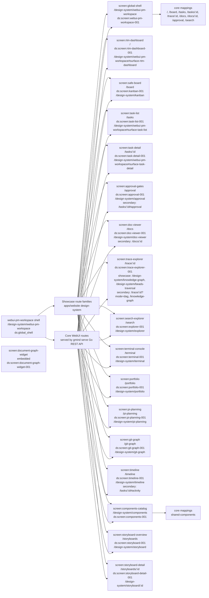
```mermaid
flowchart LR
    Shell["webui-pm-workspace shell<br/>/design-system/webui-pm-workspace<br/>ds:global_shell"]
    Core["Core WebUI routes<br/>served by gmind serve Go REST API"]
    Showcase["Showcase route families<br/>apps/website design-system"]
    Shell --> Core
    Shell --> Showcase
    R0["screen:global-shell<br/>/design-system/webui-pm-workspace<br/>ds:screen:webui-pm-workspace-001"]
    Showcase --> R0
    Core --> R0
    CR0["core mappings<br/>/, /board, /tasks, /tasks/:id, /trace/:id, /docs, /docs/:id, /approval, /search"]
    R0 --> CR0
    R1["screen:rtm-dashboard<br/>/<br/>ds:screen:rtm-dashboard-001<br/>/design-system/webui-pm-workspace#surface-rtm-dashboard"]
    Showcase --> R1
    Core --> R1
    R2["screen:safe-board<br/>/board<br/>ds:screen:kanban-001<br/>/design-system/kanban"]
    Showcase --> R2
    Core --> R2
    R3["screen:task-list<br/>/tasks<br/>ds:screen:task-list-001<br/>/design-system/webui-pm-workspace#surface-task-list"]
    Showcase --> R3
    Core --> R3
    R4["screen:task-detail<br/>/tasks/:id<br/>ds:screen:task-detail-001<br/>/design-system/webui-pm-workspace#surface-task-detail"]
    Showcase --> R4
    Core --> R4
    R5["screen:approval-gates<br/>/approval<br/>ds:screen:approval-001<br/>/design-system/approval<br/>secondary: /tasks/:id#approval"]
    Showcase --> R5
    Core --> R5
    R6["screen:doc-viewer<br/>/docs<br/>ds:screen:doc-viewer-001<br/>/design-system/doc-viewer<br/>secondary: /docs/:id"]
    Showcase --> R6
    Core --> R6
    R7["screen:trace-explorer<br/>/trace/:id<br/>ds:screen:trace-explorer-001<br/>showcase: /design-system/knowledge-graph, /design-system/beads-traversal<br/>secondary: /trace/:id?mode=dag, /knowledge-graph"]
    Showcase --> R7
    Core --> R7
    R8["screen:search-explorer<br/>/search<br/>ds:screen:explorer-001<br/>/design-system/explorer"]
    Showcase --> R8
    Core --> R8
    R9["screen:terminal-console<br/>/terminal<br/>ds:screen:terminal-001<br/>/design-system/terminal"]
    Showcase --> R9
    Core --> R9
    R10["screen:portfolio<br/>/portfolio<br/>ds:screen:portfolio-001<br/>/design-system/portfolio"]
    Showcase --> R10
    Core --> R10
    R11["screen:pi-planning<br/>/pi-planning<br/>ds:screen:pi-planning-001<br/>/design-system/pi-planning"]
    Showcase --> R11
    Core --> R11
    R12["screen:git-graph<br/>/git-graph<br/>ds:screen:git-graph-001<br/>/design-system/git-graph"]
    Showcase --> R12
    Core --> R12
    R13["screen:timeline<br/>/timeline<br/>ds:screen:timeline-001<br/>/design-system/timeline<br/>secondary: /tasks/:id#activity"]
    Showcase --> R13
    Core --> R13
    R14["screen:components-catalog<br/>/design-system/components<br/>ds:screen:components-001"]
    Showcase --> R14
    Core --> R14
    CR14["core mappings<br/>shared-components"]
    R14 --> CR14
    R15["screen:storyboard-overview<br/>/storyboards<br/>ds:screen:storyboard-001<br/>/design-system/storyboard"]
    Showcase --> R15
    Core --> R15
    R16["screen:storyboard-detail<br/>/storyboards/:id<br/>ds:screen:storyboard-detail-001<br/>/design-system/storyboard/:id"]
    Showcase --> R16
    Core --> R16
    R17["screen:document-graph-widget<br/>embedded<br/>ds:screen:document-graph-widget-001"]
```

## 2. Per-Screen Component Hierarchy from YAML View Blueprint

### Component group 1
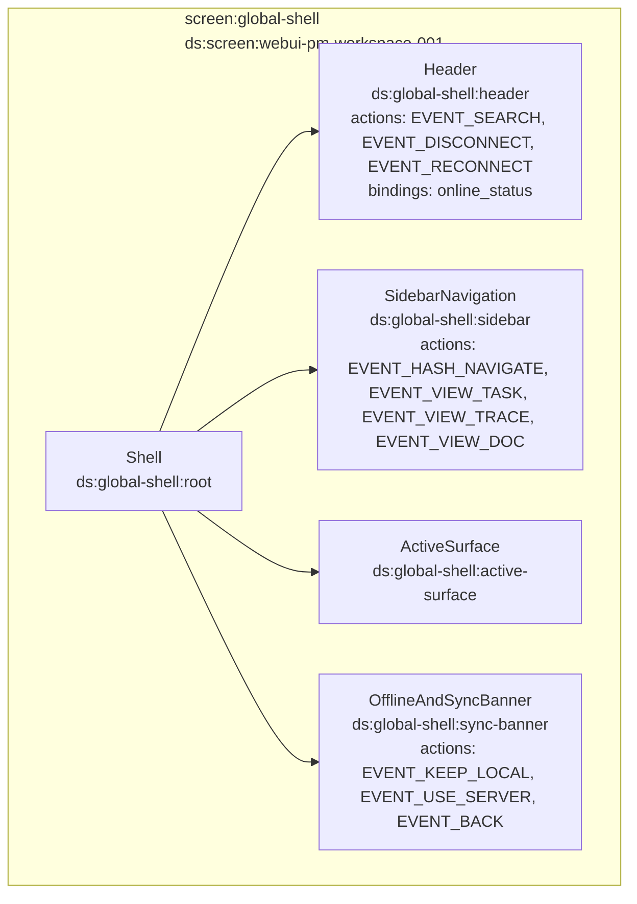
```mermaid
flowchart TD
    subgraph SG_screen_global_shell ["screen:global-shell<br/>ds:screen:webui-pm-workspace-001"]
        screen_global_shell_root["Shell<br/>ds:global-shell:root"]
        screen_global_shell_root_0["Header<br/>ds:global-shell:header<br/>actions: EVENT_SEARCH, EVENT_DISCONNECT, EVENT_RECONNECT<br/>bindings: online_status"]
        screen_global_shell_root --> screen_global_shell_root_0
        screen_global_shell_root_1["SidebarNavigation<br/>ds:global-shell:sidebar<br/>actions: EVENT_HASH_NAVIGATE, EVENT_VIEW_TASK, EVENT_VIEW_TRACE, EVENT_VIEW_DOC"]
        screen_global_shell_root --> screen_global_shell_root_1
        screen_global_shell_root_2["ActiveSurface<br/>ds:global-shell:active-surface"]
        screen_global_shell_root --> screen_global_shell_root_2
        screen_global_shell_root_3["OfflineAndSyncBanner<br/>ds:global-shell:sync-banner<br/>actions: EVENT_KEEP_LOCAL, EVENT_USE_SERVER, EVENT_BACK"]
        screen_global_shell_root --> screen_global_shell_root_3
    end
```

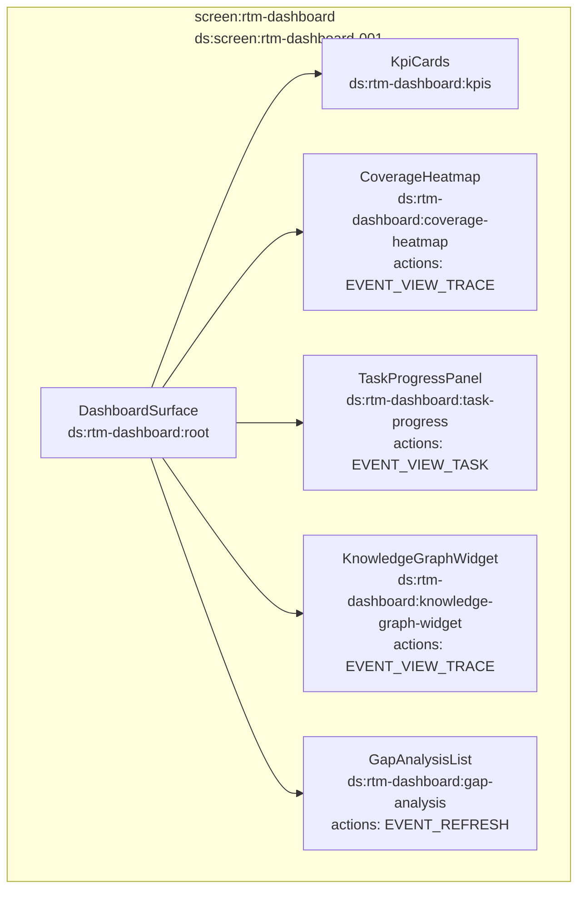
```mermaid
flowchart TD
    subgraph SG_screen_rtm_dashboard ["screen:rtm-dashboard<br/>ds:screen:rtm-dashboard-001"]
        screen_rtm_dashboard_root["DashboardSurface<br/>ds:rtm-dashboard:root"]
        screen_rtm_dashboard_root_0["KpiCards<br/>ds:rtm-dashboard:kpis"]
        screen_rtm_dashboard_root --> screen_rtm_dashboard_root_0
        screen_rtm_dashboard_root_1["CoverageHeatmap<br/>ds:rtm-dashboard:coverage-heatmap<br/>actions: EVENT_VIEW_TRACE"]
        screen_rtm_dashboard_root --> screen_rtm_dashboard_root_1
        screen_rtm_dashboard_root_2["TaskProgressPanel<br/>ds:rtm-dashboard:task-progress<br/>actions: EVENT_VIEW_TASK"]
        screen_rtm_dashboard_root --> screen_rtm_dashboard_root_2
        screen_rtm_dashboard_root_3["KnowledgeGraphWidget<br/>ds:rtm-dashboard:knowledge-graph-widget<br/>actions: EVENT_VIEW_TRACE"]
        screen_rtm_dashboard_root --> screen_rtm_dashboard_root_3
        screen_rtm_dashboard_root_4["GapAnalysisList<br/>ds:rtm-dashboard:gap-analysis<br/>actions: EVENT_REFRESH"]
        screen_rtm_dashboard_root --> screen_rtm_dashboard_root_4
    end
```

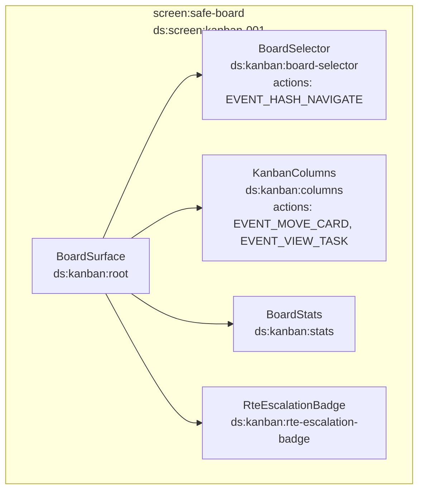
```mermaid
flowchart TD
    subgraph SG_screen_safe_board ["screen:safe-board<br/>ds:screen:kanban-001"]
        screen_safe_board_root["BoardSurface<br/>ds:kanban:root"]
        screen_safe_board_root_0["BoardSelector<br/>ds:kanban:board-selector<br/>actions: EVENT_HASH_NAVIGATE"]
        screen_safe_board_root --> screen_safe_board_root_0
        screen_safe_board_root_1["KanbanColumns<br/>ds:kanban:columns<br/>actions: EVENT_MOVE_CARD, EVENT_VIEW_TASK"]
        screen_safe_board_root --> screen_safe_board_root_1
        screen_safe_board_root_2["BoardStats<br/>ds:kanban:stats"]
        screen_safe_board_root --> screen_safe_board_root_2
        screen_safe_board_root_3["RteEscalationBadge<br/>ds:kanban:rte-escalation-badge"]
        screen_safe_board_root --> screen_safe_board_root_3
    end
```

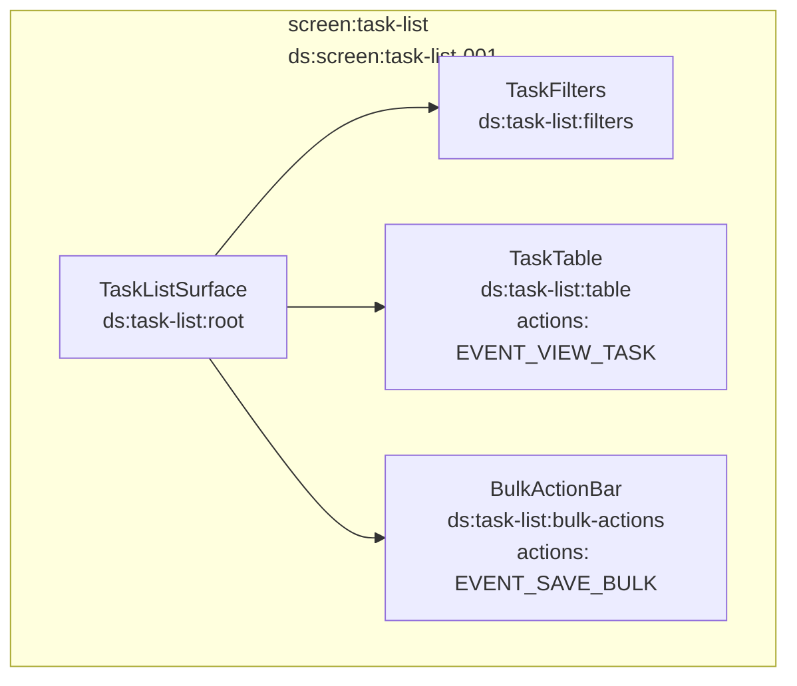
```mermaid
flowchart TD
    subgraph SG_screen_task_list ["screen:task-list<br/>ds:screen:task-list-001"]
        screen_task_list_root["TaskListSurface<br/>ds:task-list:root"]
        screen_task_list_root_0["TaskFilters<br/>ds:task-list:filters"]
        screen_task_list_root --> screen_task_list_root_0
        screen_task_list_root_1["TaskTable<br/>ds:task-list:table<br/>actions: EVENT_VIEW_TASK"]
        screen_task_list_root --> screen_task_list_root_1
        screen_task_list_root_2["BulkActionBar<br/>ds:task-list:bulk-actions<br/>actions: EVENT_SAVE_BULK"]
        screen_task_list_root --> screen_task_list_root_2
    end
```

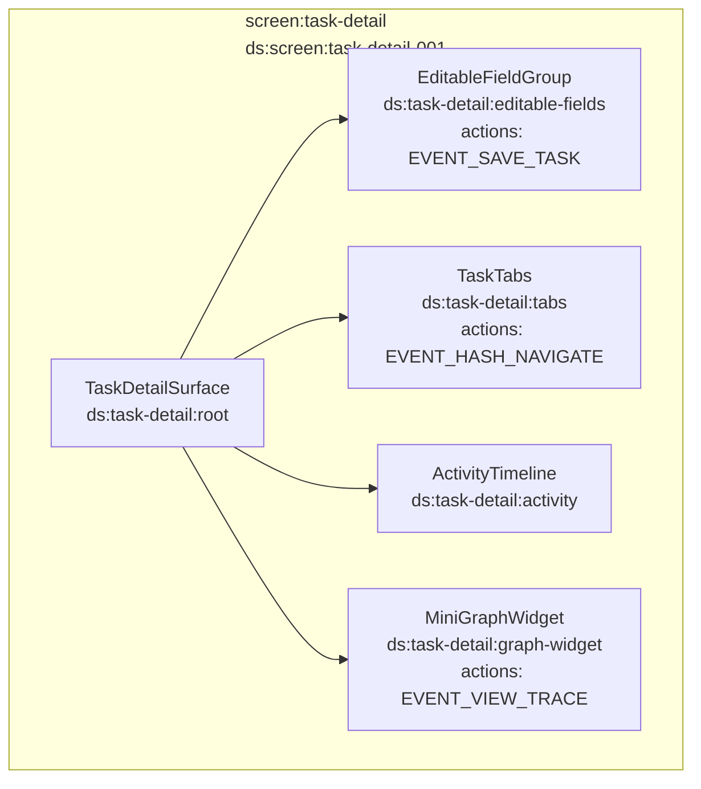
```mermaid
flowchart TD
    subgraph SG_screen_task_detail ["screen:task-detail<br/>ds:screen:task-detail-001"]
        screen_task_detail_root["TaskDetailSurface<br/>ds:task-detail:root"]
        screen_task_detail_root_0["EditableFieldGroup<br/>ds:task-detail:editable-fields<br/>actions: EVENT_SAVE_TASK"]
        screen_task_detail_root --> screen_task_detail_root_0
        screen_task_detail_root_1["TaskTabs<br/>ds:task-detail:tabs<br/>actions: EVENT_HASH_NAVIGATE"]
        screen_task_detail_root --> screen_task_detail_root_1
        screen_task_detail_root_2["ActivityTimeline<br/>ds:task-detail:activity"]
        screen_task_detail_root --> screen_task_detail_root_2
        screen_task_detail_root_3["MiniGraphWidget<br/>ds:task-detail:graph-widget<br/>actions: EVENT_VIEW_TRACE"]
        screen_task_detail_root --> screen_task_detail_root_3
    end
```

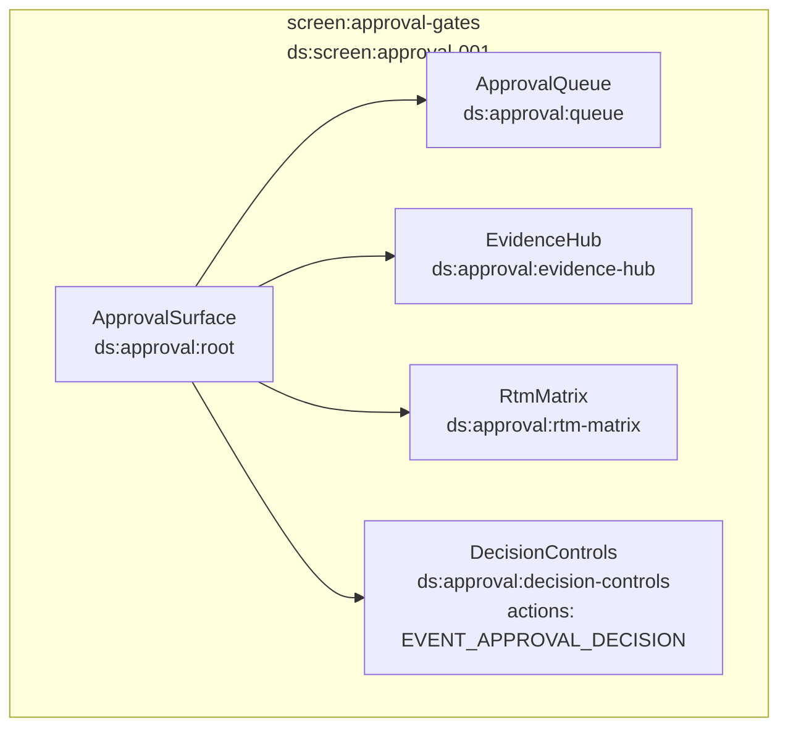
```mermaid
flowchart TD
    subgraph SG_screen_approval_gates ["screen:approval-gates<br/>ds:screen:approval-001"]
        screen_approval_gates_root["ApprovalSurface<br/>ds:approval:root"]
        screen_approval_gates_root_0["ApprovalQueue<br/>ds:approval:queue"]
        screen_approval_gates_root --> screen_approval_gates_root_0
        screen_approval_gates_root_1["EvidenceHub<br/>ds:approval:evidence-hub"]
        screen_approval_gates_root --> screen_approval_gates_root_1
        screen_approval_gates_root_2["RtmMatrix<br/>ds:approval:rtm-matrix"]
        screen_approval_gates_root --> screen_approval_gates_root_2
        screen_approval_gates_root_3["DecisionControls<br/>ds:approval:decision-controls<br/>actions: EVENT_APPROVAL_DECISION"]
        screen_approval_gates_root --> screen_approval_gates_root_3
    end
```

### Component group 2
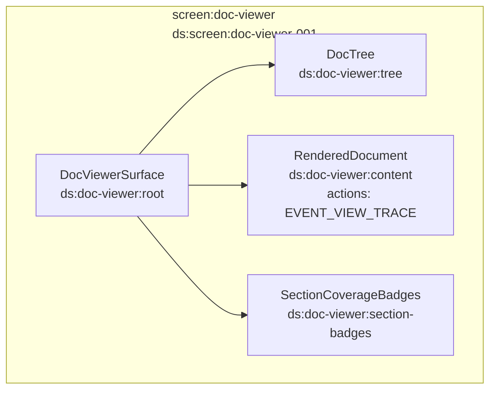
```mermaid
flowchart TD
    subgraph SG_screen_doc_viewer ["screen:doc-viewer<br/>ds:screen:doc-viewer-001"]
        screen_doc_viewer_root["DocViewerSurface<br/>ds:doc-viewer:root"]
        screen_doc_viewer_root_0["DocTree<br/>ds:doc-viewer:tree"]
        screen_doc_viewer_root --> screen_doc_viewer_root_0
        screen_doc_viewer_root_1["RenderedDocument<br/>ds:doc-viewer:content<br/>actions: EVENT_VIEW_TRACE"]
        screen_doc_viewer_root --> screen_doc_viewer_root_1
        screen_doc_viewer_root_2["SectionCoverageBadges<br/>ds:doc-viewer:section-badges"]
        screen_doc_viewer_root --> screen_doc_viewer_root_2
    end
```

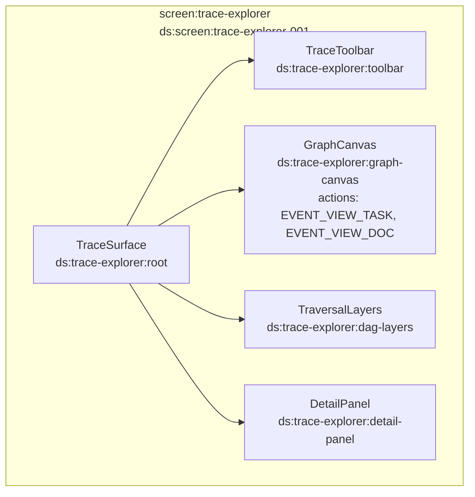
```mermaid
flowchart TD
    subgraph SG_screen_trace_explorer ["screen:trace-explorer<br/>ds:screen:trace-explorer-001"]
        screen_trace_explorer_root["TraceSurface<br/>ds:trace-explorer:root"]
        screen_trace_explorer_root_0["TraceToolbar<br/>ds:trace-explorer:toolbar"]
        screen_trace_explorer_root --> screen_trace_explorer_root_0
        screen_trace_explorer_root_1["GraphCanvas<br/>ds:trace-explorer:graph-canvas<br/>actions: EVENT_VIEW_TASK, EVENT_VIEW_DOC"]
        screen_trace_explorer_root --> screen_trace_explorer_root_1
        screen_trace_explorer_root_2["TraversalLayers<br/>ds:trace-explorer:dag-layers"]
        screen_trace_explorer_root --> screen_trace_explorer_root_2
        screen_trace_explorer_root_3["DetailPanel<br/>ds:trace-explorer:detail-panel"]
        screen_trace_explorer_root --> screen_trace_explorer_root_3
    end
```

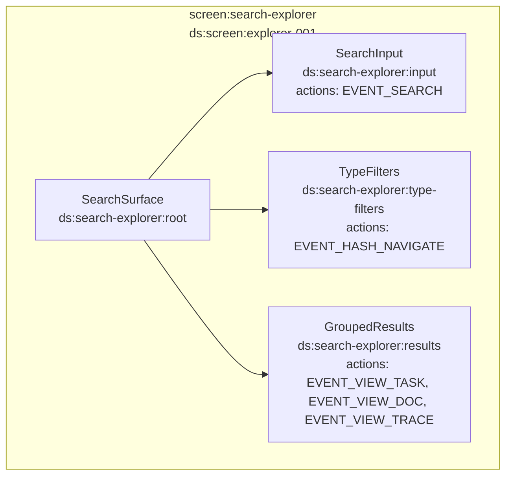
```mermaid
flowchart TD
    subgraph SG_screen_search_explorer ["screen:search-explorer<br/>ds:screen:explorer-001"]
        screen_search_explorer_root["SearchSurface<br/>ds:search-explorer:root"]
        screen_search_explorer_root_0["SearchInput<br/>ds:search-explorer:input<br/>actions: EVENT_SEARCH"]
        screen_search_explorer_root --> screen_search_explorer_root_0
        screen_search_explorer_root_1["TypeFilters<br/>ds:search-explorer:type-filters<br/>actions: EVENT_HASH_NAVIGATE"]
        screen_search_explorer_root --> screen_search_explorer_root_1
        screen_search_explorer_root_2["GroupedResults<br/>ds:search-explorer:results<br/>actions: EVENT_VIEW_TASK, EVENT_VIEW_DOC, EVENT_VIEW_TRACE"]
        screen_search_explorer_root --> screen_search_explorer_root_2
    end
```

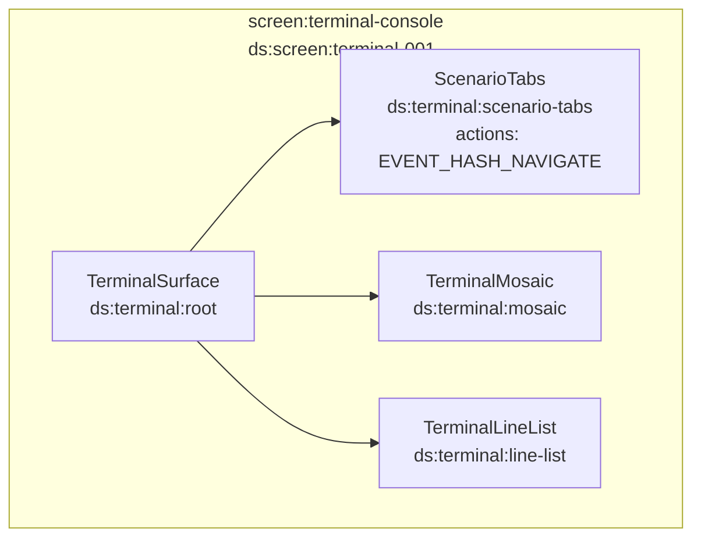
```mermaid
flowchart TD
    subgraph SG_screen_terminal_console ["screen:terminal-console<br/>ds:screen:terminal-001"]
        screen_terminal_console_root["TerminalSurface<br/>ds:terminal:root"]
        screen_terminal_console_root_0["ScenarioTabs<br/>ds:terminal:scenario-tabs<br/>actions: EVENT_HASH_NAVIGATE"]
        screen_terminal_console_root --> screen_terminal_console_root_0
        screen_terminal_console_root_1["TerminalMosaic<br/>ds:terminal:mosaic"]
        screen_terminal_console_root --> screen_terminal_console_root_1
        screen_terminal_console_root_2["TerminalLineList<br/>ds:terminal:line-list"]
        screen_terminal_console_root --> screen_terminal_console_root_2
    end
```

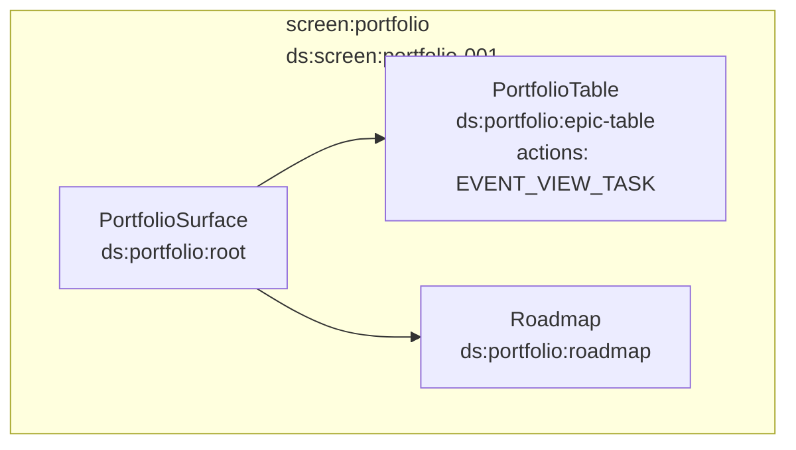
```mermaid
flowchart TD
    subgraph SG_screen_portfolio ["screen:portfolio<br/>ds:screen:portfolio-001"]
        screen_portfolio_root["PortfolioSurface<br/>ds:portfolio:root"]
        screen_portfolio_root_0["PortfolioTable<br/>ds:portfolio:epic-table<br/>actions: EVENT_VIEW_TASK"]
        screen_portfolio_root --> screen_portfolio_root_0
        screen_portfolio_root_1["Roadmap<br/>ds:portfolio:roadmap"]
        screen_portfolio_root --> screen_portfolio_root_1
    end
```

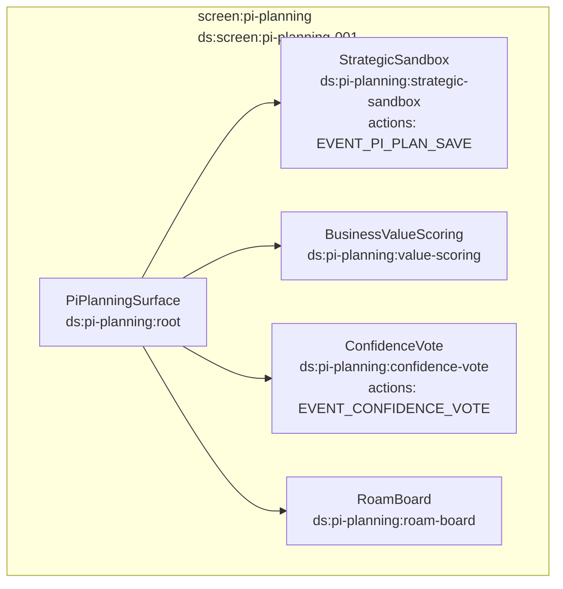
```mermaid
flowchart TD
    subgraph SG_screen_pi_planning ["screen:pi-planning<br/>ds:screen:pi-planning-001"]
        screen_pi_planning_root["PiPlanningSurface<br/>ds:pi-planning:root"]
        screen_pi_planning_root_0["StrategicSandbox<br/>ds:pi-planning:strategic-sandbox<br/>actions: EVENT_PI_PLAN_SAVE"]
        screen_pi_planning_root --> screen_pi_planning_root_0
        screen_pi_planning_root_1["BusinessValueScoring<br/>ds:pi-planning:value-scoring"]
        screen_pi_planning_root --> screen_pi_planning_root_1
        screen_pi_planning_root_2["ConfidenceVote<br/>ds:pi-planning:confidence-vote<br/>actions: EVENT_CONFIDENCE_VOTE"]
        screen_pi_planning_root --> screen_pi_planning_root_2
        screen_pi_planning_root_3["RoamBoard<br/>ds:pi-planning:roam-board"]
        screen_pi_planning_root --> screen_pi_planning_root_3
    end
```

### Component group 3
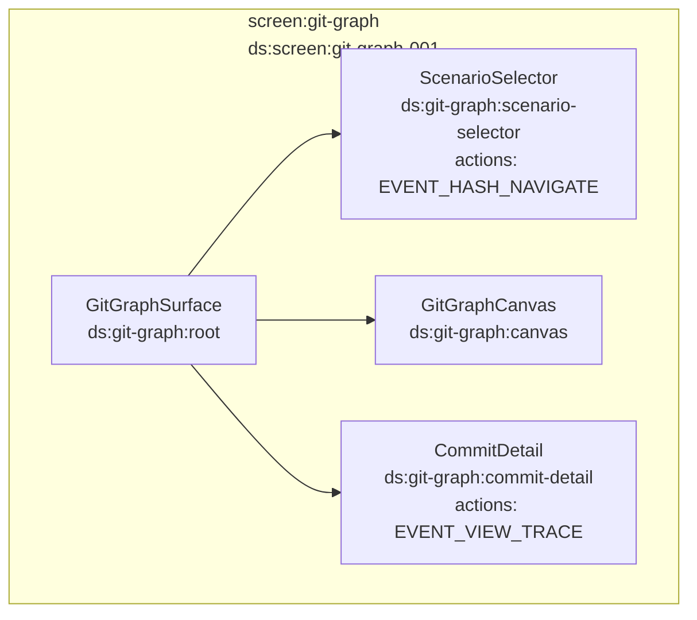
```mermaid
flowchart TD
    subgraph SG_screen_git_graph ["screen:git-graph<br/>ds:screen:git-graph-001"]
        screen_git_graph_root["GitGraphSurface<br/>ds:git-graph:root"]
        screen_git_graph_root_0["ScenarioSelector<br/>ds:git-graph:scenario-selector<br/>actions: EVENT_HASH_NAVIGATE"]
        screen_git_graph_root --> screen_git_graph_root_0
        screen_git_graph_root_1["GitGraphCanvas<br/>ds:git-graph:canvas"]
        screen_git_graph_root --> screen_git_graph_root_1
        screen_git_graph_root_2["CommitDetail<br/>ds:git-graph:commit-detail<br/>actions: EVENT_VIEW_TRACE"]
        screen_git_graph_root --> screen_git_graph_root_2
    end
```

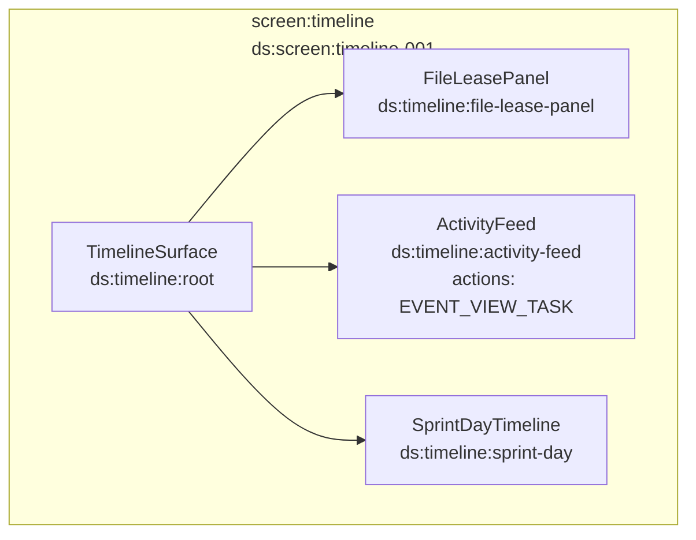
```mermaid
flowchart TD
    subgraph SG_screen_timeline ["screen:timeline<br/>ds:screen:timeline-001"]
        screen_timeline_root["TimelineSurface<br/>ds:timeline:root"]
        screen_timeline_root_0["FileLeasePanel<br/>ds:timeline:file-lease-panel"]
        screen_timeline_root --> screen_timeline_root_0
        screen_timeline_root_1["ActivityFeed<br/>ds:timeline:activity-feed<br/>actions: EVENT_VIEW_TASK"]
        screen_timeline_root --> screen_timeline_root_1
        screen_timeline_root_2["SprintDayTimeline<br/>ds:timeline:sprint-day"]
        screen_timeline_root --> screen_timeline_root_2
    end
```

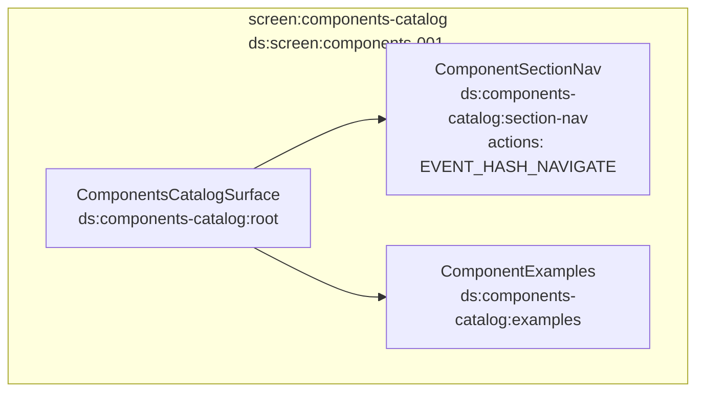
```mermaid
flowchart TD
    subgraph SG_screen_components_catalog ["screen:components-catalog<br/>ds:screen:components-001"]
        screen_components_catalog_root["ComponentsCatalogSurface<br/>ds:components-catalog:root"]
        screen_components_catalog_root_0["ComponentSectionNav<br/>ds:components-catalog:section-nav<br/>actions: EVENT_HASH_NAVIGATE"]
        screen_components_catalog_root --> screen_components_catalog_root_0
        screen_components_catalog_root_1["ComponentExamples<br/>ds:components-catalog:examples"]
        screen_components_catalog_root --> screen_components_catalog_root_1
    end
```

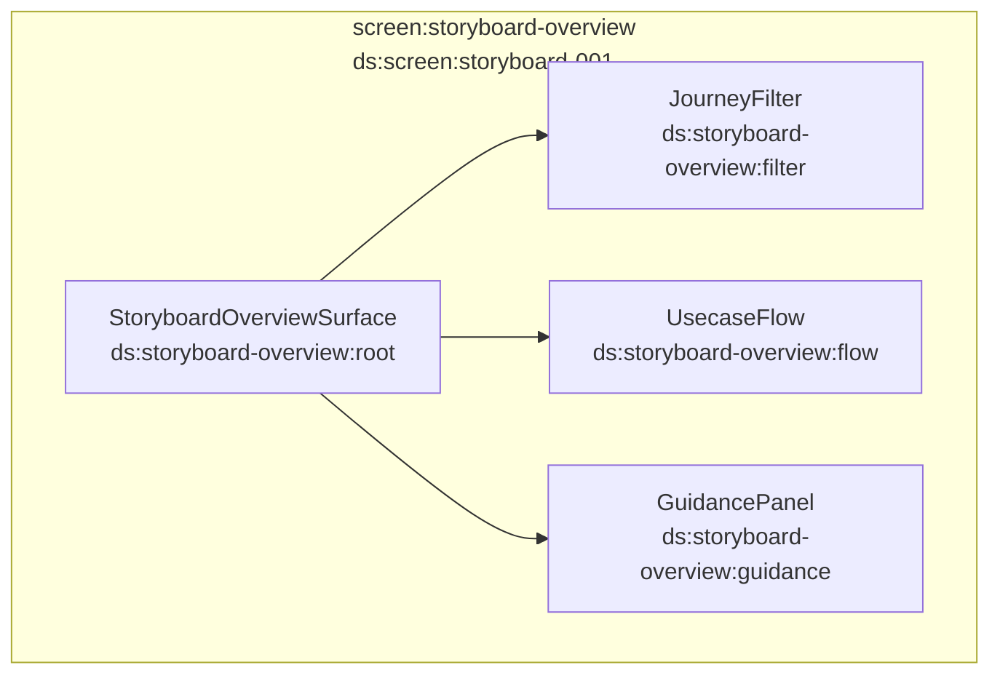
```mermaid
flowchart TD
    subgraph SG_screen_storyboard_overview ["screen:storyboard-overview<br/>ds:screen:storyboard-001"]
        screen_storyboard_overview_root["StoryboardOverviewSurface<br/>ds:storyboard-overview:root"]
        screen_storyboard_overview_root_0["JourneyFilter<br/>ds:storyboard-overview:filter"]
        screen_storyboard_overview_root --> screen_storyboard_overview_root_0
        screen_storyboard_overview_root_1["UsecaseFlow<br/>ds:storyboard-overview:flow"]
        screen_storyboard_overview_root --> screen_storyboard_overview_root_1
        screen_storyboard_overview_root_2["GuidancePanel<br/>ds:storyboard-overview:guidance"]
        screen_storyboard_overview_root --> screen_storyboard_overview_root_2
    end
```

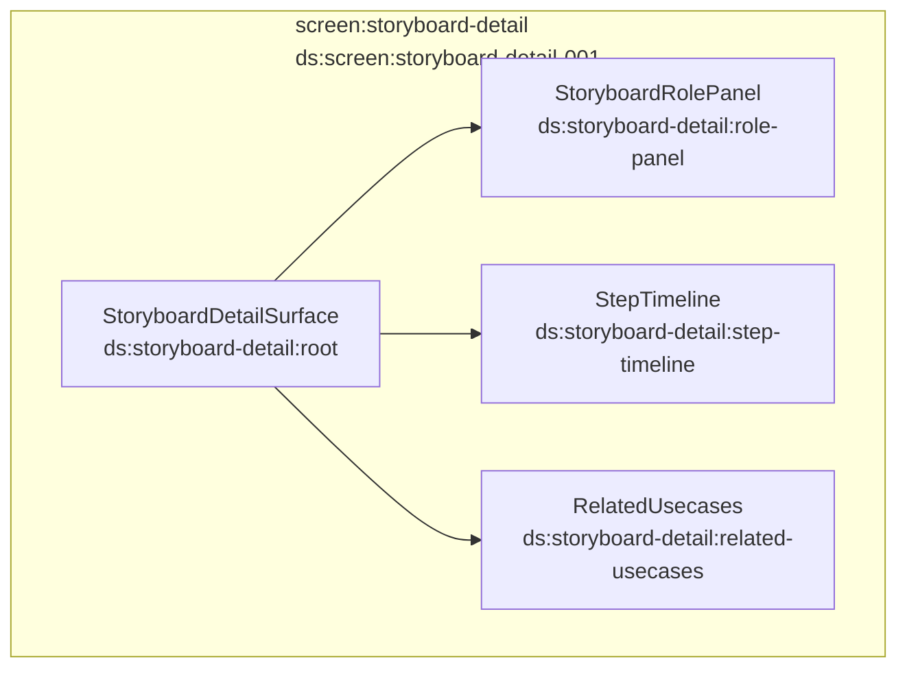
```mermaid
flowchart TD
    subgraph SG_screen_storyboard_detail ["screen:storyboard-detail<br/>ds:screen:storyboard-detail-001"]
        screen_storyboard_detail_root["StoryboardDetailSurface<br/>ds:storyboard-detail:root"]
        screen_storyboard_detail_root_0["StoryboardRolePanel<br/>ds:storyboard-detail:role-panel"]
        screen_storyboard_detail_root --> screen_storyboard_detail_root_0
        screen_storyboard_detail_root_1["StepTimeline<br/>ds:storyboard-detail:step-timeline"]
        screen_storyboard_detail_root --> screen_storyboard_detail_root_1
        screen_storyboard_detail_root_2["RelatedUsecases<br/>ds:storyboard-detail:related-usecases"]
        screen_storyboard_detail_root --> screen_storyboard_detail_root_2
    end
```

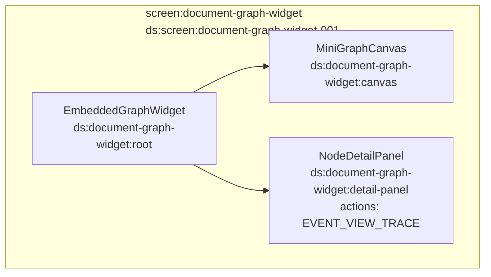
```mermaid
flowchart TD
    subgraph SG_screen_document_graph_widget ["screen:document-graph-widget<br/>ds:screen:document-graph-widget-001"]
        screen_document_graph_widget_root["EmbeddedGraphWidget<br/>ds:document-graph-widget:root"]
        screen_document_graph_widget_root_0["MiniGraphCanvas<br/>ds:document-graph-widget:canvas"]
        screen_document_graph_widget_root --> screen_document_graph_widget_root_0
        screen_document_graph_widget_root_1["NodeDetailPanel<br/>ds:document-graph-widget:detail-panel<br/>actions: EVENT_VIEW_TRACE"]
        screen_document_graph_widget_root --> screen_document_graph_widget_root_1
    end
```

## 3. State Coverage per Screen

```mermaid
flowchart LR
    Contract["Contract states<br/>default, loading, empty, error, offline, forbidden, saving, sync_conflict, not_found, insufficient_evidence, decision_submitted, partial"]
    S0["screen:global-shell<br/>/design-system/webui-pm-workspace<br/>states: default, loading, empty, error, offline, forbidden, saving, sync_conflict"]
    Contract --> S0
    SP_saving["saving<br/>specialized boundary state"]
    SP_saving --> S0
    SP_sync_conflict["sync_conflict<br/>specialized boundary state"]
    SP_sync_conflict --> S0
    S1["screen:rtm-dashboard<br/>/<br/>states: default, loading, empty, error, offline, forbidden"]
    Contract --> S1
    S2["screen:safe-board<br/>/board<br/>states: default, loading, empty, error, offline, forbidden, saving"]
    Contract --> S2
    SP_saving --> S2
    S3["screen:task-list<br/>/tasks<br/>states: default, loading, empty, error, offline, forbidden, saving"]
    Contract --> S3
    SP_saving --> S3
    S4["screen:task-detail<br/>/tasks/:id<br/>states: default, loading, empty, error, offline, forbidden, saving, not_found"]
    Contract --> S4
    SP_saving --> S4
    SP_not_found["not_found<br/>specialized boundary state"]
    SP_not_found --> S4
    S5["screen:approval-gates<br/>/approval<br/>states: default, loading, empty, error, offline, forbidden, insufficient_evidence, decision_submitted"]
    Contract --> S5
    SP_insufficient_evidence["insufficient_evidence<br/>specialized boundary state"]
    SP_insufficient_evidence --> S5
    SP_decision_submitted["decision_submitted<br/>specialized boundary state"]
    SP_decision_submitted --> S5
    S6["screen:doc-viewer<br/>/docs<br/>states: default, loading, empty, error, offline, forbidden"]
    Contract --> S6
    S7["screen:trace-explorer<br/>/trace/:id<br/>states: default, loading, empty, error, offline, forbidden, partial"]
    Contract --> S7
    SP_partial["partial<br/>specialized boundary state"]
    SP_partial --> S7
    S8["screen:search-explorer<br/>/search<br/>states: default, loading, empty, error, offline, forbidden"]
    Contract --> S8
    S9["screen:terminal-console<br/>/terminal<br/>states: default, loading, empty, error, offline, forbidden"]
    Contract --> S9
    S10["screen:portfolio<br/>/portfolio<br/>states: default, loading, empty, error, offline, forbidden"]
    Contract --> S10
    S11["screen:pi-planning<br/>/pi-planning<br/>states: default, loading, empty, error, offline, forbidden, saving"]
    Contract --> S11
    SP_saving --> S11
    S12["screen:git-graph<br/>/git-graph<br/>states: default, loading, empty, error, offline, forbidden"]
    Contract --> S12
    S13["screen:timeline<br/>/timeline<br/>states: default, loading, empty, error, offline, forbidden"]
    Contract --> S13
    S14["screen:components-catalog<br/>/design-system/components<br/>states: default, loading, empty, error, offline, forbidden"]
    Contract --> S14
    S15["screen:storyboard-overview<br/>/storyboards<br/>states: default, loading, empty, error, offline, forbidden"]
    Contract --> S15
    S16["screen:storyboard-detail<br/>/storyboards/:id<br/>states: default, loading, empty, error, offline, forbidden, not_found"]
    Contract --> S16
    SP_not_found --> S16
    S17["screen:document-graph-widget<br/>embedded<br/>states: default, loading, empty, error, offline, forbidden"]
    Contract --> S17
```

## 4. Action-to-Event Links

### Navigation and query
```mermaid
flowchart LR
    A_ds_action_route_enter["ds:action:route-enter<br/>Load route data through Go REST API<br/>route data GET endpoints"]
    E_EVENT_ROUTE_ENTER((EVENT_ROUTE_ENTER))
    A_ds_action_route_enter --> E_EVENT_ROUTE_ENTER
    A_ds_action_hash_navigate["ds:action:hash-navigate<br/>Update hash-selected tab, scenario, anchor, preset, or board<br/>hashchange or router state"]
    E_EVENT_HASH_NAVIGATE((EVENT_HASH_NAVIGATE))
    A_ds_action_hash_navigate --> E_EVENT_HASH_NAVIGATE
    C_ds_global_shell_sidebar_EVENT_HASH_NAVIGATE["ds:global-shell:sidebar<br/>screen:global-shell"] --> A_ds_action_hash_navigate
    C_ds_kanban_board_selector_EVENT_HASH_NAVIGATE["ds:kanban:board-selector<br/>screen:safe-board"] --> A_ds_action_hash_navigate
    C_ds_task_detail_tabs_EVENT_HASH_NAVIGATE["ds:task-detail:tabs<br/>screen:task-detail"] --> A_ds_action_hash_navigate
    C_ds_search_explorer_type_filters_EVENT_HASH_NAVIGATE["ds:search-explorer:type-filters<br/>screen:search-explorer"] --> A_ds_action_hash_navigate
    C_ds_terminal_scenario_tabs_EVENT_HASH_NAVIGATE["ds:terminal:scenario-tabs<br/>screen:terminal-console"] --> A_ds_action_hash_navigate
    C_ds_git_graph_scenario_selector_EVENT_HASH_NAVIGATE["ds:git-graph:scenario-selector<br/>screen:git-graph"] --> A_ds_action_hash_navigate
    C_ds_components_catalog_section_nav_EVENT_HASH_NAVIGATE["ds:components-catalog:section-nav<br/>screen:components-catalog"] --> A_ds_action_hash_navigate
    A_ds_action_refresh["ds:action:refresh<br/>Retry or manually refresh current route data<br/>route-specific reload"]
    E_EVENT_REFRESH((EVENT_REFRESH))
    A_ds_action_refresh --> E_EVENT_REFRESH
    C_ds_rtm_dashboard_gap_analysis_EVENT_REFRESH["ds:rtm-dashboard:gap-analysis<br/>screen:rtm-dashboard"] --> A_ds_action_refresh
    A_ds_action_search["ds:action:search<br/>Run global or explorer search<br/>GET /api/search"]
    E_EVENT_SEARCH((EVENT_SEARCH))
    A_ds_action_search --> E_EVENT_SEARCH
    C_ds_global_shell_header_EVENT_SEARCH["ds:global-shell:header<br/>screen:global-shell"] --> A_ds_action_search
    C_ds_search_explorer_input_EVENT_SEARCH["ds:search-explorer:input<br/>screen:search-explorer"] --> A_ds_action_search
    A_ds_action_view_task["ds:action:view-task<br/>Navigate to task detail<br/>GET /api/tasks/:id"]
    E_EVENT_VIEW_TASK((EVENT_VIEW_TASK))
    A_ds_action_view_task --> E_EVENT_VIEW_TASK
    C_ds_global_shell_sidebar_EVENT_VIEW_TASK["ds:global-shell:sidebar<br/>screen:global-shell"] --> A_ds_action_view_task
    C_ds_rtm_dashboard_task_progress_EVENT_VIEW_TASK["ds:rtm-dashboard:task-progress<br/>screen:rtm-dashboard"] --> A_ds_action_view_task
    C_ds_kanban_columns_EVENT_VIEW_TASK["ds:kanban:columns<br/>screen:safe-board"] --> A_ds_action_view_task
    C_ds_task_list_table_EVENT_VIEW_TASK["ds:task-list:table<br/>screen:task-list"] --> A_ds_action_view_task
    C_ds_trace_explorer_graph_canvas_EVENT_VIEW_TASK["ds:trace-explorer:graph-canvas<br/>screen:trace-explorer"] --> A_ds_action_view_task
    C_ds_search_explorer_results_EVENT_VIEW_TASK["ds:search-explorer:results<br/>screen:search-explorer"] --> A_ds_action_view_task
    C_ds_portfolio_epic_table_EVENT_VIEW_TASK["ds:portfolio:epic-table<br/>screen:portfolio"] --> A_ds_action_view_task
    C_ds_timeline_activity_feed_EVENT_VIEW_TASK["ds:timeline:activity-feed<br/>screen:timeline"] --> A_ds_action_view_task
    A_ds_action_view_trace["ds:action:view-trace<br/>Navigate to Trace Explorer or Beads Traversal context<br/>GET /api/trace/:id"]
    E_EVENT_VIEW_TRACE((EVENT_VIEW_TRACE))
    A_ds_action_view_trace --> E_EVENT_VIEW_TRACE
    C_ds_global_shell_sidebar_EVENT_VIEW_TRACE["ds:global-shell:sidebar<br/>screen:global-shell"] --> A_ds_action_view_trace
    C_ds_rtm_dashboard_coverage_heatmap_EVENT_VIEW_TRACE["ds:rtm-dashboard:coverage-heatmap<br/>screen:rtm-dashboard"] --> A_ds_action_view_trace
    C_ds_rtm_dashboard_knowledge_graph_widget_EVENT_VIEW_TRACE["ds:rtm-dashboard:knowledge-graph-widget<br/>screen:rtm-dashboard"] --> A_ds_action_view_trace
    C_ds_task_detail_graph_widget_EVENT_VIEW_TRACE["ds:task-detail:graph-widget<br/>screen:task-detail"] --> A_ds_action_view_trace
    C_ds_doc_viewer_content_EVENT_VIEW_TRACE["ds:doc-viewer:content<br/>screen:doc-viewer"] --> A_ds_action_view_trace
    C_ds_search_explorer_results_EVENT_VIEW_TRACE["ds:search-explorer:results<br/>screen:search-explorer"] --> A_ds_action_view_trace
    C_ds_git_graph_commit_detail_EVENT_VIEW_TRACE["ds:git-graph:commit-detail<br/>screen:git-graph"] --> A_ds_action_view_trace
    C_ds_document_graph_widget_detail_panel_EVENT_VIEW_TRACE["ds:document-graph-widget:detail-panel<br/>screen:document-graph-widget"] --> A_ds_action_view_trace
    A_ds_action_view_doc["ds:action:view-doc<br/>Navigate to Document Viewer<br/>GET /api/docs/:id"]
    E_EVENT_VIEW_DOC((EVENT_VIEW_DOC))
    A_ds_action_view_doc --> E_EVENT_VIEW_DOC
    C_ds_global_shell_sidebar_EVENT_VIEW_DOC["ds:global-shell:sidebar<br/>screen:global-shell"] --> A_ds_action_view_doc
    C_ds_trace_explorer_graph_canvas_EVENT_VIEW_DOC["ds:trace-explorer:graph-canvas<br/>screen:trace-explorer"] --> A_ds_action_view_doc
    C_ds_search_explorer_results_EVENT_VIEW_DOC["ds:search-explorer:results<br/>screen:search-explorer"] --> A_ds_action_view_doc
    A_ds_action_back["ds:action:back<br/>Return to last safe route or workspace shell<br/>history back or safe route"]
    E_EVENT_BACK((EVENT_BACK))
    A_ds_action_back --> E_EVENT_BACK
    C_ds_global_shell_sync_banner_EVENT_BACK["ds:global-shell:sync-banner<br/>screen:global-shell"] --> A_ds_action_back
```

### Write and approval
```mermaid
flowchart LR
    A_ds_action_save_task["ds:action:save-task<br/>Save editable task field through PUT /api/tasks/:id<br/>PUT /api/tasks/:id"]
    E_EVENT_SAVE_TASK((EVENT_SAVE_TASK))
    A_ds_action_save_task --> E_EVENT_SAVE_TASK
    C_ds_task_detail_editable_fields_EVENT_SAVE_TASK["ds:task-detail:editable-fields<br/>screen:task-detail"] --> A_ds_action_save_task
    A_ds_action_bulk_update["ds:action:bulk-update<br/>Save selected task bulk updates through PUT /api/tasks/bulk<br/>PUT /api/tasks/bulk"]
    E_EVENT_SAVE_BULK((EVENT_SAVE_BULK))
    A_ds_action_bulk_update --> E_EVENT_SAVE_BULK
    C_ds_task_list_bulk_actions_EVENT_SAVE_BULK["ds:task-list:bulk-actions<br/>screen:task-list"] --> A_ds_action_bulk_update
    A_ds_action_move_card["ds:action:move-card<br/>Persist Kanban drag/drop status change<br/>PUT /api/tasks/:id/status"]
    E_EVENT_MOVE_CARD((EVENT_MOVE_CARD))
    A_ds_action_move_card --> E_EVENT_MOVE_CARD
    C_ds_kanban_columns_EVENT_MOVE_CARD["ds:kanban:columns<br/>screen:safe-board"] --> A_ds_action_move_card
    A_ds_action_approval_decision["ds:action:approval-decision<br/>Submit approve, reject, or request changes with audit reason<br/>POST /api/approval/:id/decision"]
    E_EVENT_APPROVAL_DECISION((EVENT_APPROVAL_DECISION))
    A_ds_action_approval_decision --> E_EVENT_APPROVAL_DECISION
    C_ds_approval_decision_controls_EVENT_APPROVAL_DECISION["ds:approval:decision-controls<br/>screen:approval-gates"] --> A_ds_action_approval_decision
    A_ds_action_pi_plan_save["ds:action:pi-plan-save<br/>Save PI planning sandbox changes<br/>PUT /api/pi/plan"]
    E_EVENT_PI_PLAN_SAVE((EVENT_PI_PLAN_SAVE))
    A_ds_action_pi_plan_save --> E_EVENT_PI_PLAN_SAVE
    C_ds_pi_planning_strategic_sandbox_EVENT_PI_PLAN_SAVE["ds:pi-planning:strategic-sandbox<br/>screen:pi-planning"] --> A_ds_action_pi_plan_save
    A_ds_action_confidence_vote["ds:action:confidence-vote<br/>Submit required PI confidence vote<br/>POST /api/pi/confidence-vote"]
    E_EVENT_CONFIDENCE_VOTE((EVENT_CONFIDENCE_VOTE))
    A_ds_action_confidence_vote --> E_EVENT_CONFIDENCE_VOTE
    C_ds_pi_planning_confidence_vote_EVENT_CONFIDENCE_VOTE["ds:pi-planning:confidence-vote<br/>screen:pi-planning"] --> A_ds_action_confidence_vote
```

### Connection overlays and conflicts
```mermaid
flowchart LR
    A_ds_action_disconnect["ds:action:disconnect<br/>Enter offline read-only mode<br/>GET /api/health failure"]
    E_EVENT_DISCONNECT((EVENT_DISCONNECT))
    A_ds_action_disconnect --> E_EVENT_DISCONNECT
    C_ds_global_shell_header_EVENT_DISCONNECT["ds:global-shell:header<br/>screen:global-shell"] --> A_ds_action_disconnect
    A_ds_action_reconnect["ds:action:reconnect<br/>Rehydrate queued edits after health recovers<br/>POST /api/sync/rehydrate"]
    E_EVENT_RECONNECT((EVENT_RECONNECT))
    A_ds_action_reconnect --> E_EVENT_RECONNECT
    C_ds_global_shell_header_EVENT_RECONNECT["ds:global-shell:header<br/>screen:global-shell"] --> A_ds_action_reconnect
    A_ds_action_keep_local["ds:action:keep-local<br/>Keep local queued edit during sync conflict<br/>POST /api/sync/conflicts/:id/resolve keep_local"]
    E_EVENT_KEEP_LOCAL((EVENT_KEEP_LOCAL))
    A_ds_action_keep_local --> E_EVENT_KEEP_LOCAL
    C_ds_global_shell_sync_banner_EVENT_KEEP_LOCAL["ds:global-shell:sync-banner<br/>screen:global-shell"] --> A_ds_action_keep_local
    A_ds_action_use_server["ds:action:use-server<br/>Replace queued edit with server version<br/>POST /api/sync/conflicts/:id/resolve use_server"]
    E_EVENT_USE_SERVER((EVENT_USE_SERVER))
    A_ds_action_use_server --> E_EVENT_USE_SERVER
    C_ds_global_shell_sync_banner_EVENT_USE_SERVER["ds:global-shell:sync-banner<br/>screen:global-shell"] --> A_ds_action_use_server
    A_ds_action_open_overlay["ds:action:open-overlay<br/>Open drawer, bottom sheet, command palette, or mobile nav<br/>open drawer modal or nav overlay"]
    E_EVENT_OPEN_OVERLAY((EVENT_OPEN_OVERLAY))
    A_ds_action_open_overlay --> E_EVENT_OPEN_OVERLAY
    A_ds_action_close_overlay["ds:action:close-overlay<br/>Close overlay with Escape, close button, or safe outside click<br/>Escape close button or outside click"]
    E_EVENT_CLOSE_OVERLAY((EVENT_CLOSE_OVERLAY))
    A_ds_action_close_overlay --> E_EVENT_CLOSE_OVERLAY
```

## 5. Responsive Layout Intent by Viewport

```mermaid
flowchart TD
    Screens["18 screens<br/>all routes inherit responsive rules"]
    VP_desktop["desktop<br/>1440px<br/>Expanded shell sidebar and persistent header/footer.<br/>Multi-panel screens use split views or grids.<br/>Graph detail panels remain visible beside canvas."]
    Screens --> VP_desktop
    VP_tablet["tablet<br/>1024px<br/>Sidebar condenses to icon rail with tooltips.<br/>Detail panels become drawers or bottom sheets.<br/>Kanban and tables may scroll horizontally."]
    Screens --> VP_tablet
    VP_mobile["mobile<br/>390px<br/>Sidebar is hamburger-triggered overlay.<br/>Tables become card lists and tabs may become accordions.<br/>Drawers become full-screen overlays and graph-heavy screens offer tree fallback."]
    Screens --> VP_mobile
    RC_shell["shell<br/>Desktop expanded, tablet icon rail, mobile overlay."]
    VP_desktop --> RC_shell
    VP_tablet --> RC_shell
    VP_mobile --> RC_shell
    RC_board["board<br/>Desktop horizontal kanban, tablet horizontal scroll, mobile card/list stack."]
    VP_desktop --> RC_board
    VP_tablet --> RC_board
    VP_mobile --> RC_board
    RC_graphs["graphs<br/>Desktop canvas plus detail, tablet bottom sheet, mobile tree or simplified graph."]
    VP_desktop --> RC_graphs
    VP_tablet --> RC_graphs
    VP_mobile --> RC_graphs
    RC_approval["approval<br/>Desktop queue/evidence/decision split, tablet stacked, mobile fixed decision bar."]
    VP_desktop --> RC_approval
    VP_tablet --> RC_approval
    VP_mobile --> RC_approval
    RC_documents["documents<br/>Desktop tree plus content, tablet selector plus content, mobile list/detail swap."]
    VP_desktop --> RC_documents
    VP_tablet --> RC_documents
    VP_mobile --> RC_documents
    L0["screen:global-shell<br/>Integrated shell with header logo, global search, offline indicator, sidebar categories, footer sync status, and active PM surface."]
    Screens --> L0
    L1["screen:rtm-dashboard<br/>Four-panel dashboard with KPI row, Coverage Heatmap, Task Progress, Knowledge Graph widget, and Gap Analysis."]
    Screens --> L1
    L2["screen:safe-board<br/>Hash-selected SAFe board with WIP badges, draggable cards, stats strip, and RTE escalation badge."]
    Screens --> L2
    L3["screen:task-list<br/>Sortable task table with filters, pagination, board/list toggle, CSV export, and bulk action bar."]
    Screens --> L3
    L4["screen:task-detail<br/>Editable task header and tabs for Detail, Activity, Graph, Code, and approval-linked context."]
    Screens --> L4
    L5["screen:approval-gates<br/>Queue panel, evidence hub, RTM matrix, coverage heatmap, decision box, and audit receipt."]
    Screens --> L5
    L6["screen:doc-viewer<br/>GitHub-like tree grouped by source type and rendered document panel with Beads badges and coverage markers."]
    Screens --> L6
    L7["screen:trace-explorer<br/>Full graph canvas or layered DAG with toolbar, presets, legends, selected-node banner, and detail sidebar."]
    Screens --> L7
    L8["screen:search-explorer<br/>Unified search with query input, hash-selected filters, grouped result list, and detail sidebar."]
    Screens --> L8
    L9["screen:terminal-console<br/>Scenario tabs and 2x2 terminal mosaic for agent, deploy, debug, and CI/CD read-only streams."]
    Screens --> L9
    L10["screen:portfolio<br/>Executive epic table and Q1/Q2/Q3 2026 roadmap with budget, progress, status, owner, and forecast."]
    Screens --> L10
    L11["screen:pi-planning<br/>Strategic Sandbox, Capacity Plan, Business Value Scoring, Confidence Vote, and ROAM Board."]
    Screens --> L11
    L12["screen:git-graph<br/>Scenario selector and graph canvas with branches, commits, merge connections, branch tags, stats, and trace overlay."]
    Screens --> L12
    L13["screen:timeline<br/>File lease indicators, activity feed, sprint day timeline, and freshness indicator."]
    Screens --> L13
    L14["screen:components-catalog<br/>Catalog of 18 shared primitives with hash scroll and interactive examples."]
    Screens --> L14
    L15["screen:storyboard-overview<br/>Journey filter, horizontal use-case flow nodes, guidance panel, and CTA to real screen."]
    Screens --> L15
    L16["screen:storyboard-detail<br/>Role panel, journey summary, step timeline, related use cases, expected states, and CTA to matching Core route."]
    Screens --> L16
    L17["screen:document-graph-widget<br/>Embedded graph widget with canvas, filters, zoom controls, side panel, and Open Full Page CTA."]
    Screens --> L17
```

## 6. Source Logic Machine Event Coverage

```mermaid
stateDiagram-v2
    direction LR
    [*] --> GlobalShell
    GlobalShell --> RouteLoading : EVENT_ROUTE_ENTER
    RouteLoading --> CoreSurface : API_SUCCESS_CORE
    RouteLoading --> ShowcaseSurface : API_SUCCESS_SHOWCASE
    RouteLoading --> EmptyState : API_EMPTY
    RouteLoading --> ErrorState : API_ERROR
    RouteLoading --> RecoveryState : API_FORBIDDEN / API_NOT_FOUND
    CoreSurface --> NavigationState : EVENT_HASH_NAVIGATE / EVENT_SEARCH / EVENT_VIEW_TASK / EVENT_VIEW_TRACE / EVENT_VIEW_DOC
    ShowcaseSurface --> NavigationState : EVENT_HASH_NAVIGATE / EVENT_VIEW_TASK / EVENT_VIEW_TRACE / EVENT_VIEW_DOC
    NavigationState --> CoreSurface : API_SUCCESS
    CoreSurface --> SavingState : EVENT_SAVE_TASK / EVENT_SAVE_BULK / EVENT_MOVE_CARD / EVENT_PI_PLAN_SAVE / EVENT_CONFIDENCE_VOTE / EVENT_APPROVAL_DECISION
    SavingState --> SuccessState : API_SUCCESS
    SavingState --> ErrorState : API_ERROR_ROLLBACK_OR_POLICY_OR_INSUFFICIENT_EVIDENCE
    CoreSurface --> CoreSurface : EVENT_OPEN_OVERLAY / EVENT_CLOSE_OVERLAY
    CoreSurface --> OfflineState : EVENT_DISCONNECT
    OfflineState --> RehydratingState : EVENT_RECONNECT
    RehydratingState --> SyncConflictState : API_CONFLICT
    SyncConflictState --> RehydratingState : EVENT_KEEP_LOCAL / EVENT_USE_SERVER
    RehydratingState --> SuccessState : API_SYNC_SUCCESS
    CoreSurface --> PartialGraphState : API_PARTIAL_ENRICHMENT
    PartialGraphState --> SuccessState : API_ENRICHMENT_SUCCESS
    EmptyState --> RouteLoading : EVENT_REFRESH
    ErrorState --> RouteLoading : EVENT_REFRESH
    RecoveryState --> GlobalShell : EVENT_BACK
```

## 7. Data Boundary and API Source Map

```mermaid
flowchart LR
    Browser["Browser UI<br/>routes and showcase surfaces"]
    Api["Go REST API<br/>gmind serve"]
    Backend["Backend aggregation<br/>FrankenSQLite Zvec git GitHub FastCode CI shell"]
    Browser --> Api
    Api --> Backend
    D0["screen:global-shell<br/>GET /api/health<br/>GET /api/coverage<br/>GET /api/tasks<br/>GET /api/trace/:id"]
    Browser --> D0
    D0 --> Api
    D1["screen:rtm-dashboard<br/>GET /api/coverage<br/>GET /api/tasks<br/>GET /api/trace/:id?depth=2<br/>GET /api/gaps"]
    Browser --> D1
    D1 --> Api
    D2["screen:safe-board<br/>GET /api/tasks?view=board&amp;board=&lt;id&gt;<br/>PUT /api/tasks/:id/status<br/>GET /api/tasks/:id/activity"]
    Browser --> D2
    D2 --> Api
    D3["screen:task-list<br/>GET /api/tasks?format=list<br/>PUT /api/tasks/bulk"]
    Browser --> D3
    D3 --> Api
    D4["screen:task-detail<br/>GET /api/tasks/:id<br/>GET /api/tasks/:id/activity<br/>GET /api/trace/:id?depth=2<br/>PUT /api/tasks/:id"]
    Browser --> D4
    D4 --> Api
    D5["screen:approval-gates<br/>GET /api/tasks?status=pending-approval<br/>GET /api/approval/:id/evidence<br/>GET /api/coverage<br/>POST /api/approval/:id/decision"]
    Browser --> D5
    D5 --> Api
    D6["screen:doc-viewer<br/>GET /api/docs?group=source_type<br/>GET /api/docs/:id<br/>GET /api/coverage?doc=&lt;id&gt;"]
    Browser --> D6
    D6 --> Api
    D7["screen:trace-explorer<br/>GET /api/trace/:id?depth=full<br/>GET /api/graph/presets<br/>GET /api/impact/:section"]
    Browser --> D7
    D7 --> Api
    D8["screen:search-explorer<br/>GET /api/search?q=&lt;query&gt;&amp;type=&lt;type&gt;"]
    Browser --> D8
    D8 --> Api
    D9["screen:terminal-console<br/>GET /api/agents/sessions<br/>GET /api/ci/runs<br/>GET /api/tasks/:id/activity<br/>STREAM /api/log-events?stream=terminal"]
    Browser --> D9
    D9 --> Api
    D10["screen:portfolio<br/>GET /api/portfolio/epics<br/>GET /api/tasks?issue_type=epic"]
    Browser --> D10
    D10 --> Api
    D11["screen:pi-planning<br/>GET /api/pi/features<br/>PUT /api/pi/plan<br/>GET /api/risks?view=roam<br/>POST /api/pi/confidence-vote"]
    Browser --> D11
    D11 --> Api
    D12["screen:git-graph<br/>GET /api/git/graph?scenario=&lt;id&gt;<br/>GET /api/trace/:id?include=git"]
    Browser --> D12
    D12 --> Api
    D13["screen:timeline<br/>GET /api/activity<br/>GET /api/file-leases<br/>GET /api/tasks/:id/activity"]
    Browser --> D13
    D13 --> Api
    D14["screen:components-catalog<br/>GET /api/design-system/components"]
    Browser --> D14
    D14 --> Api
    D15["screen:storyboard-overview<br/>GET /api/storyboards"]
    Browser --> D15
    D15 --> Api
    D16["screen:storyboard-detail<br/>GET /api/storyboards/:id"]
    Browser --> D16
    D16 --> Api
    D17["screen:document-graph-widget<br/>GET /api/trace/:id?depth=2"]
    Browser --> D17
    D17 --> Api
```
