<!-- beads-id: br-design-review-diagrams-webui-pm-workspace -->
# Stage 1 Review Diagrams: WebUI PM Workspace

Derived from `ui-contract.md` for Gate A review. Mermaid is embedded only in Markdown fences; no standalone `.mmd` or hand-authored ASCII artifacts are used.

Coverage notes: all Core WebUI routes and all PRD-04 §8.1A showcase routes are diagrammed, including terminal, portfolio, pi-planning, git-graph, kanban, knowledge-graph, approval, timeline, components, doc-viewer, explorer, beads-traversal, storyboard overview/detail, and the webui-pm-workspace composite.

## 1. Screen Inventory and Routes

```mermaid
flowchart LR
    Shell["Global Shell<br/>header search offline indicator sidebar footer<br/>ds:global_shell"]
    CoreGroup["Core WebUI routes<br/>gmind serve Go REST API"]
    ShowcaseGroup["Showcase routes<br/>apps website design-system"]
    Shell --> CoreGroup
    Shell --> ShowcaseGroup
    R0["screen:rtm-dashboard<br/>/<br/>ds:screen:rtm-dashboard-001"]
    CoreGroup --> R0
    R1["screen:safe-board<br/>/board<br/>ds:screen:safe-board-001"]
    CoreGroup --> R1
    R2["screen:task-list<br/>/tasks<br/>ds:screen:task-list-001"]
    CoreGroup --> R2
    R3["screen:task-detail<br/>/tasks/:id<br/>ds:screen:task-detail-001"]
    CoreGroup --> R3
    R4["screen:trace-explorer<br/>/trace/:id<br/>ds:screen:trace-explorer-001"]
    CoreGroup --> R4
    R5["screen:doc-viewer<br/>/docs<br/>ds:screen:core-doc-viewer-001"]
    CoreGroup --> R5
    R6["screen:approval-gates<br/>/approval<br/>ds:screen:approval-gates-001"]
    CoreGroup --> R6
    R7["screen:search-results<br/>/search<br/>ds:screen:search-results-001"]
    CoreGroup --> R7
    R8["screen:ds-terminal<br/>/design-system/terminal<br/>ds:screen:terminal-showcase-001<br/>PRD DS ds:screen:terminal-001"]
    ShowcaseGroup --> R8
    R9["screen:ds-portfolio<br/>/design-system/portfolio<br/>ds:screen:portfolio-showcase-001<br/>PRD DS br-ds-portfolio-view"]
    ShowcaseGroup --> R9
    R10["screen:ds-pi-planning<br/>/design-system/pi-planning<br/>ds:screen:pi-planning-showcase-001<br/>PRD DS br-ds-pi-planning"]
    ShowcaseGroup --> R10
    R11["screen:ds-git-graph<br/>/design-system/git-graph<br/>ds:screen:git-graph-showcase-001<br/>PRD DS ds:screen:git-graph-001"]
    ShowcaseGroup --> R11
    R12["screen:ds-kanban<br/>/design-system/kanban<br/>ds:screen:kanban-showcase-001<br/>PRD DS ds:screen:kanban-001"]
    ShowcaseGroup --> R12
    R13["screen:ds-knowledge-graph<br/>/design-system/knowledge-graph<br/>ds:screen:knowledge-graph-showcase-001<br/>PRD DS ds:screen:knowledge-graph-001"]
    ShowcaseGroup --> R13
    R14["screen:ds-approval<br/>/design-system/approval<br/>ds:screen:approval-showcase-001<br/>PRD DS ds:screen:approval-001"]
    ShowcaseGroup --> R14
    R15["screen:ds-timeline<br/>/design-system/timeline<br/>ds:screen:timeline-showcase-001<br/>PRD DS ds:screen:timeline-001"]
    ShowcaseGroup --> R15
    R16["screen:ds-components<br/>/design-system/components<br/>ds:screen:components-showcase-001<br/>PRD DS ds:screen:components-001"]
    ShowcaseGroup --> R16
    R17["screen:ds-doc-viewer<br/>/design-system/doc-viewer<br/>ds:screen:doc-viewer-showcase-001<br/>PRD DS ds:screen:doc-viewer-001"]
    ShowcaseGroup --> R17
    R18["screen:ds-explorer<br/>/design-system/explorer<br/>ds:screen:explorer-showcase-001<br/>PRD DS ds:screen:explorer-001"]
    ShowcaseGroup --> R18
    R19["screen:ds-beads-traversal<br/>/design-system/beads-traversal<br/>ds:screen:beads-traversal-showcase-001<br/>PRD DS ds:screen:beads-traversal-001"]
    ShowcaseGroup --> R19
    R20["screen:ds-storyboard<br/>/design-system/storyboard<br/>ds:screen:storyboard-showcase-001<br/>PRD DS ds:screen:storyboard-001"]
    ShowcaseGroup --> R20
    R21["screen:ds-storyboard-detail<br/>/design-system/storyboard/:id<br/>ds:screen:storyboard-detail-showcase-001<br/>PRD DS ds:screen:storyboard-001"]
    ShowcaseGroup --> R21
    R22["screen:ds-webui-pm-workspace<br/>/design-system/webui-pm-workspace<br/>ds:screen:webui-pm-workspace-showcase-001<br/>PRD DS ds:global_shell"]
    ShowcaseGroup --> R22
```

## 2. Per-Screen Component Hierarchy from YAML View Blueprint

### screen:rtm-dashboard — ds:screen:rtm-dashboard-001

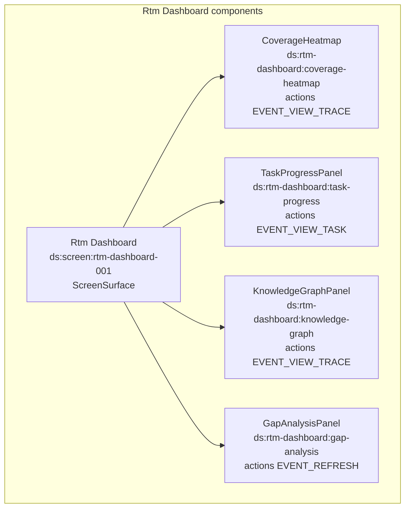
```mermaid
flowchart TD
    subgraph sg_screen_rtm_dashboard ["Rtm Dashboard components"]
        n_ds_screen_rtm_dashboard_001["Rtm Dashboard<br/>ds:screen:rtm-dashboard-001<br/>ScreenSurface"]
        n_ds_rtm_dashboard_coverage_heatmap["CoverageHeatmap<br/>ds:rtm-dashboard:coverage-heatmap<br/>actions EVENT_VIEW_TRACE"]
        n_ds_screen_rtm_dashboard_001 --> n_ds_rtm_dashboard_coverage_heatmap
        n_ds_rtm_dashboard_task_progress["TaskProgressPanel<br/>ds:rtm-dashboard:task-progress<br/>actions EVENT_VIEW_TASK"]
        n_ds_screen_rtm_dashboard_001 --> n_ds_rtm_dashboard_task_progress
        n_ds_rtm_dashboard_knowledge_graph["KnowledgeGraphPanel<br/>ds:rtm-dashboard:knowledge-graph<br/>actions EVENT_VIEW_TRACE"]
        n_ds_screen_rtm_dashboard_001 --> n_ds_rtm_dashboard_knowledge_graph
        n_ds_rtm_dashboard_gap_analysis["GapAnalysisPanel<br/>ds:rtm-dashboard:gap-analysis<br/>actions EVENT_REFRESH"]
        n_ds_screen_rtm_dashboard_001 --> n_ds_rtm_dashboard_gap_analysis
    end
```

### screen:safe-board — ds:screen:safe-board-001

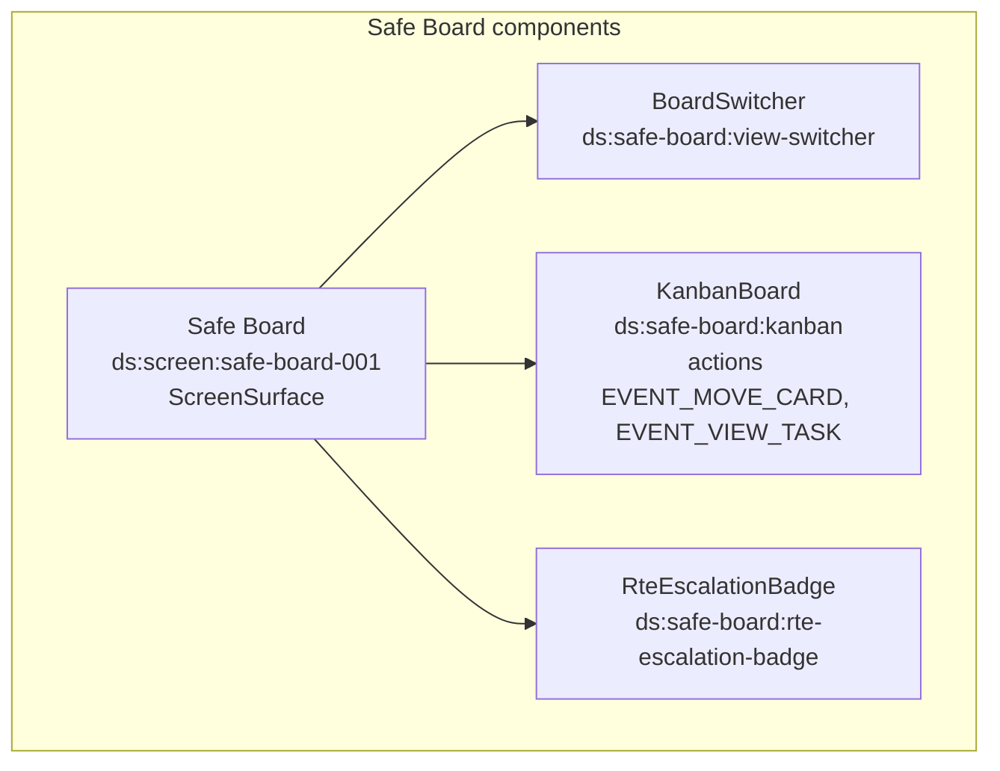
```mermaid
flowchart TD
    subgraph sg_screen_safe_board ["Safe Board components"]
        n_ds_screen_safe_board_001["Safe Board<br/>ds:screen:safe-board-001<br/>ScreenSurface"]
        n_ds_safe_board_view_switcher["BoardSwitcher<br/>ds:safe-board:view-switcher"]
        n_ds_screen_safe_board_001 --> n_ds_safe_board_view_switcher
        n_ds_safe_board_kanban["KanbanBoard<br/>ds:safe-board:kanban<br/>actions EVENT_MOVE_CARD, EVENT_VIEW_TASK"]
        n_ds_screen_safe_board_001 --> n_ds_safe_board_kanban
        n_ds_safe_board_rte_escalation_badge["RteEscalationBadge<br/>ds:safe-board:rte-escalation-badge"]
        n_ds_screen_safe_board_001 --> n_ds_safe_board_rte_escalation_badge
    end
```

### screen:task-list — ds:screen:task-list-001

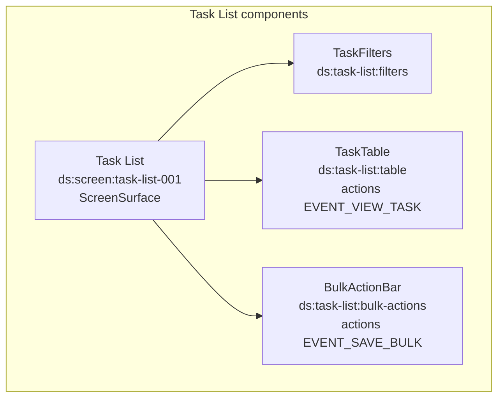
```mermaid
flowchart TD
    subgraph sg_screen_task_list ["Task List components"]
        n_ds_screen_task_list_001["Task List<br/>ds:screen:task-list-001<br/>ScreenSurface"]
        n_ds_task_list_filters["TaskFilters<br/>ds:task-list:filters"]
        n_ds_screen_task_list_001 --> n_ds_task_list_filters
        n_ds_task_list_table["TaskTable<br/>ds:task-list:table<br/>actions EVENT_VIEW_TASK"]
        n_ds_screen_task_list_001 --> n_ds_task_list_table
        n_ds_task_list_bulk_actions["BulkActionBar<br/>ds:task-list:bulk-actions<br/>actions EVENT_SAVE_BULK"]
        n_ds_screen_task_list_001 --> n_ds_task_list_bulk_actions
    end
```

### screen:task-detail — ds:screen:task-detail-001

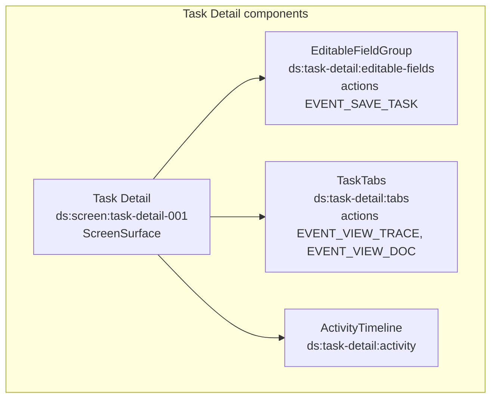
```mermaid
flowchart TD
    subgraph sg_screen_task_detail ["Task Detail components"]
        n_ds_screen_task_detail_001["Task Detail<br/>ds:screen:task-detail-001<br/>ScreenSurface"]
        n_ds_task_detail_editable_fields["EditableFieldGroup<br/>ds:task-detail:editable-fields<br/>actions EVENT_SAVE_TASK"]
        n_ds_screen_task_detail_001 --> n_ds_task_detail_editable_fields
        n_ds_task_detail_tabs["TaskTabs<br/>ds:task-detail:tabs<br/>actions EVENT_VIEW_TRACE, EVENT_VIEW_DOC"]
        n_ds_screen_task_detail_001 --> n_ds_task_detail_tabs
        n_ds_task_detail_activity["ActivityTimeline<br/>ds:task-detail:activity"]
        n_ds_screen_task_detail_001 --> n_ds_task_detail_activity
    end
```

### screen:trace-explorer — ds:screen:trace-explorer-001

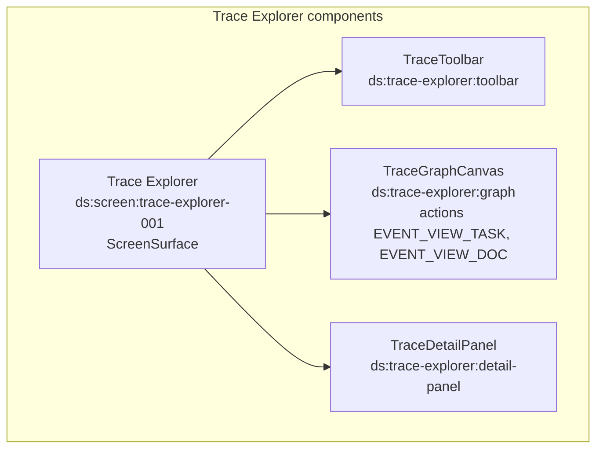
```mermaid
flowchart TD
    subgraph sg_screen_trace_explorer ["Trace Explorer components"]
        n_ds_screen_trace_explorer_001["Trace Explorer<br/>ds:screen:trace-explorer-001<br/>ScreenSurface"]
        n_ds_trace_explorer_toolbar["TraceToolbar<br/>ds:trace-explorer:toolbar"]
        n_ds_screen_trace_explorer_001 --> n_ds_trace_explorer_toolbar
        n_ds_trace_explorer_graph["TraceGraphCanvas<br/>ds:trace-explorer:graph<br/>actions EVENT_VIEW_TASK, EVENT_VIEW_DOC"]
        n_ds_screen_trace_explorer_001 --> n_ds_trace_explorer_graph
        n_ds_trace_explorer_detail_panel["TraceDetailPanel<br/>ds:trace-explorer:detail-panel"]
        n_ds_screen_trace_explorer_001 --> n_ds_trace_explorer_detail_panel
    end
```

### screen:doc-viewer — ds:screen:core-doc-viewer-001

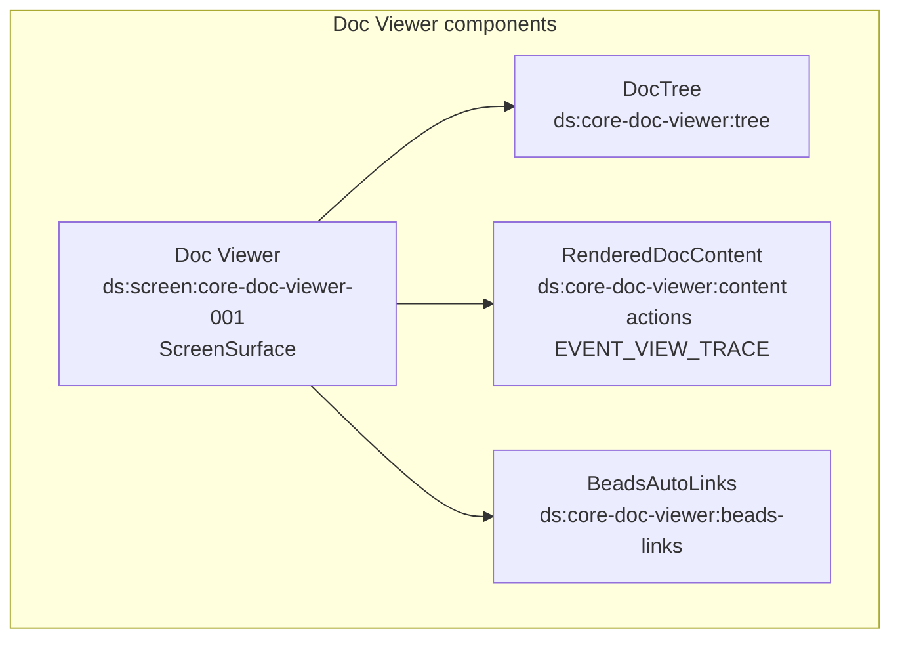
```mermaid
flowchart TD
    subgraph sg_screen_doc_viewer ["Doc Viewer components"]
        n_ds_screen_core_doc_viewer_001["Doc Viewer<br/>ds:screen:core-doc-viewer-001<br/>ScreenSurface"]
        n_ds_core_doc_viewer_tree["DocTree<br/>ds:core-doc-viewer:tree"]
        n_ds_screen_core_doc_viewer_001 --> n_ds_core_doc_viewer_tree
        n_ds_core_doc_viewer_content["RenderedDocContent<br/>ds:core-doc-viewer:content<br/>actions EVENT_VIEW_TRACE"]
        n_ds_screen_core_doc_viewer_001 --> n_ds_core_doc_viewer_content
        n_ds_core_doc_viewer_beads_links["BeadsAutoLinks<br/>ds:core-doc-viewer:beads-links"]
        n_ds_screen_core_doc_viewer_001 --> n_ds_core_doc_viewer_beads_links
    end
```

### screen:approval-gates — ds:screen:approval-gates-001

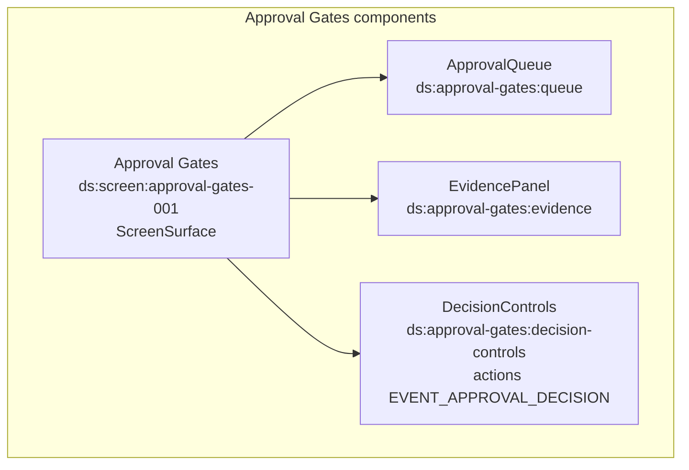
```mermaid
flowchart TD
    subgraph sg_screen_approval_gates ["Approval Gates components"]
        n_ds_screen_approval_gates_001["Approval Gates<br/>ds:screen:approval-gates-001<br/>ScreenSurface"]
        n_ds_approval_gates_queue["ApprovalQueue<br/>ds:approval-gates:queue"]
        n_ds_screen_approval_gates_001 --> n_ds_approval_gates_queue
        n_ds_approval_gates_evidence["EvidencePanel<br/>ds:approval-gates:evidence"]
        n_ds_screen_approval_gates_001 --> n_ds_approval_gates_evidence
        n_ds_approval_gates_decision_controls["DecisionControls<br/>ds:approval-gates:decision-controls<br/>actions EVENT_APPROVAL_DECISION"]
        n_ds_screen_approval_gates_001 --> n_ds_approval_gates_decision_controls
    end
```

### screen:search-results — ds:screen:search-results-001

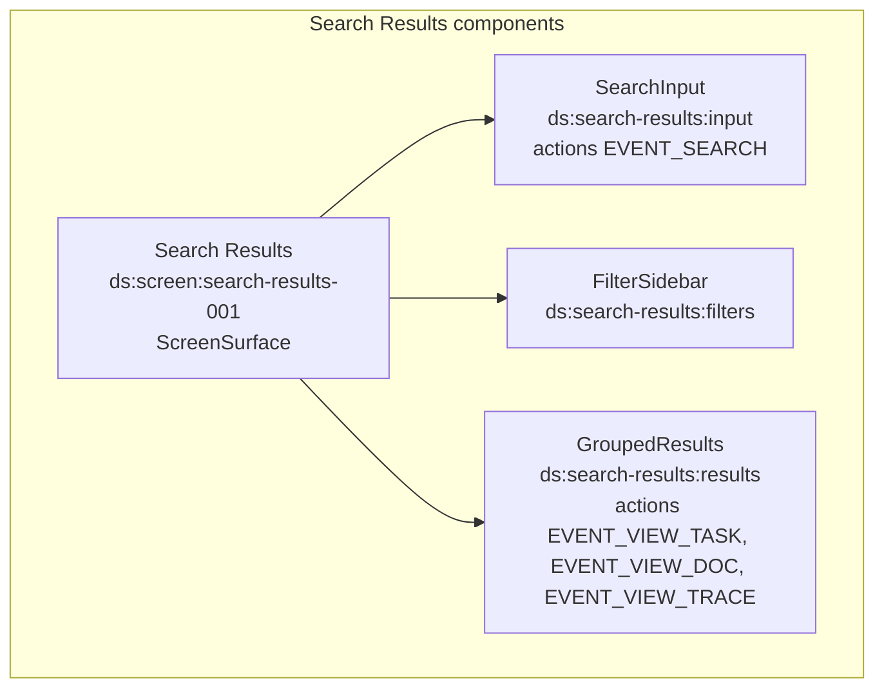
```mermaid
flowchart TD
    subgraph sg_screen_search_results ["Search Results components"]
        n_ds_screen_search_results_001["Search Results<br/>ds:screen:search-results-001<br/>ScreenSurface"]
        n_ds_search_results_input["SearchInput<br/>ds:search-results:input<br/>actions EVENT_SEARCH"]
        n_ds_screen_search_results_001 --> n_ds_search_results_input
        n_ds_search_results_filters["FilterSidebar<br/>ds:search-results:filters"]
        n_ds_screen_search_results_001 --> n_ds_search_results_filters
        n_ds_search_results_results["GroupedResults<br/>ds:search-results:results<br/>actions EVENT_VIEW_TASK, EVENT_VIEW_DOC, EVENT_VIEW_TRACE"]
        n_ds_screen_search_results_001 --> n_ds_search_results_results
    end
```

### screen:ds-terminal — ds:screen:terminal-showcase-001

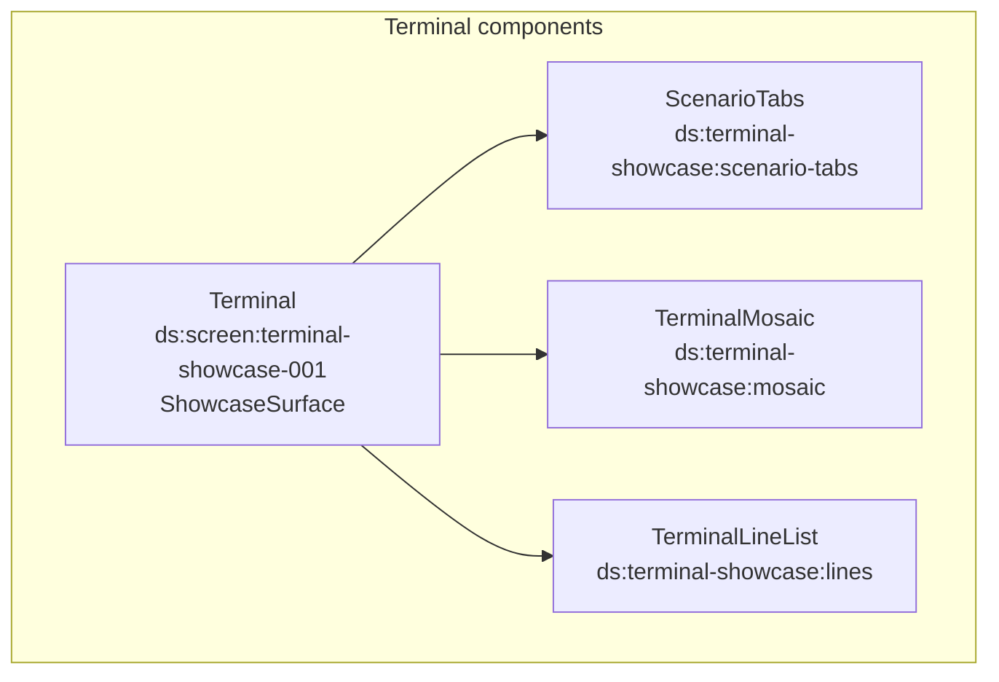
```mermaid
flowchart TD
    subgraph sg_screen_ds_terminal ["Terminal components"]
        n_ds_screen_terminal_showcase_001["Terminal<br/>ds:screen:terminal-showcase-001<br/>ShowcaseSurface"]
        n_ds_terminal_showcase_scenario_tabs["ScenarioTabs<br/>ds:terminal-showcase:scenario-tabs"]
        n_ds_screen_terminal_showcase_001 --> n_ds_terminal_showcase_scenario_tabs
        n_ds_terminal_showcase_mosaic["TerminalMosaic<br/>ds:terminal-showcase:mosaic"]
        n_ds_screen_terminal_showcase_001 --> n_ds_terminal_showcase_mosaic
        n_ds_terminal_showcase_lines["TerminalLineList<br/>ds:terminal-showcase:lines"]
        n_ds_screen_terminal_showcase_001 --> n_ds_terminal_showcase_lines
    end
```

### screen:ds-portfolio — ds:screen:portfolio-showcase-001

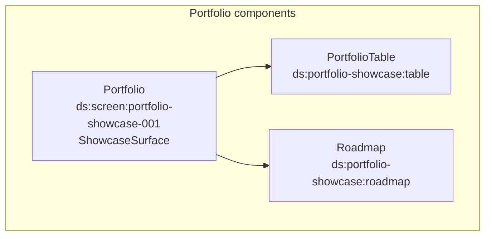
```mermaid
flowchart TD
    subgraph sg_screen_ds_portfolio ["Portfolio components"]
        n_ds_screen_portfolio_showcase_001["Portfolio<br/>ds:screen:portfolio-showcase-001<br/>ShowcaseSurface"]
        n_ds_portfolio_showcase_table["PortfolioTable<br/>ds:portfolio-showcase:table"]
        n_ds_screen_portfolio_showcase_001 --> n_ds_portfolio_showcase_table
        n_ds_portfolio_showcase_roadmap["Roadmap<br/>ds:portfolio-showcase:roadmap"]
        n_ds_screen_portfolio_showcase_001 --> n_ds_portfolio_showcase_roadmap
    end
```

### screen:ds-pi-planning — ds:screen:pi-planning-showcase-001

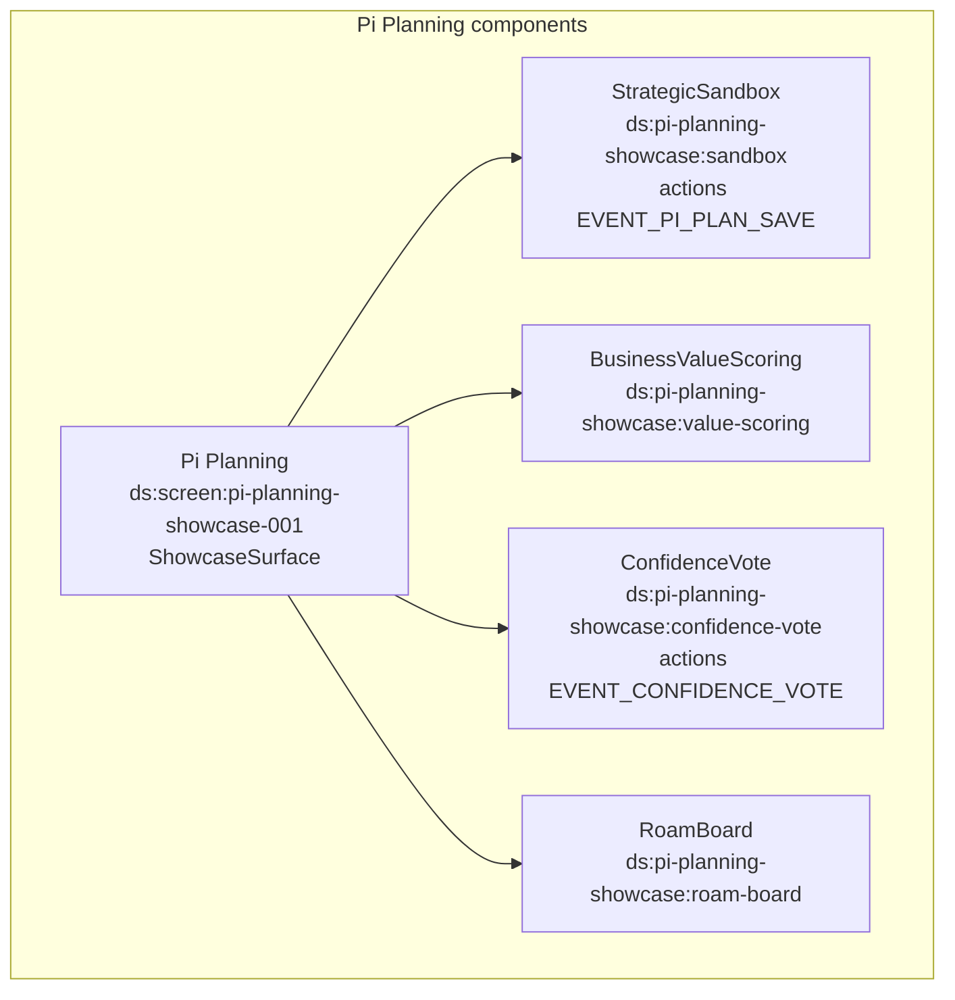
```mermaid
flowchart TD
    subgraph sg_screen_ds_pi_planning ["Pi Planning components"]
        n_ds_screen_pi_planning_showcase_001["Pi Planning<br/>ds:screen:pi-planning-showcase-001<br/>ShowcaseSurface"]
        n_ds_pi_planning_showcase_sandbox["StrategicSandbox<br/>ds:pi-planning-showcase:sandbox<br/>actions EVENT_PI_PLAN_SAVE"]
        n_ds_screen_pi_planning_showcase_001 --> n_ds_pi_planning_showcase_sandbox
        n_ds_pi_planning_showcase_value_scoring["BusinessValueScoring<br/>ds:pi-planning-showcase:value-scoring"]
        n_ds_screen_pi_planning_showcase_001 --> n_ds_pi_planning_showcase_value_scoring
        n_ds_pi_planning_showcase_confidence_vote["ConfidenceVote<br/>ds:pi-planning-showcase:confidence-vote<br/>actions EVENT_CONFIDENCE_VOTE"]
        n_ds_screen_pi_planning_showcase_001 --> n_ds_pi_planning_showcase_confidence_vote
        n_ds_pi_planning_showcase_roam_board["RoamBoard<br/>ds:pi-planning-showcase:roam-board"]
        n_ds_screen_pi_planning_showcase_001 --> n_ds_pi_planning_showcase_roam_board
    end
```

### screen:ds-git-graph — ds:screen:git-graph-showcase-001

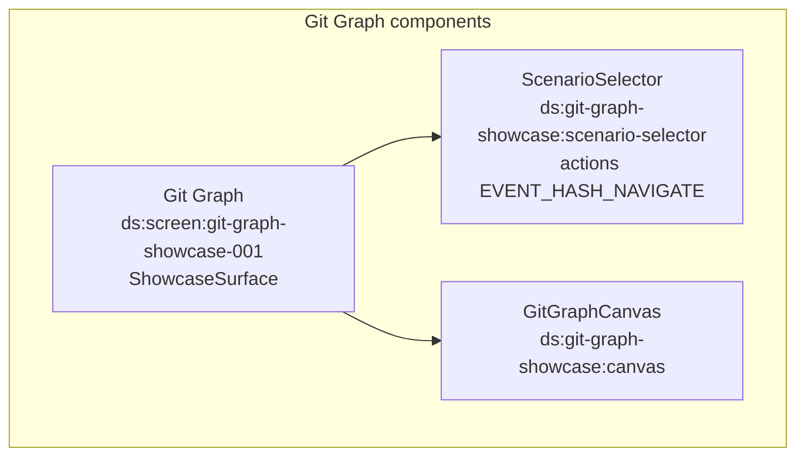
```mermaid
flowchart TD
    subgraph sg_screen_ds_git_graph ["Git Graph components"]
        n_ds_screen_git_graph_showcase_001["Git Graph<br/>ds:screen:git-graph-showcase-001<br/>ShowcaseSurface"]
        n_ds_git_graph_showcase_scenario_selector["ScenarioSelector<br/>ds:git-graph-showcase:scenario-selector<br/>actions EVENT_HASH_NAVIGATE"]
        n_ds_screen_git_graph_showcase_001 --> n_ds_git_graph_showcase_scenario_selector
        n_ds_git_graph_showcase_canvas["GitGraphCanvas<br/>ds:git-graph-showcase:canvas"]
        n_ds_screen_git_graph_showcase_001 --> n_ds_git_graph_showcase_canvas
    end
```

### screen:ds-kanban — ds:screen:kanban-showcase-001

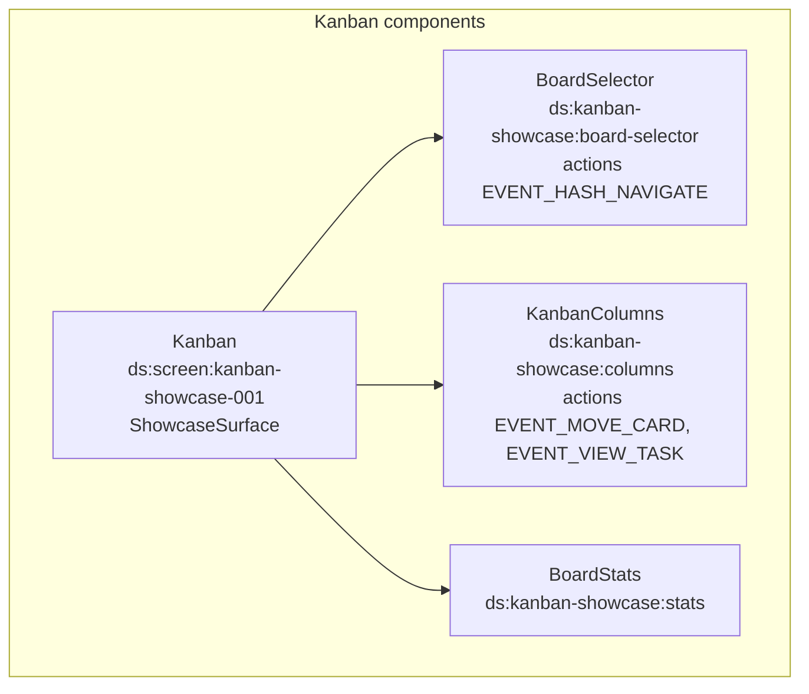
```mermaid
flowchart TD
    subgraph sg_screen_ds_kanban ["Kanban components"]
        n_ds_screen_kanban_showcase_001["Kanban<br/>ds:screen:kanban-showcase-001<br/>ShowcaseSurface"]
        n_ds_kanban_showcase_board_selector["BoardSelector<br/>ds:kanban-showcase:board-selector<br/>actions EVENT_HASH_NAVIGATE"]
        n_ds_screen_kanban_showcase_001 --> n_ds_kanban_showcase_board_selector
        n_ds_kanban_showcase_columns["KanbanColumns<br/>ds:kanban-showcase:columns<br/>actions EVENT_MOVE_CARD, EVENT_VIEW_TASK"]
        n_ds_screen_kanban_showcase_001 --> n_ds_kanban_showcase_columns
        n_ds_kanban_showcase_stats["BoardStats<br/>ds:kanban-showcase:stats"]
        n_ds_screen_kanban_showcase_001 --> n_ds_kanban_showcase_stats
    end
```

### screen:ds-knowledge-graph — ds:screen:knowledge-graph-showcase-001

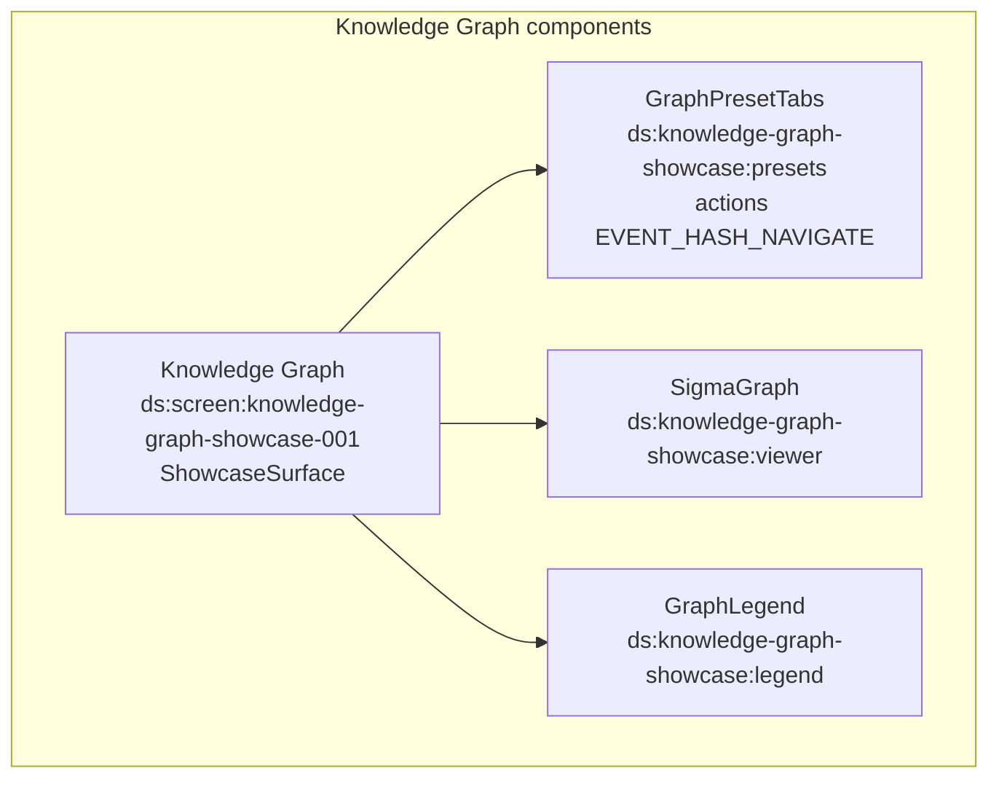
```mermaid
flowchart TD
    subgraph sg_screen_ds_knowledge_graph ["Knowledge Graph components"]
        n_ds_screen_knowledge_graph_showcase_001["Knowledge Graph<br/>ds:screen:knowledge-graph-showcase-001<br/>ShowcaseSurface"]
        n_ds_knowledge_graph_showcase_presets["GraphPresetTabs<br/>ds:knowledge-graph-showcase:presets<br/>actions EVENT_HASH_NAVIGATE"]
        n_ds_screen_knowledge_graph_showcase_001 --> n_ds_knowledge_graph_showcase_presets
        n_ds_knowledge_graph_showcase_viewer["SigmaGraph<br/>ds:knowledge-graph-showcase:viewer"]
        n_ds_screen_knowledge_graph_showcase_001 --> n_ds_knowledge_graph_showcase_viewer
        n_ds_knowledge_graph_showcase_legend["GraphLegend<br/>ds:knowledge-graph-showcase:legend"]
        n_ds_screen_knowledge_graph_showcase_001 --> n_ds_knowledge_graph_showcase_legend
    end
```

### screen:ds-approval — ds:screen:approval-showcase-001

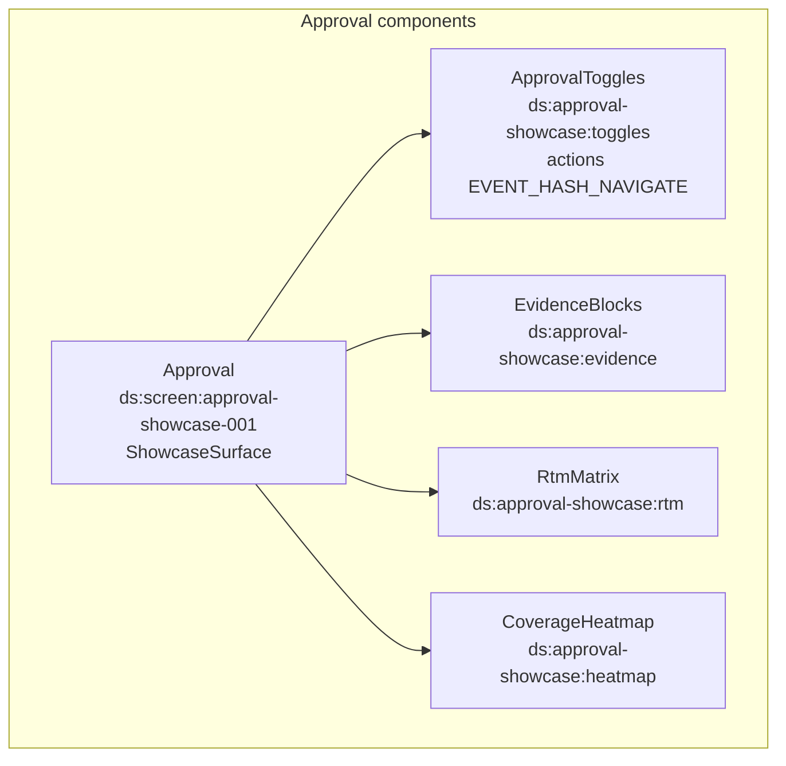
```mermaid
flowchart TD
    subgraph sg_screen_ds_approval ["Approval components"]
        n_ds_screen_approval_showcase_001["Approval<br/>ds:screen:approval-showcase-001<br/>ShowcaseSurface"]
        n_ds_approval_showcase_toggles["ApprovalToggles<br/>ds:approval-showcase:toggles<br/>actions EVENT_HASH_NAVIGATE"]
        n_ds_screen_approval_showcase_001 --> n_ds_approval_showcase_toggles
        n_ds_approval_showcase_evidence["EvidenceBlocks<br/>ds:approval-showcase:evidence"]
        n_ds_screen_approval_showcase_001 --> n_ds_approval_showcase_evidence
        n_ds_approval_showcase_rtm["RtmMatrix<br/>ds:approval-showcase:rtm"]
        n_ds_screen_approval_showcase_001 --> n_ds_approval_showcase_rtm
        n_ds_approval_showcase_heatmap["CoverageHeatmap<br/>ds:approval-showcase:heatmap"]
        n_ds_screen_approval_showcase_001 --> n_ds_approval_showcase_heatmap
    end
```

### screen:ds-timeline — ds:screen:timeline-showcase-001

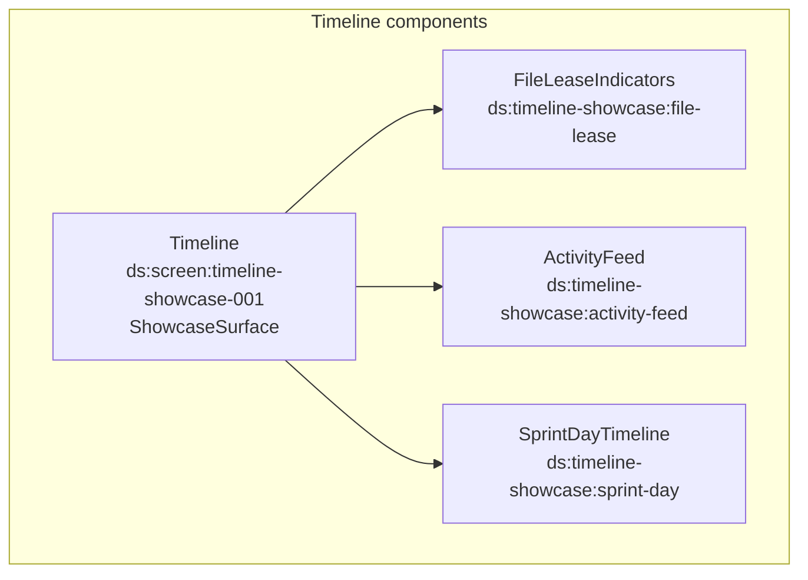
```mermaid
flowchart TD
    subgraph sg_screen_ds_timeline ["Timeline components"]
        n_ds_screen_timeline_showcase_001["Timeline<br/>ds:screen:timeline-showcase-001<br/>ShowcaseSurface"]
        n_ds_timeline_showcase_file_lease["FileLeaseIndicators<br/>ds:timeline-showcase:file-lease"]
        n_ds_screen_timeline_showcase_001 --> n_ds_timeline_showcase_file_lease
        n_ds_timeline_showcase_activity_feed["ActivityFeed<br/>ds:timeline-showcase:activity-feed"]
        n_ds_screen_timeline_showcase_001 --> n_ds_timeline_showcase_activity_feed
        n_ds_timeline_showcase_sprint_day["SprintDayTimeline<br/>ds:timeline-showcase:sprint-day"]
        n_ds_screen_timeline_showcase_001 --> n_ds_timeline_showcase_sprint_day
    end
```

### screen:ds-components — ds:screen:components-showcase-001

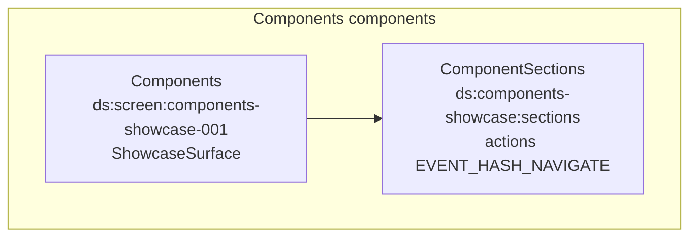
```mermaid
flowchart TD
    subgraph sg_screen_ds_components ["Components components"]
        n_ds_screen_components_showcase_001["Components<br/>ds:screen:components-showcase-001<br/>ShowcaseSurface"]
        n_ds_components_showcase_sections["ComponentSections<br/>ds:components-showcase:sections<br/>actions EVENT_HASH_NAVIGATE"]
        n_ds_screen_components_showcase_001 --> n_ds_components_showcase_sections
    end
```

### screen:ds-doc-viewer — ds:screen:doc-viewer-showcase-001

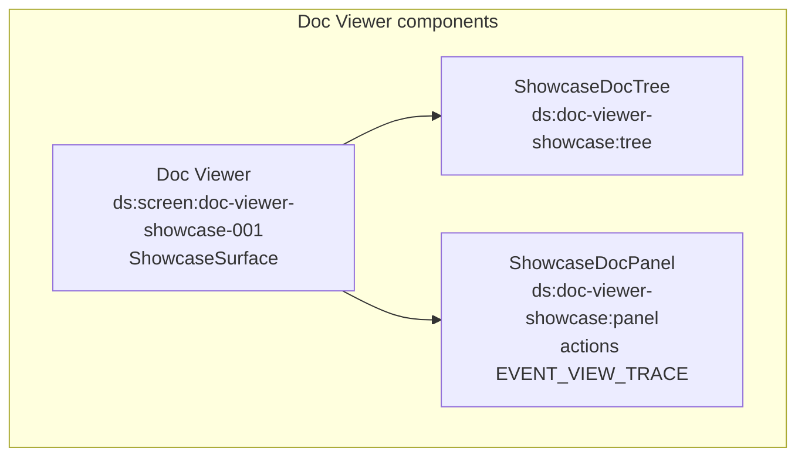
```mermaid
flowchart TD
    subgraph sg_screen_ds_doc_viewer ["Doc Viewer components"]
        n_ds_screen_doc_viewer_showcase_001["Doc Viewer<br/>ds:screen:doc-viewer-showcase-001<br/>ShowcaseSurface"]
        n_ds_doc_viewer_showcase_tree["ShowcaseDocTree<br/>ds:doc-viewer-showcase:tree"]
        n_ds_screen_doc_viewer_showcase_001 --> n_ds_doc_viewer_showcase_tree
        n_ds_doc_viewer_showcase_panel["ShowcaseDocPanel<br/>ds:doc-viewer-showcase:panel<br/>actions EVENT_VIEW_TRACE"]
        n_ds_screen_doc_viewer_showcase_001 --> n_ds_doc_viewer_showcase_panel
    end
```

### screen:ds-explorer — ds:screen:explorer-showcase-001

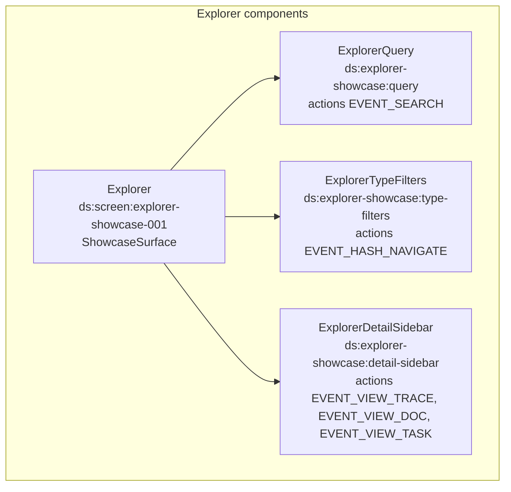
```mermaid
flowchart TD
    subgraph sg_screen_ds_explorer ["Explorer components"]
        n_ds_screen_explorer_showcase_001["Explorer<br/>ds:screen:explorer-showcase-001<br/>ShowcaseSurface"]
        n_ds_explorer_showcase_query["ExplorerQuery<br/>ds:explorer-showcase:query<br/>actions EVENT_SEARCH"]
        n_ds_screen_explorer_showcase_001 --> n_ds_explorer_showcase_query
        n_ds_explorer_showcase_type_filters["ExplorerTypeFilters<br/>ds:explorer-showcase:type-filters<br/>actions EVENT_HASH_NAVIGATE"]
        n_ds_screen_explorer_showcase_001 --> n_ds_explorer_showcase_type_filters
        n_ds_explorer_showcase_detail_sidebar["ExplorerDetailSidebar<br/>ds:explorer-showcase:detail-sidebar<br/>actions EVENT_VIEW_TRACE, EVENT_VIEW_DOC, EVENT_VIEW_TASK"]
        n_ds_screen_explorer_showcase_001 --> n_ds_explorer_showcase_detail_sidebar
    end
```

### screen:ds-beads-traversal — ds:screen:beads-traversal-showcase-001

```mermaid
flowchart TD
    subgraph sg_screen_ds_beads_traversal ["Beatraversal components"]
        n_ds_screen_beads_traversal_showcase_001["Beatraversal<br/>ds:screen:beads-traversal-showcase-001<br/>ShowcaseSurface"]
        n_ds_beads_traversal_showcase_layers["TraversalLayers<br/>ds:beads-traversal-showcase:layers"]
        n_ds_screen_beads_traversal_showcase_001 --> n_ds_beads_traversal_showcase_layers
        n_ds_beads_traversal_showcase_direction_toggle["DirectionToggle<br/>ds:beads-traversal-showcase:direction-toggle"]
        n_ds_screen_beads_traversal_showcase_001 --> n_ds_beads_traversal_showcase_direction_toggle
        n_ds_beads_traversal_showcase_detail_sidebar["TraversalDetailSidebar<br/>ds:beads-traversal-showcase:detail-sidebar"]
        n_ds_screen_beads_traversal_showcase_001 --> n_ds_beads_traversal_showcase_detail_sidebar
    end
```

### screen:ds-storyboard — ds:screen:storyboard-showcase-001

```mermaid
flowchart TD
    subgraph sg_screen_ds_storyboard ["Storyboard components"]
        n_ds_screen_storyboard_showcase_001["Storyboard<br/>ds:screen:storyboard-showcase-001<br/>ShowcaseSurface"]
        n_ds_storyboard_showcase_filter["JourneyFilter<br/>ds:storyboard-showcase:filter"]
        n_ds_screen_storyboard_showcase_001 --> n_ds_storyboard_showcase_filter
        n_ds_storyboard_showcase_flow["UsecaseFlow<br/>ds:storyboard-showcase:flow"]
        n_ds_screen_storyboard_showcase_001 --> n_ds_storyboard_showcase_flow
        n_ds_storyboard_showcase_guidance["GuidancePanel<br/>ds:storyboard-showcase:guidance"]
        n_ds_screen_storyboard_showcase_001 --> n_ds_storyboard_showcase_guidance
    end
```

### screen:ds-storyboard-detail — ds:screen:storyboard-detail-showcase-001

```mermaid
flowchart TD
    subgraph sg_screen_ds_storyboard_detail ["Storyboard Detail components"]
        n_ds_screen_storyboard_detail_showcase_001["Storyboard Detail<br/>ds:screen:storyboard-detail-showcase-001<br/>ShowcaseSurface"]
        n_ds_storyboard_detail_showcase_role["StoryboardRolePanel<br/>ds:storyboard-detail-showcase:role"]
        n_ds_screen_storyboard_detail_showcase_001 --> n_ds_storyboard_detail_showcase_role
        n_ds_storyboard_detail_showcase_steps["StepTimeline<br/>ds:storyboard-detail-showcase:steps"]
        n_ds_screen_storyboard_detail_showcase_001 --> n_ds_storyboard_detail_showcase_steps
        n_ds_storyboard_detail_showcase_related["RelatedUsecases<br/>ds:storyboard-detail-showcase:related"]
        n_ds_screen_storyboard_detail_showcase_001 --> n_ds_storyboard_detail_showcase_related
    end
```

### screen:ds-webui-pm-workspace — ds:screen:webui-pm-workspace-showcase-001

```mermaid
flowchart TD
    subgraph sg_screen_ds_webui_pm_workspace ["Webui Pm Workspace components"]
        n_ds_screen_webui_pm_workspace_showcase_001["Webui Pm Workspace<br/>ds:screen:webui-pm-workspace-showcase-001<br/>ShowcaseSurface"]
        n_ds_webui_pm_workspace_showcase_header["WorkspaceHeader<br/>ds:webui-pm-workspace-showcase:header<br/>actions EVENT_SEARCH, EVENT_DISCONNECT, EVENT_RECONNECT"]
        n_ds_screen_webui_pm_workspace_showcase_001 --> n_ds_webui_pm_workspace_showcase_header
        n_ds_webui_pm_workspace_showcase_sidebar["WorkspaceSidebar<br/>ds:webui-pm-workspace-showcase:sidebar"]
        n_ds_screen_webui_pm_workspace_showcase_001 --> n_ds_webui_pm_workspace_showcase_sidebar
        n_ds_webui_pm_workspace_showcase_boundary_actions["BoundaryActionBar<br/>ds:webui-pm-workspace-showcase:boundary-actions<br/>actions EVENT_BACK"]
        n_ds_screen_webui_pm_workspace_showcase_001 --> n_ds_webui_pm_workspace_showcase_boundary_actions
        n_ds_webui_pm_workspace_showcase_sync_conflict_banner["SyncConflictBanner<br/>ds:webui-pm-workspace-showcase:sync-conflict-banner<br/>actions EVENT_KEEP_LOCAL, EVENT_USE_SERVER"]
        n_ds_screen_webui_pm_workspace_showcase_001 --> n_ds_webui_pm_workspace_showcase_sync_conflict_banner
        n_ds_webui_pm_workspace_showcase_active_surface["WorkspaceSurface<br/>ds:webui-pm-workspace-showcase:active-surface"]
        n_ds_screen_webui_pm_workspace_showcase_001 --> n_ds_webui_pm_workspace_showcase_active_surface
    end
```

## 3. State Coverage Per Screen

Annotations: `loading` requires layout-matched skeletons, `empty` requires an actionable CTA, `error` requires retry/recovery copy, `offline` shows read-mostly or queued-write affordances, and `forbidden` provides a route-safe return action.

```mermaid
flowchart LR
    StateSet_default_loading_empty_error_offline_forbidden["states: default, loading, empty, error, offline, forbidden"]
    StateSet_default_loading_empty_error_offline_forbidden_saving["states: default, loading, empty, error, offline, forbidden, saving"]
    StateSet_default_loading_empty_error_offline_forbidden_saving_not_found["states: default, loading, empty, error, offline, forbidden, saving, not_found"]
    StateSet_default_loading_empty_error_offline_forbidden_partial["states: default, loading, empty, error, offline, forbidden, partial"]
    StateSet_default_loading_empty_error_offline_forbidden_not_found["states: default, loading, empty, error, offline, forbidden, not_found"]
    ST0["screen:rtm-dashboard<br/>/"] --> StateSet_default_loading_empty_error_offline_forbidden
    ST1["screen:safe-board<br/>/board"] --> StateSet_default_loading_empty_error_offline_forbidden
    ST2["screen:task-list<br/>/tasks"] --> StateSet_default_loading_empty_error_offline_forbidden_saving
    ST3["screen:task-detail<br/>/tasks/:id"] --> StateSet_default_loading_empty_error_offline_forbidden_saving_not_found
    ST4["screen:trace-explorer<br/>/trace/:id"] --> StateSet_default_loading_empty_error_offline_forbidden_partial
    ST5["screen:doc-viewer<br/>/docs"] --> StateSet_default_loading_empty_error_offline_forbidden
    ST6["screen:approval-gates<br/>/approval"] --> StateSet_default_loading_empty_error_offline_forbidden
    ST7["screen:search-results<br/>/search"] --> StateSet_default_loading_empty_error_offline_forbidden
    ST8["screen:ds-terminal<br/>/design-system/terminal"] --> StateSet_default_loading_empty_error_offline_forbidden
    ST9["screen:ds-portfolio<br/>/design-system/portfolio"] --> StateSet_default_loading_empty_error_offline_forbidden
    ST10["screen:ds-pi-planning<br/>/design-system/pi-planning"] --> StateSet_default_loading_empty_error_offline_forbidden
    ST11["screen:ds-git-graph<br/>/design-system/git-graph"] --> StateSet_default_loading_empty_error_offline_forbidden
    ST12["screen:ds-kanban<br/>/design-system/kanban"] --> StateSet_default_loading_empty_error_offline_forbidden
    ST13["screen:ds-knowledge-graph<br/>/design-system/knowledge-graph"] --> StateSet_default_loading_empty_error_offline_forbidden_partial
    ST14["screen:ds-approval<br/>/design-system/approval"] --> StateSet_default_loading_empty_error_offline_forbidden
    ST15["screen:ds-timeline<br/>/design-system/timeline"] --> StateSet_default_loading_empty_error_offline_forbidden
    ST16["screen:ds-components<br/>/design-system/components"] --> StateSet_default_loading_empty_error_offline_forbidden
    ST17["screen:ds-doc-viewer<br/>/design-system/doc-viewer"] --> StateSet_default_loading_empty_error_offline_forbidden
    ST18["screen:ds-explorer<br/>/design-system/explorer"] --> StateSet_default_loading_empty_error_offline_forbidden
    ST19["screen:ds-beads-traversal<br/>/design-system/beads-traversal"] --> StateSet_default_loading_empty_error_offline_forbidden
    ST20["screen:ds-storyboard<br/>/design-system/storyboard"] --> StateSet_default_loading_empty_error_offline_forbidden
    ST21["screen:ds-storyboard-detail<br/>/design-system/storyboard/:id"] --> StateSet_default_loading_empty_error_offline_forbidden_not_found
    ST22["screen:ds-webui-pm-workspace<br/>/design-system/webui-pm-workspace"] --> StateSet_default_loading_empty_error_offline_forbidden
```

## 4. Action-to-Event Links

Annotations: every action links the YAML action ID to its Mermaid event and API or browser data-flow boundary. Write actions use optimistic updates with rollback on API error; browser-only hash navigation never calls local shell, git, FrankenSQLite, Zvec, `gh`, or FastCode directly.

### ds:action:disconnect → EVENT_DISCONNECT

```mermaid
flowchart LR
    subgraph action_ds_action_disconnect ["ds:action:disconnect"]

        src_ds_action_disconnect["Show offline read-only banner"]
        evt_EVENT_DISCONNECT(("EVENT_DISCONNECT"))
        api_ds_action_disconnect["GET /api/health failure or stream disconnect"]
        src_ds_action_disconnect --> evt_EVENT_DISCONNECT
        evt_EVENT_DISCONNECT --> api_ds_action_disconnect
    end
```

### ds:action:reconnect → EVENT_RECONNECT

```mermaid
flowchart LR
    subgraph action_ds_action_reconnect ["ds:action:reconnect"]

        src_ds_action_reconnect["Rehydrate queued edits"]
        evt_EVENT_RECONNECT(("EVENT_RECONNECT"))
        api_ds_action_reconnect["POST /api/sync/rehydrate after health check recovery"]
        src_ds_action_reconnect --> evt_EVENT_RECONNECT
        evt_EVENT_RECONNECT --> api_ds_action_reconnect
    end
```

### ds:action:save-task → EVENT_SAVE_TASK

```mermaid
flowchart LR
    subgraph action_ds_action_save_task ["ds:action:save-task"]

        src_ds_action_save_task["Persist editable task fields"]
        evt_EVENT_SAVE_TASK(("EVENT_SAVE_TASK"))
        api_ds_action_save_task["PUT /api/tasks/:id"]
        src_ds_action_save_task --> evt_EVENT_SAVE_TASK
        evt_EVENT_SAVE_TASK --> api_ds_action_save_task
    end
```

### ds:action:save-bulk → EVENT_SAVE_BULK

```mermaid
flowchart LR
    subgraph action_ds_action_save_bulk ["ds:action:save-bulk"]

        src_ds_action_save_bulk["Persist selected task bulk updates"]
        evt_EVENT_SAVE_BULK(("EVENT_SAVE_BULK"))
        api_ds_action_save_bulk["PUT /api/tasks/bulk"]
        src_ds_action_save_bulk --> evt_EVENT_SAVE_BULK
        evt_EVENT_SAVE_BULK --> api_ds_action_save_bulk
    end
```

### ds:action:save-board → EVENT_MOVE_CARD

```mermaid
flowchart LR
    subgraph action_ds_action_save_board ["ds:action:save-board"]

        src_ds_action_save_board["Persist kanban card movement"]
        evt_EVENT_MOVE_CARD(("EVENT_MOVE_CARD"))
        api_ds_action_save_board["PUT /api/tasks/:id/status"]
        src_ds_action_save_board --> evt_EVENT_MOVE_CARD
        evt_EVENT_MOVE_CARD --> api_ds_action_save_board
    end
```

### ds:action:approval-decision → EVENT_APPROVAL_DECISION

```mermaid
flowchart LR
    subgraph action_ds_action_approval_decision ["ds:action:approval-decision"]

        src_ds_action_approval_decision["Submit approval or rejection with audit reason"]
        evt_EVENT_APPROVAL_DECISION(("EVENT_APPROVAL_DECISION"))
        api_ds_action_approval_decision["POST /api/approval/:id/decision"]
        src_ds_action_approval_decision --> evt_EVENT_APPROVAL_DECISION
        evt_EVENT_APPROVAL_DECISION --> api_ds_action_approval_decision
    end
```

### ds:action:pi-plan-save → EVENT_PI_PLAN_SAVE

```mermaid
flowchart LR
    subgraph action_ds_action_pi_plan_save ["ds:action:pi-plan-save"]

        src_ds_action_pi_plan_save["Save PI planning sandbox changes"]
        evt_EVENT_PI_PLAN_SAVE(("EVENT_PI_PLAN_SAVE"))
        api_ds_action_pi_plan_save["PUT /api/pi/plan"]
        src_ds_action_pi_plan_save --> evt_EVENT_PI_PLAN_SAVE
        evt_EVENT_PI_PLAN_SAVE --> api_ds_action_pi_plan_save
    end
```

### ds:action:confidence-vote → EVENT_CONFIDENCE_VOTE

```mermaid
flowchart LR
    subgraph action_ds_action_confidence_vote ["ds:action:confidence-vote"]

        src_ds_action_confidence_vote["Submit PI confidence vote"]
        evt_EVENT_CONFIDENCE_VOTE(("EVENT_CONFIDENCE_VOTE"))
        api_ds_action_confidence_vote["POST /api/pi/confidence-vote"]
        src_ds_action_confidence_vote --> evt_EVENT_CONFIDENCE_VOTE
        evt_EVENT_CONFIDENCE_VOTE --> api_ds_action_confidence_vote
    end
```

### ds:action:view-doc → EVENT_VIEW_DOC

```mermaid
flowchart LR
    subgraph action_ds_action_view_doc ["ds:action:view-doc"]

        src_ds_action_view_doc["Open document viewer"]
        evt_EVENT_VIEW_DOC(("EVENT_VIEW_DOC"))
        api_ds_action_view_doc["GET /api/docs/:id"]
        src_ds_action_view_doc --> evt_EVENT_VIEW_DOC
        evt_EVENT_VIEW_DOC --> api_ds_action_view_doc
    end
```

### ds:action:view-task → EVENT_VIEW_TASK

```mermaid
flowchart LR
    subgraph action_ds_action_view_task ["ds:action:view-task"]

        src_ds_action_view_task["Open task detail"]
        evt_EVENT_VIEW_TASK(("EVENT_VIEW_TASK"))
        api_ds_action_view_task["GET /api/tasks/:id"]
        src_ds_action_view_task --> evt_EVENT_VIEW_TASK
        evt_EVENT_VIEW_TASK --> api_ds_action_view_task
    end
```

### ds:action:view-trace → EVENT_VIEW_TRACE

```mermaid
flowchart LR
    subgraph action_ds_action_view_trace ["ds:action:view-trace"]

        src_ds_action_view_trace["Open Beads trace explorer"]
        evt_EVENT_VIEW_TRACE(("EVENT_VIEW_TRACE"))
        api_ds_action_view_trace["GET /api/trace/:id?depth=full"]
        src_ds_action_view_trace --> evt_EVENT_VIEW_TRACE
        evt_EVENT_VIEW_TRACE --> api_ds_action_view_trace
    end
```

### ds:action:search → EVENT_SEARCH

```mermaid
flowchart LR
    subgraph action_ds_action_search ["ds:action:search"]

        src_ds_action_search["Run global search"]
        evt_EVENT_SEARCH(("EVENT_SEARCH"))
        api_ds_action_search["GET /api/search?q=<query>&type=<type>"]
        src_ds_action_search --> evt_EVENT_SEARCH
        evt_EVENT_SEARCH --> api_ds_action_search
    end
```

### ds:action:hash-nav → EVENT_HASH_NAVIGATE

```mermaid
flowchart LR
    subgraph action_ds_action_hash_nav ["ds:action:hash-nav"]

        src_ds_action_hash_nav["Update same-route or cross-route showcase hash navigation"]
        evt_EVENT_HASH_NAVIGATE(("EVENT_HASH_NAVIGATE"))
        api_ds_action_hash_nav["browser hashchange plus route component state"]
        src_ds_action_hash_nav --> evt_EVENT_HASH_NAVIGATE
        evt_EVENT_HASH_NAVIGATE --> api_ds_action_hash_nav
    end
```

### ds:action:refresh → EVENT_REFRESH

```mermaid
flowchart LR
    subgraph action_ds_action_refresh ["ds:action:refresh"]

        src_ds_action_refresh["Refresh route data after retry or evidence update"]
        evt_EVENT_REFRESH(("EVENT_REFRESH"))
        api_ds_action_refresh["route-specific GET endpoints"]
        src_ds_action_refresh --> evt_EVENT_REFRESH
        evt_EVENT_REFRESH --> api_ds_action_refresh
    end
```

### ds:action:back → EVENT_BACK

```mermaid
flowchart LR
    subgraph action_ds_action_back ["ds:action:back"]

        src_ds_action_back["Return from boundary state to the last safe route"]
        evt_EVENT_BACK(("EVENT_BACK"))
        api_ds_action_back["client history back or route-safe fallback to core workspace route"]
        src_ds_action_back --> evt_EVENT_BACK
        evt_EVENT_BACK --> api_ds_action_back
        cmp_0_ds_webui_pm_workspace_showcase_boundary_actions["source ds:webui-pm-workspace-showcase:boundary-actions"] --> src_ds_action_back
    end
```

### ds:action:keep-local → EVENT_KEEP_LOCAL

```mermaid
flowchart LR
    subgraph action_ds_action_keep_local ["ds:action:keep-local"]

        src_ds_action_keep_local["Keep queued local edits during sync conflict resolution"]
        evt_EVENT_KEEP_LOCAL(("EVENT_KEEP_LOCAL"))
        api_ds_action_keep_local["POST /api/sync/conflicts/:id/resolve with resolution=keep_local"]
        src_ds_action_keep_local --> evt_EVENT_KEEP_LOCAL
        evt_EVENT_KEEP_LOCAL --> api_ds_action_keep_local
        cmp_0_ds_webui_pm_workspace_showcase_sync_conflict_banner["source ds:webui-pm-workspace-showcase:sync-conflict-banner"] --> src_ds_action_keep_local
    end
```

### ds:action:use-server → EVENT_USE_SERVER

```mermaid
flowchart LR
    subgraph action_ds_action_use_server ["ds:action:use-server"]

        src_ds_action_use_server["Replace queued local edits with the server version during sync conflict resolution"]
        evt_EVENT_USE_SERVER(("EVENT_USE_SERVER"))
        api_ds_action_use_server["POST /api/sync/conflicts/:id/resolve with resolution=use_server"]
        src_ds_action_use_server --> evt_EVENT_USE_SERVER
        evt_EVENT_USE_SERVER --> api_ds_action_use_server
        cmp_0_ds_webui_pm_workspace_showcase_sync_conflict_banner["source ds:webui-pm-workspace-showcase:sync-conflict-banner"] --> src_ds_action_use_server
    end
```

## 5. Responsive Layout Intent by Viewport

Annotations: desktop keeps persistent shell and multi-panel review surfaces; tablet condenses navigation and converts secondary panels to drawers or bottom sheets; mobile uses single-column flow, overlay sidebar, full-screen drawers, table-to-card fallback, and simplified graph/tree fallbacks where needed.

```mermaid
flowchart TD
    ShellIntent["Global shell responsive contract"]
    VP_desktop["desktop 1440px<br/>persistent shell, expanded sidebar, multi-panel layouts"]
    ShellIntent --> VP_desktop
    VP_tablet["tablet 1024px<br/>condensed sidebar, stacked secondary panels, horizontal scroll where boards overflow"]
    ShellIntent --> VP_tablet
    VP_mobile["mobile 390px<br/>single-column flow, sidebar as overlay, drawers as full-screen overlays, tables become cards"]
    ShellIntent --> VP_mobile
    Rule_ds_rule_shell_desktop["ds:rule:shell-desktop<br/>header, sidebar, footer, and main surface are visible together"]
    VP_desktop --> Rule_ds_rule_shell_desktop
    Rule_ds_rule_shell_tablet["ds:rule:shell-tablet<br/>navigation collapses to icon rail; detail panels become drawers or bottom sheets"]
    VP_tablet --> Rule_ds_rule_shell_tablet
    Rule_ds_rule_shell_mobile["ds:rule:shell-mobile<br/>hamburger opens overlay sidebar; graph-heavy views may render tree/list fallback"]
    VP_mobile --> Rule_ds_rule_shell_mobile
    DesktopScreens["desktop: 2x2 dashboards, side panels, tables, graph canvases"]
    TabletScreens["tablet: condensed sidebar, horizontal board scroll, drawers or bottom sheets"]
    MobileScreens["mobile: one-column cards, overlay nav, full-screen drawers, graph list fallback"]
    VP_desktop --> DesktopScreens
    VP_tablet --> TabletScreens
    VP_mobile --> MobileScreens
    RS0["screen:rtm-dashboard<br/>four-panel RTM dashboard with KPI row, coverage heatmap, task progress, knowledge graph, and gap analysis"]
    DesktopScreens --> RS0
    MobileScreens --> RS0
    RS1["screen:safe-board<br/>portfolio, ART, and team kanban views with WIP and RTE escalation badges"]
    DesktopScreens --> RS1
    MobileScreens --> RS1
    RS2["screen:task-list<br/>sortable data table with filters, pagination, CSV export, and bulk action bar"]
    DesktopScreens --> RS2
    MobileScreens --> RS2
    RS3["screen:task-detail<br/>editable task header with Detail, Activity, Graph, and Code tabs"]
    DesktopScreens --> RS3
    MobileScreens --> RS3
    RS4["screen:trace-explorer<br/>full-page graph canvas with toolbar, filters, legend, and detail panel"]
    DesktopScreens --> RS4
    MobileScreens --> RS4
    RS5["screen:doc-viewer<br/>source-type document tree and rendered content panel"]
    DesktopScreens --> RS5
    MobileScreens --> RS5
    RS6["screen:approval-gates<br/>Level 3 approval workspace with queue, evidence, PRD context, and decision controls"]
    DesktopScreens --> RS6
    MobileScreens --> RS6
    RS7["screen:search-results<br/>global search input, filter sidebar, grouped results, and instant suggestions"]
    DesktopScreens --> RS7
    MobileScreens --> RS7
    RS8["screen:ds-terminal<br/>scenario tabs with 2x2 terminal mosaic"]
    DesktopScreens --> RS8
    RS9["screen:ds-portfolio<br/>executive portfolio table with roadmap quarters"]
    DesktopScreens --> RS9
    MobileScreens --> RS9
    RS10["screen:ds-pi-planning<br/>two-column PI planning sandbox, scoring, vote, and ROAM board"]
    DesktopScreens --> RS10
    MobileScreens --> RS10
    RS11["screen:ds-git-graph<br/>hash-selected git graph scenarios with branches, commits, connections, tags, and stats"]
    DesktopScreens --> RS11
    MobileScreens --> RS11
    RS12["screen:ds-kanban<br/>board selector with draggable cards, WIP badges, and board stats"]
    DesktopScreens --> RS12
    RS13["screen:ds-knowledge-graph<br/>client-only Sigma graph viewer with preset tabs, selected-node banner, legend, and stats"]
    DesktopScreens --> RS13
    MobileScreens --> RS13
    RS14["screen:ds-approval<br/>approval panels with status toggles, evidence blocks, RTM matrix, and coverage heatmap"]
    DesktopScreens --> RS14
    MobileScreens --> RS14
    RS15["screen:ds-timeline<br/>file lease indicators, activity feed, and sprint day timeline"]
    DesktopScreens --> RS15
    RS16["screen:ds-components<br/>catalog of 18 shared design-system sections with hash scroll and interactive examples"]
    DesktopScreens --> RS16
    RS17["screen:ds-doc-viewer<br/>GitHub-like file tree with selected document panel and Beads badges"]
    DesktopScreens --> RS17
    MobileScreens --> RS17
    RS18["screen:ds-explorer<br/>unified search, type filters, result list, and detail sidebar"]
    DesktopScreens --> RS18
    MobileScreens --> RS18
    RS19["screen:ds-beads-traversal<br/>layered DAG from PRD sections to plan elements, tasks, and commits"]
    DesktopScreens --> RS19
    RS20["screen:ds-storyboard<br/>journey filter, horizontal use-case flow, guidance panel, and CTA to real screen"]
    DesktopScreens --> RS20
    MobileScreens --> RS20
    RS21["screen:ds-storyboard-detail<br/>dynamic storyboard detail with role, journey, step timeline, and related use cases"]
    DesktopScreens --> RS21
    MobileScreens --> RS21
    RS22["screen:ds-webui-pm-workspace<br/>integrated shell with header, search, offline indicator, sidebar nav, and active PM surfaces"]
    DesktopScreens --> RS22
    MobileScreens --> RS22
```

## 6. Mermaid Logic Machine States and Transitions

```mermaid
stateDiagram-v2
    direction LR
    [*] --> GlobalShell
    GlobalShell --> LoadingState : ROUTE_ENTER
    LoadingState --> CoreRoute : API_SUCCESS_CORE
    LoadingState --> ShowcaseRoute : API_SUCCESS_SHOWCASE
    LoadingState --> EmptyState : API_EMPTY
    LoadingState --> PermissionDenied : API_FORBIDDEN
    LoadingState --> ErrorState : API_ERROR
    LoadingState --> NotFoundState : API_NOT_FOUND
    LoadingState --> PartialState : API_PARTIAL_ENRICHMENT

    CoreRoute --> TaskDetailRoute : EVENT_VIEW_TASK
    CoreRoute --> TraceExplorerRoute : EVENT_VIEW_TRACE
    CoreRoute --> DocViewerRoute : EVENT_VIEW_DOC
    CoreRoute --> SearchRoute : EVENT_SEARCH
    CoreRoute --> LoadingState : EVENT_REFRESH
    CoreRoute --> SavingState : EVENT_SAVE_TASK
    CoreRoute --> SavingState : EVENT_SAVE_BULK
    CoreRoute --> SavingState : EVENT_MOVE_CARD
    CoreRoute --> ApprovalDecisionState : EVENT_APPROVAL_DECISION

    ShowcaseRoute --> ShowcaseRoute : EVENT_HASH_NAVIGATE
    ShowcaseRoute --> TaskDetailRoute : EVENT_VIEW_TASK
    ShowcaseRoute --> TraceExplorerRoute : EVENT_VIEW_TRACE
    ShowcaseRoute --> DocViewerRoute : EVENT_VIEW_DOC
    ShowcaseRoute --> SearchRoute : EVENT_SEARCH
    ShowcaseRoute --> LoadingState : EVENT_REFRESH
    ShowcaseRoute --> SavingState : EVENT_MOVE_CARD
    ShowcaseRoute --> PiPlanningSaveState : EVENT_PI_PLAN_SAVE
    ShowcaseRoute --> PiPlanningVoteState : EVENT_CONFIDENCE_VOTE
    ShowcaseRoute --> ApprovalDecisionState : EVENT_APPROVAL_DECISION

    TaskDetailRoute --> TraceExplorerRoute : EVENT_VIEW_TRACE
    TaskDetailRoute --> DocViewerRoute : EVENT_VIEW_DOC
    TraceExplorerRoute --> TaskDetailRoute : EVENT_VIEW_TASK
    TraceExplorerRoute --> DocViewerRoute : EVENT_VIEW_DOC
    DocViewerRoute --> TraceExplorerRoute : EVENT_VIEW_TRACE
    SearchRoute --> TaskDetailRoute : EVENT_VIEW_TASK
    SearchRoute --> DocViewerRoute : EVENT_VIEW_DOC
    SearchRoute --> TraceExplorerRoute : EVENT_VIEW_TRACE

    SavingState --> CoreRoute : API_SUCCESS
    SavingState --> ErrorState : API_ERROR_ROLLBACK
    SavingState --> OfflineState : API_OFFLINE_QUEUE
    ApprovalDecisionState --> SuccessState : API_APPROVAL_SUCCESS
    ApprovalDecisionState --> ErrorState : API_APPROVAL_ERROR
    ApprovalDecisionState --> PermissionDenied : API_APPROVAL_FORBIDDEN
    PiPlanningSaveState --> SuccessState : API_PI_SAVE_SUCCESS
    PiPlanningSaveState --> ErrorState : API_PI_SAVE_ERROR
    PiPlanningVoteState --> SuccessState : API_VOTE_SUCCESS
    PiPlanningVoteState --> ErrorState : API_VOTE_ERROR

    GlobalShell --> OfflineState : EVENT_DISCONNECT
    CoreRoute --> OfflineState : EVENT_DISCONNECT
    ShowcaseRoute --> OfflineState : EVENT_DISCONNECT
    OfflineState --> RehydratingState : EVENT_RECONNECT
    RehydratingState --> ConflictResolution : API_CONFLICT
    ConflictResolution --> RehydratingState : EVENT_KEEP_LOCAL
    ConflictResolution --> RehydratingState : EVENT_USE_SERVER
    RehydratingState --> GlobalShell : API_SYNC_SUCCESS
    RehydratingState --> ErrorState : API_SYNC_ERROR

    EmptyState --> LoadingState : EVENT_REFRESH
    ErrorState --> LoadingState : EVENT_REFRESH
    PartialState --> LoadingState : EVENT_REFRESH
    SuccessState --> LoadingState : EVENT_REFRESH
    PermissionDenied --> GlobalShell : EVENT_BACK
    NotFoundState --> GlobalShell : EVENT_BACK
    ErrorState --> GlobalShell : EVENT_BACK
```

## 7. Required Showcase Route and DS ID Coverage

```mermaid
flowchart LR
    Required["PRD-04 required showcase coverage"]
    Q0["/design-system/terminal<br/>screen:ds-terminal<br/>ds:screen:terminal-showcase-001<br/>ds:screen:terminal-001"]
    Required --> Q0
    Q1["/design-system/portfolio<br/>screen:ds-portfolio<br/>ds:screen:portfolio-showcase-001<br/>br-ds-portfolio-view"]
    Required --> Q1
    Q2["/design-system/pi-planning<br/>screen:ds-pi-planning<br/>ds:screen:pi-planning-showcase-001<br/>br-ds-pi-planning"]
    Required --> Q2
    Q3["/design-system/git-graph<br/>screen:ds-git-graph<br/>ds:screen:git-graph-showcase-001<br/>ds:screen:git-graph-001"]
    Required --> Q3
    Q4["/design-system/kanban<br/>screen:ds-kanban<br/>ds:screen:kanban-showcase-001<br/>ds:screen:kanban-001"]
    Required --> Q4
    Q5["/design-system/knowledge-graph<br/>screen:ds-knowledge-graph<br/>ds:screen:knowledge-graph-showcase-001<br/>ds:screen:knowledge-graph-001"]
    Required --> Q5
    Q6["/design-system/approval<br/>screen:ds-approval<br/>ds:screen:approval-showcase-001<br/>ds:screen:approval-001"]
    Required --> Q6
    Q7["/design-system/timeline<br/>screen:ds-timeline<br/>ds:screen:timeline-showcase-001<br/>ds:screen:timeline-001"]
    Required --> Q7
    Q8["/design-system/components<br/>screen:ds-components<br/>ds:screen:components-showcase-001<br/>ds:screen:components-001"]
    Required --> Q8
    Q9["/design-system/doc-viewer<br/>screen:ds-doc-viewer<br/>ds:screen:doc-viewer-showcase-001<br/>ds:screen:doc-viewer-001"]
    Required --> Q9
    Q10["/design-system/explorer<br/>screen:ds-explorer<br/>ds:screen:explorer-showcase-001<br/>ds:screen:explorer-001"]
    Required --> Q10
    Q11["/design-system/beads-traversal<br/>screen:ds-beads-traversal<br/>ds:screen:beads-traversal-showcase-001<br/>ds:screen:beads-traversal-001"]
    Required --> Q11
    Q12["/design-system/storyboard<br/>screen:ds-storyboard<br/>ds:screen:storyboard-showcase-001<br/>ds:screen:storyboard-001"]
    Required --> Q12
    Q13["/design-system/storyboard/:id<br/>screen:ds-storyboard-detail<br/>ds:screen:storyboard-detail-showcase-001<br/>ds:screen:storyboard-001"]
    Required --> Q13
    Q14["/design-system/webui-pm-workspace<br/>screen:ds-webui-pm-workspace<br/>ds:screen:webui-pm-workspace-showcase-001<br/>ds:global_shell"]
    Required --> Q14
```

## 8. Core API Boundary Mapping for Gate A

Annotations: Core WebUI mappings are shown as API-only browser boundaries. Aggregation of FrankenSQLite, Zvec, local git, GitHub `gh`, FastCode, and shell data remains backend-only behind `gmind serve`.

```mermaid
flowchart LR
    Browser["Browser UI<br/>route components and showcase shell"]
    API["gmind serve Go REST API"]
    Backend["Backend-only sources<br/>FrankenSQLite Zvec git gh FastCode shell"]
    Browser --> API
    API --> Backend
    API0["screen:rtm-dashboard<br/>GET /api/coverage<br/>GET /api/tasks<br/>GET /api/trace/:id?depth=2<br/>GET /api/gaps"]
    Browser --> API0
    API0 --> API
    API1["screen:safe-board<br/>GET /api/tasks?view=board&level=<level><br/>PUT /api/tasks/:id/status<br/>GET /api/tasks/:id/activity"]
    Browser --> API1
    API1 --> API
    API2["screen:task-list<br/>GET /api/tasks?format=list<br/>PUT /api/tasks/bulk"]
    Browser --> API2
    API2 --> API
    API3["screen:task-detail<br/>GET /api/tasks/:id<br/>GET /api/tasks/:id/activity<br/>GET /api/trace/:id?depth=2<br/>PUT /api/tasks/:id"]
    Browser --> API3
    API3 --> API
    API4["screen:trace-explorer<br/>GET /api/trace/:id?depth=full<br/>GET /api/impact/:section"]
    Browser --> API4
    API4 --> API
    API5["screen:doc-viewer<br/>GET /api/docs?group=source_type<br/>GET /api/docs/:id<br/>GET /api/coverage?prd=<beads-id>"]
    Browser --> API5
    API5 --> API
    API6["screen:approval-gates<br/>GET /api/tasks?status=pending-approval<br/>GET /api/approval/:id/evidence<br/>POST /api/approval/:id/decision<br/>GET /api/coverage"]
    Browser --> API6
    API6 --> API
    API7["screen:search-results<br/>GET /api/search?q=<query>&type=<type>"]
    Browser --> API7
    API7 --> API
    API8["screen:ds-terminal<br/>GET /api/agents/sessions<br/>GET /api/ci/runs<br/>GET /api/tasks/:id/activity<br/>GET /api/log-events?stream=terminal"]
    Browser --> API8
    API8 --> API
    API9["screen:ds-portfolio<br/>GET /api/portfolio/epics<br/>GET /api/tasks?issue_type=epic"]
    Browser --> API9
    API9 --> API
    API10["screen:ds-pi-planning<br/>GET /api/pi/features<br/>PUT /api/pi/plan<br/>GET /api/risks?view=roam<br/>POST /api/pi/confidence-vote"]
    Browser --> API10
    API10 --> API
    API11["screen:ds-git-graph<br/>GET /api/git/graph?scenario=<id><br/>GET /api/trace/:id?include=git"]
    Browser --> API11
    API11 --> API
    API12["screen:ds-kanban<br/>GET /api/tasks?view=board&board=<id><br/>PUT /api/tasks/:id/status"]
    Browser --> API12
    API12 --> API
    API13["screen:ds-knowledge-graph<br/>GET /api/trace/:id?depth=full<br/>GET /api/graph/presets"]
    Browser --> API13
    API13 --> API
    API14["screen:ds-approval<br/>GET /api/tasks?status=pending-approval<br/>GET /api/coverage<br/>GET /api/approval/:id/evidence<br/>POST /api/approval/:id/decision"]
    Browser --> API14
    API14 --> API
    API15["screen:ds-timeline<br/>GET /api/activity<br/>GET /api/file-leases<br/>GET /api/tasks/:id/activity"]
    Browser --> API15
    API15 --> API
    API16["screen:ds-components<br/>GET /api/design-system/components"]
    Browser --> API16
    API16 --> API
    API17["screen:ds-doc-viewer<br/>GET /api/docs?group=source_type<br/>GET /api/docs/:id"]
    Browser --> API17
    API17 --> API
    API18["screen:ds-explorer<br/>GET /api/search?q=<query>&type=<type>"]
    Browser --> API18
    API18 --> API
    API19["screen:ds-beads-traversal<br/>GET /api/trace/:id?depth=full"]
    Browser --> API19
    API19 --> API
    API20["screen:ds-storyboard<br/>GET /api/storyboards"]
    Browser --> API20
    API20 --> API
    API21["screen:ds-storyboard-detail<br/>GET /api/storyboards/:id"]
    Browser --> API21
    API21 --> API
    API22["screen:ds-webui-pm-workspace<br/>GET /api/coverage<br/>GET /api/tasks<br/>GET /api/trace/:id<br/>GET /api/docs"]
    Browser --> API22
    API22 --> API
```
