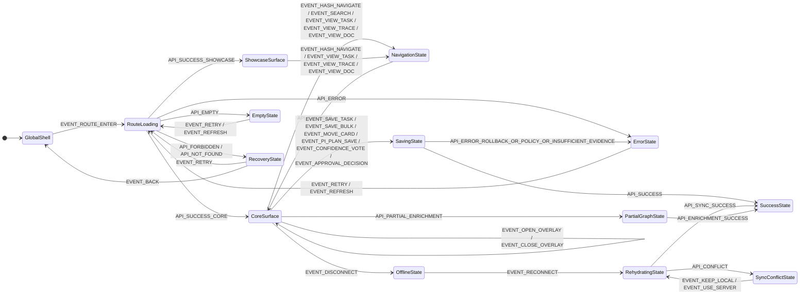

<!-- beads-id: br-design-contract-webui-pm-workspace -->
# UI Contract: WebUI PM Workspace

Canonical Ralph Loop Stage 1 contract for PRD-04 WebUI PM Workspace. This review unit defines the YAML View Blueprint and a minimal Logic Machine container only. It normalizes the feature slug to `webui-and-pm-workspace`, maps all PRD §8 showcase routes to Core WebUI routes, and preserves the data boundary that browser UI consumes only the Go REST API exposed by `gmind serve`.

```yaml
metadata:
  feature: webui-and-pm-workspace
  title: WebUI PM Workspace
  canonical_contract: docs/design/contracts/webui-and-pm-workspace/ui-contract.md
  source_prd:
    path: docs/PRDs/core-gmind/PRD-04-WebUI-and-PM-Workspace.md
    title: PRD 04 WebUI and PM Workspace
    route_map_section: br-prd04-s8
  satisfies:
    - br-prd04
    - br-prd04-s1
    - br-prd04-s2
    - br-prd04-s3
    - br-prd04-s4
    - br-prd04-s5
    - br-prd04-s6
    - br-prd04-s7
    - br-prd04-s8
    - br-prd04-s9
    - br-prd04-s10
    - br-prd04-s10.3a
    - br-prd04-s11
    - br-prd04-s12
    - br-prd04-s13
    - br-prd04-s14
    - br-prd04-s15
    - br-prd04-s16
    - br-prd04-s17
    - br-prd04-s18
    - br-prd04-s18a
  stage: stage1
  artifact_policy:
    source_of_truth: ui-contract.md
    forbidden_contract_source: contract.yaml
    stage1_output_root: docs/design/contracts/webui-and-pm-workspace
    stage2_page: apps/website/src/app/design-system/webui-pm-workspace/page.tsx
  coverage_summary:
    showcase_routes_defined: 15
    core_route_families_defined: 18
    screens_defined: 18
    viewports_defined: 3
    yaml_actions_defined: 20
viewports:
  - name: desktop
    width: 1440
    rules:
      - Expanded shell sidebar and persistent header/footer.
      - Multi-panel screens use split views or grids.
      - Graph detail panels remain visible beside canvas.
  - name: tablet
    width: 1024
    rules:
      - Sidebar condenses to icon rail with tooltips.
      - Detail panels become drawers or bottom sheets.
      - Kanban and tables may scroll horizontally.
  - name: mobile
    width: 390
    rules:
      - Sidebar is hamburger-triggered overlay.
      - Tables become card lists and tabs may become accordions.
      - Drawers become full-screen overlays and graph-heavy screens offer tree fallback.
principles:
  data_flow_boundaries:
    browser_allowed:
      - Go REST API from gmind serve
      - Static embedded assets from the Go binary
      - Client cache for read-only offline state
      - Local queue metadata for pending writes
    browser_forbidden:
      - Direct FrankenSQLite read or write
      - Direct Zvec query
      - Local git command or repository read
      - GitHub gh CLI call
      - FastCode direct access
      - Shell command execution
      - CI provider direct mutation
    backend_responsibilities:
      - Aggregate FrankenSQLite, Zvec, local git, GitHub, FastCode, shell, and CI data.
      - Return normalized JSON and event stream payloads through Go REST endpoints.
      - Enforce authorization, rate limits, and audit logging before browser data is returned.
  accessibility_defaults:
    - WCAG AA contrast and visible focus indicators.
    - Keyboard access for routes, tabs, filters, tables, cards, graph controls, and dialogs.
    - Every state color has visible text label and aria-label where status is compact.
    - Error, offline, saving, and sync messages use aria-live polite unless destructive.
    - Escape closes modal, drawer, dropdown, and command palette through shared keyboard handling.
  boundary_states:
    default: Render live API data with route-specific interactions enabled.
    loading: Use layout-matched skeletons; avoid standalone spinner-only pages.
    empty: Show specific empty copy plus create, clear filter, reindex, or retry CTA.
    error: Show concise cause, retry action, and safe route fallback.
    offline: Show top banner, preserve navigation, use read-only cache, queue eligible writes.
    forbidden: Explain missing permission and provide safe return action.
    partial: Show local graph or cached data while enrichment continues.
    saving: Disable edited controls, show inline progress, rollback on API error.
    not_found: Show missing entity message with parent-list link.
    sync_conflict: Let user choose Keep local edit or Use server version with audit trail.
  responsive_constraints:
    shell: Desktop expanded, tablet icon rail, mobile overlay.
    board: Desktop horizontal kanban, tablet horizontal scroll, mobile card/list stack.
    graphs: Desktop canvas plus detail, tablet bottom sheet, mobile tree or simplified graph.
    approval: Desktop queue/evidence/decision split, tablet stacked, mobile fixed decision bar.
    documents: Desktop tree plus content, tablet selector plus content, mobile list/detail swap.
api_contracts:
  realtime:
    polling_interval: 3 to 5 seconds for events table derived updates
    health_check: GET /api/health
    rehydrate: POST /api/sync/rehydrate
    conflict_resolution: POST /api/sync/conflicts/:id/resolve
  shared_endpoints:
    - GET /api/coverage
    - GET /api/gaps
    - GET /api/search?q=<query>&type=<type>
    - GET /api/tasks
    - GET /api/tasks/:id
    - PUT /api/tasks/:id
    - PUT /api/tasks/bulk
    - GET /api/trace/:id?depth=full
    - GET /api/docs?group=source_type
    - GET /api/docs/:id
actions:
  - id: ds:action:route-enter
    event: EVENT_ROUTE_ENTER
    label: Load route data through Go REST API
  - id: ds:action:hash-navigate
    event: EVENT_HASH_NAVIGATE
    label: Update hash-selected tab, scenario, anchor, preset, or board
  - id: ds:action:refresh
    event: EVENT_REFRESH
    label: Retry or manually refresh current route data
  - id: ds:action:retry
    event: EVENT_RETRY
    label: Retry failed API load from error, empty, or recovery state
  - id: ds:action:search
    event: EVENT_SEARCH
    label: Run global or explorer search
  - id: ds:action:view-task
    event: EVENT_VIEW_TASK
    label: Navigate to task detail
  - id: ds:action:view-trace
    event: EVENT_VIEW_TRACE
    label: Navigate to Trace Explorer or Beads Traversal context
  - id: ds:action:view-doc
    event: EVENT_VIEW_DOC
    label: Navigate to Document Viewer
  - id: ds:action:save-task
    event: EVENT_SAVE_TASK
    label: Save editable task field through PUT /api/tasks/:id
  - id: ds:action:bulk-update
    event: EVENT_SAVE_BULK
    label: Save selected task bulk updates through PUT /api/tasks/bulk
  - id: ds:action:move-card
    event: EVENT_MOVE_CARD
    label: Persist Kanban drag/drop status change
  - id: ds:action:approval-decision
    event: EVENT_APPROVAL_DECISION
    label: Submit approve, reject, or request changes with audit reason
  - id: ds:action:pi-plan-save
    event: EVENT_PI_PLAN_SAVE
    label: Save PI planning sandbox changes
  - id: ds:action:confidence-vote
    event: EVENT_CONFIDENCE_VOTE
    label: Submit required PI confidence vote
  - id: ds:action:disconnect
    event: EVENT_DISCONNECT
    label: Enter offline read-only mode
  - id: ds:action:reconnect
    event: EVENT_RECONNECT
    label: Rehydrate queued edits after health recovers
  - id: ds:action:keep-local
    event: EVENT_KEEP_LOCAL
    label: Keep local queued edit during sync conflict
  - id: ds:action:use-server
    event: EVENT_USE_SERVER
    label: Replace queued edit with server version
  - id: ds:action:back
    event: EVENT_BACK
    label: Return to last safe route or workspace shell
  - id: ds:action:open-overlay
    event: EVENT_OPEN_OVERLAY
    label: Open drawer, bottom sheet, command palette, or mobile nav
  - id: ds:action:close-overlay
    event: EVENT_CLOSE_OVERLAY
    label: Close overlay with Escape, close button, or safe outside click
screen_defaults:
  required_states:
    - default
    - loading
    - empty
    - error
    - offline
    - forbidden
  required_assertions:
    - data-screen-id is stable and unique.
    - data-ds-id is stable and unique within this contract.
    - Route and hash anchors deep-link without losing shell state.
    - Browser data comes from Go REST API only.
    - Boundary states have specific copy and recovery affordance.
    - Responsive behavior matches desktop, tablet, and mobile rules.
screens:
  - id: screen:global-shell
    route: /design-system/webui-pm-workspace
    core_routes:
      - /
      - /board
      - /tasks
      - /tasks/:id
      - /trace/:id
      - /docs
      - /docs/:id
      - /approval
      - /search
    ds_id: ds:screen:webui-pm-workspace-001
    prd_ds_identity: ds:global_shell
    anchors:
      - surface-rtm-dashboard
      - surface-safe-board
      - surface-task-list
      - surface-task-detail
      - surface-trace-explorer
      - surface-doc-viewer
      - surface-approval-gates
      - surface-search-results
    states:
      - default
      - loading
      - empty
      - error
      - offline
      - forbidden
      - saving
      - sync_conflict
    layout: Integrated shell with header logo, global search, offline indicator, sidebar categories, footer sync status, and active PM surface.
    data_flow:
      endpoints:
        - GET /api/health
        - GET /api/coverage
        - GET /api/tasks
        - GET /api/trace/:id
        - GET /api/docs
        - GET /api/search
    interactions:
      - Global search focuses with Ctrl+K or slash and routes to /search.
      - Sidebar highlights active Core route and showcase hash surface.
      - Offline banner turns write controls into queued or read-only affordances.
      - Sync conflict banner offers Keep local and Use server version actions.
    component_tree:
      type: Shell
      ds_id: ds:global-shell:root
      children:
        - type: Header
          ds_id: ds:global-shell:header
          bindings:
            online_status: /api/health
          actions:
            - EVENT_SEARCH
            - EVENT_DISCONNECT
            - EVENT_RECONNECT
        - type: SidebarNavigation
          ds_id: ds:global-shell:sidebar
          actions:
            - EVENT_HASH_NAVIGATE
            - EVENT_VIEW_TASK
            - EVENT_VIEW_TRACE
            - EVENT_VIEW_DOC
        - type: ActiveSurface
          ds_id: ds:global-shell:active-surface
        - type: OfflineAndSyncBanner
          ds_id: ds:global-shell:sync-banner
          actions:
            - EVENT_KEEP_LOCAL
            - EVENT_USE_SERVER
            - EVENT_BACK
  - id: screen:rtm-dashboard
    route: /
    showcase_route: /design-system/webui-pm-workspace#surface-rtm-dashboard
    ds_id: ds:screen:rtm-dashboard-001
    prd_ds_identity: ds:global_shell.surface.rtm_dashboard
    states:
      - default
      - loading
      - empty
      - error
      - offline
      - forbidden
    layout: Four-panel dashboard with KPI row, Coverage Heatmap, Task Progress, Knowledge Graph widget, and Gap Analysis.
    data_flow:
      endpoints:
        - GET /api/coverage
        - GET /api/tasks
        - GET /api/trace/:id?depth=2
        - GET /api/gaps
    interactions:
      - Expand PRD coverage sections and route low-coverage items to /trace/:id.
      - Click graph node opens side panel and full trace CTA.
      - Gap CTA creates or navigates to missing source context through API-backed flow.
    component_tree:
      type: DashboardSurface
      ds_id: ds:rtm-dashboard:root
      children:
        - type: KpiCards
          ds_id: ds:rtm-dashboard:kpis
        - type: CoverageHeatmap
          ds_id: ds:rtm-dashboard:coverage-heatmap
          actions:
            - EVENT_VIEW_TRACE
        - type: TaskProgressPanel
          ds_id: ds:rtm-dashboard:task-progress
          actions:
            - EVENT_VIEW_TASK
        - type: KnowledgeGraphWidget
          ds_id: ds:rtm-dashboard:knowledge-graph-widget
          actions:
            - EVENT_VIEW_TRACE
        - type: GapAnalysisList
          ds_id: ds:rtm-dashboard:gap-analysis
          actions:
            - EVENT_REFRESH
  - id: screen:safe-board
    route: /board
    showcase_route: /design-system/kanban
    ds_id: ds:screen:kanban-001
    prd_ds_identity: ds:screen:kanban-001
    anchors:
      - sprint
      - release
      - bug-triage
    states:
      - default
      - loading
      - empty
      - error
      - offline
      - forbidden
      - saving
    layout: Hash-selected SAFe board with WIP badges, draggable cards, stats strip, and RTE escalation badge.
    data_flow:
      endpoints:
        - GET /api/tasks?view=board&board=<id>
        - PUT /api/tasks/:id/status
        - GET /api/tasks/:id/activity
    interactions:
      - Drag/drop cards with optimistic update and rollback on conflict or policy violation.
      - WIP hard-limit columns reject invalid drops with visible reason.
      - RTE badge opens discussion drawer and execution context.
    component_tree:
      type: BoardSurface
      ds_id: ds:kanban:root
      children:
        - type: BoardSelector
          ds_id: ds:kanban:board-selector
          actions:
            - EVENT_HASH_NAVIGATE
        - type: KanbanColumns
          ds_id: ds:kanban:columns
          actions:
            - EVENT_MOVE_CARD
            - EVENT_VIEW_TASK
        - type: BoardStats
          ds_id: ds:kanban:stats
        - type: RteEscalationBadge
          ds_id: ds:kanban:rte-escalation-badge
  - id: screen:task-list
    route: /tasks
    showcase_route: /design-system/webui-pm-workspace#surface-task-list
    ds_id: ds:screen:task-list-001
    prd_ds_identity: ds:global_shell.surface.task_list
    states:
      - default
      - loading
      - empty
      - error
      - offline
      - forbidden
      - saving
    layout: Sortable task table with filters, pagination, board/list toggle, CSV export, and bulk action bar.
    data_flow:
      endpoints:
        - GET /api/tasks?format=list
        - PUT /api/tasks/bulk
    interactions:
      - Sort, filter, paginate, select rows, bulk assign, bulk status, bulk priority, export CSV.
      - Mobile switches rows to cards with expandable detail.
    component_tree:
      type: TaskListSurface
      ds_id: ds:task-list:root
      children:
        - type: TaskFilters
          ds_id: ds:task-list:filters
        - type: TaskTable
          ds_id: ds:task-list:table
          actions:
            - EVENT_VIEW_TASK
        - type: BulkActionBar
          ds_id: ds:task-list:bulk-actions
          actions:
            - EVENT_SAVE_BULK
  - id: screen:task-detail
    route: /tasks/:id
    showcase_route: /design-system/webui-pm-workspace#surface-task-detail
    ds_id: ds:screen:task-detail-001
    prd_ds_identity: ds:global_shell.surface.task_detail
    anchors:
      - detail
      - activity
      - graph
      - code
      - approval
    states:
      - default
      - loading
      - empty
      - error
      - offline
      - forbidden
      - saving
      - not_found
    layout: Editable task header and tabs for Detail, Activity, Graph, Code, and approval-linked context.
    data_flow:
      endpoints:
        - GET /api/tasks/:id
        - GET /api/tasks/:id/activity
        - GET /api/trace/:id?depth=2
        - PUT /api/tasks/:id
    interactions:
      - Edit status, assignee, priority, qa_status, description, and labels through API writes.
      - Dependency links open /trace/:id and activity anchors open /tasks/:id#activity.
      - Offline edits are queued only where policy allows.
    component_tree:
      type: TaskDetailSurface
      ds_id: ds:task-detail:root
      children:
        - type: EditableFieldGroup
          ds_id: ds:task-detail:editable-fields
          actions:
            - EVENT_SAVE_TASK
        - type: TaskTabs
          ds_id: ds:task-detail:tabs
          actions:
            - EVENT_HASH_NAVIGATE
        - type: ActivityTimeline
          ds_id: ds:task-detail:activity
        - type: MiniGraphWidget
          ds_id: ds:task-detail:graph-widget
          actions:
            - EVENT_VIEW_TRACE
  - id: screen:approval-gates
    route: /approval
    showcase_route: /design-system/approval
    secondary_routes:
      - /tasks/:id#approval
    ds_id: ds:screen:approval-001
    prd_ds_identity: ds:screen:approval-001
    anchors:
      - panels
      - rtm
      - heatmap
    states:
      - default
      - loading
      - empty
      - error
      - offline
      - forbidden
      - insufficient_evidence
      - decision_submitted
    layout: Queue panel, evidence hub, RTM matrix, coverage heatmap, decision box, and audit receipt.
    data_flow:
      endpoints:
        - GET /api/tasks?status=pending-approval
        - GET /api/approval/:id/evidence
        - GET /api/coverage
        - POST /api/approval/:id/decision
    interactions:
      - Approve disabled until required evidence is valid or admin override includes audit reason.
      - Reject requires reason; Request Changes creates activity event and policy status change.
      - Toggles switch pending, approved, and rejected review lists.
    component_tree:
      type: ApprovalSurface
      ds_id: ds:approval:root
      children:
        - type: ApprovalQueue
          ds_id: ds:approval:queue
        - type: EvidenceHub
          ds_id: ds:approval:evidence-hub
        - type: RtmMatrix
          ds_id: ds:approval:rtm-matrix
        - type: DecisionControls
          ds_id: ds:approval:decision-controls
          actions:
            - EVENT_APPROVAL_DECISION
  - id: screen:doc-viewer
    route: /docs
    secondary_routes:
      - /docs/:id
    showcase_route: /design-system/doc-viewer
    ds_id: ds:screen:doc-viewer-001
    prd_ds_identity: ds:screen:doc-viewer-001
    states:
      - default
      - loading
      - empty
      - error
      - offline
      - forbidden
    layout: GitHub-like tree grouped by source type and rendered document panel with Beads badges and coverage markers.
    data_flow:
      endpoints:
        - GET /api/docs?group=source_type
        - GET /api/docs/:id
        - GET /api/coverage?doc=<id>
    interactions:
      - Expand/collapse tree folders with keyboard up/down/enter support.
      - Auto-link br-* and bd-* IDs to /trace/:id.
      - Section badges covered, partial, and gap link to Explorer and Knowledge Graph.
    component_tree:
      type: DocViewerSurface
      ds_id: ds:doc-viewer:root
      children:
        - type: DocTree
          ds_id: ds:doc-viewer:tree
        - type: RenderedDocument
          ds_id: ds:doc-viewer:content
          actions:
            - EVENT_VIEW_TRACE
        - type: SectionCoverageBadges
          ds_id: ds:doc-viewer:section-badges
  - id: screen:trace-explorer
    route: /trace/:id
    secondary_routes:
      - /trace/:id?mode=dag
      - /knowledge-graph
    showcase_routes:
      - /design-system/knowledge-graph
      - /design-system/beads-traversal
    ds_id: ds:screen:trace-explorer-001
    prd_ds_identities:
      - ds:screen:knowledge-graph-001
      - ds:screen:beads-traversal-001
    anchors:
      - simple
      - ecosystem
      - sprint
      - prd-sections
      - plan-elements
      - tasks
      - commits
    states:
      - default
      - loading
      - empty
      - error
      - offline
      - forbidden
      - partial
    layout: Full graph canvas or layered DAG with toolbar, presets, legends, selected-node banner, and detail sidebar.
    data_flow:
      endpoints:
        - GET /api/trace/:id?depth=full
        - GET /api/graph/presets
        - GET /api/impact/:section
    interactions:
      - Click node opens detail; double-click navigates to task, doc, or external PR link returned by API.
      - Hash presets select Sigma viewer scenario; DAG mode toggles forward and reverse traversal.
      - Partial enrichment badge appears when GitHub or FastCode enrichment times out.
    component_tree:
      type: TraceSurface
      ds_id: ds:trace-explorer:root
      children:
        - type: TraceToolbar
          ds_id: ds:trace-explorer:toolbar
        - type: GraphCanvas
          ds_id: ds:trace-explorer:graph-canvas
          actions:
            - EVENT_VIEW_TASK
            - EVENT_VIEW_DOC
        - type: TraversalLayers
          ds_id: ds:trace-explorer:dag-layers
        - type: DetailPanel
          ds_id: ds:trace-explorer:detail-panel
  - id: screen:search-explorer
    route: /search
    showcase_route: /design-system/explorer
    ds_id: ds:screen:explorer-001
    prd_ds_identity: ds:screen:explorer-001
    anchors:
      - all
      - doc
      - commit
      - task
      - adr
      - chat
      - spike
    states:
      - default
      - loading
      - empty
      - error
      - offline
      - forbidden
    layout: Unified search with query input, hash-selected filters, grouped result list, and detail sidebar.
    data_flow:
      endpoints:
        - GET /api/search?q=<query>&type=<type>
    interactions:
      - Debounced suggestions under global search target under 500ms.
      - Result clicks navigate to tasks, docs, trace, or external PR URL supplied by API.
      - Detail sidebar becomes drawer on tablet and mobile.
    component_tree:
      type: SearchSurface
      ds_id: ds:search-explorer:root
      children:
        - type: SearchInput
          ds_id: ds:search-explorer:input
          actions:
            - EVENT_SEARCH
        - type: TypeFilters
          ds_id: ds:search-explorer:type-filters
          actions:
            - EVENT_HASH_NAVIGATE
        - type: GroupedResults
          ds_id: ds:search-explorer:results
          actions:
            - EVENT_VIEW_TASK
            - EVENT_VIEW_DOC
            - EVENT_VIEW_TRACE
  - id: screen:terminal-console
    route: /terminal
    showcase_route: /design-system/terminal
    ds_id: ds:screen:terminal-001
    prd_ds_identity: ds:screen:terminal-001
    anchors:
      - agent-console
      - deploy
      - debug
      - ci-cd
    states:
      - default
      - loading
      - empty
      - error
      - offline
      - forbidden
    layout: Scenario tabs and 2x2 terminal mosaic for agent, deploy, debug, and CI/CD read-only streams.
    data_flow:
      endpoints:
        - GET /api/agents/sessions
        - GET /api/ci/runs
        - GET /api/tasks/:id/activity
        - STREAM /api/log-events?stream=terminal
    interactions:
      - Tabs deep-link via hash and preserve active tab on refresh.
      - Lines render command, output, success, and error types.
      - Browser never executes shell; controlled actions are API-gated only.
    component_tree:
      type: TerminalSurface
      ds_id: ds:terminal:root
      children:
        - type: ScenarioTabs
          ds_id: ds:terminal:scenario-tabs
          actions:
            - EVENT_HASH_NAVIGATE
        - type: TerminalMosaic
          ds_id: ds:terminal:mosaic
        - type: TerminalLineList
          ds_id: ds:terminal:line-list
  - id: screen:portfolio
    route: /portfolio
    showcase_route: /design-system/portfolio
    ds_id: ds:screen:portfolio-001
    prd_ds_identity: br-ds-portfolio-view
    states:
      - default
      - loading
      - empty
      - error
      - offline
      - forbidden
    layout: Executive epic table and Q1/Q2/Q3 2026 roadmap with budget, progress, status, owner, and forecast.
    data_flow:
      endpoints:
        - GET /api/portfolio/epics
        - GET /api/tasks?issue_type=epic
    interactions:
      - Click epic opens blocked task detail list and trace context.
      - Forbidden hides budget detail while keeping non-sensitive roadmap visible.
    component_tree:
      type: PortfolioSurface
      ds_id: ds:portfolio:root
      children:
        - type: PortfolioTable
          ds_id: ds:portfolio:epic-table
          actions:
            - EVENT_VIEW_TASK
        - type: Roadmap
          ds_id: ds:portfolio:roadmap
  - id: screen:pi-planning
    route: /pi-planning
    showcase_route: /design-system/pi-planning
    ds_id: ds:screen:pi-planning-001
    prd_ds_identity: br-ds-pi-planning
    states:
      - default
      - loading
      - empty
      - error
      - offline
      - forbidden
      - saving
    layout: Strategic Sandbox, Capacity Plan, Business Value Scoring, Confidence Vote, and ROAM Board.
    data_flow:
      endpoints:
        - GET /api/pi/features
        - PUT /api/pi/plan
        - GET /api/risks?view=roam
        - POST /api/pi/confidence-vote
    interactions:
      - Drag features and risks into capacity plan with policy-aware save.
      - Confidence Vote 1 to 5 is human-required before sprint launch.
      - ROAM statuses are Resolved, Owned, Accepted, Mitigated, and Unassigned.
    component_tree:
      type: PiPlanningSurface
      ds_id: ds:pi-planning:root
      children:
        - type: StrategicSandbox
          ds_id: ds:pi-planning:strategic-sandbox
          actions:
            - EVENT_PI_PLAN_SAVE
        - type: BusinessValueScoring
          ds_id: ds:pi-planning:value-scoring
        - type: ConfidenceVote
          ds_id: ds:pi-planning:confidence-vote
          actions:
            - EVENT_CONFIDENCE_VOTE
        - type: RoamBoard
          ds_id: ds:pi-planning:roam-board
  - id: screen:git-graph
    route: /git-graph
    showcase_route: /design-system/git-graph
    ds_id: ds:screen:git-graph-001
    prd_ds_identity: ds:screen:git-graph-001
    anchors:
      - gitflow
      - multi-agent
      - hotfix
      - release-train
      - monorepo
      - beads-prd-trace
      - beads-deadlock
      - beads-ds-comp
      - beads-traversal
      - beads-sprint-review
    states:
      - default
      - loading
      - empty
      - error
      - offline
      - forbidden
    layout: Scenario selector and graph canvas with branches, commits, merge connections, branch tags, stats, and trace overlay.
    data_flow:
      endpoints:
        - GET /api/git/graph?scenario=<id>
        - GET /api/trace/:id?include=git
    interactions:
      - Hash selects scenario; click commit shows Beads trailer, PRD/Plan/Task links, and CI status.
      - Browser sees only backend-aggregated git data, never local git directly.
    component_tree:
      type: GitGraphSurface
      ds_id: ds:git-graph:root
      children:
        - type: ScenarioSelector
          ds_id: ds:git-graph:scenario-selector
          actions:
            - EVENT_HASH_NAVIGATE
        - type: GitGraphCanvas
          ds_id: ds:git-graph:canvas
        - type: CommitDetail
          ds_id: ds:git-graph:commit-detail
          actions:
            - EVENT_VIEW_TRACE
  - id: screen:timeline
    route: /timeline
    secondary_routes:
      - /tasks/:id#activity
    showcase_route: /design-system/timeline
    ds_id: ds:screen:timeline-001
    prd_ds_identity: ds:screen:timeline-001
    anchors:
      - file-lease
      - activity-feed
      - sprint-day
    states:
      - default
      - loading
      - empty
      - error
      - offline
      - forbidden
    layout: File lease indicators, activity feed, sprint day timeline, and freshness indicator.
    data_flow:
      endpoints:
        - GET /api/activity
        - GET /api/file-leases
        - GET /api/tasks/:id/activity
    interactions:
      - Lease states are unlocked, locked, expiring, and expired with labels and avatar context.
      - Offline stops auto-refresh and shows cached read-only data with last updated timestamp.
    component_tree:
      type: TimelineSurface
      ds_id: ds:timeline:root
      children:
        - type: FileLeasePanel
          ds_id: ds:timeline:file-lease-panel
        - type: ActivityFeed
          ds_id: ds:timeline:activity-feed
          actions:
            - EVENT_VIEW_TASK
        - type: SprintDayTimeline
          ds_id: ds:timeline:sprint-day
  - id: screen:components-catalog
    route: /design-system/components
    core_routes:
      - shared-components
    ds_id: ds:screen:components-001
    prd_ds_identity: ds:screen:components-001
    anchors:
      - buttons
      - badges-status
      - progress
      - avatar-stack
      - modal
      - dropdown
      - accordion
      - tab-panel
      - data-table
      - tooltip
      - code-block
      - cards
      - prompt-card
      - section-labels
      - status-dots
      - skeleton
      - empty-state
      - error-banner
    states:
      - default
      - loading
      - empty
      - error
      - offline
      - forbidden
    layout: Catalog of 18 shared primitives with hash scroll and interactive examples.
    data_flow:
      endpoints:
        - GET /api/design-system/components
    interactions:
      - Production screens compose catalog primitives and tokens instead of one-off styling.
      - Hash anchors scroll to component section and preserve active nav state.
    component_tree:
      type: ComponentsCatalogSurface
      ds_id: ds:components-catalog:root
      children:
        - type: ComponentSectionNav
          ds_id: ds:components-catalog:section-nav
          actions:
            - EVENT_HASH_NAVIGATE
        - type: ComponentExamples
          ds_id: ds:components-catalog:examples
  - id: screen:storyboard-overview
    route: /storyboards
    showcase_route: /design-system/storyboard
    ds_id: ds:screen:storyboard-001
    prd_ds_identity: ds:screen:storyboard-001
    states:
      - default
      - loading
      - empty
      - error
      - offline
      - forbidden
    layout: Journey filter, horizontal use-case flow nodes, guidance panel, and CTA to real screen.
    data_flow:
      endpoints:
        - GET /api/storyboards
    interactions:
      - Filter by journey, role, module, and outcome.
      - Guidance separates Mechanism and Action, Considerations, and Investigating.
      - CTA opens actual screen path, not placeholder.
    component_tree:
      type: StoryboardOverviewSurface
      ds_id: ds:storyboard-overview:root
      children:
        - type: JourneyFilter
          ds_id: ds:storyboard-overview:filter
        - type: UsecaseFlow
          ds_id: ds:storyboard-overview:flow
        - type: GuidancePanel
          ds_id: ds:storyboard-overview:guidance
  - id: screen:storyboard-detail
    route: /storyboards/:id
    showcase_route: /design-system/storyboard/:id
    ds_id: ds:screen:storyboard-detail-001
    prd_ds_identity: ds:screen:storyboard-detail-001
    states:
      - default
      - loading
      - empty
      - error
      - offline
      - forbidden
      - not_found
    layout: Role panel, journey summary, step timeline, related use cases, expected states, and CTA to matching Core route.
    data_flow:
      endpoints:
        - GET /api/storyboards/:id
    interactions:
      - Each step exposes screen_path, data-screen-id, expected_state, expected outcome, and success_signal.
      - Related usecases navigate without losing shell or category context.
    component_tree:
      type: StoryboardDetailSurface
      ds_id: ds:storyboard-detail:root
      children:
        - type: StoryboardRolePanel
          ds_id: ds:storyboard-detail:role-panel
        - type: StepTimeline
          ds_id: ds:storyboard-detail:step-timeline
        - type: RelatedUsecases
          ds_id: ds:storyboard-detail:related-usecases
  - id: screen:document-graph-widget
    route: embedded
    surface_classification: embedded_widget_non_route_surface
    embed_locations:
      - /#panel-knowledge-graph
      - /tasks/:id#graph
    ds_id: ds:screen:document-graph-widget-001
    prd_ds_identity: br-prd04-s5
    states:
      - default
      - loading
      - empty
      - error
      - offline
      - forbidden
    state_semantics: Inherits host screen shell, auth, offline banner, and recovery affordances while rendering widget-local graph content states from PRD §5.
    layout: Embedded graph widget with canvas, filters, zoom controls, side panel, and Open Full Page CTA.
    data_flow:
      endpoints:
        - GET /api/trace/:id?depth=2
    interactions:
      - Click node shows type-specific detail and route-safe full trace CTA.
      - Mobile can replace graph with collapsible tree list.
    component_tree:
      type: EmbeddedGraphWidget
      ds_id: ds:document-graph-widget:root
      children:
        - type: MiniGraphCanvas
          ds_id: ds:document-graph-widget:canvas
        - type: NodeDetailPanel
          ds_id: ds:document-graph-widget:detail-panel
          actions:
            - EVENT_VIEW_TRACE
acceptance_assertions:
  - id: ac:data-boundary
    statement: Browser routes use only Go REST API; no direct FrankenSQLite, Zvec, git, gh, FastCode, shell, or CI access.
  - id: ac:route-coverage
    statement: All PRD §8 showcase routes and listed Core mappings are represented by a stable screen id, route, ds identity, states, data flow, and component tree.
  - id: ac:state-coverage
    statement: Default, loading, empty, error, offline, and forbidden are available for every user-facing screen, with specialized states where required.
  - id: ac:responsive
    statement: Desktop, tablet, and mobile constraints are explicit for shell, board, graph, approval, document, and table layouts.
  - id: ac:a11y
    statement: Keyboard, focus, labels, aria-live status, and non-color-only state semantics are required before Stage 2 implementation passes.
```


