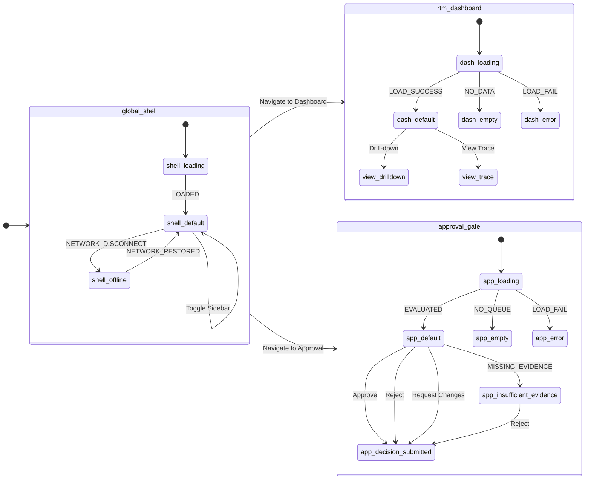

# UI Contract: webui-and-pm-workspace

## Feature Summary
This document defines the View Blueprint for the Web UI & PM Workspace (PRD 04), serving as the Level 3 Detail/Implementation layer. It provides the global shell, RTM dashboard, approval gates, boards, knowledge graph exploration, and specific task/document viewers needed for the PM experience.

## YAML View Blueprint

```yaml
metadata:
  feature: webui-and-pm-workspace
  satisfies:
    - br-prd04
    - br-prd04-s2
    - br-prd04-s8
viewports:
  - name: Desktop
    width: 1440
  - name: Tablet
    width: 1024
  - name: Mobile
    width: 390
screens:
  - id: global-shell
    route: /*
    states:
      - default
      - offline
      - loading
    layout:
      type: shell
      ds_id: ds:global_shell
      labels:
        - "Header Bar"
        - "Main Content Area"
        - "Footer"
      children:
        - type: header
          ds_id: ds:component:header
          labels:
            - "Logo"
            - "Global Search Bar"
            - "Online Status"
  - id: rtm-dashboard
    route: /
    states:
      - default
      - loading
      - empty
      - error
    layout:
      type: grid
      ds_id: ds:screen:rtm-dashboard
      labels:
        - "Panel 1: Coverage Heatmap"
        - "Panel 2: Task Progress"
        - "Panel 3: Knowledge Graph"
        - "Panel 4: Gap Analysis"
      bindings:
        - "Dashboard Panels"
      actions:
        - "Drill-down"
        - "View Trace"
  - id: approval-gate
    route: /approval
    states:
      - default
      - loading
      - insufficient-evidence
      - empty
      - decision-submitted
      - error
    layout:
      type: layout
      ds_id: ds:screen:approval-001
      labels:
        - "Queue Panel"
        - "Evidence Hub"
        - "Decision Box"
      bindings:
        - "Approval Data"
      actions:
        - "Approve"
        - "Reject"
        - "Request Changes"
```

## Screen Transitions
