<!-- beads-id: br-design-contract-webui-pm-workspace -->
# UI Contract: WebUI PM Workspace

Stage 1 schema-driven View Blueprint for PRD-04 WebUI PM Workspace. This canonical contract maps Core WebUI routes and PRD-04 §8.1A showcase routes to stable DS IDs, reviewable states, required UI/UX behaviors, and API-only data boundaries. Browser views consume `gmind serve` REST data only; local shell, FrankenSQLite, Zvec, git, GitHub `gh`, and FastCode access remain backend responsibilities.

```yaml
metadata:
  feature: webui-and-pm-workspace
  title: WebUI PM Workspace
  canonical_contract: docs/design/contracts/webui-and-pm-workspace/ui-contract.md
  prd:
    path: docs/PRDs/core-gmind/PRD-04-WebUI-and-PM-Workspace.md
  satisfies:
    - br-prd04
    - br-prd04-s1
    - br-prd04-s2
    - br-prd04-s3
    - br-prd04-s4
    - br-prd04-s5
    - br-prd04-s6
    - br-prd04-s7
    - br-prd04-s8
    - br-prd04-s9
    - br-prd04-s10
    - br-prd04-s11
    - br-prd04-s12
    - br-prd04-s13
    - br-prd04-s14
    - br-prd04-s14a
  stage: stage1
  route_coverage:
    core_routes_required: 8
    showcase_routes_required: 15
    screens_defined: 23
  boundaries:
    browser_allowed:
      - Go REST API served by gmind serve
      - static embedded assets
      - client cache and queued offline writes
    browser_forbidden:
      - direct FrankenSQLite reads or writes
      - direct Zvec access
      - local shell commands
      - local git access
      - GitHub gh CLI access
      - FastCode direct access
viewports:
  - name: desktop
    width: 1440
    constraints: persistent shell, expanded sidebar, multi-panel layouts
  - name: tablet
    width: 1024
    constraints: condensed sidebar, stacked secondary panels, horizontal scroll where boards overflow
  - name: mobile
    width: 390
    constraints: single-column flow, sidebar as overlay, drawers as full-screen overlays, tables become cards
state_contracts:
  default: render live data with interactive controls
  loading: layout-matched skeletons; no standalone spinner-only screens
  empty: clear message plus actionable CTA such as create, clear filters, reindex, or retry
  error: short cause plus retry or recovery action
  offline: read-mostly UI with offline banner and queued write affordance where safe
  forbidden: permission message with route-safe return action
  partial: local graph data shown while enrichment is delayed
  saving: edited controls disabled until API response or rollback
  not_found: missing entity message with link to parent list
responsive_rules:
  - id: ds:rule:shell-desktop
    applies_to: desktop
    behavior: header, sidebar, footer, and main surface are visible together
  - id: ds:rule:shell-tablet
    applies_to: tablet
    behavior: navigation collapses to icon rail; detail panels become drawers or bottom sheets
  - id: ds:rule:shell-mobile
    applies_to: mobile
    behavior: hamburger opens overlay sidebar; graph-heavy views may render tree/list fallback
api_data_flow:
  gateway: gmind serve Go REST API
  realtime: polling events table every 3 to 5 seconds plus health checks for offline transitions
  write_model: optimistic update, queued offline write where allowed, rollback on API error
  conflict_resolution: sync conflict prompt with keep local or use server version choices
action_catalog:
  - id: ds:action:disconnect
    event: EVENT_DISCONNECT
    label: Show offline read-only banner
    data_flow: GET /api/health failure or stream disconnect
  - id: ds:action:reconnect
    event: EVENT_RECONNECT
    label: Rehydrate queued edits
    data_flow: POST /api/sync/rehydrate after health check recovery
  - id: ds:action:save-task
    event: EVENT_SAVE_TASK
    label: Persist editable task fields
    data_flow: PUT /api/tasks/:id
  - id: ds:action:save-bulk
    event: EVENT_SAVE_BULK
    label: Persist selected task bulk updates
    data_flow: PUT /api/tasks/bulk
  - id: ds:action:save-board
    event: EVENT_MOVE_CARD
    label: Persist kanban card movement
    data_flow: PUT /api/tasks/:id/status
  - id: ds:action:approval-decision
    event: EVENT_APPROVAL_DECISION
    label: Submit approval or rejection with audit reason
    data_flow: POST /api/approval/:id/decision
  - id: ds:action:pi-plan-save
    event: EVENT_PI_PLAN_SAVE
    label: Save PI planning sandbox changes
    data_flow: PUT /api/pi/plan
  - id: ds:action:confidence-vote
    event: EVENT_CONFIDENCE_VOTE
    label: Submit PI confidence vote
    data_flow: POST /api/pi/confidence-vote
  - id: ds:action:view-doc
    event: EVENT_VIEW_DOC
    label: Open document viewer
    data_flow: GET /api/docs/:id
  - id: ds:action:view-task
    event: EVENT_VIEW_TASK
    label: Open task detail
    data_flow: GET /api/tasks/:id
  - id: ds:action:view-trace
    event: EVENT_VIEW_TRACE
    label: Open Beads trace explorer
    data_flow: GET /api/trace/:id?depth=full
  - id: ds:action:search
    event: EVENT_SEARCH
    label: Run global search
    data_flow: GET /api/search?q=<query>&type=<type>
  - id: ds:action:hash-nav
    event: EVENT_HASH_NAVIGATE
    label: Update same-route or cross-route showcase hash navigation
    data_flow: browser hashchange plus route component state
  - id: ds:action:refresh
    event: EVENT_REFRESH
    label: Refresh route data after retry or evidence update
    data_flow: route-specific GET endpoints
  - id: ds:action:back
    event: EVENT_BACK
    label: Return from boundary state to the last safe route
    data_flow: client history back or route-safe fallback to core workspace route
    source_components:
      - ds:webui-pm-workspace-showcase:boundary-actions
  - id: ds:action:keep-local
    event: EVENT_KEEP_LOCAL
    label: Keep queued local edits during sync conflict resolution
    data_flow: POST /api/sync/conflicts/:id/resolve with resolution=keep_local
    source_components:
      - ds:webui-pm-workspace-showcase:sync-conflict-banner
  - id: ds:action:use-server
    event: EVENT_USE_SERVER
    label: Replace queued local edits with the server version during sync conflict resolution
    data_flow: POST /api/sync/conflicts/:id/resolve with resolution=use_server
    source_components:
      - ds:webui-pm-workspace-showcase:sync-conflict-banner
screens:
  - id: screen:rtm-dashboard
    route: /
    icon: dashboard
    ds_id: ds:screen:rtm-dashboard-001
    states:
      - default
      - loading
      - empty
      - error
      - offline
      - forbidden
    layout: four-panel RTM dashboard with KPI row, coverage heatmap, task progress, knowledge graph, and gap analysis
    behaviors:
      - drill into PRD and section coverage
      - click graph nodes to show trace details
      - resolve gaps with create or source navigation action
    assertion_hooks: assert route, data-screen-id, data-ds-id, required states, core API mapping, interactions, responsive behavior, and boundary copy for this screen
    data_flow:
      endpoints:
        - GET /api/coverage
        - GET /api/tasks
        - GET /api/trace/:id?depth=2
        - GET /api/gaps
    component_tree:
      type: ScreenSurface
      ds_id: ds:rtm-dashboard:surface
      children:
        - type: CoverageHeatmap
          ds_id: ds:rtm-dashboard:coverage-heatmap
          actions:
            - EVENT_VIEW_TRACE
        - type: TaskProgressPanel
          ds_id: ds:rtm-dashboard:task-progress
          actions:
            - EVENT_VIEW_TASK
        - type: KnowledgeGraphPanel
          ds_id: ds:rtm-dashboard:knowledge-graph
          actions:
            - EVENT_VIEW_TRACE
        - type: GapAnalysisPanel
          ds_id: ds:rtm-dashboard:gap-analysis
          actions:
            - EVENT_REFRESH
  - id: screen:safe-board
    route: /board
    icon: board
    ds_id: ds:screen:safe-board-001
    states:
      - default
      - loading
      - empty
      - error
      - offline
      - forbidden
    layout: portfolio, ART, and team kanban views with WIP and RTE escalation badges
    behaviors:
      - switch Portfolio, ART, and Team board scopes
      - drag task cards across statuses
      - open RTE drawer from escalation badge
    assertion_hooks: assert route, data-screen-id, data-ds-id, required states, core API mapping, interactions, responsive behavior, and boundary copy for this screen
    data_flow:
      endpoints:
        - GET /api/tasks?view=board&level=<level>
        - PUT /api/tasks/:id/status
        - GET /api/tasks/:id/activity
    component_tree:
      type: ScreenSurface
      ds_id: ds:safe-board:surface
      children:
        - type: BoardSwitcher
          ds_id: ds:safe-board:view-switcher
        - type: KanbanBoard
          ds_id: ds:safe-board:kanban
          actions:
            - EVENT_MOVE_CARD
            - EVENT_VIEW_TASK
        - type: RteEscalationBadge
          ds_id: ds:safe-board:rte-escalation-badge
  - id: screen:task-list
    route: /tasks
    icon: list
    ds_id: ds:screen:task-list-001
    states:
      - default
      - loading
      - empty
      - error
      - offline
      - forbidden
      - saving
    layout: sortable data table with filters, pagination, CSV export, and bulk action bar
    behaviors:
      - combine status, priority, assignee, PRD, and QA filters
      - select visible rows and bulk assign, status, or priority
      - switch between list and board presentation
    assertion_hooks: assert route, data-screen-id, data-ds-id, required states, core API mapping, interactions, responsive behavior, and boundary copy for this screen
    data_flow:
      endpoints:
        - GET /api/tasks?format=list
        - PUT /api/tasks/bulk
    component_tree:
      type: ScreenSurface
      ds_id: ds:task-list:surface
      children:
        - type: TaskFilters
          ds_id: ds:task-list:filters
        - type: TaskTable
          ds_id: ds:task-list:table
          actions:
            - EVENT_VIEW_TASK
        - type: BulkActionBar
          ds_id: ds:task-list:bulk-actions
          actions:
            - EVENT_SAVE_BULK
  - id: screen:task-detail
    route: /tasks/:id
    icon: task-detail
    ds_id: ds:screen:task-detail-001
    states:
      - default
      - loading
      - empty
      - error
      - offline
      - forbidden
      - saving
      - not_found
    layout: editable task header with Detail, Activity, Graph, and Code tabs
    behaviors:
      - edit first-class PM fields through optimistic API writes
      - open dependency links in Trace Explorer
      - show activity timeline and code-touch context
    assertion_hooks: assert route, data-screen-id, data-ds-id, required states, core API mapping, interactions, responsive behavior, and boundary copy for this screen
    data_flow:
      endpoints:
        - GET /api/tasks/:id
        - GET /api/tasks/:id/activity
        - GET /api/trace/:id?depth=2
        - PUT /api/tasks/:id
    component_tree:
      type: ScreenSurface
      ds_id: ds:task-detail:surface
      children:
        - type: EditableFieldGroup
          ds_id: ds:task-detail:editable-fields
          actions:
            - EVENT_SAVE_TASK
        - type: TaskTabs
          ds_id: ds:task-detail:tabs
          actions:
            - EVENT_VIEW_TRACE
            - EVENT_VIEW_DOC
        - type: ActivityTimeline
          ds_id: ds:task-detail:activity
  - id: screen:trace-explorer
    route: /trace/:id
    icon: trace
    ds_id: ds:screen:trace-explorer-001
    states:
      - default
      - loading
      - empty
      - error
      - offline
      - forbidden
      - partial
    layout: full-page graph canvas with toolbar, filters, legend, and detail panel
    behaviors:
      - change root Beads ID and depth
      - click node for detail, double-click to route, right-click for context menu
      - show partial local data when enrichment times out
    assertion_hooks: assert route, data-screen-id, data-ds-id, required states, core API mapping, interactions, responsive behavior, and boundary copy for this screen
    data_flow:
      endpoints:
        - GET /api/trace/:id?depth=full
        - GET /api/impact/:section
    component_tree:
      type: ScreenSurface
      ds_id: ds:trace-explorer:surface
      children:
        - type: TraceToolbar
          ds_id: ds:trace-explorer:toolbar
        - type: TraceGraphCanvas
          ds_id: ds:trace-explorer:graph
          actions:
            - EVENT_VIEW_TASK
            - EVENT_VIEW_DOC
        - type: TraceDetailPanel
          ds_id: ds:trace-explorer:detail-panel
  - id: screen:doc-viewer
    route: /docs
    icon: documents
    ds_id: ds:screen:core-doc-viewer-001
    states:
      - default
      - loading
      - empty
      - error
      - offline
      - forbidden
    layout: source-type document tree and rendered content panel
    behaviors:
      - browse indexed documents by source type
      - auto-link Beads IDs to trace routes
      - show coverage indicator for PRD documents
    assertion_hooks: assert route, data-screen-id, data-ds-id, required states, core API mapping, interactions, responsive behavior, and boundary copy for this screen
    data_flow:
      endpoints:
        - GET /api/docs?group=source_type
        - GET /api/docs/:id
        - GET /api/coverage?prd=<beads-id>
    component_tree:
      type: ScreenSurface
      ds_id: ds:core-doc-viewer:surface
      children:
        - type: DocTree
          ds_id: ds:core-doc-viewer:tree
        - type: RenderedDocContent
          ds_id: ds:core-doc-viewer:content
          actions:
            - EVENT_VIEW_TRACE
        - type: BeadsAutoLinks
          ds_id: ds:core-doc-viewer:beads-links
  - id: screen:approval-gates
    route: /approval
    icon: approval
    ds_id: ds:screen:approval-gates-001
    states:
      - default
      - loading
      - empty
      - error
      - offline
      - forbidden
    layout: Level 3 approval workspace with queue, evidence, PRD context, and decision controls
    behaviors:
      - disable approval when evidence is insufficient
      - show RTE execution context for approved escalations
      - require audit reason for manual override paths
    assertion_hooks: assert route, data-screen-id, data-ds-id, required states, core API mapping, interactions, responsive behavior, and boundary copy for this screen
    data_flow:
      endpoints:
        - GET /api/tasks?status=pending-approval
        - GET /api/approval/:id/evidence
        - POST /api/approval/:id/decision
        - GET /api/coverage
    component_tree:
      type: ScreenSurface
      ds_id: ds:approval-gates:surface
      children:
        - type: ApprovalQueue
          ds_id: ds:approval-gates:queue
        - type: EvidencePanel
          ds_id: ds:approval-gates:evidence
        - type: DecisionControls
          ds_id: ds:approval-gates:decision-controls
          actions:
            - EVENT_APPROVAL_DECISION
  - id: screen:search-results
    route: /search
    icon: search
    ds_id: ds:screen:search-results-001
    states:
      - default
      - loading
      - empty
      - error
      - offline
      - forbidden
    layout: global search input, filter sidebar, grouped results, and instant suggestions
    behaviors:
      - focus global search with Ctrl+K or slash
      - group results by task, doc, commit, PR, chat, and RTE approval
      - navigate result clicks to task, doc, trace, or external PR target
    assertion_hooks: assert route, data-screen-id, data-ds-id, required states, core API mapping, interactions, responsive behavior, and boundary copy for this screen
    data_flow:
      endpoints:
        - GET /api/search?q=<query>&type=<type>
    component_tree:
      type: ScreenSurface
      ds_id: ds:search-results:surface
      children:
        - type: SearchInput
          ds_id: ds:search-results:input
          actions:
            - EVENT_SEARCH
        - type: FilterSidebar
          ds_id: ds:search-results:filters
        - type: GroupedResults
          ds_id: ds:search-results:results
          actions:
            - EVENT_VIEW_TASK
            - EVENT_VIEW_DOC
            - EVENT_VIEW_TRACE
  - id: screen:ds-terminal
    route: /design-system/terminal
    icon: terminal-monitor
    prd_ds_id: ds:screen:terminal-001
    ds_id: ds:screen:terminal-showcase-001
    states:
      - default
      - loading
      - empty
      - error
      - offline
      - forbidden
    layout: scenario tabs with 2x2 terminal mosaic
    behaviors:
      - Agent Console, Deploy, Debug, and CI/CD scenario tabs
      - command, output, success, and error line types
      - mosaic panels for Claude-01 Storage, Claude-02 CLI, Claude-03 CI, and QA-Reviewer
    assertion_hooks: assert route, data-screen-id, data-ds-id, required states, core API mapping, interactions, responsive behavior, and boundary copy for this screen
    data_flow:
      endpoints:
        - GET /api/agents/sessions
        - GET /api/ci/runs
        - GET /api/tasks/:id/activity
        - STREAM /api/log-events?stream=terminal
    component_tree:
      type: ShowcaseSurface
      ds_id: ds:terminal-showcase:surface
      children:
        - type: ScenarioTabs
          ds_id: ds:terminal-showcase:scenario-tabs
        - type: TerminalMosaic
          ds_id: ds:terminal-showcase:mosaic
        - type: TerminalLineList
          ds_id: ds:terminal-showcase:lines
  - id: screen:ds-portfolio
    route: /design-system/portfolio
    icon: portfolio-chart
    prd_ds_id: br-ds-portfolio-view
    ds_id: ds:screen:portfolio-showcase-001
    states:
      - default
      - loading
      - empty
      - error
      - offline
      - forbidden
    layout: executive portfolio table with roadmap quarters
    behaviors:
      - show Epic ID, owner, progress, budget, status, and forecast
      - render Q1, Q2, and Q3 2026 roadmap
      - preserve specified PRD DS badge value as display metadata
    assertion_hooks: assert route, data-screen-id, data-ds-id, required states, core API mapping, interactions, responsive behavior, and boundary copy for this screen
    data_flow:
      endpoints:
        - GET /api/portfolio/epics
        - GET /api/tasks?issue_type=epic
    component_tree:
      type: ShowcaseSurface
      ds_id: ds:portfolio-showcase:surface
      children:
        - type: PortfolioTable
          ds_id: ds:portfolio-showcase:table
        - type: Roadmap
          ds_id: ds:portfolio-showcase:roadmap
  - id: screen:ds-pi-planning
    route: /design-system/pi-planning
    icon: target
    prd_ds_id: br-ds-pi-planning
    ds_id: ds:screen:pi-planning-showcase-001
    states:
      - default
      - loading
      - empty
      - error
      - offline
      - forbidden
    layout: two-column PI planning sandbox, scoring, vote, and ROAM board
    behaviors:
      - drag and drop strategic sandbox capacity items
      - capture business value scoring and confidence vote one through five
      - classify risks as Resolved, Owned, Accepted, Mitigated, or Unassigned
    assertion_hooks: assert route, data-screen-id, data-ds-id, required states, core API mapping, interactions, responsive behavior, and boundary copy for this screen
    data_flow:
      endpoints:
        - GET /api/pi/features
        - PUT /api/pi/plan
        - GET /api/risks?view=roam
        - POST /api/pi/confidence-vote
    component_tree:
      type: ShowcaseSurface
      ds_id: ds:pi-planning-showcase:surface
      children:
        - type: StrategicSandbox
          ds_id: ds:pi-planning-showcase:sandbox
          actions:
            - EVENT_PI_PLAN_SAVE
        - type: BusinessValueScoring
          ds_id: ds:pi-planning-showcase:value-scoring
        - type: ConfidenceVote
          ds_id: ds:pi-planning-showcase:confidence-vote
          actions:
            - EVENT_CONFIDENCE_VOTE
        - type: RoamBoard
          ds_id: ds:pi-planning-showcase:roam-board
  - id: screen:ds-git-graph
    route: /design-system/git-graph
    icon: branch-graph
    prd_ds_id: ds:screen:git-graph-001
    ds_id: ds:screen:git-graph-showcase-001
    states:
      - default
      - loading
      - empty
      - error
      - offline
      - forbidden
    layout: hash-selected git graph scenarios with branches, commits, connections, tags, and stats
    behaviors:
      - support gitflow, multi-agent, hotfix, release-train, monorepo, beads-prd-trace, beads-deadlock, beads-ds-comp, beads-traversal, and beads-sprint-review scenarios
      - render backend-aggregated git and Beads trailer lineage
    assertion_hooks: assert route, data-screen-id, data-ds-id, required states, core API mapping, interactions, responsive behavior, and boundary copy for this screen
    data_flow:
      endpoints:
        - GET /api/git/graph?scenario=<id>
        - GET /api/trace/:id?include=git
    component_tree:
      type: ShowcaseSurface
      ds_id: ds:git-graph-showcase:surface
      children:
        - type: ScenarioSelector
          ds_id: ds:git-graph-showcase:scenario-selector
          actions:
            - EVENT_HASH_NAVIGATE
        - type: GitGraphCanvas
          ds_id: ds:git-graph-showcase:canvas
  - id: screen:ds-kanban
    route: /design-system/kanban
    icon: kanban-board
    prd_ds_id: ds:screen:kanban-001
    ds_id: ds:screen:kanban-showcase-001
    states:
      - default
      - loading
      - empty
      - error
      - offline
      - forbidden
    layout: board selector with draggable cards, WIP badges, and board stats
    behaviors:
      - hash routes for sprint, release, and bug-triage boards
      - drag cards across WIP-limited columns
      - show total, done, and progress stats
    assertion_hooks: assert route, data-screen-id, data-ds-id, required states, core API mapping, interactions, responsive behavior, and boundary copy for this screen
    data_flow:
      endpoints:
        - GET /api/tasks?view=board&board=<id>
        - PUT /api/tasks/:id/status
    component_tree:
      type: ShowcaseSurface
      ds_id: ds:kanban-showcase:surface
      children:
        - type: BoardSelector
          ds_id: ds:kanban-showcase:board-selector
          actions:
            - EVENT_HASH_NAVIGATE
        - type: KanbanColumns
          ds_id: ds:kanban-showcase:columns
          actions:
            - EVENT_MOVE_CARD
            - EVENT_VIEW_TASK
        - type: BoardStats
          ds_id: ds:kanban-showcase:stats
  - id: screen:ds-knowledge-graph
    route: /design-system/knowledge-graph
    icon: knowledge-graph
    prd_ds_id: ds:screen:knowledge-graph-001
    ds_id: ds:screen:knowledge-graph-showcase-001
    states:
      - default
      - loading
      - empty
      - error
      - offline
      - forbidden
      - partial
    layout: client-only Sigma graph viewer with preset tabs, selected-node banner, legend, and stats
    behaviors:
      - hash presets simple, ecosystem, and sprint
      - show node and edge legends with selected-node details
      - use tree or simplified fallback on constrained mobile viewports
    assertion_hooks: assert route, data-screen-id, data-ds-id, required states, core API mapping, interactions, responsive behavior, and boundary copy for this screen
    data_flow:
      endpoints:
        - GET /api/trace/:id?depth=full
        - GET /api/graph/presets
    component_tree:
      type: ShowcaseSurface
      ds_id: ds:knowledge-graph-showcase:surface
      children:
        - type: GraphPresetTabs
          ds_id: ds:knowledge-graph-showcase:presets
          actions:
            - EVENT_HASH_NAVIGATE
        - type: SigmaGraph
          ds_id: ds:knowledge-graph-showcase:viewer
        - type: GraphLegend
          ds_id: ds:knowledge-graph-showcase:legend
  - id: screen:ds-approval
    route: /design-system/approval
    icon: approval-check
    prd_ds_id: ds:screen:approval-001
    ds_id: ds:screen:approval-showcase-001
    states:
      - default
      - loading
      - empty
      - error
      - offline
      - forbidden
    layout: approval panels with status toggles, evidence blocks, RTM matrix, and coverage heatmap
    behaviors:
      - pending, approved, and rejected toggles
      - evidence blocks for Tests, Diff, Beads ID, PRD, and CI
      - hash anchors for panels, RTM, and heatmap
    assertion_hooks: assert route, data-screen-id, data-ds-id, required states, core API mapping, interactions, responsive behavior, and boundary copy for this screen
    data_flow:
      endpoints:
        - GET /api/tasks?status=pending-approval
        - GET /api/coverage
        - GET /api/approval/:id/evidence
        - POST /api/approval/:id/decision
    component_tree:
      type: ShowcaseSurface
      ds_id: ds:approval-showcase:surface
      children:
        - type: ApprovalToggles
          ds_id: ds:approval-showcase:toggles
          actions:
            - EVENT_HASH_NAVIGATE
        - type: EvidenceBlocks
          ds_id: ds:approval-showcase:evidence
        - type: RtmMatrix
          ds_id: ds:approval-showcase:rtm
        - type: CoverageHeatmap
          ds_id: ds:approval-showcase:heatmap
  - id: screen:ds-timeline
    route: /design-system/timeline
    icon: calendar-timeline
    prd_ds_id: ds:screen:timeline-001
    ds_id: ds:screen:timeline-showcase-001
    states:
      - default
      - loading
      - empty
      - error
      - offline
      - forbidden
    layout: file lease indicators, activity feed, and sprint day timeline
    behaviors:
      - show unlocked, locked, expiring, and expired lease states
      - hash anchors for file-lease, activity-feed, and sprint-day
      - update from activity polling every 3 to 5 seconds
    assertion_hooks: assert route, data-screen-id, data-ds-id, required states, core API mapping, interactions, responsive behavior, and boundary copy for this screen
    data_flow:
      endpoints:
        - GET /api/activity
        - GET /api/file-leases
        - GET /api/tasks/:id/activity
    component_tree:
      type: ShowcaseSurface
      ds_id: ds:timeline-showcase:surface
      children:
        - type: FileLeaseIndicators
          ds_id: ds:timeline-showcase:file-lease
        - type: ActivityFeed
          ds_id: ds:timeline-showcase:activity-feed
        - type: SprintDayTimeline
          ds_id: ds:timeline-showcase:sprint-day
  - id: screen:ds-components
    route: /design-system/components
    icon: component-blocks
    prd_ds_id: ds:screen:components-001
    ds_id: ds:screen:components-showcase-001
    states:
      - default
      - loading
      - empty
      - error
      - offline
      - forbidden
    layout: catalog of 18 shared design-system sections with hash scroll and interactive examples
    behaviors:
      - cover Buttons, Badges, Progress, Avatar Stack, Modal, Dropdown, Accordion, Tab Panel, Data Table, Tooltip, Code Block, Cards, Prompt Card, Section Labels, Status Dots, Skeleton, Empty State, and Error Banner
      - production screens compose these primitives instead of one-off styling
    assertion_hooks: assert route, data-screen-id, data-ds-id, required states, core API mapping, interactions, responsive behavior, and boundary copy for this screen
    data_flow:
      endpoints:
        - GET /api/design-system/components
    component_tree:
      type: ShowcaseSurface
      ds_id: ds:components-showcase:surface
      children:
        - type: ComponentSections
          ds_id: ds:components-showcase:sections
          actions:
            - EVENT_HASH_NAVIGATE
  - id: screen:ds-doc-viewer
    route: /design-system/doc-viewer
    icon: document-page
    prd_ds_id: ds:screen:doc-viewer-001
    ds_id: ds:screen:doc-viewer-showcase-001
    states:
      - default
      - loading
      - empty
      - error
      - offline
      - forbidden
    layout: GitHub-like file tree with selected document panel and Beads badges
    behaviors:
      - expand folders and select documents
      - show section status covered, partial, or gap
      - link to Explorer and Knowledge Graph
    assertion_hooks: assert route, data-screen-id, data-ds-id, required states, core API mapping, interactions, responsive behavior, and boundary copy for this screen
    data_flow:
      endpoints:
        - GET /api/docs?group=source_type
        - GET /api/docs/:id
    component_tree:
      type: ShowcaseSurface
      ds_id: ds:doc-viewer-showcase:surface
      children:
        - type: ShowcaseDocTree
          ds_id: ds:doc-viewer-showcase:tree
        - type: ShowcaseDocPanel
          ds_id: ds:doc-viewer-showcase:panel
          actions:
            - EVENT_VIEW_TRACE
  - id: screen:ds-explorer
    route: /design-system/explorer
    icon: search-explorer
    prd_ds_id: ds:screen:explorer-001
    ds_id: ds:screen:explorer-showcase-001
    states:
      - default
      - loading
      - empty
      - error
      - offline
      - forbidden
    layout: unified search, type filters, result list, and detail sidebar
    behaviors:
      - filter all, doc, commit, task, adr, chat, and spike via hash
      - show cross-links to Knowledge Graph, Beads Traversal, and Doc Viewer
      - preserve detail sidebar on desktop and convert to drawer on smaller viewports
    assertion_hooks: assert route, data-screen-id, data-ds-id, required states, core API mapping, interactions, responsive behavior, and boundary copy for this screen
    data_flow:
      endpoints:
        - GET /api/search?q=<query>&type=<type>
    component_tree:
      type: ShowcaseSurface
      ds_id: ds:explorer-showcase:surface
      children:
        - type: ExplorerQuery
          ds_id: ds:explorer-showcase:query
          actions:
            - EVENT_SEARCH
        - type: ExplorerTypeFilters
          ds_id: ds:explorer-showcase:type-filters
          actions:
            - EVENT_HASH_NAVIGATE
        - type: ExplorerDetailSidebar
          ds_id: ds:explorer-showcase:detail-sidebar
          actions:
            - EVENT_VIEW_TRACE
            - EVENT_VIEW_DOC
            - EVENT_VIEW_TASK
  - id: screen:ds-beads-traversal
    route: /design-system/beads-traversal
    icon: linked-nodes
    prd_ds_id: ds:screen:beads-traversal-001
    ds_id: ds:screen:beads-traversal-showcase-001
    states:
      - default
      - loading
      - empty
      - error
      - offline
      - forbidden
    layout: layered DAG from PRD sections to plan elements, tasks, and commits
    behaviors:
      - toggle forward and reverse traversal direction
      - highlight selected and linked nodes
      - show parent and children links in detail sidebar
    assertion_hooks: assert route, data-screen-id, data-ds-id, required states, core API mapping, interactions, responsive behavior, and boundary copy for this screen
    data_flow:
      endpoints:
        - GET /api/trace/:id?depth=full
    component_tree:
      type: ShowcaseSurface
      ds_id: ds:beads-traversal-showcase:surface
      children:
        - type: TraversalLayers
          ds_id: ds:beads-traversal-showcase:layers
        - type: DirectionToggle
          ds_id: ds:beads-traversal-showcase:direction-toggle
        - type: TraversalDetailSidebar
          ds_id: ds:beads-traversal-showcase:detail-sidebar
  - id: screen:ds-storyboard
    route: /design-system/storyboard
    icon: journey-map
    prd_ds_id: ds:screen:storyboard-001
    ds_id: ds:screen:storyboard-showcase-001
    states:
      - default
      - loading
      - empty
      - error
      - offline
      - forbidden
    layout: journey filter, horizontal use-case flow, guidance panel, and CTA to real screen
    behaviors:
      - filter journeys and preserve selected route state
      - show Mechanism and Action, Considerations, and Investigating guidance
      - CTA opens the corresponding implementation screen
    assertion_hooks: assert route, data-screen-id, data-ds-id, required states, core API mapping, interactions, responsive behavior, and boundary copy for this screen
    data_flow:
      endpoints:
        - GET /api/storyboards
    component_tree:
      type: ShowcaseSurface
      ds_id: ds:storyboard-showcase:surface
      children:
        - type: JourneyFilter
          ds_id: ds:storyboard-showcase:filter
        - type: UsecaseFlow
          ds_id: ds:storyboard-showcase:flow
        - type: GuidancePanel
          ds_id: ds:storyboard-showcase:guidance
  - id: screen:ds-storyboard-detail
    route: /design-system/storyboard/:id
    icon: journey-detail
    prd_ds_id: ds:screen:storyboard-001
    ds_id: ds:screen:storyboard-detail-showcase-001
    states:
      - default
      - loading
      - empty
      - error
      - offline
      - forbidden
      - not_found
    layout: dynamic storyboard detail with role, journey, step timeline, and related use cases
    behaviors:
      - map use-case journeys to screen paths, state names, expected outcomes, and E2E investigation guidance
      - navigate related use cases without losing sidebar context
    assertion_hooks: assert route, data-screen-id, data-ds-id, required states, core API mapping, interactions, responsive behavior, and boundary copy for this screen
    data_flow:
      endpoints:
        - GET /api/storyboards/:id
    component_tree:
      type: ShowcaseSurface
      ds_id: ds:storyboard-detail-showcase:surface
      children:
        - type: StoryboardRolePanel
          ds_id: ds:storyboard-detail-showcase:role
        - type: StepTimeline
          ds_id: ds:storyboard-detail-showcase:steps
        - type: RelatedUsecases
          ds_id: ds:storyboard-detail-showcase:related
  - id: screen:ds-webui-pm-workspace
    route: /design-system/webui-pm-workspace
    icon: workspace-compass
    prd_ds_id: ds:global_shell
    ds_id: ds:screen:webui-pm-workspace-showcase-001
    states:
      - default
      - loading
      - empty
      - error
      - offline
      - forbidden
    layout: integrated shell with header logo, global search, offline indicator, sidebar navigation, and active PM surfaces
    behaviors:
      - expose Dashboard, SAFe Board, Task List, Task Detail, Trace Explorer, Doc Viewer, Approval Gates, and Search Results surfaces
      - every active surface carries stable data-screen-id and data-ds-id
      - sidebar navigation maps showcase hashes to PM surfaces and Core routes
    assertion_hooks: assert route, data-screen-id, data-ds-id, required states, core API mapping, interactions, responsive behavior, and boundary copy for this screen
    data_flow:
      endpoints:
        - GET /api/coverage
        - GET /api/tasks
        - GET /api/trace/:id
        - GET /api/docs
        - GET /api/search
    component_tree:
      type: ShowcaseSurface
      ds_id: ds:webui-pm-workspace-showcase:surface
      children:
        - type: WorkspaceHeader
          ds_id: ds:webui-pm-workspace-showcase:header
          actions:
            - EVENT_SEARCH
            - EVENT_DISCONNECT
            - EVENT_RECONNECT
        - type: WorkspaceSidebarNav
          ds_id: ds:webui-pm-workspace-showcase:sidebar-nav
          actions:
            - EVENT_HASH_NAVIGATE
            - EVENT_VIEW_TASK
            - EVENT_VIEW_TRACE
            - EVENT_VIEW_DOC
        - type: BoundaryActionBar
          ds_id: ds:webui-pm-workspace-showcase:boundary-actions
          actions:
            - EVENT_BACK
        - type: SyncConflictBanner
          ds_id: ds:webui-pm-workspace-showcase:sync-conflict-banner
          actions:
            - EVENT_KEEP_LOCAL
            - EVENT_USE_SERVER
        - type: WorkspaceSurface
          ds_id: ds:webui-pm-workspace-showcase:active-surface
```

```mermaid
stateDiagram-v2
    direction LR
    [*] --> GlobalShell
    GlobalShell --> LoadingState : ROUTE_ENTER
    LoadingState --> CoreRoute : API_SUCCESS_CORE
    LoadingState --> ShowcaseRoute : API_SUCCESS_SHOWCASE
    LoadingState --> EmptyState : API_EMPTY
    LoadingState --> PermissionDenied : API_FORBIDDEN
    LoadingState --> ErrorState : API_ERROR
    LoadingState --> NotFoundState : API_NOT_FOUND
    LoadingState --> PartialState : API_PARTIAL_ENRICHMENT
    CoreRoute --> RtmDashboard : ROUTE_
    RtmDashboard --> LoadingState : EVENT_REFRESH
    RtmDashboard --> OfflineState : EVENT_DISCONNECT
    RtmDashboard --> EmptyState : API_EMPTY
    RtmDashboard --> ErrorState : API_ERROR
    RtmDashboard --> PermissionDenied : API_FORBIDDEN
    RtmDashboard --> TraceExplorer : EVENT_VIEW_TRACE
    RtmDashboard --> TaskDetail : EVENT_VIEW_TASK
    CoreRoute --> SafeBoard : ROUTE_board
    SafeBoard --> LoadingState : EVENT_REFRESH
    SafeBoard --> OfflineState : EVENT_DISCONNECT
    SafeBoard --> EmptyState : API_EMPTY
    SafeBoard --> ErrorState : API_ERROR
    SafeBoard --> PermissionDenied : API_FORBIDDEN
    SafeBoard --> SavingState : EVENT_MOVE_CARD
    SafeBoard --> TaskDetail : EVENT_VIEW_TASK
    CoreRoute --> TaskList : ROUTE_tasks
    TaskList --> LoadingState : EVENT_REFRESH
    TaskList --> OfflineState : EVENT_DISCONNECT
    TaskList --> EmptyState : API_EMPTY
    TaskList --> ErrorState : API_ERROR
    TaskList --> PermissionDenied : API_FORBIDDEN
    TaskList --> TaskDetail : EVENT_VIEW_TASK
    TaskList --> SavingState : EVENT_SAVE_BULK
    CoreRoute --> TaskDetail : ROUTE_tasks__id
    TaskDetail --> LoadingState : EVENT_REFRESH
    TaskDetail --> OfflineState : EVENT_DISCONNECT
    TaskDetail --> EmptyState : API_EMPTY
    TaskDetail --> ErrorState : API_ERROR
    TaskDetail --> PermissionDenied : API_FORBIDDEN
    TaskDetail --> NotFoundState : API_NOT_FOUND
    TaskDetail --> SavingState : EVENT_SAVE_TASK
    TaskDetail --> TraceExplorer : EVENT_VIEW_TRACE
    TaskDetail --> DocViewer : EVENT_VIEW_DOC
    CoreRoute --> TraceExplorer : ROUTE_trace__id
    TraceExplorer --> LoadingState : EVENT_REFRESH
    TraceExplorer --> OfflineState : EVENT_DISCONNECT
    TraceExplorer --> EmptyState : API_EMPTY
    TraceExplorer --> ErrorState : API_ERROR
    TraceExplorer --> PermissionDenied : API_FORBIDDEN
    TraceExplorer --> PartialState : API_PARTIAL_ENRICHMENT
    TraceExplorer --> TaskDetail : EVENT_VIEW_TASK
    TraceExplorer --> DocViewer : EVENT_VIEW_DOC
    CoreRoute --> DocViewer : ROUTE_docs
    DocViewer --> LoadingState : EVENT_REFRESH
    DocViewer --> OfflineState : EVENT_DISCONNECT
    DocViewer --> EmptyState : API_EMPTY
    DocViewer --> ErrorState : API_ERROR
    DocViewer --> PermissionDenied : API_FORBIDDEN
    DocViewer --> TraceExplorer : EVENT_VIEW_TRACE
    CoreRoute --> ApprovalGates : ROUTE_approval
    ApprovalGates --> LoadingState : EVENT_REFRESH
    ApprovalGates --> OfflineState : EVENT_DISCONNECT
    ApprovalGates --> EmptyState : API_EMPTY
    ApprovalGates --> ErrorState : API_ERROR
    ApprovalGates --> PermissionDenied : API_FORBIDDEN
    ApprovalGates --> ApprovalDecisionState : EVENT_APPROVAL_DECISION
    CoreRoute --> SearchResults : ROUTE_search
    SearchResults --> LoadingState : EVENT_REFRESH
    SearchResults --> OfflineState : EVENT_DISCONNECT
    SearchResults --> EmptyState : API_EMPTY
    SearchResults --> ErrorState : API_ERROR
    SearchResults --> PermissionDenied : API_FORBIDDEN
    SearchResults --> SearchResults : EVENT_SEARCH
    SearchResults --> TaskDetail : EVENT_VIEW_TASK
    SearchResults --> DocViewer : EVENT_VIEW_DOC
    SearchResults --> TraceExplorer : EVENT_VIEW_TRACE
    ShowcaseRoute --> DsTerminal : ROUTE_design_system_terminal
    DsTerminal --> LoadingState : EVENT_REFRESH
    DsTerminal --> OfflineState : EVENT_DISCONNECT
    DsTerminal --> EmptyState : API_EMPTY
    DsTerminal --> ErrorState : API_ERROR
    DsTerminal --> PermissionDenied : API_FORBIDDEN
    ShowcaseRoute --> DsPortfolio : ROUTE_design_system_portfolio
    DsPortfolio --> LoadingState : EVENT_REFRESH
    DsPortfolio --> OfflineState : EVENT_DISCONNECT
    DsPortfolio --> EmptyState : API_EMPTY
    DsPortfolio --> ErrorState : API_ERROR
    DsPortfolio --> PermissionDenied : API_FORBIDDEN
    ShowcaseRoute --> DsPiPlanning : ROUTE_design_system_pi_planning
    DsPiPlanning --> LoadingState : EVENT_REFRESH
    DsPiPlanning --> OfflineState : EVENT_DISCONNECT
    DsPiPlanning --> EmptyState : API_EMPTY
    DsPiPlanning --> ErrorState : API_ERROR
    DsPiPlanning --> PermissionDenied : API_FORBIDDEN
    DsPiPlanning --> PiPlanningSaveState : EVENT_PI_PLAN_SAVE
    DsPiPlanning --> PiPlanningVoteState : EVENT_CONFIDENCE_VOTE
    ShowcaseRoute --> DsGitGraph : ROUTE_design_system_git_graph
    DsGitGraph --> LoadingState : EVENT_REFRESH
    DsGitGraph --> OfflineState : EVENT_DISCONNECT
    DsGitGraph --> EmptyState : API_EMPTY
    DsGitGraph --> ErrorState : API_ERROR
    DsGitGraph --> PermissionDenied : API_FORBIDDEN
    DsGitGraph --> DsGitGraph : EVENT_HASH_NAVIGATE
    ShowcaseRoute --> DsKanban : ROUTE_design_system_kanban
    DsKanban --> LoadingState : EVENT_REFRESH
    DsKanban --> OfflineState : EVENT_DISCONNECT
    DsKanban --> EmptyState : API_EMPTY
    DsKanban --> ErrorState : API_ERROR
    DsKanban --> PermissionDenied : API_FORBIDDEN
    DsKanban --> DsKanban : EVENT_HASH_NAVIGATE
    DsKanban --> SavingState : EVENT_MOVE_CARD
    DsKanban --> TaskDetail : EVENT_VIEW_TASK
    ShowcaseRoute --> DsKnowledgeGraph : ROUTE_design_system_knowledge_graph
    DsKnowledgeGraph --> LoadingState : EVENT_REFRESH
    DsKnowledgeGraph --> OfflineState : EVENT_DISCONNECT
    DsKnowledgeGraph --> EmptyState : API_EMPTY
    DsKnowledgeGraph --> ErrorState : API_ERROR
    DsKnowledgeGraph --> PermissionDenied : API_FORBIDDEN
    DsKnowledgeGraph --> PartialState : API_PARTIAL_ENRICHMENT
    DsKnowledgeGraph --> DsKnowledgeGraph : EVENT_HASH_NAVIGATE
    ShowcaseRoute --> DsApproval : ROUTE_design_system_approval
    DsApproval --> LoadingState : EVENT_REFRESH
    DsApproval --> OfflineState : EVENT_DISCONNECT
    DsApproval --> EmptyState : API_EMPTY
    DsApproval --> ErrorState : API_ERROR
    DsApproval --> PermissionDenied : API_FORBIDDEN
    DsApproval --> DsApproval : EVENT_HASH_NAVIGATE
    ShowcaseRoute --> DsTimeline : ROUTE_design_system_timeline
    DsTimeline --> LoadingState : EVENT_REFRESH
    DsTimeline --> OfflineState : EVENT_DISCONNECT
    DsTimeline --> EmptyState : API_EMPTY
    DsTimeline --> ErrorState : API_ERROR
    DsTimeline --> PermissionDenied : API_FORBIDDEN
    ShowcaseRoute --> DsComponents : ROUTE_design_system_components
    DsComponents --> LoadingState : EVENT_REFRESH
    DsComponents --> OfflineState : EVENT_DISCONNECT
    DsComponents --> EmptyState : API_EMPTY
    DsComponents --> ErrorState : API_ERROR
    DsComponents --> PermissionDenied : API_FORBIDDEN
    DsComponents --> DsComponents : EVENT_HASH_NAVIGATE
    ShowcaseRoute --> DsDocViewer : ROUTE_design_system_doc_viewer
    DsDocViewer --> LoadingState : EVENT_REFRESH
    DsDocViewer --> OfflineState : EVENT_DISCONNECT
    DsDocViewer --> EmptyState : API_EMPTY
    DsDocViewer --> ErrorState : API_ERROR
    DsDocViewer --> PermissionDenied : API_FORBIDDEN
    DsDocViewer --> TraceExplorer : EVENT_VIEW_TRACE
    ShowcaseRoute --> DsExplorer : ROUTE_design_system_explorer
    DsExplorer --> LoadingState : EVENT_REFRESH
    DsExplorer --> OfflineState : EVENT_DISCONNECT
    DsExplorer --> EmptyState : API_EMPTY
    DsExplorer --> ErrorState : API_ERROR
    DsExplorer --> PermissionDenied : API_FORBIDDEN
    DsExplorer --> SearchResults : EVENT_SEARCH
    DsExplorer --> DsExplorer : EVENT_HASH_NAVIGATE
    DsExplorer --> TraceExplorer : EVENT_VIEW_TRACE
    DsExplorer --> DocViewer : EVENT_VIEW_DOC
    DsExplorer --> TaskDetail : EVENT_VIEW_TASK
    ShowcaseRoute --> DsBeadsTraversal : ROUTE_design_system_beads_traversal
    DsBeadsTraversal --> LoadingState : EVENT_REFRESH
    DsBeadsTraversal --> OfflineState : EVENT_DISCONNECT
    DsBeadsTraversal --> EmptyState : API_EMPTY
    DsBeadsTraversal --> ErrorState : API_ERROR
    DsBeadsTraversal --> PermissionDenied : API_FORBIDDEN
    ShowcaseRoute --> DsStoryboard : ROUTE_design_system_storyboard
    DsStoryboard --> LoadingState : EVENT_REFRESH
    DsStoryboard --> OfflineState : EVENT_DISCONNECT
    DsStoryboard --> EmptyState : API_EMPTY
    DsStoryboard --> ErrorState : API_ERROR
    DsStoryboard --> PermissionDenied : API_FORBIDDEN
    ShowcaseRoute --> DsStoryboardDetail : ROUTE_design_system_storyboard__id
    DsStoryboardDetail --> LoadingState : EVENT_REFRESH
    DsStoryboardDetail --> OfflineState : EVENT_DISCONNECT
    DsStoryboardDetail --> EmptyState : API_EMPTY
    DsStoryboardDetail --> ErrorState : API_ERROR
    DsStoryboardDetail --> PermissionDenied : API_FORBIDDEN
    DsStoryboardDetail --> NotFoundState : API_NOT_FOUND
    ShowcaseRoute --> DsWebuiPmWorkspace : ROUTE_design_system_webui_pm_workspace
    DsWebuiPmWorkspace --> LoadingState : EVENT_REFRESH
    DsWebuiPmWorkspace --> OfflineState : EVENT_DISCONNECT
    DsWebuiPmWorkspace --> EmptyState : API_EMPTY
    DsWebuiPmWorkspace --> ErrorState : API_ERROR
    DsWebuiPmWorkspace --> PermissionDenied : API_FORBIDDEN
    DsWebuiPmWorkspace --> SearchResults : EVENT_SEARCH
    DsWebuiPmWorkspace --> RehydratingState : EVENT_RECONNECT
    DsWebuiPmWorkspace --> DsWebuiPmWorkspace : EVENT_HASH_NAVIGATE
    DsWebuiPmWorkspace --> TaskDetail : EVENT_VIEW_TASK
    DsWebuiPmWorkspace --> TraceExplorer : EVENT_VIEW_TRACE
    DsWebuiPmWorkspace --> DocViewer : EVENT_VIEW_DOC
    DsWebuiPmWorkspace --> GlobalShell : EVENT_BACK
    DsWebuiPmWorkspace --> RehydratingState : EVENT_KEEP_LOCAL
    DsWebuiPmWorkspace --> RehydratingState : EVENT_USE_SERVER
    SavingState --> SuccessState : API_SUCCESS
    SavingState --> ErrorState : API_ERROR_ROLLBACK
    SavingState --> OfflineState : API_OFFLINE_QUEUE
    ApprovalDecisionState --> SuccessState : API_APPROVAL_SUCCESS
    ApprovalDecisionState --> ErrorState : API_APPROVAL_ERROR
    ApprovalDecisionState --> PermissionDenied : API_APPROVAL_FORBIDDEN
    PiPlanningSaveState --> SuccessState : API_PI_SAVE_SUCCESS
    PiPlanningSaveState --> ErrorState : API_PI_SAVE_ERROR
    PiPlanningVoteState --> SuccessState : API_VOTE_SUCCESS
    PiPlanningVoteState --> ErrorState : API_VOTE_ERROR
    GlobalShell --> OfflineState : EVENT_DISCONNECT
    CoreRoute --> OfflineState : EVENT_DISCONNECT
    ShowcaseRoute --> OfflineState : EVENT_DISCONNECT
    OfflineState --> RehydratingState : EVENT_RECONNECT
    RehydratingState --> ConflictResolution : API_CONFLICT
    ConflictResolution --> RehydratingState : EVENT_KEEP_LOCAL
    ConflictResolution --> RehydratingState : EVENT_USE_SERVER
    RehydratingState --> GlobalShell : API_SYNC_SUCCESS
    RehydratingState --> ErrorState : API_SYNC_ERROR
    EmptyState --> LoadingState : EVENT_REFRESH
    ErrorState --> LoadingState : EVENT_REFRESH
    PartialState --> LoadingState : EVENT_REFRESH
    SuccessState --> LoadingState : EVENT_REFRESH
    PermissionDenied --> GlobalShell : EVENT_BACK
    NotFoundState --> GlobalShell : EVENT_BACK
    ErrorState --> GlobalShell : EVENT_BACK
```


