# UI Contract: WebUI and PM Workspace

<!-- beads-id: br-design-contract-webui-pm-workspace | satisfies: br-prd04 -->

## Review Summary

<!-- beads-id: br-design-contract-webui-pm-workspace-s1 | satisfies: br-prd04-s2, br-prd04-s8 -->

This contract defines the schema-driven Stage 1 blueprint for the Gmind WebUI and PM Workspace served by `gmind serve`. The experience gives PMO, RTE, feature-team leads, QA, and human approvers a browser workspace for RTM coverage, SAFe boards, task management, document review, trace exploration, approval gates, and system-wide search. All read and write operations are bounded by the Go REST API; the UI must not access FrankenSQLite, Zvec, git, GitHub, or FastCode directly.

Primary PRD traceability: `br-prd04-s1` through `br-prd04-s14`, with canonical Ralph Loop defaults from `br-prd04-s14a`.

## YAML View Blueprint

<!-- beads-id: br-design-contract-webui-pm-workspace-s2 | satisfies: br-prd04-s3, br-prd04-s4, br-prd04-s6, br-prd04-s8, br-prd04-s9, br-prd04-s10, br-prd04-s11, br-prd04-s12, br-prd04-s13 -->

```yaml
metadata:
  feature: webui-and-pm-workspace
  iteration: 3
  source_prd:
    path: docs/PRDs/core-gmind/PRD-04-WebUI-and-PM-Workspace.md
    beads_id: br-prd04
    sections:
      - id: br-prd04-s1
        title: PM custom fields via first-class SQL columns
      - id: br-prd04-s2
        title: Presentation layer, API boundary, offline and rehydration
      - id: br-prd04-s3
        title: SAFe and board views
      - id: br-prd04-s4
        title: Level 3 approval gates
      - id: br-prd04-s5
        title: Document graph widget and HITL history
      - id: br-prd04-s6
        title: RTM dashboard
      - id: br-prd04-s7
        title: RTE approval UI integration
      - id: br-prd04-s8
        title: Navigation and route map
      - id: br-prd04-s9
        title: Document viewer
      - id: br-prd04-s10
        title: Beads Trace Explorer
      - id: br-prd04-s11
        title: Task detail view
      - id: br-prd04-s12
        title: Search and filter UI
      - id: br-prd04-s13
        title: Task list view
      - id: br-prd04-s14
        title: Acceptance criteria
      - id: br-prd04-s14a
        title: Contract defaults and clarifications for Ralph Loop Stage 1
  satisfies:
    - br-prd04-s1
    - br-prd04-s2
    - br-prd04-s3
    - br-prd04-s4
    - br-prd04-s5
    - br-prd04-s6
    - br-prd04-s7
    - br-prd04-s8
    - br-prd04-s9
    - br-prd04-s10
    - br-prd04-s11
    - br-prd04-s12
    - br-prd04-s13
    - br-prd04-s14
    - br-prd04-s14a
  stakeholders:
    - PMO manager
    - Release Train Engineer
    - Product owner
    - QA lead
    - Feature team lead
    - Human approver
  system_boundaries:
    client_runtime: Embedded SPA served by gmind serve through Go embed.FS
    allowed_data_access: Go REST API only for graph, search, enrichment, task, approval, and document data
    forbidden_data_access:
      - Direct FrankenSQLite reads or writes from browser code
      - Direct Zvec reads from browser code
      - Direct local git access from browser code
      - Direct GitHub gh CLI invocation from browser code
      - Direct FastCode invocation from browser code
      - Direct gmind or beads_rust CLI invocation from browser code
    refresh_rules:
      events_poll_interval: 3-5 seconds for task and board updates
      dashboard_auto_refresh: 60 seconds or manual refresh
      search_suggestion_debounce: 300ms
  style_directives:
    theme: Dark, premium operations-console visual language
    accessibility: WCAG AA, visible focus outlines, keyboard navigation for all major panels
    empty_state_rule: Every empty state has a recovery CTA
    error_state_rule: Every error state has a cause summary and direct recovery action
    loading_rule: Use layout-matched skeleton loaders; graph areas may include progress messaging

viewports:
  - name: desktop
    width: 1440
    constraints:
      shell_sidebar: expanded 240px navigation with labels
      dashboard_grid: 2x2 panels
      graph_layout: canvas with right detail panel
  - name: tablet
    width: 1024
    constraints:
      shell_sidebar: compact 60px icon rail with tooltip labels
      dashboard_grid: two stacked rows or single-column depending panel density
      graph_layout: canvas with bottom sheet detail panel
  - name: mobile
    width: 390
    constraints:
      shell_sidebar: hidden behind header menu overlay
      dashboard_grid: single-column stacked panels
      graph_layout: simplified tree/list view with full-screen detail overlay

global_shell:
  id: global-shell
  route_scope: all routes
  states:
    - default
    - loading
    - offline
  responsive:
    desktop: sidebar expanded, header search wide, footer visible
    tablet: sidebar icon rail, header search medium, footer compact
    mobile: hamburger opens navigation overlay, footer metadata collapses below content
  component_tree:
    type: app_shell
    ds_id: ds:webui.shell.root
    bindings:
      connection_status: api.health.status
      active_route: router.current_path
      app_version: api.system.version
    children:
      - type: header
        ds_id: ds:webui.shell.header
        label: Gmind PM Workspace
        children:
          - type: nav_trigger
            ds_id: ds:webui.shell.mobile_menu_button
            label: Open navigation
            actions:
              - id: shell.open_mobile_navigation
                label: Open navigation menu
                target: navigation_overlay
          - type: global_search_input
            ds_id: ds:webui.shell.global_search
            label: Search tasks, documents, commits, and code
            bindings:
              value: route.query.q
              suggestions: api.search.suggestions
            actions:
              - id: shell.focus_global_search
                label: Focus global search
                shortcut: Ctrl+K
              - id: shell.submit_global_search
                label: Search workspace
                target_route: /search
          - type: notification_button
            ds_id: ds:webui.shell.notifications
            label: Workspace alerts
            bindings:
              alert_count: api.notifications.unread_count
      - type: sidebar_nav
        ds_id: ds:webui.shell.sidebar
        label: Primary navigation
        children:
          - type: nav_link
            ds_id: ds:webui.shell.nav_dashboard
            label: Dashboard
            route: /
          - type: nav_link
            ds_id: ds:webui.shell.nav_board
            label: Board
            route: /board
          - type: nav_link
            ds_id: ds:webui.shell.nav_tasks
            label: Tasks
            route: /tasks
          - type: nav_link
            ds_id: ds:webui.shell.nav_trace
            label: Trace
            route: /trace/:id
          - type: nav_link
            ds_id: ds:webui.shell.nav_docs
            label: Docs
            route: /docs
          - type: nav_link
            ds_id: ds:webui.shell.nav_approval
            label: Approval
            route: /approval
          - type: status_badge
            ds_id: ds:webui.shell.connection_badge
            label: Connection status
            bindings:
              status: api.health.status
      - type: offline_banner
        ds_id: ds:webui.shell.offline_banner
        label: Offline mode banner
        bindings:
          message: system.sync.banner_text
        visibility:
          states:
            - offline
        actions:
          - id: shell.retry_connection
            label: Retry connection
      - type: main_region
        ds_id: ds:webui.shell.main
        label: Current route content
      - type: footer
        ds_id: ds:webui.shell.footer
        label: gmind runtime status
        bindings:
          uptime: api.system.uptime
          sync_status: api.system.sync_status

screens:
  - id: rtm-dashboard
    route: /
    title: RTM Dashboard
    satisfies:
      - br-prd04-s5
      - br-prd04-s6
      - br-prd04-s14
    data_sources:
      - GET /api/coverage
      - GET /api/tasks
      - GET /api/trace/:id
      - GET /api/gaps
    states:
      - name: default
        content: Four live panels show coverage, task progress, knowledge graph, and gap analysis.
      - name: loading
        content: Panel-sized skeletons; graph area shows query progress.
      - name: empty
        content: Chưa có dữ liệu theo dõi.
        cta: Hướng dẫn
      - name: error
        content: Không thể kết nối đến gmind serve.
        cta: Thử lại
      - name: offline
        content: Đang offline — dữ liệu dashboard là bản lưu gần nhất.
        cta: Kết nối lại
    layout:
      desktop: 2x2 dashboard grid below KPI row
      tablet: stacked responsive grid with two panels per row when space allows
      mobile: single-column panels with graph touch pan and zoom
    component_tree:
      type: dashboard_page
      ds_id: ds:webui.dashboard.page
      children:
        - type: kpi_card_row
          ds_id: ds:webui.dashboard.kpi_row
          children:
            - type: metric_card
              ds_id: ds:webui.dashboard.kpi_coverage
              label: Coverage
              bindings:
                value: api.coverage.overall_percent
            - type: metric_card
              ds_id: ds:webui.dashboard.kpi_tasks_done
              label: Tasks done
              bindings:
                value: api.tasks.done_count
            - type: metric_card
              ds_id: ds:webui.dashboard.kpi_gaps_found
              label: Gaps found
              bindings:
                value: api.gaps.total_count
        - type: coverage_heatmap_panel
          ds_id: ds:webui.dashboard.coverage_heatmap
          label: Coverage heatmap
          bindings:
            rows: api.coverage.prd_sections
          actions:
            - id: dashboard.expand_prd_coverage
              label: Expand PRD sections
            - id: dashboard.open_section_tasks
              label: Open linked tasks side panel
              target: dashboard_section_tasks_drawer
        - type: task_progress_panel
          ds_id: ds:webui.dashboard.task_progress
          label: Task progress
          bindings:
            task_summary: api.tasks.summary_by_status
          actions:
            - id: dashboard.filter_tasks_by_status
              label: Filter tasks by status
              target_route: /tasks
        - type: knowledge_graph_widget
          ds_id: ds:webui.dashboard.knowledge_graph
          label: Knowledge graph
          bindings:
            graph: api.trace.dashboard_graph
          actions:
            - id: dashboard.select_graph_node
              label: Show node details
              target: dashboard_graph_detail_panel
            - id: dashboard.open_trace_explorer
              label: Open full trace explorer
              target_route: /trace/:id
        - type: gap_analysis_panel
          ds_id: ds:webui.dashboard.gap_analysis
          label: Gap analysis
          bindings:
            gaps: api.gaps.items
          actions:
            - id: dashboard.open_gap_source
              label: Open gap source
            - id: dashboard.create_plan_from_gap
              label: Create plan
              target: create_plan_dialog

  - id: safe-board
    route: /board
    title: SAFe Board
    satisfies:
      - br-prd04-s1
      - br-prd04-s3
      - br-prd04-s7
      - br-prd04-s14
    data_sources:
      - GET /api/tasks?view=board&level=<level>
      - PUT /api/tasks/:id
    states:
      - name: default
        content: Portfolio, ART, Team, and PI Planning views are available.
      - name: loading
        content: Skeleton loaders for task cards and planning panels.
      - name: empty
        content: Chưa có dự án hoặc task.
        cta: Tạo task mới
      - name: error
        content: Không thể tải dữ liệu Board.
        cta: Thử lại
      - name: offline
        content: Đang offline — thay đổi sẽ lưu vào hàng đợi cục bộ.
        cta: Lưu offline
    layout:
      desktop: horizontal Kanban columns and PI planning sandbox
      tablet: compressed columns with horizontal scroll
      mobile: vertical list view replacing Kanban columns
    component_tree:
      type: board_page
      ds_id: ds:webui.board.page
      children:
        - type: segmented_control
          ds_id: ds:webui.board.view_switcher
          label: Board level
          bindings:
            selected: board.level
          actions:
            - id: board.change_level
              label: Change board level
        - type: kanban_board
          ds_id: ds:webui.board.kanban
          label: Work board
          bindings:
            columns: api.tasks.board_columns
          actions:
            - id: board.move_task_card
              label: Move task card
              writes_to: PUT /api/tasks/:id
            - id: board.open_task_detail
              label: Open task detail
              target_route: /tasks/:id
          children:
            - type: task_card_template
              ds_id: ds:webui.board.task_card_template
              label: Board task card
              bindings:
                task_id: api.tasks.board_columns[].cards[].id
                title: api.tasks.board_columns[].cards[].title
                rte_status: api.tasks.board_columns[].cards[].rte_status
              children:
                - type: escalation_badge
                  ds_id: ds:webui.board.rte_escalation_badge
                  label: RTE:ESCALATED
                  bindings:
                    status: api.tasks.board_columns[].cards[].rte_status
                    risk_summary: api.tasks.board_columns[].cards[].rte_risk_summary
                    aria_label: "RTE escalation for {{task_id}}: {{risk_summary}}"
                  visibility:
                    when: rte_status in [escalated, discussing, approved, rejected]
                  variants:
                    escalated: critical visible label RTE:ESCALATED with pulse allowed
                    discussing: warning visible label RTE:DISCUSSING without critical pulse
                    approved: success resolved label RTE:RESOLVED
                    rejected: neutral resolved label RTE:RESOLVED
                  actions:
                    - id: board.open_rte_thread
                      label: Open RTE drawer and discussion thread
                      target: rte_discussion_drawer
        - type: pi_planning_panel
          ds_id: ds:webui.board.pi_planning
          label: PI Planning
          children:
            - type: risk_roam_list
              ds_id: ds:webui.board.roam_list
              label: ROAM risks
              bindings:
                risks: api.tasks.pi_risks
            - type: capacity_sandbox
              ds_id: ds:webui.board.capacity_sandbox
              label: Strategic sandbox
              actions:
                - id: board.adjust_capacity_sandbox
                  label: Adjust capacity scenario
            - type: confidence_vote_button
              ds_id: ds:webui.board.confidence_vote
              label: Confidence Vote
              actions:
                - id: board.submit_confidence_vote
                  label: Submit confidence vote
        - type: rte_drawer
          ds_id: ds:webui.board.rte_discussion_drawer
          label: RTE discussion
          bindings:
            thread: api.tasks.rte_discussion
          actions:
            - id: board.approve_rte_resolution
              label: Approve resolution
              writes_to: PUT /api/tasks/:id
            - id: board.reject_rte_resolution
              label: Reject escalation
              writes_to: PUT /api/tasks/:id

  - id: task-list
    route: /tasks
    title: Task List
    satisfies:
      - br-prd04-s1
      - br-prd04-s13
      - br-prd04-s14
    data_sources:
      - GET /api/tasks?format=list
      - PUT /api/tasks/bulk
    states:
      - name: default
        content: Sortable, filterable, paginated task table.
      - name: loading
        content: Ten skeleton rows preserve table structure.
      - name: empty
        content: Không có task nào hoặc không tìm thấy task phù hợp filter.
        cta: Xóa bộ lọc
      - name: error
        content: Không thể tải danh sách task từ FrankenSQLite.
        cta: Thử lại
      - name: bulk-action-processing
        content: Bulk action controls disabled while rows update optimistically.
    layout:
      desktop: full table with all columns
      tablet: hide QA and PRD columns into expandable row detail
      mobile: card list with expandable task details
    component_tree:
      type: task_list_page
      ds_id: ds:webui.tasks_list.page
      children:
        - type: view_toggle
          ds_id: ds:webui.tasks_list.view_toggle
          label: Board or List
          actions:
            - id: tasks_list.switch_to_board
              label: Switch to board
              target_route: /board
        - type: filter_bar
          ds_id: ds:webui.tasks_list.filter_bar
          label: Task filters
          bindings:
            status: route.query.status
            assignee: route.query.assignee
            priority: route.query.priority
            prd: route.query.prd
          actions:
            - id: tasks_list.apply_filters
              label: Apply filters
            - id: tasks_list.clear_filters
              label: Clear filters
        - type: data_table
          ds_id: ds:webui.tasks_list.table
          label: Tasks
          bindings:
            rows: api.tasks.items
            pagination: api.tasks.pagination
          actions:
            - id: tasks_list.sort_column
              label: Sort column
            - id: tasks_list.select_row
              label: Select task row
            - id: tasks_list.open_task
              label: Open task
              target_route: /tasks/:id
          children:
            - type: row_escalation_badge
              ds_id: ds:webui.tasks_list.rte_status_badge
              label: RTE status badge
              bindings:
                rte_status: api.tasks.items[].rte_status
                risk_summary: api.tasks.items[].rte_risk_summary
                aria_label: "RTE status for {{id}}: {{rte_status}} — {{risk_summary}}"
              visibility:
                when: rte_status in [escalated, discussing, approved, rejected]
              variants:
                escalated: critical visible label RTE:ESCALATED
                discussing: warning visible label RTE:DISCUSSING
                approved: success resolved label RTE:RESOLVED
                rejected: neutral resolved label RTE:RESOLVED
              actions:
                - id: tasks_list.open_rte_thread
                  label: Open RTE discussion from row
                  target_route: /tasks/:id
        - type: bulk_action_bar
          ds_id: ds:webui.tasks_list.bulk_actions
          label: Bulk actions
          visibility:
            when: selected_task_count > 0
          actions:
            - id: tasks_list.bulk_assign
              label: Assign selected tasks
              writes_to: PUT /api/tasks/bulk
            - id: tasks_list.bulk_change_status
              label: Change selected task status
              writes_to: PUT /api/tasks/bulk
            - id: tasks_list.bulk_change_priority
              label: Change selected task priority
              writes_to: PUT /api/tasks/bulk
        - type: export_button
          ds_id: ds:webui.tasks_list.csv_export
          label: Export CSV
          actions:
            - id: tasks_list.export_csv
              label: Export filtered tasks as CSV

  - id: task-detail
    route: /tasks/:id
    title: Task Detail
    satisfies:
      - br-prd04-s1
      - br-prd04-s5
      - br-prd04-s11
      - br-prd04-s14
    data_sources:
      - GET /api/tasks/:id
      - GET /api/tasks/:id/activity
      - GET /api/trace/:id?depth=2
      - PUT /api/tasks/:id
    states:
      - name: default
        content: Task fields loaded, editable, and organized into Detail, Activity, Graph, and Code tabs.
      - name: loading
        content: Header and tab-content skeletons.
      - name: not-found
        content: Task không tồn tại hoặc đã bị xóa.
        cta: Quay lại danh sách Tasks
      - name: offline
        content: Đang offline — không thể chỉnh sửa. Edits are queued locally.
        cta: Xem hàng đợi
      - name: saving
        content: Edited field shows inline progress and rollback affordance.
    layout:
      desktop: metadata header above tabs
      tablet: scrollable horizontal tabs
      mobile: stacked header fields and accordion tabs
    component_tree:
      type: task_detail_page
      ds_id: ds:webui.task_detail.page
      children:
        - type: breadcrumb_bar
          ds_id: ds:webui.task_detail.breadcrumb
          label: Back to Tasks
          actions:
            - id: task_detail.back_to_tasks
              label: Back to task list
              target_route: /tasks
        - type: task_header
          ds_id: ds:webui.task_detail.header
          bindings:
            task_id: api.task.id
            title: api.task.title
            status: api.task.status
            priority: api.task.priority
            assignee: api.task.assignee
            qa_status: api.task.qa_status
          actions:
            - id: task_detail.update_status
              label: Update status
              writes_to: PUT /api/tasks/:id
            - id: task_detail.update_assignee
              label: Update assignee
              writes_to: PUT /api/tasks/:id
            - id: task_detail.update_priority
              label: Update priority
              writes_to: PUT /api/tasks/:id
            - id: task_detail.update_qa_status
              label: Update QA status
              writes_to: PUT /api/tasks/:id
        - type: tab_group
          ds_id: ds:webui.task_detail.tabs
          label: Task detail tabs
          children:
            - type: editable_markdown_panel
              ds_id: ds:webui.task_detail.tab_detail
              label: Detail
              bindings:
                description: api.task.description
                dependencies: api.task.dependencies
                labels: api.task.labels
              actions:
                - id: task_detail.save_description
                  label: Save description
                  writes_to: PUT /api/tasks/:id
                - id: task_detail.open_dependency_trace
                  label: Open dependency trace
                  target_route: /trace/:id
            - type: activity_timeline
              ds_id: ds:webui.task_detail.tab_activity
              label: Activity
              bindings:
                entries: api.task.activity
            - type: document_graph_widget
              ds_id: ds:webui.task_detail.tab_graph
              label: Graph
              bindings:
                graph: api.trace.task_graph
              actions:
                - id: task_detail.open_full_trace
                  label: Open full trace
                  target_route: /trace/:id
            - type: code_file_list
              ds_id: ds:webui.task_detail.tab_code
              label: Code
              bindings:
                files: api.trace.code_touches

  - id: approval-gates
    route: /approval
    title: Approval Gates
    satisfies:
      - br-prd04-s4
      - br-prd04-s7
      - br-prd04-s14
    data_sources:
      - GET /api/tasks?status=pending-approval
      - GET /api/approvals/:id/evidence
      - PUT /api/tasks/:id
    states:
      - name: default
        content: Approval panel aggregates test results, code diff, Beads ID, PRD requirements, and GitHub PR or CI status.
      - name: loading
        content: Multi-source aggregation skeletons with progress message while the Go REST API aggregates evidence.
      - name: insufficient-evidence
        content: Approve is disabled because test logs or one of the five required evidence streams is missing, stale, invalid, or erroring.
        cta: Refresh evidence
      - name: empty
        content: Không có yêu cầu phê duyệt nào đang chờ.
        cta: Xem Board
      - name: error
        content: Lỗi kết nối đến dịch vụ CI/CD hoặc GitHub.
        cta: Bỏ qua và phê duyệt thủ công nếu có quyền Admin và nhập audit reason
      - name: permission-denied
        content: Bạn không có quyền phê duyệt yêu cầu cấp 3.
        cta: Yêu cầu quyền truy cập
    layout:
      desktop: split view with evidence stream left and approval context right
      tablet: stacked context, evidence, and sticky action bar
      mobile: stacked content with bottom approval bar
    component_tree:
      type: approval_page
      ds_id: ds:webui.approval.page
      children:
        - type: approval_queue
          ds_id: ds:webui.approval.queue
          label: Pending approvals
          bindings:
            items: api.approvals.pending_tasks
          actions:
            - id: approval.select_request
              label: Select approval request
        - type: evidence_status_summary
          ds_id: ds:webui.approval.evidence_status_summary
          label: Evidence readiness
          bindings:
            required_streams:
              - test_results
              - code_diff
              - beads_id
              - prd_requirements
              - github_pr_ci_status
            stream_statuses: api.approval.evidence.stream_statuses
            is_complete: api.approval.evidence.is_complete
            invalid_reasons: api.approval.evidence.invalid_reasons
          visibility:
            states:
              - default
              - insufficient-evidence
              - error
        - type: evidence_stream
          ds_id: ds:webui.approval.evidence_stream
          label: Evidence stream
          children:
            - type: test_result_panel
              ds_id: ds:webui.approval.test_results
              label: Test results
              bindings:
                logs: api.approval.test_logs
            - type: code_diff_panel
              ds_id: ds:webui.approval.code_diff
              label: Code diff
              bindings:
                diff: api.approval.code_diff
            - type: ci_status_panel
              ds_id: ds:webui.approval.ci_status
              label: GitHub PR and CI status
              bindings:
                ci_status: api.approval.ci_status
        - type: approval_context_panel
          ds_id: ds:webui.approval.context
          label: PRD and Beads context
          bindings:
            beads_id: api.approval.beads_id
            requirements: api.approval.requirements
            rte_context: api.approval.rte_context
        - type: approval_action_bar
          ds_id: ds:webui.approval.actions
          label: Approval decisions
          bindings:
            approve_enabled: api.approval.evidence.is_complete && permissions.can_approve
            approve_disabled_reason: api.approval.evidence.invalid_reasons[0]
            reject_enabled: permissions.can_reject
            manual_override_enabled: permissions.is_admin && ui.approval.audit_reason.length >= 12
          children:
            - type: primary_button
              ds_id: ds:webui.approval.approve_button
              label: Approve
              bindings:
                disabled: '!api.approval.evidence.is_complete || !permissions.can_approve'
                tooltip: api.approval.evidence.invalid_reasons[0]
              guard: evidence_complete && can_approve
              actions:
                - id: approval.approve_request
                  label: Approve when all required evidence is valid
                  writes_to: PUT /api/tasks/:id
            - type: secondary_button
              ds_id: ds:webui.approval.reject_button
              label: Reject
              bindings:
                disabled: '!permissions.can_reject'
              guard: can_reject
              actions:
                - id: approval.reject_request
                  label: Reject with feedback even when evidence is insufficient
                  writes_to: PUT /api/tasks/:id
            - type: refresh_button
              ds_id: ds:webui.approval.refresh_evidence_button
              label: Refresh evidence
              visibility:
                states:
                  - insufficient-evidence
                  - error
              actions:
                - id: approval.refresh_evidence
                  label: Refresh evidence through Go REST API
                  target: approval_evidence_stream
            - type: admin_override_form
              ds_id: ds:webui.approval.admin_override_form
              label: Admin manual override
              permissions:
                - admin
              bindings:
                audit_reason: ui.approval.audit_reason
                audit_reason_required: true
                minimum_reason_length: 12
              guard: is_admin && audit_reason_valid
              actions:
                - id: approval.manual_override
                  label: Manual override with audit reason
                  writes_to: PUT /api/tasks/:id

  - id: document-viewer
    route: /docs
    title: Document Viewer
    satisfies:
      - br-prd04-s9
      - br-prd04-s14
    data_sources:
      - GET /api/docs
      - GET /api/docs/:source_type
      - GET /api/coverage?prd=<beads-id>
    states:
      - name: default
        content: Document tree loaded and selected content rendered with Beads IDs auto-linked.
      - name: loading
        content: Doc tree skeleton and content progress area.
      - name: empty
        content: Chưa có tài liệu nào được index. Chạy gmind reindex để bắt đầu.
        cta: Hướng dẫn reindex
      - name: error
        content: Không thể tải tài liệu từ Zvec.
        cta: Thử lại
    layout:
      desktop: doc tree 280px plus content area
      tablet: doc tree becomes top dropdown selector
      mobile: full-width content with Back to list button
    component_tree:
      type: docs_page
      ds_id: ds:webui.docs.page
      children:
        - type: document_tree
          ds_id: ds:webui.docs.tree
          label: Documents grouped by source type
          bindings:
            groups: api.docs.groups
          actions:
            - id: docs.filter_source_type
              label: Filter by source type
            - id: docs.select_document
              label: Select document
        - type: document_content_panel
          ds_id: ds:webui.docs.content
          label: Rendered document content
          bindings:
            html: api.docs.selected_rendered_content
            coverage: api.coverage.selected_prd_percent
          actions:
            - id: docs.open_beads_trace
              label: Open Beads ID in Trace Explorer
              target_route: /trace/:id
            - id: docs.copy_beads_id
              label: Copy Beads ID
        - type: in_document_search
          ds_id: ds:webui.docs.in_doc_search
          label: Search within document
          actions:
            - id: docs.highlight_in_document
              label: Highlight matches

  - id: trace-explorer
    route: /trace/:id
    title: Beads Trace Explorer
    satisfies:
      - br-prd04-s5
      - br-prd04-s10
      - br-prd04-s14
    data_sources:
      - GET /api/trace/:id?depth=full
      - GET /api/impact/:section
    states:
      - name: default
        content: Root node highlighted with graph canvas, filters, and detail panel.
      - name: loading
        content: Skeleton graph layout with message Đang truy vấn 5 data sources.
      - name: empty
        content: Không tìm thấy liên kết nào cho Beads ID này.
        cta: Kiểm tra ID khác
      - name: error
        content: Lỗi truy vấn graph từ gmind trace.
        cta: Thử lại
      - name: partial
        content: Local graph data shown while GitHub data continues loading.
        cta: Tải lại GitHub data
    layout:
      desktop: graph canvas 70 percent and detail panel 30 percent
      tablet: detail panel as bottom sheet
      mobile: simplified tree view and full-screen detail overlay
    component_tree:
      type: trace_page
      ds_id: ds:webui.trace.page
      children:
        - type: trace_toolbar
          ds_id: ds:webui.trace.toolbar
          label: Trace controls
          children:
            - type: root_selector
              ds_id: ds:webui.trace.root_selector
              label: Root Beads ID
              bindings:
                value: route.params.id
              actions:
                - id: trace.change_root
                  label: Change root ID
            - type: depth_selector
              ds_id: ds:webui.trace.depth_selector
              label: Depth
              actions:
                - id: trace.change_depth
                  label: Change graph depth
            - type: node_type_filter
              ds_id: ds:webui.trace.node_filter
              label: Node type filters
              actions:
                - id: trace.toggle_node_type
                  label: Toggle node type
        - type: graph_canvas
          ds_id: ds:webui.trace.graph_canvas
          label: Force-directed trace graph
          bindings:
            nodes: api.trace.nodes
            edges: api.trace.edges
          actions:
            - id: trace.select_node
              label: Select node
            - id: trace.drag_node
              label: Drag node
            - id: trace.zoom_graph
              label: Zoom graph
            - id: trace.open_node_target
              label: Open node target
        - type: graph_detail_panel
          ds_id: ds:webui.trace.detail_panel
          label: Node details
          bindings:
            selected_node: ui.trace.selected_node
          actions:
            - id: trace.copy_beads_id
              label: Copy Beads ID
            - id: trace.open_doc
              label: Open document
              target_route: /docs
            - id: trace.view_impact
              label: View impact analysis
              target_route: /trace/:id
        - type: graph_footer
          ds_id: ds:webui.trace.footer
          label: Query metadata
          bindings:
            node_count: api.trace.node_count
            edge_count: api.trace.edge_count
            query_time: api.trace.query_time_ms

  - id: search-results
    route: /search
    title: Search Results
    satisfies:
      - br-prd04-s12
      - br-prd04-s14
    data_sources:
      - GET /api/search?q=<query>&type=<type>
    states:
      - name: default
        content: Results grouped by Tasks, Docs, Commits, PRs, Chat, and RTE Approval.
      - name: loading
        content: Skeleton cards with message Đang tìm kiếm trong 3 backends.
      - name: empty
        content: Không tìm thấy kết quả cho truy vấn hiện tại.
        cta: Thử từ khóa khác hoặc bỏ bớt filter
      - name: error
        content: Lỗi kết nối Zvec hoặc FrankenSQLite.
        cta: Thử lại
    layout:
      desktop: filter sidebar 240px plus grouped results
      tablet: filter becomes expandable top panel
      mobile: filter hidden behind Filter button and results full-width
    component_tree:
      type: search_page
      ds_id: ds:webui.search.page
      children:
        - type: search_input
          ds_id: ds:webui.search.query_input
          label: Search query
          bindings:
            value: route.query.q
          actions:
            - id: search.submit_query
              label: Submit search
        - type: filter_sidebar
          ds_id: ds:webui.search.filters
          label: Search filters
          bindings:
            type_filters: route.query.type
            date_filter: route.query.since
            task_status_filter: route.query.status
          actions:
            - id: search.apply_filters
              label: Apply search filters
            - id: search.clear_filters
              label: Clear search filters
        - type: result_group_list
          ds_id: ds:webui.search.results
          label: Grouped results
          bindings:
            groups: api.search.groups
          actions:
            - id: search.open_task_result
              label: Open task result
              target_route: /tasks/:id
            - id: search.open_doc_result
              label: Open document result
              target_route: /docs
            - id: search.open_trace_result
              label: Open trace result
              target_route: /trace/:id
            - id: search.open_external_pr_result
              label: Open GitHub pull request

boundary_states:
  loading:
    default_pattern: Layout-matched skeletons preserve panel and table geometry.
    applies_to:
      - rtm-dashboard
      - safe-board
      - task-list
      - task-detail
      - approval-gates
      - document-viewer
      - trace-explorer
      - search-results
  empty:
    default_pattern: Plain-language message plus a concrete CTA.
    applies_to:
      - rtm-dashboard
      - safe-board
      - task-list
      - approval-gates
      - document-viewer
      - trace-explorer
      - search-results
  error:
    default_pattern: Source-specific failure message plus retry or authorized fallback.
    applies_to:
      - rtm-dashboard
      - safe-board
      - task-list
      - approval-gates
      - document-viewer
      - trace-explorer
      - search-results
  offline:
    default_pattern: Yellow read-only or queued-write banner; rehydration changes banner to syncing before clearing.
    applies_to:
      - global-shell
      - rtm-dashboard
      - safe-board
      - task-detail
  permission-denied:
    default_pattern: Explain missing permission and provide access-request CTA.
    applies_to:
      - approval-gates
  insufficient-evidence:
    default_pattern: Disable Approve, keep authorized Reject available, show evidence reason tooltip, and provide Refresh evidence CTA.
    applies_to:
      - approval-gates

action_inventory:
  read_only_navigation:
    - shell.submit_global_search
    - dashboard.open_trace_explorer
    - board.open_rte_thread
    - tasks_list.open_task
    - tasks_list.open_rte_thread
    - task_detail.open_dependency_trace
    - approval.refresh_evidence
    - docs.open_beads_trace
    - trace.open_node_target
  write_operations:
    - board.move_task_card
    - board.submit_confidence_vote
    - board.approve_rte_resolution
    - board.reject_rte_resolution
    - tasks_list.bulk_assign
    - tasks_list.bulk_change_status
    - tasks_list.bulk_change_priority
    - task_detail.update_status
    - task_detail.update_assignee
    - task_detail.update_priority
    - task_detail.update_qa_status
    - task_detail.save_description
    - approval.approve_request
    - approval.reject_request
    - approval.manual_override
  offline_queue_candidates:
    - board.move_task_card
    - task_detail.update_status
    - task_detail.update_assignee
    - task_detail.update_priority
    - task_detail.save_description
```

## Mermaid Logic Machine

```mermaid
stateDiagram-v2
    [*] --> Shell_Loading
    Shell_Loading --> Shell_Default: EVENT_API_BOOT_SUCCESS
    Shell_Loading --> Shell_Error: EVENT_API_BOOT_ERROR
    Shell_Error --> Shell_Loading: EVENT_shell_retry_connection
    Shell_Default --> Shell_Offline: EVENT_HEALTHCHECK_FAILED
    Shell_Offline --> Shell_Rehydrating: EVENT_shell_retry_connection
    Shell_Rehydrating --> Shell_Default: EVENT_SYNC_SUCCESS
    Shell_Rehydrating --> Sync_Conflict: EVENT_SYNC_CONFLICT
    Sync_Conflict --> Shell_Rehydrating: EVENT_KEEP_MINE
    Sync_Conflict --> Shell_Rehydrating: EVENT_USE_SERVER_VERSION
    Shell_Default --> Navigation_Overlay: EVENT_shell_open_mobile_navigation
    Navigation_Overlay --> Shell_Default: EVENT_CLOSE_NAVIGATION
    Shell_Default --> SearchResults_Loading: EVENT_shell_submit_global_search
    Shell_Default --> Search_Suggestions: EVENT_shell_focus_global_search
    Search_Suggestions --> SearchResults_Loading: EVENT_shell_submit_global_search
    Shell_Default --> RtmDashboard_Loading: EVENT_NAV_RTM_DASHBOARD
    RtmDashboard_Loading --> RtmDashboard_Default: EVENT_API_RTM_DASHBOARD_SUCCESS
    RtmDashboard_Loading --> RtmDashboard_Empty: EVENT_API_RTM_DASHBOARD_EMPTY
    RtmDashboard_Empty --> RtmDashboard_Loading: EVENT_RECOVERY_CTA
    RtmDashboard_Loading --> RtmDashboard_Error: EVENT_API_RTM_DASHBOARD_ERROR
    RtmDashboard_Error --> RtmDashboard_Loading: EVENT_RETRY
    RtmDashboard_Default --> RtmDashboard_Offline: EVENT_HEALTHCHECK_FAILED
    RtmDashboard_Offline --> Shell_Rehydrating: EVENT_RECONNECT
    Shell_Default --> SafeBoard_Loading: EVENT_NAV_SAFE_BOARD
    SafeBoard_Loading --> SafeBoard_Default: EVENT_API_SAFE_BOARD_SUCCESS
    SafeBoard_Loading --> SafeBoard_Empty: EVENT_API_SAFE_BOARD_EMPTY
    SafeBoard_Empty --> SafeBoard_Loading: EVENT_RECOVERY_CTA
    SafeBoard_Loading --> SafeBoard_Error: EVENT_API_SAFE_BOARD_ERROR
    SafeBoard_Error --> SafeBoard_Loading: EVENT_RETRY
    SafeBoard_Default --> SafeBoard_Offline: EVENT_HEALTHCHECK_FAILED
    SafeBoard_Offline --> Shell_Rehydrating: EVENT_RECONNECT
    Shell_Default --> TaskList_Loading: EVENT_NAV_TASK_LIST
    TaskList_Loading --> TaskList_Default: EVENT_API_TASK_LIST_SUCCESS
    TaskList_Loading --> TaskList_Empty: EVENT_API_TASK_LIST_EMPTY
    TaskList_Empty --> TaskList_Loading: EVENT_RECOVERY_CTA
    TaskList_Loading --> TaskList_Error: EVENT_API_TASK_LIST_ERROR
    TaskList_Error --> TaskList_Loading: EVENT_RETRY
    Shell_Default --> TaskDetail_Loading: EVENT_NAV_TASK_DETAIL
    TaskDetail_Loading --> TaskDetail_Default: EVENT_API_TASK_DETAIL_SUCCESS
    TaskDetail_Default --> TaskDetail_Offline: EVENT_HEALTHCHECK_FAILED
    TaskDetail_Offline --> Shell_Rehydrating: EVENT_RECONNECT
    TaskDetail_Loading --> TaskDetail_NotFound: EVENT_API_TASK_NOT_FOUND
    TaskDetail_NotFound --> TaskList_Loading: EVENT_task_detail_back_to_tasks
    Shell_Default --> ApprovalGates_Loading: EVENT_NAV_APPROVAL_GATES
    ApprovalGates_Loading --> ApprovalGates_Default: EVENT_API_APPROVAL_GATES_SUCCESS
    ApprovalGates_Loading --> ApprovalGates_Empty: EVENT_API_APPROVAL_GATES_EMPTY
    ApprovalGates_Loading --> ApprovalGates_InsufficientEvidence: EVENT_API_APPROVAL_EVIDENCE_INSUFFICIENT
    ApprovalGates_Empty --> ApprovalGates_Loading: EVENT_RECOVERY_CTA
    ApprovalGates_InsufficientEvidence --> ApprovalGates_Loading: EVENT_approval_refresh_evidence
    ApprovalGates_InsufficientEvidence --> ApprovalGates_Writing: EVENT_approval_reject_request
    ApprovalGates_InsufficientEvidence --> ApprovalGates_PermissionDenied: EVENT_approval_approve_request_DENIED
    ApprovalGates_Loading --> ApprovalGates_Error: EVENT_API_APPROVAL_GATES_ERROR
    ApprovalGates_Error --> ApprovalGates_Loading: EVENT_RETRY
    ApprovalGates_Loading --> ApprovalGates_PermissionDenied: EVENT_PERMISSION_DENIED
    ApprovalGates_PermissionDenied --> ApprovalGates_Default: EVENT_REQUEST_ACCESS
    Shell_Default --> DocumentViewer_Loading: EVENT_NAV_DOCUMENT_VIEWER
    DocumentViewer_Loading --> DocumentViewer_Default: EVENT_API_DOCUMENT_VIEWER_SUCCESS
    DocumentViewer_Loading --> DocumentViewer_Empty: EVENT_API_DOCUMENT_VIEWER_EMPTY
    DocumentViewer_Empty --> DocumentViewer_Loading: EVENT_RECOVERY_CTA
    DocumentViewer_Loading --> DocumentViewer_Error: EVENT_API_DOCUMENT_VIEWER_ERROR
    DocumentViewer_Error --> DocumentViewer_Loading: EVENT_RETRY
    Shell_Default --> TraceExplorer_Loading: EVENT_NAV_TRACE_EXPLORER
    TraceExplorer_Loading --> TraceExplorer_Default: EVENT_API_TRACE_EXPLORER_SUCCESS
    TraceExplorer_Loading --> TraceExplorer_Empty: EVENT_API_TRACE_EXPLORER_EMPTY
    TraceExplorer_Empty --> TraceExplorer_Loading: EVENT_RECOVERY_CTA
    TraceExplorer_Loading --> TraceExplorer_Error: EVENT_API_TRACE_EXPLORER_ERROR
    TraceExplorer_Error --> TraceExplorer_Loading: EVENT_RETRY
    TraceExplorer_Loading --> TraceExplorer_Partial: EVENT_GITHUB_TIMEOUT_SHOW_LOCAL_DATA
    TraceExplorer_Partial --> TraceExplorer_Default: EVENT_GITHUB_DATA_SUCCESS
    Shell_Default --> SearchResults_Loading: EVENT_NAV_SEARCH_RESULTS
    SearchResults_Loading --> SearchResults_Default: EVENT_API_SEARCH_RESULTS_SUCCESS
    SearchResults_Loading --> SearchResults_Empty: EVENT_API_SEARCH_RESULTS_EMPTY
    SearchResults_Empty --> SearchResults_Loading: EVENT_RECOVERY_CTA
    SearchResults_Loading --> SearchResults_Error: EVENT_API_SEARCH_RESULTS_ERROR
    SearchResults_Error --> SearchResults_Loading: EVENT_RETRY
    RtmDashboard_Default --> RtmDashboard_Default: EVENT_dashboard_expand_prd_coverage
    RtmDashboard_Default --> DashboardSectionTasksDrawer: EVENT_dashboard_open_section_tasks
    DashboardSectionTasksDrawer --> RtmDashboard_Default: EVENT_CLOSE_PANEL
    RtmDashboard_Default --> TaskList_Loading: EVENT_dashboard_filter_tasks_by_status
    RtmDashboard_Default --> DashboardGraphDetailPanel: EVENT_dashboard_select_graph_node
    DashboardGraphDetailPanel --> RtmDashboard_Default: EVENT_CLOSE_PANEL
    RtmDashboard_Default --> TraceExplorer_Loading: EVENT_dashboard_open_trace_explorer
    RtmDashboard_Default --> RtmDashboard_Default: EVENT_dashboard_open_gap_source
    RtmDashboard_Default --> CreatePlanDialog: EVENT_dashboard_create_plan_from_gap
    CreatePlanDialog --> RtmDashboard_Default: EVENT_CLOSE_PANEL
    SafeBoard_Default --> SafeBoard_Default: EVENT_board_change_level
    SafeBoard_Default --> SafeBoard_Writing: EVENT_board_move_task_card
    SafeBoard_Writing --> SafeBoard_Default: EVENT_API_WRITE_SUCCESS
    SafeBoard_Writing --> SafeBoard_Error: EVENT_API_WRITE_ERROR
    SafeBoard_Writing --> SafeBoard_Offline: EVENT_WRITE_OFFLINE_QUEUED
    SafeBoard_Default --> TaskDetail_Loading: EVENT_board_open_task_detail
    SafeBoard_Default --> RteDiscussionDrawer: EVENT_board_open_rte_thread
    RteDiscussionDrawer --> SafeBoard_Default: EVENT_CLOSE_PANEL
    SafeBoard_Default --> SafeBoard_Default: EVENT_board_adjust_capacity_sandbox
    SafeBoard_Default --> SafeBoard_Writing: EVENT_board_submit_confidence_vote
    SafeBoard_Writing --> SafeBoard_Default: EVENT_API_WRITE_SUCCESS
    SafeBoard_Writing --> SafeBoard_Error: EVENT_API_WRITE_ERROR
    SafeBoard_Writing --> SafeBoard_Offline: EVENT_WRITE_OFFLINE_QUEUED
    SafeBoard_Default --> SafeBoard_Writing: EVENT_board_approve_rte_resolution
    SafeBoard_Writing --> SafeBoard_Default: EVENT_API_WRITE_SUCCESS
    SafeBoard_Writing --> SafeBoard_Error: EVENT_API_WRITE_ERROR
    SafeBoard_Writing --> SafeBoard_Offline: EVENT_WRITE_OFFLINE_QUEUED
    SafeBoard_Default --> SafeBoard_Writing: EVENT_board_reject_rte_resolution
    SafeBoard_Writing --> SafeBoard_Default: EVENT_API_WRITE_SUCCESS
    SafeBoard_Writing --> SafeBoard_Error: EVENT_API_WRITE_ERROR
    SafeBoard_Writing --> SafeBoard_Offline: EVENT_WRITE_OFFLINE_QUEUED
    TaskList_Default --> SafeBoard_Loading: EVENT_tasks_list_switch_to_board
    TaskList_Default --> TaskList_Default: EVENT_tasks_list_apply_filters
    TaskList_Default --> TaskList_Default: EVENT_tasks_list_clear_filters
    TaskList_Default --> TaskList_Default: EVENT_tasks_list_sort_column
    TaskList_Default --> TaskList_Default: EVENT_tasks_list_select_row
    TaskList_Default --> TaskDetail_Loading: EVENT_tasks_list_open_task
    TaskList_Default --> TaskDetail_Loading: EVENT_tasks_list_open_rte_thread
    TaskList_Default --> TaskList_Writing: EVENT_tasks_list_bulk_assign
    TaskList_Writing --> TaskList_Default: EVENT_API_WRITE_SUCCESS
    TaskList_Writing --> TaskList_Error: EVENT_API_WRITE_ERROR
    TaskList_Writing --> Shell_Offline: EVENT_WRITE_OFFLINE_QUEUED
    TaskList_Default --> TaskList_Writing: EVENT_tasks_list_bulk_change_status
    TaskList_Writing --> TaskList_Default: EVENT_API_WRITE_SUCCESS
    TaskList_Writing --> TaskList_Error: EVENT_API_WRITE_ERROR
    TaskList_Writing --> Shell_Offline: EVENT_WRITE_OFFLINE_QUEUED
    TaskList_Default --> TaskList_Writing: EVENT_tasks_list_bulk_change_priority
    TaskList_Writing --> TaskList_Default: EVENT_API_WRITE_SUCCESS
    TaskList_Writing --> TaskList_Error: EVENT_API_WRITE_ERROR
    TaskList_Writing --> Shell_Offline: EVENT_WRITE_OFFLINE_QUEUED
    TaskList_Default --> TaskList_Default: EVENT_tasks_list_export_csv
    TaskDetail_Default --> TaskList_Loading: EVENT_task_detail_back_to_tasks
    TaskDetail_Default --> TaskDetail_Saving: EVENT_task_detail_update_status
    TaskDetail_Saving --> TaskDetail_Default: EVENT_API_WRITE_SUCCESS
    TaskDetail_Saving --> TaskDetail_Default: EVENT_API_WRITE_ERROR
    TaskDetail_Saving --> TaskDetail_Offline: EVENT_WRITE_OFFLINE_QUEUED
    TaskDetail_Default --> TaskDetail_Saving: EVENT_task_detail_update_assignee
    TaskDetail_Saving --> TaskDetail_Default: EVENT_API_WRITE_SUCCESS
    TaskDetail_Saving --> TaskDetail_Default: EVENT_API_WRITE_ERROR
    TaskDetail_Saving --> TaskDetail_Offline: EVENT_WRITE_OFFLINE_QUEUED
    TaskDetail_Default --> TaskDetail_Saving: EVENT_task_detail_update_priority
    TaskDetail_Saving --> TaskDetail_Default: EVENT_API_WRITE_SUCCESS
    TaskDetail_Saving --> TaskDetail_Default: EVENT_API_WRITE_ERROR
    TaskDetail_Saving --> TaskDetail_Offline: EVENT_WRITE_OFFLINE_QUEUED
    TaskDetail_Default --> TaskDetail_Saving: EVENT_task_detail_update_qa_status
    TaskDetail_Saving --> TaskDetail_Default: EVENT_API_WRITE_SUCCESS
    TaskDetail_Saving --> TaskDetail_Default: EVENT_API_WRITE_ERROR
    TaskDetail_Saving --> TaskDetail_Offline: EVENT_WRITE_OFFLINE_QUEUED
    TaskDetail_Default --> TaskDetail_Saving: EVENT_task_detail_save_description
    TaskDetail_Saving --> TaskDetail_Default: EVENT_API_WRITE_SUCCESS
    TaskDetail_Saving --> TaskDetail_Default: EVENT_API_WRITE_ERROR
    TaskDetail_Saving --> TaskDetail_Offline: EVENT_WRITE_OFFLINE_QUEUED
    TaskDetail_Default --> TraceExplorer_Loading: EVENT_task_detail_open_dependency_trace
    TaskDetail_Default --> TraceExplorer_Loading: EVENT_task_detail_open_full_trace
    ApprovalGates_Default --> ApprovalGates_Default: EVENT_approval_select_request
    ApprovalGates_Default --> ApprovalGates_Loading: EVENT_approval_refresh_evidence
    ApprovalGates_Default --> ApprovalGates_InsufficientEvidence: EVENT_EVIDENCE_BECOMES_INVALID
    ApprovalGates_Default --> ApprovalGates_Writing: EVENT_approval_approve_request
    ApprovalGates_Writing --> ApprovalGates_Default: EVENT_API_WRITE_SUCCESS
    ApprovalGates_Writing --> ApprovalGates_Error: EVENT_API_WRITE_ERROR
    ApprovalGates_Writing --> Shell_Offline: EVENT_WRITE_OFFLINE_QUEUED
    ApprovalGates_Default --> ApprovalGates_Writing: EVENT_approval_reject_request
    ApprovalGates_Writing --> ApprovalGates_Default: EVENT_API_WRITE_SUCCESS
    ApprovalGates_Writing --> ApprovalGates_Error: EVENT_API_WRITE_ERROR
    ApprovalGates_Writing --> Shell_Offline: EVENT_WRITE_OFFLINE_QUEUED
    ApprovalGates_Default --> ApprovalGates_PermissionDenied: EVENT_approval_manual_override_DENIED
    ApprovalGates_Default --> ApprovalGates_Writing: EVENT_approval_manual_override
    ApprovalGates_Writing --> ApprovalGates_Default: EVENT_API_WRITE_SUCCESS
    ApprovalGates_Writing --> ApprovalGates_Error: EVENT_API_WRITE_ERROR
    ApprovalGates_Writing --> Shell_Offline: EVENT_WRITE_OFFLINE_QUEUED
    DocumentViewer_Default --> DocumentViewer_Default: EVENT_docs_filter_source_type
    DocumentViewer_Default --> DocumentViewer_Default: EVENT_docs_select_document
    DocumentViewer_Default --> TraceExplorer_Loading: EVENT_docs_open_beads_trace
    DocumentViewer_Default --> DocumentViewer_Default: EVENT_docs_copy_beads_id
    DocumentViewer_Default --> DocumentViewer_Default: EVENT_docs_highlight_in_document
    TraceExplorer_Default --> TraceExplorer_Default: EVENT_trace_change_root
    TraceExplorer_Default --> TraceExplorer_Default: EVENT_trace_change_depth
    TraceExplorer_Default --> TraceExplorer_Default: EVENT_trace_toggle_node_type
    TraceExplorer_Default --> TraceExplorer_Default: EVENT_trace_select_node
    TraceExplorer_Default --> TraceExplorer_Default: EVENT_trace_drag_node
    TraceExplorer_Default --> TraceExplorer_Default: EVENT_trace_zoom_graph
    TraceExplorer_Default --> TraceExplorer_Default: EVENT_trace_open_node_target
    TraceExplorer_Default --> TraceExplorer_Default: EVENT_trace_copy_beads_id
    TraceExplorer_Default --> DocumentViewer_Loading: EVENT_trace_open_doc
    TraceExplorer_Default --> TraceExplorer_Loading: EVENT_trace_view_impact
    SearchResults_Default --> SearchResults_Default: EVENT_search_submit_query
    SearchResults_Default --> SearchResults_Default: EVENT_search_apply_filters
    SearchResults_Default --> SearchResults_Default: EVENT_search_clear_filters
    SearchResults_Default --> TaskDetail_Loading: EVENT_search_open_task_result
    SearchResults_Default --> DocumentViewer_Loading: EVENT_search_open_doc_result
    SearchResults_Default --> TraceExplorer_Loading: EVENT_search_open_trace_result
    SearchResults_Default --> SearchResults_Default: EVENT_search_open_external_pr_result
```

<!-- beads-id: br-design-contract-webui-pm-workspace-s3 | satisfies: br-prd04-s14a -->


