# UI Contract: WebUI and PM Workspace

<!-- beads-id: br-design-webui-pm-contract -->

## Review Summary

<!-- beads-id: br-design-webui-pm-contract-s1 -->

This Stage 1 contract defines the low-fidelity source of truth for the `gmind serve` WebUI and PM Workspace. The experience gives PMO, RTE, QA, developers, and human approvers a browser workspace for RTM coverage, SAFe boards, task operations, document review, trace exploration, search, and approval gates. All UI data must pass through the Go REST API; the browser must not read or write FrankenSQLite, Zvec, local git, GitHub CLI, FastCode, or filesystem sources directly.

Key requirements traced from PRD-04: API boundary and offline behavior (`br-prd04-s2`), board views (`br-prd04-s3`), Level 3 approvals (`br-prd04-s4`), document graph (`br-prd04-s5`), RTM dashboard (`br-prd04-s6`), RTE approval integration (`br-prd04-s7`), global shell routes (`br-prd04-s8`), document viewer (`br-prd04-s9`), trace explorer (`br-prd04-s10`), task detail (`br-prd04-s11`), search/filter (`br-prd04-s12`), task list (`br-prd04-s13`), and acceptance defaults (`br-prd04-s14`, `br-prd04-s14a`).

```yaml
{"metadata":{"feature":"webui-and-pm-workspace","stage":1,"iteration":4,"contract_id":"br-design-webui-pm-contract","satisfies":["br-prd04-s1","br-prd04-s2","br-prd04-s3","br-prd04-s4","br-prd04-s5","br-prd04-s6","br-prd04-s7","br-prd04-s8","br-prd04-s9","br-prd04-s10","br-prd04-s11","br-prd04-s12","br-prd04-s13","br-prd04-s14","br-prd04-s14a"],"sources":{"prd":{"path":"/Users/steve/duyhunghd6/gmind/docs/PRDs/core-gmind/PRD-04-WebUI-and-PM-Workspace.md","title":"PRD 04: Giao diện PM & Quản lý Không gian làm việc","sections":[{"id":"br-prd04-s2","label":"Presentation layer and offline/rehydration"},{"id":"br-prd04-s3","label":"SAFe board views"},{"id":"br-prd04-s4","label":"Level 3 approval gates"},{"id":"br-prd04-s6","label":"RTM dashboard"},{"id":"br-prd04-s8","label":"Route map and global shell"},{"id":"br-prd04-s10","label":"Beads Trace Explorer"},{"id":"br-prd04-s13","label":"Task list"}]}},"stakeholders":["PMO lead supervising delivery risk and coverage gaps","RTE approving escalated decisions and PI confidence votes","QA lead verifying evidence, test logs, and acceptance status","Developer or agent operator triaging tasks and dependencies","Human manager approving Level 3 gates before execution or release"],"system_boundaries":{"browser_must_use":"Go REST API served by gmind serve","browser_must_not_access_directly":["FrankenSQLite database files","Zvec indexes","local git or gh CLI","FastCode internals","filesystem document paths"]},"design_system_registry":{"package":"@gmind/design-system","version":"1.3.0","allowed_components":["ds-comp-card","ds-comp-label","ds-comp-divider","ds-comp-code-block","ds-comp-button","ds-comp-badge","ds-comp-tooltip","ds-comp-terminal","ds-comp-kanban-column","ds-comp-activity-item","ds-comp-tab-panel","ds-comp-approval-panel","ds-comp-rtm-row","ds-comp-heatmap-cell","ds-comp-graph-node"],"allowed_layouts":["ds-lay-navbar","ds-lay-footer","ds-lay-grid","ds-lay-glass","ds-lay-section","ds-lay-docs-layout","ds-lay-kanban-board","ds-lay-timeline","ds-lay-split-panel"]}},"viewports":[{"name":"desktop","width":1440,"constraints":{"shell":"expanded sidebar with labels, persistent header, footer visible","panels":"multi-column layouts allowed; graph side panels fixed on right"}},{"name":"tablet","width":1024,"constraints":{"shell":"compact sidebar with icon labels or hover tooltips","panels":"stack dense panels into two-column or bottom-sheet detail panels"}},{"name":"mobile","width":390,"constraints":{"shell":"sidebar hidden behind hamburger overlay; bottom actions may become sticky","panels":"one-column layout; drawers become full-screen overlays; tables become cards"}}],"shared":{"data_refresh":{"polling_interval":"3-5s for events table derived updates; dashboard panels may refresh every 60s","offline_policy":"Read from cached API payloads, queue writes locally, mark queued rows with visible Pending labels"},"accessibility":{"standard":"WCAG AA","requirements":["keyboard focus order follows visible reading order","every graph, row, card, tab, and approval control has an accessible name","status colors always include text labels","focus outline must be visible on dark theme"]},"global_shell":{"id":"shell","route_scope":"all_routes","layout":{"desktop":"Header + 240px sidebar + main content + footer","tablet":"Header + 60px compact sidebar + main content + footer","mobile":"Header + hamburger overlay navigation + main content; footer condensed"}}},"screens":[{"id":"screen_dashboard_rtm","name":"RTM Dashboard","route":"/","satisfies":["br-prd04-s6","br-prd04-s8","br-prd04-s14"],"data_sources":["GET /api/coverage","GET /api/tasks","GET /api/trace/:id","GET /api/gaps"],"states":{"default":"Four panels render coverage, progress, graph, and gaps with current API data.","loading":"Layout-matched skeletons for KPI cards and each panel; graph canvas skeleton with progress text.","empty":"Chưa có dữ liệu theo dõi; CTA opens setup guide.","error":"Không thể kết nối đến gmind serve; retry action calls dashboard APIs again.","offline":"Cached dashboard remains readable; write CTAs disabled with reason labels."},"layout":{"responsive":{"desktop":"KPI row above 2x2 panel grid","tablet":"KPI cards wrap; panels stack as 2 rows","mobile":"KPI cards and panels stack one per row; graph touch pan/zoom enabled"},"children":[{"type":"DashboardPage","ds_id":"ds:webui.dashboard.root","registry_ref":"ds-lay-grid","children":[{"type":"KpiRow","ds_id":"ds:webui.dashboard.kpi_row","registry_ref":"ds-lay-grid","children":[{"type":"Card","ds_id":"ds:webui.dashboard.kpi_coverage","registry_ref":"ds-comp-card","label":"Coverage 78%","bindings":{"value":"coverage.overall_percent"}},{"type":"Card","ds_id":"ds:webui.dashboard.kpi_done","registry_ref":"ds-comp-card","label":"Tasks done 98 of 142","bindings":{"value":"tasks.done_count"}},{"type":"Card","ds_id":"ds:webui.dashboard.kpi_gaps","registry_ref":"ds-comp-card","label":"Gaps found 5","bindings":{"value":"gaps.total"}}]},{"type":"HeatmapPanel","ds_id":"ds:webui.dashboard.coverage_panel","registry_ref":"ds-comp-heatmap-cell","label":"Coverage Heatmap","bindings":{"rows":"api.coverage.prd_sections"},"children":[{"type":"Action","label":"Expand PRD section coverage","action":"EVENT_action_dashboard_expand_prd","event":"click","target":"coverage.section_rows"},{"type":"Action","label":"Show linked tasks","action":"EVENT_action_dashboard_open_section_tasks","event":"click","target":"dashboard.side_panel"}]},{"type":"TaskProgressPanel","ds_id":"ds:webui.dashboard.progress_panel","registry_ref":"ds-comp-card","label":"Task Progress","children":[{"type":"Action","label":"Filter tasks by status","action":"EVENT_action_dashboard_filter_by_status","event":"click","target_route":"/tasks?status={status}"}]},{"type":"KnowledgeGraphWidget","ds_id":"ds:webui.dashboard.graph_panel","registry_ref":"ds-comp-graph-node","label":"Knowledge Graph","children":[{"type":"Action","label":"Open node details","action":"EVENT_action_dashboard_select_graph_node","event":"click","target":"dashboard.graph_detail_panel"}]},{"type":"GapListPanel","ds_id":"ds:webui.dashboard.gap_panel","registry_ref":"ds-comp-rtm-row","label":"Gap Analysis","children":[{"type":"Action","label":"Create plan for gap","action":"EVENT_action_dashboard_create_plan","event":"click","target":"dashboard.create_plan_drawer"}]}]}]}},{"id":"screen_safe_board","name":"SAFe Board","route":"/board","satisfies":["br-prd04-s3","br-prd04-s7"],"data_sources":["GET /api/tasks?view=board&level=<level>"],"states":{"default":"Portfolio, ART, Team, and PI Planning board data shown.","loading":"Kanban column and card skeletons.","empty":"Chưa có dự án/task; CTA creates or imports work items.","error":"Không thể tải dữ liệu Board; retry action reloads board API.","offline":"Drag and write actions queue locally; cards show Pending labels."},"layout":{"responsive":{"desktop":"Horizontal Kanban with PI sandbox beside ROAM summary","tablet":"Horizontal scroll columns with condensed cards","mobile":"Vertical task card list replacing Kanban columns"},"children":[{"type":"BoardPage","ds_id":"ds:webui.board.root","registry_ref":"ds-lay-kanban-board","children":[{"type":"SegmentControl","ds_id":"ds:webui.board.level_tabs","registry_ref":"ds-comp-tab-panel","label":"Portfolio, ART, Team, PI Planning","children":[{"type":"Action","label":"Switch board level","action":"EVENT_action_board_switch_level","event":"click","api":"GET /api/tasks?view=board&level={level}"}]},{"type":"KanbanColumn","ds_id":"ds:webui.board.todo_column","registry_ref":"ds-comp-kanban-column","label":"Todo","children":[{"type":"Action","label":"Move task card","action":"EVENT_action_board_drag_task","event":"drag_drop","api":"PUT /api/tasks/:id"}]},{"type":"KanbanColumn","ds_id":"ds:webui.board.progress_column","registry_ref":"ds-comp-kanban-column","label":"In Progress"},{"type":"KanbanColumn","ds_id":"ds:webui.board.blocked_column","registry_ref":"ds-comp-kanban-column","label":"Blocked"},{"type":"KanbanColumn","ds_id":"ds:webui.board.done_column","registry_ref":"ds-comp-kanban-column","label":"Done"},{"type":"Card","ds_id":"ds:webui.board.rte_task_card","registry_ref":"ds-comp-card","label":"bd-r7k2 Agent handoff conflict","bindings":{"rte_status":"task.rte_status","assignee":"task.assignee","priority":"task.priority"},"children":[{"type":"Badge","ds_id":"ds:webui.board.rte_escalation_badge","registry_ref":"ds-comp-badge","label":"RTE:ESCALATED","visibility":"task.rte_status in ['escalated','discussing']","children":[{"type":"Action","label":"Open RTE discussion","action":"EVENT_action_board_open_rte_drawer","event":"click","target":"board.rte_drawer"}]}]},{"type":"Button","ds_id":"ds:webui.board.confidence_vote_button","registry_ref":"ds-comp-button","label":"Confidence Vote","children":[{"type":"Action","label":"Submit confidence vote","action":"EVENT_action_board_submit_confidence_vote","event":"click","api":"POST /api/pi-planning/confidence-vote"}]}]}]}},{"id":"screen_approval_gates","name":"Approval Gates","route":"/approval","satisfies":["br-prd04-s4","br-prd04-s7"],"data_sources":["GET /api/tasks?status=pending-approval","GET /api/tasks/:id/activity"],"states":{"default":"Approval panel shows Test Result, Code Diff, Beads ID, PRD requirements, GitHub PR and CI.","loading":"Skeleton evidence columns while aggregation completes.","insufficient_evidence":"Approve disabled with specific missing evidence reason and Refresh evidence CTA.","empty":"Không có yêu cầu phê duyệt nào đang chờ.","error":"Lỗi kết nối đến dịch vụ CI/CD hoặc GitHub; approve disabled unless manual admin override is selected with audit reason."},"layout":{"responsive":{"desktop":"Split evidence stream left, PRD context and actions right","tablet":"Stacked evidence with sticky bottom action bar","mobile":"Single-column evidence cards with sticky approve/reject bar"},"children":[{"type":"ApprovalPage","ds_id":"ds:webui.approval.root","registry_ref":"ds-lay-split-panel","children":[{"type":"ApprovalPanel","ds_id":"ds:webui.approval.evidence_panel","registry_ref":"ds-comp-approval-panel","label":"Level 3 Evidence","bindings":{"evidence":"approval.selected_task.evidence"},"children":[{"type":"Action","label":"Refresh evidence","action":"EVENT_action_approval_refresh_evidence","event":"click","api":"POST /api/approvals/:id/refresh"},{"type":"Action","label":"Open code diff","action":"EVENT_action_approval_open_diff","event":"click","target":"approval.diff_section"}]},{"type":"Card","ds_id":"ds:webui.approval.prd_context","registry_ref":"ds-comp-card","label":"PRD Requirements Context","bindings":{"requirements":"approval.selected_task.prd_links"}},{"type":"Button","ds_id":"ds:webui.approval.approve_button","registry_ref":"ds-comp-button","label":"Approve","disabled_when":"approval.evidence_status != complete","children":[{"type":"Action","label":"Approve task","action":"EVENT_action_approval_approve_task","event":"click","api":"POST /api/approvals/:id/approve"}]},{"type":"Button","ds_id":"ds:webui.approval.reject_button","registry_ref":"ds-comp-button","label":"Reject","children":[{"type":"Action","label":"Reject with feedback","action":"EVENT_action_approval_reject_task","event":"click","api":"POST /api/approvals/:id/reject"}]}]}]}},{"id":"screen_docs_viewer","name":"Document Viewer","route":"/docs","satisfies":["br-prd04-s9"],"data_sources":["GET /api/docs?group=source_type","GET /api/docs/:source_type","GET /api/coverage?prd=<beads-id>"],"states":{"default":"Doc tree loaded, first document rendered, Beads IDs auto-linked.","loading":"Doc tree skeleton plus content skeleton.","empty":"Chưa có tài liệu nào được index. CTA runs or explains gmind reindex.","error":"Không thể tải tài liệu từ Zvec; retry calls docs API."},"layout":{"responsive":{"desktop":"Docs sidebar 280px plus content panel","tablet":"Document selector dropdown above content","mobile":"Content first with Back to list button"},"children":[{"type":"DocsPage","ds_id":"ds:webui.docs.root","registry_ref":"ds-lay-docs-layout","children":[{"type":"DocTree","ds_id":"ds:webui.docs.tree","registry_ref":"ds-comp-card","label":"Document source tree","children":[{"type":"Action","label":"Select document","action":"EVENT_action_docs_select_document","event":"click","api":"GET /api/docs/:source_type"}]},{"type":"MarkdownContent","ds_id":"ds:webui.docs.content","registry_ref":"ds-comp-code-block","label":"Rendered document content","bindings":{"document":"docs.selected_document","beads_ids":"docs.detected_beads_ids"},"children":[{"type":"Action","label":"Open Beads trace","action":"EVENT_action_docs_open_trace","event":"click","target_route":"/trace/{beads_id}"},{"type":"Action","label":"Copy Beads ID","action":"EVENT_action_docs_copy_beads_id","event":"click","target":"clipboard"}]},{"type":"Badge","ds_id":"ds:webui.docs.coverage_badge","registry_ref":"ds-comp-badge","label":"Coverage indicator","bindings":{"value":"coverage.document_percent"}}]}]}},{"id":"screen_trace_explorer","name":"Beads Trace Explorer","route":"/trace/:id","satisfies":["br-prd04-s5","br-prd04-s10"],"data_sources":["GET /api/trace/:id?depth=full","GET /api/impact/:section"],"states":{"default":"Root node highlighted, graph edges and detail panel interactive.","loading":"Graph canvas and detail panel skeleton with progress text.","empty":"Không tìm thấy liên kết nào cho Beads ID này; CTA checks ID or opens search.","error":"Lỗi truy vấn graph từ gmind trace; retry action reloads trace.","partial":"Local graph shown while GitHub/FastCode enrichment badge indicates still loading."},"layout":{"responsive":{"desktop":"70% graph canvas and 30% detail panel","tablet":"Graph with bottom-sheet detail panel","mobile":"Simplified tree view; detail opens full-screen"},"children":[{"type":"TracePage","ds_id":"ds:webui.trace.root","registry_ref":"ds-lay-split-panel","children":[{"type":"Toolbar","ds_id":"ds:webui.trace.toolbar","registry_ref":"ds-comp-card","label":"Trace toolbar","children":[{"type":"Action","label":"Change root Beads ID","action":"EVENT_action_trace_change_root","event":"submit","api":"GET /api/trace/:id?depth={depth}"},{"type":"Action","label":"Filter node types","action":"EVENT_action_trace_filter_node_types","event":"click","target":"trace.graph_canvas"}]},{"type":"GraphCanvas","ds_id":"ds:webui.trace.graph_canvas","registry_ref":"ds-comp-graph-node","label":"Beads trace graph","bindings":{"nodes":"trace.nodes","edges":"trace.edges","selected_node":"trace.selected_node"},"children":[{"type":"Action","label":"Select node","action":"EVENT_action_trace_select_node","event":"click","target":"trace.detail_panel"},{"type":"Action","label":"Open node route","action":"EVENT_action_trace_open_node_route","event":"double_click","target_route":"{node.route}"},{"type":"Action","label":"Fit graph to view","action":"EVENT_action_trace_fit_view","event":"click","target":"trace.graph_canvas"}]},{"type":"DetailPanel","ds_id":"ds:webui.trace.detail_panel","registry_ref":"ds-comp-card","label":"Node details","children":[{"type":"Action","label":"View impact","action":"EVENT_action_trace_view_impact","event":"click","api":"GET /api/impact/:section"}]}]}]}},{"id":"screen_task_detail","name":"Task Detail","route":"/tasks/:id","satisfies":["br-prd04-s1","br-prd04-s7","br-prd04-s11"],"data_sources":["GET /api/tasks/:id","PUT /api/tasks/:id","GET /api/tasks/:id/activity","GET /api/trace/:id?depth=2"],"states":{"default":"Task fields loaded, tabs interactive, editable fields save through API.","loading":"Header fields and tab content skeletons.","not_found":"Task không tồn tại hoặc đã bị xóa. Beads ID is echoed with link back to Tasks.","offline":"Fields read-only or queued locally; banner explains edits cannot sync yet.","saving":"Edited field disabled and shows inline saving label until API response.","error":"Task API failed; retry reloads task."},"layout":{"responsive":{"desktop":"Header fields in one band, horizontal tabs below","tablet":"Scrollable horizontal tabs and wrapped header fields","mobile":"Stacked header; tabs become accordion sections"},"children":[{"type":"TaskDetailPage","ds_id":"ds:webui.task_detail.root","registry_ref":"ds-lay-section","children":[{"type":"Card","ds_id":"ds:webui.task_detail.header_card","registry_ref":"ds-comp-card","label":"Task bd-r7k2 Resolve release gate evidence","bindings":{"task":"task_detail.record"},"children":[{"type":"Action","label":"Update status","action":"EVENT_action_task_update_status","event":"change","api":"PUT /api/tasks/:id"},{"type":"Action","label":"Update assignee","action":"EVENT_action_task_update_assignee","event":"change","api":"PUT /api/tasks/:id"},{"type":"Action","label":"Update priority","action":"EVENT_action_task_update_priority","event":"change","api":"PUT /api/tasks/:id"}]},{"type":"TabPanel","ds_id":"ds:webui.task_detail.tabs","registry_ref":"ds-comp-tab-panel","label":"Task detail tab workspace","bindings":{"active_tab":"task_detail.active_tab"},"children":[{"type":"TabList","ds_id":"ds:webui.task_detail.tab_list","registry_ref":"ds-comp-tab-panel","label":"Detail, Activity, Graph, Code","children":[{"type":"Tab","ds_id":"ds:webui.task_detail.tab_detail","registry_ref":"ds-comp-tab-panel","label":"Detail","bindings":{"tab_id":"detail"}},{"type":"Tab","ds_id":"ds:webui.task_detail.tab_activity","registry_ref":"ds-comp-tab-panel","label":"Activity","bindings":{"tab_id":"activity"}},{"type":"Tab","ds_id":"ds:webui.task_detail.tab_graph","registry_ref":"ds-comp-tab-panel","label":"Graph","bindings":{"tab_id":"graph"}},{"type":"Tab","ds_id":"ds:webui.task_detail.tab_code","registry_ref":"ds-comp-tab-panel","label":"Code","bindings":{"tab_id":"code"}}]},{"type":"DetailTabPanel","ds_id":"ds:webui.task_detail.detail_panel","registry_ref":"ds-comp-card","label":"Editable task description, dependencies, labels, and escalation fields","bindings":{"description":"task_detail.record.description","dependencies":"task_detail.record.dependencies","labels":"task_detail.record.labels"},"visibility":"task_detail.active_tab == detail","children":[{"type":"Action","label":"Open dependency trace","action":"EVENT_action_task_open_dependency_trace","event":"click","target_route":"/trace/{dependency.id}"}]},{"type":"ActivityTimeline","ds_id":"ds:webui.task_detail.activity_timeline","registry_ref":"ds-comp-activity-item","label":"Activity timeline","bindings":{"items":"task_detail.activity"},"visibility":"task_detail.active_tab == activity"},{"type":"KnowledgeGraphWidget","ds_id":"ds:webui.task_detail.graph_widget","registry_ref":"ds-comp-graph-node","label":"Scoped task graph","bindings":{"nodes":"task_detail.trace.nodes","edges":"task_detail.trace.edges"},"visibility":"task_detail.active_tab == graph","children":[{"type":"Action","label":"Open full trace","action":"EVENT_action_task_open_full_trace","event":"click","target_route":"/trace/{task.id}"}]},{"type":"CodeTabPanel","ds_id":"ds:webui.task_detail.code_panel","registry_ref":"ds-comp-code-block","label":"Code files touched by this task","bindings":{"files":"task_detail.trace.code_touches","grouped_by":"directory","last_commit":"task_detail.trace.last_commit"},"visibility":"task_detail.active_tab == code","children":[{"type":"CodeFileList","ds_id":"ds:webui.task_detail.code_file_list","registry_ref":"ds-comp-code-block","label":"Files grouped by directory with filename, last commit, and lines changed","bindings":{"rows":"task_detail.trace.code_touches"}}]},{"type":"Action","label":"Switch task tab","action":"EVENT_action_task_switch_tab","event":"click","target":"task_detail.active_tab"}]},{"type":"Card","ds_id":"ds:webui.task_detail.rte_context","registry_ref":"ds-comp-card","label":"Execution Context","visibility":"task.rte_status == approved"}]}]}},{"id":"screen_task_list","name":"Task List","route":"/tasks","satisfies":["br-prd04-s13"],"data_sources":["GET /api/tasks?format=list","PUT /api/tasks/bulk"],"states":{"default":"Sortable, filterable, paginated table with Board/List toggle.","loading":"Ten skeleton rows.","empty":"Không có task nào, or no filter match; CTA clears filters.","error":"Không thể tải danh sách task từ FrankenSQLite; retry reloads list.","bulk_action_processing":"Selected rows and bulk controls disabled while optimistic update applies.","offline":"Bulk actions disabled; cached rows remain viewable."},"layout":{"responsive":{"desktop":"Full table with all columns and sticky bulk action bar","tablet":"Hide lower-priority columns; expandable row detail","mobile":"Task cards replace table rows"},"children":[{"type":"TaskListPage","ds_id":"ds:webui.tasks.root","registry_ref":"ds-lay-section","children":[{"type":"FilterBar","ds_id":"ds:webui.tasks.filter_bar","registry_ref":"ds-comp-card","label":"Task filters","children":[{"type":"Action","label":"Apply filters","action":"EVENT_action_tasks_apply_filter","event":"change","api":"GET /api/tasks?format=list&filters={filters}"},{"type":"Action","label":"Export CSV","action":"EVENT_action_tasks_export_csv","event":"click","api":"GET /api/tasks/export.csv"},{"type":"Action","label":"Toggle board or list view","action":"EVENT_action_tasks_toggle_board_list","event":"click","target_route":"/board"}]},{"type":"DataTable","ds_id":"ds:webui.tasks.table","registry_ref":"ds-comp-rtm-row","label":"Tasks table","bindings":{"rows":"tasks.items","selected_rows":"tasks.selection"},"children":[{"type":"Action","label":"Sort column","action":"EVENT_action_tasks_sort_column","event":"click","api":"GET /api/tasks?sort={column}"},{"type":"Action","label":"Open task detail","action":"EVENT_action_tasks_open_detail","event":"click","target_route":"/tasks/{task.id}"},{"type":"Action","label":"Select row","action":"EVENT_action_tasks_select_row","event":"click","target":"tasks.selection"}]},{"type":"BulkActionBar","ds_id":"ds:webui.tasks.bulk_bar","registry_ref":"ds-comp-card","label":"Bulk actions","visibility":"tasks.selection.count >= 1","children":[{"type":"Action","label":"Bulk assign","action":"EVENT_action_tasks_bulk_assign","event":"submit","api":"PUT /api/tasks/bulk"},{"type":"Action","label":"Bulk status change","action":"EVENT_action_tasks_bulk_status","event":"submit","api":"PUT /api/tasks/bulk"}]}]}]}},{"id":"screen_search_results","name":"Search Results","route":"/search","satisfies":["br-prd04-s12"],"data_sources":["GET /api/search?q=<query>&type=<type>"],"states":{"default":"Results grouped by Tasks, Docs, Commits, PRs, Chat, RTE Approval.","loading":"Skeleton cards with text: Đang tìm kiếm trong 3 backends...","empty":"Không tìm thấy kết quả cho query; CTA clears filters or edits query.","error":"Lỗi kết nối Zvec/FrankenSQLite; retry re-runs search."},"layout":{"responsive":{"desktop":"Filter sidebar 240px plus grouped result list","tablet":"Filter collapses into expandable top panel","mobile":"Filter button opens dropdown; results full-width"},"children":[{"type":"SearchPage","ds_id":"ds:webui.search.root","registry_ref":"ds-lay-split-panel","children":[{"type":"FilterSidebar","ds_id":"ds:webui.search.filters","registry_ref":"ds-comp-card","label":"Search filters","children":[{"type":"Action","label":"Apply search filter","action":"EVENT_action_search_apply_filter","event":"change","api":"GET /api/search?q={query}&type={types}"}]},{"type":"ResultGroupList","ds_id":"ds:webui.search.results","registry_ref":"ds-comp-card","label":"Grouped search results","bindings":{"groups":"search.result_groups"},"children":[{"type":"Action","label":"Open result","action":"EVENT_action_search_open_result","event":"click","target_route":"{result.route}"},{"type":"Action","label":"Retry search","action":"EVENT_action_search_retry","event":"click","api":"GET /api/search?q={query}"}]}]}]}},{"id":"screen_route_permission_denied","name":"Permission Denied Boundary","route":"*permission-denied","satisfies":["br-prd04-s2","br-prd04-s14a"],"data_sources":["GET /api/auth/session"],"states":{"permission_denied":"User lacks approval, admin, or write scope; explain required role and provide back-to-dashboard CTA."},"layout":{"responsive":{"desktop":"Centered card within shell","tablet":"Centered card within shell","mobile":"Full-width card with primary CTA"},"children":[{"type":"BoundaryPage","ds_id":"ds:webui.boundary.permission_root","registry_ref":"ds-comp-card","label":"Permission denied","children":[{"type":"Button","ds_id":"ds:webui.boundary.permission_back_button","registry_ref":"ds-comp-button","label":"Back to Dashboard","children":[{"type":"Action","label":"Return to dashboard","action":"EVENT_action_boundary_back_dashboard","event":"click","target_route":"/"}]}]}]}}],"responsive_constraints":[{"id":"responsive_shell_sidebar","applies_to":"ds:webui.shell.sidebar","rule":"Expanded at >=1280px, compact icon rail at 768-1279px, overlay hidden by default below 768px."},{"id":"responsive_graph_detail","applies_to":["ds:webui.trace.detail_panel","ds:webui.dashboard.graph_panel","ds:webui.task_detail.graph_widget"],"rule":"Right side panel on desktop, bottom sheet on tablet, full-screen overlay or simplified tree on mobile."},{"id":"responsive_task_table","applies_to":"ds:webui.tasks.table","rule":"Full table desktop, expandable condensed rows tablet, card list mobile."},{"id":"responsive_approval_actions","applies_to":["ds:webui.approval.approve_button","ds:webui.approval.reject_button"],"rule":"Right panel desktop, sticky bottom action bar on tablet and mobile."}],"boundary_content":{"loading":{"visual":"Skeletons must match target layout dimensions; no standalone centered spinner-only page.","copy":"Đang tải dữ liệu từ gmind serve..."},"empty":{"visual":"Contextual empty card with one recovery CTA.","copy_examples":{"dashboard":"Chưa có dữ liệu theo dõi. Chạy gmind coverage hoặc mở hướng dẫn thiết lập.","tasks":"Không tìm thấy task phù hợp filter. Bỏ bớt điều kiện lọc để xem thêm.","docs":"Chưa có tài liệu nào được index. Chạy gmind reindex để bắt đầu."}},"error":{"visual":"Inline error banner or panel-local error card with retry button.","copy":"Không thể kết nối đến gmind serve. Kiểm tra API rồi thử lại."},"permission_denied":{"visual":"Role explanation card inside global shell.","copy":"Bạn chưa có quyền thực hiện thao tác này. Liên hệ PMO hoặc quay lại Dashboard."},"offline":{"visual":"Header banner plus row/card-level Pending labels for queued writes.","copy":"Đang offline — chế độ chỉ đọc. Thay đổi sẽ được lưu vào hàng đợi cục bộ nếu được phép."}},"actions_index":{"total_defined":50,"write_actions":["action_board_drag_task","action_board_submit_confidence_vote","action_approval_approve_task","action_approval_reject_task","action_task_update_status","action_task_update_assignee","action_task_update_priority","action_tasks_bulk_assign","action_tasks_bulk_status"],"navigation_actions":["action_shell_submit_search","action_nav_dashboard","action_nav_board","action_nav_tasks","action_nav_trace","action_nav_docs","action_nav_approval","action_docs_open_trace","action_trace_open_node_route","action_task_open_dependency_trace","action_task_open_full_trace","action_tasks_open_detail","action_search_open_result","action_boundary_back_dashboard"],"extractor_compatible_actions_total":135,"preview_extractor_contract":"Actions are declared as singular action leaves using EVENT_<action_id> values so contract_to_ui.py can collect them."},"components":[{"type":"AppShell","ds_id":"ds:webui.shell.root","registry_ref":"ds-lay-section","children":[{"type":"Navbar","ds_id":"ds:webui.shell.header","registry_ref":"ds-lay-navbar","label":"gmind Web UI","bindings":{"active_route":"route.current","connection_state":"api.health.status"},"children":[{"type":"SearchInput","ds_id":"ds:webui.shell.global_search","registry_ref":"ds-comp-card","label":"Tìm tasks, tài liệu, commits, code... (Ctrl+K)","bindings":{"value":"route.query.q","suggestions":"api.search.suggestions_top5"},"children":[{"type":"Action","label":"Search","action":"EVENT_action_shell_submit_search","event":"submit","target_route":"/search?q={query}"}]},{"type":"Badge","ds_id":"ds:webui.shell.connection_badge","registry_ref":"ds-comp-badge","label":"Online","bindings":{"text":"api.health.status_label","variant":"api.health.status_variant"}},{"type":"Action","label":"Open navigation","action":"EVENT_action_shell_open_nav","event":"click","target":"shell.sidebar","mobile_only":true},{"type":"Action","label":"Focus global search","action":"EVENT_action_shell_focus_search","event":"keyboard_shortcut","target_route":"/search","keys":["Ctrl+K","/"]}]},{"type":"Sidebar","ds_id":"ds:webui.shell.sidebar","registry_ref":"ds-lay-navbar","label":"Primary navigation","children":[{"type":"NavItem","ds_id":"ds:webui.shell.nav_dashboard","registry_ref":"ds-comp-button","label":"Dashboard","route":"/","children":[{"type":"Action","label":"Navigate to Dashboard","action":"EVENT_action_nav_dashboard","event":"click","target_route":"/"}]},{"type":"NavItem","ds_id":"ds:webui.shell.nav_board","registry_ref":"ds-comp-button","label":"Board","route":"/board","children":[{"type":"Action","label":"Navigate to Board","action":"EVENT_action_nav_board","event":"click","target_route":"/board"}]},{"type":"NavItem","ds_id":"ds:webui.shell.nav_tasks","registry_ref":"ds-comp-button","label":"Tasks","route":"/tasks","children":[{"type":"Action","label":"Navigate to Tasks","action":"EVENT_action_nav_tasks","event":"click","target_route":"/tasks"}]},{"type":"NavItem","ds_id":"ds:webui.shell.nav_trace","registry_ref":"ds-comp-button","label":"Trace","route":"/trace/:id","children":[{"type":"Action","label":"Navigate to Trace","action":"EVENT_action_nav_trace","event":"click","target_route":"/trace/:id"}]},{"type":"NavItem","ds_id":"ds:webui.shell.nav_docs","registry_ref":"ds-comp-button","label":"Docs","route":"/docs","children":[{"type":"Action","label":"Navigate to Docs","action":"EVENT_action_nav_docs","event":"click","target_route":"/docs"}]},{"type":"NavItem","ds_id":"ds:webui.shell.nav_approval","registry_ref":"ds-comp-button","label":"Approval","route":"/approval","children":[{"type":"Action","label":"Navigate to Approval","action":"EVENT_action_nav_approval","event":"click","target_route":"/approval"}]}]},{"type":"OfflineBanner","ds_id":"ds:webui.shell.offline_banner","registry_ref":"ds-comp-badge","label":"Đang offline — chế độ chỉ đọc","visibility":"api.health.status == offline","children":[{"type":"Action","label":"Kiểm tra lại kết nối","action":"EVENT_action_shell_retry_connection","event":"click","api":"GET /api/health"}]},{"type":"Footer","ds_id":"ds:webui.shell.footer","registry_ref":"ds-lay-footer","label":"gmind version, FrankenSQLite sync status, uptime"}]},{"type":"PreviewEventCatalog","label":"Preview extractor event coverage","children":[{"type":"Action","label":"EVENT_APP_START","action":"EVENT_APP_START"},{"type":"Action","label":"EVENT_API_HEALTH_CHECK","action":"EVENT_API_HEALTH_CHECK"},{"type":"Action","label":"EVENT_HEALTH_OK","action":"EVENT_HEALTH_OK"},{"type":"Action","label":"EVENT_HEALTH_OFFLINE","action":"EVENT_HEALTH_OFFLINE"},{"type":"Action","label":"EVENT_AUTH_SCOPE_DENIED","action":"EVENT_AUTH_SCOPE_DENIED"},{"type":"Action","label":"EVENT_action_shell_open_nav","action":"EVENT_action_shell_open_nav"},{"type":"Action","label":"EVENT_NAV_ITEM_SELECTED_OR_BACK","action":"EVENT_NAV_ITEM_SELECTED_OR_BACK"},{"type":"Action","label":"EVENT_action_shell_focus_search","action":"EVENT_action_shell_focus_search"},{"type":"Action","label":"EVENT_action_shell_submit_search","action":"EVENT_action_shell_submit_search"},{"type":"Action","label":"EVENT_action_nav_dashboard","action":"EVENT_action_nav_dashboard"},{"type":"Action","label":"EVENT_action_nav_board","action":"EVENT_action_nav_board"},{"type":"Action","label":"EVENT_action_nav_tasks","action":"EVENT_action_nav_tasks"},{"type":"Action","label":"EVENT_action_nav_trace","action":"EVENT_action_nav_trace"},{"type":"Action","label":"EVENT_action_nav_docs","action":"EVENT_action_nav_docs"},{"type":"Action","label":"EVENT_action_nav_approval","action":"EVENT_action_nav_approval"},{"type":"Action","label":"EVENT_action_shell_retry_connection","action":"EVENT_action_shell_retry_connection"},{"type":"Action","label":"EVENT_CONNECTION_RESTORED","action":"EVENT_CONNECTION_RESTORED"},{"type":"Action","label":"EVENT_SYNC_SUCCESS","action":"EVENT_SYNC_SUCCESS"},{"type":"Action","label":"EVENT_SYNC_CONFLICT","action":"EVENT_SYNC_CONFLICT"},{"type":"Action","label":"EVENT_KEEP_MINE_OR_USE_SERVER","action":"EVENT_KEEP_MINE_OR_USE_SERVER"},{"type":"Action","label":"EVENT_API_COVERAGE_TASKS_TRACE_GAPS_SUCCESS","action":"EVENT_API_COVERAGE_TASKS_TRACE_GAPS_SUCCESS"},{"type":"Action","label":"EVENT_API_DASHBOARD_EMPTY","action":"EVENT_API_DASHBOARD_EMPTY"},{"type":"Action","label":"EVENT_API_DASHBOARD_ERROR","action":"EVENT_API_DASHBOARD_ERROR"},{"type":"Action","label":"EVENT_action_dashboard_expand_prd","action":"EVENT_action_dashboard_expand_prd"},{"type":"Action","label":"EVENT_action_dashboard_open_section_tasks","action":"EVENT_action_dashboard_open_section_tasks"},{"type":"Action","label":"EVENT_action_dashboard_filter_by_status","action":"EVENT_action_dashboard_filter_by_status"},{"type":"Action","label":"EVENT_action_dashboard_select_graph_node","action":"EVENT_action_dashboard_select_graph_node"},{"type":"Action","label":"EVENT_action_dashboard_create_plan","action":"EVENT_action_dashboard_create_plan"},{"type":"Action","label":"EVENT_CREATE_PLAN_SUCCESS_RELOAD","action":"EVENT_CREATE_PLAN_SUCCESS_RELOAD"},{"type":"Action","label":"EVENT_RETRY_DASHBOARD_APIS","action":"EVENT_RETRY_DASHBOARD_APIS"},{"type":"Action","label":"EVENT_OPEN_SETUP_OR_REINDEX_GUIDE","action":"EVENT_OPEN_SETUP_OR_REINDEX_GUIDE"},{"type":"Action","label":"EVENT_API_BOARD_SUCCESS","action":"EVENT_API_BOARD_SUCCESS"},{"type":"Action","label":"EVENT_API_BOARD_EMPTY","action":"EVENT_API_BOARD_EMPTY"},{"type":"Action","label":"EVENT_API_BOARD_ERROR","action":"EVENT_API_BOARD_ERROR"},{"type":"Action","label":"EVENT_action_board_switch_level","action":"EVENT_action_board_switch_level"},{"type":"Action","label":"EVENT_action_board_drag_task","action":"EVENT_action_board_drag_task"},{"type":"Action","label":"EVENT_PUT_TASK_SUCCESS","action":"EVENT_PUT_TASK_SUCCESS"},{"type":"Action","label":"EVENT_PUT_TASK_ERROR_ROLLBACK","action":"EVENT_PUT_TASK_ERROR_ROLLBACK"},{"type":"Action","label":"EVENT_EVENTS_TABLE_REFRESH_UNDER_5S","action":"EVENT_EVENTS_TABLE_REFRESH_UNDER_5S"},{"type":"Action","label":"EVENT_action_board_open_rte_drawer","action":"EVENT_action_board_open_rte_drawer"},{"type":"Action","label":"EVENT_CLOSE_RTE_DRAWER_OR_BACK","action":"EVENT_CLOSE_RTE_DRAWER_OR_BACK"},{"type":"Action","label":"EVENT_action_board_submit_confidence_vote","action":"EVENT_action_board_submit_confidence_vote"},{"type":"Action","label":"EVENT_CONFIDENCE_VOTE_SUCCESS","action":"EVENT_CONFIDENCE_VOTE_SUCCESS"},{"type":"Action","label":"EVENT_CONFIDENCE_VOTE_ERROR","action":"EVENT_CONFIDENCE_VOTE_ERROR"},{"type":"Action","label":"EVENT_RETRY_BOARD_API","action":"EVENT_RETRY_BOARD_API"},{"type":"Action","label":"EVENT_IMPORT_OR_CREATE_WORK_ITEMS","action":"EVENT_IMPORT_OR_CREATE_WORK_ITEMS"},{"type":"Action","label":"EVENT_API_APPROVALS_SUCCESS","action":"EVENT_API_APPROVALS_SUCCESS"},{"type":"Action","label":"EVENT_API_APPROVALS_EMPTY","action":"EVENT_API_APPROVALS_EMPTY"},{"type":"Action","label":"EVENT_API_APPROVALS_ERROR","action":"EVENT_API_APPROVALS_ERROR"},{"type":"Action","label":"EVENT_action_approval_refresh_evidence","action":"EVENT_action_approval_refresh_evidence"},{"type":"Action","label":"EVENT_EVIDENCE_COMPLETE","action":"EVENT_EVIDENCE_COMPLETE"},{"type":"Action","label":"EVENT_EVIDENCE_INCOMPLETE","action":"EVENT_EVIDENCE_INCOMPLETE"},{"type":"Action","label":"EVENT_action_approval_open_diff","action":"EVENT_action_approval_open_diff"},{"type":"Action","label":"EVENT_CLOSE_DIFF_OR_BACK","action":"EVENT_CLOSE_DIFF_OR_BACK"},{"type":"Action","label":"EVENT_action_approval_approve_task","action":"EVENT_action_approval_approve_task"},{"type":"Action","label":"EVENT_APPROVE_SUCCESS_MERGE_AND_CLOSE","action":"EVENT_APPROVE_SUCCESS_MERGE_AND_CLOSE"},{"type":"Action","label":"EVENT_APPROVE_ERROR_OR_PERMISSION_DENIED","action":"EVENT_APPROVE_ERROR_OR_PERMISSION_DENIED"},{"type":"Action","label":"EVENT_action_approval_reject_task","action":"EVENT_action_approval_reject_task"},{"type":"Action","label":"EVENT_REJECT_SUCCESS_FEEDBACK_POSTED","action":"EVENT_REJECT_SUCCESS_FEEDBACK_POSTED"},{"type":"Action","label":"EVENT_REJECT_ERROR","action":"EVENT_REJECT_ERROR"},{"type":"Action","label":"EVENT_MANUAL_REFRESH_OR_ADMIN_OVERRIDE","action":"EVENT_MANUAL_REFRESH_OR_ADMIN_OVERRIDE"},{"type":"Action","label":"EVENT_API_DOCS_SUCCESS","action":"EVENT_API_DOCS_SUCCESS"},{"type":"Action","label":"EVENT_API_DOCS_EMPTY","action":"EVENT_API_DOCS_EMPTY"},{"type":"Action","label":"EVENT_API_DOCS_ERROR","action":"EVENT_API_DOCS_ERROR"},{"type":"Action","label":"EVENT_action_docs_select_document","action":"EVENT_action_docs_select_document"},{"type":"Action","label":"EVENT_action_docs_open_trace","action":"EVENT_action_docs_open_trace"},{"type":"Action","label":"EVENT_action_docs_copy_beads_id","action":"EVENT_action_docs_copy_beads_id"},{"type":"Action","label":"EVENT_COPY_TOAST_DISMISSED","action":"EVENT_COPY_TOAST_DISMISSED"},{"type":"Action","label":"EVENT_RETRY_DOCS_API","action":"EVENT_RETRY_DOCS_API"},{"type":"Action","label":"EVENT_REINDEX_COMPLETE","action":"EVENT_REINDEX_COMPLETE"},{"type":"Action","label":"EVENT_API_TRACE_SUCCESS","action":"EVENT_API_TRACE_SUCCESS"},{"type":"Action","label":"EVENT_API_TRACE_PARTIAL_ENRICHMENT_TIMEOUT","action":"EVENT_API_TRACE_PARTIAL_ENRICHMENT_TIMEOUT"},{"type":"Action","label":"EVENT_API_TRACE_EMPTY","action":"EVENT_API_TRACE_EMPTY"},{"type":"Action","label":"EVENT_API_TRACE_ERROR","action":"EVENT_API_TRACE_ERROR"},{"type":"Action","label":"EVENT_action_trace_change_root","action":"EVENT_action_trace_change_root"},{"type":"Action","label":"EVENT_action_trace_filter_node_types","action":"EVENT_action_trace_filter_node_types"},{"type":"Action","label":"EVENT_FILTER_UPDATED","action":"EVENT_FILTER_UPDATED"},{"type":"Action","label":"EVENT_action_trace_select_node","action":"EVENT_action_trace_select_node"},{"type":"Action","label":"EVENT_action_trace_open_node_route","action":"EVENT_action_trace_open_node_route"},{"type":"Action","label":"EVENT_action_trace_fit_view","action":"EVENT_action_trace_fit_view"},{"type":"Action","label":"EVENT_action_trace_view_impact","action":"EVENT_action_trace_view_impact"},{"type":"Action","label":"EVENT_IMPACT_SUCCESS","action":"EVENT_IMPACT_SUCCESS"},{"type":"Action","label":"EVENT_IMPACT_ERROR","action":"EVENT_IMPACT_ERROR"},{"type":"Action","label":"EVENT_ENRICHMENT_SUCCESS","action":"EVENT_ENRICHMENT_SUCCESS"},{"type":"Action","label":"EVENT_RETRY_TRACE_API","action":"EVENT_RETRY_TRACE_API"},{"type":"Action","label":"EVENT_CHECK_ID_WITH_SEARCH","action":"EVENT_CHECK_ID_WITH_SEARCH"},{"type":"Action","label":"EVENT_API_TASK_LIST_SUCCESS","action":"EVENT_API_TASK_LIST_SUCCESS"},{"type":"Action","label":"EVENT_API_TASK_LIST_EMPTY","action":"EVENT_API_TASK_LIST_EMPTY"},{"type":"Action","label":"EVENT_API_TASK_LIST_ERROR","action":"EVENT_API_TASK_LIST_ERROR"},{"type":"Action","label":"EVENT_action_tasks_apply_filter","action":"EVENT_action_tasks_apply_filter"},{"type":"Action","label":"EVENT_action_tasks_export_csv","action":"EVENT_action_tasks_export_csv"},{"type":"Action","label":"EVENT_CSV_DOWNLOAD_STARTED","action":"EVENT_CSV_DOWNLOAD_STARTED"},{"type":"Action","label":"EVENT_action_tasks_toggle_board_list","action":"EVENT_action_tasks_toggle_board_list"},{"type":"Action","label":"EVENT_action_tasks_sort_column","action":"EVENT_action_tasks_sort_column"},{"type":"Action","label":"EVENT_action_tasks_open_detail","action":"EVENT_action_tasks_open_detail"},{"type":"Action","label":"EVENT_action_tasks_select_row","action":"EVENT_action_tasks_select_row"},{"type":"Action","label":"EVENT_action_tasks_bulk_assign","action":"EVENT_action_tasks_bulk_assign"},{"type":"Action","label":"EVENT_action_tasks_bulk_status","action":"EVENT_action_tasks_bulk_status"},{"type":"Action","label":"EVENT_BULK_UPDATE_SUCCESS","action":"EVENT_BULK_UPDATE_SUCCESS"},{"type":"Action","label":"EVENT_BULK_UPDATE_ERROR_ROLLBACK","action":"EVENT_BULK_UPDATE_ERROR_ROLLBACK"},{"type":"Action","label":"EVENT_RETRY_TASKS_API","action":"EVENT_RETRY_TASKS_API"},{"type":"Action","label":"EVENT_CLEAR_FILTERS","action":"EVENT_CLEAR_FILTERS"},{"type":"Action","label":"EVENT_API_TASK_DETAIL_SUCCESS","action":"EVENT_API_TASK_DETAIL_SUCCESS"},{"type":"Action","label":"EVENT_TASK_NOT_FOUND","action":"EVENT_TASK_NOT_FOUND"},{"type":"Action","label":"EVENT_API_TASK_DETAIL_ERROR","action":"EVENT_API_TASK_DETAIL_ERROR"},{"type":"Action","label":"EVENT_action_task_update_status","action":"EVENT_action_task_update_status"},{"type":"Action","label":"EVENT_action_task_update_assignee","action":"EVENT_action_task_update_assignee"},{"type":"Action","label":"EVENT_action_task_update_priority","action":"EVENT_action_task_update_priority"},{"type":"Action","label":"EVENT_PUT_TASK_FIELD_SUCCESS_ACTIVITY_APPENDED","action":"EVENT_PUT_TASK_FIELD_SUCCESS_ACTIVITY_APPENDED"},{"type":"Action","label":"EVENT_PUT_TASK_FIELD_ERROR_ROLLBACK","action":"EVENT_PUT_TASK_FIELD_ERROR_ROLLBACK"},{"type":"Action","label":"EVENT_action_task_switch_tab","action":"EVENT_action_task_switch_tab"},{"type":"Action","label":"EVENT_action_task_open_full_trace","action":"EVENT_action_task_open_full_trace"},{"type":"Action","label":"EVENT_RETRY_TASK_DETAIL_API","action":"EVENT_RETRY_TASK_DETAIL_API"},{"type":"Action","label":"EVENT_BACK_TO_TASKS","action":"EVENT_BACK_TO_TASKS"},{"type":"Action","label":"EVENT_API_SEARCH_SUCCESS","action":"EVENT_API_SEARCH_SUCCESS"},{"type":"Action","label":"EVENT_API_SEARCH_EMPTY","action":"EVENT_API_SEARCH_EMPTY"},{"type":"Action","label":"EVENT_API_SEARCH_ERROR","action":"EVENT_API_SEARCH_ERROR"},{"type":"Action","label":"EVENT_action_search_apply_filter","action":"EVENT_action_search_apply_filter"},{"type":"Action","label":"EVENT_action_search_open_result","action":"EVENT_action_search_open_result"},{"type":"Action","label":"EVENT_action_search_retry","action":"EVENT_action_search_retry"},{"type":"Action","label":"EVENT_CLEAR_OR_EDIT_QUERY","action":"EVENT_CLEAR_OR_EDIT_QUERY"},{"type":"Action","label":"EVENT_ROUTE_DASHBOARD","action":"EVENT_ROUTE_DASHBOARD"},{"type":"Action","label":"EVENT_ROUTE_BOARD","action":"EVENT_ROUTE_BOARD"},{"type":"Action","label":"EVENT_ROUTE_TASKS","action":"EVENT_ROUTE_TASKS"},{"type":"Action","label":"EVENT_ROUTE_TASK_DETAIL","action":"EVENT_ROUTE_TASK_DETAIL"},{"type":"Action","label":"EVENT_ROUTE_DOCS","action":"EVENT_ROUTE_DOCS"},{"type":"Action","label":"EVENT_ROUTE_TRACE","action":"EVENT_ROUTE_TRACE"},{"type":"Action","label":"EVENT_ROUTE_APPROVAL","action":"EVENT_ROUTE_APPROVAL"},{"type":"Action","label":"EVENT_ROUTE_SEARCH","action":"EVENT_ROUTE_SEARCH"},{"type":"Action","label":"EVENT_action_boundary_back_dashboard","action":"EVENT_action_boundary_back_dashboard"},{"type":"Action","label":"EVENT_READ_CACHED_DASHBOARD","action":"EVENT_READ_CACHED_DASHBOARD"},{"type":"Action","label":"EVENT_READ_CACHED_BOARD_WITH_PENDING_LABELS","action":"EVENT_READ_CACHED_BOARD_WITH_PENDING_LABELS"},{"type":"Action","label":"EVENT_READ_CACHED_TASKS_WITH_WRITES_DISABLED","action":"EVENT_READ_CACHED_TASKS_WITH_WRITES_DISABLED"},{"type":"Action","label":"EVENT_READ_CACHED_TASK_DETAIL","action":"EVENT_READ_CACHED_TASK_DETAIL"}]}]}
```

## Placeholder Mermaid Logic Container

```mermaid
stateDiagram-v2
    direction LR
    [*] --> ShellBoot: EVENT_APP_START
    ShellBoot --> HealthLoading: EVENT_API_HEALTH_CHECK
    HealthLoading --> DashboardLoading: EVENT_HEALTH_OK / route=/
    HealthLoading --> OfflineMode: EVENT_HEALTH_OFFLINE / show offline banner
    HealthLoading --> PermissionDenied: EVENT_AUTH_SCOPE_DENIED

    state "Global Shell" as GlobalShell {
        [*] --> ShellReady
        ShellReady --> MobileNavOpen: EVENT_action_shell_open_nav
        MobileNavOpen --> ShellReady: EVENT_NAV_ITEM_SELECTED_OR_BACK
        ShellReady --> SearchFocused: EVENT_action_shell_focus_search
        SearchFocused --> SearchLoading: EVENT_action_shell_submit_search
        ShellReady --> DashboardLoading: EVENT_action_nav_dashboard
        ShellReady --> BoardLoading: EVENT_action_nav_board
        ShellReady --> TasksLoading: EVENT_action_nav_tasks
        ShellReady --> TraceLoading: EVENT_action_nav_trace
        ShellReady --> DocsLoading: EVENT_action_nav_docs
        ShellReady --> ApprovalLoading: EVENT_action_nav_approval
        OfflineMode --> HealthLoading: EVENT_action_shell_retry_connection
        OfflineMode --> SyncingQueuedWrites: EVENT_CONNECTION_RESTORED
        SyncingQueuedWrites --> ShellReady: EVENT_SYNC_SUCCESS
        SyncingQueuedWrites --> SyncConflict: EVENT_SYNC_CONFLICT
        SyncConflict --> SyncingQueuedWrites: EVENT_KEEP_MINE_OR_USE_SERVER
    }

    DashboardLoading --> DashboardReady: EVENT_API_COVERAGE_TASKS_TRACE_GAPS_SUCCESS
    DashboardLoading --> DashboardEmpty: EVENT_API_DASHBOARD_EMPTY
    DashboardLoading --> DashboardError: EVENT_API_DASHBOARD_ERROR
    DashboardReady --> DashboardCoverageExpanded: EVENT_action_dashboard_expand_prd
    DashboardCoverageExpanded --> DashboardSidePanel: EVENT_action_dashboard_open_section_tasks
    DashboardSidePanel --> TasksLoading: EVENT_action_dashboard_filter_by_status
    DashboardReady --> DashboardGraphDetail: EVENT_action_dashboard_select_graph_node
    DashboardReady --> DashboardCreatePlanDrawer: EVENT_action_dashboard_create_plan
    DashboardCreatePlanDrawer --> DashboardLoading: EVENT_CREATE_PLAN_SUCCESS_RELOAD
    DashboardError --> DashboardLoading: EVENT_RETRY_DASHBOARD_APIS
    DashboardEmpty --> DocsLoading: EVENT_OPEN_SETUP_OR_REINDEX_GUIDE

    BoardLoading --> BoardReady: EVENT_API_BOARD_SUCCESS
    BoardLoading --> BoardEmpty: EVENT_API_BOARD_EMPTY
    BoardLoading --> BoardError: EVENT_API_BOARD_ERROR
    BoardReady --> BoardLoading: EVENT_action_board_switch_level
    BoardReady --> BoardSaving: EVENT_action_board_drag_task
    BoardSaving --> BoardMoveSuccess: EVENT_PUT_TASK_SUCCESS
    BoardSaving --> BoardError: EVENT_PUT_TASK_ERROR_ROLLBACK
    BoardMoveSuccess --> BoardReady: EVENT_EVENTS_TABLE_REFRESH_UNDER_5S
    BoardReady --> RteDrawer: EVENT_action_board_open_rte_drawer
    RteDrawer --> BoardReady: EVENT_CLOSE_RTE_DRAWER_OR_BACK
    BoardReady --> ConfidenceVoteSubmitting: EVENT_action_board_submit_confidence_vote
    ConfidenceVoteSubmitting --> BoardReady: EVENT_CONFIDENCE_VOTE_SUCCESS
    ConfidenceVoteSubmitting --> BoardError: EVENT_CONFIDENCE_VOTE_ERROR
    BoardError --> BoardLoading: EVENT_RETRY_BOARD_API
    BoardEmpty --> BoardReady: EVENT_IMPORT_OR_CREATE_WORK_ITEMS

    ApprovalLoading --> ApprovalReady: EVENT_API_APPROVALS_SUCCESS
    ApprovalLoading --> ApprovalEmpty: EVENT_API_APPROVALS_EMPTY
    ApprovalLoading --> ApprovalError: EVENT_API_APPROVALS_ERROR
    ApprovalReady --> EvidenceRefreshing: EVENT_action_approval_refresh_evidence
    EvidenceRefreshing --> ApprovalReady: EVENT_EVIDENCE_COMPLETE
    EvidenceRefreshing --> InsufficientEvidence: EVENT_EVIDENCE_INCOMPLETE
    ApprovalReady --> DiffSectionOpen: EVENT_action_approval_open_diff
    DiffSectionOpen --> ApprovalReady: EVENT_CLOSE_DIFF_OR_BACK
    ApprovalReady --> ApprovingTask: EVENT_action_approval_approve_task
    ApprovingTask --> ApprovalSuccess: EVENT_APPROVE_SUCCESS_MERGE_AND_CLOSE
    ApprovingTask --> ApprovalError: EVENT_APPROVE_ERROR_OR_PERMISSION_DENIED
    ApprovalReady --> RejectingTask: EVENT_action_approval_reject_task
    RejectingTask --> ApprovalSuccess: EVENT_REJECT_SUCCESS_FEEDBACK_POSTED
    RejectingTask --> ApprovalError: EVENT_REJECT_ERROR
    InsufficientEvidence --> EvidenceRefreshing: EVENT_action_approval_refresh_evidence
    InsufficientEvidence --> RejectingTask: EVENT_action_approval_reject_task
    ApprovalError --> EvidenceRefreshing: EVENT_MANUAL_REFRESH_OR_ADMIN_OVERRIDE

    DocsLoading --> DocsReady: EVENT_API_DOCS_SUCCESS
    DocsLoading --> DocsEmpty: EVENT_API_DOCS_EMPTY
    DocsLoading --> DocsError: EVENT_API_DOCS_ERROR
    DocsReady --> DocsLoading: EVENT_action_docs_select_document
    DocsReady --> TraceLoading: EVENT_action_docs_open_trace
    DocsReady --> DocsCopied: EVENT_action_docs_copy_beads_id
    DocsCopied --> DocsReady: EVENT_COPY_TOAST_DISMISSED
    DocsError --> DocsLoading: EVENT_RETRY_DOCS_API
    DocsEmpty --> DocsLoading: EVENT_REINDEX_COMPLETE

    TraceLoading --> TraceReady: EVENT_API_TRACE_SUCCESS
    TraceLoading --> TracePartial: EVENT_API_TRACE_PARTIAL_ENRICHMENT_TIMEOUT
    TraceLoading --> TraceEmpty: EVENT_API_TRACE_EMPTY
    TraceLoading --> TraceError: EVENT_API_TRACE_ERROR
    TraceReady --> TraceLoading: EVENT_action_trace_change_root
    TraceReady --> TraceFiltered: EVENT_action_trace_filter_node_types
    TraceFiltered --> TraceReady: EVENT_FILTER_UPDATED
    TraceReady --> TraceDetailPanel: EVENT_action_trace_select_node
    TraceDetailPanel --> RouteResolving: EVENT_action_trace_open_node_route
    TraceReady --> TraceReady: EVENT_action_trace_fit_view
    TraceDetailPanel --> ImpactLoading: EVENT_action_trace_view_impact
    ImpactLoading --> TraceDetailPanel: EVENT_IMPACT_SUCCESS
    ImpactLoading --> TraceError: EVENT_IMPACT_ERROR
    TracePartial --> TraceReady: EVENT_ENRICHMENT_SUCCESS
    TraceError --> TraceLoading: EVENT_RETRY_TRACE_API
    TraceEmpty --> SearchLoading: EVENT_CHECK_ID_WITH_SEARCH

    TasksLoading --> TasksReady: EVENT_API_TASK_LIST_SUCCESS
    TasksLoading --> TasksEmpty: EVENT_API_TASK_LIST_EMPTY
    TasksLoading --> TasksError: EVENT_API_TASK_LIST_ERROR
    TasksReady --> TasksLoading: EVENT_action_tasks_apply_filter
    TasksReady --> CsvExporting: EVENT_action_tasks_export_csv
    CsvExporting --> TasksReady: EVENT_CSV_DOWNLOAD_STARTED
    TasksReady --> BoardLoading: EVENT_action_tasks_toggle_board_list
    TasksReady --> TasksLoading: EVENT_action_tasks_sort_column
    TasksReady --> TaskDetailLoading: EVENT_action_tasks_open_detail
    TasksReady --> BulkSelectionReady: EVENT_action_tasks_select_row
    BulkSelectionReady --> BulkActionProcessing: EVENT_action_tasks_bulk_assign
    BulkSelectionReady --> BulkActionProcessing: EVENT_action_tasks_bulk_status
    BulkActionProcessing --> TasksReady: EVENT_BULK_UPDATE_SUCCESS
    BulkActionProcessing --> TasksError: EVENT_BULK_UPDATE_ERROR_ROLLBACK
    TasksError --> TasksLoading: EVENT_RETRY_TASKS_API
    TasksEmpty --> TasksLoading: EVENT_CLEAR_FILTERS

    TaskDetailLoading --> TaskDetailReady: EVENT_API_TASK_DETAIL_SUCCESS
    TaskDetailLoading --> TaskNotFound: EVENT_TASK_NOT_FOUND
    TaskDetailLoading --> TaskDetailError: EVENT_API_TASK_DETAIL_ERROR
    TaskDetailReady --> TaskSaving: EVENT_action_task_update_status
    TaskDetailReady --> TaskSaving: EVENT_action_task_update_assignee
    TaskDetailReady --> TaskSaving: EVENT_action_task_update_priority
    TaskSaving --> TaskDetailReady: EVENT_PUT_TASK_FIELD_SUCCESS_ACTIVITY_APPENDED
    TaskSaving --> TaskDetailError: EVENT_PUT_TASK_FIELD_ERROR_ROLLBACK
    TaskDetailReady --> TaskTabContent: EVENT_action_task_switch_tab
    TaskTabContent --> TraceLoading: EVENT_action_task_open_dependency_trace
    TaskTabContent --> TraceLoading: EVENT_action_task_open_full_trace
    TaskDetailError --> TaskDetailLoading: EVENT_RETRY_TASK_DETAIL_API
    TaskNotFound --> TasksLoading: EVENT_BACK_TO_TASKS

    SearchLoading --> SearchReady: EVENT_API_SEARCH_SUCCESS
    SearchLoading --> SearchEmpty: EVENT_API_SEARCH_EMPTY
    SearchLoading --> SearchError: EVENT_API_SEARCH_ERROR
    SearchReady --> SearchLoading: EVENT_action_search_apply_filter
    SearchReady --> RouteResolving: EVENT_action_search_open_result
    SearchError --> SearchLoading: EVENT_action_search_retry
    SearchEmpty --> SearchLoading: EVENT_CLEAR_OR_EDIT_QUERY

    RouteResolving --> DashboardLoading: EVENT_ROUTE_DASHBOARD
    RouteResolving --> BoardLoading: EVENT_ROUTE_BOARD
    RouteResolving --> TasksLoading: EVENT_ROUTE_TASKS
    RouteResolving --> TaskDetailLoading: EVENT_ROUTE_TASK_DETAIL
    RouteResolving --> DocsLoading: EVENT_ROUTE_DOCS
    RouteResolving --> TraceLoading: EVENT_ROUTE_TRACE
    RouteResolving --> ApprovalLoading: EVENT_ROUTE_APPROVAL
    RouteResolving --> SearchLoading: EVENT_ROUTE_SEARCH
    RouteResolving --> PermissionDenied: EVENT_AUTH_SCOPE_DENIED
    PermissionDenied --> DashboardLoading: EVENT_action_boundary_back_dashboard

    OfflineMode --> DashboardLoading: EVENT_READ_CACHED_DASHBOARD
    OfflineMode --> BoardReady: EVENT_READ_CACHED_BOARD_WITH_PENDING_LABELS
    OfflineMode --> TasksReady: EVENT_READ_CACHED_TASKS_WITH_WRITES_DISABLED
    OfflineMode --> TaskDetailReady: EVENT_READ_CACHED_TASK_DETAIL
```

<!-- beads-id: br-design-webui-pm-contract-s2 -->


