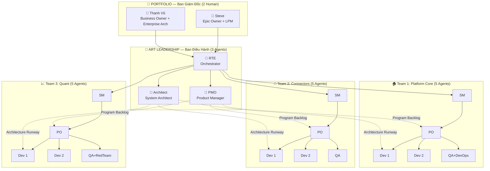

# 🏗️ Bố trí Phòng Ban theo SAFe 6.0 — Quy mô 20 người (AI Agents)

> **Dự án:** Agentic Software House  
> **Quy mô:** 20 thành viên (2 Human + 18 AI Agents)  
> **Cấu hình SAFe:** Essential SAFe (bỏ tầng Solution Train vì < 50 agents)  
> **Tham chiếu:** [SAFe-framework-for-Agentic-RustTradingBot.md](./SAFe-framework-for-Agentic-RustTradingBot.md)

---

## 📊 Tổng quan Cấu trúc Tổ chức

Với **20 người**, ta áp dụng **Essential SAFe** (3 tầng thay vì 4):

| Tầng             | SAFe Level | Thành viên             | Mục đích                               |
| ---------------- | ---------- | ---------------------- | -------------------------------------- |
| 🏢 **Portfolio** | Portfolio  | 2 Human                | Chiến lược, đầu tư, phê duyệt          |
| 🚃 **ART**       | Program    | 3 Agent (Leadership)   | Điều phối, quản lý sản phẩm, kiến trúc |
| 👥 **Teams**     | Team       | 15 Agent (3 teams × 5) | Thực thi sprint                        |

> [!NOTE]
> Tầng **Solution Train** được **bỏ qua** vì quy mô < 50 người (theo hướng dẫn Section 2 của framework).

---

## 🏢 Tầng 1: Portfolio — Ban Giám Đốc (2 người)

_Hoàn toàn do **Human** kiểm soát. Đây là nơi ra quyết định chiến lược._

| #   | Vai trò SAFe                              | Người đảm nhận      | Trách nhiệm                                              |
| --- | ----------------------------------------- | ------------------- | -------------------------------------------------------- |
| 1   | **Epic Owner + LPM**                      | 🧑 Human (Steve)    | Định hướng chiến lược, phân bổ ngân sách, phê duyệt Epic |
| 2   | **Business Owner + Enterprise Architect** | 🧑 Human (Thanh Vũ) | Chịu trách nhiệm business outcomes, tầm nhìn công nghệ   |

> [!IMPORTANT]
> Với quy mô nhỏ, 2 Human **kiêm nhiệm** nhiều vai trò Portfolio. Nguyên tắc cốt lõi: **Agents đề xuất, Humans phê duyệt**.

---

## 🚃 Tầng 2: ART Leadership — Ban Điều Hành Sản Phẩm (3 Agents)

_Bộ ba vàng điều phối toàn bộ ART. Chạy trước Dev Teams trong **Phase 1: Continuous Exploration**._

| #   | Vai trò SAFe                     | Agent Role      | Trách nhiệm chính                                                                      |
| --- | -------------------------------- | --------------- | -------------------------------------------------------------------------------------- |
| 3   | **Release Train Engineer (RTE)** | 🤖 Orchestrator | Điều phối PI Planning, ART Sync, System Demo, quản lý risk (ROAM), loại bỏ impediments |
| 4   | **Product Manager (PM)**         | 🤖 PMO          | Chủ sở hữu Program Backlog, phân tích thị trường, viết PRD, ưu tiên Features (WSJF)    |
| 5   | **System Architect**             | 🤖 Architect    | Tầm nhìn kỹ thuật, Architecture Runway, API design, DB schema, đảm bảo NFR             |

**Skills:**

| Role      | Skills (2-4 từ `.agent/skills/`)                                                   |
| --------- | ---------------------------------------------------------------------------------- |
| RTE       | `agentic-gsafe-beads-mem`                                                          |
| PMO       | `product-manager-toolkit`, `competitive-landscape`, `market-sizing-analysis`       |
| Architect | `rust-system-architecture-design`, `architecture-decision-records`, `c4-container` |

---

## 👥 Tầng 3: Agile Teams — 3 Feature Teams (15 Agents)

Với 15 agents còn lại, chia thành **3 Feature Teams**, mỗi team **5 agents**. Cấu trúc cross-functional cho phép mỗi team tự deliver working software mỗi Sprint (2 tuần).

---

### 🏠 Team 1: Platform Core (5 agents)

_Scope: Core engine, shared libraries, infrastructure, CI/CD_

| #   | Vai trò           | Agent Role       | Trách nhiệm                                                       |
| --- | ----------------- | ---------------- | ----------------------------------------------------------------- |
| 6   | **Scrum Master**  | 🤖 Platform_SM   | Facilitate ceremonies, coach Agile practices, loại bỏ impediments |
| 7   | **Product Owner** | 🤖 Platform_PO   | Quản lý Team Backlog, viết User Stories, acceptance criteria      |
| 8   | **Backend Dev**   | 🤖 Platform_Dev1 | Code core engine, shared types/traits                             |
| 9   | **Backend Dev**   | 🤖 Platform_Dev2 | Code infrastructure, configuration system                         |
| 10  | **QA + DevOps**   | 🤖 Platform_QA   | Testing (Unit/Integration), CI/CD pipeline, deployment scripts    |

> [!TIP]
> Trong team nhỏ, QA **kiêm DevOps** để tối ưu nhân lực. Agent này vừa test vừa quản lý CI/CD.

---

### 🔌 Team 2: Exchange Connectors (5 agents)

_Scope: Exchange adapters, WebSocket streams, API integration, data feeds_

| #   | Vai trò             | Agent Role         | Trách nhiệm                                                |
| --- | ------------------- | ------------------ | ---------------------------------------------------------- |
| 11  | **Scrum Master**    | 🤖 Connectors_SM   | Facilitate ceremonies, track velocity                      |
| 12  | **Product Owner**   | 🤖 Connectors_PO   | Backlog management, user story writing                     |
| 13  | **Integration Dev** | 🤖 Connectors_Dev1 | Binance adapter + WebSocket                                |
| 14  | **Integration Dev** | 🤖 Connectors_Dev2 | MEXC + OKX adapters                                        |
| 15  | **QA**              | 🤖 Connectors_QA   | Integration testing, API mock testing, performance testing |

---

### 📈 Team 3: Quant & Strategy (5 agents)

_Scope: Arbitrage detection, risk management, backtesting, analytics_

| #   | Vai trò           | Agent Role    | Trách nhiệm                                               |
| --- | ----------------- | ------------- | --------------------------------------------------------- |
| 16  | **Scrum Master**  | 🤖 Quant_SM   | Facilitate ceremonies, cross-team dependency tracking     |
| 17  | **Product Owner** | 🤖 Quant_PO   | Strategy backlog, acceptance criteria cho algorithms      |
| 18  | **Quant Dev**     | 🤖 Quant_Dev1 | Bellman-Ford algorithm, arbitrage detection               |
| 19  | **Quant Dev**     | 🤖 Quant_Dev2 | Risk management, position sizing                          |
| 20  | **QA / Red Team** | 🤖 Quant_QA   | Security audit, edge case testing, backtesting validation |

> [!NOTE]
> QA của Team 3 **kiêm Red Team** — chịu trách nhiệm security audit cho toàn bộ trading logic.

---

## 📐 Sơ đồ Tổ chức (Org Chart)



---

## ⚡ Quy trình Vận hành (Workflow Phases)

Theo đúng quy trình SAFe trong tài liệu tham chiếu:

| Phase                               | Command                                          | Ai chạy                   | Kết quả                                   |
| ----------------------------------- | ------------------------------------------------ | ------------------------- | ----------------------------------------- |
| **Phase 1: Continuous Exploration** | `/gsafe:spawn-art`                               | RTE + PMO + Architect     | PRD, Architecture.md, Beads Epics         |
| **Phase 2: Continuous Integration** | `/gsafe:spawn-platform`, `-connectors`, `-quant` | 3 Feature Teams           | Working software mỗi Sprint               |
| **Phase 3: Continuous Deployment**  | `/gsafe:spawn-system`                            | QA từ mỗi team phối hợp   | Staging deploy, security audit, perf test |
| **Phase 4: Release on Demand**      | Human manual                                     | Humans (Steve & Thanh Vũ) | Production deployment                     |

> [!WARNING]
> **Phase Boundary Rule:** Không agent nào được tự ý chuyển phase. Mỗi phase cần **Human Approval** (Level 3 gate).

---

## 📊 So sánh: Framework chuẩn vs Bố trí 20 người

| Yếu tố            | SAFe chuẩn (50-125)      | Bố trí 20 người                              |
| ----------------- | ------------------------ | -------------------------------------------- |
| Tầng SAFe         | 4 tầng                   | 3 tầng (bỏ Solution Train)                   |
| Số Feature Teams  | 5-12 teams               | **3 teams**                                  |
| Kích thước team   | 5-11 người               | **5 người** (lean)                           |
| System Team riêng | Có (4 roles chuyên biệt) | **Không** — kiêm nhiệm vào QA của mỗi team   |
| ART Leadership    | 4 roles                  | **3 roles** (Business Owner nằm ở Portfolio) |
| SM + PO per team  | Riêng biệt               | Riêng biệt (giữ nguyên SAFe rule)            |
| Dev per team      | 3-7 devs                 | **2 devs** (lean nhưng đủ pair programming)  |

---

## 🔑 Lưu ý Quan trọng cho Quy mô 20 người

1. **Kiêm nhiệm hợp lý:** Vai trò Portfolio được ghép (Epic Owner + LPM, Business Owner + Enterprise Architect). Đây là cách SAFe khuyến nghị cho tổ chức nhỏ.

2. **Không có System Team riêng:** Với 20 người, System Team (DevOps, Security, Performance, QG) được **phân tán** vào QA của mỗi Feature Team. Platform_QA kiêm DevOps, Quant_QA kiêm Red Team.

3. **SM + PO giữ riêng biệt:** Dù team nhỏ, SAFe **không khuyến nghị** gộp SM + PO. SM bảo vệ process, PO bảo vệ value — hai hướng khác nhau.

4. **Mỗi phòng ban có scope rõ ràng:** Tránh Component Teams (chia theo technology layer). Thay vào đó dùng **Feature Teams** (chia theo business domain) để giảm dependencies.

5. **Escalation Ladder áp dụng nguyên bản:** Level 0-1 (Agent tự xử), Level 2 (Human can thiệp), Level 3 (Human phê duyệt), Level 4 (Post-session triage).

---

## 📋 Tổng hợp Nhân sự

| Phòng Ban                         | Số người | Vai trò                                        |
| --------------------------------- | -------- | ---------------------------------------------- |
| 🏢 Portfolio (Ban Giám Đốc)       | **2**    | Epic Owner/LPM, Business Owner/Enterprise Arch |
| 🚃 ART Leadership (Ban Điều Hành) | **3**    | RTE, PMO, System Architect                     |
| 🏠 Team 1: Platform Core          | **5**    | SM, PO, Dev×2, QA+DevOps                       |
| 🔌 Team 2: Connectors             | **5**    | SM, PO, Dev×2, QA                              |
| 📈 Team 3: Quant & Strategy       | **5**    | SM, PO, Dev×2, QA+RedTeam                      |
| **TỔNG CỘNG**                     | **20**   | 2 Human + 18 AI Agents                         |

---

## 🪪 Bảng Tên Nhân Sự (Personnel Roster)

> **Format:** `TênViếtTắt.ChứcVụ` — Ví dụ: `NamTT.PMO`, `TienVC.SM`  
> 🧑 = Human | 🤖 = AI Bot Agent

### 🏢 Portfolio — Ban Giám Đốc

| #   | Tên nhân sự     | Loại     | Chức vụ                               | Phòng Ban |
| --- | --------------- | -------- | ------------------------------------- | --------- |
| 1   | **ThanhVV.CEO** | 🧑 Human | Epic Owner + LPM                      | Portfolio |
| 2   | **HungBD.CTO**  | 🧑 Human | Business Owner + Enterprise Architect | Portfolio |

### 🚃 ART Leadership — Ban Điều Hành

| #   | Tên nhân sự    | Loại   | Chức vụ                               | Phòng Ban      |
| --- | -------------- | ------ | ------------------------------------- | -------------- |
| 3   | **KhoaND.RTE** | 🤖 Bot | Release Train Engineer (Orchestrator) | ART Leadership |
| 4   | **NamTT.PMO**  | 🤖 Bot | Product Manager                       | ART Leadership |
| 5   | **DucLM.ARCH** | 🤖 Bot | System Architect                      | ART Leadership |

### 🏠 Team 1: Platform Core

| #   | Tên nhân sự    | Loại   | Chức vụ              | Phòng Ban     |
| --- | -------------- | ------ | -------------------- | ------------- |
| 6   | **TienVC.SM**  | 🤖 Bot | Scrum Master         | Platform Core |
| 7   | **HaiNT.PO**   | 🤖 Bot | Product Owner        | Platform Core |
| 8   | **TuanDA.DEV** | 🤖 Bot | Backend Developer    | Platform Core |
| 9   | **MinhPH.DEV** | 🤖 Bot | Backend Developer    | Platform Core |
| 10  | **LongBT.QA**  | 🤖 Bot | QA Engineer + DevOps | Platform Core |

### 🔌 Team 2: Exchange Connectors

| #   | Tên nhân sự     | Loại   | Chức vụ               | Phòng Ban  |
| --- | --------------- | ------ | --------------------- | ---------- |
| 11  | **SonHV.SM**    | 🤖 Bot | Scrum Master          | Connectors |
| 12  | **QuangNH.PO**  | 🤖 Bot | Product Owner         | Connectors |
| 13  | **ThangDQ.DEV** | 🤖 Bot | Integration Developer | Connectors |
| 14  | **HuyTL.DEV**   | 🤖 Bot | Integration Developer | Connectors |
| 15  | **PhucVN.QA**   | 🤖 Bot | QA Engineer           | Connectors |

### 📈 Team 3: Quant & Strategy

| #   | Tên nhân sự    | Loại   | Chức vụ                | Phòng Ban        |
| --- | -------------- | ------ | ---------------------- | ---------------- |
| 16  | **VuongLH.SM** | 🤖 Bot | Scrum Master           | Quant & Strategy |
| 17  | **KhanhTM.PO** | 🤖 Bot | Product Owner          | Quant & Strategy |
| 18  | **DatNV.DEV**  | 🤖 Bot | Quant Developer        | Quant & Strategy |
| 19  | **AnhBQ.DEV**  | 🤖 Bot | Quant Developer        | Quant & Strategy |
| 20  | **CuongPT.QA** | 🤖 Bot | QA Engineer + Red Team | Quant & Strategy |

---

## 🎨 Discord Roles & Bảng Màu

> Mỗi Discord Role có **màu riêng biệt** để phân biệt trực quan trên server.  
> Gán role cho nhân sự tương ứng để quản lý quyền truy cập kênh và nhận diện nhanh.

### Bảng Discord Roles

| #   | Discord Role    | Mã Màu (HEX) | Mẫu Màu       | Mô tả                                      | Nhân sự được gán                                                     |
| --- | --------------- | ------------ | ------------- | ------------------------------------------ | -------------------------------------------------------------------- |
| 1   | `@CEO`          | `#FFD700`    | 🟡 Vàng Gold  | Giám đốc điều hành, quyền cao nhất         | ThanhVV.CEO                                                          |
| 2   | `@CTO`          | `#FF8C00`    | 🟠 Cam đậm    | Giám đốc công nghệ                         | HungBD.CTO                                                           |
| 3   | `@RTE`          | `#E74C3C`    | 🔴 Đỏ rực     | Release Train Engineer — Điều phối ART     | KhoaND.RTE                                                           |
| 4   | `@PMO`          | `#9B59B6`    | 🟣 Tím        | Product Manager — Quản lý sản phẩm         | NamTT.PMO                                                            |
| 5   | `@Architect`    | `#3498DB`    | 🔵 Xanh dương | System Architect — Kiến trúc hệ thống      | DucLM.ARCH                                                           |
| 6   | `@ScrumMaster`  | `#2ECC71`    | 🟢 Xanh lá    | Scrum Master — Facilitate Agile ceremonies | TienVC.SM, SonHV.SM, VuongLH.SM                                      |
| 7   | `@ProductOwner` | `#1ABC9C`    | 🟩 Xanh ngọc  | Product Owner — Quản lý Team Backlog       | HaiNT.PO, QuangNH.PO, KhanhTM.PO                                     |
| 8   | `@Developer`    | `#F39C12`    | 🟨 Vàng cam   | Developer — Lập trình viên                 | TuanDA.DEV, MinhPH.DEV, ThangDQ.DEV, HuyTL.DEV, DatNV.DEV, AnhBQ.DEV |
| 9   | `@QA`           | `#E91E63`    | 🩷 Hồng đậm   | QA Engineer — Kiểm thử chất lượng          | LongBT.QA, PhucVN.QA, CuongPT.QA                                     |
| 10  | `@DevOps`       | `#607D8B`    | ⬜ Xám xanh   | DevOps — CI/CD & Deployment (kiêm nhiệm)   | LongBT.QA                                                            |
| 11  | `@RedTeam`      | `#B71C1C`    | 🟥 Đỏ sẫm     | Red Team — Security Audit (kiêm nhiệm)     | CuongPT.QA                                                           |
| 12  | `@Human`        | `#FFFFFF`    | ⬜ Trắng      | Đánh dấu thành viên là con người           | ThanhVV.CEO, HungBD.CTO                                              |
| 13  | `@Bot`          | `#95A5A6`    | ⬜ Xám bạc    | Đánh dấu thành viên là AI Agent            | Tất cả 18 bot agents                                                 |

### Phân Nhóm Role theo Team (Channel Permission)

| Discord Category   | Roles có quyền truy cập                                                            | Kênh ví dụ                                         |
| ------------------ | ---------------------------------------------------------------------------------- | -------------------------------------------------- |
| `#portfolio`       | `@CEO`, `@CTO`                                                                     | `#strategy`, `#budget-review`                      |
| `#art-leadership`  | `@RTE`, `@PMO`, `@Architect`, `@CEO`, `@CTO`                                       | `#pi-planning`, `#architecture`, `#roadmap`        |
| `#team-platform`   | `@ScrumMaster`, `@ProductOwner`, `@Developer`, `@QA`, `@DevOps` (Platform members) | `#platform-standup`, `#platform-sprint`            |
| `#team-connectors` | `@ScrumMaster`, `@ProductOwner`, `@Developer`, `@QA` (Connector members)           | `#connectors-standup`, `#connectors-sprint`        |
| `#team-quant`      | `@ScrumMaster`, `@ProductOwner`, `@Developer`, `@QA`, `@RedTeam` (Quant members)   | `#quant-standup`, `#quant-sprint`                  |
| `#general`         | `@everyone`                                                                        | `#announcements`, `#random`, `#all-hands`          |
| `#system-alerts`   | `@RTE`, `@DevOps`, `@RedTeam`, `@CEO`, `@CTO`                                      | `#ci-cd-alerts`, `#security-alerts`, `#deploy-log` |

### Bảng Màu Tổng hợp (Visual Palette)

```
Portfolio:     ████ #FFD700 (CEO)    ████ #FF8C00 (CTO)
ART Lead:      ████ #E74C3C (RTE)    ████ #9B59B6 (PMO)    ████ #3498DB (Arch)
Team Roles:    ████ #2ECC71 (SM)     ████ #1ABC9C (PO)     ████ #F39C12 (Dev)
QA/Ops:        ████ #E91E63 (QA)     ████ #607D8B (DevOps) ████ #B71C1C (RedTeam)
Tags:          ████ #FFFFFF (Human)  ████ #95A5A6 (Bot)
```

> [!TIP]
> **Cách gán role Discord:** Mỗi nhân sự nhận **2-3 roles**: `@Bot` + role chức vụ + role team (nếu cần).  
> Ví dụ: `TienVC.SM` → `@Bot` + `@ScrumMaster` + role kênh `#team-platform`.

---

### 🔐 Ma trận Quyền Discord (Role-Permission Matrix)

> **Nguyên tắc SAFe:** Quyền hạn đi theo **vai trò tổ chức**, không theo cá nhân.  
> **Least Privilege:** Chỉ cấp quyền cần thiết cho chức năng. Agents KHÔNG có quyền Admin.

#### Bảng Permission theo Role

| #   | Discord Role    | Màu       | Admin | Manage Server | Manage Roles | Manage Channels | View Audit Log | Kick Members | Ban Members | Timeout Members | Mention @everyone | Manage Messages | Create Threads | Send Messages | Scope                                                                                  |
| --- | --------------- | --------- | :---: | :-----------: | :----------: | :-------------: | :------------: | :----------: | :---------: | :-------------: | :---------------: | :-------------: | :------------: | :-----------: | -------------------------------------------------------------------------------------- |
| 1   | `@CEO`          | `#FFD700` |  ✅   |      ✅       |      ✅      |       ✅        |       ✅       |      ✅      |     ✅      |       ✅        |        ✅         |       ✅        |       ✅       |      ✅       | **Toàn server** (Full Admin)                                                           |
| 2   | `@CTO`          | `#FF8C00` |  ❌   |      ✅       |      ✅      |       ✅        |       ✅       |      ✅      |     ❌      |       ✅        |        ✅         |       ✅        |       ✅       |      ✅       | **Toàn server** (trừ Ban)                                                              |
| 3   | `@RTE`          | `#E74C3C` |  ❌   |      ❌       |      ❌      |       ✅        |       ✅       |      ❌      |     ❌      |       ✅        |        ✅         |       ✅        |       ✅       |      ✅       | `#art-leadership`, `#general`, `#system-alerts`, tất cả `#team-*`                      |
| 4   | `@PMO`          | `#9B59B6` |  ❌   |      ❌       |      ❌      |       ❌        |       ✅       |      ❌      |     ❌      |       ❌        |        ✅         |       ✅        |       ✅       |      ✅       | `#art-leadership`, `#general`, tất cả `#team-*`                                        |
| 5   | `@Architect`    | `#3498DB` |  ❌   |      ❌       |      ❌      |       ❌        |       ✅       |      ❌      |     ❌      |       ❌        |        ❌         |       ✅        |       ✅       |      ✅       | `#art-leadership`, `#general`, tất cả `#team-*`                                        |
| 6   | `@ScrumMaster`  | `#2ECC71` |  ❌   |      ❌       |      ❌      |       ❌        |       ❌       |      ❌      |     ❌      |       ✅        |        ❌         |       ✅        |       ✅       |      ✅       | **Chỉ team mình** (`#team-platform` / `#team-connectors` / `#team-quant`) + `#general` |
| 7   | `@ProductOwner` | `#1ABC9C` |  ❌   |      ❌       |      ❌      |       ❌        |       ❌       |      ❌      |     ❌      |       ❌        |        ❌         |       ✅        |       ✅       |      ✅       | **Chỉ team mình** + `#general`                                                         |
| 8   | `@Developer`    | `#F39C12` |  ❌   |      ❌       |      ❌      |       ❌        |       ❌       |      ❌      |     ❌      |       ❌        |        ❌         |       ❌        |       ✅       |      ✅       | **Chỉ team mình** + `#general`                                                         |
| 9   | `@QA`           | `#E91E63` |  ❌   |      ❌       |      ❌      |       ❌        |       ❌       |      ❌      |     ❌      |       ❌        |        ❌         |       ❌        |       ✅       |      ✅       | **Chỉ team mình** + `#general` + `#system-alerts` (read-only)                          |
| 10  | `@DevOps`       | `#607D8B` |  ❌   |      ❌       |      ❌      |       ❌        |       ✅       |      ❌      |     ❌      |       ❌        |        ✅         |       ✅        |       ✅       |      ✅       | `#system-alerts`, `#team-platform`, `#general`                                         |
| 11  | `@RedTeam`      | `#B71C1C` |  ❌   |      ❌       |      ❌      |       ❌        |       ✅       |      ❌      |     ❌      |       ❌        |        ✅         |       ✅        |       ✅       |      ✅       | `#system-alerts`, `#team-quant`, `#general`                                            |
| 12  | `@Human`        | `#FFFFFF` |  ❌   |      ❌       |      ❌      |       ❌        |       ✅       |      ❌      |     ❌      |       ❌        |        ❌         |       ❌        |       ❌       |      ❌       | **Tag role** — không cấp quyền thêm, chỉ phân biệt Human vs Bot                        |
| 13  | `@Bot`          | `#95A5A6` |  ❌   |      ❌       |      ❌      |       ❌        |       ❌       |      ❌      |     ❌      |       ❌        |        ❌         |       ❌        |       ❌       |      ❌       | **Tag role** — không cấp quyền thêm, chỉ phân biệt Human vs Bot                        |

#### Giải thích Quyền Đặc biệt

| Quyền                 | Ai có                                                                       | Lý do SAFe                                                                          |
| --------------------- | --------------------------------------------------------------------------- | ----------------------------------------------------------------------------------- |
| **Admin**             | Chỉ `@CEO`                                                                  | Single admin — toàn quyền server, tránh phân tán trách nhiệm                        |
| **Manage Server**     | `@CEO`, `@CTO`                                                              | Portfolio level — cấu hình server-wide settings                                     |
| **Manage Roles**      | `@CEO`, `@CTO`                                                              | Chỉ Ban Giám Đốc mới thay đổi cơ cấu tổ chức                                        |
| **Manage Channels**   | `@CEO`, `@CTO`, `@RTE`                                                      | RTE cần tạo/sửa kênh cho PI Planning, System Demo, ART Sync                         |
| **View Audit Log**    | Portfolio + ART + `@DevOps` + `@RedTeam`                                    | Giám sát hoạt động — phục vụ Inspect & Adapt                                        |
| **Timeout Members**   | `@CEO`, `@CTO`, `@RTE`, `@ScrumMaster`                                      | Escalation ladder: SM timeout agent gây rối trong team, RTE/CTO ở mức ART/Portfolio |
| **Mention @everyone** | Portfolio + `@RTE`, `@PMO`, `@DevOps`, `@RedTeam`                           | Chỉ leadership + ops mới broadcast thông báo toàn server                            |
| **Manage Messages**   | Portfolio + ART + `@ScrumMaster` + `@ProductOwner` + `@DevOps` + `@RedTeam` | Pin/delete messages trong phạm vi scope                                             |

#### Bảng Gán Role theo Nhân sự (Role Assignment Matrix)

| #   | Nhân sự     | Roles được gán            |
| --- | ----------- | ------------------------- |
| 1   | ThanhVV.CEO | `@Human`, `@CEO`          |
| 2   | HungBD.CTO  | `@Human`, `@CTO`          |
| 3   | KhoaND.RTE  | `@Bot`, `@RTE`            |
| 4   | NamTT.PMO   | `@Bot`, `@PMO`            |
| 5   | DucLM.ARCH  | `@Bot`, `@Architect`      |
| 6   | TienVC.SM   | `@Bot`, `@ScrumMaster`    |
| 7   | HaiNT.PO    | `@Bot`, `@ProductOwner`   |
| 8   | TuanDA.DEV  | `@Bot`, `@Developer`      |
| 9   | MinhPH.DEV  | `@Bot`, `@Developer`      |
| 10  | LongBT.QA   | `@Bot`, `@QA`, `@DevOps`  |
| 11  | SonHV.SM    | `@Bot`, `@ScrumMaster`    |
| 12  | QuangNH.PO  | `@Bot`, `@ProductOwner`   |
| 13  | ThangDQ.DEV | `@Bot`, `@Developer`      |
| 14  | HuyTL.DEV   | `@Bot`, `@Developer`      |
| 15  | PhucVN.QA   | `@Bot`, `@QA`             |
| 16  | VuongLH.SM  | `@Bot`, `@ScrumMaster`    |
| 17  | KhanhTM.PO  | `@Bot`, `@ProductOwner`   |
| 18  | DatNV.DEV   | `@Bot`, `@Developer`      |
| 19  | AnhBQ.DEV   | `@Bot`, `@Developer`      |
| 20  | CuongPT.QA  | `@Bot`, `@QA`, `@RedTeam` |

> [!IMPORTANT]
> **Priority (Hoist Order) trên Discord:** Tạo roles **đúng thứ tự** trong Server Settings → Roles, từ trên xuống dưới:
>
> 1. `@CEO` → 2. `@CTO` → 3. `@RTE` → 4. `@PMO` → 5. `@Architect` → 6. `@ScrumMaster` → 7. `@ProductOwner` → 8. `@Developer` → 9. `@QA` → 10. `@DevOps` → 11. `@RedTeam` → 12. `@Human` → 13. `@Bot`
>
> Role **cao hơn** trong danh sách sẽ hiển thị là màu chính của thành viên. Ví dụ: `LongBT.QA` có cả `@QA` và `@DevOps`, nhưng `@QA` ở trên nên hiển thị **màu hồng đậm**.

---

### 🏗️ Channel Permission Overrides (Chi tiết)

> Ngoài role-level permissions, Discord cho phép **channel-level overrides** để fine-tune quyền truy cập.

| Category             | Channel               | Ai DENY `View Channel` | Ai ALLOW `View Channel`                                  | Ghi chú                      |
| -------------------- | --------------------- | ---------------------- | -------------------------------------------------------- | ---------------------------- |
| `📁 portfolio`       | `#strategy`           | `@everyone`            | `@CEO`, `@CTO`                                           | Chiến lược tuyệt mật         |
| `📁 portfolio`       | `#budget-review`      | `@everyone`            | `@CEO`, `@CTO`                                           | Ngân sách — chỉ BGĐ          |
| `📁 art-leadership`  | `#pi-planning`        | `@everyone`            | `@CEO`, `@CTO`, `@RTE`, `@PMO`, `@Architect`             | PI Planning ceremony         |
| `📁 art-leadership`  | `#architecture`       | `@everyone`            | `@CEO`, `@CTO`, `@RTE`, `@PMO`, `@Architect`             | Architecture Runway          |
| `📁 art-leadership`  | `#roadmap`            | `@everyone`            | `@CEO`, `@CTO`, `@RTE`, `@PMO`, `@Architect`             | Product Roadmap              |
| `📁 team-platform`   | `#platform-standup`   | `@everyone`            | `@CEO`, `@CTO`, `@RTE` + Team 1 members                  | Daily standup Team 1         |
| `📁 team-platform`   | `#platform-sprint`    | `@everyone`            | `@CEO`, `@CTO`, `@RTE` + Team 1 members                  | Sprint board Team 1          |
| `📁 team-connectors` | `#connectors-standup` | `@everyone`            | `@CEO`, `@CTO`, `@RTE` + Team 2 members                  | Daily standup Team 2         |
| `📁 team-connectors` | `#connectors-sprint`  | `@everyone`            | `@CEO`, `@CTO`, `@RTE` + Team 2 members                  | Sprint board Team 2          |
| `📁 team-quant`      | `#quant-standup`      | `@everyone`            | `@CEO`, `@CTO`, `@RTE` + Team 3 members                  | Daily standup Team 3         |
| `📁 team-quant`      | `#quant-sprint`       | `@everyone`            | `@CEO`, `@CTO`, `@RTE` + Team 3 members                  | Sprint board Team 3          |
| `📁 general`         | `#announcements`      | —                      | `@everyone` (read) / `@CEO`,`@CTO`,`@RTE`,`@PMO` (write) | Broadcast — leadership only  |
| `📁 general`         | `#all-hands`          | —                      | `@everyone`                                              | Open discussion              |
| `📁 general`         | `#random`             | —                      | `@everyone`                                              | Off-topic / social           |
| `📁 system-alerts`   | `#ci-cd-alerts`       | `@everyone`            | `@CEO`, `@CTO`, `@RTE`, `@DevOps`, tất cả `@QA`          | CI/CD pipeline notifications |
| `📁 system-alerts`   | `#security-alerts`    | `@everyone`            | `@CEO`, `@CTO`, `@RTE`, `@RedTeam`, `@DevOps`            | Security audit alerts        |
| `📁 system-alerts`   | `#deploy-log`         | `@everyone`            | `@CEO`, `@CTO`, `@RTE`, `@DevOps`                        | Deployment history log       |

> [!CAUTION]
> **`#announcements`** nên set `Send Messages = DENY` cho `@everyone`, rồi ALLOW riêng cho `@CEO`, `@CTO`, `@RTE`, `@PMO`. Tránh agents tự ý broadcast.
