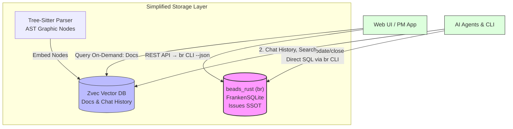

# Nghiên cứu: beads_rust + FrankenSQLite — Thay thế beads + DoltDB

> **Vai trò:** Researcher & Business Analyst  
> **Ngày:** 2026-02-28  
> **Trạng thái:** Research Complete  
> **Tham chiếu:** [beads_rust](file:///Users/steve/duyhunghd6/gmind/reference/beads_rust), [PRD-02-Storage](file:///Users/steve/duyhunghd6/gmind/docs/PRDs/PRD-02-Storage.md)

---

## 1. Tóm tắt (Executive Summary)

**Câu hỏi nghiên cứu:** Liệu `beads_rust` (br) sử dụng FrankenSQLite có đủ sức thay thế hoàn toàn `beads` (bd) + DoltDB trong kiến trúc gmind — bao gồm cả nghiệp vụ đưa metadata PM (assignee, dependencies, QA tracking) vào bên trong?

**Kết luận:** ✅ **CÓ — beads_rust + FrankenSQLite có thể thay thế** beads + DoltDB cho use-case của gmind, với một số điều kiện và trade-off cần chấp nhận.

| Tiêu chí                  | DoltDB (Hiện tại)                | beads_rust + FrankenSQLite                           |
| ------------------------- | -------------------------------- | ---------------------------------------------------- |
| Cell-level merge          | ✅ Native                        | ⚠️ MVCC page-level (tương đương cho single-machine)  |
| Git-like branching        | ✅ Native                        | ⚠️ Time Travel Queries (Native Mode) — chỉ read-only |
| Concurrent writers        | ✅ MySQL protocol                | ✅ MVCC concurrent writers (page-level SSI)          |
| Binary size               | ~30+ MB                          | ~5-8 MB                                              |
| Startup time              | Chậm (Go runtime + Dolt init)    | Nhanh (Rust, no GC)                                  |
| Offline / Local-first     | ⚠️ Cần Dolt server hoặc embedded | ✅ In-process SQLite                                 |
| JSON metadata (PM fields) | Qua cột metadata JSON            | ✅ Có sẵn first-class columns + có thể mở rộng       |
| Pure Rust / Zero unsafe   | ❌ Go + CGo                      | ✅ `#![forbid(unsafe_code)]`                         |
| JSONL git-friendly sync   | ❌ Dolt branches                 | ✅ Native JSONL export/import                        |

---

## 2. Phân tích Chi tiết

### 2.1. FrankenSQLite là gì?

FrankenSQLite (fsqlite) là **bản reimplementation hoàn toàn của SQLite bằng Rust thuần** (không phải binding), với hai cải tiến kiến trúc lớn:

1. **MVCC Concurrent Writers**: Thay thế single-writer lock của SQLite bằng page-level Multi-Version Concurrency Control. Nhiều writer commit đồng thời nếu chạm các page khác nhau. Sử dụng **Serializable Snapshot Isolation (SSI)** để ngăn write skew.

2. **RaptorQ Durability**: Mọi layer persistent được bảo vệ bằng fountain codes (RFC 6330) cho self-healing sau torn writes.

**Hai chế độ hoạt động:**

- **Compatibility Mode** (mặc định): File format tương thích 100% với `.sqlite` chuẩn.
- **Native Mode**: Content-addressed, erasure-coded objects (ECS) — hỗ trợ **Time Travel Queries** (truy vấn dữ liệu tại bất kỳ thời điểm nào trong quá khứ).

### 2.2. beads_rust (br) — Kiến trúc tổng quan

beads_rust là bản port của beads (Go) sang Rust, đóng băng ở kiến trúc "classic" SQLite + JSONL:

```
.beads/
├── beads.db        # FrankenSQLite database (primary storage)
├── issues.jsonl    # JSONL export (git-friendly)
├── config.yaml     # Project configuration
└── metadata.json   # Workspace metadata
```

**Số liệu:**

- ~20,000 dòng Rust (vs ~276,000 dòng Go của beads gốc)
- Binary ~5-8 MB (vs ~30+ MB)
- Zero daemon, zero git hooks, zero tự động

**Schema** gồm 11 bảng:

| Bảng                   | Vai trò                                                                                  |
| ---------------------- | ---------------------------------------------------------------------------------------- |
| `issues`               | Core work item — **35+ cột** bao gồm assignee, owner, status, priority, issue_type, v.v. |
| `dependencies`         | Quan hệ phụ thuộc (blocks, parent-child, conditional-blocks, waits-for, related, v.v.)   |
| `labels`               | Tags phân loại                                                                           |
| `comments`             | Thảo luận trên từng issue                                                                |
| `events`               | Audit trail (mọi thay đổi đều được log)                                                  |
| `config`               | Key-value runtime configuration                                                          |
| `metadata`             | Internal state                                                                           |
| `dirty_issues`         | Tracking thay đổi chưa export                                                            |
| `export_hashes`        | Incremental export                                                                       |
| `blocked_issues_cache` | Materialized view cho blocked queries                                                    |
| `child_counters`       | Hierarchical IDs (bd-abc.1, bd-abc.2)                                                    |

### 2.3. So sánh: DoltDB vs FrankenSQLite cho nghiệp vụ gmind

#### A. Cell-level Merge (Đa Agent cùng thay đổi)

| Tính năng              | DoltDB                      | FrankenSQLite                                        |
| ---------------------- | --------------------------- | ---------------------------------------------------- |
| Merge granularity      | Cell-level (giá trị cụ thể) | Page-level (4KB page)                                |
| Conflict resolution    | 3-way merge tự động         | SSI + First-Committer-Wins + Safe Write Merge Ladder |
| Multi-agent concurrent | ✅ Qua MySQL protocol       | ✅ In-process MVCC (nhanh hơn cho local)             |

> [!IMPORTANT]
> **Đánh giá:** Trong thực tế gmind — nơi agents chạy **tuần tự hoặc bán-song song trên cùng máy** — FrankenSQLite's MVCC đã **đủ mạnh**. Cell-level merge của Dolt chỉ thực sự cần thiết khi có multi-node distributed writes, điều mà gmind không yêu cầu ở giai đoạn hiện tại.

#### B. Git-like Branching & Time Travel

| Tính năng    | DoltDB              | FrankenSQLite                                 |
| ------------ | ------------------- | --------------------------------------------- |
| Branch/Merge | ✅ Đầy đủ giống Git | ⚠️ Không có branching                         |
| Time Travel  | ✅ `AS OF` queries  | ✅ `FOR SYSTEM_TIME AS OF` (Native Mode only) |
| Diff         | ✅ `dolt diff`      | ⚠️ Qua JSONL diff trên git                    |

> [!NOTE]
> DoltDB branching trong PRD gốc được dùng cho: _"Phân nhánh workflow tự nhiên như Git"_. Tuy nhiên, trong thực tế gmind, branching DB chưa được triển khai thực sự. **JSONL + git branching** phục vụ cùng mục đích với chi phí thấp hơn.

#### C. Nghiệp vụ PM Metadata

PRD-02 thiết kế metadata PM qua cột JSON:

```json
{
  "assignee": "DatNV.DEV",
  "role_required": "@Developer",
  "dependencies": { "blocked_by": ["bd-105"], "blocks": ["bd-110"] },
  "qa_verification": { "status": "PASSED", "verified_by": "CuongPT.QA" }
}
```

**beads_rust đã có sẵn hầu hết dưới dạng first-class columns:**

| PRD-02 Metadata Field         | beads_rust Equivalent             | Tình trạng            |
| ----------------------------- | --------------------------------- | --------------------- |
| `assignee`                    | Cột `assignee` trong `issues`     | ✅ Có sẵn             |
| `role_required`               | Labels hoặc custom field          | ⚠️ Cần mở rộng        |
| `dependencies.blocked_by`     | Bảng `dependencies` (type=blocks) | ✅ Có sẵn             |
| `dependencies.blocks`         | `dependencies` (reverse lookup)   | ✅ Có sẵn             |
| `qa_verification.status`      | Custom status hoặc labels         | ⚠️ Cần mở rộng        |
| `qa_verification.verified_by` | Comments + Events audit           | ✅ Audit trail có sẵn |
| `escalation_level`            | Priority (0-4) mapping            | ✅ Map được           |

> [!TIP]
> **Lợi thế lớn:** Các trường PM là **first-class SQL columns** (indexed, queryable) thay vì JSON blob. Điều này cho **hiệu năng tốt hơn nhiều** so với `JSON_EXTRACT()` trên Dolt.

### 2.4. Phân tích Gap — Những gì beads_rust thiếu

| Gap                               | Mức độ     | Giải pháp đề xuất                                      |
| --------------------------------- | ---------- | ------------------------------------------------------ |
| Không có `role_required` field    | Thấp       | Dùng labels: `role:developer`, `role:qa`               |
| Không có `qa_verification` object | Trung bình | Thêm `qa_status`, `qa_verified_by` columns (migration) |
| Không có `escalation_level`       | Thấp       | Map vào priority (0=Auto → 4=Human Approval)           |
| Không có Web UI API layer         | Cao        | Cần build REST/WebSocket API wrapper riêng             |
| Không có real-time notification   | Trung bình | Polling dirty_issues hoặc events table                 |
| Không có `JSON_SET()` dynamic     | Thấp       | Không cần — first-class columns ưu việt hơn            |
| Time Travel chỉ ở Native Mode     | Trung bình | Chấp nhận Compatibility Mode + JSONL git history       |

---

## 3. Kiến trúc Đề xuất: beads_rust thay thế Dolt



**Thay đổi so với PRD-02:**

| Thành phần           | Trước (PRD-02)        | Sau (Đề xuất)                               |
| -------------------- | --------------------- | ------------------------------------------- |
| Issue SSOT           | DoltDB                | **beads_rust (FrankenSQLite)**              |
| PM Metadata          | JSON column trên Dolt | **First-class SQL columns** trên beads_rust |
| Sync / Collaboration | Dolt branches         | **JSONL + git**                             |
| Vector Search        | Zvec                  | Zvec (**giữ nguyên**)                       |
| AST / Graph          | Tree-sitter → Zvec    | Tree-sitter → Zvec (**giữ nguyên**)         |

---

## 4. Lợi ích & Rủi ro

### ✅ Lợi ích

1. **Giảm complexity:** Loại bỏ hoàn toàn Dolt dependency (~30+ MB binary, Go runtime, MySQL protocol overhead)
2. **Tốc độ:** FrankenSQLite in-process, zero network latency, MVCC concurrent writes
3. **First-class fields:** Assignee, priority, dependencies là SQL columns — indexed, type-safe, queryable
4. **Git-native sync:** JSONL merge trên git dễ dàng hơn Dolt branching
5. **Agent-first design:** `--json` output, structured errors, machine-readable schema
6. **Safety:** `#![forbid(unsafe_code)]`, atomic writes, path safety validation
7. **Nhẹ:** Binary 5-8 MB, startup < 50ms, zero daemon

### ⚠️ Rủi ro & Mitigations

| Rủi ro                         | Mức        | Mitigation                                                         |
| ------------------------------ | ---------- | ------------------------------------------------------------------ |
| FrankenSQLite còn mới (v0.1.0) | Trung bình | beads_rust đã test và dùng production; fsqlite cùng tác giả với br |
| Mất cell-level merge của Dolt  | Thấp       | MVCC page-level + JSONL git diff đủ dùng cho single-machine        |
| Mất branching database         | Thấp       | Dùng git branching + JSONL thay thế                                |
| Cần custom columns cho PM      | Thấp       | beads_rust có migration system sẵn, dễ thêm cột                    |
| Không có WebSocket real-time   | Trung bình | Build API layer riêng polling events table                         |

---

## 5. Kế hoạch Hành động (Recommended Next Steps)

### Phase 1: Migration Schema (1-2 ngày)

- [ ] Thêm columns PM mở rộng vào beads_rust schema: `qa_status`, `qa_verified_by`, `test_logs_ref`
- [ ] Thêm migration function trong `schema.rs`
- [ ] Map `escalation_level` → priority (hoặc thêm column riêng)
- [ ] Thêm labels convention: `role:developer`, `role:qa`, `role:pmo`

### Phase 2: API Layer (2-3 ngày)

- [ ] Build Go wrapper/adapter gọi `br` CLI với `--json` flag
- [ ] Hoặc: Embed FrankenSQLite trực tiếp trong gmind Go binary (qua CGo hoặc subprocess)
- [ ] Expose REST endpoints mapping 1:1 với br commands

### Phase 3: Update PRDs (1 ngày)

- [ ] Cập nhật PRD-02: Thay thế Dolt bằng beads_rust
- [ ] Cập nhật PRD-01: Architecture diagram
- [ ] Document migration path từ Dolt → beads_rust

### Phase 4: Web UI Integration (3-5 ngày)

- [ ] API Gateway nhận query từ Web UI → gọi `br list/show --json`
- [ ] Real-time updates qua polling `events` table
- [ ] Kanban board mapping từ br statuses

---

## 6. Kết luận & Đề xuất

> [!IMPORTANT]
> **beads_rust + FrankenSQLite có đủ sức thay thế beads + DoltDB** cho kiến trúc gmind trong giai đoạn hiện tại, với điều kiện:
>
> 1. Chấp nhận page-level MVCC thay cho cell-level merge (đủ dùng cho single-machine multi-agent)
> 2. Dùng JSONL + git branching thay cho Dolt database branching
> 3. Thêm ~5 columns PM vào schema (migration nhẹ, có sẵn hạ tầng)

**Ưu tiên cao:** Giảm được ~30 MB binary size, loại bỏ Dolt Go runtime dependency, tận dụng first-class SQL columns cho PM metadata thay vì JSON blob, và hưởng lợi từ MVCC concurrent writes + zero unsafe Rust safety guarantees.

**Đề xuất:** Tiến hành theo phương án **beads_rust thay thế Dolt**, giữ nguyên Zvec cho vector search. Đây là kiến trúc "simple architect" phù hợp nhất cho gmind ở giai đoạn MVP → Production.

---

## Phụ lục: Tham chiếu Kỹ thuật

### A. beads_rust Schema — Issues Table (35+ cột)

```sql
CREATE TABLE issues (
    id TEXT PRIMARY KEY,
    content_hash TEXT,
    title TEXT NOT NULL CHECK(length(title) <= 500),
    description TEXT NOT NULL DEFAULT '',
    design TEXT NOT NULL DEFAULT '',
    acceptance_criteria TEXT NOT NULL DEFAULT '',
    notes TEXT NOT NULL DEFAULT '',
    status TEXT NOT NULL DEFAULT 'open',
    priority INTEGER NOT NULL DEFAULT 2 CHECK(priority >= 0 AND priority <= 4),
    issue_type TEXT NOT NULL DEFAULT 'task',
    assignee TEXT,
    owner TEXT DEFAULT '',
    estimated_minutes INTEGER,
    created_at DATETIME NOT NULL DEFAULT CURRENT_TIMESTAMP,
    created_by TEXT DEFAULT '',
    updated_at DATETIME NOT NULL DEFAULT CURRENT_TIMESTAMP,
    closed_at DATETIME,
    close_reason TEXT DEFAULT '',
    due_at DATETIME,
    defer_until DATETIME,
    external_ref TEXT,
    source_system TEXT DEFAULT '',
    source_repo TEXT NOT NULL DEFAULT '.',
    deleted_at DATETIME,
    deleted_by TEXT DEFAULT '',
    delete_reason TEXT DEFAULT '',
    -- ... và nhiều cột khác
);
```

### B. FrankenSQLite MVCC — Concurrent Writers

```
Transaction A: INSERT INTO issues ...     Transaction B: UPDATE issues SET ...
         │                                          │
         ▼                                          ▼
1. Acquire page lock (page 47)           1. Acquire page lock (page 112)
   (different pages → no conflict)          (different pages → no conflict)
         │                                          │
         ▼                                          ▼
2. Copy-on-write: new version            2. Copy-on-write: new version
         │                                          │
         ▼                                          ▼
3. Commit: append to WAL                 3. Commit: append to WAL
   (mutex only for append)                  (mutex only for append)
```

### C. Dependency Types trong beads_rust

| Type                 | Meaning                                   | Blocks Ready? |
| -------------------- | ----------------------------------------- | ------------- |
| `blocks`             | A blocks B (B can't start until A closes) | ✅ Yes        |
| `parent-child`       | Hierarchical relationship                 | ✅ Yes        |
| `conditional-blocks` | Conditional blocking                      | ✅ Yes        |
| `waits-for`          | Soft dependency                           | ✅ Yes        |
| `related`            | Informational link                        | ❌ No         |
| `discovered-from`    | Origin tracking                           | ❌ No         |
| `replies-to`         | Comment threading                         | ❌ No         |
| `duplicates`         | Duplicate tracking                        | ❌ No         |
| `supersedes`         | Replacement tracking                      | ❌ No         |
