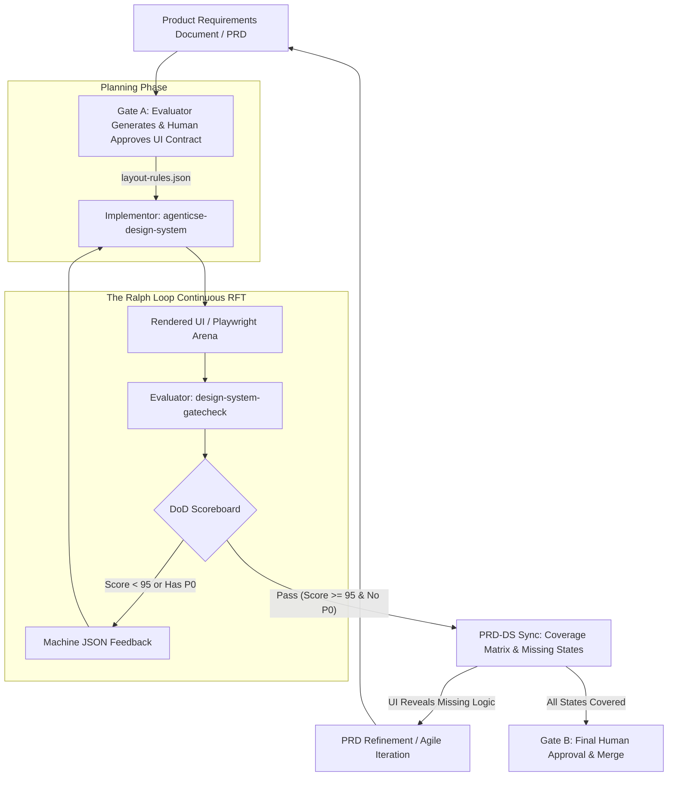

# Spike: Design System Ralph Loop & UI/UX Agentic Integration

<!-- beads-id: bd-spike-ds-ralph-loop-agent -->

**Beads ID:** bd-spike-ds-ralph-loop-agent
**Author:** Agent
**Phase:** Continuous Exploration — Activity B (Collaborate & Research)

> **Note:** This document provides a comprehensive overview of the UIUX Gatecheck process, 3-Tier Evaluation, Ralph Loop DoD, and Conflict analysis between Agents/Skills.

---

<!-- Original File: docs/researches/spikes/spike-design-system-ralph-loop-dod.md -->

# Spike: Design System Ralph Loop & DoD Scoreboard (Agent RFT Edition)

**Beads ID:** bd-ralph-loop-dod  
**Author:** Agent  
**Phase:** Continuous Exploration — Activity B (Collaborate & Research)

## Hypothesis

By establishing a quantified **Definition of Done (DoD) Scoreboard**, we can automate a "Ralph Loop" between two specialized agents, and ultimately use this loop as a continuous reward function for **Agent Reinforcement Fine-Tuning (Agent RFT)**:

1. **The Implementor:** `agenticse-design-system` (Writes HTML/CSS/Tokens)
2. **The Evaluator:** `design-system-gatecheck` (Audits against Contract & Policies)

The loop iterates until the implementation achieves a strict convergence threshold (e.g., >= 95/100 points with zero P0 violations). In the context of Agent RFT, this 100-point scoreboard provides the continuous reward gradient needed to organically train the Implementor model to inch closer and closer to optimal performance, eliminating long-tail trajectories and optimizing latency.

---

## 1. The Ralph Loop Architecture



### Loop Mechanics & RFT Alignment:

1. **Generation:** Implementor builds the UI, interweaving reasoning with tool calls (e.g. terminal, code edits).
2. **Evaluation:** Evaluator captures the rendered UI, structure, and accessibility, executing the 12-step Gatecheck pipeline.
3. **Continuous Reward Formulation:** Evaluator calculates the DoD Score (0-100), effectively serving as an unhackable, continuous reward function.
4. **Iteration/Budget Penalty:** If the score fails the threshold, feedback is sent. To prevent long-tail tool call loops (e.g. >15 tool calls), the system enforces a strict tool-budget penalty.

---

## 2. Definition of Done (DoD) Criteria & Scoring (100 Points Total)

To create a mathematically sound continuous reward signal, the DoD is structurally distributed.

### Pillar 1: Contract Conformance (30 Points)

_Does the UI physically contain what the PRD demanded without overlap/overflow?_

| Ref | Criteria                                                                                         | P-Level | Score  |
| --- | ------------------------------------------------------------------------------------------------ | ------- | ------ |
| 1.1 | **Critical Component Existence:** All `data-ds-id` elements marked as required exist in the DOM. | P0      | 15 pts |
| 1.2 | **Hierarchy Order:** Elements appear in correct spatial order per ASCII diagram.                 | P1      | 5 pts  |
| 1.3 | **Overlap & Collision:** No elements improperly collide or overflow their containers.            | P0      | 10 pts |

### Pillar 2: Visual & Token Fidelity (25 Points)

_Does the UI use the correct design system tokens and match the visual baseline?_

| Ref | Criteria                                                                          | P-Level | Score  |
| --- | --------------------------------------------------------------------------------- | ------- | ------ |
| 2.1 | **Token Compliance:** Only Design System CSS Tokens are used. Zero hardcoded hex. | P1      | 10 pts |
| 2.2 | **Visual Regression Diff:** Screenshots match baselines within thresholds.        | P1      | 10 pts |
| 2.3 | **Spacing Rhythm:** Adherence to the 4px baseline grid.                           | P2      | 5 pts  |

### Pillar 3: Accessibility & Contrast (20 Points)

| Ref | Criteria                                                                 | P-Level | Score  |
| --- | ------------------------------------------------------------------------ | ------- | ------ |
| 3.1 | **WCAG AA Contrast:** Text/UI boundaries pass 4.5:1 / 3:1 ratios.        | P0      | 10 pts |
| 3.2 | **Focus Management:** Keyboard nav has visible focus; logical tab order. | P0      | 5 pts  |
| 3.3 | **ARIA & Landmarks:** Correct use of semantic HTML and ARIA.             | P1      | 5 pts  |

### Pillar 4: Flow & State Integrity (15 Points)

| Ref | Criteria                                                                            | P-Level | Score  |
| --- | ----------------------------------------------------------------------------------- | ------- | ------ |
| 4.1 | **State Matrix Coverage:** Renders `loading`, `empty`, `error`, `success`.          | P1      | 10 pts |
| 4.2 | **Navigation Graph:** Interactive elements lead to valid endpoints; no modal traps. | P1      | 5 pts  |

### Pillar 5: RFT Efficiency, Anti-Hacking Guards & Latency (10 Points)


_Safeguards to ensure the model doesn't hack the reward or balloon latency._


| Ref | Criteria                                                                                                                                                                                                                                                                                                                                                                                                                                                                                                                                                    | P-Level | Score |
| --- | ----------------------------------------------------------------------------------------------------------------------------------------------------------------------------------------------------------------------------------------------------------------------------------------------------------------------------------------------------------------------------------------------------------------------------------------------------------------------------------------------------------------------------------------------------------- | ------- | ----- |
| 5.1 | **Tool-Call Budget (provisional ≤ 4):** Penalized proportionally if exceeded. ⚠️ Budget MUST be replaced with the P75 of 10+ measured rollouts.                                                                                                                                                                                                                                                                                                                                                                                                             | P1      | 3 pts |
| 5.2 | **Latency & Token Budget:** Full iteration wall-clock < 60s AND total tokens < 8,000. Linear deduction otherwise.                                                                                                                                                                                                                                                                                                                                                                                                                                           | P1      | 2 pts |
| 5.3 | **Anti-Hacking Check — 6-class Taxonomy:** Output is a genuine creation, not a gaming attempt. Zero tolerance for: (1) template cloning (AST diff vs. reference), (2) screenshot injection (`background-image` on structural containers), (3) pre-injected `data-ds-id` without matching DOM build, (4) empty/identity components, (5) token-stuffed reasoning traces (judge-LM check), (6) circular CSS references. Static analysis (AST diff) + judge-LM classifier required to detect each class. Any confirmed match = P0 reject. | P0      | 5 pts |

### Pillar 6: Safety, Self-Verification & Bias Defense (10 Points)


| Ref | Criteria                                                                                                                                                                                                                       | P-Level | Score  |
| --- | ------------------------------------------------------------------------------------------------------------------------------------------------------------------------------------------------------------------------------ | ------- | ------ |
| 6.1 | **Injection Defense:** No `<script>` tags, no hidden text elements, no inline event handlers, CSP-compatible output.                                                                                                           | P0      | 3 pts  |
| 6.2 | **Bias & Inclusivity:** No gendered placeholder text (e.g., "John Doe"), abstract avatar representation, copy passes inclusive language linter.                                                                                | P1      | 2 pts  |
| 6.3 | **Implementor Self-Verification (+5 pts bonus):** Awarded if conversation trace shows: (1) CSS lint run, (2) rendered page opened in Playwright preview, (3) pre-submission checklist logged, before handing off to Gatecheck. | Bonus   | +5 pts |

---

## 3. The Convergence Thresholds


For the Ralph Loop to break and pass to the Human (Gate B):

- **Total Score:** Must be **≥ 95/100 points**
- **P0 Violations:** Gradient penalty — `score -= P0_count × 20`, floored at 0. **No binary hard-fail.** Reserve hard-stop for Gate B human approval only.
- **P1 Violations:** Maximum of **1** allowed (must have an open tech-debt ticket)
- **P2 Violations:** Allowed, but documented.


### Adaptive Convergence Policy (replaces fixed max_retries=3)


- If score **improves ≥ 5 pts** between iterations → allow +1 retry (max cap: 6 retries)
- If score **plateaus ≤ 1 pt** for 2 consecutive iterations → emit `LOOP_STALLED`, escalate to human immediately
- **Loop SLA:** `max_loop_wall_time = 30min` (standard) / `60min` (complex). If exceeded → emit `LOOP_TIMEOUT`, freeze best-scoring snapshot, escalate to Gate B with `TIMEOUT_ESCALATION` flag — bypassing further retries.

### Example Scorecard Output (v2 — RFT Metadata + Pillar Delta + Rollout ID)


```json
{
  "scorecard_schema_version": "2.0",
  "rollout_id": "rl-2026-03-12-001",
  "iteration": 2,
  "total_score": 88,
  "status": "RALPH_LOOP_CONTINUE",
  "p0_violations": 1,
  "p0_gradient_penalty": -20,
  "p1_violations": 1,
  "autonomy_score": 0.9,
  "human_interruptions": 0,
  "trajectory_stats": {
    "tool_calls": 5,
    "budget_utilization": "125%",
    "wall_clock_ms": 42000,
    "total_tokens": 7200
  },
  "pillar_deltas": {
    "1_contract": "+5",
    "2_visual": "-2",
    "3_a11y": "+10",
    "4_flow": "0",
    "5_efficiency": "+3",
    "6_safety": "0"
  },
  "component_attribution": {
    "failure_1_3": {
      "attributed_to": "implementor",
      "detail": "overflow not cleared"
    },
    "failure_3_1": {
      "attributed_to": "evaluator_env",
      "detail": "fixture font not loaded"
    }
  },
  "p0_fixes": [
    "[Crit 1.3] Container overflow: clear float on .card-grid or use overflow:hidden"
  ],
  "p1_fixes": [
    "[Crit 2.1] Hardcoded color '#E5E5E5' — replace with var(--ds-border-subtle)"
  ],
  "p2_fixes": [],
  "reasoning_trace_score": 3.8
}
```

## 4. Proposed Workflow Integration


### Phase 0: Baseline Grounding (Before RFT Activation)


### W0: Plan Declaration Gate (New — Before Any Code)


```json
{
  "w0_plan": {
    "components": ["ds:comp:button-001", "ds:layout:sidebar-001"],
    "build_sequence": ["sidebar", "main-content", "button"],
    "risks": ["sidebar may overflow on mobile viewport"]
  }
}
```

### Ralph Loop Execution

1. Implementor builds the UI using `layout-rules.json` as immutable contract input.
2. If `status == "RALPH_LOOP_CONTINUE"`, feed **Prioritized Fix Queue** back to the Implementor:
   - Implementor MUST process `p0_fixes` first, verify they pass, then proceed to `p1_fixes`.
   - This removes agent discretion over fix ordering.
3. **Regression Guard:** If `score[N] < score[N-1]`, emit `REGRESSION_DETECTED`, restore snapshot from iteration N-1, enter Targeted Fix Mode (only the delta between scorecards is sent to Implementor).
4. **Cross-Iteration Coherence Check:** At the start of every iteration ≥2, re-run all assertions that passed in the previous iteration. Any that now fail = immediate `REGRESSION / P0`.
5. **Best-of-N Sampling:** For high-stakes features, run 3 independent Implementor rollouts against the same contract. Select the highest scorer. Log all 3 as RFT training examples (positive for top scorer, negative for others).

### RFT Training Data Collection


```json
{
  "schema_version": "1.0",
  "input": { "contract_yaml": "...", "prd_id": "br-prd-01" },
  "trajectory": [
    { "rollout_id": "rl-2026-03-12-001", "iteration": 1, "steps": [] }
  ],
  "output": { "final_score": 96, "label": "positive" }
}
```

Store under `docs/rft-dataset/{prd_id}/`. Dedup via hash (contract + output). 90-day retention policy.

### Official Eval Dataset


20 curated PRD inputs at `docs/eval-dataset/`:

- **5 trivial:** Single component, 1 state
- **10 standard:** Multi-state dashboard, multi-viewport
- **5 complex:** Multi-route, multi-viewport, multi-language

### PRD Journey Coverage Matrix (Task 3 — Agile Refine)


For each user journey in the PRD, auto-check: (1) does a Storyboard Trajectory exist? (2) was it executed? (3) did it pass? Output `prd-coverage-matrix.csv`. Any `NOT_COVERED` journey **blocks Gate B approval**.

### CI Integration Spec


**File:** `.github/workflows/ralph-loop-ci.yml`

- **Triggers:** `on: pull_request`, `paths: ["apps/website/src/**"]`
- **Steps:** Tier 1 unit tests → (if pass) → Tier 2 trajectory tests → scorecard artifact upload
- **Branch Protection:** Merge blocked if `total_score < 80` OR `p0_violations > 0`
- Tier 1 runs on every push; Tier 2 on every PR.

## Recommendation

Adopt this 100-point scoring matrix directly into `rules/g8-scoring-policy.md` of the `design-system-gatecheck` skill. Treat the scoring payload not just as a QA barrier, but as the explicit **Reward Function for future Agent Fine-Tuning**.

---

<!-- Original File: docs/researches/spikes/spike-design-system-3tier-evaluation.md -->

# Spike: 3-Tier Design System Evaluation Pyramid

**Beads ID:** bd-design-sys-3tier-eval  
**Author:** Agent  
**Phase:** Continuous Exploration — Activity B (Collaborate & Research)

## Hypothesis

By applying the **3-Tier Agent Testing Pyramid** (from Google's Agent Development Kit methodologies) to our Design System workflow, we can systematically evaluate the Developer Agent (`agenticse-design-system`) at the microscopic (Component), mesoscopic (Storyboard), and macroscopic (Human) levels. This approach provides a clearer, more rigorous evaluation framework for `design-system-gatecheck`.

---

## 1. The 3-Tier Evaluation Pyramid for Design Systems

Traditional agent evaluation uses three tiers: Component, Trajectory, and Human. In the context of a Design System, these map elegantly to our UI concepts: Tokens/Components, Wireframes/Storyboards, and Final Gate Checks.

### Tier 1: Component Level Unit Tests (Strict Correctness)

_Testing the smallest building blocks in isolation._

**In the Design System Context:**

- **Goal:** Does the individual UI component conform strictly to the Atomic Design rules?
- **Checks:**
  - Did the agent emit the required `<div data-ds-id="ds:comp:button-001">`?
  - Are no hardcoded hex codes used (only `.var(--ds-color-primary)`)?
  - Did it pass axe-core HTML validation?
- **Metric:** Component Accuracy Score (1.0 = perfect match to UI Contract).
- **Execution:** Fast, cheap, automated checks that fail instantly if broken.

### Tier 2: Trajectory Level Integration Tests (Wireframes & Storyboards)

_Testing the full multi-step task end-to-end to evaluate reasoning and capability._

**In the Design System Context:**

- **Goal:** Does the agent properly orchestrate the full **Storyboard** (the sequence of User Interface states) and respect the spatial **Wireframe**?
- **Checks:**
  - **Wireframe Geometry Validation:** Does the `layout-rules.json` confirm that the Sidebar is strictly left of the Main Content with zero pixel overlap?
  - **Storyboard Trajectory Validation:** A storyboard is a sequence of states. The Gatecheck agent must test the "trajectory": `Default State` → (Click Button) → `Loading State` → (API Mock Return) → `Populated State`.
  - Did the screen transition smoothly without breaking the layout?
- **Metrics:**
  - **Trajectory Average Score:** How accurately did the sequence of DOM states match the prescribed Storyboard?
  - **Response Match Score (Visual Diff):** How closely do the captured screen layouts match the baseline wireframes (e.g., threshold > 0.95)?

### Tier 3: End-to-End Human Review (Quality Gate)

_Involving humans in the loop to check helpfulness, safety, and common sense._

**In the Design System Context:**

- **Goal:** The ultimate arbiter of visual taste and product readiness.
- **Checks:**
  - This maps precisely to **Gate B** in our `design-system-gatecheck` pipeline.
  - The human receives the "Bug Bundle", the Visual Diffs, and the 100-Point Ralph Loop DoD Scorecard.
  - They authorize the merge or hit "Reject", kicking the process back down to Tier 1.

---

## 2. Incorporating Storyboards & Wireframes into the UI Contract

To make Tier 2 (Trajectory Testing) work, the input PRD logic must be enhanced to force the definition of Storyboards.

Current `g1-contract-generation` focuses heavily on static ASCII layouts. We must enhance it to generate executable **Storyboard Trajectories**.

**Example Storyboard Execution Trace (JSON):**

```json
{
  "storyboard_id": "ds:flow:onboarding-001",
  "trajectory_plan": [
    {
      "step": 1,
      "state": "empty_form",
      "action": "type_input",
      "target": "ds:comp:email-input"
    },
    {
      "step": 2,
      "state": "validating",
      "action": "click",
      "target": "ds:comp:submit-btn"
    },
    {
      "step": 3,
      "state": "error_toast",
      "assertion": "element_visible ds:comp:toast-error-001"
    }
  ]
}
```

The Evaluator agent then runs a Playwright script executing these exact steps, generating a `Trajectory Average Score` ## 3. Recommendation for Implementation


We must update the `design-system-gatecheck` skill to divide its 12 steps into this 3-Tier Pyramid:

- **Tier 1 (Steps 4 & 7):** DOM Conformance & A11y.
- **Tier 2 (Steps 5 & 6):** Visual Diff (Wireframe match) & Flow Navigation (Storyboard Trajectory).
- **Tier 3 (Step 11):** Gate B Result Approval.

### Tier Gate Enforcement

> If Step 6 (DOM Conformance) returns `FAIL_P0`, skip Steps 7–9. If Step 7 (Visual Diff) returns `FAIL_P0`, skip Step 8. This prevents misleading reports from broken foundations.

### Mandatory Storyboard Requirement

> `storyboard_trajectories[]` is now a **required field** in the contract YAML schema. Gate A must reject any contract without at least one storyboard. The `g1-contract-generation` rule must auto-generate a minimum trajectory from the PRD's "user flow" section.

### Dynamic State Trigger Tests

> For each declared state, inject a mock API response to force that state, then assert:
>
> - Layout remains stable — no shift > 2px
> - Recovery from `error` resets to `default` without full reload
> - `loading` skeleton dimensions match `populated` dimensions within tolerance

### Meta-Evaluation: Evaluator Self-Testing

> Tier 1 must also include unit tests for the **Evaluator's own tool use**: does `axe-core` receive a valid URL? Does `layout-rules.json` parse correctly? Document these as a "Meta-Evaluation" section in the test suite.

### Graceful Degradation Protocol

> **File:** `rules/g-fallback-protocol.md`
>
> - Playwright crash → retry once, then emit `TOOL_FAILURE:playwright` (not a pipeline crash)
> - axe-core failure → mark A11y pillar as `SKIPPED_TOOL_ERROR` (not FAIL)
> - All fallbacks are logged for human review at Gate B

### Trajectory Completeness

> Rollout Recording must capture the **full conversation trace** per iteration: each tool call name + args + response, interleaved with reasoning text. Store as `rollout-{id}-iteration-{n}.jsonl`.

### Reasoning Trace Score

> Add a Reasoning Trace Score dimension to Tier 2. Judge prompt (1–5 scale):
> (a) Did the agent decompose the task before coding?
> (b) Did it justify each CSS decision?
> (c) Did it stay on-track across iterations?
> Average the score and emit as `reasoning_trace_score` in the scorecard.

### Text Output Match Score

> Define `text_output_match_score` for natural-language deliverables (handover docs, review comments). Specify expected keywords/sections (e.g., "must contain `## Missing States` section") and automate match-checking via grep or LLM-judge.

### Grading Objectivity

> All scoring criteria must be **mechanical assertions**, not subjective descriptions:
>
> - "Spacing = 4px grid" → "bounding box top/left values are divisible by 4 ± 1px tolerance"
> - "Visual Regression within thresholds" → "pixel diff < 0.5% of total canvas area"
>   Publish the fully resolved ruleset as `g8-scoring-policy-v2.md`.

### Production Traffic Sampling Policy

> Collect 20 real PRDs from the team. Run the Implementor against them as eval tasks. Compare score distribution against Ralph Loop training tasks. If drift > 15%, flag and notify for contract template adjustment.

### Multi-Turn Context Fidelity

> At iteration ≥2, the Evaluator checks: (a) bugs marked as fixed in prior scorecard do not reappear, (b) Implementor references past feedback in its reasoning trace. Score as **Pillar: Multi-Turn Context Fidelity (10 pts)**.

### Contract Quality Score

> After the Implementor's first run, evaluate: how many Implementor clarification requests were needed? How many spec gaps were discovered only during implementation? Score the Contract itself, and feed this back into `g1-contract-generation` to improve completeness over time.

Furthermore, all generated UI Contracts must explicitly support JSON-based "Storyboard Trajectories" (mandatory, not optional) that can be deterministically tested.

---

<!-- Original File: docs/researches/spikes/spike-uiux-gatecheck-workflow-update.md -->

# UIUX QA Full Pipeline

> Version: 1.0  
> Goal: Implement an end-to-end UI/UX QA process following a **PRD-first, Contract-driven, Auto-gated** model, where the approver only needs to approve the plan and the results.

---

## 0) Goals & Scope

## 0.1 Primary Goals

- Ensure the actual UI matches the UI Contract (including ASCII diagram + storyboard flow + state transitions).
- Automatically detect:
  - Display errors (broken layout, misaligned spacing, wrong typography/color),
  - Overlap/occlusion errors,
  - Contrast/a11y errors,
  - Navigation/flow errors,
  - Multi-device responsive errors.
- Operate under 2 approval gates:
  - **Gate A:** Approve Plan/Contract.
  - **Gate B:** Approve UIUX test results.

## 0.2 Out-of-scope

- Does not replace full functional/business logic testing.
- Does not use ASCII diagrams for direct pixel-diff against the real UI.

---

## 1) Overall Architecture

```text
PRD -> Contract Generator -> UI Contract (YAML/JSON + ASCII + Mermaid)
   -> Contract Compiler -> Executable Ruleset
      -> Test Generator (Playwright/Axe/ReDeCheck)
         -> Test Runner (CI)
            -> Artifacts (screenshots/diffs/videos/logs)
               -> Scoring & Policy Engine
                  -> Gate B Decision (Approve/Reject)
```

---

## 2) Artifact Standardization

## 2.1 Proposed Directory Structure

```text
/docs
  /PRDs
    feature-x.md
  /design
    /contracts
      feature-x.contract.yaml
      feature-x.layout-rules.json
      feature-x.flow.mmd
      feature-x.ascii.md
      feature-x.component-map.json
    /test-plans
      feature-x.plan.md
      feature-x.assertion-checklist.md
      feature-x.coverage-matrix.csv
    /reports
      feature-x-uiux-report.html
      feature-x-scorecard.json
      feature-x-approval-log.md
/apps/website/tests/e2e/uiux-gatecheck
  /ui
    feature-x.visual.spec.ts
    feature-x.flow.spec.ts
    feature-x.layout.spec.ts
  /fixtures
    feature-x.mock-data.json
  /reports
    conformance.json
    conformance.md
    visual-summary.json
    navigation-graph.json
    navigation-failures.md
    a11y.json
    contrast.csv
    /visual
      *.diff.png
  /baselines
    /desktop
    /mobile
    /tablet
/.github/workflows
  uiux-gate.yml
```

## 2.2 Mandatory Component Identifiers

- Every critical component must have a `data-ds-id` in the standard format per `agenticse-design-system` conventions (`ds:<type>:<name-NNN>`):
  - `data-ds-id="ds:comp:top-nav-001"`
  - `data-ds-id="ds:comp:primary-cta-001"`
  - `data-ds-id="ds:comp:positions-table-001"`
- Do not use dynamic CSS classes as primary test IDs.

---

## 3) Detailed Step-by-Step Process (Input -> Processing -> Output)

## Step 1 — Receive PRD & Normalize Input

### Input

- PRD from Product Owner (markdown/doc).
- UX goals, personas, primary flows, acceptance criteria.

### Processing

1. Parse PRD into sections:
   - Universal ID (`<!-- beads-id: br-xxx -->`),
   - screens,
   - user journeys,
   - loading/empty/error/success states,
   - breakpoints,
   - accessibility requirements.
2. Validate completeness (schema check):
   - Are routes/screens defined?
   - Is the state matrix defined?
   - Are measurable acceptance criteria present?
3. If missing: generate `PRD_GAP_LIST`.

### Output

- `docs/PRDs/feature-x.normalized.json`
- `docs/PRDs/feature-x.gap-list.md` (if gaps found)

### Switching

- **If PRD is missing critical fields:** halt pipeline at `NEEDS_PRD_CLARIFICATION`.
- **If complete:** proceed to Step 2.

---

## Step 2 — Generate UI Contract v2 (text + visual)

### Input

- PRD normalized JSON.

### Processing

1. Generate `contract.yaml` including:
   - routes,
   - required components,
   - UX rules,
   - viewports,
   - visual diff policy,
   - accessibility policy.
2. Generate ASCII diagram for each screen/state.
3. Generate Mermaid flow/state diagram.
4. Map each ASCII block -> real component ID (`component_map`).

### Output

- `docs/design/contracts/feature-x.contract.yaml`
- `docs/design/contracts/feature-x.ascii.md`
- `docs/design/contracts/feature-x.flow.mmd`
- `docs/design/contracts/feature-x.component-map.json`

### Switching

- **Web app:** routes + responsive breakpoints required.
- **Mobile native:** screen IDs + orientation + safe-area rules.
- **PWA:** add offline/rehydration states.

---

## Step 3 — Contract Compiler (visual spec -> executable rules)

### Input

- Contract YAML + ASCII + Mermaid + component map.

### Processing

1. Compile into machine-executable `layout-rules.json`:
   - `position_rules` (above/below/left-of/right-of),
   - `visibility_rules`,
   - `overlap_rules`,
   - `responsive_rules` per viewport,
   - `state_transition_rules`.
2. Auto-generate assertion checklist from rules.

### Output

- `docs/design/contracts/feature-x.layout-rules.json`
- `docs/design/test-plans/feature-x.assertion-checklist.md`

### Switching

- **If rule is ambiguous:** flag as `AMBIGUOUS_RULE` + request contract correction.
- **If compile passes:** proceed to Step 4.

---

## Step 4 — Generate Test Plan for Approval (Gate A)

### Input

- Layout rules JSON + assertion checklist.

### Processing

1. Generate plan including:
   - list of test cases by screen/state/device/theme/language.
   - coverage matrix.
   - pass/fail threshold.
2. Apply severity policy P0/P1/P2.
3. Generate runtime estimate + CI cost.

### Output

- `docs/design/test-plans/feature-x.plan.md`
- `docs/design/test-plans/feature-x.coverage-matrix.csv`

### Gate A (Human Approval)

- **Approve:** proceed to Step 5.
- **Reject:** return to Step 2 or 3 per feedback.

---

## Step 5 — Prepare Deterministic Environment

### Input

- Approved plan.

### Processing

1. Lock browser/version/font.
2. Disable animations/transitions/caret blink.
3. Mock dynamic data:
   - timestamps,
   - random IDs,
   - random avatars,
   - ad modules.
4. Seed standard data for each state.

### Output

- `apps/website/tests/e2e/uiux-gatecheck/fixtures/*.json`
- `playwright.config.ts` deterministic profile

### Switching

- **If API is unstable:** enable fixture-only mode.
- **If real E2E is needed:** hybrid mode (real API + selective mocks).

---

## Step 6 — Generate/Run Contract Conformance Tests

### Input

- layout-rules.json + component map.

### Processing

1. Check existence of required components.
2. Check hierarchy/order.
3. Check geometry constraints via bounding boxes.
4. Check overlap/overflow/collision.

### Output

- `apps/website/tests/e2e/uiux-gatecheck/reports/conformance.json`
- `apps/website/tests/e2e/uiux-gatecheck/reports/conformance.md`

### Switching

- **Fail P0 (missing critical component):** halt pipeline early.
- **Fail P1/P2:** continue to collect full report.

---

## Step 7 — Run Multi-Dimensional Visual Diff

### Input

- baseline screenshots + test scenarios.

### Processing

1. Capture actual screenshots per matrix:
   - viewport (mobile/tablet/desktop),
   - theme (light/dark),
   - locale (if needed),
   - state (loading/empty/populated/error).
2. Compare against baselines using per-region thresholds:
   - global threshold,
   - stricter critical region threshold.
3. Mask dynamic regions per contract.

### Output

- `apps/website/tests/e2e/uiux-gatecheck/reports/visual/*.png` (baseline/actual/diff)
- `apps/website/tests/e2e/uiux-gatecheck/reports/visual-summary.json`

### Switching

- **If no baseline exists:** run `BASELINE_INIT` (do not fail build, await approval).
- **If change is intentional:** create `baseline-update-request`.
- **If change is unintentional:** raise defect.

---

## Step 8 — Run UX Flow & Navigation Integrity Tests

### Input

- storyboard flow (Mermaid) + routes/actions.

### Processing

1. Convert flow into graph test:
   - node = screen/state,
   - edge = action/navigation.
2. Test edge validity:
   - click/submit/back/forward/deeplink.
3. Detect:
   - dead-ends,
   - abnormal loops,
   - modal traps,
   - incorrect focus traps.

### Output

- `apps/website/tests/e2e/uiux-gatecheck/reports/navigation-graph.json`
- `apps/website/tests/e2e/uiux-gatecheck/reports/navigation-failures.md`

### Switching

- **Single-page app:** prioritize route + state transitions.
- **Multi-step form:** must test resume/backtrack flows.

---

## Step 9 — Run Accessibility/Contrast Gate

### Input

- Rendered pages/components.

### Processing

1. Run axe-core/pa11y per target WCAG level.
2. Check AA/AAA contrast per contract.
3. Check focus order + visible focus + landmarks.

### Output

- `apps/website/tests/e2e/uiux-gatecheck/reports/a11y.json`
- `apps/website/tests/e2e/uiux-gatecheck/reports/contrast.csv`

### Switching

- **If contrast P0 fails at CTA/nav:** block merge.
- **If P2 warning:** create tech debt ticket.

---

## Step 10 — Aggregate Unified Report & Score

### Input

- Conformance + Visual + Navigation + A11y reports.

### Processing

1. Normalize errors by taxonomy:
   - Layout,
   - Visual,
   - Navigation,
   - Accessibility,
   - Responsive.
2. Calculate `Contract Conformance Score`:
   - example: Structure 30% + Layout 25% + Visual 25% + A11y 10% + Navigation 10%.
3. Measure quality by severity (P0/P1/P2).

### Output

- `docs/design/reports/feature-x-uiux-report.html`
- `docs/design/reports/feature-x-scorecard.json`
- Auto-generated PR comment summary.

### Switching

- **If score >= threshold & no P0:** recommend PASS.
- **If P0/P1 critical exists:** recommend FAIL.

---

## Step 11 — Gate B (Result Approval)

### Input

- UIUX report + scorecard + artifact links.

### Processing

- Reviewer approves via 3 options:
  1. `APPROVE_TEST_RESULT`
  2. `REQUEST_FIX`
  3. `APPROVE_WITH_BASELINE_UPDATE`

### Output

- Decision log:
  - `docs/design/reports/feature-x-approval-log.md`

### Switching

- **Approve:** allow merge.
- **Request fix:** create bug bundle and return to fix cycle + rerun from Step 6.

---

## Step 12 — Baseline Governance & Improvement Loop

### Input

- Decision + merged PR + production feedback.

### Processing

1. If intentional UI change is approved -> update baseline in a controlled manner.
2. Store historical diffs for regression tracing.
3. Update contract when product spec changes.

### Output

- Baseline versioned.
- Complete audit trail.

---

## 4) Detailed Rule Switching by Product Type

## 4.1 Web (responsive)

- Must-have:
  - viewport matrix,
  - CSS overlap/overflow rules,
  - route graph,
  - keyboard nav.

## 4.2 Mobile web / PWA

- Additional must-have:
  - safe-area (notch),
  - soft-keyboard overlay checks,
  - offline/rehydration state.

## 4.3 Native app (iOS/Android)

- Test driver: Appium/Maestro.
- Visual diff via real screen capture.
- Additional contract fields:
  - platform-specific components,
  - gesture transitions,
  - orientation-specific layouts.

---

## 5) Minimum Contract Template (abbreviated)

```yaml
feature: trade-dashboard-v1
beads_id: br-prd04-s2
routes:
  - /dashboard

components:
  required:
    - id: top-nav
      selector: "[data-ds-id='ds:comp:top-nav-001']"
      critical: true
    - id: primary-cta
      selector: "[data-ds-id='ds:comp:primary-cta-001']"
      critical: true

ascii:
  - screen: dashboard_default
    diagram: |
      +----------------------+
      | Top Nav              |
      +----------------------+
      | KPI Cards            |
      +----------+-----------+
      | Chart    | Table     |
      +----------+-----------+

layout_rules:
  - type: above
    a: top-nav
    b: kpi-cards
  - type: left_of
    a: chart
    b: table
  - type: no_overlap
    targets: [chart, table, primary-cta]

state_transitions:
  - from: loading
    to: populated
    trigger: api_success
  - from: loading
    to: error
    trigger: api_error

viewports:
  - { name: mobile, width: 390, height: 844 }
  - { name: tablet, width: 768, height: 1024 }
  - { name: desktop, width: 1440, height: 900 }

visual_diff:
  global_threshold: 0.2%
  critical_threshold: 0.05%
  mask:
    - "[data-ds-id='ds:comp:clock-001']"

accessibility:
  wcag: AA
  enforce_focus_visible: true
```

---

## 6) Proposed Pass/Fail Policy

## 6.1 Hard fail (blocks merge)

- Any P0 present:
  - missing critical component,
  - overlap covering CTA/nav,
  - contrast below threshold on CTA/main text,
  - navigation dead-end in primary flow.

## 6.2 Soft fail (requires approval)

- P1 exceeds allowable limit per sprint policy.

## 6.3 Conditional pass

- Only P2 present, does not affect critical flow, has follow-up ticket.

---

## 7) Test Data & Data Branching

## 7.1 Data profiles

- `empty-data`
- `normal-data`
- `edge-data` (very long, extreme values, null/undefined)
- `error-data`

## 7.2 Switching rules

- If UI table/card has long data: must run `edge-data`.
- If i18n is present: run locale with long text (e.g., German) to catch overflow.
- If realtime data is present: freeze data snapshot.

---

## 8) Practical Implementation Checklist by Sprint

## Sprint 1 (Foundation)

- Standardize PRD template.
- Standardize `data-ds-id` IDs.
- Setup Playwright + axe + visual artifacts.

## Sprint 2 (Contract-driven)

- Create Contract Generator + Compiler.
- Activate Gate A.

## Sprint 3 (Policy & scale)

- Activate scorecard/gating policy.
- Baseline governance.
- Weekly quality dashboard.

---

## 9) Operational KPIs

- UI defect escape rate.
- False positive rate for visual diffs.
- Time to review UI PRs.
- Screen/state/viewport coverage.
- PR fail rate at Gate A vs Gate B.

---

## 10) Operational Summary for the Approver

You only need to do 3 things:

1. Write PRD per template.
2. Approve **Gate A** (plan/contract/storyboard).
3. Approve **Gate B** (report + diff images + score).

The rest of the pipeline is handled automatically, with clear trace and audit.

---

<!-- Original File: docs/researches/spikes/spike-uiux-skills-conflict-analysis.md -->

# Spike: UI/UX Skills Conflict & Gap Analysis for AgenticSE

<!-- beads-id: bd-spike-uiux-skills-gap -->

**Beads ID:** bd-spike-uiux-skills-gap
**Author:** Agent
**Phase:** Continuous Exploration — Activity B (Collaborate & Research)

## Hypothesis

To successfully execute the "Ralph Loop" (Continuous Evaluator-Implementor Loop) for enterprise UI/UX, the two core skills—`agenticse-design-system` (Implementor) and `design-system-gatecheck` (Evaluator)—must interoperate autonomously. Currently, there are architectural conflicts and missing handoff protocols between their workflows (W1-W4 vs 12-Step Gatecheck) that block the autonomous iteration and efficiency required for Agent Reinforcement Fine-Tuning (RFT).

## Research Sessions

### Session 1 (2026-03-11)

**Findings on Conflicts & Misalignments:**

1. **Planning Phase Duplication (Implementor W1 vs Evaluator g0-g2)**
   - **Implementor (`agenticse-design-system`):** Workflow `W1` (Discover/Plan) requires the agent to gather requirements, perform RFCs, and map out the state matrix.
   - **Evaluator (`design-system-gatecheck`):** Steps `g0-g2` parse the PRD, detect completeness gaps, and compile the formal `UI Contract` (YAML, rules, state diagrams).
   - **Conflict:** Both skills independently attempt to interpret the PRD and plan states. If their interpretations diverge, the Implementor builds something the Gatecheck immediately fails.
   - **Missing Element:** A definitive sequence. The Evaluator must own the Plan (Gate A). The Implementor should strictly act as a **Contract-Consumer**, taking `layout-rules.json` and `contract.yaml` as immutable inputs, effectively bypassing its own raw PRD-reading step.

2. **Synchronous Human Gates vs Continuous Iteration (The Ralph Loop Blocker)**
   - **Evaluator:** Enforces a rigid human **Gate B** (Result Approval) at Step 11 for every run.
   - **Ralph Loop:** Demands high-speed iteration where the Evaluator calculates the DoD Score and immediately sends actionable feedback (Negative Reward) to the Implementor for retry.
   - **Conflict:** A persistent human Gate B paralyzes autonomous loops. The Implementor cannot iterate if the Evaluator constantly halts for human review after every failed attempt.
   - **Missing Element:** A **"Continuous Ralph Mode"** in the Gatecheck skill. Intermediate failures (Score < 95) should bypass human review and route directly to the Implementor. Human Gate B should only trigger when the convergence threshold (Score >= 95, 0 P0s) is met.

3. **Feedback Consumption & The "Element Diff" Bottleneck**
   - **Implementor:** Workflow `W3` (Refine) operates heavily around generating `before.html` and `after.html` diffs for _human visual approval_.
   - **Conflict:** In the Ralph Loop, the Evaluator generates machine-readable JSON feedback (`feature-x-scorecard.json`). The Implementor currently lacks native instructions on how to parse this specific scorecard structure.
   - **Missing Element:** The Implementor's `W3` workflow must be upgraded to ingest JSON scorecards natively. It must map explicit Gatecheck deductions (e.g., "WCAG Contrast P0 Failure at CTA") directly to CSS token corrections without relying on a human-in-the-loop Element Diff.

4. **Environment Context Gap (`W2` HTML vs. Step 5 Deterministic Env)**
   - **Implementor:** Codes rapid local HTML prototypes.
   - **Evaluator:** Requires a strictly locked E2E Playwright environment (mock data, disabled animations, locked fonts) to run its audits.
   - **Missing Element:** The "Arena Link" - a documented procedure defining exactly _how_ the Implementor's raw output from `W2` is injected into the Gatecheck's fixture environment for testing. Without this, the Evaluator has nothing deterministic to evaluate.

**Open Items:**

- How is the "Tool-Call Budget" (from Pillar 5 of the DoD Scoreboard) technically penalized inside the Implementor's context window to prevent infinite looping?

## Recommendation

Based on the architectural analysis, we must update the rulesets for both skills to achieve true AgenticSE harmony:

1. **Refactor Implementor W1 (Discover/Plan):**
   - Deprecate independent PRD parsing in `agenticse-design-system`. Re-align `W1` so the agent waits for Gate A clearance, consuming the Gatecheck's compiled `layout-rules.json` as the absolute source of truth.
2. **Implement "Ralph Continuous Mode" in Gatecheck:**
   - Update `design-system-gatecheck` Step 11. If `score < 95` or `P0 > 0`, return `RALPH_LOOP_CONTINUE` along with the JSON scorecard directly to the Implementor. Trigger human Gate B only upon reaching convergence.
3. **Upgrade Implementor W3 (Refine) for Machine Feedback:**
   - Explicitly instruct `agenticse-design-system` to ingest `feature-x-scorecard.json` and map feedback directly to CSS/HTML mutations, prioritizing P0 fixes.
4. **Define the Playwright Arena Protocol:**
   - Establish a shared workspace folder or staging server protocol where Implementor artifacts are automatically accessible by Gatecheck's evaluation suite.

## Decision

_(Pending Human Review & Synthesis)_
Proceed to refine the respective rule files (`rules/w1-discover-plan.md`, `rules/w3-refine-align.md`, `rules/gate-b-result-approval.md`) to integrate the Ralph Loop mechanics.

## Open Items → Next Spikes

- `bd create "Spike: Define Playwright Arena Injection Protocol for Ralph Loop" --type=spike`

---

## 5. AI Agent Orchestration Architecture (Antigravity Context)

To execute the PRD Sync and the Ralph Loop within the bounds of the Antigravity IDE Environment, our architecture must pivot away from a "Master Controller spawning independent Sub-Agents." Antigravity does not spawn autonomous long-running daemons. Instead, the Antigravity Agent operates via a **Task Generation & Boundary Protocol**.

The architecture relies on the Antigravity Agent declaring explicit, sequential tasks (via `task_boundary`) and pausing to notify the user (`notify_user`) at critical human gates or when the Ralph Loop concludes.

> **What changes from the original architecture:** All 40 QA gaps are now embedded directly into the task structure. The skills `agenticse-design-system` and `design-system-gatecheck` have been updated to reflect: gradient rewards (not binary), W0 Plan Declaration Gate, adaptive convergence, regression guard, trajectory rollout IDs, structured Gate B scorecard, CI integration, fallback protocols, anti-hacking taxonomy, and RFT dataset collection.

```text
=================================================================================================
           ANTIGRAVITY TASK-BASED ARCHITECTURE v2 (QA-HARDENED, EXPLICIT LOOP BOUNDARIES)
=================================================================================================

                             [ 👤 Human Product Owner ]
                                       | (Triggers execution / Provides PRD)
                                       v
+-----------------------------------------------------------------------------------------------+
|                     🌌 ANTIGRAVITY AGENT (The Single Operator)                               |
|  Role: Self-orchestrates by breaking the pipeline into explicit `Task Boundaries`,           |
|        context-switching between Evaluator Skill and Implementor Skill.                      |
|  Scorecard Schema: v1.1  |  RFT Dataset: docs/rft-dataset/{prd_id}/                         |
+-----------------------------------------------------------------------------------------------+
           |
           | (Switches to Evaluator Skill: design-system-gatecheck)
           v
+-----------------------------------------------------------------------------------------------+
| 📌 TASK 0 (OPTIONAL): BASELINE GROUNDING                                         |
|  - Run Implementor on 5-10 PRDs WITHOUT feedback loop                                        |
|  - Record base scores at docs/eval-dataset/baseline-scores.json                              |
|  - Only activate RFT training AFTER baseline is documented                                   |
+-----------------------------------------------------------------------------------------------+
           |
           v
+-----------------------------------------------------------------------------------------------+
| 📌 TASK 1: INTAKE & PLAN  (design-system-gatecheck — Steps 0→2 + Gate A)                   |
|                                                                                               |
|  Step 0: g0-intake-normalize → Parses PRD, normalizes fields, extracts beads-id             |
|           ↳ Surfaces PRD_DS_CONFLICT list before any code starts                    |
|  Step 1: g1-contract-generation → ASCII wireframes + JSON Storyboards (mandatory)           |
|           ↳ storyboard_trajectories[] REQUIRED — Gate A auto-rejects if absent      |
|  Step 2: g2-contract-compile → layout-rules.json + assertion-checklist.md                  |
|                                                                                               |
|  🚧 GATE A: Human UX Concept Approval (BlockedOnUser: true)                                 |
|     ✅ Criteria checked:                                                                     |
|     - Storyboard trajectories present                                               |
|     - PRD_DS_CONFLICT resolved                                                      |
|     - Meta-Evaluation: axe-core + layout-rules.json parse verified                 |
|     - Reasoning quality baseline noted for Tier 2 comparison                       |
|     - Attribution Protocol declared                                                 |
|     - Contract Quality Score emitted                                                |
|  → Emits: test plan, coverage matrix, storyboard JSON, layout-rules.json                    |
+-----------------------------------------------------------------------------------------------+
           |
           | (Human Approves Gate A)
           v
+===============================================================================================+
| 🔁 TASK 2: THE RALPH LOOP  (Implementor ↔ Evaluator — Adaptive, Bounded)                   |
|                                                                                               |
|  ┌─ W0 PLAN DECLARATION GATE — MANDATORY BEFORE ANY CODE ─────────────────────┐   |
|  | Implementor emits plan-declaration.json: {components, build_sequence, risks,          |   |
|  |   tool_budget_estimate, rollout_id}                                                    |   |
|  | Evaluator validates: all required data-ds-id present in build_sequence?               |   |
|  | If PLAN_REJECTED → Implementor revises plan BEFORE any HTML/CSS is written           |   |
|  └───────────────────────────────────────────────────────────────────────────────────────┘   |
|                                                                                               |
|  ┌─ Sub-Task 2A: BUILD  (agenticse-design-system — W1→W2) ───────────────────────────────┐  |
|  | W1: Read layout-rules.json, resolve PRD_DS_CONFLICT resolutions, plan build sequence  |  |
|  | W2: Write HTML/CSS/Tokens strictly following DS token system                          |  |
|  | Self-Verification: CSS lint → Playwright preview → pre-submission log        |  |
|  |   → All 3 signals = +5 bonus pts in DoD score                                         |  |
|  └────────────────────────────────────────────────────────────────────────────────────────┘  |
|           ↓                                                                                   |
|  ┌─ Sub-Task 2B: AUDIT  (design-system-gatecheck — Steps 3→8) ──────────────────────────┐  |
|  | Step 3 (g3): Deterministic env setup (locked fonts, mock data, disabled animations)   |  |
|  | Step 4 (g4): Tier 1 DOM Conformance → if FAIL_P0, SKIP steps 5-7           |  |
|  | Step 5 (g5): Tier 2 Visual Diff → if FAIL_P0, SKIP step 6           |  |
|  | Step 6 (g6): Tier 2 Flow Navigation & Dynamic State Tests          |  |
|  | Step 7 (g7): Tier 1 A11y & Contrast → SKIPPED_TOOL_ERROR if axe fails       |  |
|  | Step 8 (g8): Scoring Engine                                                            |  |
|  |   - Gradient P0 penalty: score -= P0_count × 20 [NOT binary stop]         |  |
|  |   - 6-Pillar scoring + Pillar Delta Report per iteration         |  |
|  |   - Anti-hacking 6-class AST+judge-LM check  |  |
|  |   - Safety: no script injection, no bias/gendered text |  |
|  |   - Rollout ID emitted: rollout_id + iteration number         |  |
|  |   - Cross-iteration regression check (iteration ≥ 2)  |  |
|  |   - Efficiency: wall_clock_ms + total_tokens tracked         |  |
|  |   - Attribution log: attributed_to implementor|evaluator_env|unknown         |  |
|  |   - Reasonability trace score (1-5) emitted         |  |
|  |   - Autonomy score: human_interruptions tracked         |  |
|  |   - Graceful degradation: TOOL_FAILURE events logged, not crashed         |  |
|  └────────────────────────────────────────────────────────────────────────────────────────┘  |
|           ↓                                                                                   |
|  [Scorecard v1.1 emitted: prioritized p0_fixes → p1_fixes → p2_fixes]           |
|                                                                                               |
|  ┌─ ADAPTIVE CONVERGENCE DECISION ────────────────────────────────────────────────────────┐  |
|  | Score ≥ 95 AND P0 == 0         → GATE_B_READY → proceed to Task 3                     |  |
|  | Score improves ≥ 5 pts         → +1 retry allowed (max cap: 6)         |  |
|  | Score plateau ≤ 1 pt for 2x    → LOOP_STALLED → escalate to Gate B         |  |
|  | score[N] < score[N-1]           → REGRESSION_DETECTED         |  |
|  |   → restore N-1 snapshot, send ONLY regression delta to Implementor                    |  |
|  | wall_clock > 30min (standard)  → LOOP_TIMEOUT → escalate to Gate B         |  |
|  | High-stakes: run 3 Implementor rollouts → Best-of-N selected         |  |
|  | All graded rollouts → stored in docs/rft-dataset/{prd_id}/         |  |
|  └────────────────────────────────────────────────────────────────────────────────────────┘  |
|           ↑_______________(Self-corrects: sends Prioritized Fix Queue back to W3)____________|  |
+===============================================================================================+
           |
           | (Switches to Sync/Agile Skill)
           v
+-----------------------------------------------------------------------------------------------+
| 📌 TASK 3: AGILE REFINE  (PRD-DS Sync Phase)                                                |
|  - Agent compares final UI code against original PRD                                         |
|  - PRD Journey Coverage Matrix: for each user journey, checks:                              |
|    (1) storyboard exists, (2) was executed, (3) did it pass → prd-coverage-matrix.csv       |
|    Any NOT_COVERED journey = BLOCKS Gate B approval               |
|  - Generates latest-ui-handover.md with text_output_match_score               |
|  - Generates missing states list and PRD refinement recommendations                          |
|  - Computes Task Success Rate: TSR = converged_runs / total_runs               |
+-----------------------------------------------------------------------------------------------+
           |
           | (Handoff to Human)
           v
+-----------------------------------------------------------------------------------------------+
| 📌 TASK 4: GATE B & HANDOFF  (design-system-gatecheck — gate-b-result-approval)            |
|                                                                                               |
|  🚧 GATE B: Structured Human Scorecard (replaces binary approve/reject)          |
|     ┌────────────────────────────────────────────────┐                                       |
|     | Criteria               | Min |                  |                                       |
|     |------------------------|-----|                  |                                       |
|     | Visual brand fit       | ≥ 3 |  /5              |                                       |
|     | Copy clarity           | ≥ 3 |  /5              |                                       |
|     | Interaction intuitive  | ≥3.5|  /5              |                                       |
|     | Safety/edge cases      | ≥ 4 |  /5              |                                       |
|     | Production readiness   | ≥3.5|  /5              |                                       |
|     | Minimum average: 3.5/5 to approve                |                                       |
|     └────────────────────────────────────────────────┘                                       |
|  - Pillar Delta convergence curves shown to human reviewer                                   |
|  - TOOL_FAILURE events disclosed                                                    |
|  - NOT_COVERED PRD journeys disclosed                                               |
|  - Autonomy score shown                                                             |
|  → Decisions: APPROVE | REQUEST_FIX | APPROVE_WITH_BASELINE_UPDATE                          |
|  → Result logged to docs/design/reports/feature-x-approval-log.md                           |
|                                                                                               |
|  On APPROVE: merge proceeds → CI pipeline (.github/workflows/ralph-loop-ci.yml)   |
|  On REQUEST_FIX: returns to Task 2 from Step 4 onward                                       |
+-----------------------------------------------------------------------------------------------+

  ┌── CI INTEGRATION (Continuous Guard) ─────────────────────────────────────────────────┐
  | File: .github/workflows/ralph-loop-ci.yml                 |
  | Triggers: on push (Tier 1) + on PR (Tier 1 → Tier 2)                                  |
  | Branch protection: blocks merge if total_score < 80 OR p0_violations > 0              |
  | Scorecard artifact uploaded per run for audit trail                                    |
  └───────────────────────────────────────────────────────────────────────────────────────┘
```

### Key Dimensions Updated vs. Original Architecture

| Original | Updated (v2) |
|---|---|
| Binary P0 hard-fail | Gradient penalty: `score -= P0_count × 20` |
| Fixed `max_retries = 3` | Adaptive: +1 retry on ≥5pt improvement, LOOP_STALLED on plateau |
| Flat `recommendations[]` | Prioritized `p0_fixes → p1_fixes → p2_fixes` queue |
| No iteration ID | `rollout_id` UUID + `scorecard_schema_version` on every emission |
| No pre-code check | W0 Plan Declaration Gate (mandatory JSON plan before any HTML) |
| All tiers always run | Tier Gate Enforcement: FAIL_P0 at Step 4 → skip Steps 5-7 |
| No regression detection | `REGRESSION_DETECTED` → restore N-1 snapshot + targeted fix mode |
| Binary Gate B decision | 5-criterion structured human scorecard (min avg 3.5/5) |
| No CI wiring | CI spec with branch protection for automated Tier 1/2 tests |
| No tool failure handling | Graceful Degradation Protocol: `TOOL_FAILURE` events, not crashes |
| No attribution | `component_attribution: implementor \| evaluator_env \| unknown` |
| No autonomy tracking | `autonomy_score` deducts per unplanned human interruption |
| No SLA | `LOOP_TIMEOUT` at 30min std / 60min complex → escalate to Gate B |
| No official benchmark | 20-PRD Eval Dataset (5 trivial / 10 standard / 5 complex) |
| No TSR metric | TSR = converged_runs / total_runs; target ≥ 80% |

### Key Mechanics for Antigravity Agent (Unchanged Principles)

1. **Task Declaration over Sub-Agents:** The agent doesn't "spawn" parallel workers. It uses the `task_boundary` tool to declare `Task 1: Intake PRD`, finishes it, then explicitly declares `Task 2: Ralph Loop Execution`. The context remains within one contiguous session, but the _lens_ (the Skill being applied) shifts from step to step.
2. **The Bounded Ralph Loop:** The Orchestrator does not do _everything_. Task 2 strictly defines the Ralph Loop execution block. The loop is now adaptive (not fixed-retry) but always has a hard boundary via SLA and LOOP_STALLED detection.
3. **Structured User Handoff:** The Antigravity Agent doesn't silently sync back to the PRD. Once the Ralph Loop breaks (convergence, stall, or timeout), it executes Task 3 (Agile Refine) then uses `notify_user` to return control to the Human for the Gate B structured scorecard review.


---

## 6. SAFe 6.0 Alignment and Workflow Naming

### Does this satisfy the SAFe 6.0 Framework?

**Yes.** This workflow maps perfectly onto the SAFe 6.0 Continuous Delivery Pipeline (CDP), specifically aligning Agile Product Delivery with Agentic engineering:

1. **Continuous Exploration (CE) & Gate A:** The workflow begins in the CE phase. The Evaluator parses the PRD (Hypothesize) and generates the `layout-rules.json` (Architect). **Gate A** serves as the critical Human Approval ensuring the Architecture Runway is established before committing code.
2. **Continuous Integration (CI) - The Ralph Loop:** Task 2 (The loop) is pure CI. It encapsulates **Iterate & Learn** in real-time. The Evaluator's Playwright suite acts as the automated CI gating, grading code out of 100 points, preventing broken or non-spec code from escaping the agent's staging arena.
3. **Agile Iteration (PRD Sync):** Integrating the coverage matrix (`prd-ds-coverage-matrix.md`) satisfies the SAFe requirement for **Built-in Quality** and **Traceability**. When a state is missing, it creates a feedback loop back up the value stream to the Product Owner for story refinement, ensuring the implementation strictly honors the business requirements.
4. **Gate B (Release on Demand):** Merging only occurs when convergence is hit _and_ a human signs off, satisfying compliance and release governance.

### Formal Workflow Naming Convention

Given the Antigravity constraints, this orchestration logic should be formally named:
👉 **Unified Workflow:** `/gsafe-uiux-ralph-loop-antigravity`
👉 **Descriptive Title:** SAFe 6.0 Agentic UI/UX Convergence Pipeline (Antigravity Task-Mode)

This naming convention clearly indicates:

- **`gsafe-`**: Belongs to the Gmind SAFe 6.0 ecosystem rule set.
- **`uiux-`**: Targets front-end/Design System implementations.
- **`ralph-loop-`**: Utilizes the 100-Point continuous RFT feedback iteration.
- **`antigravity`**: Explicitly denotes that it overrides Sub-Agent spawning in favor of the single-operator `task_boundary` methodology.

---

## 7. SAFe Gate Enhancements & Production Readiness


### Structured Gate B Human Scorecard

> Replace the binary Gate B decision with a structured rubric. Two reviewers must reach reproducible decisions.

| Criteria                    | Scale (1–5) | Required Minimum |
| --------------------------- | ----------- | ---------------- |
| Visual brand fit            | 1–5         | ≥ 3              |
| Copy clarity                | 1–5         | ≥ 3              |
| Interaction intuitiveness   | 1–5         | ≥ 3.5            |
| Safety / edge case handling | 1–5         | ≥ 4              |
| Production readiness        | 1–5         | ≥ 3.5            |

**Minimum average: 3.5/5 to approve.** Results appended to `approval-log.md` for audit trail.

### Task Success Rate (TSR) Dashboard

> Define aggregate success metric across multiple Ralph Loop runs.

- `TSR = (runs converged within max_retries) / (total runs)`
- Target TSR ≥ 80% for production readiness
- Log to `docs/eval-dataset/tsr-log.md`
- Alert when TSR drops below 70% for 3 consecutive weeks

### Autonomy Score

> Track genuine agent autonomy vs. human-assisted success.

The JSON scorecard includes:

```json
{
  "autonomy_score": 0.9,
  "human_interruptions": 0,
  "clarification_requests": 1
}
```

Deduct 5 pts per unplanned human interruption. This distinguishes genuine agent competence from human-assisted success.

### Multi-Agent Attribution Log

> Isolate which agent caused each failure. Already added to the scorecard JSON as `component_attribution`. Each failed assertion must include:
> `"attributed_to": "implementor" | "evaluator_env" | "unknown"`

### PRD-DS Conflict Resolution Protocol

> When PRD directives conflict with Design System tokens, the Evaluator must surface a `PRD_DS_CONFLICT` list during Gate A — **before the Implementor starts**. File: `rules/g0-intake.md`.
> Options for human: (a) update token, (b) override with local variable for this feature, (c) update the PRD.
> **No conflicts may be silently resolved by the Implementor.**

### Stepwise Progress Display

> The `pillar_deltas` field in the scorecard already provides Pillar-by-Pillar score movement per iteration. Consumers of the scorecard should visualize this as convergence curves (e.g., chart in Gate B review tool) to detect over-fitting to one Pillar while degrading another.
