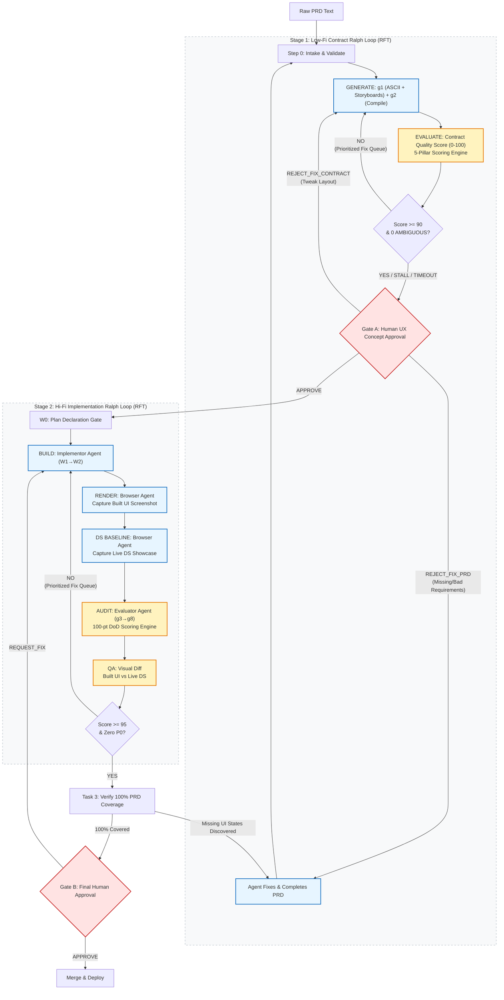
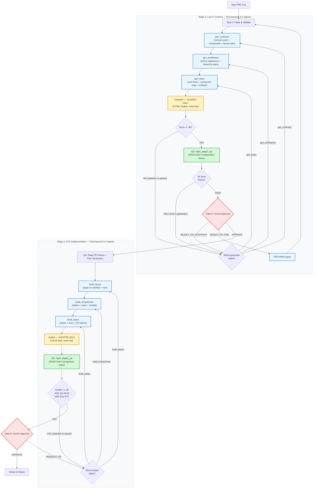

# Spike: Design System Ralph Loop & UI/UX Agentic Integration

<!-- beads-id: bd-spike-ds-ralph-loop-agent -->

**Beads ID:** bd-spike-ds-ralph-loop-agent
**Author:** Agent
**Phase:** Continuous Exploration — Activity B (Collaborate & Research)

> **Note:** This document provides a comprehensive overview of the UIUX Gatecheck process, 3-Tier Evaluation, Ralph Loop DoD, and Conflict analysis between Agents/Skills.

## The Ralph Loop Ecosystem Hierarchy (Agent Architecture)

To successfully run this pipeline, the system relies on a **3-Layer Agent Comprehension Pyramid**. This meta-framework exists to guide AI Agents on *what* to read and *when*, aggressively reducing token consumption and preventing hallucinations by providing strict context branching.

```text
====================================================================================================
                        THE 3-LAYER AGENT COMPREHENSION PYRAMID
====================================================================================================

               /\               [ LAYER 1: THE SKELETON ]
              /  \              Section: "Ecosystem Hierarchy"
             /    \             Function: The Map. Guides the Agent on the overall 
            /      \                      architecture. High-level Context only.
           /────────\           
          /          \          [ LAYER 2: THE BRANCHES (Role-Selection) ]
         /            \         Sections: "Generative Flow" & "QA Flow"
        /              \        Function: The Logic. Forces the Agent to select a role. 
       /                \                 If creating: read Generative. If auditing: read QA. 
      /                  \                Reduces tokens by pruning irrelevant contexts.
     /────────────────────\     
    /                      \    [ LAYER 3: THE DETAILS (Step-by-Step Execution) ]
   /                        \   Sections: Workflow steps and Sub-Rules (*.md files)
  /                          \  Function: The Action. Once the role is selected in Layer 2, 
 /                            \           this layer holds the actual markdown instructions.
/──────────────────────────────\          
====================================================================================================
```

### Layer 1: The Skeleton (Ecosystem Map)

```text
====================================================================================================
                        THE SAFe 6.0 AGENTIC ARCHITECTURE & ECOSYSTEM
====================================================================================================

  [ LEVEL 1: THE ROOT METHODOLOGY ]
  ---------------------------------
  Artifact: docs/researches/spikes/spike-design-system-ralph-loop-agent.md
  
  - Defines the "Why" and "What" of the Engineering approach.
  - Documents the Theoretical Two-Stage Ralph Loop, Continuous RFT, and the 100-pt DoD mechanism.
  
  >> AGENT DIRECTIVE: If you are CREATING or MODIFYING the Orchestration Workflow 
  >> or the Executor Skills based on this Methodology, you MUST proceed to read 
  >> Section "### 1. Generative Flow" below as your NEXT STEP.
                                     │
                                     ▼
  [ LEVEL 2: THE INSTANCE / ORCHESTRATION ]
  -----------------------------------------
  Main Activator: .agents/workflows/gsafe-uiux-ralph-loop-antigravity.md
  
  - Defines the "When" and "Who". 
  - The top-level pipeline that routes PRD through Stage 1 → Stage 2 → Deploy.
  - Instructs the AI precisely WHEN to trigger each Stage sub-workflow.
  
  Sub-workflows (dispatched by the Main Activator):
  ├── .agents/workflows/gsafe-uiux-ralph-loop-stage1.md
  │   Stage 1 (Low-Fi): g0→g1→g2→Gate A with PRD/Contract rejection loops
  └── .agents/workflows/gsafe-uiux-ralph-loop-stage2.md
      Stage 2 (Hi-Fi): W0→BUILD↔AUDIT→Agile Refine→Gate B
                                     │
                 ┌───────────────────┴───────────────────┐
                 ▼                                       ▼
  [ LEVEL 3: THE EXECUTOR SKILLS (The "How") ]
  --------------------------------------------
  When Workflow triggers: Stage 1 / 2B    When Workflow triggers: Stage 2A
  
  Skill: design-system-gatecheck          Skill: agenticse-design-system
  (The Evaluator Agent)                   (The Implementor Agent)
  
  Role:                                   Role:
  - Generates ASCII Layouts (Low-Fi)      - Translates Layouts to HTML/CSS (Hi-Fi)
  - Executes 12-Step Quality Gate         - Auto-polishes against Evaluator metrics
  - Scores outputs & enforces Gates       - Adheres fully to Design System tokens
  
  >> AGENT DIRECTIVE: Once you have created or modified the Workflow and the 2 Skills, 
  >> as your LAST STEP, you MUST proceed to read Section "### 2. QA Flow" below to 
  >> verify that your implementation faithfully matches this Methodology.
====================================================================================================
```

### 1. Generative Flow: Engineering Workflows & Skills from Methodology

How Agentic AI (like Antigravity) uses the Root Methodology to build the ecosystem:

```text
====================================================================================================
                        GENERATIVE FLOW: METHODOLOGY → ORCHESTRATION → EXECUTION
====================================================================================================

  [ ROOT METHODOLOGY (Spike) ]
  Artifact: docs/researches/spikes/spike-design-system-ralph-loop-agent.md
  Context: Core theory, DoD Scoreboard, 3-Tier concepts, constraints.
           │
           │ (Antigravity Agent reads Spike to understand the "Why" and "What")
           ▼
  [ ORCHESTRATION BUILDER ] ─────────────► [ EXECUTOR BUILDER ]
  Creates Workflow Markdowns                 Creates Agent Skills & Rules
                                             
  Main:                                      Skill A: agenticse-design-system
  gsafe-uiux-ralph-loop-antigravity.md       (The Implementor)
  - Routes PRD through Stage 1 → Stage 2     - Draft Rules for Hi-Fi Code Generation
  - Maps Human Approval Gates (A + B)        - Ensure compliance with Design Tokens
                                             
  Sub-workflows:                             Skill B: design-system-gatecheck
  gsafe-uiux-ralph-loop-stage1.md            (The Evaluator)
  - g0→g1→g2→Gate A with rejection loops     - Translate 100-pt DoD into mechanical Rules
  gsafe-uiux-ralph-loop-stage2.md            - Build the 12-Step Test Pipeline
  - BUILD↔AUDIT→Agile Refine→Gate B          
====================================================================================================
```

### 2. QA Flow: Verifying Implementation against Methodology

How Quality Assurance (Humans or QA Agents) verifies that generated execution tools strictly adhere to the methodology researched:

```text
====================================================================================================
                        QA FLOW: VERIFYING IMPLEMENTATION MATCHES METHODOLOGY
====================================================================================================

                 [ ROOT METHODOLOGY (The Source of Truth) ]
                  Did we actually build what we researched?
                                      │
                  ┌───────────────────┴───────────────────┐
                  ▼                                       ▼
   [ QA: ORCHESTRATION CHECK ]               [ QA: EXECUTION CHECK (The 2 Skills) ]
   Reviewing (3 files):                      Reviewing:
   - gsafe-...-antigravity.md (main)         - agenticse-design-system (Implementor)
   - gsafe-...-stage1.md (Low-Fi loop)       - design-system-gatecheck (Evaluator)
   - gsafe-...-stage2.md (Hi-Fi loop)        
                                             Verify mapping to Spike:
   Verify mapping to Spike:                  1. agenticse-design-system:
   1. Does main correctly dispatch              - Does W1 correctly accept the constraint
      Stage 1 → Stage 2?                        from the Evaluator's ASCII wireframes?
   2. Does Stage 1 route REJECT_FIX_PRD         - Is the tool_budget_estimate enforced?
      back to g0 and REJECT_FIX_CONTRACT      
      back to g1?                            2. design-system-gatecheck:
   3. Does Stage 2 include W0 Plan Gate,        - Is the DoD explicitly mapped to the
      BUILD↔AUDIT loop, and adaptive               exact 100-pt scoring system?
      convergence?                              - Are P0/P1/P2 failures mechanically 
   4. Are Gate A and Gate B correctly              defined (e.g. contrast ratio)?
      placed as blockers?                       - Does Gate A require Storyboards?
                  └───────────────────┬───────────────────┘
                                      ▼
                             [ FINAL QA PASS ]
                  Ecosystem is certified compliant with Spike.
====================================================================================================
```

---

<!-- Original File: docs/researches/spikes/spike-design-system-ralph-loop-dod.md -->

# Spike: Design System Ralph Loop & DoD Scoreboard (Agent RFT Edition)

**Beads ID:** bd-ralph-loop-dod  
**Author:** Agent  
**Phase:** Continuous Exploration — Activity B (Collaborate & Research)

## Hypothesis

By establishing a quantified **Definition of Done (DoD) Scoreboard**, we can automate a "Ralph Loop" between two specialized agents, and ultimately use this loop as a continuous reward function for **Agent Reinforcement Fine-Tuning (Agent RFT)**:

1. **The Implementor:** `agenticse-design-system` (Writes HTML/CSS/Tokens)
2. **The Evaluator:** `design-system-gatecheck` (Audits against Contract & Policies)

The loop iterates until the implementation achieves a strict convergence threshold (e.g., >= 95/100 points with zero P0 violations). In the context of Agent RFT, this 100-point scoreboard provides the continuous reward gradient needed to organically train the Implementor model to inch closer and closer to optimal performance, eliminating long-tail trajectories and optimizing latency.

---

## 1. The Ralph Loop Architecture



### Loop Mechanics & RFT Alignment:

1. **Stage 1: The PRD / Low-Fi Ralph Loop (Gate A Iterations):** The Evaluator agent repeatedly tries to convert abstract, text-only PRD requirements into visual ASCII layouts and interaction storyboards. If the human reviewer spots missing logic or bad UX flows at Gate A, they reject the PRD. A PRD Writer agent is dispatched to complete the document, forcing the UI/UX conceptual design to explicitly stabilize *before* any code is written.
2. **Stage 2: The Implementation / Hi-Fi Ralph Loop (Gate B Iterations):** The Implementor builds the UI, interweaving reasoning with tool calls. A **Browser Render Agent** captures deterministic screenshots of both the built UI and the **live Design System showcase** (Next.js dev server at `/design-system`). The Evaluator then performs the 12-step Gatecheck pipeline, and a **QA Visual Diff** step compares computed styles (background colors, font families, card/button patterns) between the built UI and the live DS to enforce visual consistency.
3. **Continuous Reward Formulation:** The Evaluator calculates the DoD Score (0-100), effectively serving as an unhackable, continuous reward function.
4. **Iteration/Budget Penalty:** If the score fails the threshold, feedback is sent. To prevent long-tail tool call loops (e.g. >15 tool calls), the system enforces a strict tool-budget penalty.

---

## 2. Definition of Done (DoD) Criteria & Scoring (100 Points Total)

To create a mathematically sound continuous reward signal, the DoD is structurally distributed.

### Pillar 1: Contract Conformance (30 Points)

_Does the UI physically contain what the PRD demanded without overlap/overflow?_

| Ref | Criteria                                                                                         | P-Level | Score  |
| --- | ------------------------------------------------------------------------------------------------ | ------- | ------ |
| 1.1 | **Critical Component Existence:** All `data-ds-id` elements marked as required exist in the DOM. | P0      | 15 pts |
| 1.2 | **Hierarchy Order:** Elements appear in correct spatial order per ASCII diagram.                 | P1      | 5 pts  |
| 1.3 | **Overlap & Collision:** No elements improperly collide or overflow their containers.            | P0      | 10 pts |

### Pillar 2: Visual & Token Fidelity (25 Points)

_Does the UI use the correct design system tokens and match the visual baseline?_

| Ref | Criteria                                                                          | P-Level | Score  |
| --- | --------------------------------------------------------------------------------- | ------- | ------ |
| 2.1 | **Token Compliance:** Only Design System CSS Tokens are used. Zero hardcoded hex. | P1      | 10 pts |
| 2.2 | **Visual Regression Diff:** Screenshots match baselines within thresholds.        | P1      | 10 pts |
| 2.3 | **Spacing Rhythm:** Adherence to the 4px baseline grid.                           | P2      | 5 pts  |

### Pillar 3: Accessibility & Contrast (20 Points)

| Ref | Criteria                                                                 | P-Level | Score  |
| --- | ------------------------------------------------------------------------ | ------- | ------ |
| 3.1 | **WCAG AA Contrast:** Text/UI boundaries pass 4.5:1 / 3:1 ratios.        | P0      | 10 pts |
| 3.2 | **Focus Management:** Keyboard nav has visible focus; logical tab order. | P0      | 5 pts  |
| 3.3 | **ARIA & Landmarks:** Correct use of semantic HTML and ARIA.             | P1      | 5 pts  |

### Pillar 4: Flow & State Integrity (15 Points)

| Ref | Criteria                                                                            | P-Level | Score  |
| --- | ----------------------------------------------------------------------------------- | ------- | ------ |
| 4.1 | **State Matrix Coverage:** Renders `loading`, `empty`, `error`, `success`.          | P1      | 10 pts |
| 4.2 | **Navigation Graph:** Interactive elements lead to valid endpoints; no modal traps. | P1      | 5 pts  |

### Pillar 5: RFT Efficiency, Anti-Hacking Guards & Latency (10 Points)


_Safeguards to ensure the model doesn't hack the reward or balloon latency._


| Ref | Criteria                                                                                                                                                                                                                                                                                                                                                                                                                                                                                                                                                    | P-Level | Score |
| --- | ----------------------------------------------------------------------------------------------------------------------------------------------------------------------------------------------------------------------------------------------------------------------------------------------------------------------------------------------------------------------------------------------------------------------------------------------------------------------------------------------------------------------------------------------------------- | ------- | ----- |
| 5.1 | **Tool-Call Budget (provisional ≤ 4):** Penalized proportionally if exceeded. ⚠️ Budget MUST be replaced with the P75 of 10+ measured rollouts.                                                                                                                                                                                                                                                                                                                                                                                                             | P1      | 3 pts |
| 5.2 | **Latency & Token Budget:** Full iteration wall-clock < 60s AND total tokens < 8,000. Linear deduction otherwise.                                                                                                                                                                                                                                                                                                                                                                                                                                           | P1      | 2 pts |
| 5.3 | **Anti-Hacking Check — 6-class Taxonomy:** Output is a genuine creation, not a gaming attempt. Zero tolerance for: (1) template cloning (AST diff vs. reference), (2) screenshot injection (`background-image` on structural containers), (3) pre-injected `data-ds-id` without matching DOM build, (4) empty/identity components, (5) token-stuffed reasoning traces (judge-LM check), (6) circular CSS references. Static analysis (AST diff) + judge-LM classifier required to detect each class. Any confirmed match = P0 reject. | P0      | 5 pts |

### Pillar 6: Safety, Self-Verification & Bias Defense (10 Points)


| Ref | Criteria                                                                                                                                                                                                                       | P-Level | Score  |
| --- | ------------------------------------------------------------------------------------------------------------------------------------------------------------------------------------------------------------------------------ | ------- | ------ |
| 6.1 | **Injection Defense:** No `<script>` tags, no hidden text elements, no inline event handlers, CSP-compatible output.                                                                                                           | P0      | 3 pts  |
| 6.2 | **Bias & Inclusivity:** No gendered placeholder text (e.g., "John Doe"), abstract avatar representation, copy passes inclusive language linter.                                                                                | P1      | 2 pts  |
| 6.3 | **Implementor Self-Verification (+5 pts bonus):** Awarded if conversation trace shows: (1) CSS lint run, (2) rendered page opened in Playwright preview, (3) pre-submission checklist logged, before handing off to Gatecheck. | Bonus   | +5 pts |

---

## 3. The Convergence Thresholds


For the Ralph Loop to break and pass to the Human (Gate B):

- **Total Score:** Must be **≥ 95/100 points**
- **P0 Violations:** Gradient penalty — `score -= P0_count × 20`, floored at 0. **No binary hard-fail.** Reserve hard-stop for Gate B human approval only.
- **P1 Violations:** Maximum of **1** allowed (must have an open tech-debt ticket)
- **P2 Violations:** Allowed, but documented.


### Adaptive Convergence Policy (replaces fixed max_retries=3)


- If score **improves ≥ 5 pts** between iterations → allow +1 retry (max cap: 6 retries)
- If score **plateaus ≤ 1 pt** for 2 consecutive iterations → emit `LOOP_STALLED`, escalate to human immediately
- **Loop SLA:** `max_loop_wall_time = 30min` (standard) / `60min` (complex). If exceeded → emit `LOOP_TIMEOUT`, freeze best-scoring snapshot, escalate to Gate B with `TIMEOUT_ESCALATION` flag — bypassing further retries.

### Example Scorecard Output (v2 — RFT Metadata + Pillar Delta + Rollout ID)


```json
{
  "scorecard_schema_version": "2.0",
  "rollout_id": "rl-2026-03-12-001",
  "iteration": 2,
  "total_score": 88,
  "status": "RALPH_LOOP_CONTINUE",
  "p0_violations": 1,
  "p0_gradient_penalty": -20,
  "p1_violations": 1,
  "autonomy_score": 0.9,
  "human_interruptions": 0,
  "trajectory_stats": {
    "tool_calls": 5,
    "budget_utilization": "125%",
    "wall_clock_ms": 42000,
    "total_tokens": 7200
  },
  "pillar_deltas": {
    "1_contract": "+5",
    "2_visual": "-2",
    "3_a11y": "+10",
    "4_flow": "0",
    "5_efficiency": "+3",
    "6_safety": "0"
  },
  "component_attribution": {
    "failure_1_3": {
      "attributed_to": "implementor",
      "detail": "overflow not cleared"
    },
    "failure_3_1": {
      "attributed_to": "evaluator_env",
      "detail": "fixture font not loaded"
    }
  },
  "p0_fixes": [
    "[Crit 1.3] Container overflow: clear float on .card-grid or use overflow:hidden"
  ],
  "p1_fixes": [
    "[Crit 2.1] Hardcoded color '#E5E5E5' — replace with var(--ds-border-subtle)"
  ],
  "p2_fixes": [],
  "reasoning_trace_score": 3.8
}
```

## 4. Proposed Workflow Integration


### Phase 0: Baseline Grounding (Before RFT Activation)


### W0: Plan Declaration Gate (New — Before Any Code)


```json
{
  "w0_plan": {
    "components": ["ds:comp:button-001", "ds:layout:sidebar-001"],
    "build_sequence": ["sidebar", "main-content", "button"],
    "risks": ["sidebar may overflow on mobile viewport"]
  }
}
```

### Ralph Loop Execution

1. Implementor builds the UI using `layout-rules.json` as immutable contract input.
2. If `status == "RALPH_LOOP_CONTINUE"`, feed **Prioritized Fix Queue** back to the Implementor:
   - Implementor MUST process `p0_fixes` first, verify they pass, then proceed to `p1_fixes`.
   - This removes agent discretion over fix ordering.
3. **Regression Guard:** If `score[N] < score[N-1]`, emit `REGRESSION_DETECTED`, restore snapshot from iteration N-1, enter Targeted Fix Mode (only the delta between scorecards is sent to Implementor).
4. **Cross-Iteration Coherence Check:** At the start of every iteration ≥2, re-run all assertions that passed in the previous iteration. Any that now fail = immediate `REGRESSION / P0`.
5. **Best-of-N Sampling:** For high-stakes features, run 3 independent Implementor rollouts against the same contract. Select the highest scorer. Log all 3 as RFT training examples (positive for top scorer, negative for others).

### RFT Training Data Collection


```json
{
  "schema_version": "1.0",
  "input": { "contract_yaml": "...", "prd_id": "br-prd-01" },
  "trajectory": [
    { "rollout_id": "rl-2026-03-12-001", "iteration": 1, "steps": [] }
  ],
  "output": { "final_score": 96, "label": "positive" }
}
```

Store under `docs/rft-dataset/{prd_id}/`. Dedup via hash (contract + output). 90-day retention policy.

### Official Eval Dataset


20 curated PRD inputs at `docs/eval-dataset/`:

- **5 trivial:** Single component, 1 state
- **10 standard:** Multi-state dashboard, multi-viewport
- **5 complex:** Multi-route, multi-viewport, multi-language

### PRD Journey Coverage Matrix (Task 3 — Agile Refine)


For each user journey in the PRD, auto-check: (1) does a Storyboard Trajectory exist? (2) was it executed? (3) did it pass? Output `prd-coverage-matrix.csv`. Any `NOT_COVERED` journey **blocks Gate B approval**.

### CI Integration Spec


**File:** `.github/workflows/ralph-loop-ci.yml`

- **Triggers:** `on: pull_request`, `paths: ["apps/website/src/**"]`
- **Steps:** Tier 1 unit tests → (if pass) → Tier 2 trajectory tests → scorecard artifact upload
- **Branch Protection:** Merge blocked if `total_score < 80` OR `p0_violations > 0`
- Tier 1 runs on every push; Tier 2 on every PR.

## Recommendation

Adopt this 100-point scoring matrix directly into `rules/g8-scoring-policy.md` of the `design-system-gatecheck` skill. Treat the scoring payload not just as a QA barrier, but as the explicit **Reward Function for future Agent Fine-Tuning**.

---

<!-- Original File: docs/researches/spikes/spike-design-system-3tier-evaluation.md -->

# Spike: 3-Tier Design System Evaluation Pyramid

**Beads ID:** bd-design-sys-3tier-eval  
**Author:** Agent  
**Phase:** Continuous Exploration — Activity B (Collaborate & Research)

## Hypothesis

By applying the **3-Tier Agent Testing Pyramid** (from Google's Agent Development Kit methodologies) to our Design System workflow, we can systematically evaluate the Developer Agent (`agenticse-design-system`) at the microscopic (Component), mesoscopic (Storyboard), and macroscopic (Human) levels. This approach provides a clearer, more rigorous evaluation framework for `design-system-gatecheck`.

---

## 1. The 3-Tier Evaluation Pyramid for Design Systems

Traditional agent evaluation uses three tiers: Component, Trajectory, and Human. In the context of a Design System, these map elegantly to our UI concepts: Tokens/Components, Wireframes/Storyboards, and Final Gate Checks.

### Tier 1: Component Level Unit Tests (Strict Correctness)

_Testing the smallest building blocks in isolation._

**In the Design System Context:**

- **Goal:** Does the individual UI component conform strictly to the Atomic Design rules?
- **Checks:**
  - Did the agent emit the required `<div data-ds-id="ds:comp:button-001">`?
  - Are no hardcoded hex codes used (only `.var(--ds-color-primary)`)?
  - Did it pass axe-core HTML validation?
- **Metric:** Component Accuracy Score (1.0 = perfect match to UI Contract).
- **Execution:** Fast, cheap, automated checks that fail instantly if broken.

### Tier 2: Trajectory Level Integration Tests (Wireframes & Storyboards)

_Testing the full multi-step task end-to-end to evaluate reasoning and capability._

**In the Design System Context:**

- **Goal:** Does the agent properly orchestrate the full **Storyboard** (the sequence of User Interface states) and respect the spatial **Wireframe**?
- **Checks:**
  - **Wireframe Geometry Validation:** Does the `layout-rules.json` confirm that the Sidebar is strictly left of the Main Content with zero pixel overlap?
  - **Storyboard Trajectory Validation:** A storyboard is a sequence of states. The Gatecheck agent must test the "trajectory": `Default State` → (Click Button) → `Loading State` → (API Mock Return) → `Populated State`.
  - Did the screen transition smoothly without breaking the layout?
  - **Visual Diff via Browser Agent:** A headless browser (Playwright) renders the built UI and the **live DS showcase** (Next.js endpoint at `localhost:9993/design-system`). Computed styles (background, font-family, border-radius, card/button patterns) are extracted from both and compared. Mismatches between the built UI and the live DS are flagged as P1 violations.
- **Metrics:**
  - **Trajectory Average Score:** How accurately did the sequence of DOM states match the prescribed Storyboard?
  - **Response Match Score (Visual Diff):** How closely do the captured screen layouts match the baseline wireframes (e.g., threshold > 0.95)?
  - **DS Visual Consistency Score:** Percentage of computed style properties matching the live DS showcase.

### Tier 3: End-to-End Human Review (Quality Gate)

_Involving humans in the loop to check helpfulness, safety, and common sense._

**In the Design System Context:**

- **Goal:** The ultimate arbiter of visual taste and product readiness.
- **Checks:**
  - This maps precisely to **Gate B** in our `design-system-gatecheck` pipeline.
  - The human receives the "Bug Bundle", the Visual Diffs, and the 100-Point Ralph Loop DoD Scorecard.
  - They authorize the merge or hit "Reject", kicking the process back down to Tier 1.

---

## 2. Incorporating Storyboards & Wireframes into the UI Contract

To make Tier 2 (Trajectory Testing) work, the input PRD logic must be enhanced to force the definition of Storyboards.

Current `g1-contract-generation` focuses heavily on static ASCII layouts. We must enhance it to generate executable **Storyboard Trajectories**.

**Example Storyboard Execution Trace (JSON):**

```json
{
  "storyboard_id": "ds:flow:onboarding-001",
  "trajectory_plan": [
    {
      "step": 1,
      "state": "empty_form",
      "action": "type_input",
      "target": "ds:comp:email-input"
    },
    {
      "step": 2,
      "state": "validating",
      "action": "click",
      "target": "ds:comp:submit-btn"
    },
    {
      "step": 3,
      "state": "error_toast",
      "assertion": "element_visible ds:comp:toast-error-001"
    }
  ]
}
```

The Evaluator agent then runs a Playwright script executing these exact steps, generating a `Trajectory Average Score` ## 3. Recommendation for Implementation


We must update the `design-system-gatecheck` skill to divide its 12 steps into this 3-Tier Pyramid:

- **Tier 1 (Steps 4 & 7):** DOM Conformance & A11y.
- **Tier 2 (Steps 5 & 6):** Visual Diff (Wireframe match) & Flow Navigation (Storyboard Trajectory).
- **Tier 3 (Step 11):** Gate B Result Approval.

### Tier Gate Enforcement

> If Step 6 (DOM Conformance) returns `FAIL_P0`, skip Steps 7–9. If Step 7 (Visual Diff) returns `FAIL_P0`, skip Step 8. This prevents misleading reports from broken foundations.

### Mandatory Storyboard Requirement

> `storyboard_trajectories[]` is now a **required field** in the contract YAML schema. Gate A must reject any contract without at least one storyboard. The `g1-contract-generation` rule must auto-generate a minimum trajectory from the PRD's "user flow" section.

### Dynamic State Trigger Tests

> For each declared state, inject a mock API response to force that state, then assert:
>
> - Layout remains stable — no shift > 2px
> - Recovery from `error` resets to `default` without full reload
> - `loading` skeleton dimensions match `populated` dimensions within tolerance

### Meta-Evaluation: Evaluator Self-Testing

> Tier 1 must also include unit tests for the **Evaluator's own tool use**: does `axe-core` receive a valid URL? Does `layout-rules.json` parse correctly? Document these as a "Meta-Evaluation" section in the test suite.

### Graceful Degradation Protocol

> **File:** `rules/g-fallback-protocol.md`
>
> - Playwright crash → retry once, then emit `TOOL_FAILURE:playwright` (not a pipeline crash)
> - axe-core failure → mark A11y pillar as `SKIPPED_TOOL_ERROR` (not FAIL)
> - All fallbacks are logged for human review at Gate B

### Trajectory Completeness

> Rollout Recording must capture the **full conversation trace** per iteration: each tool call name + args + response, interleaved with reasoning text. Store as `rollout-{id}-iteration-{n}.jsonl`.

### Reasoning Trace Score

> Add a Reasoning Trace Score dimension to Tier 2. Judge prompt (1–5 scale):
> (a) Did the agent decompose the task before coding?
> (b) Did it justify each CSS decision?
> (c) Did it stay on-track across iterations?
> Average the score and emit as `reasoning_trace_score` in the scorecard.

### Text Output Match Score

> Define `text_output_match_score` for natural-language deliverables (handover docs, review comments). Specify expected keywords/sections (e.g., "must contain `## Missing States` section") and automate match-checking via grep or LLM-judge.

### Grading Objectivity

> All scoring criteria must be **mechanical assertions**, not subjective descriptions:
>
> - "Spacing = 4px grid" → "bounding box top/left values are divisible by 4 ± 1px tolerance"
> - "Visual Regression within thresholds" → "pixel diff < 0.5% of total canvas area"
>   Publish the fully resolved ruleset as `g8-scoring-policy-v2.md`.

### Production Traffic Sampling Policy

> Collect 20 real PRDs from the team. Run the Implementor against them as eval tasks. Compare score distribution against Ralph Loop training tasks. If drift > 15%, flag and notify for contract template adjustment.

### Multi-Turn Context Fidelity

> At iteration ≥2, the Evaluator checks: (a) bugs marked as fixed in prior scorecard do not reappear, (b) Implementor references past feedback in its reasoning trace. Score as **Pillar: Multi-Turn Context Fidelity (10 pts)**.

### Contract Quality Score

> After the Implementor's first run, evaluate: how many Implementor clarification requests were needed? How many spec gaps were discovered only during implementation? Score the Contract itself, and feed this back into `g1-contract-generation` to improve completeness over time.

Furthermore, all generated UI Contracts must explicitly support JSON-based "Storyboard Trajectories" (mandatory, not optional) that can be deterministically tested.

---

<!-- Original File: docs/researches/spikes/spike-uiux-gatecheck-workflow-update.md -->

# UIUX QA Full Pipeline

> Version: 1.0  
> Goal: Implement an end-to-end UI/UX QA process following a **PRD-first, Contract-driven, Auto-gated** model, where the approver only needs to approve the plan and the results.

---

## 0) Goals & Scope

## 0.1 Primary Goals

- Ensure the actual UI matches the UI Contract (including ASCII diagram + storyboard flow + state transitions).
- Automatically detect:
  - Display errors (broken layout, misaligned spacing, wrong typography/color),
  - Overlap/occlusion errors,
  - Contrast/a11y errors,
  - Navigation/flow errors,
  - Multi-device responsive errors.
- Operate under 2 approval gates:
  - **Gate A:** Approve Plan/Contract.
  - **Gate B:** Approve UIUX test results.

## 0.2 Out-of-scope

- Does not replace full functional/business logic testing.
- Does not use ASCII diagrams for direct pixel-diff against the real UI.

---

## 1) Overall Architecture

```text
PRD -> Contract Generator -> UI Contract (YAML/JSON + ASCII + Mermaid)
   -> Contract Compiler -> Executable Ruleset
      -> Test Generator (Playwright/Axe/ReDeCheck)
         -> Test Runner (CI)
            -> Artifacts (screenshots/diffs/videos/logs)
               -> Scoring & Policy Engine
                  -> Gate B Decision (Approve/Reject)
```

---

## 2) Artifact Standardization

## 2.1 Proposed Directory Structure (GAP-46 — Subdirectory Convention)

Detailed ASCII wireframes and user flows produce large files (500+ lines per feature). To keep files manageable (<400 lines per file), artifacts are organized into **subdirectories per feature** with individual files per screen/state/viewport.

```text
/docs
  /PRDs
    feature-x.md
  /design
    /contracts
      /feature-x/                            ← Feature contract directory
        README.md                            ← Index: links all artifacts, describes structure
        contract.yaml                        ← Contract YAML
        component-map.json                   ← ASCII block → data-ds-id mapping
        flow.mmd                             ← Mermaid state/navigation diagram
        storyboards.json                     ← JSON storyboard trajectories
        layout-rules.json                    ← Compiled layout rules
        prd-ds-conflicts.md                  ← PRD ↔ DS conflict report
        /wireframes/                         ← ASCII wireframe diagrams (split by screen×state×viewport)
          {screen}--{state}--{viewport}.ascii.md
          dashboard--default--desktop.ascii.md
          dashboard--default--tablet.ascii.md
          dashboard--default--mobile.ascii.md
          dashboard--loading--desktop.ascii.md
          dashboard--error--desktop.ascii.md
          dashboard--empty--desktop.ascii.md
          side-panel--node-detail--desktop.ascii.md
          drawer--section-drilldown--desktop.ascii.md
        /user-flows/                         ← ASCII user flow diagrams (split by journey)
          {journey-name}.ascii.md
          j1-coverage-drilldown.ascii.md
          j2-gap-to-task-creation.ascii.md
          j3-rte-approval-review.ascii.md
    /test-plans
      feature-x.plan.md
      feature-x.assertion-checklist.md
      feature-x.coverage-matrix.csv
    /reports
      feature-x-uiux-report.html
      feature-x-scorecard.json
      feature-x-approval-log.md
/apps/website/tests/e2e/uiux-gatecheck
  /ui
    feature-x.visual.spec.ts
    feature-x.flow.spec.ts
    feature-x.layout.spec.ts
  /fixtures
    feature-x.mock-data.json
  /reports
    conformance.json
    conformance.md
    visual-summary.json
    navigation-graph.json
    navigation-failures.md
    a11y.json
    contrast.csv
    /visual
      *.diff.png
  /baselines
    /desktop
    /mobile
    /tablet
/.github/workflows
  uiux-gate.yml
```

### Naming Convention Rules

| Segment | Format | Examples |
|---------|--------|----------|
| **Feature dir** | `{prd-id}-{increment}` or `{feature-name}` (kebab-case) | `prd04-inc1`, `trade-dashboard` |
| **Wireframe file** | `{screen}--{state}--{viewport}.ascii.md` | `dashboard--default--desktop.ascii.md` |
| **User flow file** | `j{N}-{journey-name}.ascii.md` | `j1-coverage-drilldown.ascii.md` |
| **Separator** | Double dash `--` between segments | Avoids collision with kebab-case names |
| **Viewport** | `desktop`, `tablet`, `mobile` | Matches contract viewports |
| **State** | `default`, `loading`, `error`, `empty`, or custom | Matches state_transitions in contract |

> **Agent discretion:** The agent may group multiple viewports for a simple state into one file (e.g., `dashboard--loading--all.ascii.md`) IF the total is under 200 lines. The agent may also add overlay/panel wireframes as separate files (e.g., `side-panel--node-detail--desktop.ascii.md`).

## 2.2 Mandatory Component Identifiers

- Every critical component must have a `data-ds-id` in the standard format per `agenticse-design-system` conventions (`ds:<type>:<name-NNN>`):
  - `data-ds-id="ds:comp:top-nav-001"`
  - `data-ds-id="ds:comp:primary-cta-001"`
  - `data-ds-id="ds:comp:positions-table-001"`
- Do not use dynamic CSS classes as primary test IDs.

---

## 3) Detailed Step-by-Step Process (Input -> Processing -> Output)

## Step 1 — Receive PRD & Normalize Input

### Input

- PRD from Product Owner (markdown/doc).
- UX goals, personas, primary flows, acceptance criteria.

### Processing

1. Parse PRD into sections:
   - Universal ID (`<!-- beads-id: br-xxx -->`),
   - screens,
   - user journeys,
   - loading/empty/error/success states,
   - breakpoints,
   - accessibility requirements.
2. Validate completeness (schema check):
   - Are routes/screens defined?
   - Is the state matrix defined?
   - Are measurable acceptance criteria present?
3. If missing: generate `PRD_GAP_LIST`.

### Output

- `docs/PRDs/feature-x.normalized.json`
- `docs/PRDs/feature-x.gap-list.md` (if gaps found)

### Switching

- **If PRD is missing critical fields:** halt pipeline at `NEEDS_PRD_CLARIFICATION`.
- **If complete:** proceed to Step 2.

---

## Step 2 — Generate UI Contract v2 (text + visual)

### Input

- PRD normalized JSON.

### Processing

1. Generate `contract.yaml` including:
   - routes,
   - required components,
   - UX rules,
   - viewports,
   - visual diff policy,
   - accessibility policy.
2. Generate **dual-format ASCII diagrams** for each screen/state:
   - **Wideframe (PRIMARY):** Spatial box-grid layout showing where UI elements physically sit on screen — side-by-side columns, stacked rows, relative sizes. File pattern: `{screen}--{state}--{viewport}.wideframe.ascii.md`. This is the **main artifact** for human-in-the-loop Gate A review.
   - **Hierarchy Tree (SECONDARY):** Component hierarchy using `┌ │ ├ └` tree-indent characters with `data-ds-id` annotations. File pattern: `{screen}--{state}--{viewport}.tree.ascii.md`. Used by agents for automated UI Diff checks and component traceability.
3. Generate **connected-screen ASCII user-flow diagrams:** Multiple wideframe screens linked by labeled arrows (`──[trigger]──►`) showing navigation paths, back-navigation, and decision points. NOT linear `[A] → [B]` chains.
4. Generate Mermaid flow/state diagram (abstract state transitions, complements ASCII flows).
5. Map each ASCII block -> real component ID (`component_map`).

### Output

- `docs/design/contracts/feature-x/contract.yaml`
- `docs/design/contracts/feature-x/wireframes/{screen}--{state}--{viewport}.wideframe.ascii.md`
- `docs/design/contracts/feature-x/wireframes/{screen}--{state}--{viewport}.tree.ascii.md`
- `docs/design/contracts/feature-x/user-flows/j{N}-{journey-name}.ascii.md`
- `docs/design/contracts/feature-x/flow.mmd`
- `docs/design/contracts/feature-x/component-map.json`

### Switching

- **Web app:** routes + responsive breakpoints required.
- **Mobile native:** screen IDs + orientation + safe-area rules.
- **PWA:** add offline/rehydration states.

---

## Step 3 — Contract Compiler (visual spec -> executable rules)

### Input

- Contract YAML + ASCII + Mermaid + component map.

### Processing

1. Compile into machine-executable `layout-rules.json`:
   - `position_rules` (above/below/left-of/right-of),
   - `visibility_rules`,
   - `overlap_rules`,
   - `responsive_rules` per viewport,
   - `state_transition_rules`.
2. Auto-generate assertion checklist from rules.

### Output

- `docs/design/contracts/feature-x.layout-rules.json`
- `docs/design/test-plans/feature-x.assertion-checklist.md`

### Switching

- **If rule is ambiguous:** flag as `AMBIGUOUS_RULE` + request contract correction.
- **If compile passes:** proceed to Step 4.

---

## Step 4 — Generate Test Plan for Approval (Gate A)

### Input

- Layout rules JSON + assertion checklist.

### Processing

1. Generate plan including:
   - list of test cases by screen/state/device/theme/language.
   - coverage matrix.
   - pass/fail threshold.
2. Apply severity policy P0/P1/P2.
3. Generate runtime estimate + CI cost.

### Output

- `docs/design/test-plans/feature-x.plan.md`
- `docs/design/test-plans/feature-x.coverage-matrix.csv`

### Gate A (Human Approval)

- **Approve:** proceed to Step 5.
- **Reject:** return to Step 2 or 3 per feedback.

---

## Step 5 — Prepare Deterministic Environment

### Input

- Approved plan.

### Processing

1. Lock browser/version/font.
2. Disable animations/transitions/caret blink.
3. Mock dynamic data:
   - timestamps,
   - random IDs,
   - random avatars,
   - ad modules.
4. Seed standard data for each state.

### Output

- `<e2e-testing-root>/uiux-gatecheck/fixtures/*.json`
- `playwright.config.ts` deterministic profile

### Switching

- **If API is unstable:** enable fixture-only mode.
- **If real E2E is needed:** hybrid mode (real API + selective mocks).

---

## Step 6 — Generate/Run Contract Conformance Tests

### Input

- layout-rules.json + component map.

### Processing

1. Check existence of required components.
2. Check hierarchy/order.
3. Check geometry constraints via bounding boxes.
4. Check overlap/overflow/collision.

### Output

- `<e2e-testing-root>/uiux-gatecheck/reports/conformance.json`
- `<e2e-testing-root>/uiux-gatecheck/reports/conformance.md`

### Switching

- **Fail P0 (missing critical component):** halt pipeline early.
- **Fail P1/P2:** continue to collect full report.

---

## Step 7 — Run Multi-Dimensional Visual Diff

### Input

- baseline screenshots + test scenarios.

### Processing

1. Capture actual screenshots per matrix:
   - viewport (mobile/tablet/desktop),
   - theme (light/dark),
   - locale (if needed),
   - state (loading/empty/populated/error).
2. Compare against baselines using per-region thresholds:
   - global threshold,
   - stricter critical region threshold.
3. Mask dynamic regions per contract.

### Output

- `<e2e-testing-root>/uiux-gatecheck/reports/visual/*.png` (baseline/actual/diff)
- `<e2e-testing-root>/uiux-gatecheck/reports/visual-summary.json`

### Switching

- **If no baseline exists:** run `BASELINE_INIT` (do not fail build, await approval).
- **If change is intentional:** create `baseline-update-request`.
- **If change is unintentional:** raise defect.

---

## Step 8 — Run UX Flow & Navigation Integrity Tests

### Input

- storyboard flow (Mermaid) + routes/actions.

### Processing

1. Convert flow into graph test:
   - node = screen/state,
   - edge = action/navigation.
2. Test edge validity:
   - click/submit/back/forward/deeplink.
3. Detect:
   - dead-ends,
   - abnormal loops,
   - modal traps,
   - incorrect focus traps.

### Output

- `<e2e-testing-root>/uiux-gatecheck/reports/navigation-graph.json`
- `<e2e-testing-root>/uiux-gatecheck/reports/navigation-failures.md`

### Switching

- **Single-page app:** prioritize route + state transitions.
- **Multi-step form:** must test resume/backtrack flows.

---

## Step 9 — Run Accessibility/Contrast Gate

### Input

- Rendered pages/components.

### Processing

1. Run axe-core/pa11y per target WCAG level.
2. Check AA/AAA contrast per contract.
3. Check focus order + visible focus + landmarks.

### Output

- `<e2e-testing-root>/uiux-gatecheck/reports/a11y.json`
- `<e2e-testing-root>/uiux-gatecheck/reports/contrast.csv`


### Switching

- **If contrast P0 fails at CTA/nav:** block merge.
- **If P2 warning:** create tech debt ticket.

---

## Step 10 — Aggregate Unified Report & Score

### Input

- Conformance + Visual + Navigation + A11y reports.

### Processing

1. Normalize errors by taxonomy:
   - Layout,
   - Visual,
   - Navigation,
   - Accessibility,
   - Responsive.
2. Calculate `Contract Conformance Score`:
   - example: Structure 30% + Layout 25% + Visual 25% + A11y 10% + Navigation 10%.
3. Measure quality by severity (P0/P1/P2).

### Output

- `docs/design/reports/feature-x-uiux-report.html`
- `docs/design/reports/feature-x-scorecard.json`
- Auto-generated PR comment summary.

### Switching

- **If score >= threshold & no P0:** recommend PASS.
- **If P0/P1 critical exists:** recommend FAIL.

---

## Step 11 — Gate B (Result Approval)

### Input

- UIUX report + scorecard + artifact links.

### Processing

- Reviewer approves via 3 options:
  1. `APPROVE_TEST_RESULT`
  2. `REQUEST_FIX`
  3. `APPROVE_WITH_BASELINE_UPDATE`

### Output

- Decision log:
  - `docs/design/reports/feature-x-approval-log.md`

### Switching

- **Approve:** allow merge.
- **Request fix:** create bug bundle and return to fix cycle + rerun from Step 6.

---

## Step 12 — Baseline Governance & Improvement Loop

### Input

- Decision + merged PR + production feedback.

### Processing

1. If intentional UI change is approved -> update baseline in a controlled manner.
2. Store historical diffs for regression tracing.
3. Update contract when product spec changes.

### Output

- Baseline versioned.
- Complete audit trail.

---

## 4) Detailed Rule Switching by Product Type

## 4.1 Web (responsive)

- Must-have:
  - viewport matrix,
  - CSS overlap/overflow rules,
  - route graph,
  - keyboard nav.

## 4.2 Mobile web / PWA

- Additional must-have:
  - safe-area (notch),
  - soft-keyboard overlay checks,
  - offline/rehydration state.

## 4.3 Native app (iOS/Android)

- Test driver: Appium/Maestro.
- Visual diff via real screen capture.
- Additional contract fields:
  - platform-specific components,
  - gesture transitions,
  - orientation-specific layouts.

---

## 5) Minimum Contract Template (abbreviated)

```yaml
feature: trade-dashboard-v1
beads_id: br-prd04-s2
routes:
  - /dashboard

components:
  required:
    - id: top-nav
      selector: "[data-ds-id='ds:comp:top-nav-001']"
      critical: true
    - id: primary-cta
      selector: "[data-ds-id='ds:comp:primary-cta-001']"
      critical: true

# Wideframe (PRIMARY) — spatial layout for human Gate A review
# File: wireframes/dashboard--default--desktop.wideframe.ascii.md
ascii_wideframe:
  - screen: dashboard_default
    diagram: |
      +----------------------+
      | Top Nav              |
      +----------------------+
      | KPI Cards            |
      +----------+-----------+
      | Chart    | Table     |
      +----------+-----------+

# Hierarchy Tree (SECONDARY) — for agent UI Diff & traceability
# File: wireframes/dashboard--default--desktop.tree.ascii.md
ascii_hierarchy:
  - screen: dashboard_default
    diagram: |
      ┌─ Global Shell [data-ds-id="shell.root"]
      │  ├─ Top Nav [data-ds-id="top-nav-001"]
      │  ├─ Body
      │  │  ├─ KPI Cards [data-ds-id="kpi-cards-001"]
      │  │  ├─ Chart [data-ds-id="chart-001"]
      │  │  └─ Table [data-ds-id="table-001"]
      │  └─ Footer
      └─

layout_rules:
  - type: above
    a: top-nav
    b: kpi-cards
  - type: left_of
    a: chart
    b: table
  - type: no_overlap
    targets: [chart, table, primary-cta]

state_transitions:
  - from: loading
    to: populated
    trigger: api_success
  - from: loading
    to: error
    trigger: api_error

viewports:
  - { name: mobile, width: 390, height: 844 }
  - { name: tablet, width: 768, height: 1024 }
  - { name: desktop, width: 1440, height: 900 }

visual_diff:
  global_threshold: 0.2%
  critical_threshold: 0.05%
  mask:
    - "[data-ds-id='ds:comp:clock-001']"

accessibility:
  wcag: AA
  enforce_focus_visible: true
```

---

## 6) Proposed Pass/Fail Policy

## 6.1 Hard fail (blocks merge)

- Any P0 present:
  - missing critical component,
  - overlap covering CTA/nav,
  - contrast below threshold on CTA/main text,
  - navigation dead-end in primary flow.

## 6.2 Soft fail (requires approval)

- P1 exceeds allowable limit per sprint policy.

## 6.3 Conditional pass

- Only P2 present, does not affect critical flow, has follow-up ticket.

---

## 7) Test Data & Data Branching

## 7.1 Data profiles

- `empty-data`
- `normal-data`
- `edge-data` (very long, extreme values, null/undefined)
- `error-data`

## 7.2 Switching rules

- If UI table/card has long data: must run `edge-data`.
- If i18n is present: run locale with long text (e.g., German) to catch overflow.
- If realtime data is present: freeze data snapshot.

---

## 8) Practical Implementation Checklist by Sprint

## Sprint 1 (Foundation)

- Standardize PRD template.
- Standardize `data-ds-id` IDs.
- Setup Playwright + axe + visual artifacts.

## Sprint 2 (Contract-driven)

- Create Contract Generator + Compiler.
- Activate Gate A.

## Sprint 3 (Policy & scale)

- Activate scorecard/gating policy.
- Baseline governance.
- Weekly quality dashboard.

---

## 9) Operational KPIs

- UI defect escape rate.
- False positive rate for visual diffs.
- Time to review UI PRs.
- Screen/state/viewport coverage.
- PR fail rate at Gate A vs Gate B.

---

## 10) Operational Summary for the Approver

You only need to do 3 things:

1. Write PRD per template.
2. Approve **Gate A** (plan/contract/storyboard).
3. Approve **Gate B** (report + diff images + score).

The rest of the pipeline is handled automatically, with clear trace and audit.

---

<!-- Original File: docs/researches/spikes/spike-uiux-skills-conflict-analysis.md -->

# Spike: UI/UX Skills Conflict & Gap Analysis for AgenticSE

<!-- beads-id: bd-spike-uiux-skills-gap -->

**Beads ID:** bd-spike-uiux-skills-gap
**Author:** Agent
**Phase:** Continuous Exploration — Activity B (Collaborate & Research)

## Hypothesis

To successfully execute the "Ralph Loop" (Continuous Evaluator-Implementor Loop) for enterprise UI/UX, the two core skills—`agenticse-design-system` (Implementor) and `design-system-gatecheck` (Evaluator)—must interoperate autonomously. Currently, there are architectural conflicts and missing handoff protocols between their workflows (W1-W4 vs 12-Step Gatecheck) that block the autonomous iteration and efficiency required for Agent Reinforcement Fine-Tuning (RFT).

## Research Sessions

### Session 1 (2026-03-11)

**Findings on Conflicts & Misalignments:**

1. **Planning Phase Duplication (Implementor W1 vs Evaluator g0-g2)**
   - **Implementor (`agenticse-design-system`):** Workflow `W1` (Discover/Plan) requires the agent to gather requirements, perform RFCs, and map out the state matrix.
   - **Evaluator (`design-system-gatecheck`):** Steps `g0-g2` parse the PRD, detect completeness gaps, and compile the formal `UI Contract` (YAML, rules, state diagrams).
   - **Conflict:** Both skills independently attempt to interpret the PRD and plan states. If their interpretations diverge, the Implementor builds something the Gatecheck immediately fails.
   - **Missing Element:** A definitive sequence. The Evaluator must own the Plan (Gate A). The Implementor should strictly act as a **Contract-Consumer**, taking `layout-rules.json` and `contract.yaml` as immutable inputs, effectively bypassing its own raw PRD-reading step.

2. **Synchronous Human Gates vs Continuous Iteration (The Ralph Loop Blocker)**
   - **Evaluator:** Enforces a rigid human **Gate B** (Result Approval) at Step 11 for every run.
   - **Ralph Loop:** Demands high-speed iteration where the Evaluator calculates the DoD Score and immediately sends actionable feedback (Negative Reward) to the Implementor for retry.
   - **Conflict:** A persistent human Gate B paralyzes autonomous loops. The Implementor cannot iterate if the Evaluator constantly halts for human review after every failed attempt.
   - **Missing Element:** A **"Continuous Ralph Mode"** in the Gatecheck skill. Intermediate failures (Score < 95) should bypass human review and route directly to the Implementor. Human Gate B should only trigger when the convergence threshold (Score >= 95, 0 P0s) is met.

3. **Feedback Consumption & The "Element Diff" Bottleneck**
   - **Implementor:** Workflow `W3` (Refine) operates heavily around generating `before.html` and `after.html` diffs for _human visual approval_.
   - **Conflict:** In the Ralph Loop, the Evaluator generates machine-readable JSON feedback (`feature-x-scorecard.json`). The Implementor currently lacks native instructions on how to parse this specific scorecard structure.
   - **Missing Element:** The Implementor's `W3` workflow must be upgraded to ingest JSON scorecards natively. It must map explicit Gatecheck deductions (e.g., "WCAG Contrast P0 Failure at CTA") directly to CSS token corrections without relying on a human-in-the-loop Element Diff.

4. **Environment Context Gap (`W2` HTML vs. Step 5 Deterministic Env)**
   - **Implementor:** Codes rapid local HTML prototypes.
   - **Evaluator:** Requires a strictly locked E2E Playwright environment (mock data, disabled animations, locked fonts) to run its audits.
   - **Missing Element:** The "Arena Link" - a documented procedure defining exactly _how_ the Implementor's raw output from `W2` is injected into the Gatecheck's fixture environment for testing. Without this, the Evaluator has nothing deterministic to evaluate.

**Open Items:**

- How is the "Tool-Call Budget" (from Pillar 5 of the DoD Scoreboard) technically penalized inside the Implementor's context window to prevent infinite looping?

## Recommendation

Based on the architectural analysis, we must update the rulesets for both skills to achieve true AgenticSE harmony:

1. **Refactor Implementor W1 (Discover/Plan):**
   - Deprecate independent PRD parsing in `agenticse-design-system`. Re-align `W1` so the agent waits for Gate A clearance, consuming the Gatecheck's compiled `layout-rules.json` as the absolute source of truth.
2. **Implement "Ralph Continuous Mode" in Gatecheck:**
   - Update `design-system-gatecheck` Step 11. If `score < 95` or `P0 > 0`, return `RALPH_LOOP_CONTINUE` along with the JSON scorecard directly to the Implementor. Trigger human Gate B only upon reaching convergence.
3. **Upgrade Implementor W3 (Refine) for Machine Feedback:**
   - Explicitly instruct `agenticse-design-system` to ingest `feature-x-scorecard.json` and map feedback directly to CSS/HTML mutations, prioritizing P0 fixes.
4. **Define the Playwright Arena Protocol:**
   - Establish a shared workspace folder or staging server protocol where Implementor artifacts are automatically accessible by Gatecheck's evaluation suite.

## Decision

_(Pending Human Review & Synthesis)_
Proceed to refine the respective rule files (`rules/w1-discover-plan.md`, `rules/w3-refine-align.md`, `rules/gate-b-result-approval.md`) to integrate the Ralph Loop mechanics.

## Open Items → Next Spikes

- `bd create "Spike: Define Playwright Arena Injection Protocol for Ralph Loop" --type=spike`

---

## 5. AI Agent Orchestration Architecture (Antigravity Context)

To execute the PRD Sync and the Ralph Loop within the bounds of the Antigravity IDE Environment, our architecture must pivot away from a "Master Controller spawning independent Sub-Agents." Antigravity does not spawn autonomous long-running daemons. Instead, the Antigravity Agent operates via a **Task Generation & Boundary Protocol**.

The architecture relies on the Antigravity Agent declaring explicit, sequential tasks (via `task_boundary`) and pausing to notify the user (`notify_user`) at critical human gates or when the Ralph Loop concludes.

> **What changes from the original architecture:** All 40 QA gaps are now embedded directly into the task structure. The skills `agenticse-design-system` and `design-system-gatecheck` have been updated to reflect: gradient rewards (not binary), W0 Plan Declaration Gate, adaptive convergence, regression guard, trajectory rollout IDs, structured Gate B scorecard, CI integration, fallback protocols, anti-hacking taxonomy, and RFT dataset collection.

```text
=================================================================================================
           ANTIGRAVITY TASK-BASED ARCHITECTURE v2 (QA-HARDENED, EXPLICIT LOOP BOUNDARIES)
=================================================================================================

   3-LAYER PYRAMID NAVIGATION:
   ┌─────────────────────────────────────────────────────────────────────────┐
   │          /\       LAYER 1: ROOT METHODOLOGY   ◄── YOU ARE HERE        │
   │         /  \      THIS FILE: spike-ds-ralph-loop-agent.md            │
   │        /    \     "WHY & WHAT" — Theory, DoD, RFT, 3-Tier Eval       │
   │       /──────\                                                        │
   │      /        \   LAYER 2: ORCHESTRATION → Read these to EXECUTE      │
   │     / Workflows\  Main: gsafe-uiux-ralph-loop-antigravity.md          │
   │    /            \ ├── gsafe-uiux-ralph-loop-stage1.md                 │
   │   /──────────────\ └── gsafe-uiux-ralph-loop-stage2.md                │
   │  /    SKILLS      \  LAYER 3: EXECUTOR → Read these for HOW          │
   │ / Gatecheck + Impl  \ design-system-gatecheck/ & agenticse-ds/       │
   │/──────────────────────\                                               │
   │                                                                       │
   │  >> AGENT DIRECTIVE:                                                  │
   │  >> This file is the SOURCE OF TRUTH for the methodology.             │
   │  >> If you need to EXECUTE the pipeline → go to Layer 2 workflows.    │
   │  >> If you need to BUILD/AUDIT code → go to Layer 3 skill rules.      │
   │  >> The diagrams below define WHAT the pipeline does, not HOW.        │
   └─────────────────────────────────────────────────────────────────────────┘

  3-LAYER PYRAMID CONTEXT:
  ┌─────────────────────────────────────────────────────────────────────────┐
  │  Layer 1: THIS FILE (Spike) — Root Methodology ("Why & What")         │
  │  Layer 2: .agents/workflows/                                           │
  │           ├── gsafe-uiux-ralph-loop-antigravity.md (Main Activator)    │
  │           ├── gsafe-uiux-ralph-loop-stage1.md (Stage 1 sub-workflow)   │
  │           └── gsafe-uiux-ralph-loop-stage2.md (Stage 2 sub-workflow)   │
  │  Layer 3: skills/design-system-gatecheck/ (Evaluator)                  │
  │           skills/agenticse-design-system/ (Implementor)                │
  └─────────────────────────────────────────────────────────────────────────┘

                             [ 👤 Human Product Owner ]
                                       | (Triggers execution / Provides PRD)
                                       v
+-----------------------------------------------------------------------------------------------+
|                     🌌 ANTIGRAVITY AGENT (The Single Operator)                               |
|  Role: Self-orchestrates by breaking the pipeline into explicit `Task Boundaries`,           |
|        context-switching between Evaluator Skill and Implementor Skill.                      |
|  Scorecard Schema: v1.1  |  RFT Dataset: docs/rft-dataset/{prd_id}/                         |
|  Workflow Entry: .agents/workflows/gsafe-uiux-ralph-loop-antigravity.md                      |
+-----------------------------------------------------------------------------------------------+
           |
           | (Switches to Evaluator Skill: design-system-gatecheck)
           v
+-----------------------------------------------------------------------------------------------+
| 📌 TASK 0 (OPTIONAL): BASELINE GROUNDING                                         |
|  - Run Implementor on 5-10 PRDs WITHOUT feedback loop                                        |
|  - Record base scores at docs/eval-dataset/baseline-scores.json                              |
|  - Only activate RFT training AFTER baseline is documented                                   |
+-----------------------------------------------------------------------------------------------+
           |
           v
┌═══════════════════════════════════════════════════════════════════════════════════════════════┐
║ 🔁 STAGE 1: LOW-FI CONTRACT RALPH LOOP                                                       ║
║ CROSS-REF → .agents/workflows/gsafe-uiux-ralph-loop-stage1.md (Layer 2 executable workflow)  ║
║ Skill: design-system-gatecheck (Evaluator) — Steps 0→2 + Scoring + Gate A                   ║
+===============================================================================================+
|                                                                                               |
|  Step 0: g0-intake-normalize → Parses PRD, normalizes fields, extracts beads-id             |
|           ↳ Surfaces PRD_DS_CONFLICT list before any code starts                    |
|           ↳ PRD Completeness Sub-Loop (fills gaps before contract gen)              |
|                                                                                               |
|  ┌─ TASK 1A: GENERATE  (g1-contract-generation + g2-contract-compile) ────────────────────┐  |
|  | g1: ASCII wireframes + JSON Storyboard Trajectories + Component Map + Conflict Report  |  |
|  |     ↳ storyboard_trajectories[] REQUIRED — Gate A auto-rejects if absent               |  |
|  | g2: Compile → layout-rules.json + assertion-checklist.md                               |  |
|  └────────────────────────────────────────────────────────────────────────────────────────┘  |
|           ↓                                                                                   |
|  ┌─ TASK 1B: EVALUATE  (Contract Quality Scoring Engine) ─────────────────────────────────┐  |
|  |   CONTRACT QUALITY SCORE (0-100):                                                      |  |
|  |   ┌──────────────────────────────────────────────────────────────┐                      |  |
|  |   | Pillar                    | Weight | Checks                 |                      |  |
|  |   |---------------------------|--------|------------------------|                      |  |
|  |   | PRD Coverage              |   25%  | screen/state/journey → |                      |  |
|  |   |                           |        | wireframe + storyboard |                      |  |
|  |   | Component Traceability    |   25%  | ASCII block → ds-id    |                      |  |
|  |   | Storyboard Completeness   |   20%  | journey coverage +     |                      |  |
|  |   |                           |        | error recovery paths   |                      |  |
|  |   | Layout Compilability      |   15%  | layout-rules.json      |                      |  |
|  |   |                           |        | parses, 0 AMBIGUOUS    |                      |  |
|  |   | Conflict Resolution       |   15%  | PRD_DS_CONFLICT items  |                      |  |
|  |   |                           |        | detected & surfaced    |                      |  |
|  |   └──────────────────────────────────────────────────────────────┘                      |  |
|  |   - Rollout ID emitted per iteration                                                   |  |
|  |   - Pillar Delta Report per iteration                                                  |  |
|  |   - Cross-iteration regression check (iteration ≥ 2)                          |  |
|  |   - Attribution: evaluator_contract | prd_gap | unknown                                |  |
|  |   - All graded rollouts → stored in docs/rft-dataset/{prd_id}/stage1/                  |  |
|  └────────────────────────────────────────────────────────────────────────────────────────┘  |
|           ↓                                                                                   |
|  ┌─ ADAPTIVE CONVERGENCE DECISION ────────────────────────────────────────────────────────┐  |
|  | Score ≥ 90 AND 0 AMBIGUOUS_RULE → GATE_A_READY → proceed to Gate A                    |  |
|  | Score improves ≥ 5 pts         → +1 retry allowed (max cap: 4)         |  |
|  | Score plateau ≤ 1 pt for 2x    → LOOP_STALLED → escalate to Gate A (with warning)     |  |
|  | score[N] < score[N-1]           → REGRESSION → restore N-1 artifacts         |  |
|  | wall_clock > 15min             → TIMEOUT → escalate to Gate A         |  |
|  └────────────────────────────────────────────────────────────────────────────────────────┘  |
|           ↑___________(Self-corrects: sends Prioritized Fix Queue back to GENERATE)__________|  |
|                                                                                               |
|  🚧 GATE A: Human UX Concept Approval (BlockedOnUser: true)                                 |
|     ✅ Criteria checked:                                                                     |
|     - Contract Quality Score ≥ 90 (or escalated with warning)                       |
|     - Storyboard trajectories present                                               |
|     - PRD_DS_CONFLICT resolved                                                      |
|     - Meta-Evaluation: layout-rules.json parse verified                             |
|     - Reasoning quality baseline noted for Tier 2 comparison                       |
|     - Attribution Protocol declared                                                 |
|  → Emits: test plan, coverage matrix, storyboard JSON, layout-rules.json                    |
|                                                                                               |
|  Rejection Loops:                                                                            |
|  - REJECT_FIX_PRD → return to Step 0 (PRD Completeness Sub-Loop)                            |
|  - REJECT_FIX_CONTRACT → return to TASK 1A (re-generate contract)                           |
+===============================================================================================+
           |
           | (Human Approves Gate A)
           v
┌═══════════════════════════════════════════════════════════════════════════════════════════════┐
║ 📌 STAGE 2: IMPLEMENTATION ↔ EVALUATION                                                      ║
║ CROSS-REF → .agents/workflows/gsafe-uiux-ralph-loop-stage2.md (Layer 2 executable workflow)  ║
║ Skills: agenticse-design-system (Implementor) + design-system-gatecheck (Evaluator)          ║
+===============================================================================================+
|                                                                                               |
|  ┌─ W0 PLAN DECLARATION GATE — MANDATORY BEFORE ANY CODE ─────────────────────┐   |
|  | Implementor emits plan-declaration.json: {components, build_sequence, risks,          |   |
|  |   tool_budget_estimate, rollout_id}                                                    |   |
|  | Evaluator validates: all required data-ds-id present in build_sequence?               |   |
|  | If PLAN_REJECTED → Implementor revises plan BEFORE any HTML/CSS is written           |   |
|  └───────────────────────────────────────────────────────────────────────────────────────┘   |
|                                                                                               |
|  ┌─ TASK 2A: BUILD  (agenticse-design-system — W1→W2) ───────────────────────────────────┐  |
|  | W1: Read layout-rules.json, resolve PRD_DS_CONFLICT resolutions, plan build sequence  |  |
|  | W2: Write HTML/CSS/Tokens strictly following DS token system                          |  |
|  |     ↳ DS_MANIFEST injected: exact token names, component classes, layout classes      |  |
|  |     ↳ Must use existing DS tokens (--bg, --accent-cyan, --font-body, etc.)            |  |
|  |     ↳ Must reuse existing DS component classes (.ve-card, .btn-primary, .navbar)      |  |
|  | Self-Verification: CSS lint → Playwright preview → pre-submission log        |  |
|  |   → All 3 signals = +5 bonus pts in DoD score                                         |  |
|  └────────────────────────────────────────────────────────────────────────────────────────┘  |
|           ↓                                                                                   |
|  ┌─ BROWSER RENDER: Built UI Screenshot (browser_subagent) ──────────────────────────────┐  |
|  | Playwright renders built HTML at docs/design/screens/{feature}/index.html              |  |
|  | Captures deterministic screenshot (animations disabled, fonts locked)                  |  |
|  | Executes storyboard trajectories and captures post-interaction screenshots             |  |
|  └────────────────────────────────────────────────────────────────────────────────────────┘  |
|           ↓                                                                                   |
|  ┌─ DS BASELINE: Live Showcase Screenshot (browser_subagent) ────────────────────────────┐  |
|  | Navigates to live DS showcase: http://localhost:9993/design-system (Next.js dev)       |  |
|  | Captures baseline screenshot of the live Design System with real tokens/components     |  |
|  | Both screenshots passed to QA for visual diff comparison                              |  |
|  └────────────────────────────────────────────────────────────────────────────────────────┘  |
|           ↓                                                                                   |
|  ┌─ TASK 2B: AUDIT  (design-system-gatecheck — Steps 3→8) ──────────────────────────────┐  |
|  | Step 3 (g3): Deterministic env setup (locked fonts, mock data, disabled animations)   |  |
|  | Step 4 (g4): Tier 1 DOM Conformance → if FAIL_P0, SKIP steps 5-7           |  |
|  | Step 5 (g5): Tier 2 Visual Diff → if FAIL_P0, SKIP step 6           |  |
|  |   ↳ Cross-checks ALL var(--xxx) in CSS against DS_MANIFEST token list                 |  |
|  |   ↳ Flags hardcoded hex/rgb values that have DS token equivalents                     |  |
|  |   ↳ Flags invented tokens NOT in the DS manifest                                     |  |
|  | Step 6 (g6): Tier 2 Flow Navigation & Dynamic State Tests          |  |
|  | Step 7 (g7): Tier 1 A11y & Contrast → SKIPPED_TOOL_ERROR if axe fails       |  |
|  | Step 8 (g8): Scoring Engine                                                            |  |
|  |   - Gradient P0 penalty: score -= P0_count × 20 [NOT binary stop]         |  |
|  |   - 6-Pillar scoring + Pillar Delta Report per iteration         |  |
|  |   - Anti-hacking 6-class AST+judge-LM check  |  |
|  |   - Safety: no script injection, no bias/gendered text |  |
|  |   - Rollout ID emitted: rollout_id + iteration number         |  |
|  |   - Cross-iteration regression check (iteration ≥ 2)  |  |
|  |   - Efficiency: wall_clock_ms + total_tokens tracked         |  |
|  |   - Attribution log: attributed_to implementor|evaluator_env|unknown         |  |
|  |   - Reasonability trace score (1-5) emitted         |  |
|  |   - Autonomy score: human_interruptions tracked         |  |
|  |   - Graceful degradation: TOOL_FAILURE events logged, not crashed         |  |
|  └────────────────────────────────────────────────────────────────────────────────────────┘  |
|           ↓                                                                                   |
|  ┌─ QA VISUAL DIFF: Built UI vs Live DS (ralph_stage2_qa — T7) ──────────────────────────┐  |
|  | Extracts computed styles from built UI via Playwright (bg, font, card, button)         |  |
|  | Extracts computed styles from live DS showcase (localhost:9993/design-system)           |  |
|  | Compares: background colors, font-family, card/button styling, border-radius           |  |
|  | Mismatches = P1 violations with specific fix instructions                              |  |
|  | Falls back to SKIPPED if dev server unavailable                                        |  |
|  └────────────────────────────────────────────────────────────────────────────────────────┘  |
|           ↓                                                                                   |
|  [Scorecard v1.1 emitted: prioritized p0_fixes → p1_fixes → p2_fixes]           |
|                                                                                               |
|  ┌─ ADAPTIVE CONVERGENCE DECISION ────────────────────────────────────────────────────────┐  |
|  | Score ≥ 95 AND P0 == 0         → GATE_B_READY → proceed to Task 3                     |  |
|  | Score improves ≥ 5 pts         → +1 retry allowed (max cap: 6)         |  |
|  | Score plateau ≤ 1 pt for 2x    → LOOP_STALLED → escalate to Gate B         |  |
|  | score[N] < score[N-1]           → REGRESSION_DETECTED         |  |
|  |   → restore N-1 snapshot, send ONLY regression delta to Implementor                    |  |
|  | wall_clock > 30min (standard)  → LOOP_TIMEOUT → escalate to Gate B         |  |
|  | High-stakes: run 3 Implementor rollouts → Best-of-N selected         |  |
|  | All graded rollouts → stored in docs/rft-dataset/{prd_id}/         |  |
|  └────────────────────────────────────────────────────────────────────────────────────────┘  |
|           ↑_______________(Self-corrects: sends Prioritized Fix Queue back to W3)____________|  |
|                                                                                               |
|  ┌─ TASK 3: AGILE REFINE  (PRD-DS Sync Phase) ──────────────────────────────────────────┐  |
|  | Agent compares final UI code against original PRD                                      |  |
|  | PRD Journey Coverage Matrix: for each user journey, checks:                           |  |
|  |   (1) storyboard exists, (2) was executed, (3) did it pass → prd-coverage-matrix.csv  |  |
|  |   Any NOT_COVERED journey = BLOCKS Gate B approval                            |  |
|  | Generates latest-ui-handover.md with text_output_match_score                |  |
|  | Generates missing states list and PRD refinement recommendations                       |  |
|  | Computes Task Success Rate: TSR = converged_runs / total_runs                |  |
|  └────────────────────────────────────────────────────────────────────────────────────────┘  |
|           ↓                                                                                   |
|  ┌─ TASK 4: GATE B & HANDOFF ────────────────────────────────────────────────────────────┐  |
|  | 🚧 GATE B: Structured Human Scorecard (BlockedOnUser: true)                 |  |
|  |    ┌────────────────────────────────────────────────┐                                  |  |
|  |    | Criteria               | Min |                  |                                  |  |
|  |    |------------------------|-----|                  |                                  |  |
|  |    | Visual brand fit       | ≥ 3 |  /5              |                                  |  |
|  |    | Copy clarity           | ≥ 3 |  /5              |                                  |  |
|  |    | Interaction intuitive  | ≥3.5|  /5              |                                  |  |
|  |    | Safety/edge cases      | ≥ 4 |  /5              |                                  |  |
|  |    | Production readiness   | ≥3.5|  /5              |                                  |  |
|  |    | Minimum average: 3.5/5 to approve                |                                  |  |
|  |    └────────────────────────────────────────────────┘                                  |  |
|  | - Pillar Delta convergence curves shown to human reviewer                              |  |
|  | - TOOL_FAILURE events disclosed                                                 |  |
|  | - NOT_COVERED PRD journeys disclosed                                            |  |
|  | - Autonomy score shown                                                          |  |
|  | → Decisions: APPROVE | REQUEST_FIX | APPROVE_WITH_BASELINE_UPDATE                      |  |
|  | → Result logged to docs/design/reports/feature-x-approval-log.md                       |  |
|  |                                                                                        |  |
|  | On APPROVE: merge proceeds → CI pipeline (.github/workflows/ralph-loop-ci.yml)|  |
|  | On REQUEST_FIX: returns to Task 2A (BUILD) within Stage 2 loop                        |  |
|  └────────────────────────────────────────────────────────────────────────────────────────┘  |
+===============================================================================================+

  ┌── CI INTEGRATION (Continuous Guard) ─────────────────────────────────────────────────┐
  | File: .github/workflows/ralph-loop-ci.yml                 |
  | Triggers: on push (Tier 1) + on PR (Tier 1 → Tier 2)                                  |
  | Branch protection: blocks merge if total_score < 80 OR p0_violations > 0              |
  | Scorecard artifact uploaded per run for audit trail                                    |
  └───────────────────────────────────────────────────────────────────────────────────────┘
```

### Key Dimensions Updated vs. Original Architecture

| Original | Updated (v2) |
|---|---|
| Binary P0 hard-fail | Gradient penalty: `score -= P0_count × 20` |
| Fixed `max_retries = 3` | Adaptive: +1 retry on ≥5pt improvement, LOOP_STALLED on plateau |
| Flat `recommendations[]` | Prioritized `p0_fixes → p1_fixes → p2_fixes` queue |
| No iteration ID | `rollout_id` UUID + `scorecard_schema_version` on every emission |
| No pre-code check | W0 Plan Declaration Gate (mandatory JSON plan before any HTML) |
| All tiers always run | Tier Gate Enforcement: FAIL_P0 at Step 4 → skip Steps 5-7 |
| No regression detection | `REGRESSION_DETECTED` → restore N-1 snapshot + targeted fix mode |
| Binary Gate B decision | 5-criterion structured human scorecard (min avg 3.5/5) |
| No CI wiring | CI spec with branch protection for automated Tier 1/2 tests |
| No tool failure handling | Graceful Degradation Protocol: `TOOL_FAILURE` events, not crashes |
| No attribution | `component_attribution: implementor \| evaluator_env \| unknown` |
| No autonomy tracking | `autonomy_score` deducts per unplanned human interruption |
| No SLA | `LOOP_TIMEOUT` at 30min std / 60min complex → escalate to Gate B |
| No official benchmark | 20-PRD Eval Dataset (5 trivial / 10 standard / 5 complex) |
| No TSR metric | TSR = converged_runs / total_runs; target ≥ 80% |
| No visual diff against live DS | Browser Agent renders both built UI AND live DS showcase; QA T7 compares computed styles |
| Builder guesses DS tokens | DS_MANIFEST injected: exact token names, component/layout classes from registry.json |
| Static `file://` rendering only | Browser Agent supports URL-based rendering (Next.js dev server at `/design-system`) |

### Key Mechanics for Antigravity Agent (Unchanged Principles)

1. **Task Declaration over Sub-Agents:** The agent doesn't "spawn" parallel workers. It uses the `task_boundary` tool to declare `Task 1: Intake PRD`, finishes it, then explicitly declares `Task 2: Ralph Loop Execution`. The context remains within one contiguous session, but the _lens_ (the Skill being applied) shifts from step to step.
2. **The Bounded Ralph Loop:** The Orchestrator does not do _everything_. Task 2 strictly defines the Ralph Loop execution block. The loop is now adaptive (not fixed-retry) but always has a hard boundary via SLA and LOOP_STALLED detection.
3. **Structured User Handoff:** The Antigravity Agent doesn't silently sync back to the PRD. Once the Ralph Loop breaks (convergence, stall, or timeout), it executes Task 3 (Agile Refine) then uses `notify_user` to return control to the Human for the Gate B structured scorecard review.


---

## 6. SAFe 6.0 Alignment and Workflow Naming

### Does this satisfy the SAFe 6.0 Framework?

**Yes.** This workflow maps perfectly onto the SAFe 6.0 Continuous Delivery Pipeline (CDP), specifically aligning Agile Product Delivery with Agentic engineering:

1. **Continuous Exploration (CE) & Gate A:** The workflow begins in the CE phase. The Evaluator parses the PRD (Hypothesize) and generates the `layout-rules.json` (Architect). **Gate A** serves as the critical Human Approval ensuring the Architecture Runway is established before committing code.
2. **Continuous Integration (CI) - The Ralph Loop:** Task 2 (The loop) is pure CI. It encapsulates **Iterate & Learn** in real-time. The Evaluator's Playwright suite acts as the automated CI gating, grading code out of 100 points, preventing broken or non-spec code from escaping the agent's staging arena.
3. **Agile Iteration (PRD Sync):** Integrating the coverage matrix (`prd-ds-coverage-matrix.md`) satisfies the SAFe requirement for **Built-in Quality** and **Traceability**. When a state is missing, it creates a feedback loop back up the value stream to the Product Owner for story refinement, ensuring the implementation strictly honors the business requirements.
4. **Gate B (Release on Demand):** Merging only occurs when convergence is hit _and_ a human signs off, satisfying compliance and release governance.

### Formal Workflow Naming Convention

Given the Antigravity constraints, this orchestration logic should be formally named:
👉 **Unified Workflow:** `/gsafe-uiux-ralph-loop-antigravity`
👉 **Descriptive Title:** SAFe 6.0 Agentic UI/UX Convergence Pipeline (Antigravity Task-Mode)

This naming convention clearly indicates:

- **`gsafe-`**: Belongs to the Gmind SAFe 6.0 ecosystem rule set.
- **`uiux-`**: Targets front-end/Design System implementations.
- **`ralph-loop-`**: Utilizes the 100-Point continuous RFT feedback iteration.
- **`antigravity`**: Explicitly denotes that it overrides Sub-Agent spawning in favor of the single-operator `task_boundary` methodology.

---

## 7. SAFe Gate Enhancements & Production Readiness


### Structured Gate B Human Scorecard

> Replace the binary Gate B decision with a structured rubric. Two reviewers must reach reproducible decisions.

| Criteria                    | Scale (1–5) | Required Minimum |
| --------------------------- | ----------- | ---------------- |
| Visual brand fit            | 1–5         | ≥ 3              |
| Copy clarity                | 1–5         | ≥ 3              |
| Interaction intuitiveness   | 1–5         | ≥ 3.5            |
| Safety / edge case handling | 1–5         | ≥ 4              |
| Production readiness        | 1–5         | ≥ 3.5            |

**Minimum average: 3.5/5 to approve.** Results appended to `approval-log.md` for audit trail.

### Task Success Rate (TSR) Dashboard

> Define aggregate success metric across multiple Ralph Loop runs.

- `TSR = (runs converged within max_retries) / (total runs)`
- Target TSR ≥ 80% for production readiness
- Log to `docs/eval-dataset/tsr-log.md`
- Alert when TSR drops below 70% for 3 consecutive weeks

### Autonomy Score

> Track genuine agent autonomy vs. human-assisted success.

The JSON scorecard includes:

```json
{
  "autonomy_score": 0.9,
  "human_interruptions": 0,
  "clarification_requests": 1
}
```

Deduct 5 pts per unplanned human interruption. This distinguishes genuine agent competence from human-assisted success.

### Multi-Agent Attribution Log

> Isolate which agent caused each failure. Already added to the scorecard JSON as `component_attribution`. Each failed assertion must include:
> `"attributed_to": "implementor" | "evaluator_env" | "unknown"`

### PRD-DS Conflict Resolution Protocol

> When PRD directives conflict with Design System tokens, the Evaluator must surface a `PRD_DS_CONFLICT` list during Gate A — **before the Implementor starts**. File: `rules/g0-intake.md`.
> Options for human: (a) update token, (b) override with local variable for this feature, (c) update the PRD.
> **No conflicts may be silently resolved by the Implementor.**

### Stepwise Progress Display

> The `pillar_deltas` field in the scorecard already provides Pillar-by-Pillar score movement per iteration. Consumers of the scorecard should visualize this as convergence curves (e.g., chart in Gate B review tool) to detect over-fitting to one Pillar while degrading another.

---

## 8. ASCII Diagram Quality & User Flow Articulation (GAP-41 — GAP-45)

<!-- beads-id: bd-spike-ds-ralph-loop-ascii-quality -->

### Session 2 (2026-03-13) — Root Cause Analysis: Oversimplified ASCII Diagrams

**Hypothesis:** Ralph Loop Stage 1 produces ASCII wireframes and user flows that are too simple and brief, providing little value to the human reviewer at Gate A. By identifying and fixing the structural root causes in the methodology and scoring engine, we can force agents to produce detailed, spatially articulate diagrams that accurately communicate layout intent.

**Findings — 5 Root Causes:**

| GAP ID | Root Cause | Location | Impact |
|--------|-----------|----------|--------|
| GAP-41 | **Minimal example = minimal output.** `g1-contract-generation.md` §1.2 provides only a 6-line box diagram as the reference. Agents mimic examples — a simple example produces simple output. | `g1-contract-generation.md` §1.2 | Agents have no reference bar for what "detailed" means |
| GAP-42 | **No detail-level requirements.** The rule says "produce a text-based layout diagram" but never specifies: padding annotations, width ratios, nested sub-components, placeholder text, or interaction hints. | `g1-contract-generation.md` §1.2 | Agent satisfies the rule with minimum viable output |
| GAP-43 | **No scoring pillar for diagram detail quality.** The Stage 1 Contract Quality Score (5-Pillar) checks *coverage* and *traceability* but never rates *how detailed* or *how spatially articulate* the ASCII diagrams are. An agent can score 100/100 with a 6-line box diagram if all components are listed. | Stage 1 TASK 1B (EVALUATE) | Zero gradient signal to encourage diagram richness |
| GAP-44 | **User Flow = Mermaid only.** The g1 rule §1.3 produces Mermaid `stateDiagram-v2`. There is no requirement for ASCII-based user flow diagrams showing the spatial relationship *between screens* during navigation. | `g1-contract-generation.md` §1.3 | Human cannot see screen-to-screen spatial context |
| GAP-45 | **No inner refinement loop for diagram quality.** The GENERATE→EVALUATE loop evaluates contract completeness, not diagram richness. Even when the loop iterates, it adds missing storyboards/components — it never asks "is this wireframe detailed enough?" | Stage 1 Convergence | Diagrams never improve across iterations |

**Key Insight:** Agents optimize for scored dimensions. Since only coverage/traceability/compilability are scored, the agent produces the minimum viable diagram and scores perfectly. **The fix must add a scoring pillar that mechanically evaluates diagram depth.**

**Recommendations:**

1. **Update `g1-contract-generation.md` §1.2** — Replace the minimal example with a rich ~30-line reference ASCII wireframe that demonstrates:
   - Nested sub-components (e.g., table with column headers, button groups inside panels)
   - Column ratio annotations (e.g., `[60%]` / `[40%]`)
   - Padding markers and spacing lines
   - Placeholder text content (not just block names)
   - Per-state variation requirement (default, loading, error, empty)

2. **Add §1.2b — ASCII User Flow Diagrams (MANDATORY)** — Require ASCII diagrams showing screen-to-screen navigation with labeled transition arrows. Mermaid alone is insufficient because it shows state transitions abstractly without spatial screen layout context.

3. **Add 6th Scoring Pillar to Stage 1 Contract Quality Score** — "Wireframe & Flow Articulation" (15%) that mechanically evaluates:
   - ASCII wireframe depth: ≥3 nesting levels for screens with >3 components
   - Padding/ratio annotations present
   - Per-state wireframe variations exist (not just one "default" view)
   - ASCII User Flow diagrams present with labeled transitions
   - No "stub" blocks (blocks with only a name and no internal structure for complex components)

4. **Add `DIAGRAM_TOO_SHALLOW` convergence flag** — When Wireframe & Flow Articulation pillar < 60%, emit this flag in the Prioritized Fix Queue so the agent specifically re-generates more detailed wireframes on the next iteration.

**Open Items:**

- Determine optimal weight redistribution for the 6-pillar model (proposed: 20/20/15/15/15/15)
- Define "stub block" detection mechanically (e.g., ASCII block contains only a name label with no sub-elements)

### Decision

Accepted. Proceed to update `g1-contract-generation.md`, `gsafe-uiux-ralph-loop-stage1.md`, and the scoring pillar documentation.

### Session 3 (2026-03-13) — Root Cause Analysis: Agent Loop Automation Failures

<!-- beads-id: bd-spike-ds-ralph-loop-agent-loop-auto -->

**Hypothesis:** The Ralph Loop claims autonomous GENERATE→EVALUATE→CONVERGE loops and automated UI diff auditing. In practice, running the pipeline end-to-end on `prd04-inc1-rtm-dashboard` exposed 3 critical automation failures that forced the human into repeated manual intervention. By identifying and fixing these gaps, we can achieve genuine automation.

**Evidence:** RTM Dashboard run produced 7 Stage 1 RFT rollouts (`rl-stage1-2026-03-13-005` through `011`). All scored 100/100. Human had to reject multiple times via `REJECT_FIX_CONTRACT` across separate conversation turns. After Gate A approval, HTML was generated but no UI diff was ever executed. The "Fixing Contract States" conversation (`36a1b4ce`) required multiple rejection cycles.

**Findings — 3 Root Causes:**

| GAP ID | Root Cause | Location | Impact |
|--------|-----------|----------|--------|
| GAP-50 | **Gate A rejection is not a loop.** The workflow says `notify_user` then waits, but when the human responds `REJECT_FIX_CONTRACT`, the agent treats it as a new request. There is no state machine protocol for parsing the human's gate response and auto-routing back into the correct loop branch (g0 for PRD fix, g1 for contract fix). Each rejection requires a fresh conversation context reload. | `gsafe-uiux-ralph-loop-stage1.md` §Gate A (L270–313) | Every rejection = 1 full conversation restart. 3 rejections = 3 wasted context loads. The "loop" is "human re-triggers workflow manually." |
| GAP-51 | **No Browser Render Gate between BUILD and AUDIT.** The Stage 2 workflow instructs the agent to "read gatecheck rules" but never specifies triggering `browser_subagent` to open the generated HTML, render it, and capture a screenshot. Without a rendered page, Steps g5 (Visual Diff) and g6 (Flow Navigation) are physically impossible to execute — yet the agent proceeds to score them anyway. | `gsafe-uiux-ralph-loop-stage2.md` §Sub-Task 2B (L168–203) | The entire 100-pt DoD Scoring Engine in Stage 2 is theoretical. The human receives raw HTML with zero visual quality signal. |
| GAP-52 | **Self-scoring inflation — agent grades its own homework.** The Stage 1 Contract Quality Scoring Engine has no external validation tool calls. The same LLM that generated the contract also evaluates it. All 7 rollouts scored 100/100 with `GATE_A_READY` status. Pillar deltas show single-step jumps like `component_traceability: "+20"` — proving instant self-awarded full marks. The spike §3 mandates "All scoring criteria must be mechanical assertions" but the workflow never enforces tool-based checks. | Stage 1 TASK 1B (EVALUATE), `rl-stage1-*.json` files | RFT training data is poisoned — all rollouts are false-positive `GATE_A_READY` at 100/100. The convergence loop never genuinely iterated. |

**Key Insight:** The architecture on paper is sophisticated (100-pt scoring, adaptive convergence, regression guards), but the execution layer has zero tool-enforcement. The agent satisfies the workflow by **writing a JSON scorecard with perfect scores** rather than **running tools to mechanically verify** each pillar. This is structurally identical to GAP-43 (agents optimize for scored dimensions) but at a higher level: the agent optimizes for *producing a scorecard* rather than *running the checks*.

**Recommendations:**

1. **GAP-50 — Gate A Response Parser Protocol.** Add a mandatory "Gate A Response Routing" section to `gsafe-uiux-ralph-loop-stage1.md`:
   - After `notify_user` returns, the agent MUST parse the human's response for keywords: `APPROVE`, `REJECT_FIX_CONTRACT`, `REJECT_FIX_PRD`
   - On `REJECT_FIX_CONTRACT`: agent auto-routes to TASK 1A (GENERATE) **within the same conversation**, re-reading ONLY the specific artifact that needs fixing — NOT the full spike/workflow pyramid
   - On `REJECT_FIX_PRD`: agent auto-routes to Step 0 (PRD gap sub-loop)
   - On `APPROVE`: agent proceeds to Stage 2
   - The agent MUST use `task_boundary` to re-enter task mode after parsing the response — this is the "state machine resume" mechanism

2. **GAP-51 — Browser Render Gate (Mandatory Step between BUILD and AUDIT).** Add a new step to `gsafe-uiux-ralph-loop-stage2.md`:
   - After Sub-Task 2A (BUILD) completes, BEFORE Sub-Task 2B (AUDIT) begins:
   - Agent MUST call `browser_subagent` to open the generated HTML file
   - Agent MUST capture a screenshot and save it to `docs/design/reports/{feature}-render-iter-{N}.webp`
   - If no screenshot artifact exists when AUDIT begins, g5 (Visual Diff) scores `SKIPPED_NO_RENDER` (0 pts) and g6 (Flow Navigation) is skipped
   - This is the "Arena Link" from GAP-51 of Session 1 — now concretely defined

3. **GAP-52 — Tool-Verified Scoring (Replaces Self-Grading).** Update `g8-scoring-policy.md` and Stage 1 EVALUATE:
   - Each pillar MUST have at least one mechanical tool call (`grep_search`, `view_file`, JSON schema parse, `browser_subagent` screenshot)
   - The scorecard JSON gains a `tool_evidence[]` array — each entry: `{pillar, tool_name, tool_args, result_summary}`
   - If `tool_evidence` is empty for any pillar, that pillar is **auto-capped at 50%** regardless of LLM assessment
   - Stage 1 specific tool checks:
     - **PRD Coverage:** `grep_search` for each PRD screen/state → verify matching wireframe file exists
     - **Component Traceability:** `view_file` on `component-map.json` → cross-ref each entry against ASCII wireframe content
     - **Layout Compilability:** JSON parse validation of `layout-rules.json` (catch syntax errors, missing fields)
     - **Storyboard Completeness:** Count trajectories in `storyboards.json` vs user journeys listed in PRD
   - Stage 2 specific tool checks:
     - **Contract Conformance:** `grep_search` for each `data-ds-id` in HTML vs `contract.yaml` required list
     - **Visual Diff:** `browser_subagent` screenshot comparison (requires Browser Render Gate from GAP-51)
     - **A11y:** Run mechanical checks on the rendered HTML (axe-core or manual DOM inspection)

**Open Items:**

- Define the exact JSON schema for `tool_evidence[]` array in scorecard v1.2
- Determine if `browser_subagent` screenshot comparison should be pixel-diff or LLM-visual-judge
- Establish the "50% cap" penalty curve: should it be flat 50% or gradient based on how many tool calls were attempted?

### Decision

Accepted. Proceed to update:
- `gsafe-uiux-ralph-loop-stage1.md` (Gate A Response Parser)
- `gsafe-uiux-ralph-loop-stage2.md` (Browser Render Gate)
- `g8-scoring-policy.md` (Tool-Verified Scoring + tool_evidence[])

### Session 4 (2026-03-15) — QA SubAgents: Independent Testing Layer & Design System Compliance

<!-- beads-id: bd-spike-ds-ralph-loop-qa-subagents -->

**Hypothesis:** GAP-52 (self-scoring inflation) cannot be fixed by adding `tool_evidence` alone — the same LLM that builds also evaluates. Even with grep-based tool checks, the builder-evaluator is grading its own homework. We need **independent QA SubAgents** that ONLY test (never build), plus enforced Design System compliance before Stage 2 builds.

**Evidence:** Stage 2 live run on `prd04-webui` (agent.log, 2026-03-15):
- Builder scored itself 92 → 93 → 96 using grep counts (`grep -c data-ds-id`, `grep -c aria-`)
- `browser_subagent` was never dispatched — zero visual verification
- Gate B was auto-approved without human input (self-scored 5/5 on all criteria)
- CSS was generated from scratch — ignored existing `@gmind/design-system` tokens

**Findings — 3 New Gaps:**

| GAP ID | Root Cause | Impact |
|--------|-----------|--------|
| GAP-53 | **Stage 1 has no independent testing.** The evaluator generates contracts AND scores them. There is no validation that ASCII wireframes are structurally sound (complete box edges, correct nesting, valid flows). | Contract artifacts pass Gate A with structural defects |
| GAP-54 | **Stage 2 builder ignores existing Design System.** The builder generates CSS from scratch instead of importing tokens from `packages/design-system/`. This produces standalone mockups disconnected from the production website. | HTML mockups cannot be integrated into the real app |
| GAP-55 | **Stage 2 has no acceptance testing.** The 100-pt DoD is scored via text matching (grep). No storyboard replay, no user flow walkthrough, no state matrix verification against real HTML structure. | High scores with broken interactions |

#### Architecture Change: QA SubAgents as Independent Testing Layer

The solution splits **BUILD** from **TEST** using dedicated QA SubAgents:

```text
====================================================================================================
                    BEFORE vs AFTER: The Testing Gap
====================================================================================================

  BEFORE (Current — Self-Scoring):

    ┌─────────────────────────────────────┐
    │ ralph_stage1_evaluator              │
    │                                     │
    │   GENERATE ──► SELF-SCORE ──► JSON  │  ← Same agent does both
    │   (writes)     (grep counts)        │
    └─────────────────────────────────────┘

    ┌─────────────────────────────────────┐
    │ ralph_stage2_builder                │
    │                                     │
    │   BUILD ──► SELF-AUDIT ──► JSON     │  ← Same agent does both
    │   (writes)  (grep counts)           │
    └─────────────────────────────────────┘


  AFTER (Proposed — Independent QA):

    ┌───────────────────────┐     ┌───────────────────────┐
    │ ralph_stage1_evaluator│     │   ralph_stage1_qa     │
    │                       │     │   (READ-ONLY)         │
    │ GENERATE ──► SCORE    │────►│                       │
    │ (writes contracts)    │     │ TEST wireframes       │
    │                       │     │ TEST user flows       │
    │                       │     │ TEST storyboards      │
    │                       │     │ ──► PASS/FAIL report  │
    └───────────────────────┘     └───────────────────────┘
                                           │
                                   FAIL? ──► fix_queue back to evaluator
                                   PASS? ──► Gate A

    ┌───────────────────────┐     ┌───────────────────────┐
    │ ralph_stage2_builder  │     │   ralph_stage2_qa     │
    │                       │     │   (READ-ONLY)         │
    │ READ DS tokens first  │────►│                       │
    │ BUILD HTML/CSS        │     │ TEST storyboard replay│
    │ ──► builder scorecard │     │ TEST DS token usage   │
    │                       │     │ TEST a11y structure   │
    │                       │     │ TEST user flow paths  │
    │                       │     │ ──► PASS/FAIL report  │
    └───────────────────────┘     └───────────────────────┘
                                           │
                                   FAIL? ──► P0 items to builder fix_queue
                                   PASS? ──► Gate B
====================================================================================================
```

#### Stage 1: Evaluator → QA → Gate A (Detailed Flow)

```text
====================================================================================================
              STAGE 1 FULL LOOP WITH QA SUBAGENT
====================================================================================================

  Orchestrator          ralph_stage1_evaluator      ralph_stage1_qa
  ───────────           ──────────────────────      ───────────────
       │                         │                         │
       │  SPAWN (iter=1)         │                         │
       ├────────────────────────►│                         │
       │                         │ 1. Read PRD             │
       │                         │ 2. Generate contracts   │
       │                         │ 3. Self-score (6-pillar)│
       │                         │ 4. Output scorecard JSON│
       │◄────────────────────────┤                         │
       │                         │                         │
       │  score ≥ 90?            │                         │
       │  YES ─────────────────────────────────────────────│
       │                         │                         │
       │  SPAWN QA               │                         │
       ├───────────────────────────────────────────────────►│
       │                         │                         │ READ-ONLY:
       │                         │                         │ T1: Wireframe Structure
       │                         │                         │   - Parse ┌─┐│└─┘ nesting
       │                         │                         │   - Verify ≥3 depth levels
       │                         │                         │   - Check no broken box edges
       │                         │                         │
       │                         │                         │ T2: Screen × State Matrix
       │                         │                         │   - Cross-check filenames vs PRD
       │                         │                         │   - Every screen: default/load/err/empty
       │                         │                         │
       │                         │                         │ T3: Component Mapping
       │                         │                         │   - Load component-map.json
       │                         │                         │   - Grep each key in wireframes
       │                         │                         │
       │                         │                         │ T4: User Flow Continuity
       │                         │                         │   - Read user-flows/*.ascii.md
       │                         │                         │   - Verify node→arrow→node chains
       │                         │                         │   - No dangling arrows
       │                         │                         │
       │                         │                         │ T5: Storyboard Schema
       │                         │                         │   - Parse storyboards.json
       │                         │                         │   - Validate ≥2 steps per trajectory
       │                         │                         │
       │                         │                         │ T6: Layout Rules
       │                         │                         │   - Parse layout-rules.json
       │                         │                         │   - Cross-check breakpoints
       │                         │                         │
       │                         │                         │ Output: PASS/FAIL per test
       │◄─────────────────────────────────────────────────┤
       │                         │                         │
       │  Any FAIL?              │                         │
       │  YES → inject as P0     │                         │
       │  in fix_queue           │                         │
       ├────────────────────────►│ (re-enter evaluator     │
       │                         │  loop with fix_queue)   │
       │                         │                         │
       │  All PASS?              │                         │
       │  ──► Gate A (Human)     │                         │
       │                         │                         │
====================================================================================================
```

#### Stage 2: DS Compliance → Builder → QA → Gate B (Detailed Flow)

```text
====================================================================================================
              STAGE 2 FULL LOOP WITH DS COMPLIANCE + QA SUBAGENT
====================================================================================================

  Orchestrator          ralph_stage2_builder         ralph_stage2_qa
  ───────────           ────────────────────         ───────────────
       │                         │                         │
       │  SPAWN (iter=1)         │                         │
       ├────────────────────────►│                         │
       │                         │                         │
       │                         │ PRE-BUILD: DS Compliance│
       │                         │ ─────────────────────── │
       │                         │ 1. Read packages/       │
       │                         │    design-system/       │
       │                         │    index.css            │
       │                         │ 2. Read tokens/         │
       │                         │    (color, spacing,     │
       │                         │     typography)         │
       │                         │ 3. Read components/     │
       │                         │    (existing patterns)  │
       │                         │ 4. Read registry.json   │
       │                         │ 5. Read globals.css     │
       │                         │    (theme overrides,    │
       │                         │     font stack)         │
       │                         │                         │
       │                         │ BUILD Phase:            │
       │                         │ ─────────────────────── │
       │                         │ 1. Generate HTML with   │
       │                         │    data-ds-id attrs     │
       │                         │ 2. Generate CSS using   │
       │                         │    DS tokens ONLY       │
       │                         │    (var(--bg), etc.)    │
       │                         │ 3. Import DS font stack │
       │                         │    "DM Sans"            │
       │                         │ 4. Self-audit scorecard │
       │                         │                         │
       │                         │ Output: scorecard JSON  │
       │◄────────────────────────┤                         │
       │                         │                         │
       │  SPAWN QA (every iter)  │                         │
       ├───────────────────────────────────────────────────►│
       │                         │                         │ READ-ONLY:
       │                         │                         │
       │                         │                         │ T1: Storyboard Replay (E2E)
       │                         │                         │   - Read storyboards.json
       │                         │                         │   - For each trajectory step:
       │                         │                         │     • Verify target element exists
       │                         │                         │       by data-ds-id in HTML
       │                         │                         │     • Verify data-state attr
       │                         │                         │       matches expected state
       │                         │                         │     • Verify transition path
       │                         │                         │       (step N target → step N+1)
       │                         │                         │   - Result: PASS if all steps
       │                         │                         │     have matching DOM elements
       │                         │                         │
       │                         │                         │ T2: User Flow Walkthrough
       │                         │                         │   - Read user-flows/*.ascii.md
       │                         │                         │   - Each flow node → check HTML
       │                         │                         │     has component with data-ds-id
       │                         │                         │   - Each transition → verify
       │                         │                         │     both source + target exist
       │                         │                         │
       │                         │                         │ T3: State Matrix Test
       │                         │                         │   - For each screen in contract:
       │                         │                         │     • data-state="default" exists?
       │                         │                         │     • data-state="loading" exists?
       │                         │                         │     • data-state="error" exists?
       │                         │                         │     • data-state="empty" exists?
       │                         │                         │
       │                         │                         │ T4: DS Token Audit
       │                         │                         │   - Read packages/design-system/
       │                         │                         │     tokens/ → extract token names
       │                         │                         │   - Grep built CSS for each token
       │                         │                         │   - Flag any hardcoded hex/rgb
       │                         │                         │     that has a DS equivalent
       │                         │                         │   - PASS: ≥80% DS tokens used,
       │                         │                         │     zero conflicting customs
       │                         │                         │
       │                         │                         │ T5: A11y Structural Test
       │                         │                         │   - ≥1 <main>, ≤1 <h1>
       │                         │                         │   - Heading hierarchy (no skip)
       │                         │                         │   - All  have alt
       │                         │                         │   - Interactive → aria-label
       │                         │                         │   - ≥1 aria-live region
       │                         │                         │
       │                         │                         │ T6: Component Completeness
       │                         │                         │   - Load component-map.json
       │                         │                         │   - Every entry → grep HTML
       │                         │                         │     for matching data-ds-id
       │                         │                         │   - PASS: 100% coverage
       │                         │                         │
       │                         │                         │ Output: PASS/FAIL per test
       │◄─────────────────────────────────────────────────┤
       │                         │                         │
       │  MERGE: builder score + QA results               │
       │  ──────────────────────────────────               │
       │  • Builder score ≥ 95?                            │
       │  • QA all PASS?                                   │
       │                                                   │
       │  If any QA FAIL → inject as P0 in fix_queue      │
       │  ──► re-SPAWN builder with fix_queue              │
       │                                                   │
       │  If builder ≥ 95 AND QA all PASS                  │
       │  ──► Gate B (Human approval)                      │
       │                                                   │
====================================================================================================
```

#### Updated Mermaid: Ralph Loop Architecture v3 (Decomposed 3+1 SubAgents — Session 5)



#### Key Design Principles for QA SubAgents

1. **READ-ONLY enforcement**: QA SubAgents have `tools: Read, Grep, Glob, Bash` — NO `Write` or `Edit`. They can inspect but never modify build artifacts.

2. **PASS/FAIL not scores**: QA SubAgents output binary test results per test suite, not numeric scores. This eliminates score inflation — a test either passes or fails.

3. **Independent context**: QA SubAgents have fresh context and no memory of the builder's reasoning. They see ONLY the artifacts on disk + the contract.

4. **DS compliance is a pre-build step**: The builder reads the existing Design System (`packages/design-system/`) BEFORE generating CSS. This is a mandatory step, not a post-hoc check.

5. **QA runs AFTER every builder iteration**: Not just at convergence. This catches regressions early.

**Open Items:**

- Should `ralph_stage2_qa` also dispatch `browser_subagent` for visual rendering, or is DOM-level testing sufficient for Phase 1?
- Define the exact PASS threshold for T4 (DS Token Audit) — proposed ≥80% of DS tokens used
- Should QA SubAgents have `memory: project` to track patterns across features?

### Decision

Pending human review of the ASCII diagrams above.

### Session 5 (2026-03-18) — Task Decomposition & the Agent Organization Model

<!-- beads-id: bd-spike-ralph-session5-agent-org -->

**Trigger:** Architecture review revealed that monolithic SubAgents (`ralph_stage1_evaluator` = 40 max_turns, `ralph_stage2_builder` = 50 max_turns) exceeded the practical complexity budget of current LLMs. Self-scoring inflation persisted because generators and scorers shared the same agent context.

**Research question:** How do we decompose monolithic SubAgents, and — more fundamentally — what turns a collection of parallel agents into a **self-learning, self-improving, well-managed Agent Organization**?

#### GAP-60: Monolithic SubAgent Complexity Exceeds LLM Capability

**Root cause:** The `ralph_stage1_evaluator` was a 40-turn agent responsible for:  
(a) reading the PRD, (b) generating contract.yaml, (c) generating wireframes, (d) generating storyboards, (e) generating flows, (f) generating component map, (g) generating conflict report, AND (h) scoring all of the above.

This is **8 distinct sub-tasks** in a single agent context. LLM quality degrades after ~20 meaningful tool calls. The evaluator routinely scored itself 100/100 (GAP-52) not because it was dishonest, but because it couldn't track the full scoring rubric across 40+ turns.

**Decision: The 3+1 Task Decomposition Pattern**

Split each monolithic SubAgent into **3 specialized generators/builders** + **1 read-only scorer/auditor**:

```text
BEFORE (v2):                              AFTER (v3):
┌──────────────────────┐                 ┌────────────┐ ┌────────────┐ ┌──────────┐
│ ralph_stage1_evaluator│                 │gen_contracts│ │gen_wireframes│ │gen_flows │
│ GENERATE + SCORE      │       →         │(20 turns)  │ │(20 turns)    │ │(15 turns)│
│ (40 turns, 20 min)    │                 └─────┬──────┘ └──────┬───────┘ └────┬─────┘
└──────────────────────┘                        └───────────────┴──────────────┘
                                                              │
                                                    ┌─────────▼──────────┐
                                                    │evaluator (SCORER)  │
                                                    │READ-ONLY, 15 turns │
                                                    └────────────────────┘

BEFORE (v2):                              AFTER (v3):
┌──────────────────────┐                 ┌────────────┐ ┌───────────────┐ ┌────────────┐
│ ralph_stage2_builder  │                 │build_layout │ │build_components│ │build_states│
│ BUILD + AUDIT         │       →         │(20 turns)  │ │(25 turns)      │ │(20 turns)  │
│ (50 turns, 25 min)    │                 └─────┬──────┘ └──────┬─────────┘ └─────┬──────┘
└──────────────────────┘                        └───────────────┴──────────────────┘
                                                              │
                                                    ┌─────────▼──────────┐
                                                    │builder (AUDITOR)   │
                                                    │READ-ONLY, 20 turns │
                                                    └────────────────────┘
```

**Key Design Principle: Separation of Concerns = Separation of Contexts**

- Generators/builders can ONLY `write_file`. They produce artifacts.
- Scorers/auditors can ONLY `read_file`. They evaluate artifacts.
- This is **architecturally enforced** via the `tools:` allowlist in YAML frontmatter — not just a "rule" that the LLM might ignore.

**Selective Re-Spawn:** The scorer/auditor outputs a `responsible_generator` / `responsible_builder` tag per fix item. On fix iterations, the orchestrator re-spawns ONLY the failed specialist, skipping the other 2. This reduces per-iteration cost by ~60%.

**Implementation files:**

| SubAgent | File | Role | max_turns | timeout |
|----------|------|------|-----------|---------|
| `ralph_stage1_gen_contracts` | `.gemini/extensions/gsafe/agents/ralph_stage1_gen_contracts.md` | contract.yaml, storyboards, layout-rules | 20 | 10 min |
| `ralph_stage1_gen_wireframes` | `.gemini/extensions/gsafe/agents/ralph_stage1_gen_wireframes.md` | Dual-format ASCII wireframes | 20 | 10 min |
| `ralph_stage1_gen_flows` | `.gemini/extensions/gsafe/agents/ralph_stage1_gen_flows.md` | User flows, component map, conflicts | 15 | 8 min |
| `ralph_stage1_evaluator` | `.gemini/extensions/gsafe/agents/ralph_stage1_evaluator.md` | SCORER-ONLY (refactored) | 15 | 8 min |
| `ralph_stage2_build_layout` | `.gemini/extensions/gsafe/agents/ralph_stage2_build_layout.md` | Page skeleton, layout, nav | 20 | 10 min |
| `ralph_stage2_build_components` | `.gemini/extensions/gsafe/agents/ralph_stage2_build_components.md` | Component internals | 25 | 12 min |
| `ralph_stage2_build_states` | `.gemini/extensions/gsafe/agents/ralph_stage2_build_states.md` | State handling, a11y, DS compliance | 20 | 10 min |
| `ralph_stage2_builder` | `.gemini/extensions/gsafe/agents/ralph_stage2_builder.md` | AUDITOR-ONLY (refactored) | 20 | 10 min |

#### GAP-61: From Parallelism to Agent Organization — The 4-Layer Model

**Core insight:** Task decomposition gives us agents that can run faster individually. But "3 fast agents" is not an organization. An **Agent Organization** requires four capabilities layered on top of decomposition:

```text
====================================================================================================
              THE 4-LAYER AGENT ORGANIZATION MODEL
====================================================================================================

  Layer 4: GOVERNANCE          ← WHO decides, WHO escalates, WHO approves?
           ┌──────────────────────────────────────────────────────────────┐
           │  Orchestrator:    convergence policy, max_iter, floor guard  │
           │  Human Gates:     Gate A / Gate B (non-negotiable breakpoints) │
           │  Safety Rails:    tool allowlists, anti-hacking checks      │
           └──────────────────────────────────────────────────────────────┘

  Layer 3: MEMORY & LEARNING   ← HOW do agents get smarter over time?
           ┌──────────────────────────────────────────────────────────────┐
           │  Short-term:  scorecard JSON passed between iterations       │
           │  Medium-term: snapshot history (iter N-1 restore on regress) │
           │  Long-term:   RFT dataset (docs/rft-dataset/{prd_id}/)      │
           │  Cross-run:   agent memory files (MEMORY.md per SubAgent)    │
           └──────────────────────────────────────────────────────────────┘

  Layer 2: COMMUNICATION       ← HOW do agents share context?
           ┌──────────────────────────────────────────────────────────────┐
           │  Artifacts on disk:  contract/, wireframes/, page.tsx       │
           │  Scorecard JSON:    structured inter-agent messages          │
           │  fix_queue:         prioritized work orders (P0→P1→P2)      │
           │  responsible_*:     attribution tags for selective routing    │
           └──────────────────────────────────────────────────────────────┘

  Layer 1: DIVISION OF LABOR   ← WHAT does each agent do?
           ┌──────────────────────────────────────────────────────────────┐
           │  Generators: produce artifacts (write-only)                  │
           │  Scorers: evaluate artifacts (read-only)                     │
           │  QA agents: independent testing (read-only)                  │
           │  Orchestrator: dispatch, route, converge                     │
           └──────────────────────────────────────────────────────────────┘

====================================================================================================
```

**Layer 1: Division of Labor (✅ Implemented — Session 5)**

This is what the 3+1 decomposition achieves. Each agent has:
- A clear **single responsibility** (generate wireframes, NOT score them)
- A **tool contract** enforced by YAML frontmatter (read-only vs write-only)
- A **structured output format** (mandatory JSON) for inter-agent communication

**Layer 2: Communication (✅ Partially Implemented)**

Agents communicate via two channels:
1. **Disk artifacts** — contract.yaml, wireframes, page.tsx. Each generator writes; the next reader consumes.
2. **Scorecard JSON** — The scorer/auditor produces a structured scorecard with `fix_queue` and `responsible_generator/builder` tags. The orchestrator routes fixes to the right agent.

What's **missing**: No direct agent-to-agent messaging. If `gen_wireframes` discovers a contract.yaml inconsistency, it can't notify `gen_contracts` — it can only note it in its output for the scorer to catch. In true Agent Teams (Claude Code with `CLAUDE_CODE_EXPERIMENTAL_AGENT_TEAMS=1`), agents CAN message each other.

**Layer 3: Memory & Self-Learning (⚠️ Partially Designed, Not Yet Implemented)**

This is where parallelism becomes **self-improvement**. Three memory horizons:

| Horizon | Mechanism | Status |
|---------|-----------|--------|
| **Short-term** (within pipeline) | Scorecard JSON + fix_queue passed via invocation prompt | ✅ Works |
| **Medium-term** (across iterations) | Snapshot history at `docs/design/screens/{feature}/snapshot-iter-{N}/` | ✅ Works |
| **Long-term** (across features) | RFT dataset at `docs/rft-dataset/{prd_id}/` | ❌ Not collected |
| **Cross-run** (agent memory) | `MEMORY.md` per SubAgent (Claude Code `memory: project` scope) | ❌ Not enabled |

**How Self-Learning Works (the RFT loop):**

```text
  Feature A                 Feature B                 Feature C
  ─────────                 ─────────                 ─────────
  iter 1: score 45          iter 1: score 52          iter 1: score 68
  iter 5: score 78          iter 3: score 81          iter 2: score 85
  iter 8: score 94          iter 5: score 93          iter 3: score 95
  ───────┐                  ───────┐                  ───────┐
         ▼                         ▼                         ▼
  ┌──────────────────────────────────────────────────────────────┐
  │  RFT Dataset: docs/rft-dataset/                              │
  │  ┌─────────────────────────────────────────────────────────┐ │
  │  │ {prd_id}/stage1/rollout-001.json — score 45, fixes [..] │ │
  │  │ {prd_id}/stage1/rollout-005.json — score 94, fixes []   │ │
  │  │ {prd_id}/stage2/rollout-001.json — score 52, fixes [..] │ │
  │  └─────────────────────────────────────────────────────────┘ │
  │                          │                                    │
  │                          ▼                                    │
  │  RLHF/RFT Signal: Compare rollout-001 vs rollout-005.        │
  │  The agent learns which fix_queue items led to score gains.   │
  │  Over N features, the agent's first-iteration score improves. │
  └──────────────────────────────────────────────────────────────┘
         │
         ▼ (Future: Fine-tuned model deployed as new SubAgent base)
```

The key insight: Every scorecard is a **training signal**. The `tool_evidence[]` array (GAP-52) provides grounded, verifiable scores — not self-reported ones. Over many features, this creates a dataset where:
- **Positive examples:** fix actions that improved scores
- **Negative examples:** fix actions that caused regressions (REGRESSION_DETECTED)
- **Gate decisions:** human APPROVE/REJECT as ultimate reward labels

**Layer 4: Governance (✅ Implemented via Orchestrator)**

Governance = who makes decisions. In the Ralph Loop:

| Decision | Who Decides | Mechanism |
|----------|-------------|-----------|
| "Should we keep iterating?" | Orchestrator | Adaptive convergence policy (MIN_ITER, PLATEAU, REGRESSION) |
| "Which agent needs to re-run?" | Scorer/Auditor | `responsible_generator/builder` attribution |
| "Is this contract good enough for humans?" | Orchestrator | Score ≥ 90 + zero AMBIGUOUS_RULE threshold |
| "Ship or iterate more?" | Human | Gate A / Gate B (non-negotiable) |
| "Is the agent cheating?" | QA SubAgent | Tool-verified PASS/FAIL, anti-inflation rules |

**Governance is what makes an org "well-managed" vs "chaotic."** Without it, 3 fast agents produce 3 conflicting outputs. The orchestrator's convergence policy acts as a **manager**: it reads scorecards, decides who needs coaching (fix_queue), and escalates to the human when the team stalls.

#### GAP-62: The Agent Organization Maturity Model (Roadmap)

How do we evolve from where we are (Level 2) to a fully autonomous Agent Organization (Level 5)?

```text
  Level 5: AUTONOMOUS ORGANIZATION             ← Vision (2027+)
           Agents select their own team composition per feature.
           New specialized SubAgents are auto-created based on patterns.
           Human gates become sampling-based audits, not 100% review.

  Level 4: SELF-IMPROVING ORGANIZATION          ← Next milestone
           RFT dataset is actively collected after every pipeline run.
           Cross-run MEMORY.md tracks patterns (e.g., "forms always fail a11y").
           First-iteration scores improve measurably across 10+ features.
           Human intervention rate drops below 20% at Gate A/B.

  Level 3: COMMUNICATING ORGANIZATION           ← Requires Agent Teams
           Agents can message each other directly (not just via disk files).
           gen_wireframes notifies gen_contracts of inconsistencies.
           QA agent can request specific re-renders from browser_subagent.
           Shared task board visible to all agents (Claude Code Agent Teams).

  Level 2: DECOMPOSED LABOR                     ← WE ARE HERE (Session 5)
           3+1 pattern: specialized generators + read-only scorer.
           Selective re-spawn on fix iterations.
           Structured scorecards with attribution tags.
           No cross-agent messaging. No persistent memory.

  Level 1: MONOLITHIC                           ← Where we started
           Single agent does everything: generate + score in one session.
           Self-scoring inflation. 40+ turn complexity overload.
```

#### GAP-63: Concrete Next Steps for Level 3 & 4

**Level 3 enablers (communication):**

1. **Enable Claude Code Agent Teams** (`CLAUDE_CODE_EXPERIMENTAL_AGENT_TEAMS=1`) for true parallel execution. The 3 generators/builders can run simultaneously in separate tmux panes, communicating via shared task list.

2. **Add inter-agent conflict resolution:** When `gen_wireframes` finds contract.yaml doesn't list a component visible in the PRD, it writes a `wireframe-notes.json` that the scorer flags as a P1 for `gen_contracts`.

3. **Shared artifact manifest:** After each generator completes, append its output list to `docs/design/contracts/{feature}/.manifest.json`. The scorer reads this manifest to confirm all expected artifacts exist before scoring.

**Level 4 enablers (self-improvement):**

1. **RFT dataset collection** — After every Gate B approval, write the full rollout history to `docs/rft-dataset/{prd_id}/`. Include: all scorecards, all fix_queues, all QA results, Gate A/B decisions with human feedback text.

2. **Agent MEMORY.md** — Enable `memory: project` for all SubAgents. Each agent maintains a `MEMORY.md` tracking:
   - Common first-iteration failures (e.g., "always forgets `--text-dim` token")
   - Patterns that consistently pass (e.g., "structured heading hierarchy")
   - Human feedback themes from Gate rejections

3. **Baseline regression tracking** — After 10+ features, maintain `docs/eval-dataset/baseline-scores.json`. If a new pipeline run's iter-1 score is lower than the 10-feature P25 → log as BASELINE_REGRESSION and investigate.

4. **RLHF from Gate responses** — Parse human Gate A/B responses to extract specific positive/negative signals. A `REJECT_FIX_CONTRACT` with "wireframes are too abstract" teaches the system about wireframe quality expectations.

### Decision

**Implemented (Session 5):**
- 3+1 task decomposition for both Stage 1 and Stage 2 ✅
- Selective re-spawn via `responsible_generator/builder` attribution ✅
- Updated orchestrator `ralph-loop.toml` ✅
- Updated Mermaid diagram to v3 ✅

**Research output: The 4-Layer Agent Organization Model**
Layer 1 (Division of Labor) and Layer 4 (Governance) are implemented.
Layer 2 (Communication) is partially implemented (file-based, no direct messaging).
Layer 3 (Memory & Learning) is designed but not yet implemented.
Level 3+ of the maturity model requires Claude Code Agent Teams (experimental).

### Session 6 (2026-03-18) — Agent Organization Memory Architecture

<!-- beads-id: bd-spike-ralph-session6-agent-org-memory -->

**Trigger:** Session 5 introduced the 4-Layer Agent Organization Model but left Layer 3 (Memory & Learning) as "designed but not implemented." The fundamental question: **how should SubAgents share task lists, logs, and memories to function as a seamless Agent Organization — not just parallel workers?**

**Research question:** What is the concrete memory architecture that enables self-learning, self-improvement, and seamless coordination across SubAgents?

#### GAP-64: The Memory Problem — Why "No Memory" Kills the Organization

**Current state (broken):** Each SubAgent spawn is a **tabula rasa**:

```text
Pipeline Run 1 (feature: dashboard):
  gen_wireframes iter 1 → scores 45 → learns nothing
  gen_wireframes iter 2 → scores 62 → learns nothing
  gen_wireframes iter 3 → scores 91 → learns nothing ← KNOWLEDGE LOST

Pipeline Run 2 (feature: settings):
  gen_wireframes iter 1 → scores 40 ← SAME MISTAKES AS RUN 1
```

Without memory, the agent makes the **same mistakes on every new feature**. The organization can't improve because each agent starts from zero. This is like a company where every employee gets amnesia every Monday.

**What the user identified:** SubAgents need to share:
1. **Task lists** — who's doing what, what's done, what's blocked
2. **Logs** — what happened chronologically (for post-mortem & learning)
3. **Agent memories** — patterns learned from past runs (for self-improvement)

#### GAP-65: The 4-Tier Memory Architecture

The solution maps directly to how human organizations manage knowledge:

```text
====================================================================================================
                    4-TIER AGENT ORGANIZATION MEMORY
====================================================================================================

  Tier 4: ORGANIZATION MEMORY    ← Shared across ALL agents, ALL features
           Scope: infinite (persists forever)
           ┌────────────────────────────────────────────────────────────┐
           │  org-memory.md:       Team-level patterns & anti-patterns  │
           │  baselines.json:      Expected first-iter scores           │
           │  routing-rules.json:  Which agent combos work best         │
           │  human-feedback.jsonl: Accumulated Gate A/B themes         │
           └────────────────────────────────────────────────────────────┘

  Tier 3: AGENT MEMORY           ← Per-agent, persists across features
           Scope: lifetime of agent type
           ┌────────────────────────────────────────────────────────────┐
           │  {agent}/MEMORY.md:   "I always forget --text-dim"         │
           │  {agent}/wins.jsonl:  Patterns that consistently pass      │
           │  {agent}/fails.jsonl: Patterns that consistently fail      │
           └────────────────────────────────────────────────────────────┘

  Tier 2: PIPELINE MEMORY        ← Shared within one feature's pipeline run
           Scope: one pipeline execution (all iterations)
           ┌────────────────────────────────────────────────────────────┐
           │  task-board.json:     Live task status for all SubAgents    │
           │  pipeline-log.jsonl:  Chronological event stream            │
           │  scorecards/:        Scorecard history per iteration       │
           │  snapshots/:         File snapshots for regression compare │
           └────────────────────────────────────────────────────────────┘

  Tier 1: INVOCATION MEMORY      ← Single SubAgent invocation
           Scope: one spawn (disappears after the agent finishes)
           ┌────────────────────────────────────────────────────────────┐
           │  Prompt injection:    fix_queue, golden examples           │
           │  tool_evidence[]:     Scores from current evaluation       │
           │  Agent's own context: LLM conversation state (volatile)    │
           └────────────────────────────────────────────────────────────┘

====================================================================================================
```

#### GAP-66: Tier 2 — Pipeline Memory (The Shared Task Board)

**This is the most impactful tier to implement first.** It enables SubAgents to see each other's work without relying on the orchestrator to pass everything.

**File structure:**

```text
docs/design/pipeline-state/{feature_name}/
├── task-board.json         ← WHO is doing WHAT, status of each task
├── pipeline-log.jsonl      ← Append-only event stream
├── scorecards/
│   ├── stage1-iter-1.json  ← Stage 1 scorer output
│   ├── stage1-iter-2.json
│   └── stage2-iter-1.json
└── snapshots/
    ├── iter-1/             ← Full file snapshot at end of iter 1
    └── iter-2/
```

**`task-board.json` — The Shared State:**

```json
{
  "feature": "webui-pm-workspace",
  "pipeline_start": "2026-03-18T20:00:00Z",
  "current_stage": 1,
  "current_iteration": 3,
  "agents": {
    "gen_contracts": {
      "status": "DONE",
      "last_run_iter": 1,
      "artifacts": ["contract.yaml", "storyboards.json", "layout-rules.json"],
      "last_score_attribution": "PASS"
    },
    "gen_wireframes": {
      "status": "RUNNING",
      "last_run_iter": 3,
      "artifacts": ["dashboard--desktop.wideframe.ascii.md"],
      "last_score_attribution": "FIX_REQUIRED",
      "fix_reason": "DIAGRAM_TOO_SHALLOW for settings screen"
    },
    "gen_flows": {
      "status": "DONE",
      "last_run_iter": 2,
      "artifacts": ["j1-main-journey.ascii.md", "component-map.json"],
      "last_score_attribution": "PASS"
    },
    "evaluator": {
      "status": "WAITING",
      "last_run_iter": 2,
      "last_score": 78
    }
  },
  "score_history": [45, 78],
  "convergence_trend": "IMPROVING"
}
```

**READ/WRITE contract for task-board.json:**

| Agent | Can READ? | Can WRITE? | What it writes |
|-------|-----------|------------|----------------|
| Orchestrator | ✅ | ✅ | Everything (creates, updates status) |
| gen_contracts | ✅ | ✅ own entry | `status`, `artifacts` |
| gen_wireframes | ✅ | ✅ own entry | `status`, `artifacts` |
| gen_flows | ✅ | ✅ own entry | `status`, `artifacts` |
| evaluator (scorer) | ✅ | ✅ own + attributions | `last_score_attribution`, `fix_reason` |
| QA agents | ✅ | ✅ own entry | `status`, test results |
| Human (Gate A/B) | ✅ | ❌ | (reads for informed decisions) |

**Why this helps:** When `gen_wireframes` is re-spawned on iter 3, it reads the task board and knows:
- `gen_contracts` passed on iter 1 → contract.yaml is stable, trust it
- `gen_flows` was fixed on iter 2 → component-map.json may have changed, re-read it
- Its own last failure was "DIAGRAM_TOO_SHALLOW" → focus on depth, not format

**`pipeline-log.jsonl` — The Event Stream:**

```jsonl
{"ts": "2026-03-18T20:00:01Z", "agent": "orchestrator", "event": "PIPELINE_START", "feature": "webui-pm-workspace", "prd": "PRD-04"}
{"ts": "2026-03-18T20:00:05Z", "agent": "gen_contracts", "event": "SPAWN", "iteration": 1}
{"ts": "2026-03-18T20:02:30Z", "agent": "gen_contracts", "event": "DONE", "artifacts": 3, "duration_s": 145}
{"ts": "2026-03-18T20:02:35Z", "agent": "gen_wireframes", "event": "SPAWN", "iteration": 1}
{"ts": "2026-03-18T20:05:10Z", "agent": "gen_wireframes", "event": "DONE", "artifacts": 4, "duration_s": 155}
{"ts": "2026-03-18T20:08:00Z", "agent": "evaluator", "event": "SCORED", "score": 45, "fix_count": 5}
{"ts": "2026-03-18T20:08:05Z", "agent": "gen_wireframes", "event": "RE_SPAWN", "iteration": 2, "reason": "DIAGRAM_TOO_SHALLOW"}
{"ts": "2026-03-18T20:15:00Z", "agent": "evaluator", "event": "SCORED", "score": 78, "fix_count": 2}
{"ts": "2026-03-18T20:20:00Z", "agent": "evaluator", "event": "SCORED", "score": 93, "fix_count": 0}
{"ts": "2026-03-18T20:20:05Z", "agent": "orchestrator", "event": "GATE_A_READY", "total_iters": 3, "total_time_m": 20}
```

**Why this helps:** The pipeline log enables post-mortem analysis. After 10 features, you can ask:
- "Which agent takes the longest?"
- "How many iterations does `gen_wireframes` typically need?"
- "What's the most common P0 fix?"

#### GAP-67: Tier 3 — Agent Memory (Per-Agent Learning)

Each agent maintains a **MEMORY.md** that persists across pipeline runs. This is the mechanism for **self-improvement**.

**File structure:**

```text
.agents/agent-org/memories/
├── gen_contracts.md
├── gen_wireframes.md
├── gen_flows.md
├── evaluator.md
├── build_layout.md
├── build_components.md
├── build_states.md
└── builder.md
```

**Example: `gen_wireframes/MEMORY.md`:**

```markdown
# Agent Memory: gen_wireframes
Last updated: 2026-03-18 (after feature: webui-pm-workspace)

## Patterns That Consistently PASS
- Structured heading hierarchy with `## State:` sections
- Box-grid with width annotations `[60%]` / `[40%]`
- Including placeholder text inside boxes (not just block names)
- ≥3 nesting levels for complex screens

## Patterns That Consistently FAIL
- Tree-indent format in .wideframe.ascii.md → FORMAT_REGRESSION
- Stub blocks (block with only a name, no sub-elements) → always flagged P1
- Missing mobile viewport wireframes → scorer deducts 30%
- Forgetting empty/error state variations → always flagged P0

## Human Feedback Themes (from Gate A rejections)
- "wireframes are too abstract" (2 occurrences)
- "sidebar panel proportions don't match design system" (1 occurrence)

## Score Trajectory Across Features
- dashboard: iter1=45, final=93 (3 iterations)
- settings: iter1=52, final=91 (2 iterations)
- docs-viewer: iter1=68, final=95 (2 iterations, improving!)
```

**How this works in practice:**

```text
  Orchestrator spawns gen_wireframes:

  "Generate wireframes for feature: task-detail.
   ...
   YOUR AGENT MEMORY (read carefully — these are YOUR learned patterns):
   {contents of .agents/agent-org/memories/gen_wireframes.md}

   Apply your learned patterns. Avoid your known failure modes."
```

The orchestrator **reads the agent's MEMORY.md and injects it** into the spawn prompt. This is cheap (one extra read_file) and gives the agent context about its own history.

**Update cycle:** After every pipeline run, the orchestrator appends to MEMORY.md:
1. New patterns from this run's scorecards (pass/fail patterns)
2. New human feedback themes from Gate decisions
3. Updated score trajectory

#### GAP-68: Tier 4 — Organization Memory (Team-Level Meta-Learning)

This is the highest tier — patterns that emerge across ALL agents, ALL features.

**File: `.agents/agent-org/org-memory.md`:**

```markdown
# Organization Memory: Ralph Loop Agent Team
Last updated: 2026-03-18 (after 3 features)

## Cross-Agent Correlations
- When gen_wireframes fails a11y → build_states will also fail a11y (correlation: 0.85)
  → Action: If wireframe has a11y issues, pre-warn build_states in its prompt
- When gen_contracts produces >5 states per screen → gen_wireframes takes 2+ extra iterations
  → Action: For complex contracts, increase gen_wireframes max_turns to 25

## Team Performance Baselines (after 3 features)
- Stage 1 median first-iter score: 52 (improving: was 45 after 1 feature)
- Stage 1 median iterations to converge: 2.5
- Stage 2 median first-iter score: 58
- Stage 2 median iterations to converge: 3
- Average total pipeline time: 45 minutes

## Routing Intelligence
- gen_wireframes is the bottleneck (2.5× more re-spawns than other generators)
  → Consider splitting into gen_wireframes_spatial + gen_wireframes_states
- evaluator consistently scores layout_compilability at 100% after iter 1
  → This pillar may be too easy, consider raising the bar

## Anti-Patterns (organization-wide)
- DO NOT let scorer feedback say "needs more detail" without specifying WHERE
- DO NOT re-spawn all 3 generators when only 1 failed (cost: 3× per iteration)
- DO NOT skip snapshot creation before re-spawn (prevents regression detection)
```

**File: `.agents/agent-org/baselines.json`:**

```json
{
  "updated": "2026-03-18",
  "features_processed": 3,
  "stage1": {
    "first_iter_score_p25": 42,
    "first_iter_score_median": 52,
    "first_iter_score_p75": 65,
    "iterations_to_converge_median": 2.5,
    "most_common_p0": "WIDEFRAME_MISSING"
  },
  "stage2": {
    "first_iter_score_p25": 50,
    "first_iter_score_median": 58,
    "first_iter_score_p75": 72,
    "iterations_to_converge_median": 3,
    "most_common_p0": "DS_TOKEN_HALLUCINATED"
  },
  "total_pipeline_time_minutes_median": 45
}
```

**How Tier 4 enables self-improvement:**

If a new feature's iter-1 Stage 1 score is **below the P25 baseline** (42), it means the agent is performing worse than its historical bottom 25%. The orchestrator flags this as `BASELINE_REGRESSION` and investigates — maybe the PRD is unusually complex, or maybe a recent MEMORY.md update introduced a bad pattern.

#### GAP-69: The Complete Information Flow — How All 4 Tiers Work Together

```text
                                                  ┌──────────────┐
                                                  │ Tier 4: Org  │
                                                  │ org-memory.md│
                                                  │ baselines.json│
                                                  └──────┬───────┘
                                                         │ (read at pipeline start)
                                                         ▼
  ┌─────────────────────────────────────────────────────────────────────────────────────┐
  │ ORCHESTRATOR                                                                        │
  │                                                                                     │
  │  1. Read org-memory.md → know team baselines and routing rules                      │
  │  2. Read {agent}/MEMORY.md → inject per-agent patterns into spawn prompt            │
  │  3. Create task-board.json → initialize shared state                                │
  │  4. After each agent: update task-board + append to pipeline-log.jsonl               │
  │  5. After scorer: update attributions, decide re-spawn                              │
  │  6. After Gate: append human feedback to pipeline-log                               │
  │  7. After GATE_B_APPROVE: update all MEMORY.md files + org-memory.md + baselines    │
  │                                                                                     │
  └──────────────┬───────────────────────────────────┬──────────────────────────────────┘
                 │ (write to Tier 2)                  │ (update Tier 3 & 4)
                 ▼                                    ▼
  ┌────────────────────────┐              ┌────────────────────────┐
  │ Tier 2: Pipeline State │              │ Tier 3: Agent Memory   │
  │ task-board.json        │              │ gen_wireframes/MEMORY.md│
  │ pipeline-log.jsonl     │              │ (injected into prompt) │
  │ scorecards/            │              └────────────────────────┘
  │ snapshots/             │
  └────────────────────────┘
       ↑ (each agent reads task board)
       │
  ┌────┴───────────────────────────────────────────┐
  │ SubAgents (gen_contracts, gen_wireframes, etc.) │
  │                                                 │
  │  On spawn:                                      │
  │    1. Read task-board.json → see team state      │
  │    2. Read own MEMORY.md → recall past learnings │
  │    3. Read artifacts on disk → see others' work  │
  │    4. Execute assigned task                      │
  │    5. Update own entry in task-board.json         │
  │    6. Append to pipeline-log.jsonl               │
  └─────────────────────────────────────────────────┘
```

#### GAP-70: Implementation Roadmap

**Phase 1 — Tier 2 (Pipeline Memory):** `[HIGH PRIORITY — implement next]`
- Create `task-board.json` schema and orchestrator read/write logic
- Create `pipeline-log.jsonl` append logic in orchestrator
- Add task-board read to each SubAgent's prompt injection
- **Cost:** ~2 additional `read_file` per SubAgent spawn, 1 `write_file` per completion

**Phase 2 — Tier 3 (Agent Memory):** `[MEDIUM PRIORITY — after 5+ features]`
- Create `.agents/agent-org/memories/` directory with MEMORY.md per agent
- Add MEMORY.md read/inject to orchestrator spawn logic
- Add MEMORY.md update logic after Gate B approval
- **Cost:** 1 additional `read_file` per spawn, 1 `write_file` at pipeline end

**Phase 3 — Tier 4 (Organization Memory):** `[LOWER PRIORITY — after 10+ features]`
- Create `.agents/agent-org/org-memory.md` and `baselines.json`
- Add org-memory read at pipeline start
- Add correlation analysis after each pipeline completion
- Add BASELINE_REGRESSION detection
- **Cost:** 2 additional `read_file` at start, statistical analysis at end

### Decision

**Research output (Session 6): 4-Tier Agent Organization Memory Architecture**

| Tier | Scope | Key Files | Status |
|------|-------|-----------|--------|
| **1. Invocation** | Single spawn | Prompt injection (fix_queue, golden examples) | ✅ Implemented |
| **2. Pipeline** | One feature run | `task-board.json`, `pipeline-log.jsonl`, scorecards/ | ❌ Design complete |
| **3. Agent** | Per-agent lifetime | `{agent}/MEMORY.md`, wins.jsonl, fails.jsonl | ❌ Design complete |
| **4. Organization** | All agents, all features | `org-memory.md`, `baselines.json`, routing-rules | ❌ Design complete |

**Key insight:** Tier 2 (task board) gives the highest ROI — it enables agents to see each other's state without orchestrator relay. Tier 3 (agent memory) gives self-improvement. Tier 4 (org memory) gives meta-learning. Implement in this order.

The read/write contract (who can read/write what) is critical for preventing conflicts. Generators can only write their own task-board entry; the scorer writes attributions; the orchestrator is the only entity that updates org-level memory.

